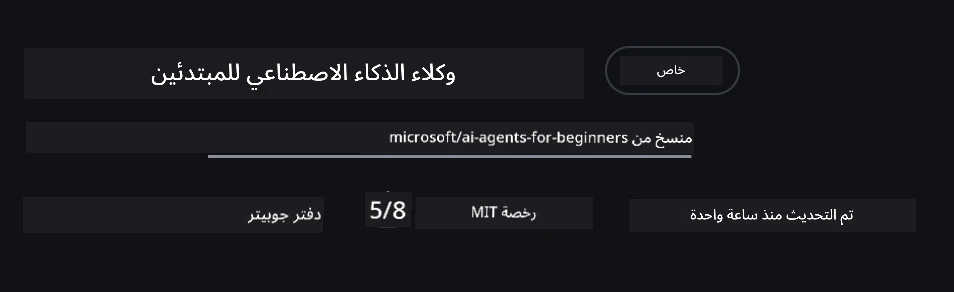
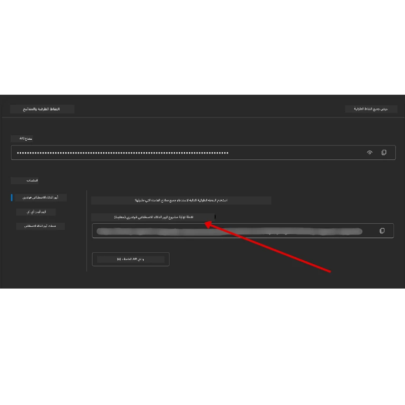

# إعداد الدورة

## مقدمة

ستغطي هذه الدرس كيفية تشغيل عينات الكود لهذه الدورة.

## انضم إلى المتعلمين الآخرين واحصل على المساعدة

قبل أن تبدأ في استنساخ المستودع الخاص بك، انضم إلى [قناة Discord لوكلاء الذكاء الاصطناعي للمبتدئين](https://aka.ms/ai-agents/discord) للحصول على أي مساعدة في الإعداد، أو أي أسئلة حول الدورة، أو للتواصل مع متعلمين آخرين.

## استنساخ أو تفريع هذا المستودع

لبدء، يرجى استنساخ أو تفريع مستودع GitHub. هذا سيجعل لديك نسخة خاصة بك من مواد الدورة حتى تتمكن من تشغيل الكود، اختباره، وتعديله!

يمكنك القيام بذلك بالنقر على الرابط لـ <a href="https://github.com/microsoft/ai-agents-for-beginners/fork" target="_blank">تفريع المستودع</a>

يجب أن يكون لديك الآن نسختك المفروعة من هذه الدورة في الرابط التالي:



### استنساخ سطحي (موصى به لورشة العمل / بيئات الأكواد)

> يمكن أن يكون المستودع الكامل كبيرًا (~3 جيجابايت) عند تحميل التاريخ الكامل وجميع الملفات. إذا كنت تحضر الورشة فقط أو تحتاج فقط إلى بعض مجلدات الدرس، فإن الاستنساخ السطحي (أو الاستنساخ المتفرق) يتجنب معظم هذا التنزيل عن طريق تقصير التاريخ و/أو تخطي أجزاء الملفات.

#### استنساخ سطحي سريع — تاريخ قليل، جميع الملفات

استبدل `<your-username>` في الأوامر أدناه برابط التفريع الخاص بك (أو رابط المستودع الأصلي إذا فضلت).

لاستنساخ تاريخ الالتزام الأحدث فقط (تنزيل صغير):

```bash|powershell
git clone --depth 1 https://github.com/<your-username>/ai-agents-for-beginners.git
```

لاستنساخ فرع محدد:

```bash|powershell
git clone --depth 1 --branch <branch-name> https://github.com/<your-username>/ai-agents-for-beginners.git
```

#### استنساخ جزئي (متفرق) — ملفات قليلة + فقط المجلدات المختارة

هذا يستخدم الاستنساخ الجزئي و sparse-checkout (يتطلب Git 2.25+ و Git حديث مع دعم الاستنساخ الجزئي):

```bash|powershell
git clone --depth 1 --filter=blob:none --sparse https://github.com/<your-username>/ai-agents-for-beginners.git
```

ادخل إلى مجلد المستودع:

```bash|powershell
cd ai-agents-for-beginners
```

ثم حدد المجلدات التي تريدها (مثال أدناه يوضح مجلدين):

```bash|powershell
git sparse-checkout set 00-course-setup 01-intro-to-ai-agents
```

بعد الاستنساخ والتحقق من الملفات، إذا كنت تحتاج فقط إلى الملفات وتريد تحرير مساحة (بدون تاريخ git)، يرجى حذف بيانات تعريف المستودع (💀غير قابل للتراجع — ستفقد كل وظائف Git: لا التزامات، لا سحب، لا دفع، ولا وصول إلى التاريخ).

```bash
# زي شل / باش
rm -rf .git
```

```powershell
# باورشل
Remove-Item -Recurse -Force .git
```

#### استخدام GitHub Codespaces (موصى به لتجنب التنزيلات الكبيرة المحلية)

- أنشئ Codespace جديد لهذا المستودع عبر [واجهة GitHub](https://github.com/codespaces).

- في الطرفية في Codespace الذي تم إنشاؤه حديثًا، شغل أحد أوامر الاستنساخ السطحي/المتفرق أعلاه لجلب فقط مجلدات الدرس التي تحتاجها إلى مساحة عمل Codespace.
- اختياري: بعد الاستنساخ داخل Codespaces، احذف .git لاستعادة مساحة إضافية (انظر أوامر الحذف أعلاه).
- ملاحظة: إذا فضلت فتح المستودع مباشرة في Codespaces (بدون استنساخ إضافي)، كن على علم بأن Codespaces ستنشئ بيئة الحاوية التطويرية وقد تقوم بتوفير أكثر مما تحتاج. الاستنساخ السطحي داخل Codespace جديد يمنحك تحكمًا أكبر في استخدام القرص.

#### نصائح

- استبدل دائمًا رابط الاستنساخ برابط التفريع الخاص بك إذا كنت تريد التعديل/الالتزام.
- إذا احتجت لاحقًا إلى مزيد من التاريخ أو الملفات، يمكنك جلبها أو تعديل sparse-checkout لتشمل مجلدات إضافية.

## تشغيل الكود

توفر هذه الدورة سلسلة من دفاتر Jupyter التي يمكنك تشغيلها للحصول على تجربة عملية في بناء وكلاء الذكاء الاصطناعي.

تستخدم عينات الكود **إطار عمل وكيل مايكروسوفت (MAF)** مع `AzureAIProjectAgentProvider`، الذي يتصل بـ **خدمة وكلاء Azure AI الإصدار 2** (واجهة برمجة التطبيقات للردود) عبر **Microsoft Foundry**.

جميع دفاتر Python معنونة بـ `*-python-agent-framework.ipynb`.

## المتطلبات

- بايثون 3.12+
  - **ملاحظة**: إذا لم تكن مثبتًا Python3.12، تأكد من تثبيته. ثم أنشئ بيئة افتراضية (venv) باستخدام python3.12 لضمان تثبيت الإصدرات الصحيحة من ملف requirements.txt.
  
    >مثال

    إنشاء مجلد بيئة بايثون افتراضية:

    ```bash|powershell
    python -m venv venv
    ```

    ثم قم بتنشيط بيئة venv لـ:

    ```bash
    # زي شل / باش
    source venv/bin/activate
    ```
  
    ```dos
    # Command Prompt for Windows
    venv\Scripts\activate
    ```

- .NET 10+: لاستخدام الكودات النموذجية باستخدام .NET، تأكد من تثبيت [.NET 10 SDK](https://dotnet.microsoft.com/download/dotnet/10.0) أو أحدث. ثم تحقق من إصدار SDK المثبت:

    ```bash|powershell
    dotnet --list-sdks
    ```

- **Azure CLI** — مطلوب للمصادقة. ثبّت من [aka.ms/installazurecli](https://aka.ms/installazurecli).
- **اشتراك Azure** — للوصول إلى Microsoft Foundry وخدمة Azure AI Agent.
- **مشروع Microsoft Foundry** — مشروع به نموذج منشور (مثل `gpt-4o`). انظر [الخطوة 1](#الخطوة-1-إنشاء-مشروع-microsoft-foundry) أدناه.

قمنا بإدراج ملف `requirements.txt` في جذر هذا المستودع يحتوي على جميع حزم بايثون المطلوبة لتشغيل عينات الكود.

يمكن تثبيتها عبر تشغيل الأمر التالي في الطرفية الخاصة بك في جذر المستودع:

```bash|powershell
pip install -r requirements.txt
```

ننصح بإنشاء بيئة بايثون افتراضية لتجنب أي تعارضات أو مشكلات.

## إعداد VSCode

تأكد من أنك تستخدم الإصدار الصحيح من بايثون في VSCode.


## إعداد Microsoft Foundry وخدمة Azure AI Agent

### الخطوة 1: إنشاء مشروع Microsoft Foundry

تحتاج إلى **محور** و **مشروع** Azure AI Foundry مع نموذج منشور لتشغيل دفاتر Jupyter.

1. اذهب إلى [ai.azure.com](https://ai.azure.com) وسجّل الدخول بحساب Azure الخاص بك.
2. أنشئ **محورًا** (أو استخدم محورًا موجودًا). راجع: [نظرة عامة على موارد المحور](https://learn.microsoft.com/azure/ai-foundry/concepts/ai-resources).
3. داخل المحور، أنشئ **مشروعًا**.
4. انشر نموذجًا (مثل `gpt-4o`) من **النماذج + نقاط النهاية** → **نشر النموذج**.

### الخطوة 2: استرجاع نقطة نهاية المشروع واسم نشر النموذج

من مشروعك في بوابة Microsoft Foundry:

- **نقطة نهاية المشروع** — اذهب إلى صفحة **نظرة عامة** ونسخ رابط نقطة النهاية.



- **اسم نشر النموذج** — اذهب إلى **النماذج + نقاط النهاية**، اختر نموذجك المنشور، ودوّن **اسم النشر** (مثل `gpt-4o`).

### الخطوة 3: تسجيل الدخول إلى Azure باستخدام `az login`

تستخدم جميع دفاتر Jupyter **`AzureCliCredential`** للمصادقة — لا مفاتيح API للإدارة. هذا يتطلب تسجيل الدخول عبر Azure CLI.

1. **ثبت Azure CLI** إذا لم تفعل: [aka.ms/installazurecli](https://aka.ms/installazurecli)

2. **سجّل الدخول** بتشغيل:

    ```bash|powershell
    az login
    ```

    أو إذا كنت في بيئة بعيدة / Codespace بدون متصفح:

    ```bash|powershell
    az login --use-device-code
    ```

3. **اختر اشتراكك** إذا طلب منك — اختر الاشتراك الذي يحتوي مشروع Foundry الخاص بك.

4. **تحقق** من أنك مسجل الدخول:

    ```bash|powershell
    az account show
    ```

> **لماذا `az login`؟** تستخدم الدفاتر المصادقة عبر `AzureCliCredential` من حزمة `azure-identity`. هذا يعني أن جلسة Azure CLI الخاصة بك توفر بيانات الاعتماد — لا مفاتيح API أو أسرار في ملف `.env` الخاص بك. هذا من [ممارسات الأمان الموصى بها](https://learn.microsoft.com/azure/developer/ai/keyless-connections).

### الخطوة 4: أنشئ ملف `.env` الخاص بك

انسخ ملف المثال:

```bash
# زش/باش
cp .env.example .env
```

```powershell
# باور شيل
Copy-Item .env.example .env
```

افتح `.env` واملأ هذين المتغيرين:

```env
AZURE_AI_PROJECT_ENDPOINT=https://<your-project>.services.ai.azure.com/api/projects/<your-project-id>
AZURE_AI_MODEL_DEPLOYMENT_NAME=gpt-4o
```

| المتغير | مكان العثور عليه |
|----------|-----------------|
| `AZURE_AI_PROJECT_ENDPOINT` | بوابة Foundry → مشروعك → صفحة **نظرة عامة** |
| `AZURE_AI_MODEL_DEPLOYMENT_NAME` | بوابة Foundry → **النماذج + نقاط النهاية** → اسم النموذج المنشور |

هذا كل شيء لمعظم الدروس! ستقوم الدفاتر بالمصادقة تلقائيًا عبر جلسة `az login` الخاصة بك.

### الخطوة 5: تثبيت تبعيات بايثون

```bash|powershell
pip install -r requirements.txt
```

ننصح بتشغيل هذا داخل البيئة الافتراضية التي أنشأتها سابقًا.

## إعداد إضافي للدرس 5 (Agentic RAG)

يستخدم الدرس 5 **Azure AI Search** للإنشاء المعزز بالاسترجاع. إذا كنت تخطط لتشغيل ذلك الدرس، أضف هذه المتغيرات إلى ملف `.env` الخاص بك:

| المتغير | مكان العثور عليه |
|----------|-----------------|
| `AZURE_SEARCH_SERVICE_ENDPOINT` | بوابة Azure → مورد **Azure AI Search** الخاص بك → **نظرة عامة** → URL |
| `AZURE_SEARCH_API_KEY` | بوابة Azure → مورد **Azure AI Search** الخاص بك → **الإعدادات** → **المفاتيح** → المفتاح الأساسي الإداري |

## إعداد إضافي للدرس 6 والدرس 8 (نماذج GitHub)

بعض دفاتر الدروس 6 و8 تستخدم **نماذج GitHub** بدلاً من Azure AI Foundry. إذا كنت تخطط لتشغيل هذه العينات، أضف هذه المتغيرات إلى ملف `.env` الخاص بك:

| المتغير | مكان العثور عليه |
|----------|-----------------|
| `GITHUB_TOKEN` | GitHub → **الإعدادات** → **إعدادات المطور** → **رموز الوصول الشخصية** |
| `GITHUB_ENDPOINT` | استخدم `https://models.inference.ai.azure.com` (القيمة الافتراضية) |
| `GITHUB_MODEL_ID` | اسم النموذج المستخدم (مثل `gpt-4o-mini`) |

## مزود بديل: MiniMax (متوافق مع OpenAI)

[MiniMax](https://platform.minimaxi.com/) يوفر نماذج ذات سياق كبير (حتى 204 ألف رمز) عبر واجهة API متوافقة مع OpenAI. بما أن `OpenAIChatClient` في إطار عمل وكيل مايكروسوفت يعمل مع أي نقطة نهاية متوافقة مع OpenAI، يمكنك استخدام MiniMax كبديل مباشر لنماذج GitHub أو OpenAI.

أضف هذه المتغيرات إلى ملف `.env` الخاص بك:

| المتغير | مكان العثور عليه |
|----------|-----------------|
| `MINIMAX_API_KEY` | [منصة MiniMax](https://platform.minimaxi.com/) → مفاتيح API |
| `MINIMAX_BASE_URL` | استخدم `https://api.minimax.io/v1` (القيمة الافتراضية) |
| `MINIMAX_MODEL_ID` | اسم النموذج المستخدم (مثل `MiniMax-M2.7`) |

**النماذج المتاحة**: `MiniMax-M2.7` (موصى به)، `MiniMax-M2.7-highspeed` (استجابات أسرع)

ستكتشف عينات الكود التي تستخدم `OpenAIChatClient` (مثل سير عمل حجز الفنادق في الدرس 14) تلقائيًا إعدادات MiniMax الخاصة بك عندما يكون `MINIMAX_API_KEY` معرّفًا.

## إعداد إضافي للدرس 8 (سير عمل Bing Grounding)

دفتر سير العمل الشرطي في الدرس 8 يستخدم **Bing grounding** عبر Azure AI Foundry. إذا كنت تخطط لتشغيل هذه العينة، أضف هذا المتغير إلى ملف `.env` الخاص بك:

| المتغير | مكان العثور عليه |
|----------|-----------------|
| `BING_CONNECTION_ID` | بوابة Azure AI Foundry → مشروعك → **الإدارة** → **الموارد المتصلة** → اتصال Bing الخاص بك → نسخ معرف الاتصال |

## استكشاف الأخطاء وإصلاحها

### أخطاء التحقق من شهادة SSL على macOS

إذا كنت تستخدم macOS وواجهت خطأ مثل:

```plaintext
ssl.SSLCertVerificationError: [SSL: CERTIFICATE_VERIFY_FAILED] certificate verify failed: self-signed certificate in certificate chain
```

هذه مشكلة معروفة مع بايثون على macOS حيث شهادات SSL الخاصة بالنظام غير موثوقة تلقائيًا. جرب الحلول التالية بالترتيب:

**الخيار 1: تشغيل سكريبت تثبيت الشهادات الخاص ببايثون (موصى به)**

```bash
# استبدل 3.XX بإصدار بايثون المثبت لديك (مثل 3.12 أو 3.13):
/Applications/Python\ 3.XX/Install\ Certificates.command
```

**الخيار 2: استخدام `connection_verify=False` في دفتر الملاحظات (لدفاتر نماذج GitHub فقط)**

في دفتر الملاحظات للدرس 6 (`06-building-trustworthy-agents/code_samples/06-system-message-framework.ipynb`)، تم تضمين حل بديل معلق بالفعل. قم بإلغاء تعليق `connection_verify=False` عند إنشاء العميل:

```python
client = ChatCompletionsClient(
    endpoint=endpoint,
    credential=AzureKeyCredential(token),
    connection_verify=False,  # قم بتعطيل التحقق من SSL إذا واجهت أخطاء في الشهادة
)
```

> **⚠️ تحذير:** تعطيل التحقق من SSL (`connection_verify=False`) يقلل الأمان بتخطي التحقق من الشهادة. استخدم هذا فقط كحل مؤقت في بيئات التطوير، ولا تستخدمه في الإنتاج.

**الخيار 3: تثبيت واستخدام `truststore`**

```bash
pip install truststore
```

ثم أضف التالي في أعلى دفتر ملاحظاتك أو السكريبت قبل أي اتصال شبكي:

```python
import truststore
truststore.inject_into_ssl()
```

## عالق في مكان ما؟

إذا واجهت أي مشكلات في تشغيل هذا الإعداد، انضم إلى <a href="https://discord.gg/kzRShWzttr" target="_blank">مجتمع Azure AI على Discord</a> أو <a href="https://github.com/microsoft/ai-agents-for-beginners/issues?WT.mc_id=academic-105485-koreyst" target="_blank">أنشئ تذكرة مشكلة</a>.

## الدرس التالي

أنت الآن جاهز لتشغيل الكود لهذه الدورة. تعلم سعيد أكثر عن عالم وكلاء الذكاء الاصطناعي!

[مقدمة في وكلاء الذكاء الاصطناعي وحالات استخدام الوكلاء](../01-intro-to-ai-agents/README.md)

---

<!-- CO-OP TRANSLATOR DISCLAIMER START -->
**إخلاء المسؤولية**:  
تمت ترجمة هذا المستند باستخدام خدمة الترجمة الآلية [Co-op Translator](https://github.com/Azure/co-op-translator). بينما نسعى لتحقيق الدقة، يرجى العلم أن الترجمات الآلية قد تحتوي على أخطاء أو عدم دقة. يجب اعتبار المستند الأصلي بلغته الأصلية المصدر الموثوق. للمعلومات الحساسة، يُنصح بالترجمة المهنية البشرية. نحن غير مسؤولين عن أي سوء فهم أو تفسير ناتج عن استخدام هذه الترجمة.
<!-- CO-OP TRANSLATOR DISCLAIMER END -->