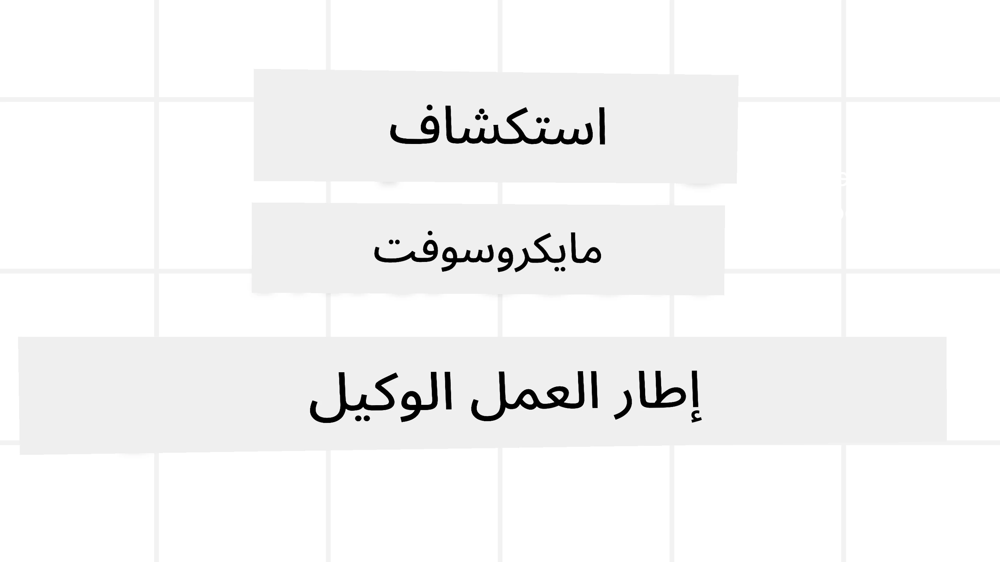
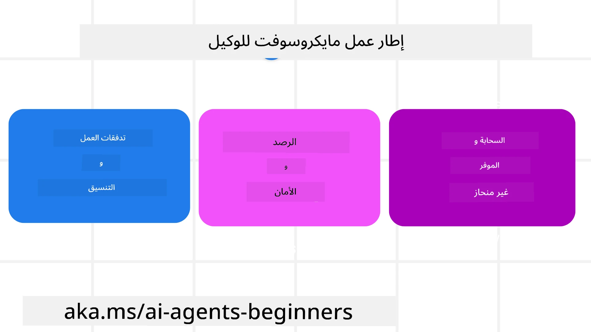

# استكشاف إطار عمل الوكيل من مايكروسوفت



### مقدمة

ستغطي هذه الدرس:

- فهم إطار عمل الوكيل من مايكروسوفت: الميزات الرئيسية والقيمة  
- استكشاف المفاهيم الأساسية لإطار عمل الوكيل من مايكروسوفت
- أنماط MAF المتقدمة: تدفقات العمل، البرامج الوسيطة، والذاكرة

## أهداف التعلم

بعد إكمال هذا الدرس، ستعرف كيف:

- بناء وكلاء ذكاء اصطناعي جاهزين للإنتاج باستخدام إطار عمل الوكيل من مايكروسوفت
- تطبيق الميزات الأساسية لإطار عمل الوكيل من مايكروسوفت على حالات الاستخدام الخاصة بوكيلك
- استخدام أنماط متقدمة تشمل تدفقات العمل، البرامج الوسيطة، وقابلية المراقبة

## عينات الشفرة 

يمكن العثور على عينات الشفرة لـ [Microsoft Agent Framework (MAF)](https://aka.ms/ai-agents-beginners/agent-framewrok) في هذا المستودع تحت ملفات `xx-python-agent-framework` و `xx-dotnet-agent-framework`.

## فهم إطار عمل الوكيل من مايكروسوفت



[Microsoft Agent Framework (MAF)](https://aka.ms/ai-agents-beginners/agent-framewrok) هو الإطار الموحد من مايكروسوفت لبناء وكلاء الذكاء الاصطناعي. يوفر المرونة لمعالجة مجموعة واسعة من حالات الاستخدام الوكيلية التي تُرى في بيئات الإنتاج والبحث مثل:

- **تنسيق الوكلاء المتسلسل** في السيناريوهات التي تحتاج إلى تدفقات عمل خطوة بخطوة.
- **التنسيق المتزامن** في السيناريوهات التي يحتاج فيها الوكلاء لإنجاز المهام في نفس الوقت.
- **تنسيق محادثة الجماعة** في السيناريوهات التي يمكن للوكيل التعاون معًا على مهمة واحدة.
- **تنسيق التسليم** في السيناريوهات التي يقوم فيها الوكلاء بتسليم المهمة لبعضهم البعض عند إتمام المهام الفرعية.
- **التنسيق المغناطيسي** في السيناريوهات التي يقوم فيها وكيل المدير بإنشاء وتعديل قائمة المهام ويتولى تنسيق الوكلاء الفرعيين لإكمال المهمة.

لتقديم وكلاء الذكاء الاصطناعي في الإنتاج، يشتمل MAF أيضًا على ميزات لـ:

- **قابلية المراقبة** من خلال استخدام OpenTelemetry حيث يتم تتبع كل إجراء من إجراءات وكيل الذكاء الاصطناعي بما في ذلك استدعاء الأدوات، خطوات التنسيق، تدفقات الاستدلال ومراقبة الأداء عبر لوحات Microsoft Foundry.
- **الأمان** من خلال استضافة الوكلاء محليًا على Microsoft Foundry التي تتضمن ضوابط أمان مثل الوصول المعتمد على الدور، معالجة البيانات الخاصة وسلامة المحتوى المدمجة.
- **المتانة** حيث يمكن إيقاف واستئناف واسترداد سلاسل الوكلاء وتدفقات العمل من الأخطاء مما يتيح عمليات طويلة الأمد.
- **التحكم** حيث يتم دعم تدفقات العمل البشرية حيث يتم تمييز المهام بأنها تتطلب موافقة بشرية.

يركز أيضاً إطار عمل الوكيل من مايكروسوفت على قابلية التشغيل البيني من خلال:

- **كونه غير مرتبط بسحابة محددة** - يمكن تشغيل الوكلاء في حاويات، في مقر المؤسسة وعلى سحابات متعددة مختلفة.
- **كونه غير مرتبط بمزود محدد** - يمكن إنشاء الوكلاء باستخدام SDK المفضل لديك بما في ذلك Azure OpenAI و OpenAI
- **تكامل المعايير المفتوحة** - يمكن للوكلاء استخدام بروتوكولات مثل Agent-to-Agent(A2A) و Model Context Protocol (MCP) لاكتشاف واستخدام وكلاء وأدوات أخرى.
- **الإضافات والموصلات** - يمكن إجراء الاتصالات مع خدمات البيانات والذاكرة مثل Microsoft Fabric, SharePoint, Pinecone و Qdrant.

دعونا نلقي نظرة على كيفية تطبيق هذه الميزات على بعض المفاهيم الأساسية لإطار عمل الوكيل من مايكروسوفت.

## المفاهيم الرئيسية لإطار عمل الوكيل من مايكروسوفت

### الوكلاء


**إنشاء الوكلاء**

يتم إنشاء الوكيل بتعريف خدمة الاستدلال (مقدم LLM)، مجموعة من التعليمات التي يجب على وكيل الذكاء الاصطناعي اتباعها، واسم معين `name`:

```python
agent = AzureOpenAIChatClient(credential=AzureCliCredential()).create_agent( instructions="You are good at recommending trips to customers based on their preferences.", name="TripRecommender" )
```

النص أعلاه يستخدم `Azure OpenAI` ولكن يمكن إنشاء الوكلاء باستخدام مجموعة متنوعة من الخدمات بما في ذلك `Microsoft Foundry Agent Service`:

```python
AzureAIAgentClient(async_credential=credential).create_agent( name="HelperAgent", instructions="You are a helpful assistant." ) as agent
```

ردود OpenAI، واجهات برمجة التطبيقات `ChatCompletion`

```python
agent = OpenAIResponsesClient().create_agent( name="WeatherBot", instructions="You are a helpful weather assistant.", )
```

```python
agent = OpenAIChatClient().create_agent( name="HelpfulAssistant", instructions="You are a helpful assistant.", )
```

أو [MiniMax](https://platform.minimaxi.com/)، الذي يوفر واجهة برمجة تطبيقات متوافقة مع OpenAI مع نوافذ سياق كبيرة (حتى 204 ألف رمز):

```python
agent = OpenAIChatClient(base_url="https://api.minimax.io/v1", api_key=os.environ["MINIMAX_API_KEY"], model_id="MiniMax-M2.7").create_agent( name="HelpfulAssistant", instructions="You are a helpful assistant.", )
```

أو الوكلاء البعيدين باستخدام بروتوكول A2A:

```python
agent = A2AAgent( name=agent_card.name, description=agent_card.description, agent_card=agent_card, url="https://your-a2a-agent-host" )
```

**تشغيل الوكلاء**

يتم تشغيل الوكلاء باستخدام طرق `.run` أو `.run_stream` للردود غير المتدفقة أو المتدفقة.

```python
result = await agent.run("What are good places to visit in Amsterdam?")
print(result.text)
```

```python
async for update in agent.run_stream("What are the good places to visit in Amsterdam?"):
    if update.text:
        print(update.text, end="", flush=True)

```

يمكن لكل تشغيل وكيل أيضًا أن يحتوي على خيارات لتخصيص معلمات مثل `max_tokens` المستخدمة من الوكيل، `tools` التي يستطيع الوكيل استدعاؤها، وحتى `model` نفسه المستخدم للوكيل.

هذا مفيد في الحالات التي تتطلب نماذج أو أدوات محددة لإكمال مهمة المستخدم.

**الأدوات**

يمكن تعريف الأدوات أثناء تعريف الوكيل:

```python
def get_attractions( location: Annotated[str, Field(description="The location to get the top tourist attractions for")], ) -> str: """Get the top tourist attractions for a given location.""" return f"The top attractions for {location} are." 


# عند إنشاء ChatAgent مباشرةً

agent = ChatAgent( chat_client=OpenAIChatClient(), instructions="You are a helpful assistant", tools=[get_attractions]

```

وكذلك عند تشغيل الوكيل:

```python

result1 = await agent.run( "What's the best place to visit in Seattle?", tools=[get_attractions] # الأداة المقدمة لهذه العملية فقط )
```

**خيوط الوكيل**

تُستخدم خيوط الوكيل للتعامل مع المحادثات متعددة الأدوار. يمكن إنشاء الخيوط إما عن طريق:

- استخدام `get_new_thread()` والذي يتيح حفظ الخيط بمرور الوقت
- إنشاء الخيط تلقائيًا عند تشغيل وكيل ويستمر الخيط فقط أثناء التشغيل الحالي.

لإنشاء خيط، يبدو الكود هكذا:

```python
# إنشاء خيط جديد.
thread = agent.get_new_thread() # تشغيل الوكيل مع الخيط.
response = await agent.run("Hello, I am here to help you book travel. Where would you like to go?", thread=thread)

```

يمكنك بعد ذلك تسلسل الخيط ليتم تخزينه لاستخدام لاحق:

```python
# إنشاء موضوع جديد.
thread = agent.get_new_thread() 

# تشغيل الوكيل مع الموضوع.

response = await agent.run("Hello, how are you?", thread=thread) 

# تسلسل الموضوع للتخزين.

serialized_thread = await thread.serialize() 

# إزالة تسلسل حالة الموضوع بعد التحميل من التخزين.

resumed_thread = await agent.deserialize_thread(serialized_thread)
```

**البرامج الوسيطة للوكيل**

يتفاعل الوكلاء مع الأدوات وLLMs لإكمال مهام المستخدمين. في بعض السيناريوهات، نريد تنفيذ أو تتبع شيء ما بين هذه التفاعلات. تمكننا البرامج الوسيطة للوكيل من ذلك من خلال:

*البرامج الوسيطة الوظيفية*

تتيح هذه البرامج الوسيطة تنفيذ إجراء بين الوكيل ودالة/أداة سيستدعيها. مثال على استخدامها هو عندما تريد إجراء تسجيل دخول على استدعاء الدالة.

في الكود أدناه `next` يحدد ما إذا كان يجب استدعاء البرنامج الوسيط التالي أو الدالة الفعلية.

```python
async def logging_function_middleware(
    context: FunctionInvocationContext,
    next: Callable[[FunctionInvocationContext], Awaitable[None]],
) -> None:
    """Function middleware that logs function execution."""
    # المعالجة المسبقة: تسجيل قبل تنفيذ الدالة
    print(f"[Function] Calling {context.function.name}")

    # الاستمرار إلى الوسيط التالي أو تنفيذ الدالة
    await next(context)

    # المعالجة التالية: تسجيل بعد تنفيذ الدالة
    print(f"[Function] {context.function.name} completed")
```

*البرامج الوسيطة للدردشة*

تتيح هذه البرامج الوسيطة تنفيذ أو تسجيل إجراء بين الوكيل والطلبات بين نموذج اللغة الكبير.

يحتوي هذا على معلومات مهمة مثل `messages` التي يتم إرسالها إلى خدمة الذكاء الاصطناعي.

```python
async def logging_chat_middleware(
    context: ChatContext,
    next: Callable[[ChatContext], Awaitable[None]],
) -> None:
    """Chat middleware that logs AI interactions."""
    # المعالجة المسبقة: تسجيل قبل استدعاء الذكاء الاصطناعي
    print(f"[Chat] Sending {len(context.messages)} messages to AI")

    # المتابعة إلى الوسيط التالي أو خدمة الذكاء الاصطناعي
    await next(context)

    # المعالجة اللاحقة: تسجيل بعد استجابة الذكاء الاصطناعي
    print("[Chat] AI response received")

```

**ذاكرة الوكيل**

كما تم شرحه في درس `Agentic Memory`، الذاكرة عنصر مهم لتمكين الوكيل من العمل عبر سياقات مختلفة. يوفر MAF عدة أنواع مختلفة من الذكريات:

*التخزين في الذاكرة*

هذه هي الذاكرة المخزنة في الخيوط أثناء وقت تشغيل التطبيق.

```python
# إنشاء خيط جديد.
thread = agent.get_new_thread() # تشغيل الوكيل مع الخيط.
response = await agent.run("Hello, I am here to help you book travel. Where would you like to go?", thread=thread)
```

*الرسائل الدائمة*

تُستخدم هذه الذاكرة عند تخزين تاريخ المحادثة عبر جلسات مختلفة. يتم تعريفها باستخدام `chat_message_store_factory`:

```python
from agent_framework import ChatMessageStore

# إنشاء مخزن رسائل مخصص
def create_message_store():
    return ChatMessageStore()

agent = ChatAgent(
    chat_client=OpenAIChatClient(),
    instructions="You are a Travel assistant.",
    chat_message_store_factory=create_message_store
)

```

*الذاكرة الديناميكية*

تُضاف هذه الذاكرة إلى السياق قبل تشغيل الوكلاء. يمكن تخزين هذه الذكريات في خدمات خارجية مثل mem0:

```python
from agent_framework.mem0 import Mem0Provider

# استخدام Mem0 للحصول على قدرات الذاكرة المتقدمة
memory_provider = Mem0Provider(
    api_key="your-mem0-api-key",
    user_id="user_123",
    application_id="my_app"
)

agent = ChatAgent(
    chat_client=OpenAIChatClient(),
    instructions="You are a helpful assistant with memory.",
    context_providers=memory_provider
)

```

**قابلية مراقبة الوكيل**

قابلية المراقبة مهمة لبناء أنظمة وكيلة موثوقة وقابلة للصيانة. يدمج MAF مع OpenTelemetry لتوفير تتبع وعدادات لمراقبة أفضل.

```python
from agent_framework.observability import get_tracer, get_meter

tracer = get_tracer()
meter = get_meter()
with tracer.start_as_current_span("my_custom_span"):
    # قم بشيء
    pass
counter = meter.create_counter("my_custom_counter")
counter.add(1, {"key": "value"})
```

### تدفقات العمل

يقدم MAF تدفقات عمل هي خطوات محددة مسبقًا لإكمال مهمة وتشمل وكلاء الذكاء الاصطناعي كعناصر في تلك الخطوات.

تتكون تدفقات العمل من مكونات مختلفة تسمح بتحكم أفضل في التدفق. كما تمكّن تدفقات العمل **تنسيق الوكلاء المتعددين** و **تسجيل نقاط التفتيش** لحفظ حالات تدفق العمل.

المكونات الأساسية لتدفق العمل هي:

**المنفذون**

يتلقى المنفذون رسائل الإدخال، وينفذون المهام المخصصة لهم، ثم ينتجون رسالة المخرجات. وهذا يدفع تدفق العمل نحو إكمال المهمة الأكبر. يمكن أن يكون المنفذ وكيل ذكاء اصطناعي أو منطق مخصص.

**الحواف**

تستخدم الحواف لتعريف تدفق الرسائل في تدفق العمل. يمكن أن تكون:

*الحواف المباشرة* - اتصالات بسيطة من واحد إلى واحد بين المنفذين:

```python
from agent_framework import WorkflowBuilder

builder = WorkflowBuilder()
builder.add_edge(source_executor, target_executor)
builder.set_start_executor(source_executor)
workflow = builder.build()
```

*الحواف الشرطية* - تنشط بعد استيفاء شرط معين. على سبيل المثال، عندما تكون غرف الفنادق غير متاحة، يمكن للمنفذ اقتراح خيارات أخرى.

*حواف التبديل حسب الحالة* - توجيه الرسائل إلى منفذين مختلفين بناءً على شروط محددة. مثلا، إذا كان لدى عميل السفر حق أولوية ويتم التعامل مع مهامه عبر تدفق عمل آخر.

*حواف الانتشار* - إرسال رسالة واحدة إلى أهداف متعددة.

*حواف التجميع* - جمع رسائل متعددة من منفذين مختلفين وإرسالها إلى هدف واحد.

**الأحداث**

لتوفير مراقبة أفضل لتدفقات العمل، يقدم MAF أحداثًا مدمجة للتنفيذ تشمل:

- `WorkflowStartedEvent` - بداية تنفيذ تدفق العمل
- `WorkflowOutputEvent` - إنتاج تدفق العمل لمخرجات
- `WorkflowErrorEvent` - وقوع خطأ في تدفق العمل
- `ExecutorInvokeEvent` - بدء المنفذ بالمعالجة
- `ExecutorCompleteEvent` - انتهاء المنفذ من المعالجة
- `RequestInfoEvent` - صدور طلب

## أنماط MAF المتقدمة

الأقسام أعلاه تغطي المفاهيم الأساسية لإطار عمل الوكيل من مايكروسوفت. عند بناء وكلاء أكثر تعقيدًا، ها هي بعض الأنماط المتقدمة التي يمكنك أخذها في الاعتبار:

- **تكوين البرامج الوسيطة**: ربط عدة معالجات وسيطة (التسجيل، المصادقة، تحديد المعدل) باستخدام البرامج الوسيطة الوظيفية وبرامج الدردشة للتحكم الدقيق في سلوك الوكيل.
- **تسجيل نقاط تدفق العمل**: استخدم أحداث وتسييل تدفق العمل لحفظ واستئناف عمليات الوكلاء طويلة الأمد.
- **اختيار الأدوات الديناميكي**: دمج RAG عبر وصف الأدوات مع تسجيل الأدوات في MAF لعرض الأدوات ذات الصلة فقط لكل استعلام.
- **تسليم متعدد الوكلاء**: استخدم حواف تدفق العمل والتوجيه الشرطي لتنظيم التسليم بين الوكلاء المتخصصين.

## عينات الشفرة 

يمكن العثور على عينات الشفرة لإطار عمل الوكيل من مايكروسوفت في هذا المستودع تحت ملفات `xx-python-agent-framework` و `xx-dotnet-agent-framework`.

## هل لديك المزيد من الأسئلة حول إطار عمل الوكيل من مايكروسوفت؟

انضم إلى [Microsoft Foundry Discord](https://aka.ms/ai-agents/discord) لقاء مع متعلمين آخرين، وحضور ساعات المكتب، والحصول على إجابات حول أسئلتك عن وكلاء الذكاء الاصطناعي.

---

<!-- CO-OP TRANSLATOR DISCLAIMER START -->
**تنويه**:  
تمت ترجمة هذا المستند باستخدام خدمة الترجمة الآلية [Co-op Translator](https://github.com/Azure/co-op-translator). بينما نسعى للحفاظ على الدقة، يرجى العلم أن الترجمات الآلية قد تحتوي على أخطاء أو عدم دقة. يجب اعتبار المستند الأصلي بلغته الأصلية هو المصدر الرسمي والمعتمد. للمعلومات الحساسة أو الهامة، يُنصح بالاعتماد على الترجمة البشرية الاحترافية. نحن غير مسؤولين عن أي سوء فهم أو تحريف ناتج عن استخدام هذه الترجمة.
<!-- CO-OP TRANSLATOR DISCLAIMER END -->