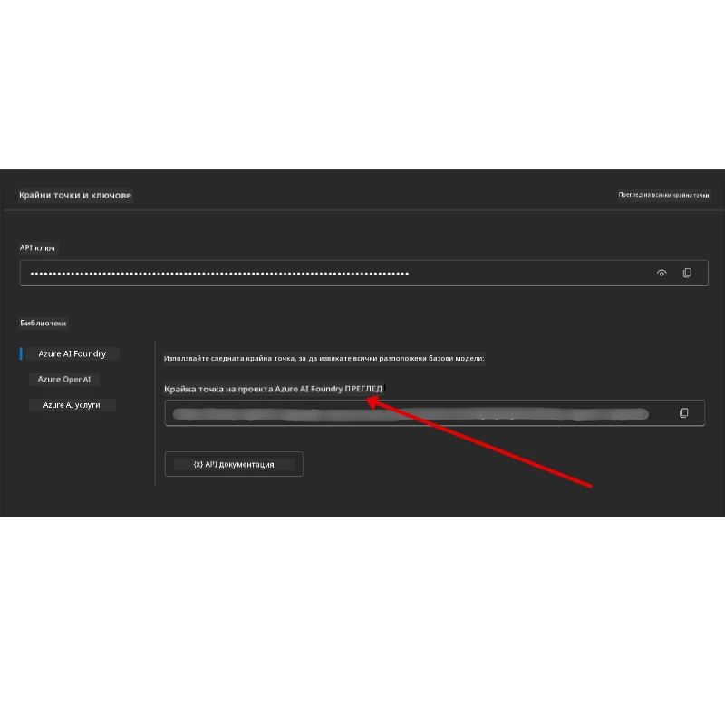

# Настройка на курса

## Въведение

Този урок ще обясни как да стартирате примерите с код от този курс.

## Присъединете се към други учащи и потърсете помощ

Преди да започнете да клонирате вашето хранилище, присъединете се към [AI Agents For Beginners Discord канал](https://aka.ms/ai-agents/discord), за да получите помощ с настройката, да зададете въпроси за курса или да се свържете с други учащи.

## Клонирайте или Форкнете това хранилище

За да започнете, моля клонирайте или форкнете GitHub хранилището. Това ще ви даде ваша собствена версия на учебния материал, за да можете да стартирате, тествате и коригирате кода!

Можете да го направите като кликнете на линка за <a href="https://github.com/microsoft/ai-agents-for-beginners/fork" target="_blank">форк на хранилището</a>

Вече трябва да имате собствена форкната версия на този курс в следния линк:


### Shallow Clone (препоръчително за работилници / Codespaces)

  >Пълното хранилище може да е голямо (~3 GB), когато свалите цялата история и всички файлове. Ако посещавате само работилница или имате нужда само от няколко папки с уроци, shallow clone (или sparse clone) избягва повечето от това сваляне, като скъсява историята и/или прескача blob-ове.

#### Бърз shallow clone — минимална история, всички файлове

Заменете `<your-username>` в командите по-долу с URL на вашия форк (или с upstream URL, ако предпочитате).

За клониране само на последната история на комитите (малко изтегляне):

```bash|powershell
git clone --depth 1 https://github.com/<your-username>/ai-agents-for-beginners.git
```

За клониране на конкретен клон:

```bash|powershell
git clone --depth 1 --branch <branch-name> https://github.com/<your-username>/ai-agents-for-beginners.git
```

#### Частично (sparse) клониране — минимални blob-ове + само избрани папки

Използва частично клониране и sparse-checkout (изисква Git 2.25+ и препоръчва се модерен Git с поддръжка на partial clone):

```bash|powershell
git clone --depth 1 --filter=blob:none --sparse https://github.com/<your-username>/ai-agents-for-beginners.git
```

Влезте в папката на хранилището:

```bash|powershell
cd ai-agents-for-beginners
```

След това укажете кои папки искате (пример по-долу показва две папки):

```bash|powershell
git sparse-checkout set 00-course-setup 01-intro-to-ai-agents
```

След като клонирате и проверите файловете, ако ви трябват само файловете и искате да освободите място (без git история), моля изтрийте метаданните на хранилището (💀 необратимо — ще загубите всички функции на Git: няма комити, pull-ове, push-ове или достъп до история).

```bash
# zsh/bash
rm -rf .git
```

```powershell
# PowerShell
Remove-Item -Recurse -Force .git
```

#### Използване на GitHub Codespaces (препоръчително за избягване на големи локални сваляния)

- Създайте нов Codespace за това хранилище чрез [GitHub UI](https://github.com/codespaces).  

- В терминала на току-що създадения Codespace, изпълнете някоя от командите за shallow/sparse clone по-горе, за да внесете само необходимите папки с уроци в работната среда на Codespace.
- По избор: след клониране във Codespaces, премахнете .git, за да освободите допълнително пространство (вижте командите за премахване по-горе).
- Забележка: Ако предпочитате да отворите директно хранилището в Codespaces (без допълнително клониране), имайте предвид, че Codespaces ще конструира devcontainer средата и може да зареди повече от нужното. Клонирането на shallow копие в нов Codespace ви дава по-голям контрол върху използването на дисково пространство.

#### Съвети

- Винаги заменяйте URL за клониране с този на вашия форк, ако искате да редактирате/комитирате.
- Ако по-късно имате нужда от повече история или файлове, можете да ги изтеглите или да коригирате sparse-checkout, за да включите допълнителни папки.

## Стартиране на кода

Този курс предлага редица Jupyter Notebook файлове, които можете да стартирате за практическо изграждане на AI агенти.

Примерите с код използват **Microsoft Agent Framework (MAF)** с `AzureAIProjectAgentProvider`, който се свързва с **Azure AI Agent Service V2** (Responses API) чрез **Microsoft Foundry**.

Всички Python notebooks са озаглавени `*-python-agent-framework.ipynb`.

## Изисквания

- Python 3.12+
  - **ЗАБЕЛЕЖКА**: Ако нямате инсталиран Python3.12, уверете се, че го инсталирате. След това създайте виртуална среда с python3.12, за да сте сигурни, че са инсталирани правилните версии от файла requirements.txt.
  
    >Пример

    Създайте директория за Python виртуална среда:

    ```bash|powershell
    python -m venv venv
    ```

    След това активирайте виртуалната среда за:

    ```bash
    # zsh/bash
    source venv/bin/activate
    ```
  
    ```dos
    # Command Prompt for Windows
    venv\Scripts\activate
    ```

- .NET 10+: За примерите с .NET, уверете се, че сте инсталирали [.NET 10 SDK](https://dotnet.microsoft.com/download/dotnet/10.0) или по-нова версия. След това проверете текущата инсталирана версия на .NET SDK:

    ```bash|powershell
    dotnet --list-sdks
    ```

- **Azure CLI** — Задължителен за удостоверяване. Инсталирайте от [aka.ms/installazurecli](https://aka.ms/installazurecli).
- **Azure Абонамент** — За достъп до Microsoft Foundry и Azure AI Agent Service.
- **Microsoft Foundry проект** — Проект с разположен модел (напр. `gpt-4o`). Вижте [Стъпка 1](#стъпка-1-създайте-microsoft-foundry-проект) по-долу.

В корена на това хранилище сме включили файл `requirements.txt`, който съдържа всички необходими Python пакети за изпълнение на примерите с код.

Можете да ги инсталирате, като изпълните следната команда в терминала си в корена на хранилището:

```bash|powershell
pip install -r requirements.txt
```

Препоръчваме да създадете виртуална среда за Python, за да избегнете конфликти и проблеми.

## Настройване на VSCode

Уверете се, че използвате правилната версия на Python във VSCode.


## Настройване на Microsoft Foundry и Azure AI Agent Service

### Стъпка 1: Създайте Microsoft Foundry проект

Ще ви трябва Azure AI Foundry **hub** и **проект** с разположен модел, за да стартирате notebook-ите.

1. Отидете на [ai.azure.com](https://ai.azure.com) и влезте с акаунта си за Azure.
2. Създайте **hub** (или използвайте съществуващ). Вижте: [Преглед на ресурсите на Hub](https://learn.microsoft.com/azure/ai-foundry/concepts/ai-resources).
3. Вътре в hub-а, създайте **проект**.
4. Разположете модел (напр. `gpt-4o`) от **Models + Endpoints** → **Deploy model**.

### Стъпка 2: Вземете URL на вашия проектен край и името на разположения модел

В портала за Microsoft Foundry на вашия проект:

- **Project Endpoint** — Отидете на страницата **Overview** и копирайте URL адреса.



- **Model Deployment Name** — Отидете на **Models + Endpoints**, изберете разположения модел и запишете името на **Deployment name** (напр. `gpt-4o`).

### Стъпка 3: Влезте в Azure с `az login`

Всички notebooks използват **`AzureCliCredential`** за удостоверяване — не е необходимо да управлявате API ключове. Това изисква да сте влезли чрез Azure CLI.

1. **Инсталирайте Azure CLI**, ако все още не сте: [aka.ms/installazurecli](https://aka.ms/installazurecli)

2. **Влезте** като изпълните:

    ```bash|powershell
    az login
    ```

    Или ако сте в отдалечена/Codepsace среда без браузър:

    ```bash|powershell
    az login --use-device-code
    ```

3. **Изберете абонамента си**, ако бъдете попитани — изберете този, който съдържа вашия Foundry проект.

4. **Проверете** че сте влезли:

    ```bash|powershell
    az account show
    ```

> **Защо `az login`?** Notebook-ите се удостоверяват с `AzureCliCredential` от пакета `azure-identity`. Това означава, че вашата Azure CLI сесия предоставя необходимите идентификационни данни — няма API ключове или тайни в `.env` файла ви. Това е [добра практика за сигурност](https://learn.microsoft.com/azure/developer/ai/keyless-connections).

### Стъпка 4: Създайте своя `.env` файл

Копирайте примерния файл:

```bash
# zsh/bash
cp .env.example .env
```

```powershell
# PowerShell
Copy-Item .env.example .env
```

Отворете `.env` и попълнете тези две стойности:

```env
AZURE_AI_PROJECT_ENDPOINT=https://<your-project>.services.ai.azure.com/api/projects/<your-project-id>
AZURE_AI_MODEL_DEPLOYMENT_NAME=gpt-4o
```

| Променлива | Къде да я намерите |
|----------|-----------------|
| `AZURE_AI_PROJECT_ENDPOINT` | Портал Foundry → вашия проект → страница **Overview** |
| `AZURE_AI_MODEL_DEPLOYMENT_NAME` | Портал Foundry → **Models + Endpoints** → името на вашия разположен модел |

Това е всичко за повечето уроци! Notebook-ите ще се удостоверяват автоматично чрез вашата `az login` сесия.

### Стъпка 5: Инсталирайте зависимости за Python

```bash|powershell
pip install -r requirements.txt
```

Препоръчваме да изпълните това вътре във виртуалната среда, която създадохте по-рано.

## Допълнителна настройка за урок 5 (Agentic RAG)

Урок 5 използва **Azure AI Search** за retrieval-augmented generation. Ако планирате да стартирате този урок, добавете тези променливи във вашия `.env` файл:

| Променлива | Къде да я намерите |
|----------|-----------------|
| `AZURE_SEARCH_SERVICE_ENDPOINT` | Azure портал → вашият ресурс **Azure AI Search** → **Overview** → URL |
| `AZURE_SEARCH_API_KEY` | Azure портал → вашият ресурс **Azure AI Search** → **Settings** → **Keys** → основен администраторски ключ |

## Допълнителна настройка за уроци 6 и 8 (GitHub модели)

Някои notebooks от уроци 6 и 8 използват **GitHub модели**, вместо Azure AI Foundry. Ако планирате да стартирате тези примери, добавете тези променливи във вашия `.env` файл:

| Променлива | Къде да я намерите |
|----------|-----------------|
| `GITHUB_TOKEN` | GitHub → **Settings** → **Developer settings** → **Personal access tokens** |
| `GITHUB_ENDPOINT` | Използвайте `https://models.inference.ai.azure.com` (по подразбиране) |
| `GITHUB_MODEL_ID` | Име на модела за използване (напр. `gpt-4o-mini`) |

## Алтернативен доставчик: MiniMax (съвместим с OpenAI)

[MiniMax](https://platform.minimaxi.com/) предоставя модели с голям контекст (до 204K токена) чрез OpenAI-съвместим API. Тъй като OpenAIChatClient в Microsoft Agent Framework работи с всеки OpenAI-съвместим край, можете да използвате MiniMax като заместител на GitHub модели или OpenAI.

Добавете тези променливи във вашия `.env` файл:

| Променлива | Къде да я намерите |
|----------|-----------------|
| `MINIMAX_API_KEY` | [MiniMax Platform](https://platform.minimaxi.com/) → API ключове |
| `MINIMAX_BASE_URL` | Използвайте `https://api.minimax.io/v1` (по подразбиране) |
| `MINIMAX_MODEL_ID` | Име на модела за използване (напр. `MiniMax-M2.7`) |

**Налични модели**: `MiniMax-M2.7` (препоръчително), `MiniMax-M2.7-highspeed` (по-бързи отговори)

Примерите, които използват `OpenAIChatClient` (напр. уроците със сценарии за хотелски резервации от урок 14), автоматично ще откриват и използват MiniMax конфигурацията ви, когато `MINIMAX_API_KEY` е зададено.

## Допълнителна настройка за урок 8 (Bing Grounding Workflow)

Notebook със условни работни потоци от урок 8 използва **Bing grounding** чрез Azure AI Foundry. Ако искате да стартирате този пример, добавете тази променлива към `.env` файла си:

| Променлива | Къде да я намерите |
|----------|-----------------|
| `BING_CONNECTION_ID` | Портал Azure AI Foundry → вашият проект → **Management** → **Connected resources** → вашата Bing връзка → копирайте connection ID |

## Отстраняване на проблеми

### Грешки при проверка на SSL сертификат на macOS

Ако използвате macOS и срещнете грешка като:

```plaintext
ssl.SSLCertVerificationError: [SSL: CERTIFICATE_VERIFY_FAILED] certificate verify failed: self-signed certificate in certificate chain
```

Това е известен проблем с Python на macOS, където системните SSL сертификати не се доверяват автоматично. Опитайте следните решения в този ред:

**Опция 1: Стартирайте скрипта за инсталиране на сертификати на Python (препоръчително)**

```bash
# Заменете 3.XX с вашата инсталирана версия на Python (например, 3.12 или 3.13):
/Applications/Python\ 3.XX/Install\ Certificates.command
```

**Опция 2: Използвайте `connection_verify=False` в notebook-а (само за GitHub Models notebooks)**

В notebook-а на уроци 6 (`06-building-trustworthy-agents/code_samples/06-system-message-framework.ipynb`), вече има закоментиран workaround. Разкоментирайте `connection_verify=False` при създаването на клиента:

```python
client = ChatCompletionsClient(
    endpoint=endpoint,
    credential=AzureKeyCredential(token),
    connection_verify=False,  # Деактивирайте SSL проверката, ако срещнете грешки с сертификата
)
```

> **⚠️ Предупреждение:** Изключването на проверката на SSL (`connection_verify=False`) намалява сигурността, като пропуска валидацията на сертификата. Използвайте го само временно в развойна среда, никога в продукция.

**Опция 3: Инсталирайте и използвайте `truststore`**

```bash
pip install truststore
```

След това добавете следното в началото на notebook-a или скрипта преди мрежовите повиквания:

```python
import truststore
truststore.inject_into_ssl()
```

## Забили сте се някъде?

Ако имате затруднения с тази настройка, включете се в нашия <a href="https://discord.gg/kzRShWzttr" target="_blank">Azure AI Community Discord</a> или <a href="https://github.com/microsoft/ai-agents-for-beginners/issues?WT.mc_id=academic-105485-koreyst" target="_blank">създайте проблем</a>.

## Следващ урок

Сега сте готови да стартирате кода за този курс. Приятно учене за света на AI агентите!

[Въведение в AI агенти и случаи на употреба](../01-intro-to-ai-agents/README.md)

---

<!-- CO-OP TRANSLATOR DISCLAIMER START -->
**Отказ от отговорност**:
Този документ е преведен с помощта на AI преводаческа услуга [Co-op Translator](https://github.com/Azure/co-op-translator). Въпреки че се стремим към точност, моля, имайте предвид, че автоматизираните преводи могат да съдържат грешки или неточности. Оригиналният документ на неговия роден език трябва да се счита за авторитетния източник. За критична информация се препоръчва професионален човешки превод. Ние не носим отговорност за никакви недоразумения или неправилни интерпретации, произтичащи от използването на този превод.
<!-- CO-OP TRANSLATOR DISCLAIMER END -->