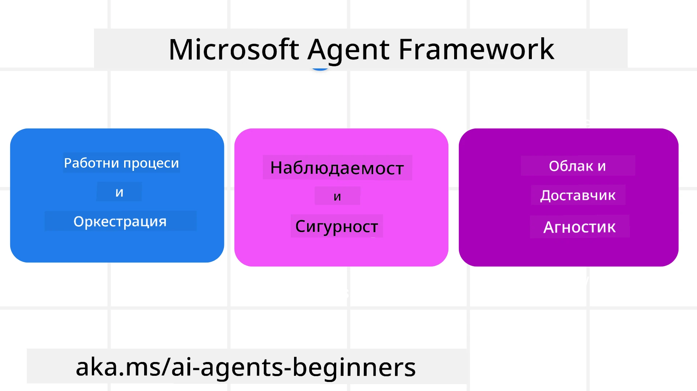
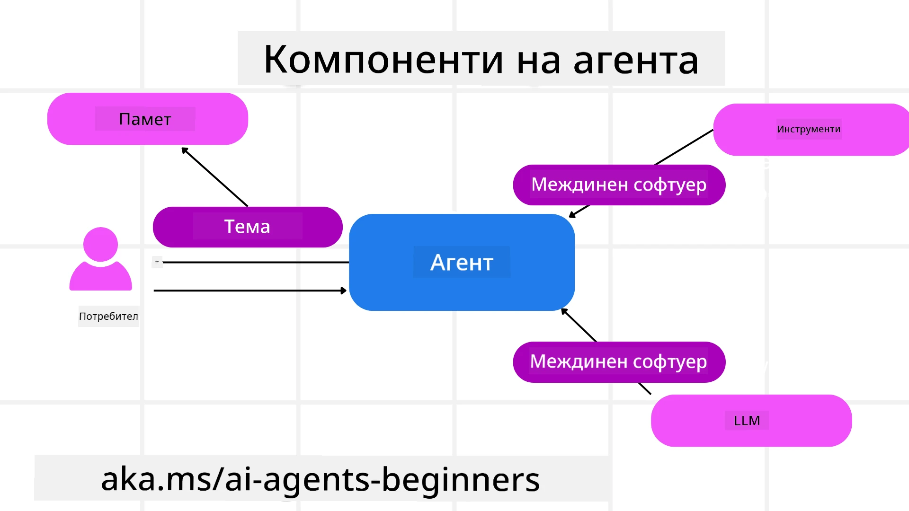

# Изследване на Microsoft Agent Framework


### Въведение

Този урок ще покрие:

- Разбиране на Microsoft Agent Framework: Основни характеристики и стойност  
- Изследване на основните концепции на Microsoft Agent Framework
- Разширени MAF модели: Работни потоци, междинен софтуер и памет

## Учебни цели

След завършване на този урок, ще знаете как да:

- Създавате AI агенти, готови за производствена употреба с помощта на Microsoft Agent Framework
- Прилагате основните функции на Microsoft Agent Framework към вашите агентски случаи
- Използвате разширени модели, включително работни потоци, междинен софтуер и наблюдаемост

## Примери с код

Примерите с код за [Microsoft Agent Framework (MAF)](https://aka.ms/ai-agents-beginners/agent-framewrok) могат да бъдат намерени в това хранилище под файлове `xx-python-agent-framework` и `xx-dotnet-agent-framework`.

## Разбиране на Microsoft Agent Framework



[Microsoft Agent Framework (MAF)](https://aka.ms/ai-agents-beginners/agent-framewrok) е унифицирана рамка на Microsoft за изграждане на AI агенти. Тя предлага гъвкавост да се справи с широкото разнообразие от агентски случаи, наблюдавани както в производствени, така и изследователски среди, включително:

- **Последователна агентска оркестрация** в сценарии, където са необходими стъпка по стъпка работни потоци.
- **Паралелна оркестрация** в сценарии, където агентите трябва да изпълняват задачи едновременно.
- **Оркестрация на групов чат** в сценарии, където агентите могат да си сътрудничат за една задача.
- **Оркестрация на предаване** в сценарии, където агентите прехвърлят задачата един на друг след завършване на подтасковете.
- **Магнитна оркестрация** в сценарии, където управляващ агент създава и променя списък със задачи и координира подагенти за изпълнение на задачата.

За да достави AI агенти в производство, MAF също включва функции за:

- **Наблюдаемост** чрез използване на OpenTelemetry, където всяко действие на AI агента, включително повикване на инструменти, стъпки на оркестрация, логически потоци и мониторинг на производителността чрез табла на Microsoft Foundry.
- **Сигурност** чрез хостване на агенти нативно в Microsoft Foundry, което включва контролиране на достъп на базата на роли, работа с лични данни и вградена безопасност на съдържанието.
- **Издръжливост** тъй като нишките и работните потоци на агента могат да бъдат паузирани, възобновявани и възстановявани от грешки, което позволява по-дълги процеси.
- **Контрол** тъй като се поддържат работни потоци с човешко участие, където задачите се маркират като изискващи човешко одобрение.

Microsoft Agent Framework също се фокусира върху интероперабилността чрез:

- **Да бъде облак-независим** - агентите могат да работят в контейнери, локално и в множество различни облаци.
- **Да бъде доставчик-независим** - агентите могат да се създават чрез предпочитан SDK, включително Azure OpenAI и OpenAI
- **Интегриране на отворени стандарти** - агентите могат да използват протоколи като Agent-to-Agent (A2A) и Model Context Protocol (MCP) за откриване и използване на други агенти и инструменти.
- **Плъгини и конектори** - връзки могат да се осъществяват към услуги за данни и памет като Microsoft Fabric, SharePoint, Pinecone и Qdrant.

Нека разгледаме как тези функции се прилагат към някои от основните концепции на Microsoft Agent Framework.

## Основни концепции на Microsoft Agent Framework

### Агенти



**Създаване на агенти**

Създаването на агент става чрез дефиниране на услугата за извод (LLM доставчик), набор от инструкции, които AI агентът да следва, и зададено `име`:

```python
agent = AzureOpenAIChatClient(credential=AzureCliCredential()).create_agent( instructions="You are good at recommending trips to customers based on their preferences.", name="TripRecommender" )
```

По-горното използва `Azure OpenAI`, но агентите могат да се създават с помощта на различни услуги, включително `Microsoft Foundry Agent Service`:

```python
AzureAIAgentClient(async_credential=credential).create_agent( name="HelperAgent", instructions="You are a helpful assistant." ) as agent
```

OpenAI `Responses`, `ChatCompletion` APIs

```python
agent = OpenAIResponsesClient().create_agent( name="WeatherBot", instructions="You are a helpful weather assistant.", )
```

```python
agent = OpenAIChatClient().create_agent( name="HelpfulAssistant", instructions="You are a helpful assistant.", )
```

или [MiniMax](https://platform.minimaxi.com/), който предоставя OpenAI-съвместим API с големи прозорци (до 204K токена):

```python
agent = OpenAIChatClient(base_url="https://api.minimax.io/v1", api_key=os.environ["MINIMAX_API_KEY"], model_id="MiniMax-M2.7").create_agent( name="HelpfulAssistant", instructions="You are a helpful assistant.", )
```

или дистанционни агенти, използващи протокола A2A:

```python
agent = A2AAgent( name=agent_card.name, description=agent_card.description, agent_card=agent_card, url="https://your-a2a-agent-host" )
```

**Стартиране на агенти**

Агентите се стартират с методите `.run` или `.run_stream` за отговори без поток или с поток.

```python
result = await agent.run("What are good places to visit in Amsterdam?")
print(result.text)
```

```python
async for update in agent.run_stream("What are the good places to visit in Amsterdam?"):
    if update.text:
        print(update.text, end="", flush=True)

```

Всяко изпълнение на агент може да има и опции за персонализиране на параметри като `max_tokens`, използвани от агента, `tools`, които агентът може да извиква, и дори самия `model`, използван за агента.

Това е полезно в случаи, когато са необходими конкретни модели или инструменти за изпълнението на задачата на потребителя.

**Инструменти**

Инструментите могат да се дефинират както при създаването на агента:

```python
def get_attractions( location: Annotated[str, Field(description="The location to get the top tourist attractions for")], ) -> str: """Get the top tourist attractions for a given location.""" return f"The top attractions for {location} are." 


# При директно създаване на ChatAgent

agent = ChatAgent( chat_client=OpenAIChatClient(), instructions="You are a helpful assistant", tools=[get_attractions]

```

така и при стартирането на агента:

```python

result1 = await agent.run( "What's the best place to visit in Seattle?", tools=[get_attractions] # Инструмент, предоставен само за това изпълнение )
```

**Нишки на агенти**

Нишките на агенти се използват за обработка на многократни разговори. Нишки могат да се създават или чрез:

- Използване на `get_new_thread()`, което позволява нишката да се запазва във времето
- Автоматично създаване на нишка при стартиране на агент и нишката да съществува само по време на текущото изпълнение.

За създаване на нишка, кодът изглежда така:

```python
# Създайте нов нишка.
thread = agent.get_new_thread() # Стартирайте агента с нишката.
response = await agent.run("Hello, I am here to help you book travel. Where would you like to go?", thread=thread)

```

След това можете да сериализирате нишката за по-късна употреба:

```python
# Създайте нов нишка.
thread = agent.get_new_thread() 

# Стартирайте агента с нишката.

response = await agent.run("Hello, how are you?", thread=thread) 

# Сериализирайте нишката за съхранение.

serialized_thread = await thread.serialize() 

# Десериализирайте състоянието на нишката след зареждане от съхранение.

resumed_thread = await agent.deserialize_thread(serialized_thread)
```

**Междинен софтуер за агенти**

Агентите взаимодействат с инструменти и LLMs за изпълнение на задачите на потребителя. В определени сценарии искаме да изпълняваме или проследяваме действия между тези взаимодействия. Междинният софтуер на агентите ни позволява това чрез:

*Функционален междинен софтуер*

Този междинен софтуер позволява изпълнение на действие между агента и функция/инструмент, който ще извика. Пример за използване е, когато искате да направите някакво логване при извикването на функция.

В кода по-долу `next` определя дали ще се извика следващият междинен софтуер или действителната функция.

```python
async def logging_function_middleware(
    context: FunctionInvocationContext,
    next: Callable[[FunctionInvocationContext], Awaitable[None]],
) -> None:
    """Function middleware that logs function execution."""
    # Предварителна обработка: Запис преди изпълнение на функцията
    print(f"[Function] Calling {context.function.name}")

    # Продължете към следващата междинна обработка или изпълнение на функцията
    await next(context)

    # Последваща обработка: Запис след изпълнение на функцията
    print(f"[Function] {context.function.name} completed")
```

*Чат междинен софтуер*

Този междинен софтуер позволява изпълнение или логване на действие между агента и заявките между LLM.

Тук се съдържа важна информация като `messages`, които се изпращат към AI услугата.

```python
async def logging_chat_middleware(
    context: ChatContext,
    next: Callable[[ChatContext], Awaitable[None]],
) -> None:
    """Chat middleware that logs AI interactions."""
    # Предварителна обработка: Лог преди обаждане към AI
    print(f"[Chat] Sending {len(context.messages)} messages to AI")

    # Продължете към следващия middleware или AI услуга
    await next(context)

    # Последваща обработка: Лог след отговора от AI
    print("[Chat] AI response received")

```

**Памет на агента**

Както беше разгледано в урока `Agentic Memory`, паметта е важен елемент за позволяване на агента да оперира в различни контексти. MAF предлага няколко различни типа памет:

*Памет в нишката*

Това е паметта, съхранявана в нишките по време на изпълнение на приложението.

```python
# Създайте нов нишка.
thread = agent.get_new_thread() # Стартирайте агента с нишката.
response = await agent.run("Hello, I am here to help you book travel. Where would you like to go?", thread=thread)
```

*Постоянни съобщения*

Тази памет се използва за съхраняване на история на разговорите през различни сесии. Тя се дефинира чрез `chat_message_store_factory`:

```python
from agent_framework import ChatMessageStore

# Създаване на персонализиран магазин за съобщения
def create_message_store():
    return ChatMessageStore()

agent = ChatAgent(
    chat_client=OpenAIChatClient(),
    instructions="You are a Travel assistant.",
    chat_message_store_factory=create_message_store
)

```

*Динамична памет*

Тази памет се добавя към контекста, преди да се стартират агентите. Тези памети могат да се съхраняват във външни услуги като mem0:

```python
from agent_framework.mem0 import Mem0Provider

# Използване на Mem0 за разширени възможности за памет
memory_provider = Mem0Provider(
    api_key="your-mem0-api-key",
    user_id="user_123",
    application_id="my_app"
)

agent = ChatAgent(
    chat_client=OpenAIChatClient(),
    instructions="You are a helpful assistant with memory.",
    context_providers=memory_provider
)

```

**Наблюдаемост на агента**

Наблюдаемостта е важна за изграждането на надеждни и поддържани агентски системи. MAF се интегрира с OpenTelemetry за проследяване и метрики за по-добра наблюдаемост.

```python
from agent_framework.observability import get_tracer, get_meter

tracer = get_tracer()
meter = get_meter()
with tracer.start_as_current_span("my_custom_span"):
    # направи нещо
    pass
counter = meter.create_counter("my_custom_counter")
counter.add(1, {"key": "value"})
```

### Работни потоци

MAF предлага работни потоци, които са предварително дефинирани стъпки за приключване на задача и включват AI агенти като компоненти в тези стъпки.

Работните потоци се състоят от различни компоненти, които позволяват по-добър контрол на потока. Работните потоци също поддържат **оркестрация с много агенти** и **контролни точки** за съхранение на състояния на работните потоци.

Основните компоненти на работния поток са:

**Изпълнители**

Изпълнителите получават входни съобщения, изпълняват възложените задачи и след това произвеждат изходящо съобщение. Това придвижва работния поток напред към завършването на по-голямата задача. Изпълнителите могат да бъдат AI агент или персонализирана логика.

**Ръбове**

Ръбовете се използват за дефиниране на потока на съобщенията в работния поток. Те могат да бъдат:

*Директни ръбове* - прости връзки един към един между изпълнители:

```python
from agent_framework import WorkflowBuilder

builder = WorkflowBuilder()
builder.add_edge(source_executor, target_executor)
builder.set_start_executor(source_executor)
workflow = builder.build()
```

*Условни ръбове* - активират се след изпълнение на определено условие. Например, когато хотелските стаи са недостъпни, изпълнителят може да предложи други опции.

*Превключващи (switch-case) ръбове* - пренасочват съобщения към различни изпълнители според определени условия. Например, ако клиент за пътуване има приоритетен достъп и задачите му ще бъдат обработвани чрез друг работен поток.

*Разклоняващи се (fan-out) ръбове* - изпращат едно съобщение към множество цели.

*Събиращи се (fan-in) ръбове* - събират множество съобщения от различни изпълнители и ги изпращат към една цел.

**Събития**

За да предостави по-добра наблюдаемост върху работните потоци, MAF предлага вградени събития за изпълнение, включително:

- `WorkflowStartedEvent`  - Започва изпълнението на работния поток
- `WorkflowOutputEvent` - Работният поток генерира изход
- `WorkflowErrorEvent` - Работният поток среща грешка
- `ExecutorInvokeEvent`  - Изпълнителят започва обработка
- `ExecutorCompleteEvent`  -  Изпълнителят завършва обработка
- `RequestInfoEvent` - Извършва се заявка

## Разширени MAF модели

Горните раздели покриват основните концепции на Microsoft Agent Framework. Когато изграждате по-сложни агенти, ето някои разширени модели за обмисляне:

- **Композиция на междинен софтуер**: Свързване на множество обработващи междинни софтуери (логване, удостоверяване, ограничаване на честотата) чрез функционален и чат междинен софтуер за прецизен контрол на поведението на агента.
- **Контролни точки на работния поток**: Използване на събития в работния поток и сериализация за съхранение и възобновяване на дългоживущи процеси на агенти.
- **Динамичен избор на инструменти**: Комбиниране на RAG върху описания на инструменти с регистрацията на инструменти в MAF за представяне само на релевантните инструменти за всяко запитване.
- **Прехвърляне между множество агенти**: Използване на ръбове на работния поток и условно маршрутизиране за оркестрация на прехвърляния между специализирани агенти.

## Примери с код

Примерите с код за Microsoft Agent Framework могат да бъдат намерени в това хранилище под файлове `xx-python-agent-framework` и `xx-dotnet-agent-framework`.

## Имате ли още въпроси за Microsoft Agent Framework?

Присъединете се към [Microsoft Foundry Discord](https://aka.ms/ai-agents/discord) за среща с други учащи, участие в офис часове и получаване на отговори на въпросите си за AI агенти.

---

<!-- CO-OP TRANSLATOR DISCLAIMER START -->
**Отказ от отговорност**:
Този документ е преведен с помощта на AI преводаческа услуга [Co-op Translator](https://github.com/Azure/co-op-translator). Въпреки че се стремим към точност, моля, имайте предвид, че автоматизираните преводи може да съдържат грешки или неточности. Оригиналният документ на неговия роден език трябва да се счита за авторитетен източник. За критична информация се препоръчва професионален човешки превод. Ние не носим отговорност за никакви недоразумения или погрешни тълкувания, произтичащи от използването на този превод.
<!-- CO-OP TRANSLATOR DISCLAIMER END -->