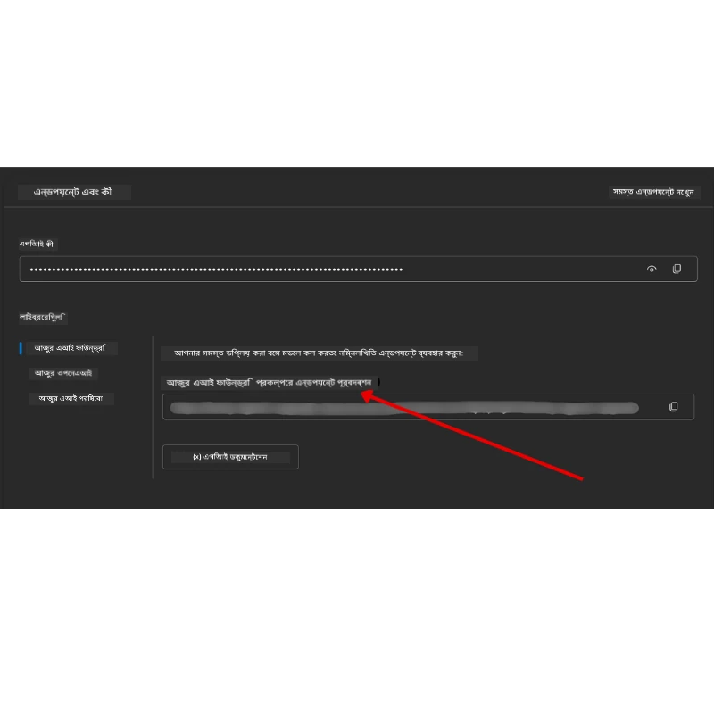

# কোর্স সেটআপ

## পরিচিতি

এই পাঠে আমরা এই কোর্সের কোড স্যাম্পলগুলি কীভাবে চালাতে হয় তা আলোচনা করব।

## অন্যান্য শিক্ষার্থীদের সাথে যোগদান করুন এবং সাহায্য পান

আপনি যখন আপনার রিপোজিটরি ক্লোন করতে শুরু করবেন, তখন সেটআপে সাহায্য, কোর্স সম্পর্কে কোনও প্রশ্ন বা অন্যান্য শিক্ষার্থীদের সাথে সংযোগ করার জন্য [AI Agents For Beginners Discord channel](https://aka.ms/ai-agents/discord) এ যোগ দিন।

## এই রিপো ক্লোন বা ফর্ক করুন

শুরু করার জন্য, অনুগ্রহ করে GitHub রিপোজিটরি ক্লোন বা ফর্ক করুন। এর মাধ্যমে আপনি কোর্সের সামগ্রীর নিজের একটি সংস্করণ পাবেন যাতে আপনি কোড চালাতে, পরীক্ষা করতে এবং পরিবর্তন করতে পারবেন!

এটি করতে, <a href="https://github.com/microsoft/ai-agents-for-beginners/fork" target="_blank">রিপো ফর্ক করার</a> লিঙ্কে ক্লিক করুন।

আপনার এখন নিচের লিঙ্কে এই কোর্সের ফর্ক করা সংস্করণটি থাকা উচিত:


### শ্যালো ক্লোন (ওয়ার্কশপ / কোডস্পেসের জন্য সুপারিশকৃত)

  > পূর্ণ রিপোজিটরিটি ডাউনলোড করার সময় সম্পূর্ণ ইতিহাস ও সব ফাইল সহ বড় হতে পারে (~৩ জিবি)। যদি আপনি শুধু ওয়ার্কশপে অংশগ্রহণ করাচ্ছেন বা মাত্র কিছু লেসনের ফোল্ডার দরকার হয়, তবে শ্যালো ক্লোন (বা স্পার্স ক্লোন) ইতিহাস সংক্ষেপ করে এবং/অথবা ব্লব বাদ দিয়ে বেশিরভাগ ডাউনলোড এড়ায়।

#### দ্রুত শ্যালো ক্লোন — ন্যূনতম ইতিহাস, সব ফাইল

নিচের কমান্ডে `<your-username>` প্রতিস্থাপন করুন আপনার ফর্ক URL দিয়ে (অথবা যদি চান তাহলে আপস্ট্রীম URL দিয়ে)।

সর্বশেষ কমিট ইতিহাস ক্লোন করতে (ছোট ডাউনলোড):

```bash|powershell
git clone --depth 1 https://github.com/<your-username>/ai-agents-for-beginners.git
```

নির্দিষ্ট ব্রাঞ্চ ক্লোন করতে:

```bash|powershell
git clone --depth 1 --branch <branch-name> https://github.com/<your-username>/ai-agents-for-beginners.git
```

#### আংশিক (স্পার্স) ক্লোন — ন্যূনতম ব্লব + শুধুমাত্র নির্বাচিত ফোল্ডারসমূহ

এটি পার্শিয়াল ক্লোন এবং স্পার্স-চেকআউট ব্যবহার করে (Git 2.25+ প্রয়োজন এবং আধুনিক পার্শিয়াল ক্লোন সাপোর্ট সহ গিট সুপারিশ করা হয়):

```bash|powershell
git clone --depth 1 --filter=blob:none --sparse https://github.com/<your-username>/ai-agents-for-beginners.git
```

রিপো ফোল্ডারে প্রবেশ করুন:

```bash|powershell
cd ai-agents-for-beginners
```

তারপর আপনি যেসব ফোল্ডার চান সেগুলি নির্দিষ্ট করুন (নীচের উদাহরণে দুইটি ফোল্ডার দেখানো হয়েছে):

```bash|powershell
git sparse-checkout set 00-course-setup 01-intro-to-ai-agents
```

ক্লোন এবং ফাইল যাচাই করার পর, যদি আপনি শুধু ফাইলগুলি দরকার হয় এবং জায়গা মুক্ত করতে চান (কোন গিট ইতিহাস নয়), তাহলে রিপোজিটরি মেটাডেটা মুছে ফেলুন (💀অপরিবর্তনীয় — গিট সম্পর্কিত সকল কার্যকলাপ হারাবেন: কোনও কমিট, পুল, পুশ কিংবা ইতিহাস অ্যাক্সেস সম্ভব হবে না)।

```bash
# জেডশ/ব্যাশ
rm -rf .git
```

```powershell
# পাওয়ারশেল
Remove-Item -Recurse -Force .git
```

#### GitHub Codespaces ব্যবহার (স্থানীয় বড় ডাউনলোড এড়াতে সুপারিশকৃত)

- [GitHub UI](https://github.com/codespaces) থেকে এই রিপো'র জন্য নতুন কোডস্পেস তৈরি করুন।  

- নতুন তৈরি কোডস্পেসের টার্মিনালে উপরের শ্যালো/স্পার্স ক্লোন কমান্ডগুলির একটি চালান যাতে প্রয়োজনীয় লেসন ফোল্ডারগুলোই কোডস্পেস ওয়ার্কস্পেসে চলে আসে।
- ঐচ্ছিক: কোডস্পেসের ভিতরে ক্লোন করার পর অতিরিক্ত জায়গা মুক্ত করতে `.git` মুছে ফেলতে পারেন (উপরের মুছে ফেলার কমান্ড দেখুন)।
- লক্ষ্য করুন: আপনি যদি কোডস্পেসে সরাসরি রিপো খুলতে চান (অতিরিক্ত ক্লোন ছাড়া), তবে কোডস্পেস ডেভকন্টেইনার পরিবেশ তৈরি করবে এবং প্রয়োজনীয়তায় বেশি রিসোর্স ব্যবহার করতে পারে। নতুন কোডস্পেসে শ্যালো ক্লোন করলে ডিস্ক ব্যবহারে বেশি নিয়ন্ত্রণ পাবেন।

#### পরামর্শসমূহ

- ক্লোন URL সবসময় আপনার ফর্ক দিয়ে প্রতিস্থাপন করুন যদি আপনি সম্পাদনা/কমিট করতে চান।
- পরে যদি আরও ইতিহাস বা ফাইল দরকার হয়, সেগুলি আপনি ফেচ করতে পারেন বা স্পার্স-চেকআউট অ্যাডজাস্ট করে অতিরিক্ত ফোল্ডার অন্তর্ভুক্ত করতে পারেন।

## কোড চালানো

এই কোর্সে অনেকগুলো জুপিটার নোটবুক রয়েছে যা ব্যবহার করে আপনি AI এজেন্ট তৈরি করার হাতে কলমের অভিজ্ঞতা পাবেন।

কোড স্যাম্পলগুলো **Microsoft Agent Framework (MAF)** ব্যবহার করে, যার মধ্যে `AzureAIProjectAgentProvider` থাকে, যা **Microsoft Foundry** এর মাধ্যমে **Azure AI Agent Service V2** (Responses API) এ সংযুক্ত।

সব পাইথন নোটবুক `*-python-agent-framework.ipynb` নাম দিয়ে লেবেল করা হয়েছে।

## প্রয়োজনীয়তাসমূহ

- Python 3.12+
  - **নোট**: যদি আপনার কাছে Python3.12 ইনস্টল না থাকে, তবে অবশ্যই এটি ইনস্টল করুন। তারপর `python3.12` ব্যবহার করে ভার্চুয়াল এনভায়রনমেন্ট তৈরি করুন যাতে `requirements.txt` থেকে সঠিক ভার্সনগুলো ইনস্টল হয়।
  
    >উদাহরণ

    Python ভার্চুয়াল এনভায়রনমেন্ট ডিরেক্টরি তৈরি করুন:

    ```bash|powershell
    python -m venv venv
    ```

    তারপর এনভায়রনমেন্ট সক্রিয় করুন:

    ```bash
    # জেডএসএইচ/ব্যাশ
    source venv/bin/activate
    ```
  
    ```dos
    # Command Prompt for Windows
    venv\Scripts\activate
    ```

- .NET 10+: .NET ব্যবহার করে নমুনা কোডগুলোর জন্য, নিশ্চিত করুন [.NET 10 SDK](https://dotnet.microsoft.com/download/dotnet/10.0) বা তার পরের ভার্সন ইনস্টল করেছেন। ইনস্টলেশন শেষে .NET SDK ভার্সন পরীক্ষা করুন:

    ```bash|powershell
    dotnet --list-sdks
    ```

- **Azure CLI** — প্রমাণীকরণের জন্য প্রয়োজন। ইনস্টল করুন [aka.ms/installazurecli](https://aka.ms/installazurecli) থেকে।
- **Azure Subscription** — Microsoft Foundry এবং Azure AI Agent Service অ্যাক্সেসের জন্য।
- **Microsoft Foundry Project** — একটি প্রকল্প যার মধ্যে একটি মডেল (যেমন `gpt-4o`) ডিপ্লয় করা আছে। দেখুন [Step 1](#ধাপ-১-microsoft-foundry-প্রকল্প-তৈরি-করুন)।

আমরা এই রিপোজিটরির রুটে একটি `requirements.txt` ফাইল রেখেছি যা কোড স্যাম্পলগুলোর প্রয়োজনীয় সব পাইথন প্যাকেজ ধারণ করে।

আপনি নিচের কমান্ডটি টার্মিনালে রান করে এগুলো ইনস্টল করতে পারেন:

```bash|powershell
pip install -r requirements.txt
```

সেখানে একটি পাইথন ভার্চুয়াল এনভায়রনমেন্ট তৈরি করে কাজ করার পরামর্শ দেওয়া হয় যাতে কোন কনফ্লিক্ট বা সমস্যা না হয়।

## VSCode সেটআপ করুন

VSCode এ সঠিক পাইথনের ভার্সন ব্যবহার করছেন কিনা নিশ্চিত করুন।


## Microsoft Foundry এবং Azure AI Agent Service সেটআপ করুন

### ধাপ ১: Microsoft Foundry প্রকল্প তৈরি করুন

নোটবুক চালানোর জন্য আপনার একটি Azure AI Foundry **হাব** এবং **প্রকল্প** লাগবে যার মধ্যে একটি মডেল ডিপ্লয় করা আছে।

1. [ai.azure.com](https://ai.azure.com) এ যান এবং আপনার Azure অ্যাকাউন্ট দিয়ে লগইন করুন।
2. একটি **হাব** তৈরি করুন (অথবা বিদ্যমান একটি ব্যবহার করুন)। দেখুন: [হাব রিসোর্স ওভারভিউ](https://learn.microsoft.com/azure/ai-foundry/concepts/ai-resources)।
3. হাবের ভিতরে একটি **প্রকল্প** তৈরি করুন।
4. **Models + Endpoints** থেকে মডেল নির্বাচন করে (যেমন `gpt-4o`) **Deploy model** করুন।

### ধাপ ২: আপনার প্রকল্পের এন্ডপয়েন্ট ও মডেল ডিপ্লয়মেন্ট নাম পান

Microsoft Foundry পোর্টালে আপনার প্রকল্প থেকে:

- **প্রকল্প এন্ডপয়েন্ট** — **Overview** পেজে যান এবং এন্ডপয়েন্ট URL কপি করুন।



- **মডেল ডিপ্লয়মেন্ট নাম** — **Models + Endpoints** এ যান, ডিপ্লয় করা মডেল নির্বাচন করুন, এবং **Deployment name** (উদাহরণ: `gpt-4o`) নোট করুন।

### ধাপ ৩: `az login` দিয়ে Azure এ সাইন ইন করুন

সব নোটবুক **`AzureCliCredential`** দিয়ে প্রমাণীকরণ করে — API কী ব্যবস্থাপনা নেই। এর জন্য আপনাকে Azure CLI থেকে সাইন ইন থাকতে হবে।

1. **Azure CLI ইনস্টল করুন** যদি আগে না করে থাকেন: [aka.ms/installazurecli](https://aka.ms/installazurecli)

2. **সাইন ইন করুন** নিচের কমান্ডটি রান করে:

    ```bash|powershell
    az login
    ```

    অথবা যদি আপনি রিমোট/কোডস্পেস পরিবেশে ব্রাউজার ছাড়া থাকেন:

    ```bash|powershell
    az login --use-device-code
    ```

3. **আপনার সাবস্ক্রিপশন নির্বাচন করুন** (যদি প্রম্পট আসে) — এমনটি নির্বাচন করুন যেখানে আপনার Foundry প্রকল্প আছে।

4. **সাইন ইন নিশ্চিত করুন**:

    ```bash|powershell
    az account show
    ```

> **কেন `az login`?** নোটবুকগুলো `azure-identity` প্যাকেজের `AzureCliCredential` ব্যবহার করে প্রমাণীকরণ করে, যার মানে হলো আপনার Azure CLI সেশনটি ক্রেডেনশিয়াল সরবরাহ করে — API কী বা সিক্রেট `.env` ফাইলে রাখার দরকার নেই। এটা একটি [নিরাপত্তার সেরা অনুশীলন](https://learn.microsoft.com/azure/developer/ai/keyless-connections)।

### ধাপ ৪: আপনার `.env` ফাইল তৈরি করুন

উদাহরণ ফাইল কপি করুন:

```bash
# zsh/bash
cp .env.example .env
```

```powershell
# পাওয়ারশেল
Copy-Item .env.example .env
```

`.env` খুলে নিচের দুটি মান পূরণ করুন:

```env
AZURE_AI_PROJECT_ENDPOINT=https://<your-project>.services.ai.azure.com/api/projects/<your-project-id>
AZURE_AI_MODEL_DEPLOYMENT_NAME=gpt-4o
```

| ভেরিয়েবল | কোথায় পাবেন |
|----------|-----------------|
| `AZURE_AI_PROJECT_ENDPOINT` | Foundry পোর্টাল → আপনার প্রকল্প → **Overview** পেজ |
| `AZURE_AI_MODEL_DEPLOYMENT_NAME` | Foundry পোর্টাল → **Models + Endpoints** → আপনার ডিপ্লয় করা মডেলের নাম |

এটাই বেশিরভাগ লেসনের জন্য প্রয়োজন! নোটবুকগুলো আপনার `az login` সেশনের মাধ্যমে স্বয়ংক্রিয়ভাবে প্রমাণীকরণ করবে।

### ধাপ ৫: পাইথন নির্ভরতা ইনস্টল করুন

```bash|powershell
pip install -r requirements.txt
```

আমরা সুপারিশ করি এটি আপনার তৈরি ভার্চুয়াল এনভায়রনমেন্টের ভিতরে চালাতে।

## লেসন ৫ (Agentic RAG) এর অতিরিক্ত সেটআপ

লেসন ৫-এ **Azure AI Search** ব্যবহৃত হয় retrieval-augmented generation এর জন্য। যদি আপনি এই লেসন চালাতে চান, তবে `.env` ফাইলে এই ভেরিয়েবলগুলো যোগ করুন:

| ভেরিয়েবল | কোথায় পাবেন |
|----------|-----------------|
| `AZURE_SEARCH_SERVICE_ENDPOINT` | Azure পোর্টাল → আপনার **Azure AI Search** রিসোর্স → **Overview** → URL |
| `AZURE_SEARCH_API_KEY` | Azure পোর্টাল → আপনার **Azure AI Search** রিসোর্স → **Settings** → **Keys** → প্রাইমারি অ্যাডমিন কী |

## লেসন ৬ ও লেসন ৮ (GitHub Models) এর অতিরিক্ত সেটআপ

কিছু নোটবুকে লেসন ৬ ও ৮ এ **GitHub Models** ব্যবহৃত হয় Azure AI Foundry-এর পরিবর্তে। যদি আপনি সেগুলো চালাতে চান, `.env` ফাইলে এই ভেরিয়েবলগুলো যোগ করুন:

| ভেরিয়েবল | কোথায় পাবেন |
|----------|-----------------|
| `GITHUB_TOKEN` | GitHub → **Settings** → **Developer settings** → **Personal access tokens** |
| `GITHUB_ENDPOINT` | ব্যবহার করুন `https://models.inference.ai.azure.com` (ডিফল্ট মান) |
| `GITHUB_MODEL_ID` | ব্যবহৃত মডেলের নাম (যেমন `gpt-4o-mini`) |

## বিকল্প প্রোভাইডার: MiniMax (OpenAI-সঙ্গত)

[MiniMax](https://platform.minimaxi.com/) বড় প্রসঙ্গ মডেল (২ লাখ টোকেন পর্যন্ত) OpenAI-সঙ্গত API এর মাধ্যমে সরবরাহ করে। Microsoft Agent Framework এর `OpenAIChatClient` যেহেতু যেকোনো OpenAI-সঙ্গত এন্ডপয়েন্টের সাথে কাজ করে, তাই আপনি MiniMax ব্যবহার করতে পারেন GitHub Models বা OpenAI-এর বিকল্প হিসাবে।

`.env` ফাইলে এই ভেরিয়েবলগুলো যোগ করুন:

| ভেরিয়েবল | কোথায় পাবেন |
|----------|-----------------|
| `MINIMAX_API_KEY` | [MiniMax Platform](https://platform.minimaxi.com/) → API Keys |
| `MINIMAX_BASE_URL` | ব্যবহার করুন `https://api.minimax.io/v1` (ডিফল্ট মান) |
| `MINIMAX_MODEL_ID` | ব্যবহৃত মডেলের নাম (যেমন `MiniMax-M2.7`) |

**উপলব্ধ মডেলসমূহ**: `MiniMax-M2.7` (সুপারিশকৃত), `MiniMax-M2.7-highspeed` (দ্রুত প্রতিক্রিয়া)

`OpenAIChatClient` ব্যবহার করা কোড স্যাম্পলগুলো (যেমন লেসন ১৪ হোটেল বুকিং ওয়ার্কফ্লো) স্বয়ংক্রিয়ভাবে আপনার MiniMax কনফিগারেশন শনাক্ত করবে যখন `MINIMAX_API_KEY` সেট থাকবে।

## লেসন ৮ (Bing Grounding Workflow) এর অতিরিক্ত সেটআপ

লেসন ৮-এ কন্ডিশনারি ওয়ার্কফ্লো নোটবুকটি Azure AI Foundry মাধ্যমে **Bing grounding** ব্যবহার করে। যদি আপনি এটি চালাতে চান, `.env` ফাইলে এই ভেরিয়েবলটি যোগ করুন:

| ভেরিয়েবল | কোথায় পাবেন |
|----------|-----------------|
| `BING_CONNECTION_ID` | Azure AI Foundry পোর্টাল → আপনার প্রকল্প → **Management** → **Connected resources** → আপনার Bing সংযোগ → সংযোগের আইডি কপি করুন |

## সমস্যা সমাধান

### macOS এ SSL সার্টিফিকেট যাচাই ত্রুটি

যদি আপনি macOS ব্যবহার করেন এবং নিচের মত ত্রুটি পান:

```plaintext
ssl.SSLCertVerificationError: [SSL: CERTIFICATE_VERIFY_FAILED] certificate verify failed: self-signed certificate in certificate chain
```

এটি macOS-এ পাইথনের একটি পরিচিত সমস্যা যেখানে সিস্টেম SSL সার্টিফিকেটগুলো স্বয়ংক্রিয়ভাবে বিশ্বাসযোগ্য নয়। নিম্নলিখিত সমাধানগুলি চেষ্টা করুন:

**অপশন ১: Python এর Install Certificates স্ক্রিপ্ট চালান (সুপারিশকৃত)**

```bash
# আপনার ইনস্টল করা পাইথন সংস্করণ (যেমন, 3.12 বা 3.13) দিয়ে 3.XX পরিবর্তন করুন:
/Applications/Python\ 3.XX/Install\ Certificates.command
```

**অপশন ২: নোটবুকে `connection_verify=False` ব্যবহার করুন (শুধুমাত্র GitHub Models নোটবুকের জন্য)**

লেসন ৬ নোটবুকে (`06-building-trustworthy-agents/code_samples/06-system-message-framework.ipynb`), একটি মন্তব্য কৃত ওয়ার্কঅ্যারাউন্ড রয়েছে। ক্লায়েন্ট তৈরির সময় `connection_verify=False` আনকমেন্ট করুন:

```python
client = ChatCompletionsClient(
    endpoint=endpoint,
    credential=AzureKeyCredential(token),
    connection_verify=False,  # সার্টিফিকেট ত্রুটি সম্মুখীন হলে SSL যাচাইকরণ নিষ্ক্রিয় করুন
)
```

> **⚠️ সতর্কতা:** SSL যাচাই বন্ধ করা (`connection_verify=False`) নিরাপত্তা কমিয়ে দেয় কারণ এটি সার্টিফিকেট যাচাই এড়িয়ে যায়। এটি শুধুমাত্র ডেভেলপমেন্ট পরিবেশে সাময়িক ভাবে ব্যবহার করুন, өндірণ পরিবেশে কখনোই ব্যবহার করবেন না।

**অপশন ৩: `truststore` ইনস্টল ও ব্যবহার করুন**

```bash
pip install truststore
```

তারপর আপনার নোটবুক বা স্ক্রিপ্টের শুরুতে (কোনও নেটওয়ার্ক কল করার আগে) নিচের কোড যোগ করুন:

```python
import truststore
truststore.inject_into_ssl()
```

## কোথাও আটকে পড়েছেন?

যদি এই সেটআপ চলানোর সময় কোনো সমস্যা হয়, আমাদের <a href="https://discord.gg/kzRShWzttr" target="_blank">Azure AI কমিউনিটি Discord</a> এ যোগ দিন অথবা <a href="https://github.com/microsoft/ai-agents-for-beginners/issues?WT.mc_id=academic-105485-koreyst" target="_blank">ইস্যু তৈরি করুন</a>।

## পরবর্তী পাঠ

আপনি এখন এই কোর্সের কোড চালানোর জন্য প্রস্তুত। AI এজেন্টদের বিশ্ব সম্পর্কে আরও জানার জন্য শুভ শেখা!

[Introduction to AI Agents and Agent Use Cases](../01-intro-to-ai-agents/README.md)

---

<!-- CO-OP TRANSLATOR DISCLAIMER START -->
**অস্বীকৃতি**:  
এই ডকুমেন্টটি AI অনুবাদ সেবা [Co-op Translator](https://github.com/Azure/co-op-translator) ব্যবহার করে অনূদিত হয়েছে। আমরা যথাসাধ্য সঠিকতার জন্য চেষ্টা করছি, তবে অনুগ্রহ করে বুঝুন যে স্বয়ংক্রিয় অনুবাদে ত্রুটি বা ভুল থাকা সম্ভব। মূল ভাষায় থাকা ডকুমেন্টটিকে কর্তৃত্বপূর্ণ উৎস হিসাবে বিবেচনা করা উচিত। গুরুত্বপূর্ণ তথ্যের জন্য পেশাদার মানব অনুবাদের পরামর্শ দেওয়া হয়। এই অনুবাদের ব্যবহার থেকে উদ্ভূত কোনো ভুল বোঝাবুঝি বা ভুল ব্যাখ্যার জন্য আমরা দায়িত্ববোধ করি না।
<!-- CO-OP TRANSLATOR DISCLAIMER END -->