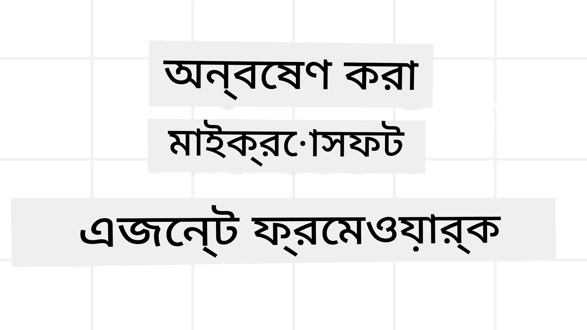
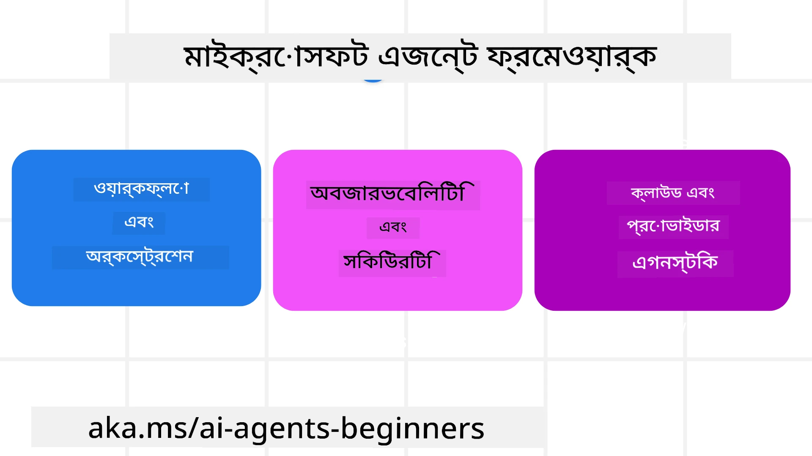

# মাইক্রোসফ্ট এজেন্ট ফ্রেমওয়ার্ক অন্বেষণ



### পরিচিতি

এই পাঠে নিম্নলিখিত বিষয়গুলি আলোচনা করা হবে:

- মাইক্রোসফ্ট এজেন্ট ফ্রেমওয়ার্ক বুঝতে: মূল বৈশিষ্ট্য এবং মূল্য  
- মাইক্রোসফ্ট এজেন্ট ফ্রেমওয়ার্কের মূল ধারণাগুলো অন্বেষণ
- উন্নত MAF প্যাটার্ন: ওয়ার্কফ্লো, মিডলওয়্যার, এবং মেমোরি

## শেখার লক্ষ্যসমূহ

এই পাঠটি সম্পন্ন করার পর, আপনি জানতে পারবেন কিভাবে:

- মাইক্রোসফ্ট এজেন্ট ফ্রেমওয়ার্ক ব্যবহার করে প্রোডাকশন-সক্ষম AI এজেন্ট তৈরি করবেন
- মাইক্রোসফ্ট এজেন্ট ফ্রেমওয়ার্কের মূল বৈশিষ্ট্যগুলি আপনার এজেন্টিক ব্যবহারে প্রয়োগ করবেন
- উন্নত প্যাটার্নগুলি যেমন ওয়ার্কফ্লো, মিডলওয়্যার, ও অবজারভেবিলিটি ব্যবহার করবেন

## কোড নমুনা

[মাইক্রোসফ্ট এজেন্ট ফ্রেমওয়ার্ক (MAF)](https://aka.ms/ai-agents-beginners/agent-framewrok) এর কোড নমুনাগুলি এই রিপোজিটরির `xx-python-agent-framework` এবং `xx-dotnet-agent-framework` ফাইলগুলির মধ্যে পাওয়া যাবে।

## মাইক্রোসফ্ট এজেন্ট ফ্রেমওয়ার্ক বুঝা



[মাইক্রোসফ্ট এজেন্ট ফ্রেমওয়ার্ক (MAF)](https://aka.ms/ai-agents-beginners/agent-framewrok) হলো মাইক্রোসফ্টের একীকৃত ফ্রেমওয়ার্ক AI এজেন্ট তৈরি করার জন্য। এটি উৎপাদন এবং গবেষণা পরিবেশে দেখা বিভিন্ন এজেন্টিক ব্যবহারের জন্য নমনীয়তা প্রদান করে, যার মধ্যে রয়েছে:

- **ক্রমাগত এজেন্ট অর্কেস্ট্রেশন** যেখানে ধাপে ধাপে ওয়ার্কফ্লো প্রয়োজন।
- **সমান্তরাল অর্কেস্ট্রেশন**, যেখানে এজেন্টদের একই সময়ে কাজ শেষ করতে হবে।
- **গ্রুপ চ্যাট অর্কেস্ট্রেশন**, যেখানে এজেন্টরা একসাথে একটি কাজের জন্য সহযোগিতা করতে পারে।
- **হ্যান্ডঅফ অর্কেস্ট্রেশন**, যেখানে এজেন্টরা উপকাজ শেষ হওয়ার সাথে সাথে পরস্পরকে কাজ হস্তান্তর করে।
- **ম্যাগনেটিক অর্কেস্ট্রেশন**, যেখানে ম্যানেজার এজেন্ট কাজের তালিকা তৈরি ও সংশোধন করে এবং উপ-এজেন্টদের সংক্রমণ সামলায়।

প্রোডাকশনে AI এজেন্ট সরবরাহ করতে, MAF-এ নিম্নলিখিত বৈশিষ্ট্যও অন্তর্ভুক্ত রয়েছে:

- **অবজারভেবিলিটি** OpenTelemetry ব্যবহার করে, যেখানে AI এজেন্টের প্রতিটি ক্রিয়াকলাপ দৃশ্যমান, যেমন টুল কল, অর্কেস্ট্রেশন ধাপ, যুক্তি প্রবাহ এবং Microsoft Foundry ড্যাশবোর্ডের মাধ্যমে পারফরম্যান্স মনিটরিং।
- **নিরাপত্তা**, Microsoft Foundry তে স্থানীয়ভাবে হোস্ট করার মাধ্যমে, যেখানে রোল-ভিত্তিক অ্যাক্সেস, ব্যক্তিগত ডেটা হ্যান্ডলিং এবং বিল্ট-ইন বিষয়বস্তু নিরাপত্তা নিয়ন্ত্রণ অন্তর্ভুক্ত।
- **স্থায়িত্ব**, কারণ এজেন্ট থ্রেড ও ওয়ার্কফ্লো স্থগিত, পুনরায় শুরু এবং ত্রুটিতে পুনরুদ্ধার করতে পারে, যা দীর্ঘ সময় চলা প্রক্রিয়া সম্ভব করে।
- **নিয়ন্ত্রণ**, যেখানে মানব-ইন-লা লুপ ওয়ার্কফ্লো সাপোর্ট করা হয় এবং কাজগুলো মানব অনুমোদনের জন্য চিহ্নিত করা হয়।

মাইক্রোসফ্ট এজেন্ট ফ্রেমওয়ার্ক আন্তঃপরিচালনায় ফোকাস করে:

- **ক্লাউড-অজ্ঞ**, এজেন্টরা কনটেইনার, অন-প্রিমিস এবং বিভিন্ন ক্লাউডে চলে।
- **প্রদানকারী-অজ্ঞ**, পছন্দসই SDK যেমন Azure OpenAI এবং OpenAI ব্যবহার করে এজেন্ট তৈরি করতে পারে।
- **ওপেন স্ট্যান্ডার্ড অর্ন্তভুক্তি**, এজেন্ট-টু-এজেন্ট (A2A) এবং মডেল কনটেক্সট প্রটোকল (MCP) এর মতো প্রোটোকল ব্যবহার করে অন্যান্য এজেন্ট ও টুল আবিষ্কার ও ব্যবহার করতে পারে।
- **প্লাগিন ও কানেক্টর**, Microsoft Fabric, SharePoint, Pinecone এবং Qdrant মতো ডেটা ও মেমোরি সার্ভিসের সাথে সংযোগ স্থাপন।

চলুন দেখি মাইক্রোসফ্ট এজেন্ট ফ্রেমওয়ার্কের কিছু মূল ধারণায় কিভাবে এই বৈশিষ্ট্যগুলি প্রয়োগ করা হয়।

## মাইক্রোসফ্ট এজেন্ট ফ্রেমওয়ার্কের মূল ধারণা

### এজেন্টগুলি


**এজেন্ট সৃষ্টি**

এজেন্ট সৃষ্টি হয় ইনফারেন্স সার্ভিস (LLM প্রদানকারী), AI এজেন্ট অনুসরণ করার নির্দেশাবলী এবং একটি `name` নির্ধারণের মাধ্যমে:

```python
agent = AzureOpenAIChatClient(credential=AzureCliCredential()).create_agent( instructions="You are good at recommending trips to customers based on their preferences.", name="TripRecommender" )
```

উপরের উদাহরণে `Azure OpenAI` ব্যবহার করা হয়েছে, তবে `Microsoft Foundry Agent Service` সহ বিভিন্ন সার্ভিস ব্যবহার করেও এজেন্ট সৃষ্টি করা যেতে পারে:

```python
AzureAIAgentClient(async_credential=credential).create_agent( name="HelperAgent", instructions="You are a helpful assistant." ) as agent
```

OpenAI এর `Responses`, `ChatCompletion` API

```python
agent = OpenAIResponsesClient().create_agent( name="WeatherBot", instructions="You are a helpful weather assistant.", )
```

```python
agent = OpenAIChatClient().create_agent( name="HelpfulAssistant", instructions="You are a helpful assistant.", )
```

অথবা [MiniMax](https://platform.minimaxi.com/), যা একটি OpenAI-সামঞ্জস্যপূর্ণ API প্রদান করে বড় কনটেক্সট উইন্ডো (সর্বোচ্চ 204K টোকেন) সহ:

```python
agent = OpenAIChatClient(base_url="https://api.minimax.io/v1", api_key=os.environ["MINIMAX_API_KEY"], model_id="MiniMax-M2.7").create_agent( name="HelpfulAssistant", instructions="You are a helpful assistant.", )
```

অথবা A2A প্রটোকল ব্যবহার করে দূরবর্তী এজেন্ট:

```python
agent = A2AAgent( name=agent_card.name, description=agent_card.description, agent_card=agent_card, url="https://your-a2a-agent-host" )
```

**এজেন্ট চালানো**

এজেন্ট `.run` বা `.run_stream` পদ্ধতিতে চালানো হয়, নন-স্ট্রিমিং বা স্ট্রিমিং প্রতিক্রিয়া জন্য।

```python
result = await agent.run("What are good places to visit in Amsterdam?")
print(result.text)
```

```python
async for update in agent.run_stream("What are the good places to visit in Amsterdam?"):
    if update.text:
        print(update.text, end="", flush=True)

```

প্রতিটি এজেন্ট চলাকালে বিভিন্ন অপশন কাস্টমাইজ করা যায় যেমন এজেন্ট দ্বারা ব্যবহৃত `max_tokens`, এজেন্ট যেসব `tools` কল করতে পারে, এবং এমনকি ব্যবহৃত `model`।

এটি ক্ষেত্রে বিশেষ কিছু মডেল বা টুল ব্যবহার প্রয়োজন হলে উপকারী।

**টুলস**

টুলগুলি এজেন্ট সংজ্ঞায়িত করার সময়:

```python
def get_attractions( location: Annotated[str, Field(description="The location to get the top tourist attractions for")], ) -> str: """Get the top tourist attractions for a given location.""" return f"The top attractions for {location} are." 


# সরাসরি একটি চ্যাটএজেন্ট তৈরি করার সময়

agent = ChatAgent( chat_client=OpenAIChatClient(), instructions="You are a helpful assistant", tools=[get_attractions]

```

এবং এজেন্ট চালানোর সময়ও সংজ্ঞায়িত করা যায়:

```python

result1 = await agent.run( "What's the best place to visit in Seattle?", tools=[get_attractions] # কেবল এই রানটির জন্য সরবরাহিত সরঞ্জাম )
```

**এজেন্ট থ্রেডস**

মাল্টি-টার্ন কথোপকথন পরিচালনার জন্য এজেন্ট থ্রেড ব্যবহৃত হয়। থ্রেড তৈরি করা যায়:

- `get_new_thread()` ব্যবহার করে যা থ্রেড সংরক্ষণ উন্নত করে
- এজেন্ট চালানোর সময় স্বয়ংক্রিয়ভাবে থ্রেড তৈরি করে যা শুধুমাত্র চলার সময় টিক থাকে।

থ্রেড তৈরি করার কোডটি দেখুন:

```python
# একটি নতুন থ্রেড তৈরি করুন।
thread = agent.get_new_thread() # থ্রেড সহ এজেন্ট চালান।
response = await agent.run("Hello, I am here to help you book travel. Where would you like to go?", thread=thread)

```

পরে এটি সংরক্ষণ করার জন্য থ্রেড সিরিয়ালাইজ করা যায়:

```python
# একটি নতুন থ্রেড তৈরি করুন।
thread = agent.get_new_thread() 

# থ্রেডের সাথে এজেন্ট চলান।

response = await agent.run("Hello, how are you?", thread=thread) 

# সংরক্ষণের জন্য থ্রেড সিরিয়ালাইজ করুন।

serialized_thread = await thread.serialize() 

# সংরক্ষণ থেকে লোড করার পরে থ্রেড অবস্থা ডেসিরিয়ালাইজ করুন।

resumed_thread = await agent.deserialize_thread(serialized_thread)
```

**এজেন্ট মিডলওয়্যার**

এজেন্ট টুল ও LLM এর সাথে ইন্টারঅ্যাক্ট করে ব্যবহারকারীর কাজ শেষ করতে। কিছু পরিস্থিতিতে, এই ইন্টারঅ্যাকশনের মাঝে কার্য সম্পাদন বা ট্র্যাক করতে চাই। এজেন্ট মিডলওয়্যার এর মাধ্যমে এটি সম্ভব:

*ফাংশন মিডলওয়্যার*

এই মিডলওয়্যার এজেন্ট ও একটি ফাংশন/টুল কলের মাঝে একটি ক্রিয়া সম্পাদন করতে দেয়। উদাহরণস্বরূপ, ফাংশন কল লগ করার জন্য এটি ব্যবহার করা যেতে পারে।

নিচের কোডে `next` নির্দেশ করে পরবর্তী মিডলওয়্যার বা প্রকৃত ফাংশন কল হবে কিনা।

```python
async def logging_function_middleware(
    context: FunctionInvocationContext,
    next: Callable[[FunctionInvocationContext], Awaitable[None]],
) -> None:
    """Function middleware that logs function execution."""
    # প্রি-প্রসেসিং: ফাংশন সম্পাদনের আগে লগ করুন
    print(f"[Function] Calling {context.function.name}")

    # পরবর্তী মিডলওয়্যার বা ফাংশন সম্পাদনার দিকে পরিচালিত করুন
    await next(context)

    # পোস্ট-প্রসেসিং: ফাংশন সম্পাদনের পরে লগ করুন
    print(f"[Function] {context.function.name} completed")
```

*চ্যাট মিডলওয়্যার*

এই মিডলওয়্যার এজেন্ট ও LLM এর অনুরোধের মাঝে কার্য সম্পাদন বা লগিং করতে দেয়।

এতে গুরুত্বপূর্ণ তথ্য থাকে যেমন AI পরিষেবায় পাঠানো `messages`।

```python
async def logging_chat_middleware(
    context: ChatContext,
    next: Callable[[ChatContext], Awaitable[None]],
) -> None:
    """Chat middleware that logs AI interactions."""
    # প্রাক-প্রক্রিয়াকরণ: AI কলের আগে লগ করুন
    print(f"[Chat] Sending {len(context.messages)} messages to AI")

    # পরবর্তী মিডলওয়্যার বা AI সেবা চালিয়ে যান
    await next(context)

    # পোস্ট-প্রক্রিয়াকরণ: AI প্রতিক্রিয়ার পরে লগ করুন
    print("[Chat] AI response received")

```

**এজেন্ট মেমোরি**

`Agentic Memory` পাঠে আলোচনা করা হয়েছে, মেমোরি হলো একটি গুরুত্বপূর্ণ অংশ যাতে এজেন্ট ভিন্ন প্রসঙ্গে কাজ করতে পারে। MAF বিভিন্ন ধরণের মেমোরি সরবরাহ করে:

*ইন-মেমোরি স্টোরেজ*

এটি অ্যাপ্লিকেশন রানটাইমে থ্রেডে সংরক্ষিত মেমোরি।

```python
# একটি নতুন থ্রেড তৈরি করুন।
thread = agent.get_new_thread() # থ্রেড দিয়ে এজেন্ট চালান।
response = await agent.run("Hello, I am here to help you book travel. Where would you like to go?", thread=thread)
```

*স্থায়ী বার্তা*

ভিন্ন সেশন জুড়ে কথোপকথন ইতিহাস সংরক্ষণের জন্য ব্যবহৃত মেমোরি। এটি `chat_message_store_factory` ব্যবহার করে সংজ্ঞায়িত হয়:

```python
from agent_framework import ChatMessageStore

# একটি কাস্টম মেসেজ স্টোর তৈরি করুন
def create_message_store():
    return ChatMessageStore()

agent = ChatAgent(
    chat_client=OpenAIChatClient(),
    instructions="You are a Travel assistant.",
    chat_message_store_factory=create_message_store
)

```

*ডায়নামিক মেমোরি*

এই মেমোরি এজেন্ট চালানোর আগে প্রসঙ্গে যুক্ত হয়। এটি বাইরে থেকে যেমন mem0-তে সংরক্ষণ করা যেতে পারে:

```python
from agent_framework.mem0 import Mem0Provider

# উন্নত মেমরি সক্ষমতার জন্য Mem0 ব্যবহার করা হচ্ছে
memory_provider = Mem0Provider(
    api_key="your-mem0-api-key",
    user_id="user_123",
    application_id="my_app"
)

agent = ChatAgent(
    chat_client=OpenAIChatClient(),
    instructions="You are a helpful assistant with memory.",
    context_providers=memory_provider
)

```

**এজেন্ট অবজারভেবিলিটি**

অবজারভেবিলিটি নির্ভরযোগ্য এবং রক্ষণযোগ্য এজেন্টিক সিস্টেম নির্মাণে গুরুত্বপূর্ণ। MAF OpenTelemetry-র সাথে সংযুক্ত হয়ে ট্রেসিং ও মিটার সরবরাহ করে উন্নত অবজারভেবিলিটির জন্য।

```python
from agent_framework.observability import get_tracer, get_meter

tracer = get_tracer()
meter = get_meter()
with tracer.start_as_current_span("my_custom_span"):
    # কিছু করো
    pass
counter = meter.create_counter("my_custom_counter")
counter.add(1, {"key": "value"})
```

### ওয়ার্কফ্লো

MAF ওয়ার্কফ্লো দেয় যা পূর্বনির্ধারিত ধাপের মাধ্যমে কাজ সম্পন্ন করে এবং সেই ধাপে AI এজেন্ট অন্তর্ভুক্ত থাকে।

ওয়ার্কফ্লো বিভিন্ন উপাদান নিয়ে গঠিত যা নিয়ন্ত্রণ প্রবাহ উন্নত করে। ওয়ার্কফ্লো **মাল্টি-এজেন্ট অর্কেস্ট্রেশন** ও **চেকপয়েন্টিং** সমর্থন করে ওয়ার্কফ্লো অবস্থা সংরক্ষণের জন্য।

একটি ওয়ার্কফ্লোর মূল উপাদানগুলি হলো:

**এক্সিকিউটরস**

এক্সিকিউটর ইনপুট বার্তা গ্রহণ করে, তাদের নির্ধারিত কাজ সম্পন্ন করে এবং আউটপুট বার্তা তৈরি করে। এটি ওয়ার্কফ্লোকে বড় কাজের দিকে এগিয়ে নিয়ে যায়। এক্সিকিউটর হতে পারে AI এজেন্ট বা কাস্টম লজিক।

**এড্জেস**

এড্জেস ওয়ার্কফ্লোতে বার্তার প্রবাহ সংজ্ঞায়িত করতে ব্যবহৃত হয়। এগুলো হতে পারে:

*ডাইরেক্ট এড্জেস* - সরল এক থেকে এক সংযোগ এক্সিকিউটরদের মধ্যে:

```python
from agent_framework import WorkflowBuilder

builder = WorkflowBuilder()
builder.add_edge(source_executor, target_executor)
builder.set_start_executor(source_executor)
workflow = builder.build()
```

*কন্ডিশনাল এড্জেস* - নির্দিষ্ট শর্ত পূরণ হলে সক্রিয় হয়। যেমন, হোটেল কক্ষ অনুপলব্ধ হলে, এক্সিকিউটর অন্যান্য বিকল্প প্রস্তাব করতে পারে।

*সুইচ-কেস এড্জেস* - নির্ধারিত শর্ত অনুসারে বার্তাগুলো বিভিন্ন এক্সিকিউটরে রুট করে। যেমন, ট্রাভেল কাস্টমারের অগ্রাধিকার অ্যাক্সেস থাকলে তাদের কাজ অন্য ওয়ার্কফ্লো দ্বারা পরিচালিত হয়।

*ফ্যান-আউট এড্জেস* - একটি বার্তা একাধিক টার্গেটে পাঠায়।

*ফ্যান-ইন এড্জেস* - বিভিন্ন এক্সিকিউটরের কাছে থেকে একাধিক বার্তা সংগ্রহ করে একটি টার্গেটে পাঠায়।

**ইভেন্টগুলো**

ওয়ার্কফ্লোতে ভাল অবজারভেবিলিটি দিতে MAF বিল্ট-ইন ইভেন্ট সরবরাহ করে, যেমন:

- `WorkflowStartedEvent`  - ওয়ার্কফ্লো চালু হয়
- `WorkflowOutputEvent` - ওয়ার্কফ্লো আউটপুট দেয়
- `WorkflowErrorEvent` - ওয়ার্কফ্লো ত্রুটি পায়
- `ExecutorInvokeEvent`  - এক্সিকিউটর প্রক্রিয়া শুরু করে
- `ExecutorCompleteEvent`  - এক্সিকিউটর প্রক্রিয়া শেষ করে
- `RequestInfoEvent` - একটি অনুরোধ করা হয়

## উন্নত MAF প্যাটার্ন

উপরের অংশগুলো মাইক্রোসফ্ট এজেন্ট ফ্রেমওয়ার্কের মূল ধারণাগুলো আলোচনা করেছে। যখন আপনি আরও জটিল এজেন্ট তৈরি করবেন, তখন এখানে কিছু উন্নত প্যাটার্ন বিবেচনা করুন:

- **মিডলওয়্যার কম্পোজিশন**: একাধিক মিডলওয়্যার হ্যান্ডলার (লগিং, অথেনটিকেশন, রেট-লিমিটিং) ফাংশন ও চ্যাট মিডলওয়্যার ব্যবহার করে একত্রিত করুন, এজেন্ট আচরণের সূক্ষ্ম নিয়ন্ত্রণের জন্য।
- **ওয়ার্কফ্লো চেকপয়েন্টিং**: ওয়ার্কফ্লো ইভেন্ট ও সিরিয়ালাইজেশন ব্যবহার করে দীর্ঘমেয়াদি এজেন্ট প্রক্রিয়াগুলো সংরক্ষণ ও পুনরায় শুরু করুন।
- **ডায়নামিক টুল নির্বাচন**: MAF-এর টুল রেজিস্ট্রেশন ব্যবহার করে টুল বর্ণনার উপর ভিত্তি করে RAG একত্রিত করে শুধুমাত্র প্রাসঙ্গিক টুল প্রদর্শন করুন।
- **মাল্টি-এজেন্ট হ্যান্ডঅফ**: ওয়ার্কফ্লো এড্জেস ও শর্তাধীন রাউটিং ব্যবহার করে বিশেষায়িত এজেন্টদের মধ্যে কাজ হস্তান্তর পরিকল্পনা করুন।

## কোড নমুনা

মাইক্রোসফ্ট এজেন্ট ফ্রেমওয়ার্কের কোড নমুনা এই রিপোজিটরির `xx-python-agent-framework` এবং `xx-dotnet-agent-framework` ফাইলগুলির মধ্যে পাওয়া যাবে।

## মাইক্রোসফ্ট এজেন্ট ফ্রেমওয়ার্ক সম্পর্কে আরও প্রশ্ন আছে?

[Microsoft Foundry Discord](https://aka.ms/ai-agents/discord) এ যোগ দিন, অন্যান্য শিক্ষার্থীদের সাথে মিলিত হোন, অফিস আওয়ার অংশগ্রহণ করুন এবং আপনার AI এজেন্ট সম্পর্কিত প্রশ্নের উত্তর পান।

---

<!-- CO-OP TRANSLATOR DISCLAIMER START -->
**অস্বীকৃতি**:
এই নথিটি AI অনুবাদ সেবা [Co-op Translator](https://github.com/Azure/co-op-translator) ব্যবহার করে অনূদিত হয়েছে। যদিও আমরা সঠিকতার জন্য চেষ্টা করি, তবে দয়া করে জানুন যে স্বয়ংক্রিয় অনুবাদে ভুল বা অমিমাংসিততা থাকতে পারে। প্রামাণিক উৎস হিসাবে আদিক নথিটি তার মূল ভাষায় বিবেচনা করা উচিত। গুরুত্বপূর্ণ তথ্যের জন্য পেশাদার মানব অনুবাদের পরামর্শ দেওয়া হয়। এই অনুবাদের ব্যবহারে সৃষ্ট কোনো ভুল বোঝাবুঝি বা ভ্রান্ত ব্যাখ্যার জন্য আমরা দায়বদ্ধ নই।
<!-- CO-OP TRANSLATOR DISCLAIMER END -->