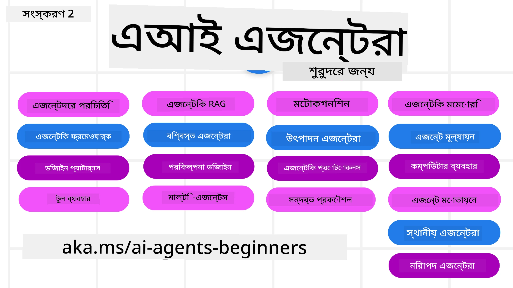

# AI Agents for Beginners - একটি কোর্স



## একটি কোর্স যা আপনাকে AI Agents তৈরির জন্য প্রয়োজনীয় সমস্ত কিছু শেখায়

[](https://github.com/microsoft/ai-agents-for-beginners/blob/master/LICENSE?WT.mc_id=academic-105485-koreyst)
[](https://GitHub.com/microsoft/ai-agents-for-beginners/graphs/contributors/?WT.mc_id=academic-105485-koreyst)
[](https://GitHub.com/microsoft/ai-agents-for-beginners/issues/?WT.mc_id=academic-105485-koreyst)
[](https://GitHub.com/microsoft/ai-agents-for-beginners/pulls/?WT.mc_id=academic-105485-koreyst)
[](http://makeapullrequest.com?WT.mc_id=academic-105485-koreyst)

### 🌐 বহু-ভাষা সমর্থন

#### GitHub Action দ্বারা সমর্থিত (স্বয়ংক্রিয় এবং সর্বদা আপটু-ডেট)

<!-- CO-OP TRANSLATOR LANGUAGES TABLE START -->
[Arabic](../ar/README.md) | [Bengali](./README.md) | [Bulgarian](../bg/README.md) | [Burmese (Myanmar)](../my/README.md) | [Chinese (Simplified)](../zh-CN/README.md) | [Chinese (Traditional, Hong Kong)](../zh-HK/README.md) | [Chinese (Traditional, Macau)](../zh-MO/README.md) | [Chinese (Traditional, Taiwan)](../zh-TW/README.md) | [Croatian](../hr/README.md) | [Czech](../cs/README.md) | [Danish](../da/README.md) | [Dutch](../nl/README.md) | [Estonian](../et/README.md) | [Finnish](../fi/README.md) | [French](../fr/README.md) | [German](../de/README.md) | [Greek](../el/README.md) | [Hebrew](../he/README.md) | [Hindi](../hi/README.md) | [Hungarian](../hu/README.md) | [Indonesian](../id/README.md) | [Italian](../it/README.md) | [Japanese](../ja/README.md) | [Kannada](../kn/README.md) | [Khmer](../km/README.md) | [Korean](../ko/README.md) | [Lithuanian](../lt/README.md) | [Malay](../ms/README.md) | [Malayalam](../ml/README.md) | [Marathi](../mr/README.md) | [Nepali](../ne/README.md) | [Nigerian Pidgin](../pcm/README.md) | [Norwegian](../no/README.md) | [Persian (Farsi)](../fa/README.md) | [Polish](../pl/README.md) | [Portuguese (Brazil)](../pt-BR/README.md) | [Portuguese (Portugal)](../pt-PT/README.md) | [Punjabi (Gurmukhi)](../pa/README.md) | [Romanian](../ro/README.md) | [Russian](../ru/README.md) | [Serbian (Cyrillic)](../sr/README.md) | [Slovak](../sk/README.md) | [Slovenian](../sl/README.md) | [Spanish](../es/README.md) | [Swahili](../sw/README.md) | [Swedish](../sv/README.md) | [Tagalog (Filipino)](../tl/README.md) | [Tamil](../ta/README.md) | [Telugu](../te/README.md) | [Thai](../th/README.md) | [Turkish](../tr/README.md) | [Ukrainian](../uk/README.md) | [Urdu](../ur/README.md) | [Vietnamese](../vi/README.md)

> **স্থানীয়ভাবে ক্লোন করতে চান?**
>
> এই রেপোতিতে ৫০+ ভাষার অনুবাদ রয়েছে যা ডাউনলোড সাইজ উল্লেখযোগ্যভাবে বৃদ্ধি করে। অনুবাদ ছাড়া ক্লোন করতে sparse checkout ব্যবহার করুন:
>
> **Bash / macOS / Linux:**
> ```bash
> git clone --filter=blob:none --sparse https://github.com/microsoft/ai-agents-for-beginners.git
> cd ai-agents-for-beginners
> git sparse-checkout set --no-cone '/*' '!translations' '!translated_images'
> ```
>
> **CMD (Windows):**
> ```cmd
> git clone --filter=blob:none --sparse https://github.com/microsoft/ai-agents-for-beginners.git
> cd ai-agents-for-beginners
> git sparse-checkout set --no-cone "/*" "!translations" "!translated_images"
> ```
>
> এটি আপনাকে দ্রুত ডাউনলোডের মাধ্যমে কোর্স সম্পন্ন করার জন্য দরকার সবকিছু প্রদান করে।
<!-- CO-OP TRANSLATOR LANGUAGES TABLE END -->

**আরও অনুবাদ ভাষা সমর্থনের জন্য তালিকাভুক্ত ভাষাসমূহ দেখতে [এখানে](https://github.com/Azure/co-op-translator/blob/main/getting_started/supported-languages.md) যান**

[](https://GitHub.com/microsoft/ai-agents-for-beginners/watchers/?WT.mc_id=academic-105485-koreyst)
[](https://GitHub.com/microsoft/ai-agents-for-beginners/network/?WT.mc_id=academic-105485-koreyst)
[](https://GitHub.com/microsoft/ai-agents-for-beginners/stargazers/?WT.mc_id=academic-105485-koreyst)

[](https://discord.gg/nTYy5BXMWG)


## 🌱 শুরু করা

এই কোর্সে AI Agents তৈরি করার মৌলিক ধারণা নিয়ে পাঠ রয়েছে। প্রতিটি পাঠ তার নিজস্ব বিষয় কভার করে, তাই আপনি যেখান থেকেই শুরু করতে পারেন!

এই কোর্সের জন্য বহু-ভাষা সমর্থন আছে। আমাদের [উপলব্ধ ভাষাগুলো এখানে](#-multi-language-support) দেখুন। 

আপনি যদি প্রথমবারের মতো Generative AI মডেল ব্যবহার করছেন, তাহলে আমাদের [Generative AI For Beginners](https://aka.ms/genai-beginners) কোর্সটি দেখুন, যেখানে GenAI নিয়ে ২১টি পাঠ অন্তর্ভুক্ত রয়েছে।

এই রেপোটি [স্টার (🌟) করতে](https://docs.github.com/en/get-started/exploring-projects-on-github/saving-repositories-with-stars?WT.mc_id=academic-105485-koreyst) এবং কোড চালানোর জন্য [ফর্ক করতে](https://github.com/microsoft/ai-agents-for-beginners/fork) ভুলবেন না।

### অন্য শিক্ষার্থীদের সাথে পরিচিত হোন, আপনার প্রশ্নের উত্তর পান

আপনি যদি আটকে যান বা AI Agents তৈরির বিষয়ে কোনো প্রশ্ন থাকে, তাহলে আমাদের নিবেদিত Discord চ্যানেলে যোগ দিন [Microsoft Foundry Discord](https://aka.ms/ai-agents/discord) এ।

### আপনার যা যা প্রয়োজন

এই কোর্সের প্রতিটি পাঠে কোডের উদাহরণ রয়েছে, যা code_samples ফোল্ডারে পাওয়া যাবে। আপনি [এই রেপোটি ফর্ক করে](https://github.com/microsoft/ai-agents-for-beginners/fork) নিজের একটি কপি তৈরি করতে পারেন।  

এই ব্যায়ামগুলোর কোড উদাহরণে Microsoft Agent Framework এবং Azure AI Foundry Agent Service V2 ব্যবহার হয়েছে:

- [Microsoft Foundry](https://aka.ms/ai-agents-beginners/ai-foundry) - Azure অ্যাকাউন্ট প্রয়োজন

এই কোর্সে Microsoft এর নিম্নলিখিত AI Agent ফ্রেমওয়ার্ক এবং সার্ভিস ব্যবহৃত হয়েছে:

- [Microsoft Agent Framework (MAF)](https://aka.ms/ai-agents-beginners/agent-framewrok)
- [Azure AI Foundry Agent Service V2](https://aka.ms/ai-agents-beginners/ai-agent-service)

কিছু কোড নমুনা OpenAI-সঙ্গত বিকল্প প্রদানকারীদেরও সমর্থন করে, যেমন [MiniMax](https://platform.minimaxi.com/), যা বড়-কন্টেক্সট মডেল (২৪০ হাজার টোকেন পর্যন্ত) অফার করে। কনফিগারেশনের বিস্তারিত দেখতে [Course Setup](./00-course-setup/README.md) দেখুন।

এই কোর্সের কোড চালানোর বিষয়ে আরও তথ্যের জন্য দেখুন [Course Setup](./00-course-setup/README.md)।

## 🙏 সাহায্য করতে চান?

আপনার কোনো পরামর্শ আছে অথবা বানান বা কোডে ভুল পেয়েছেন? [ইস্যু রাইজ করুন](https://github.com/microsoft/ai-agents-for-beginners/issues?WT.mc_id=academic-105485-koreyst) অথবা [পুল রিকোয়েস্ট তৈরি করুন](https://github.com/microsoft/ai-agents-for-beginners/pulls?WT.mc_id=academic-105485-koreyst)।

## 📂 প্রতিটি পাঠ অন্তর্ভুক্ত করে

- README তে লেখা পাঠ এবং একটি সংক্ষিপ্ত ভিডিও
- Microsoft Agent Framework এবং Azure AI Foundry ব্যবহার করে Python কোড উদাহরণ
- আপনার শেখা চালিয়ে যাওয়ার জন্য অতিরিক্ত সংস্থান লিঙ্কসমূহ

## 🗃️ পাঠসমূহ

| **পাঠ**                                      | **লেখা ও কোড**                                  | **ভিডিও**                                                   | **অতিরিক্ত শেখা**                                                                   |
|-----------------------------------------------|--------------------------------------------------|-------------------------------------------------------------|---------------------------------------------------------------------------------------|
| AI Agents এবং Agent ব্যবহারের পরিচিতি         | [লিঙ্ক](./01-intro-to-ai-agents/README.md)       | [ভিডিও](https://youtu.be/3zgm60bXmQk?si=z8QygFvYQv-9WtO1)   | [লিঙ্ক](https://aka.ms/ai-agents-beginners/collection?WT.mc_id=academic-105485-koreyst) |
| AI Agentic Frameworks অন্বেষণ                  | [লিঙ্ক](./02-explore-agentic-frameworks/README.md)| [ভিডিও](https://youtu.be/ODwF-EZo_O8?si=Vawth4hzVaHv-u0H)   | [লিঙ্ক](https://aka.ms/ai-agents-beginners/collection?WT.mc_id=academic-105485-koreyst) |
| AI Agentic Design Patterns বোঝা               | [লিঙ্ক](./03-agentic-design-patterns/README.md)  | [ভিডিও](https://youtu.be/m9lM8qqoOEA?si=BIzHwzstTPL8o9GF)   | [লিঙ্ক](https://aka.ms/ai-agents-beginners/collection?WT.mc_id=academic-105485-koreyst) |
| Tool Use Design Pattern                        | [লিঙ্ক](./04-tool-use/README.md)                   | [ভিডিও](https://youtu.be/vieRiPRx-gI?si=2z6O2Xu2cu_Jz46N)   | [লিঙ্ক](https://aka.ms/ai-agents-beginners/collection?WT.mc_id=academic-105485-koreyst) |
| Agentic RAG                                   | [লিঙ্ক](./05-agentic-rag/README.md)                | [ভিডিও](https://youtu.be/WcjAARvdL7I?si=gKPWsQpKiIlDH9A3)   | [লিঙ্ক](https://aka.ms/ai-agents-beginners/collection?WT.mc_id=academic-105485-koreyst) |
| বিশ্বাসযোগ্য AI Agents তৈরি                    | [লিঙ্ক](./06-building-trustworthy-agents/README.md)| [ভিডিও](https://youtu.be/iZKkMEGBCUQ?si=jZjpiMnGFOE9L8OK ) | [লিঙ্ক](https://aka.ms/ai-agents-beginners/collection?WT.mc_id=academic-105485-koreyst) |
| Planning Design Pattern                        | [লিঙ্ক](./07-planning-design/README.md)            | [ভিডিও](https://youtu.be/kPfJ2BrBCMY?si=6SC_iv_E5-mzucnC)   | [লিঙ্ক](https://aka.ms/ai-agents-beginners/collection?WT.mc_id=academic-105485-koreyst) |
| Multi-Agent Design Pattern                     | [লিঙ্ক](./08-multi-agent/README.md)                | [ভিডিও](https://youtu.be/V6HpE9hZEx0?si=rMgDhEu7wXo2uo6g)   | [লিঙ্ক](https://aka.ms/ai-agents-beginners/collection?WT.mc_id=academic-105485-koreyst) |
| মেটাকগনিশন ডিজাইন প্যাটার্ন                 | [লিঙ্ক](./09-metacognition/README.md)               | [ভিডিও](https://youtu.be/His9R6gw6Ec?si=8gck6vvdSNCt6OcF)  | [লিঙ্ক](https://aka.ms/ai-agents-beginners/collection?WT.mc_id=academic-105485-koreyst) |
| উৎপাদনে AI এজেন্টস                      | [লিঙ্ক](./10-ai-agents-production/README.md)        | [ভিডিও](https://youtu.be/l4TP6IyJxmQ?si=31dnhexRo6yLRJDl)  | [লিঙ্ক](https://aka.ms/ai-agents-beginners/collection?WT.mc_id=academic-105485-koreyst) |
| এজেন্টিক প্রোটোকল ব্যবহৃতি (MCP, A2A এবং NLWeb) | [লিঙ্ক](./11-agentic-protocols/README.md)           | [ভিডিও](https://youtu.be/X-Dh9R3Opn8)                                 | [লিঙ্ক](https://aka.ms/ai-agents-beginners/collection?WT.mc_id=academic-105485-koreyst) |
| AI এজেন্টসের জন্য কনটেক্সট ইঞ্জিনিয়ারিং            | [লিঙ্ক](./12-context-engineering/README.md)         | [ভিডিও](https://youtu.be/F5zqRV7gEag)                                 | [লিঙ্ক](https://aka.ms/ai-agents-beginners/collection?WT.mc_id=academic-105485-koreyst) |
| এজেন্টিক মেমোরি ব্যবস্থাপনা                      | [লিঙ্ক](./13-agent-memory/README.md)     |      [ভিডিও](https://youtu.be/QrYbHesIxpw?si=vZkVwKrQ4ieCcIPx)                                                      |                                                                                        |
| মাইক্রোসফ্ট এজেন্ট ফ্রেমওয়ার্ক অনুসন্ধান                         | [লিঙ্ক](./14-microsoft-agent-framework/README.md)                            |                                                            |                                                                                        |
| কম্পিউটার ব্যবহারকারী এজেন্ট নির্মাণ (CUA)           | [লিঙ্ক](./15-browser-use/README.md)     |                                                            | [লিঙ্ক](https://docs.browser-use.com/examples/templates/playwright-integration)         |
| স্কেলযোগ্য এজেন্ট মোতায়েন                    | শীঘ্রই আসছে                            |                                                            |                                                                                        |
| স্থানীয় AI এজেন্ট তৈরি                     | শীঘ্রই আসছে                               |                                                            |                                                                                        |
| AI এজেন্ট নিরাপদকরণ                           | শীঘ্রই আসছে                               |                                                            |                                                                                        |

## 🎒 অন্যান্য কোর্সসমূহ

আমাদের দল অন্যান্য কোর্স তৈরি করে! এখানে দেখুন:

<!-- CO-OP TRANSLATOR OTHER COURSES START -->
### ল্যাংচেইন
[](https://aka.ms/langchain4j-for-beginners)
[](https://aka.ms/langchainjs-for-beginners?WT.mc_id=m365-94501-dwahlin)
[](https://github.com/microsoft/langchain-for-beginners?WT.mc_id=m365-94501-dwahlin)
---

### আজুর / এজ / MCP / এজেন্টস
[](https://github.com/microsoft/AZD-for-beginners?WT.mc_id=academic-105485-koreyst)
[](https://github.com/microsoft/edgeai-for-beginners?WT.mc_id=academic-105485-koreyst)
[](https://github.com/microsoft/mcp-for-beginners?WT.mc_id=academic-105485-koreyst)
[](https://github.com/microsoft/ai-agents-for-beginners?WT.mc_id=academic-105485-koreyst)

---
 
### জেনেরেটিভ AI সিরিজ
[](https://github.com/microsoft/generative-ai-for-beginners?WT.mc_id=academic-105485-koreyst)
[-9333EA?style=for-the-badge&labelColor=E5E7EB&color=9333EA)](https://github.com/microsoft/Generative-AI-for-beginners-dotnet?WT.mc_id=academic-105485-koreyst)
[-C084FC?style=for-the-badge&labelColor=E5E7EB&color=C084FC)](https://github.com/microsoft/generative-ai-for-beginners-java?WT.mc_id=academic-105485-koreyst)
[-E879F9?style=for-the-badge&labelColor=E5E7EB&color=E879F9)](https://github.com/microsoft/generative-ai-with-javascript?WT.mc_id=academic-105485-koreyst)

---
 
### কোর লার্নিং
[](https://aka.ms/ml-beginners?WT.mc_id=academic-105485-koreyst)
[](https://aka.ms/datascience-beginners?WT.mc_id=academic-105485-koreyst)
[](https://aka.ms/ai-beginners?WT.mc_id=academic-105485-koreyst)
[](https://github.com/microsoft/Security-101?WT.mc_id=academic-96948-sayoung)
[](https://aka.ms/webdev-beginners?WT.mc_id=academic-105485-koreyst)
[](https://aka.ms/iot-beginners?WT.mc_id=academic-105485-koreyst)
[](https://github.com/microsoft/xr-development-for-beginners?WT.mc_id=academic-105485-koreyst)

---
 
### কোপিলট সিরিজ
[](https://aka.ms/GitHubCopilotAI?WT.mc_id=academic-105485-koreyst)
[](https://github.com/microsoft/mastering-github-copilot-for-dotnet-csharp-developers?WT.mc_id=academic-105485-koreyst)
[](https://github.com/microsoft/CopilotAdventures?WT.mc_id=academic-105485-koreyst)
<!-- CO-OP TRANSLATOR OTHER COURSES END -->

## 🌟 কমিউনিটি ধন্যবাদ

Agentic RAG প্রদর্শিত গুরুত্বপূর্ণ কোড স্যাম্পলগুলোতে অবদান রাখায় [শিবম গোয়াল](https://www.linkedin.com/in/shivam2003/) কে ধন্যবাদ।

## অবদান রাখা

এই প্রকল্পে অবদান এবং পরামর্শ স্বাগত জানানো হয়। অধিকাংশ অবদানের জন্য আপনাকে একটি
Contributor License Agreement (CLA) এ সম্মতি দিতে হবে যা ঘোষণা করে আপনি অধিকারী এবং প্রকৃতপক্ষে আমাদেরকে আপনার অবদানের ব্যবহার করার অধিকার দিচ্ছেন। বিস্তারিত জানার জন্য <https://cla.opensource.microsoft.com> ভিজিট করুন।

আপনি যখন একটি পুল রিকোয়েস্ট জমা দেন, CLA বট স্বয়ংক্রিয়ভাবে নির্ধারণ করবে যে আপনাকে CLA প্রদান করতে হবে কিনা এবং যথাযথভাবে PR-এ ডেকোরেট করবে (উদাহরণ স্বরূপ, স্ট্যাটাস চেক, মন্তব্য)। বট প্রদত্ত নির্দেশ অনুসরণ করুন। আমাদের CLA ব্যবহারকারী সমস্ত রিপোজে একবারই এটি করতে হবে।

এই প্রকল্পে [Microsoft Open Source Code of Conduct](https://opensource.microsoft.com/codeofconduct/) গ্রহণ করা হয়েছে।
আরও তথ্যের জন্য দেখুন [Code of Conduct FAQ](https://opensource.microsoft.com/codeofconduct/faq/) অথবা
অতিরিক্ত প্রশ্ন বা মন্তব্যের জন্য যোগাযোগ করুন [opencode@microsoft.com](mailto:opencode@microsoft.com)।

## ট্রেডমার্কস

এই প্রকল্পে প্রকল্প, পণ্য বা পরিষেবার ট্রেডমার্ক বা লোগো থাকতে পারে। Microsoft
ট্রেডমার্ক বা লোগোর অনুমোদিত ব্যবহার [Microsoft-এর Trademark & Brand Guidelines](https://www.microsoft.com/legal/intellectualproperty/trademarks/usage/general) অনুযায়ী হতে হবে এবং তা অনুসরণ করতে হবে।
Microsoft ট্রেডমার্ক বা লোগো পরিবর্তিত সংস্করণে ব্যবহৃত হলে বিভ্রান্তি সৃষ্টি করতে বা Microsoft স্পন্সরশিপ বোঝাতে পারবে না।
তৃতীয় পক্ষের ট্রেডমার্ক বা লোগোর ব্যবহার তাদের নিজস্ব নীতিমালা অনুসারে হতে হবে।

## সহায়তা পাওয়া

আপনি আটকে গেলে বা AI অ্যাপ তৈরি সম্পর্কে কোনো প্রশ্ন থাকলে, যোগ দিন:

[](https://aka.ms/foundry/discord)

আপনার যদি পণ্যের প্রতিক্রিয়া বা নির্মাণের সময় ত্রুটি থাকে তবে যান:

[](https://aka.ms/foundry/forum)

---

<!-- CO-OP TRANSLATOR DISCLAIMER START -->
**অস্বীকারোক্তি**:
এই নথিটি AI অনুবাদ সেবা [Co-op Translator](https://github.com/Azure/co-op-translator) ব্যবহার করে অনূদিত হয়েছে। আমরা যথাসাধ্য সঠিকতার চেষ্টা করি, তবে দয়া করে লক্ষ্য করুন যে স্বয়ংক্রিয় অনুবাদে ভুল বা অপরিষ্কারতা থাকতে পারে। মূলে নথিটি তার নিজস্ব ভাষায় প্রামাণিক উৎস হিসাবে গণ্য করা উচিত। গুরুত্বপূর্ণ তথ্যের জন্য পেশাদার মানব অনুবাদ সুপারিশ করা হয়। এই অনুবাদের ব্যবহারের ফলে হওয়া কোনো ভুল বোঝাবুঝি বা ভুল ব্যাখ্যার জন্য আমরা দায়ী নই।
<!-- CO-OP TRANSLATOR DISCLAIMER END -->