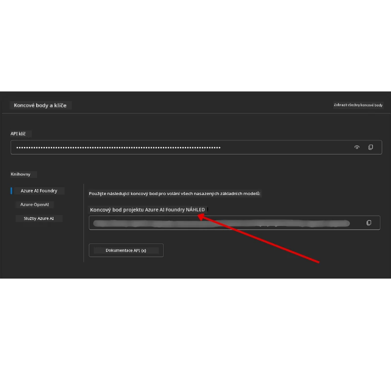

# Nastavení kurzu

## Úvod

Tato lekce pokrývá, jak spustit ukázky kódu tohoto kurzu.

## Připojte se k ostatním studentům a získejte pomoc

Než začnete klonovat svůj repozitář, připojte se na [AI Agents For Beginners Discord kanál](https://aka.ms/ai-agents/discord), kde můžete získat pomoc s nastavením, zodpovědět otázky ohledně kurzu nebo se spojit s dalšími studenty.

## Klonujte nebo forkněte tento repozitář

Pro začátek prosím klonujte nebo forkněte GitHub repozitář. Tím si vytvoříte vlastní verzi materiálů kurzu, kterou můžete spouštět, testovat a upravovat kód!

To lze provést kliknutím na odkaz <a href="https://github.com/microsoft/ai-agents-for-beginners/fork" target="_blank">fork repozitáře</a>

Nyní byste měli mít svou vlastní forknutou verzi tohoto kurzu na následujícím odkazu:


### Povrchní klonování (doporučeno pro workshop / Codespaces)

  >Celý repozitář může být velký (~3 GB), pokud stáhnete celou historii a všechny soubory. Pokud se účastníte pouze workshopu nebo potřebujete jen několik složek lekcí, povrchní klonování (nebo sparse klonování) zamezí většině tohoto stahování tím, že omezí historii a/nebo přeskočí blob objekty.

#### Rychlé povrchní klonování — minimální historie, všechny soubory

Nahraďte `<your-username>` ve níže uvedených příkazech URL svého forku (nebo upstream URL, pokud preferujete).

Pro klonování jen poslední historie commitu (malé stažení):

```bash|powershell
git clone --depth 1 https://github.com/<your-username>/ai-agents-for-beginners.git
```

Pro klonování konkrétní větve:

```bash|powershell
git clone --depth 1 --branch <branch-name> https://github.com/<your-username>/ai-agents-for-beginners.git
```

#### Částečné (sparse) klonování — minimální blob objekty + jen vybrané složky

Používá partial clone a sparse-checkout (vyžaduje Git 2.25+ a doporučuje se moderní Git s podporou partial clone):

```bash|powershell
git clone --depth 1 --filter=blob:none --sparse https://github.com/<your-username>/ai-agents-for-beginners.git
```

Přejděte do složky repozitáře:

```bash|powershell
cd ai-agents-for-beginners
```

Pak určete, které složky chcete (příklad níže ukazuje dvě složky):

```bash|powershell
git sparse-checkout set 00-course-setup 01-intro-to-ai-agents
```

Po klonování a ověření souborů, pokud potřebujete jen soubory a chcete uvolnit místo (bez git historie), prosím smažte metadata repozitáře (💀nevratné — ztratíte veškerou funkčnost Git: žádné commity, pull, push ani přístup k historii).

```bash
# zsh/bash
rm -rf .git
```

```powershell
# PowerShell
Remove-Item -Recurse -Force .git
```

#### Použití GitHub Codespaces (doporučeno pro vyhnutí se velkým lokálním stahováním)

- Vytvořte nový Codespace pro tento repozitář přes [GitHub UI](https://github.com/codespaces).

- V terminálu nově vytvořeného Codespace spusťte jeden z výše uvedených povrchních/sparse klonovacích příkazů, abyste přinesli do Codespace pracovní plochy jen požadované složky lekcí.
- Volitelné: po klonování uvnitř Codespaces odstraňte .git pro uvolnění místa (viz výše uvedené příkazy).
- Poznámka: Pokud raději otevřete repozitář přímo v Codespaces (bez dodatečného klonování), mějte na paměti, že Codespaces bude sestavovat devcontainer prostředí a může stále nastavit více, než potřebujete. Klonování povrchní kopie uvnitř čerstvého Codespace vám dává větší kontrolu nad využitím disku.

#### Tipy

- Vždy nahraďte URL klonu svým forkem, pokud chcete upravovat/commitovat.
- Pokud později budete potřebovat více historie nebo souborů, můžete je stáhnout nebo upravit sparse-checkout k zahrnutí dalších složek.

## Spuštění kódu

Tento kurz nabízí sérii Jupyter notebooků, které můžete spouštět a získat tak praktické zkušenosti s tvorbou AI agentů.

Ukázky kódu používají **Microsoft Agent Framework (MAF)** s `AzureAIProjectAgentProvider`, který se připojuje k **Azure AI Agent Service V2** (Responses API) přes **Microsoft Foundry**.

Všechny pythonovské notebooky jsou označené `*-python-agent-framework.ipynb`.

## Požadavky

- Python 3.12+
  - **POZNÁMKA**: Pokud nemáte nainstalován Python3.12, ujistěte se, že jej nainstalujete. Pak vytvořte svůj virtuální prostředí pomocí python3.12, aby byly nainstalovány správné verze z requirements.txt.
  
    >Příklad

    Vytvoření adresáře virtuálního prostředí Python:

    ```bash|powershell
    python -m venv venv
    ```

    Pak aktivujte virtual environment pro:

    ```bash
    # zsh/bash
    source venv/bin/activate
    ```
  
    ```dos
    # Command Prompt for Windows
    venv\Scripts\activate
    ```

- .NET 10+: Pro ukázkové kódy používající .NET si nainstalujte [.NET 10 SDK](https://dotnet.microsoft.com/download/dotnet/10.0) nebo novější. Pak zkontrolujte svou instalovanou verzi .NET SDK:

    ```bash|powershell
    dotnet --list-sdks
    ```

- **Azure CLI** — Nutné pro autentizaci. Nainstalujte z [aka.ms/installazurecli](https://aka.ms/installazurecli).
- **Azure Subscription** — Pro přístup k Microsoft Foundry a Azure AI Agent Service.
- **Microsoft Foundry Projekt** — Projekt s nasazeným modelem (např. `gpt-4o`). Viz [Krok 1](#krok-1-vytvořte-microsoft-foundry-projekt) níže.

V kořenovém adresáři tohoto repozitáře najdete soubor `requirements.txt` obsahující všechny potřebné Python balíčky pro spuštění ukázek kódu.

Nainstalujete je spuštěním následujícího příkazu v terminálu v kořenovém adresáři repozitáře:

```bash|powershell
pip install -r requirements.txt
```

Doporučujeme vytvořit Python virtuální prostředí, aby nedošlo ke konfliktům.

## Nastavení VSCode

Ujistěte se, že ve VSCode používáte správnou verzi Pythonu.


## Nastavení Microsoft Foundry a Azure AI Agent Service

### Krok 1: Vytvořte Microsoft Foundry projekt

Pro spuštění notebooků potřebujete Azure AI Foundry **hub** a **projekt** s nasazeným modelem.

1. Přejděte na [ai.azure.com](https://ai.azure.com) a přihlaste se svým Azure účtem.
2. Vytvořte **hub** (nebo použijte existující). Viz: [Přehled zdrojů hubu](https://learn.microsoft.com/azure/ai-foundry/concepts/ai-resources).
3. Uvnitř hubu vytvořte **projekt**.
4. Nasadíte model (např. `gpt-4o`) z **Models + Endpoints** → **Deploy model**.

### Krok 2: Získejte adresu endpointu projektu a název nasazení modelu

Ve vašem projektu v Microsoft Foundry portálu:

- **Project Endpoint** — Přejděte na stránku **Overview** a zkopírujte URL endpointu.



- **Model Deployment Name** — Přejděte do **Models + Endpoints**, vyberte nasazený model a poznamenejte si **Deployment name** (např. `gpt-4o`).

### Krok 3: Přihlaste se k Azure pomocí `az login`

Všechny notebooky používají pro autentizaci **`AzureCliCredential`** — není třeba spravovat API klíče. K tomu musíte být přihlášeni přes Azure CLI.

1. **Nainstalujte Azure CLI** pokud jej ještě nemáte: [aka.ms/installazurecli](https://aka.ms/installazurecli)

2. **Přihlaste se** spuštěním:

    ```bash|powershell
    az login
    ```

    Nebo pokud jste v remote/Codespace prostředí bez prohlížeče:

    ```bash|powershell
    az login --use-device-code
    ```

3. **Vyberte předplatné** pokud budete vyzváni — vyberte to, které obsahuje váš Foundry projekt.

4. **Ověřte**, že jste přihlášeni:

    ```bash|powershell
    az account show
    ```

> **Proč `az login`?** Notebooky se autentizují pomocí `AzureCliCredential` z balíčku `azure-identity`. Znamená to, že vaše Azure CLI relace poskytuje přihlašovací údaje — nejsou potřeba API klíče či tajemství v souboru `.env`. Toto je [doporučená bezpečnostní praxe](https://learn.microsoft.com/azure/developer/ai/keyless-connections).

### Krok 4: Vytvořte soubor `.env`

Zkopírujte ukázkový soubor:

```bash
# zsh/bash
cp .env.example .env
```

```powershell
# PowerShell
Copy-Item .env.example .env
```

Otevřete `.env` a vyplňte tyto dvě hodnoty:

```env
AZURE_AI_PROJECT_ENDPOINT=https://<your-project>.services.ai.azure.com/api/projects/<your-project-id>
AZURE_AI_MODEL_DEPLOYMENT_NAME=gpt-4o
```

| Proměnná | Kde ji najít |
|----------|--------------|
| `AZURE_AI_PROJECT_ENDPOINT` | Portál Foundry → váš projekt → stránka **Overview** |
| `AZURE_AI_MODEL_DEPLOYMENT_NAME` | Portál Foundry → **Models + Endpoints** → název nasazeného modelu |

To je vše pro většinu lekcí! Notebooky se automaticky autentizují přes vaši relaci `az login`.

### Krok 5: Instalace Python závislostí

```bash|powershell
pip install -r requirements.txt
```

Doporučujeme spustit toto uvnitř vytvořeného virtuálního prostředí.

## Dodatečné nastavení pro Lekci 5 (Agentic RAG)

Lekce 5 využívá **Azure AI Search** pro retrieval-augmented generation. Pokud chcete tuto lekci spustit, přidejte tyto proměnné do souboru `.env`:

| Proměnná | Kde ji najít |
|----------|--------------|
| `AZURE_SEARCH_SERVICE_ENDPOINT` | Azure portál → váš **Azure AI Search** zdroj → **Overview** → URL |
| `AZURE_SEARCH_API_KEY` | Azure portál → váš **Azure AI Search** zdroj → **Settings** → **Keys** → primární administrátorský klíč |

## Dodatečné nastavení pro Lekce 6 a 8 (GitHub Models)

Některé notebooky v lekcích 6 a 8 používají **GitHub Models** místo Azure AI Foundry. Pokud chcete spouštět tyto ukázky, přidejte tyto proměnné do souboru `.env`:

| Proměnná | Kde ji najít |
|----------|--------------|
| `GITHUB_TOKEN` | GitHub → **Settings** → **Developer settings** → **Personal access tokens** |
| `GITHUB_ENDPOINT` | Použijte `https://models.inference.ai.azure.com` (výchozí hodnota) |
| `GITHUB_MODEL_ID` | Název použitého modelu (např. `gpt-4o-mini`) |

## Alternativní poskytovatel: MiniMax (kompatibilní s OpenAI)

[MiniMax](https://platform.minimaxi.com/) poskytuje modely s velkým kontextem (až 204K tokenů) přes API kompatibilní s OpenAI. Jelikož `OpenAIChatClient` z Microsoft Agent Framework funguje s jakýmkoli endpointem kompatibilním s OpenAI, můžete MiniMax použít jako náhradu za GitHub Models nebo OpenAI.

Přidejte tyto proměnné do `.env`:

| Proměnná | Kde ji najít |
|----------|--------------|
| `MINIMAX_API_KEY` | [MiniMax Platform](https://platform.minimaxi.com/) → API keys |
| `MINIMAX_BASE_URL` | Použijte `https://api.minimax.io/v1` (výchozí hodnota) |
| `MINIMAX_MODEL_ID` | Název použitého modelu (např. `MiniMax-M2.7`) |

**Dostupné modely**: `MiniMax-M2.7` (doporučeno), `MiniMax-M2.7-highspeed` (rychlejší odpovědi)

Ukázky kódu používající `OpenAIChatClient` (např. pracovní tok rezervace hotelu v Lekci 14) automaticky detekují a použijí vaši konfiguraci MiniMax, pokud je nastaveno `MINIMAX_API_KEY`.

## Dodatečné nastavení pro Lekci 8 (Bing Grounding Workflow)

Podmíněný workflow notebook v lekci 8 používá **Bing grounding** přes Azure AI Foundry. Pokud chcete tento vzor spustit, přidejte tuto proměnnou do `.env`:

| Proměnná | Kde ji najít |
|----------|--------------|
| `BING_CONNECTION_ID` | Azure AI Foundry portál → váš projekt → **Management** → **Connected resources** → vaše Bing připojení → zkopírujte ID připojení |

## Odstraňování problémů

### Chyby ověřování SSL certifikátu na macOS

Pokud jste na macOS a objeví se vám chyba jako:

```plaintext
ssl.SSLCertVerificationError: [SSL: CERTIFICATE_VERIFY_FAILED] certificate verify failed: self-signed certificate in certificate chain
```

Je to známý problém s Pythonem na macOS, kde systémové SSL certifikáty nejsou automaticky důvěryhodné. Vyzkoušejte následující řešení v tomto pořadí:

**Možnost 1: Spusťte Python skript Install Certificates (doporučeno)**

```bash
# Nahraďte 3.XX verzí Pythonu, kterou máte nainstalovanou (např. 3.12 nebo 3.13):
/Applications/Python\ 3.XX/Install\ Certificates.command
```

**Možnost 2: Použijte `connection_verify=False` ve vašem notebooku (pouze pro GitHub Models notebooky)**

V notebooku Lekce 6 (`06-building-trustworthy-agents/code_samples/06-system-message-framework.ipynb`) je již zakomentované řešení. Odkomentujte `connection_verify=False` při vytváření klienta:

```python
client = ChatCompletionsClient(
    endpoint=endpoint,
    credential=AzureKeyCredential(token),
    connection_verify=False,  # Zakázat ověřování SSL, pokud narazíte na chyby certifikátu
)
```

> **⚠️ Upozornění:** Vypnutí ověřování SSL (`connection_verify=False`) snižuje bezpečnost přeskočením validace certifikátu. Používejte to pouze jako dočasné řešení v testovacích prostředích, nikdy v produkci.

**Možnost 3: Nainstalujte a použijte `truststore`**

```bash
pip install truststore
```

Pak přidejte toto na začátek svého notebooku nebo skriptu před jakýmkoli síťovým voláním:

```python
import truststore
truststore.inject_into_ssl()
```

## Máte problém?

Pokud máte potíže s tímto nastavením, připojte se na <a href="https://discord.gg/kzRShWzttr" target="_blank">Azure AI Community Discord</a> nebo <a href="https://github.com/microsoft/ai-agents-for-beginners/issues?WT.mc_id=academic-105485-koreyst" target="_blank">vytvořte issue</a>.

## Další lekce

Nyní jste připraveni spustit kód pro tento kurz. Přejeme vám hodně úspěchů při objevování světa AI agentů!

[Úvod do AI agentů a use casy agentů](../01-intro-to-ai-agents/README.md)

---

<!-- CO-OP TRANSLATOR DISCLAIMER START -->
**Disclaimer**:
Tento dokument byl přeložen pomocí AI překladatelské služby [Co-op Translator](https://github.com/Azure/co-op-translator). I když usilujeme o přesnost, mějte prosím na paměti, že automatizované překlady mohou obsahovat chyby nebo nepřesnosti. Původní dokument v jeho rodném jazyce by měl být považován za autoritativní zdroj. Pro důležité informace se doporučuje profesionální lidský překlad. Nejsme odpovědní za jakákoli nedorozumění nebo nesprávné výklady vyplývající z použití tohoto překladu.
<!-- CO-OP TRANSLATOR DISCLAIMER END -->