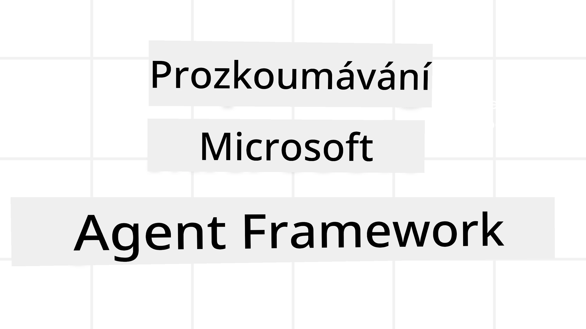
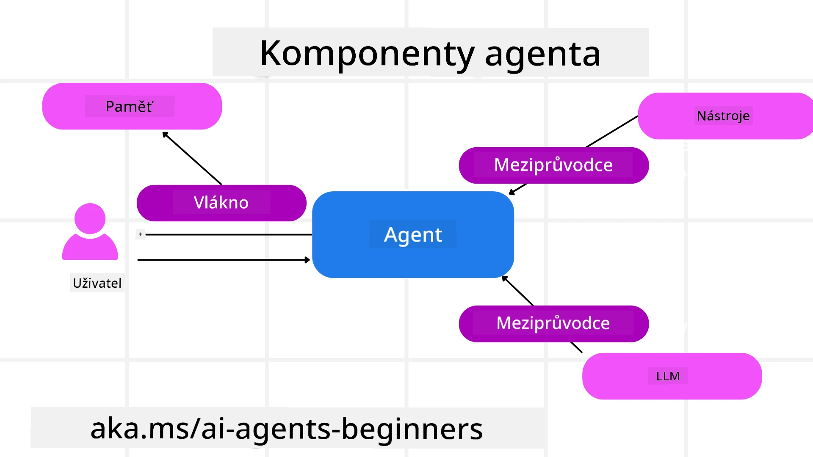

# Průzkum Microsoft Agent Framework



### Úvod

Tato lekce pokryje:

- Porozumění Microsoft Agent Framework: Klíčové vlastnosti a hodnota  
- Průzkum základních konceptů Microsoft Agent Framework
- Pokročilé MAF vzory: Pracovní postupy, middleware a paměť

## Cíle učení

Po dokončení této lekce budete vědět, jak:

- Vytvářet produkčně připravené AI agenty pomocí Microsoft Agent Framework
- Aplikovat základní vlastnosti Microsoft Agent Framework na vaše agentní případy použití
- Používat pokročilé vzory včetně pracovních postupů, middleware a pozorovatelnosti

## Ukázky kódu 

Ukázky kódu pro [Microsoft Agent Framework (MAF)](https://aka.ms/ai-agents-beginners/agent-framewrok) naleznete v tomto repozitáři pod soubory `xx-python-agent-framework` a `xx-dotnet-agent-framework`.

## Porozumění Microsoft Agent Framework


[Microsoft Agent Framework (MAF)](https://aka.ms/ai-agents-beginners/agent-framewrok) je jednotný rámec Microsoftu pro vytváření AI agentů. Nabízí flexibilitu řešit širokou škálu agentních případů použití jak v produkčním, tak výzkumném prostředí, včetně:

- **Sekvenční orchestrace agentů** v situacích, kde jsou potřeba pracovní postupy krok za krokem.
- **Současná orchestrace** v scénářích, kde agenti potřebují dokončit úkoly současně.
- **Orchestrace skupinové konverzace** v scénářích, kde agenti mohou spolupracovat na jednom úkolu.
- **Předání orchestrace** v situacích, kdy agenti předávají úkol jeden druhému, jak jsou podúkoly dokončovány.
- **Magnetická orchestrace** v případech, kdy manažerský agent vytváří a upravuje seznam úkolů a koordinuje podagenty k dokončení úkolu.

Pro dodání AI agentů do produkce má MAF také zahrnuté funkce pro:

- **Pozorovatelnost** prostřednictvím využití OpenTelemetry, kde každý krok AI agenta včetně volání nástrojů, orchestrací, toků uvažování a monitorování výkonu je zobrazen v dashboardech Microsoft Foundry.
- **Bezpečnost** tím, že agenti jsou nativně hostovaní na Microsoft Foundry, které zahrnuje bezpečnostní kontroly jako řízení přístupu podle rolí, zacházení s privátními daty a zabudovanou bezpečnost obsahu.
- **Trvanlivost** protože vlákna agentů a pracovní postupy mohou být pozastaveny, obnoveny a zotaveny z chyb, což umožňuje dlouhodobé procesy.
- **Kontrola** jelikož jsou podporovány pracovní postupy s lidskou autorizací, kde jsou úkoly označeny jako vyžadující schválení člověkem.

Microsoft Agent Framework se také zaměřuje na interoperabilitu tím, že je:

- **Nezávislý na cloudu** – agenti mohou běžet v kontejnerech, on-premises i na různých cloudech.
- **Nezávislý na poskytovateli** – agenti mohou být vytvořeni pomocí preferovaného SDK včetně Azure OpenAI a OpenAI.
- **Integrující otevřené standardy** – agenti mohou využívat protokoly jako Agent-to-Agent (A2A) a Model Context Protocol (MCP) k objevování a využívání jiných agentů a nástrojů.
- **Pluginy a konektory** – lze se připojit k datovým a paměťovým službám jako Microsoft Fabric, SharePoint, Pinecone a Qdrant.

Pojďme se podívat, jak jsou tyto funkce aplikovány na základní koncepty Microsoft Agent Framework.

## Klíčové koncepty Microsoft Agent Framework

### Agentové



**Vytváření agentů**

Vytvoření agenta se provádí definováním inference služby (LLM poskytovatel),  
sady instrukcí, které má AI agent následovat a přiřazeným `name`:

```python
agent = AzureOpenAIChatClient(credential=AzureCliCredential()).create_agent( instructions="You are good at recommending trips to customers based on their preferences.", name="TripRecommender" )
```

Výše je použit `Azure OpenAI`, ale agenti mohou být vytvořeni pomocí různých služeb včetně `Microsoft Foundry Agent Service`:

```python
AzureAIAgentClient(async_credential=credential).create_agent( name="HelperAgent", instructions="You are a helpful assistant." ) as agent
```

OpenAI `Responses`, `ChatCompletion` API

```python
agent = OpenAIResponsesClient().create_agent( name="WeatherBot", instructions="You are a helpful weather assistant.", )
```

```python
agent = OpenAIChatClient().create_agent( name="HelpfulAssistant", instructions="You are a helpful assistant.", )
```

nebo [MiniMax](https://platform.minimaxi.com/), který nabízí OpenAI-kompatibilní API s velkými kontextovými okny (až 204K tokenů):

```python
agent = OpenAIChatClient(base_url="https://api.minimax.io/v1", api_key=os.environ["MINIMAX_API_KEY"], model_id="MiniMax-M2.7").create_agent( name="HelpfulAssistant", instructions="You are a helpful assistant.", )
```

nebo vzdálených agentů pomocí protokolu A2A:

```python
agent = A2AAgent( name=agent_card.name, description=agent_card.description, agent_card=agent_card, url="https://your-a2a-agent-host" )
```

**Spouštění agentů**

Agenti se spouštějí pomocí metod `.run` nebo `.run_stream` pro ne-streamované nebo streamované odpovědi.

```python
result = await agent.run("What are good places to visit in Amsterdam?")
print(result.text)
```

```python
async for update in agent.run_stream("What are the good places to visit in Amsterdam?"):
    if update.text:
        print(update.text, end="", flush=True)

```

Každé spuštění agenta může mít také možnosti přizpůsobení parametrů jako `max_tokens` použité agentem, `tools`, které může agent volat, a dokonce i samotný `model`, který agent používá.

To je užitečné v případech, kdy jsou vyžadovány specifické modely nebo nástroje k dokončení uživatelského úkolu.

**Nástroje**

Nástroje mohou být definovány jak při definování agenta:

```python
def get_attractions( location: Annotated[str, Field(description="The location to get the top tourist attractions for")], ) -> str: """Get the top tourist attractions for a given location.""" return f"The top attractions for {location} are." 


# Při přímém vytváření ChatAgenta

agent = ChatAgent( chat_client=OpenAIChatClient(), instructions="You are a helpful assistant", tools=[get_attractions]

```

tak i při spouštění agenta:

```python

result1 = await agent.run( "What's the best place to visit in Seattle?", tools=[get_attractions] # Nástroj poskytnutý pouze pro tento běh )
```

**Vlákna agenta**

Vlákna agentů se používají pro zpracování rozhovorů s více kroky. Vlákna lze vytvořit buď:

- Použitím `get_new_thread()`, které umožňuje vlákno ukládat v čase
- Automatickým vytvořením vlákna při spuštění agenta, kde vlákno vydrží pouze během aktuálního běhu.

Pro vytvoření vlákna vypadá kód takto:

```python
# Vytvořit nový vlákno.
thread = agent.get_new_thread() # Spusťte agenta pomocí vlákna.
response = await agent.run("Hello, I am here to help you book travel. Where would you like to go?", thread=thread)

```

Vlákno pak můžete serializovat a uložit pro pozdější použití:

```python
# Vytvořit nový vláknový proces.
thread = agent.get_new_thread() 

# Spusťte agenta s vláknem.

response = await agent.run("Hello, how are you?", thread=thread) 

# Serializujte vlákno pro uložení.

serialized_thread = await thread.serialize() 

# Deserializujte stav vlákna po načtení z úložiště.

resumed_thread = await agent.deserialize_thread(serialized_thread)
```

**Middleware agenta**

Agent interaguje s nástroji a LLM k dokončení uživatelských úkolů. V určitých scénářích chceme spouštět nebo sledovat tyto interakce. Middleware agenta nám to umožňuje díky:

*Funkčnímu middleware*

Tento middleware dovoluje provést akci mezi agentem a funkcí/nástrojem, který volá. Příklad použití je, když chcete logovat volání funkce.

V kódu níže `next` určuje, zda má být zavolán další middleware nebo samotná funkce.

```python
async def logging_function_middleware(
    context: FunctionInvocationContext,
    next: Callable[[FunctionInvocationContext], Awaitable[None]],
) -> None:
    """Function middleware that logs function execution."""
    # Předzpracování: Záznam před vykonáním funkce
    print(f"[Function] Calling {context.function.name}")

    # Pokračovat na další middleware nebo vykonání funkce
    await next(context)

    # Pozpracování: Záznam po vykonání funkce
    print(f"[Function] {context.function.name} completed")
```

*Chat middleware*

Tento middleware dovoluje vykonávat nebo logovat akci mezi agentem a požadavky mezi LLM.

Obsahuje důležité informace jako `messages`, které jsou posílány AI službě.

```python
async def logging_chat_middleware(
    context: ChatContext,
    next: Callable[[ChatContext], Awaitable[None]],
) -> None:
    """Chat middleware that logs AI interactions."""
    # Předzpracování: Protokolování před voláním AI
    print(f"[Chat] Sending {len(context.messages)} messages to AI")

    # Pokračovat na další middleware nebo AI službu
    await next(context)

    # Pozpracování: Protokolování po odpovědi AI
    print("[Chat] AI response received")

```

**Paměť agenta**

Jak bylo pokryto v lekci `Agentic Memory`, paměť je důležitým prvkem k umožnění agenta operovat v různých kontextech. MAF nabízí několik druhů pamětí:

*Paměť v paměti (In-Memory Storage)*

Paměť je uchovávána ve vláknech během běhu aplikace.

```python
# Vytvořit nový vlákno.
thread = agent.get_new_thread() # Spustit agenta s vláknem.
response = await agent.run("Hello, I am here to help you book travel. Where would you like to go?", thread=thread)
```

*Trvalé zprávy (Persistent Messages)*

Tato paměť se používá pro ukládání historie konverzací napříč různými relacemi. Definuje se pomocí `chat_message_store_factory`:

```python
from agent_framework import ChatMessageStore

# Vytvořte vlastní úložiště zpráv
def create_message_store():
    return ChatMessageStore()

agent = ChatAgent(
    chat_client=OpenAIChatClient(),
    instructions="You are a Travel assistant.",
    chat_message_store_factory=create_message_store
)

```

*Dynamická paměť*

Tato paměť je přidána do kontextu před spuštěním agentů. Tyto paměti mohou být uloženy v externích službách jako mem0:

```python
from agent_framework.mem0 import Mem0Provider

# Používání Mem0 pro pokročilé paměťové schopnosti
memory_provider = Mem0Provider(
    api_key="your-mem0-api-key",
    user_id="user_123",
    application_id="my_app"
)

agent = ChatAgent(
    chat_client=OpenAIChatClient(),
    instructions="You are a helpful assistant with memory.",
    context_providers=memory_provider
)

```

**Pozorovatelnost agenta**

Pozorovatelnost je důležitá pro vytváření spolehlivých a udržitelných agentních systémů. MAF integruje OpenTelemetry, aby poskytoval trasování a metry pro lepší pozorovatelnost.

```python
from agent_framework.observability import get_tracer, get_meter

tracer = get_tracer()
meter = get_meter()
with tracer.start_as_current_span("my_custom_span"):
    # udělej něco
    pass
counter = meter.create_counter("my_custom_counter")
counter.add(1, {"key": "value"})
```

### Pracovní postupy

MAF nabízí pracovní postupy, které jsou předdefinované kroky k dokončení úkolu a zahrnují AI agenty jako komponenty těchto kroků.

Pracovní postupy jsou složeny z různých komponent, které umožňují lepší kontrolu toku. Pracovní postupy také umožňují **multi-agentní orchestraci** a **kontrolní body** pro ukládání stavů workflow.

Základní komponenty workflow jsou:

**Prováděči (Executors)**

Prováděči přijímají vstupní zprávy, provádí přiřazené úkoly a poté generují výstupní zprávu. Posouvají workflow směrem k dokončení většího úkolu. Prováděči mohou být AI agent nebo vlastní logika.

**Hrany (Edges)**

Hrany slouží k definici toku zpráv v workflow. Mohou být:

*Přímé hrany* - jednoduchá spojení jeden na jednoho mezi prováděči:

```python
from agent_framework import WorkflowBuilder

builder = WorkflowBuilder()
builder.add_edge(source_executor, target_executor)
builder.set_start_executor(source_executor)
workflow = builder.build()
```

*Podmíněné hrany* - aktivují se, když je splněna určitá podmínka. Například pokud nejsou dostupné pokoj v hotelu, může prováděč navrhnout jiné možnosti.

*Přepínačové hrany (Switch-case)* - směrují zprávy k různým prováděčům na základě definovaných podmínek. Například pokud má zákazník s prioritou přístup a jeho úkoly budou řešeny jiným workflow.

*Vyzařovací hrany (Fan-out)* - posílají jednu zprávu na více cílů.

*Sběrné hrany (Fan-in)* - sbírají vícero zpráv od různých prováděčů a posílají je jednomu cíli.

**Události**

Pro lepší pozorovatelnost workflow nabízí MAF vestavěné události pro exekuci včetně:

- `WorkflowStartedEvent`  - Spuštění vykonávání workflow
- `WorkflowOutputEvent` - Workflow produkuje výstup
- `WorkflowErrorEvent` - Workflow narazí na chybu
- `ExecutorInvokeEvent`  - Prováděč začíná zpracování
- `ExecutorCompleteEvent`  -  Prováděč dokončil zpracování
- `RequestInfoEvent` - Vykonán požadavek

## Pokročilé MAF vzory

Výše uvedené sekce pokrývají základní koncepty Microsoft Agent Framework. Jak vytváříte složitější agenty, zde je několik pokročilých vzorů k zamyšlení:

- **Složení middleware**: Řetězení více middleware handlerů (logování, autentizace, omezení rychlosti) pomocí funkčního a chat middleware pro detailní kontrolu chování agenta.
- **Kontrolní body workflow**: Použití událostí workflow a serializace k ukládání a obnovení dlouhotrvajících procesů agentů.
- **Dynamický výběr nástrojů**: Kombinace RAG nad popisy nástrojů s registrací nástrojů MAF k prezentaci pouze relevantních nástrojů pro dotaz.
- **Předávání mezi více agenty**: Použití hran workflow a podmíněného směrování k orchestraci předávání mezi specializovanými agenty.

## Ukázky kódu 

Ukázky kódu pro Microsoft Agent Framework naleznete v tomto repozitáři pod soubory `xx-python-agent-framework` a `xx-dotnet-agent-framework`.

## Máte více otázek ohledně Microsoft Agent Framework?

Připojte se k [Microsoft Foundry Discord](https://aka.ms/ai-agents/discord), kde se můžete setkat s dalšími studenty, účastnit se konzultací a získat odpovědi na své otázky ohledně AI agentů.

---

<!-- CO-OP TRANSLATOR DISCLAIMER START -->
**Upozornění**:  
Tento dokument byl přeložen pomocí AI překladatelské služby [Co-op Translator](https://github.com/Azure/co-op-translator). I když usilujeme o přesnost, mějte prosím na paměti, že automatické překlady mohou obsahovat chyby nebo nepřesnosti. Originální dokument v jeho rodném jazyce by měl být považován za autoritativní zdroj. Pro kritické informace se doporučuje profesionální lidský překlad. Nejsme odpovědni za jakékoli nedorozumění nebo chybné výklady vzniklé používáním tohoto překladu.
<!-- CO-OP TRANSLATOR DISCLAIMER END -->