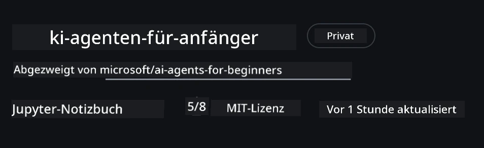
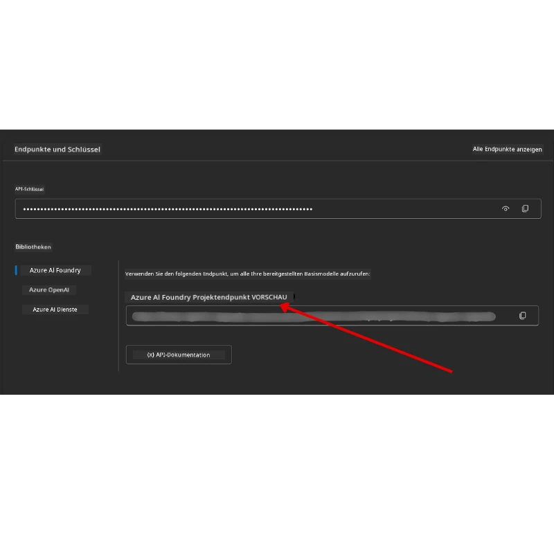

# Kurseinrichtung

## Einführung

Diese Lektion behandelt, wie Sie die Codebeispiele dieses Kurses ausführen.

## Treten Sie anderen Lernenden bei und holen Sie sich Hilfe

Bevor Sie mit dem Klonen Ihres Repos beginnen, treten Sie dem [AI Agents For Beginners Discord-Kanal](https://aka.ms/ai-agents/discord) bei, um Hilfe bei der Einrichtung zu erhalten, Fragen zum Kurs zu stellen oder sich mit anderen Lernenden zu vernetzen.

## Dieses Repo klonen oder forken

Um zu beginnen, klonen oder forken Sie bitte das GitHub-Repository. Dadurch erhalten Sie Ihre eigene Version des Kursmaterials, mit der Sie den Code ausführen, testen und anpassen können!

Dies kann durch Klicken auf den Link zum <a href="https://github.com/microsoft/ai-agents-for-beginners/fork" target="_blank">Repo-Fork</a> erfolgen.

Sie sollten nun Ihre eigene geforkte Version dieses Kurses unter folgendem Link haben:



### Flache Klonung (empfohlen für Workshop / Codespaces)

  >Das vollständige Repository kann groß sein (~3 GB), wenn Sie die gesamte Historie und alle Dateien herunterladen. Wenn Sie nur am Workshop teilnehmen oder nur wenige Lektion-Ordner benötigen, vermeidet eine flache Klonung (oder eine spärliche Klonung) den Großteil des Downloads, indem sie die Historie kürzt und/oder Blobs überspringt.

#### Schnelle flache Klonung — minimale Historie, alle Dateien

Ersetzen Sie `<your-username>` in den folgenden Befehlen durch Ihre Fork-URL (oder die Upstream-URL, wenn Sie das bevorzugen).

Um nur die neueste Commit-Historie zu klonen (kleiner Download):

```bash|powershell
git clone --depth 1 https://github.com/<your-username>/ai-agents-for-beginners.git
```

Um einen bestimmten Branch zu klonen:

```bash|powershell
git clone --depth 1 --branch <branch-name> https://github.com/<your-username>/ai-agents-for-beginners.git
```

#### Teilweise (spärliche) Klonung — minimale Blobs + nur ausgewählte Ordner

Dies verwendet Teilklon und Sparse-Checkout (erfordert Git 2.25+ und empfohlen moderne Git-Version mit Teilklon-Unterstützung):

```bash|powershell
git clone --depth 1 --filter=blob:none --sparse https://github.com/<your-username>/ai-agents-for-beginners.git
```

Wechseln Sie in den Repo-Ordner:

```bash|powershell
cd ai-agents-for-beginners
```

Dann geben Sie an, welche Ordner Sie möchten (Beispiel unten zeigt zwei Ordner):

```bash|powershell
git sparse-checkout set 00-course-setup 01-intro-to-ai-agents
```

Nach dem Klonen und Überprüfen der Dateien, wenn Sie nur die Dateien benötigen und Speicherplatz freigeben wollen (keine Git-Historie), löschen Sie bitte die Repository-Metadaten (💀irreversibel — Sie verlieren alle Git-Funktionalitäten: keine Commits, Pulls, Pushes oder Zugriff auf die Historie).

```bash
# zsh/bash
rm -rf .git
```

```powershell
# PowerShell
Remove-Item -Recurse -Force .git
```

#### Verwendung von GitHub Codespaces (empfohlen um große lokale Downloads zu vermeiden)

- Erstellen Sie einen neuen Codespace für dieses Repo über die [GitHub-Oberfläche](https://github.com/codespaces).  

- Führen Sie im Terminal des neu erstellten Codespaces einen der oben genannten Befehle für flache/spärliche Klonung aus, um nur die benötigten Lektion-Ordner in den Codespace-Arbeitsbereich zu holen.
- Optional: Nach dem Klonen in Codespaces entfernen Sie .git, um zusätzlichen Speicherplatz freizugeben (siehe oben genannte Entfernen-Befehle).
- Hinweis: Wenn Sie das Repo direkt in Codespaces öffnen möchten (ohne zusätzliches Klonen), beachten Sie, dass Codespaces die Devcontainer-Umgebung aufbauen und möglicherweise mehr bereitstellen, als Sie benötigen. Das Klonen einer flachen Kopie innerhalb eines frischen Codespaces gibt Ihnen mehr Kontrolle über die Speichernutzung.

#### Tipps

- Ersetzen Sie immer die Klon-URL durch Ihren Fork, wenn Sie bearbeiten/committen möchten.
- Wenn Sie später mehr Historie oder Dateien benötigen, können Sie diese abrufen oder den sparse-checkout anpassen, um zusätzliche Ordner einzuschließen.

## Ausführung des Codes

Dieser Kurs bietet eine Reihe von Jupyter Notebooks, die Sie ausführen können, um praktische Erfahrungen beim Erstellen von AI Agents zu sammeln.

Die Codebeispiele verwenden **Microsoft Agent Framework (MAF)** mit dem `AzureAIProjectAgentProvider`, das sich mit dem **Azure AI Agent Service V2** (der Responses API) über **Microsoft Foundry** verbindet.

Alle Python-Notebooks sind mit `*-python-agent-framework.ipynb` gekennzeichnet.

## Voraussetzungen

- Python 3.12+
  - **HINWEIS**: Wenn Sie Python3.12 nicht installiert haben, stellen Sie sicher, dass Sie es installieren. Erstellen Sie dann Ihr venv mit python3.12, um sicherzustellen, dass die richtigen Versionen aus der requirements.txt-Datei installiert werden.
  
    >Beispiel

    Erstellen des Python venv-Verzeichnisses:

    ```bash|powershell
    python -m venv venv
    ```

    Aktivieren Sie dann die venv-Umgebung für:

    ```bash
    # zsh/bash
    source venv/bin/activate
    ```
  
    ```dos
    # Command Prompt for Windows
    venv\Scripts\activate
    ```

- .NET 10+: Für die Beispielcodes mit .NET stellen Sie sicher, dass Sie das [.NET 10 SDK](https://dotnet.microsoft.com/download/dotnet/10.0) oder neuer installiert haben. Prüfen Sie dann Ihre installierte .NET SDK Version:

    ```bash|powershell
    dotnet --list-sdks
    ```

- **Azure CLI** — Erforderlich für die Authentifizierung. Installieren Sie es unter [aka.ms/installazurecli](https://aka.ms/installazurecli).
- **Azure-Abonnement** — Für den Zugriff auf Microsoft Foundry und Azure AI Agent Service.
- **Microsoft Foundry Projekt** — Ein Projekt mit einem bereitgestellten Modell (z. B. `gpt-4o`). Siehe [Schritt 1](#schritt-1-erstellen-sie-ein-microsoft-foundry-projekt) unten.

Wir haben eine `requirements.txt`-Datei im Stammverzeichnis dieses Repositories beigefügt, die alle erforderlichen Python-Pakete enthält, um die Codebeispiele auszuführen.

Sie können diese installieren, indem Sie den folgenden Befehl im Terminal im Stammverzeichnis des Repositories ausführen:

```bash|powershell
pip install -r requirements.txt
```

Wir empfehlen, eine Python-virtuelle Umgebung zu erstellen, um Konflikte und Probleme zu vermeiden.

## VSCode einrichten

Stellen Sie sicher, dass Sie in VSCode die richtige Python-Version verwenden.


## Microsoft Foundry und Azure AI Agent Service einrichten

### Schritt 1: Erstellen Sie ein Microsoft Foundry Projekt

Sie benötigen ein Azure AI Foundry **Hub** und **Projekt** mit einem bereitgestellten Modell, um die Notebooks auszuführen.

1. Gehen Sie zu [ai.azure.com](https://ai.azure.com) und melden Sie sich mit Ihrem Azure-Konto an.
2. Erstellen Sie einen **Hub** (oder verwenden Sie einen vorhandenen). Siehe: [Hub-Ressourcenübersicht](https://learn.microsoft.com/azure/ai-foundry/concepts/ai-resources).
3. Erstellen Sie im Hub ein **Projekt**.
4. Stellen Sie ein Modell bereit (z. B. `gpt-4o`) unter **Models + Endpoints** → **Model bereitstellen**.

### Schritt 2: Abrufen Ihres Projekt-Endpunkts und Model Deployment Namens

Im Microsoft Foundry Portal Ihres Projekts:

- **Projekt-Endpunkt** — Gehen Sie zur **Übersichtsseite** und kopieren Sie die Endpunkt-URL.



- **Name der Modellbereitstellung** — Gehen Sie zu **Models + Endpoints**, wählen Sie Ihr bereitgestelltes Modell aus, und notieren Sie den **Bereitstellungsnamen** (z. B. `gpt-4o`).

### Schritt 3: Melden Sie sich mit `az login` bei Azure an

Alle Notebooks verwenden **`AzureCliCredential`** zur Authentifizierung — es müssen keine API-Schlüssel verwaltet werden. Dies erfordert, dass Sie über die Azure CLI angemeldet sind.

1. **Installieren Sie die Azure CLI**, falls noch nicht geschehen: [aka.ms/installazurecli](https://aka.ms/installazurecli)

2. **Melden Sie sich an** durch Ausführen:

    ```bash|powershell
    az login
    ```

    Oder wenn Sie sich in einer Remote-/Codespace-Umgebung ohne Browser befinden:

    ```bash|powershell
    az login --use-device-code
    ```

3. **Wählen Sie Ihr Abonnement aus**, falls Sie dazu aufgefordert werden — wählen Sie das, welches Ihr Foundry-Projekt enthält.

4. **Überprüfen Sie**, dass Sie angemeldet sind:

    ```bash|powershell
    az account show
    ```

> **Warum `az login`?** Die Notebooks authentifizieren sich mittels `AzureCliCredential` aus dem `azure-identity`-Paket. Das bedeutet, dass Ihre Azure CLI-Sitzung die Anmeldeinformationen bereitstellt — keine API-Schlüssel oder Secrets müssen in Ihrer `.env`-Datei liegen. Dies ist eine [Sicherheitsempfehlung](https://learn.microsoft.com/azure/developer/ai/keyless-connections).

### Schritt 4: Erstellen Sie Ihre `.env`-Datei

Kopieren Sie die Beispieldatei:

```bash
# zsh/bash
cp .env.example .env
```

```powershell
# PowerShell
Copy-Item .env.example .env
```

Öffnen Sie `.env` und füllen Sie diese beiden Werte aus:

```env
AZURE_AI_PROJECT_ENDPOINT=https://<your-project>.services.ai.azure.com/api/projects/<your-project-id>
AZURE_AI_MODEL_DEPLOYMENT_NAME=gpt-4o
```

| Variable | Wo zu finden |
|----------|--------------|
| `AZURE_AI_PROJECT_ENDPOINT` | Foundry-Portal → Ihr Projekt → **Übersicht** Seite |
| `AZURE_AI_MODEL_DEPLOYMENT_NAME` | Foundry-Portal → **Models + Endpoints** → Name Ihres bereitgestellten Modells |

Das ist es für die meisten Lektionen! Die Notebooks authentifizieren automatisch über Ihre `az login`-Sitzung.

### Schritt 5: Installieren Sie die Python-Abhängigkeiten

```bash|powershell
pip install -r requirements.txt
```

Wir empfehlen, dies innerhalb der zuvor erstellten virtuellen Umgebung auszuführen.

## Zusätzliche Einrichtung für Lektion 5 (Agentic RAG)

Lektion 5 verwendet **Azure AI Search** für retrieval-augmented generation. Wenn Sie diese Lektion ausführen möchten, fügen Sie diese Variablen zu Ihrer `.env`-Datei hinzu:

| Variable | Wo zu finden |
|----------|--------------|
| `AZURE_SEARCH_SERVICE_ENDPOINT` | Azure-Portal → Ihre **Azure AI Search**-Ressource → **Übersicht** → URL |
| `AZURE_SEARCH_API_KEY` | Azure-Portal → Ihre **Azure AI Search**-Ressource → **Einstellungen** → **Schlüssel** → primärer Administratorschlüssel |

## Zusätzliche Einrichtung für Lektion 6 und Lektion 8 (GitHub-Modelle)

Einige Notebooks in Lektion 6 und 8 verwenden **GitHub-Modelle** anstelle von Azure AI Foundry. Wenn Sie diese Beispiele ausführen möchten, fügen Sie diese Variablen zu Ihrer `.env`-Datei hinzu:

| Variable | Wo zu finden |
|----------|--------------|
| `GITHUB_TOKEN` | GitHub → **Einstellungen** → **Entwicklereinstellungen** → **Persönliche Zugriffstoken** |
| `GITHUB_ENDPOINT` | Verwenden Sie `https://models.inference.ai.azure.com` (Standardwert) |
| `GITHUB_MODEL_ID` | Modellname zur Verwendung (z. B. `gpt-4o-mini`) |

## Alternativer Anbieter: MiniMax (OpenAI-kompatibel)

[MiniMax](https://platform.minimaxi.com/) stellt groß kontextbezogene Modelle (bis zu 204K Tokens) über eine OpenAI-kompatible API bereit. Da der Microsoft Agent Framework `OpenAIChatClient` mit jeder OpenAI-kompatiblen Endpunkt arbeitet, können Sie MiniMax als Drop-in-Alternative zu GitHub-Modellen oder OpenAI verwenden.

Fügen Sie diese Variablen zu Ihrer `.env`-Datei hinzu:

| Variable | Wo zu finden |
|----------|--------------|
| `MINIMAX_API_KEY` | [MiniMax Plattform](https://platform.minimaxi.com/) → API-Schlüssel |
| `MINIMAX_BASE_URL` | Verwenden Sie `https://api.minimax.io/v1` (Standardwert) |
| `MINIMAX_MODEL_ID` | Modellname zur Verwendung (z. B. `MiniMax-M2.7`) |

**Verfügbare Modelle**: `MiniMax-M2.7` (empfohlen), `MiniMax-M2.7-highspeed` (schnellere Antworten)

Die Codebeispiele, die `OpenAIChatClient` verwenden (z. B. Lektion 14 zum Hotelbuchungs-Workflow), erkennen Ihre MiniMax-Konfiguration automatisch, wenn `MINIMAX_API_KEY` gesetzt ist.

## Zusätzliche Einrichtung für Lektion 8 (Bing Grounding Workflow)

Das bedingte Workflow-Notebook in Lektion 8 verwendet **Bing Grounding** über Azure AI Foundry. Wenn Sie dieses Beispiel ausführen möchten, fügen Sie diese Variable zu Ihrer `.env`-Datei hinzu:

| Variable | Wo zu finden |
|----------|--------------|
| `BING_CONNECTION_ID` | Azure AI Foundry-Portal → Ihr Projekt → **Management** → **Verbundene Ressourcen** → Ihre Bing-Verbindung → kopieren Sie die Verbindungs-ID |

## Fehlerbehebung

### SSL-Zertifikatsüberprüfungsfehler unter macOS

Wenn Sie macOS verwenden und einen Fehler wie folgt erhalten:

```plaintext
ssl.SSLCertVerificationError: [SSL: CERTIFICATE_VERIFY_FAILED] certificate verify failed: self-signed certificate in certificate chain
```

Dies ist ein bekanntes Problem bei Python auf macOS, bei dem die System-SSL-Zertifikate nicht automatisch vertraut werden. Versuchen Sie folgende Lösungen in der angegebenen Reihenfolge:

**Option 1: Ausführen des Install Certificates-Skripts von Python (empfohlen)**

```bash
# Ersetzen Sie 3.XX durch Ihre installierte Python-Version (z. B. 3.12 oder 3.13):
/Applications/Python\ 3.XX/Install\ Certificates.command
```

**Option 2: Nutzung von `connection_verify=False` in Ihrem Notebook (nur für GitHub Models Notebooks)**

Im Notebook von Lektion 6 (`06-building-trustworthy-agents/code_samples/06-system-message-framework.ipynb`) ist bereits eine auskommentierte Umgehungslösung enthalten. Kommentieren Sie `connection_verify=False` beim Erstellen des Clients ein:

```python
client = ChatCompletionsClient(
    endpoint=endpoint,
    credential=AzureKeyCredential(token),
    connection_verify=False,  # Deaktivieren Sie die SSL-Überprüfung, wenn Sie Zertifikatsfehler feststellen
)
```

> **⚠️ Warnung:** Das Deaktivieren der SSL-Verifizierung (`connection_verify=False`) reduziert die Sicherheit, da die Zertifikatvalidierung übersprungen wird. Verwenden Sie dies nur als temporäre Umgehung in Entwicklungsumgebungen, niemals in der Produktion.

**Option 3: Installieren und nutzen Sie `truststore`**

```bash
pip install truststore
```

Fügen Sie dann folgendes am Anfang Ihres Notebooks oder Skripts hinzu, bevor Sie Netzwerkanfragen machen:

```python
import truststore
truststore.inject_into_ssl()
```

## Haben Sie irgendwo Probleme?

Wenn Sie Probleme bei der Ausführung dieser Einrichtung haben, treten Sie unserem <a href="https://discord.gg/kzRShWzttr" target="_blank">Azure AI Community Discord</a> bei oder <a href="https://github.com/microsoft/ai-agents-for-beginners/issues?WT.mc_id=academic-105485-koreyst" target="_blank">erstellen Sie ein Issue</a>.

## Nächste Lektion

Sie sind jetzt bereit, den Code für diesen Kurs auszuführen. Viel Spaß beim weiteren Lernen über die Welt der AI Agents!

[Einführung in AI Agents und Anwendungsfälle](../01-intro-to-ai-agents/README.md)

---

<!-- CO-OP TRANSLATOR DISCLAIMER START -->
**Haftungsausschluss**:  
Dieses Dokument wurde mit dem KI-Übersetzungsdienst [Co-op Translator](https://github.com/Azure/co-op-translator) übersetzt. Obwohl wir uns um Genauigkeit bemühen, beachten Sie bitte, dass automatisierte Übersetzungen Fehler oder Ungenauigkeiten enthalten können. Das Originaldokument in seiner Ursprungssprache gilt als maßgebliche Quelle. Für wichtige Informationen wird eine professionelle menschliche Übersetzung empfohlen. Wir übernehmen keine Haftung für Missverständnisse oder Fehlinterpretationen, die aus der Nutzung dieser Übersetzung entstehen.
<!-- CO-OP TRANSLATOR DISCLAIMER END -->