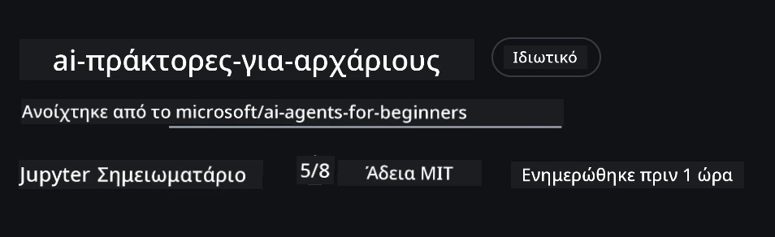

# Ρύθμιση Μαθήματος

## Εισαγωγή

Αυτό το μάθημα θα καλύψει πώς να εκτελείτε τα δείγματα κώδικα αυτού του μαθήματος.

## Συμμετοχή με Άλλους Μαθητές και Λήψη Βοήθειας

Πριν ξεκινήσετε το κλώνο του αποθετηρίου σας, συμμετέχετε στο [κανάλι Discord για AI Agents Για Αρχάριους](https://aka.ms/ai-agents/discord) για να λάβετε βοήθεια με τη ρύθμιση, οποιεσδήποτε ερωτήσεις σχετικά με το μάθημα ή για να συνδεθείτε με άλλους μαθητές.

## Κλωνοποίηση ή Fork αυτού του Αποθετηρίου

Για να ξεκινήσετε, παρακαλώ κλωνοποιήστε ή κάντε fork το αποθετήριο GitHub. Αυτό θα δημιουργήσει τη δική σας έκδοση του υλικού του μαθήματος ώστε να μπορείτε να εκτελείτε, να δοκιμάζετε και να τροποποιείτε τον κώδικα!

Αυτό μπορεί να γίνει κάνοντας κλικ στον σύνδεσμο για <a href="https://github.com/microsoft/ai-agents-for-beginners/fork" target="_blank">να κάνετε fork το αποθετήριο</a>

Τώρα θα πρέπει να έχετε τη δική σας έκδοση fork αυτού του μαθήματος στον ακόλουθο σύνδεσμο:



### Ρηχή Κλωνοποίηση (συνιστάται για εργαστήριο / Codespaces)

  >Το πλήρες αποθετήριο μπορεί να είναι μεγάλο (~3 GB) όταν κατεβάζετε ολόκληρο το ιστορικό και όλα τα αρχεία. Αν παρακολουθείτε μόνο το εργαστήριο ή χρειάζεστε μόνο μερικούς φακέλους του μαθήματος, μια ρηχή κλωνοποίηση (ή μια αραίωση κλωνοποίησης) αποφεύγει το μεγαλύτερο μέρος αυτού του κατεβάσματος περικόπτοντας το ιστορικό και/ή παραλείποντας blobs.

#### Γρήγορη ρηχή κλωνοποίηση — ελάχιστο ιστορικό, όλα τα αρχεία

Αντικαταστήστε το `<your-username>` στις παρακάτω εντολές με το URL του fork σας (ή το upstream URL αν προτιμάτε).

Για κλωνοποίηση μόνο του πιο πρόσφατου ιστορικού commit (μικρό κατέβασμα):

```bash|powershell
git clone --depth 1 https://github.com/<your-username>/ai-agents-for-beginners.git
```

Για κλωνοποίηση συγκεκριμένου branch:

```bash|powershell
git clone --depth 1 --branch <branch-name> https://github.com/<your-username>/ai-agents-for-beginners.git
```

#### Μερική (αραιωμένη) κλωνοποίηση — ελάχιστα blobs + μόνο επιλεγμένοι φάκελοι

Αυτό χρησιμοποιεί μερική κλωνοποίηση και sparse-checkout (απαιτεί Git 2.25+ και συνιστάται μοντέρνο Git με υποστήριξη μερικής κλωνοποίησης):

```bash|powershell
git clone --depth 1 --filter=blob:none --sparse https://github.com/<your-username>/ai-agents-for-beginners.git
```

Πλοηγηθείτε στον φάκελο του αποθετηρίου:

```bash|powershell
cd ai-agents-for-beginners
```

Έπειτα ορίστε τους φακέλους που θέλετε (το παράδειγμα παρακάτω δείχνει δύο φακέλους):

```bash|powershell
git sparse-checkout set 00-course-setup 01-intro-to-ai-agents
```

Μετά την κλωνοποίηση και επαλήθευση των αρχείων, αν χρειάζεστε μόνο αρχεία και θέλετε να ελευθερώσετε χώρο (χωρίς ιστορικό git), παρακαλώ διαγράψτε τα μεταδεδομένα του αποθετηρίου (💀μη αναστρέψιμο — θα χάσετε όλη τη λειτουργικότητα του Git: κανένα commit, pull, push ή πρόσβαση στο ιστορικό).

```bash
# zsh/bash
rm -rf .git
```

```powershell
# PowerShell
Remove-Item -Recurse -Force .git
```

#### Χρήση GitHub Codespaces (συνιστάται για αποφυγή μεγάλων τοπικών λήψεων)

- Δημιουργήστε ένα νέο Codespace για αυτό το αποθετήριο μέσω του [GitHub UI](https://github.com/codespaces).  

- Στο τερματικό του νεοδημιουργημένου codespace, εκτελέστε μία από τις εντολές ρηχής/αραιωμένης κλωνοποίησης παραπάνω για να φέρετε μόνο τους φακέλους μαθημάτων που χρειάζεστε στο χώρο εργασίας Codespace.
- Προαιρετικά: μετά την κλωνοποίηση μέσα στα Codespaces, αφαιρέστε το .git για να ανακτήσετε επιπλέον χώρο (δείτε τις εντολές αφαίρεσης παραπάνω).
- Σημείωση: Αν προτιμάτε να ανοίξετε το αποθετήριο απευθείας στα Codespaces (χωρίς επιπλέον κλωνοποίηση), να γνωρίζετε ότι τα Codespaces θα κατασκευάσουν το περιβάλλον devcontainer και μπορεί να προβούν σε παροχή περισσότερου από ό,τι χρειάζεστε. Η κλωνοποίηση μιας ρηχής αντιγράφου μέσα σε φρέσκο Codespace σας δίνει περισσότερο έλεγχο στη χρήση δίσκου.

#### Συμβουλές

- Πάντα αντικαθιστάτε το URL κλωνοποίησης με το δικό σας fork αν θέλετε να επεξεργαστείτε/κάνετε commit.
- Αν αργότερα χρειαστείτε περισσότερο ιστορικό ή αρχεία, μπορείτε να τα φέρετε ή να ρυθμίσετε το sparse-checkout για να συμπεριλάβετε επιπλέον φακέλους.

## Εκτέλεση Κώδικα

Αυτό το μάθημα προσφέρει μια σειρά από Jupyter Notebooks που μπορείτε να εκτελέσετε για να αποκτήσετε πρακτική εμπειρία στην κατασκευή AI Agents.

Τα δείγματα κώδικα χρησιμοποιούν το **Microsoft Agent Framework (MAF)** με τον `AzureAIProjectAgentProvider`, που συνδέεται με την **Azure AI Agent Service V2** (το Responses API) μέσω του **Microsoft Foundry**.

Όλα τα Python notebooks φέρουν την ονομασία `*-python-agent-framework.ipynb`.

## Απαιτήσεις

- Python 3.12+
  - **ΣΗΜΕΙΩΣΗ**: Αν δεν έχετε εγκαταστήσει Python3.12, βεβαιωθείτε ότι το εγκαθιστάτε. Έπειτα δημιουργήστε το venv χρησιμοποιώντας python3.12 για να βεβαιωθείτε ότι οι σωστές εκδόσεις εγκαθίστανται από το αρχείο requirements.txt.
  
    >Παράδειγμα

    Δημιουργία φακέλου Python venv:

    ```bash|powershell
    python -m venv venv
    ```

    Έπειτα ενεργοποιήστε το περιβάλλον venv για:

    ```bash
    # zsh/bash
    source venv/bin/activate
    ```
  
    ```dos
    # Command Prompt for Windows
    venv\Scripts\activate
    ```

- .NET 10+: Για τους δείκτες κώδικα που χρησιμοποιούν .NET, βεβαιωθείτε ότι έχετε εγκαταστήσει το [.NET 10 SDK](https://dotnet.microsoft.com/download/dotnet/10.0) ή μεταγενέστερο. Έπειτα, ελέγξτε την εγκατεστημένη έκδοση .NET SDK:

    ```bash|powershell
    dotnet --list-sdks
    ```

- **Azure CLI** — Απαραίτητο για αυθεντικοποίηση. Εγκαταστήστε το από [aka.ms/installazurecli](https://aka.ms/installazurecli).
- **Azure Subscription** — Για πρόσβαση στο Microsoft Foundry και Azure AI Agent Service.
- **Microsoft Foundry Project** — Ένα έργο με αναπτυγμένο μοντέλο (π.χ., `gpt-4o`). Δείτε [Βήμα 1](#βήμα-1-δημιουργία-microsoft-foundry-project) παρακάτω.

Έχουμε συμπεριλάβει ένα αρχείο `requirements.txt` στη ρίζα αυτού του αποθετηρίου που περιέχει όλα τα απαραίτητα πακέτα Python για την εκτέλεση των δειγμάτων κώδικα.

Μπορείτε να τα εγκαταστήσετε εκτελώντας την ακόλουθη εντολή στο τερματικό σας στη ρίζα του αποθετηρίου:

```bash|powershell
pip install -r requirements.txt
```

Συνιστούμε να δημιουργήσετε ένα Python virtual περιβάλλον για να αποφύγετε συγκρούσεις και προβλήματα.

## Ρύθμιση VSCode

Βεβαιωθείτε ότι χρησιμοποιείτε τη σωστή έκδοση Python στο VSCode.


## Ρύθμιση Microsoft Foundry και Azure AI Agent Service

### Βήμα 1: Δημιουργία Microsoft Foundry Project

Χρειάζεστε ένα Azure AI Foundry **hub** και **project** με αναπτυγμένο μοντέλο για να εκτελέσετε τα notebooks.

1. Μεταβείτε στο [ai.azure.com](https://ai.azure.com) και συνδεθείτε με τον λογαριασμό Azure σας.
2. Δημιουργήστε ένα **hub** (ή χρησιμοποιήστε ήδη υπάρχον). Δείτε: [Επισκόπηση πόρων Hub](https://learn.microsoft.com/azure/ai-foundry/concepts/ai-resources).
3. Μέσα στο hub δημιουργήστε ένα **project**.
4. Αναπτύξτε ένα μοντέλο (π.χ., `gpt-4o`) από το **Models + Endpoints** → **Deploy model**.

### Βήμα 2: Λήψη του Project Endpoint και Όνομα Ανάπτυξης Μοντέλου

Από το project σας στην πύλη Microsoft Foundry:

- **Project Endpoint** — Μεταβείτε στη σελίδα **Overview** και αντιγράψτε το URL του endpoint.


- **Όνομα Ανάπτυξης Μοντέλου** — Μεταβείτε στο **Models + Endpoints**, επιλέξτε το αναπτυγμένο μοντέλο σας, και σημειώστε το **Deployment name** (π.χ., `gpt-4o`).

### Βήμα 3: Σύνδεση στο Azure με `az login`

Όλα τα notebooks χρησιμοποιούν **`AzureCliCredential`** για αυθεντικοποίηση — δεν απαιτούνται διαχειριζόμενα API κλειδιά. Αυτό απαιτεί να είστε συνδεδεμένοι μέσω του Azure CLI.

1. **Εγκαταστήστε το Azure CLI** αν δεν το έχετε ήδη: [aka.ms/installazurecli](https://aka.ms/installazurecli)

2. **Συνδεθείτε** εκτελώντας:

    ```bash|powershell
    az login
    ```

    Ή αν βρίσκεστε σε απομακρυσμένο/Codespace περιβάλλον χωρίς πρόγραμμα περιήγησης:

    ```bash|powershell
    az login --use-device-code
    ```

3. **Επιλέξτε τη συνδρομή σας** αν ζητηθεί — επιλέξτε αυτή που περιέχει το έργο Foundry σας.

4. **Επαληθεύστε** ότι είστε συνδεδεμένοι:

    ```bash|powershell
    az account show
    ```

> **Γιατί `az login`;** Τα notebooks αυθεντικοποιούνται χρησιμοποιώντας `AzureCliCredential` από το πακέτο `azure-identity`. Αυτό σημαίνει ότι η συνεδρία Azure CLI παρέχει τα διαπιστευτήρια — χωρίς API keys ή μυστικά στο αρχείο `.env`. Αυτή είναι μια [καλύτερη πρακτική ασφαλείας](https://learn.microsoft.com/azure/developer/ai/keyless-connections).

### Βήμα 4: Δημιουργήστε το αρχείο `.env`

Αντιγράψτε το παράδειγμα αρχείου:

```bash
# zsh/bash
cp .env.example .env
```

```powershell
# PowerShell
Copy-Item .env.example .env
```

Ανοίξτε το `.env` και συμπληρώστε αυτές τις δύο τιμές:

```env
AZURE_AI_PROJECT_ENDPOINT=https://<your-project>.services.ai.azure.com/api/projects/<your-project-id>
AZURE_AI_MODEL_DEPLOYMENT_NAME=gpt-4o
```

| Μεταβλητή | Πού να τη βρείτε |
|----------|-----------------|
| `AZURE_AI_PROJECT_ENDPOINT` | Πύλη Foundry → το έργο σας → σελίδα **Overview** |
| `AZURE_AI_MODEL_DEPLOYMENT_NAME` | Πύλη Foundry → **Models + Endpoints** → όνομα ανάπτυξης του μοντέλου σας |

Αυτό είναι όλο για τα περισσότερα μαθήματα! Τα notebooks θα αυθεντικοποιούνται αυτόματα μέσω της συνεδρίας `az login` σας.

### Βήμα 5: Εγκατάσταση Εξαρτήσεων Python

```bash|powershell
pip install -r requirements.txt
```

Συνιστούμε να εκτελεστεί αυτό μέσα στο virtual περιβάλλον που δημιουργήσατε νωρίτερα.

## Πρόσθετη Ρύθμιση για το Μάθημα 5 (Agentic RAG)

Το μάθημα 5 χρησιμοποιεί **Azure AI Search** για ανάκτηση-επαυξημένη παραγωγή. Αν σκοπεύετε να εκτελέσετε αυτό το μάθημα, προσθέστε αυτές τις μεταβλητές στο αρχείο `.env` σας:

| Μεταβλητή | Πού να τη βρείτε |
|----------|-----------------|
| `AZURE_SEARCH_SERVICE_ENDPOINT` | Πύλη Azure → ο **πόρος Azure AI Search** σας → **Overview** → URL |
| `AZURE_SEARCH_API_KEY` | Πύλη Azure → ο **πόρος Azure AI Search** σας → **Settings** → **Keys** → πρωτεύον κλειδί διαχειριστή |

## Πρόσθετη Ρύθμιση για Μαθήματα 6 και 8 (GitHub Models)

Ορισμένα notebooks στα μαθήματα 6 και 8 χρησιμοποιούν **GitHub Models** αντί για Azure AI Foundry. Αν σκοπεύετε να εκτελέσετε αυτά τα δείγματα, προσθέστε αυτές τις μεταβλητές στο αρχείο `.env` σας:

| Μεταβλητή | Πού να τη βρείτε |
|----------|-----------------|
| `GITHUB_TOKEN` | GitHub → **Settings** → **Developer settings** → **Personal access tokens** |
| `GITHUB_ENDPOINT` | Χρησιμοποιήστε `https://models.inference.ai.azure.com` (προεπιλεγμένη τιμή) |
| `GITHUB_MODEL_ID` | Όνομα μοντέλου για χρήση (π.χ. `gpt-4o-mini`) |

## Εναλλακτικός Πάροχος: MiniMax (Συμβατός με OpenAI)

Το [MiniMax](https://platform.minimaxi.com/) παρέχει μεγάλα μοντέλα συμφραζομένων (έως 204K tokens) μέσω OpenAI-συμβατού API. Εφόσον ο Microsoft Agent Framework `OpenAIChatClient` λειτουργεί με οποιοδήποτε OpenAI-συμβατό endpoint, μπορείτε να χρησιμοποιήσετε το MiniMax ως εναλλακτική λύση για GitHub Models ή OpenAI.

Προσθέστε αυτές τις μεταβλητές στο αρχείο `.env` σας:

| Μεταβλητή | Πού να τη βρείτε |
|----------|-----------------|
| `MINIMAX_API_KEY` | [Πλατφόρμα MiniMax](https://platform.minimaxi.com/) → Κλειδιά API |
| `MINIMAX_BASE_URL` | Χρησιμοποιήστε `https://api.minimax.io/v1` (προεπιλεγμένη τιμή) |
| `MINIMAX_MODEL_ID` | Όνομα μοντέλου για χρήση (π.χ., `MiniMax-M2.7`) |

**Διαθέσιμα μοντέλα**: `MiniMax-M2.7` (συνιστάται), `MiniMax-M2.7-highspeed` (γρηγορότερες απαντήσεις)

Τα δείγματα κώδικα που χρησιμοποιούν `OpenAIChatClient` (π.χ., ροή εργασίας κράτησης ξενοδοχείου στο Μάθημα 14) θα ανιχνεύουν και θα χρησιμοποιούν αυτόματα τη διαμόρφωσή σας MiniMax όταν το `MINIMAX_API_KEY` έχει οριστεί.

## Πρόσθετη Ρύθμιση για το Μάθημα 8 (Bing Grounding Workflow)

Το conditional workflow notebook στο μάθημα 8 χρησιμοποιεί **Bing grounding** μέσω του Azure AI Foundry. Αν σκοπεύετε να εκτελέσετε αυτό το δείγμα, προσθέστε αυτή τη μεταβλητή στο αρχείο `.env` σας:

| Μεταβλητή | Πού να τη βρείτε |
|----------|-----------------|
| `BING_CONNECTION_ID` | Πύλη Azure AI Foundry → το project σας → **Management** → **Connected resources** → η σύνδεση Bing σας → αντιγράψτε το αναγνωριστικό σύνδεσης |

## Αντιμετώπιση Προβλημάτων

### Σφάλματα Επαλήθευσης Πιστοποιητικού SSL σε macOS

Αν χρησιμοποιείτε macOS και αντιμετωπίζετε σφάλμα όπως:

```plaintext
ssl.SSLCertVerificationError: [SSL: CERTIFICATE_VERIFY_FAILED] certificate verify failed: self-signed certificate in certificate chain
```

Αυτό είναι ένα γνωστό ζήτημα με την Python σε macOS όπου τα πιστοποιητικά SSL συστήματος δεν εμπιστεύονται αυτόματα. Δοκιμάστε τις παρακάτω λύσεις με τη σειρά:

**Επιλογή 1: Εκτελέστε το script Εγκατάστασης Πιστοποιητικών της Python (συνιστάται)**

```bash
# Αντικαταστήστε το 3.XX με την εγκατεστημένη έκδοση Python σας (π.χ., 3.12 ή 3.13):
/Applications/Python\ 3.XX/Install\ Certificates.command
```

**Επιλογή 2: Χρησιμοποιήστε `connection_verify=False` στο notebook σας (μόνο για notebooks GitHub Models)**

Στο notebook του Μαθήματος 6 (`06-building-trustworthy-agents/code_samples/06-system-message-framework.ipynb`), υπάρχει σιωπηρό βοηθητικό εργαλείο που ήδη περιλαμβάνεται. Αποσχολιάστε το `connection_verify=False` κατά τη δημιουργία του client:

```python
client = ChatCompletionsClient(
    endpoint=endpoint,
    credential=AzureKeyCredential(token),
    connection_verify=False,  # Απενεργοποιήστε την επαλήθευση SSL εάν αντιμετωπίσετε σφάλματα πιστοποιητικού
)
```

> **⚠️ Προειδοποίηση:** Η απενεργοποίηση της επαλήθευσης SSL (`connection_verify=False`) μειώνει την ασφάλεια παραλείποντας την επαλήθευση πιστοποιητικού. Χρησιμοποιήστε το μόνο ως προσωρινή λύση σε περιβάλλοντα ανάπτυξης, ποτέ σε παραγωγή.

**Επιλογή 3: Εγκαταστήστε και χρησιμοποιήστε το `truststore`**

```bash
pip install truststore
```

Έπειτα προσθέστε τα ακόλουθα στην αρχή του notebook ή του script πριν κάνετε οποιαδήποτε δικτυακή κλήση:

```python
import truststore
truststore.inject_into_ssl()
```

## Μπλοκαρισμένοι Κάπου;

Αν αντιμετωπίζετε κάποιο πρόβλημα με αυτή τη ρύθμιση, μπείτε στο <a href="https://discord.gg/kzRShWzttr" target="_blank">Azure AI Community Discord</a> ή <a href="https://github.com/microsoft/ai-agents-for-beginners/issues?WT.mc_id=academic-105485-koreyst" target="_blank">δημιουργήστε ένα θέμα</a>.

## Επόμενο Μάθημα

Είστε τώρα έτοιμοι να εκτελέσετε τον κώδικα για αυτό το μάθημα. Καλή μάθηση στον κόσμο των AI Agents! 

[Εισαγωγή στους AI Agents και Χρήσεις Agent](../01-intro-to-ai-agents/README.md)

---

<!-- CO-OP TRANSLATOR DISCLAIMER START -->
**Αποποίηση ευθυνών**:  
Αυτό το έγγραφο έχει μεταφραστεί χρησιμοποιώντας την υπηρεσία αυτόματης μετάφρασης AI [Co-op Translator](https://github.com/Azure/co-op-translator). Ενώ επιδιώκουμε την ακρίβεια, παρακαλούμε να λάβετε υπόψη ότι οι αυτοματοποιημένες μεταφράσεις ενδέχεται να περιέχουν λάθη ή ανακρίβειες. Το πρωτότυπο έγγραφο στη μητρική του γλώσσα πρέπει να θεωρείται η επίσημη πηγή. Για κρίσιμες πληροφορίες, συνιστάται επαγγελματική μετάφραση από ανθρώπινο μεταφραστή. Δεν φέρουμε ευθύνη για οποιεσδήποτε παρεξηγήσεις ή λανθασμένες ερμηνείες προκύψουν από τη χρήση αυτής της μετάφρασης.
<!-- CO-OP TRANSLATOR DISCLAIMER END -->