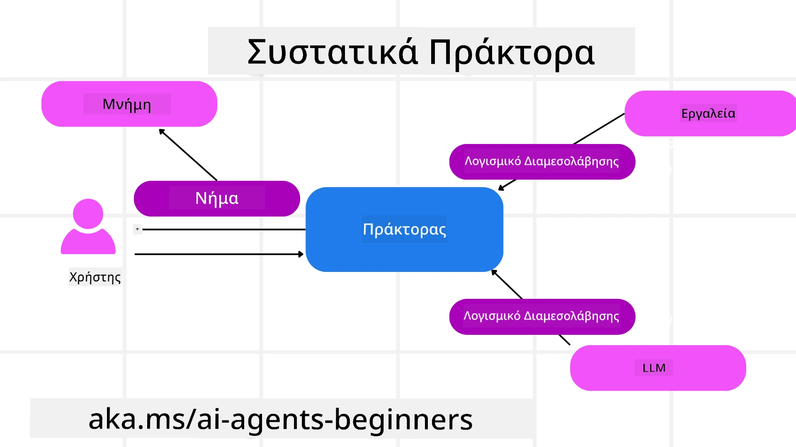

# Εξερευνώντας το Πλαίσιο Υπολογιστικών Πρακτόρων της Microsoft


### Εισαγωγή

Αυτό το μάθημα θα καλύψει:

- Κατανόηση του Πλαισίου Υπολογιστικών Πρακτόρων της Microsoft: Βασικά Χαρακτηριστικά και Αξία  
- Εξερεύνηση των Βασικών Εννοιών του Πλαισίου Υπολογιστικών Πρακτόρων της Microsoft  
- Προηγμένα Σχήματα MAF: Ροές εργασιών, Μεσολάβηση, και Μνήμη  

## Στόχοι Μάθησης

Μετά την ολοκλήρωση αυτού του μαθήματος, θα γνωρίζετε πώς να:

- Δημιουργήσετε Πρακτορεία Τεχνητής Νοημοσύνης έτοιμα για παραγωγή χρησιμοποιώντας το Πλαίσιο Υπολογιστικών Πρακτόρων της Microsoft  
- Εφαρμόσετε τα βασικά χαρακτηριστικά του Πλαισίου Υπολογιστικών Πρακτόρων της Microsoft στις περιπτώσεις χρήσης πρακτόρων σας  
- Χρησιμοποιήσετε προηγμένα σχήματα όπως ροές εργασιών, μεσολάβηση, και παρατηρησιμότητα  

## Παραδείγματα Κώδικα

Παραδείγματα κώδικα για το [Πλαίσιο Υπολογιστικών Πρακτόρων της Microsoft (MAF)](https://aka.ms/ai-agents-beginners/agent-framewrok) βρίσκονται σε αυτό το αποθετήριο κάτω από τα αρχεία `xx-python-agent-framework` και `xx-dotnet-agent-framework`.

## Κατανόηση του Πλαισίου Υπολογιστικών Πρακτόρων της Microsoft


Το [Πλαίσιο Υπολογιστικών Πρακτόρων της Microsoft (MAF)](https://aka.ms/ai-agents-beginners/agent-framewrok) είναι το ενοποιημένο πλαίσιο της Microsoft για τη δημιουργία πρακτόρων τεχνητής νοημοσύνης. Προσφέρει την ευελιξία να καλύψει την ευρεία ποικιλία των περιπτώσεων χρήσης πρακτόρων που συναντώνται τόσο σε περιβάλλοντα παραγωγής όσο και σε ερευνητικά περιβάλλοντα, όπως:

- **Αλληλουχία Ορχήστρωσης Πρακτόρων** σε περιπτώσεις όπου χρειάζονται ροές εργασιών βήμα προς βήμα.  
- **Ταυτόχρονη Ορχήστρωση** σε περιπτώσεις όπου οι πράκτορες πρέπει να ολοκληρώσουν ταυτόχρονα εργασίες.  
- **Ορχήστρωση Ομαδικής Συζήτησης** σε περιπτώσεις όπου οι πράκτορες συνεργάζονται μαζί σε μία εργασία.  
- **Ορχήστρωση Μεταβίβασης** σε περιπτώσεις όπου οι πράκτορες μεταβιβάζουν την εργασία μεταξύ τους καθώς ολοκληρώνονται τα υπο-εργασίες.  
- **Μαγνητική Ορχήστρωση** σε περιπτώσεις όπου ένας διαχειριστής πράκτορας δημιουργεί και τροποποιεί λίστα εργασιών και χειρίζεται το συντονισμό των υποπρακτόρων για την ολοκλήρωση της εργασίας.  

Για την παροχή Πρακτόρων Τεχνητής Νοημοσύνης στην Παραγωγή, το MAF περιλαμβάνει επίσης χαρακτηριστικά για:

- **Παρατηρησιμότητα** μέσω της χρήσης του OpenTelemetry όπου κάθε ενέργεια του Πράκτορα Τεχνητής Νοημοσύνης περιλαμβάνει κλήση εργαλείων, βήματα ορχήστρωσης, ροές συλλογισμών και παρακολούθηση απόδοσης μέσω των πάνελ Microsoft Foundry.  
- **Ασφάλεια** με τη φιλοξενία πρακτόρων εγγενώς στο Microsoft Foundry που περιλαμβάνει ελέγχους ασφάλειας όπως πρόσβαση βασισμένη σε ρόλους, χειρισμό ιδιωτικών δεδομένων και ενσωματωμένη ασφάλεια περιεχομένου.  
- **Ανθεκτικότητα** καθώς τα νήματα πρακτόρων και οι ροές εργασιών μπορούν να παύσουν, να ξαναρχίσουν και να ανακάμψουν από σφάλματα, επιτρέποντας εκτελέσεις με μεγαλύτερη διάρκεια.  
- **Έλεγχος** καθώς υποστηρίζονται ροές εργασίας με ανθρώπινη επιτήρηση όπου οι εργασίες χαρακτηρίζονται ως απαιτούμενες για ανθρώπινη έγκριση.  

Το Πλαίσιο Υπολογιστικών Πρακτόρων της Microsoft εστιάζει επίσης στην διαλειτουργικότητα με:

- **Ανεξαρτησία από Νέφος** - Οι πράκτορες μπορούν να λειτουργούν σε κοντέινερ, on-premises και σε πολλαπλά νέφη.  
- **Ανεξαρτησία από Πάροχο** - Οι πράκτορες μπορούν να δημιουργηθούν μέσω του προτιμώμενου SDK σας, συμπεριλαμβανομένων των Azure OpenAI και OpenAI.  
- **Ενσωμάτωση Ανοιχτών Προτύπων** - Οι πράκτορες μπορούν να χρησιμοποιούν πρωτόκολλα όπως Agent-to-Agent (A2A) και Model Context Protocol (MCP) για να ανακαλύπτουν και να χρησιμοποιούν άλλους πράκτορες και εργαλεία.  
- **Πρόσθετα και Συνδετήρες** - Μπορούν να γίνουν συνδέσεις με υπηρεσίες δεδομένων και μνήμης όπως Microsoft Fabric, SharePoint, Pinecone, και Qdrant.  

Ας δούμε πώς αυτά τα χαρακτηριστικά εφαρμόζονται σε κάποιες από τις βασικές έννοιες του Πλαισίου Υπολογιστικών Πρακτόρων της Microsoft.

## Βασικές Έννοιες του Πλαισίου Υπολογιστικών Πρακτόρων της Microsoft

### Πράκτορες



**Δημιουργία Πρακτόρων**

Η δημιουργία πρακτόρων γίνεται ορίζοντας την υπηρεσία επαγωγής (Πάροχος LLM), ένα σύνολο οδηγιών που πρέπει να ακολουθήσει ο Πράκτορας Τεχνητής Νοημοσύνης, και ένα εκχωρημένο `όνομα`:

```python
agent = AzureOpenAIChatClient(credential=AzureCliCredential()).create_agent( instructions="You are good at recommending trips to customers based on their preferences.", name="TripRecommender" )
```

Το παραπάνω χρησιμοποιεί `Azure OpenAI` αλλά οι πράκτορες μπορούν να δημιουργηθούν χρησιμοποιώντας μια ποικιλία υπηρεσιών συμπεριλαμβανομένης της `Microsoft Foundry Agent Service`:

```python
AzureAIAgentClient(async_credential=credential).create_agent( name="HelperAgent", instructions="You are a helpful assistant." ) as agent
```

OpenAI API `Responses` και `ChatCompletion`:

```python
agent = OpenAIResponsesClient().create_agent( name="WeatherBot", instructions="You are a helpful weather assistant.", )
```

```python
agent = OpenAIChatClient().create_agent( name="HelpfulAssistant", instructions="You are a helpful assistant.", )
```

ή [MiniMax](https://platform.minimaxi.com/), που παρέχει ένα συμβατό API με το OpenAI με μεγάλα παράθυρα πλαισίου (έως 204K tokens):

```python
agent = OpenAIChatClient(base_url="https://api.minimax.io/v1", api_key=os.environ["MINIMAX_API_KEY"], model_id="MiniMax-M2.7").create_agent( name="HelpfulAssistant", instructions="You are a helpful assistant.", )
```

ή απομακρυσμένοι πράκτορες μέσω του πρωτοκόλλου A2A:

```python
agent = A2AAgent( name=agent_card.name, description=agent_card.description, agent_card=agent_card, url="https://your-a2a-agent-host" )
```

**Εκτέλεση Πρακτόρων**

Οι πράκτορες εκτελούνται με τις μεθόδους `.run` ή `.run_stream` για μη ροή ή ροή απαντήσεων αντίστοιχα.

```python
result = await agent.run("What are good places to visit in Amsterdam?")
print(result.text)
```

```python
async for update in agent.run_stream("What are the good places to visit in Amsterdam?"):
    if update.text:
        print(update.text, end="", flush=True)

```

Κάθε εκτέλεση πράκτορα μπορεί επίσης να έχει επιλογές για παραμετροποίηση όπως `max_tokens` που χρησιμοποιείται από τον πράκτορα, τα `εργαλεία` που ο πράκτορας μπορεί να καλεί, και ακόμη και το ίδιο το `μοντέλο` που χρησιμοποιείται για τον πράκτορα.

Αυτό είναι χρήσιμο σε περιπτώσεις όπου απαιτούνται συγκεκριμένα μοντέλα ή εργαλεία για την ολοκλήρωση της εργασίας του χρήστη.

**Εργαλεία**

Τα εργαλεία μπορούν να οριστούν τόσο κατά τον ορισμό του πράκτορα:

```python
def get_attractions( location: Annotated[str, Field(description="The location to get the top tourist attractions for")], ) -> str: """Get the top tourist attractions for a given location.""" return f"The top attractions for {location} are." 


# Όταν δημιουργείτε έναν ChatAgent απευθείας

agent = ChatAgent( chat_client=OpenAIChatClient(), instructions="You are a helpful assistant", tools=[get_attractions]

```

όσο και κατά την εκτέλεση του πράκτορα:

```python

result1 = await agent.run( "What's the best place to visit in Seattle?", tools=[get_attractions] # Εργαλείο παρέχεται μόνο για αυτήν την εκτέλεση )
```

**Νήματα Πρακτόρων**

Τα νήματα πρακτόρων χρησιμοποιούνται για τη διαχείριση συνομιλιών πολλαπλών γυρισμάτων. Τα νήματα μπορούν να δημιουργηθούν είτε:

- Χρησιμοποιώντας τη μέθοδο `get_new_thread()` που επιτρέπει την αποθήκευση του νήματος με την πάροδο του χρόνου  
- Δημιουργώντας ένα νήμα αυτόματα κατά την εκτέλεση ενός πράκτορα, με το νήμα να διαρκεί μόνο κατά τη διάρκεια της τρέχουσας εκτέλεσης.  

Για να δημιουργήσετε ένα νήμα, ο κώδικας είναι ο εξής:

```python
# Δημιουργήστε ένα νέο νήμα.
thread = agent.get_new_thread() # Εκτελέστε τον πράκτορα με το νήμα.
response = await agent.run("Hello, I am here to help you book travel. Where would you like to go?", thread=thread)

```

Έπειτα μπορείτε να σειριοποιήσετε το νήμα για αποθήκευση και μελλοντική χρήση:

```python
# Δημιουργήστε ένα νέο νήμα.
thread = agent.get_new_thread() 

# Εκτελέστε τον πράκτορα με το νήμα.

response = await agent.run("Hello, how are you?", thread=thread) 

# Σειριοποιήστε το νήμα για αποθήκευση.

serialized_thread = await thread.serialize() 

# Αποσειριοποιήστε την κατάσταση του νήματος μετά τη φόρτωση από την αποθήκευση.

resumed_thread = await agent.deserialize_thread(serialized_thread)
```

**Μεσολάβηση Πρακτόρων**

Οι πράκτορες αλληλεπιδρούν με εργαλεία και LLM για να ολοκληρώσουν τις εργασίες των χρηστών. Σε ορισμένα σενάρια, θέλουμε να εκτελέσουμε ή να παρακολουθήσουμε ενδιάμεσες αλληλεπιδράσεις. Η μεσολάβηση πρακτόρων μας επιτρέπει να το κάνουμε αυτό μέσω:

*Λειτουργικής Μεσολάβησης*  
Αυτή η μεσολάβηση επιτρέπει την εκτέλεση μιας ενέργειας μεταξύ του πράκτορα και μιας λειτουργίας/εργαλείου που θα καλεί. Ένα παράδειγμα χρήσης είναι όταν θέλετε να κάνετε κάποια καταγραφή κατά την κλήση της λειτουργίας.

Στον κώδικα παρακάτω, το `next` ορίζει αν θα καλέσει το επόμενο middleware ή την ίδια τη λειτουργία.

```python
async def logging_function_middleware(
    context: FunctionInvocationContext,
    next: Callable[[FunctionInvocationContext], Awaitable[None]],
) -> None:
    """Function middleware that logs function execution."""
    # Προεπεξεργασία: Καταγραφή πριν από την εκτέλεση της συνάρτησης
    print(f"[Function] Calling {context.function.name}")

    # Συνέχεια στο επόμενο middleware ή εκτέλεση συνάρτησης
    await next(context)

    # Μετα-επεξεργασία: Καταγραφή μετά την εκτέλεση της συνάρτησης
    print(f"[Function] {context.function.name} completed")
```

*Μεσολάβηση Συνομιλίας*  
Αυτή η μεσολάβηση επιτρέπει την εκτέλεση ή καταγραφή μιας ενέργειας ανάμεσα στον πράκτορα και στις αιτήσεις προς το LLM.

Περιέχει σημαντικές πληροφορίες, όπως τα `μήνυμα` που αποστέλλονται στην υπηρεσία AI.

```python
async def logging_chat_middleware(
    context: ChatContext,
    next: Callable[[ChatContext], Awaitable[None]],
) -> None:
    """Chat middleware that logs AI interactions."""
    # Προεπεξεργασία: Καταγραφή πριν από την κλήση AI
    print(f"[Chat] Sending {len(context.messages)} messages to AI")

    # Συνέχεια στο επόμενο μεσολαβητικό λογισμικό ή υπηρεσία AI
    await next(context)

    # Μετα-επεξεργασία: Καταγραφή μετά την ανταπόκριση AI
    print("[Chat] AI response received")

```

**Μνήμη Πρακτόρα**

Όπως καλύφθηκε στο μάθημα `Agentic Memory`, η μνήμη είναι σημαντικό στοιχείο για τη δυνατότητα λειτουργίας του πράκτορα σε διαφορετικά συμφραζόμενα. Το MAF προσφέρει διάφορους τύπους μνήμης:

*Μνήμη εντός Νήματος*  
Αυτή είναι η μνήμη που αποθηκεύεται στα νήματα κατά τη διάρκεια της εκτέλεσης της εφαρμογής.

```python
# Δημιουργήστε ένα νέο νήμα.
thread = agent.get_new_thread() # Εκτελέστε τον πράκτορα με το νήμα.
response = await agent.run("Hello, I am here to help you book travel. Where would you like to go?", thread=thread)
```

*Μόνιμα Μηνύματα*  
Αυτή η μνήμη χρησιμοποιείται για την αποθήκευση ιστορικού συνομιλίας μεταξύ διαφορετικών συνεδριών. Ορίζεται με το `chat_message_store_factory`:

```python
from agent_framework import ChatMessageStore

# Δημιουργήστε ένα προσαρμοσμένο κατάστημα μηνυμάτων
def create_message_store():
    return ChatMessageStore()

agent = ChatAgent(
    chat_client=OpenAIChatClient(),
    instructions="You are a Travel assistant.",
    chat_message_store_factory=create_message_store
)

```

*Δυναμική Μνήμη*  
Αυτή η μνήμη προστίθεται στο πλαίσιο πριν εκτελεστούν οι πράκτορες. Αυτές οι μνήμες μπορούν να αποθηκευτούν σε εξωτερικές υπηρεσίες όπως το mem0:

```python
from agent_framework.mem0 import Mem0Provider

# Χρήση Mem0 για προηγμένες λειτουργίες μνήμης
memory_provider = Mem0Provider(
    api_key="your-mem0-api-key",
    user_id="user_123",
    application_id="my_app"
)

agent = ChatAgent(
    chat_client=OpenAIChatClient(),
    instructions="You are a helpful assistant with memory.",
    context_providers=memory_provider
)

```

**Παρατηρησιμότητα Πρακτόρα**

Η παρατηρησιμότητα είναι σημαντική για την κατασκευή αξιόπιστων και διαχειρίσιμων πρακτορικών συστημάτων. Το MAF ενσωματώνεται με το OpenTelemetry για να παρέχει ιχνηλάτηση και μετρητές για καλύτερη παρατηρησιμότητα.

```python
from agent_framework.observability import get_tracer, get_meter

tracer = get_tracer()
meter = get_meter()
with tracer.start_as_current_span("my_custom_span"):
    # κάνε κάτι
    pass
counter = meter.create_counter("my_custom_counter")
counter.add(1, {"key": "value"})
```

### Ροές Εργασιών

Το MAF προσφέρει ροές εργασιών που είναι προκαθορισμένα βήματα για την ολοκλήρωση μίας εργασίας και περιλαμβάνουν πρακτορεία AI ως συστατικά αυτών των βημάτων.

Οι ροές εργασιών αποτελούνται από διάφορα συστατικά που επιτρέπουν καλύτερο έλεγχο της ροής. Επιπλέον, επιτρέπουν την **πολυπράκτορική ορχήστρωση** και το **checkpointing** για αποθήκευση καταστάσεων της ροής εργασιών.

Τα βασικά συστατικά μιας ροής εργασιών είναι:

**Εκτελεστές**

Οι εκτελεστές λαμβάνουν εισερχόμενα μηνύματα, εκτελούν τις ανατεθειμένες εργασίες τους και παράγουν ένα έξοδο μήνυμα. Αυτό προωθεί τη ροή εργασιών προς την ολοκλήρωση της μεγαλύτερης εργασίας. Οι εκτελεστές μπορεί να είναι είτε πρακτορεία AI είτε προσαρμοσμένη λογική.

**Ακμές**

Οι ακμές χρησιμοποιούνται για τον ορισμό της ροής των μηνυμάτων σε μια ροή εργασιών. Αυτές μπορεί να είναι:

*Άμεσες Ακμές* - Απλές συνδέσεις ένα προς ένα μεταξύ εκτελεστών:

```python
from agent_framework import WorkflowBuilder

builder = WorkflowBuilder()
builder.add_edge(source_executor, target_executor)
builder.set_start_executor(source_executor)
workflow = builder.build()
```

*Υποθετικές Ακμές* - Ενεργοποιούνται αφού πληρωθεί κάποια προϋπόθεση. Για παράδειγμα, όταν δεν υπάρχουν διαθέσιμα δωμάτια ξενοδοχείου, ένας εκτελεστής μπορεί να προτείνει άλλες επιλογές.

*Ακμές τύπου switch-case* - Δρομολογούν μηνύματα σε διαφορετικούς εκτελεστές με βάση ορισμένες προϋποθέσεις. Για παράδειγμα, αν ένας πελάτης ταξιδιού έχει προτεραιότητα πρόσβασης, οι εργασίες του θα διαχειρίζονται μέσω άλλης ροής εργασιών.

*Ακμές μεταγωγής πολλαπλών εξόδων (Fan-out)* - Στέλνουν ένα μήνυμα σε πολλαπλούς προορισμούς.

*Ακμές συλλογής πολλαπλών εισόδων (Fan-in)* - Συλλέγουν πολλαπλά μηνύματα από διαφορετικούς εκτελεστές και τα στέλνουν σε έναν προορισμό.

**Γεγονότα**

Για καλύτερη παρατηρησιμότητα στις ροές εργασιών, το MAF προσφέρει ενσωματωμένα γεγονότα εκτέλεσης, όπως:

- `WorkflowStartedEvent`  - Ξεκινά η εκτέλεση της ροής εργασιών  
- `WorkflowOutputEvent` - Η ροή εργασιών παράγει έξοδο  
- `WorkflowErrorEvent` - Η ροή εργασιών αντιμετωπίζει σφάλμα  
- `ExecutorInvokeEvent`  - Ο εκτελεστής ξεκινά την επεξεργασία  
- `ExecutorCompleteEvent`  - Ο εκτελεστής ολοκληρώνει την επεξεργασία  
- `RequestInfoEvent` - Εκδίδεται ένα αίτημα  

## Προηγμένα Σχήματα MAF

Οι παραπάνω ενότητες καλύπτουν τις βασικές έννοιες του Πλαισίου Υπολογιστικών Πρακτόρων της Microsoft. Καθώς δημιουργείτε πιο σύνθετους πράκτορες, εδώ είναι μερικά προηγμένα σχήματα προς εξέταση:

- **Σύνθεση Μεσολάβησης**: Αλυσιδωτή σύνδεση πολλαπλών χειριστών μεσολάβησης (καταγραφή, αυθεντικοποίηση, περιορισμός ρυθμού) χρησιμοποιώντας λειτουργικές και συνομιλιακές μεθόδους μεσολάβησης για λεπτομερή έλεγχο της συμπεριφοράς των πρακτόρων.  
- **Checkpointing Ροών Εργασιών**: Χρησιμοποιήστε γεγονότα ροής εργασιών και σειριοποίηση για την αποθήκευση και ανανέωση μακροχρόνιων διαδικασιών πρακτόρων.  
- **Δυναμική Επιλογή Εργαλείων**: Συνδυάστε RAG με περιγραφές εργαλείων με την καταχώριση εργαλείων του MAF για να παρουσιάσετε μόνο τα σχετικά εργαλεία ανά ερώτημα.  
- **Διαχείριση Μεταβίβασης Πολλαπλών Πρακτόρων**: Χρησιμοποιήστε ακμές ροής εργασιών και υποθετική δρομολόγηση για να ορχηστρώσετε μεταβιβάσεις μεταξύ εξειδικευμένων πρακτόρων.  

## Παραδείγματα Κώδικα

Παραδείγματα κώδικα για το Πλαίσιο Υπολογιστικών Πρακτόρων της Microsoft βρίσκονται σε αυτό το αποθετήριο κάτω από τα αρχεία `xx-python-agent-framework` και `xx-dotnet-agent-framework`.

## Έχετε Περισσότερες Ερωτήσεις για το Πλαίσιο Υπολογιστικών Πρακτόρων της Microsoft;

Ενταχθείτε στο [Microsoft Foundry Discord](https://aka.ms/ai-agents/discord) για να συναντήσετε άλλους μαθητές, να παρακολουθήσετε ώρες γραφείου και να λάβετε απαντήσεις στις ερωτήσεις σας για τους Πράκτορες Τεχνητής Νοημοσύνης.

---

<!-- CO-OP TRANSLATOR DISCLAIMER START -->
**Αποποίηση ευθυνών**:  
Αυτό το έγγραφο έχει μεταφραστεί χρησιμοποιώντας την υπηρεσία μετάφρασης με τεχνητή νοημοσύνη [Co-op Translator](https://github.com/Azure/co-op-translator). Ενώ καταβάλλουμε προσπάθεια για ακρίβεια, παρακαλούμε να λάβετε υπόψη ότι οι αυτοματοποιημένες μεταφράσεις ενδέχεται να περιέχουν σφάλματα ή ανακρίβειες. Το πρωτότυπο έγγραφο στη μητρική του γλώσσα πρέπει να θεωρείται η αξιόπιστη πηγή. Για κρίσιμες πληροφορίες, συνιστάται επαγγελματική μετάφραση από άνθρωπο. Δεν ευθυνόμαστε για τυχόν παρανοήσεις ή λανθασμένες ερμηνείες που προκύπτουν από τη χρήση αυτής της μετάφρασης.
<!-- CO-OP TRANSLATOR DISCLAIMER END -->