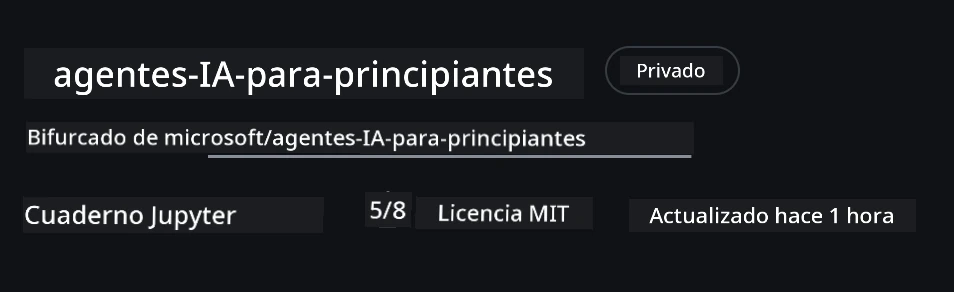
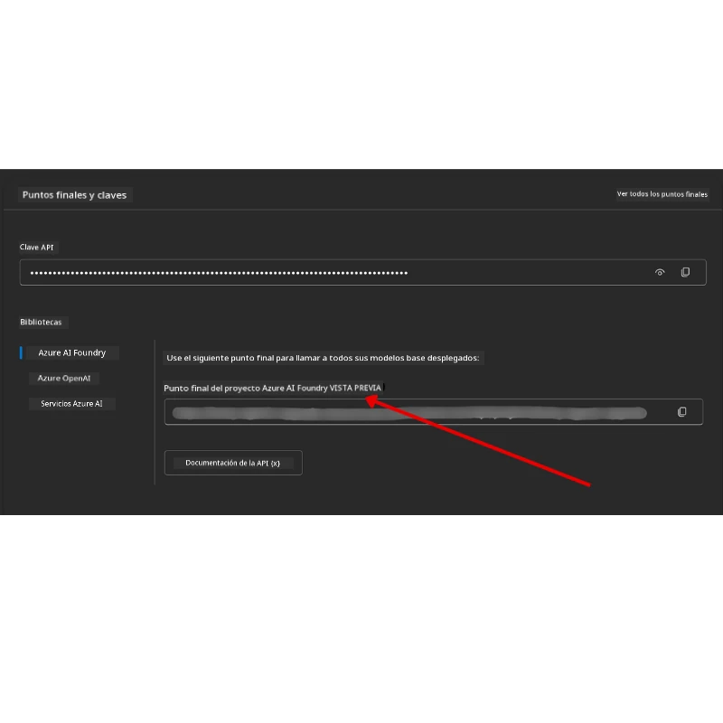

# Configuración del Curso

## Introducción

Esta lección cubrirá cómo ejecutar los ejemplos de código de este curso.

## Únete a Otros Estudiantes y Obtén Ayuda

Antes de comenzar a clonar tu repositorio, únete al [canal de Discord AI Agents For Beginners](https://aka.ms/ai-agents/discord) para obtener ayuda con la configuración, resolver dudas sobre el curso o conectarte con otros estudiantes.

## Clona o Haz Fork a este Repositorio

Para comenzar, por favor clona o haz fork al Repositorio de GitHub. Esto creará tu propia versión del material del curso para que puedas ejecutar, probar y modificar el código.

Esto se puede hacer haciendo clic en el enlace para <a href="https://github.com/microsoft/ai-agents-for-beginners/fork" target="_blank">hacer fork del repositorio</a>

Ahora deberías tener tu propia versión bifurcada de este curso en el siguiente enlace:



### Clonación Superficial (recomendada para taller / Codespaces)

  > El repositorio completo puede ser grande (~3 GB) cuando descargas todo el historial y archivos. Si solo asistes al taller o solo necesitas algunas carpetas de lecciones, una clonación superficial (o clonación dispersa) evita la mayor parte de esa descarga truncando el historial y/o saltándose blobs.

#### Clonación superficial rápida — historial mínimo, todos los archivos

Reemplaza `<your-username>` en los comandos a continuación con la URL de tu fork (o la URL original si prefieres).

Para clonar solo el historial del último commit (descarga pequeña):

```bash|powershell
git clone --depth 1 https://github.com/<your-username>/ai-agents-for-beginners.git
```

Para clonar una rama específica:

```bash|powershell
git clone --depth 1 --branch <branch-name> https://github.com/<your-username>/ai-agents-for-beginners.git
```

#### Clonación parcial (dispersa) — blobs mínimos + solo carpetas seleccionadas

Esto usa clonación parcial y sparse-checkout (requiere Git 2.25+ y se recomienda Git moderno con soporte de clonación parcial):

```bash|powershell
git clone --depth 1 --filter=blob:none --sparse https://github.com/<your-username>/ai-agents-for-beginners.git
```

Entra en la carpeta del repositorio:

```bash|powershell
cd ai-agents-for-beginners
```

Luego especifica qué carpetas quieres (el ejemplo a continuación muestra dos carpetas):

```bash|powershell
git sparse-checkout set 00-course-setup 01-intro-to-ai-agents
```

Después de clonar y verificar los archivos, si solo necesitas los archivos y quieres liberar espacio (sin historial git), elimina los metadatos del repositorio (💀 irreversible — perderás toda funcionalidad de Git: no podrás hacer commits, pulls, pushes ni acceder al historial).

```bash
# zsh/bash
rm -rf .git
```

```powershell
# PowerShell
Remove-Item -Recurse -Force .git
```

#### Uso de GitHub Codespaces (recomendado para evitar descargas locales grandes)

- Crea un nuevo Codespace para este repo vía la [interfaz de GitHub](https://github.com/codespaces).  

- En el terminal del codespace recién creado, ejecuta uno de los comandos de clonación superficial/dispersa anteriores para traer solo las carpetas de lecciones que necesites al espacio de trabajo del Codespace.
- Opcional: después de clonar dentro de Codespaces, elimina .git para recuperar espacio (ver comandos de eliminación arriba).
- Nota: si prefieres abrir el repositorio directamente en Codespaces (sin clonación extra), ten en cuenta que Codespaces construirá el entorno devcontainer y aún puede provisionar más de lo que necesitas. Clonar una copia superficial dentro de un Codespace nuevo te da más control sobre el uso del disco.

#### Consejos

- Siempre reemplaza la URL de clonación con la de tu fork si quieres editar/commit.
- Si más adelante necesitas más historial o archivos, puedes traerlos o ajustar sparse-checkout para incluir carpetas adicionales.

## Ejecutando el Código

Este curso ofrece una serie de Jupyter Notebooks que puedes ejecutar para obtener experiencia práctica construyendo Agentes de IA.

Los ejemplos de código usan **Microsoft Agent Framework (MAF)** con el `AzureAIProjectAgentProvider`, que se conecta a **Azure AI Agent Service V2** (API Responses) a través de **Microsoft Foundry**.

Todos los notebooks de Python están etiquetados como `*-python-agent-framework.ipynb`.

## Requisitos

- Python 3.12+
  - **NOTA**: Si no tienes Python3.12 instalado, asegúrate de instalarlo. Luego crea tu entorno virtual usando python3.12 para garantizar que se instalen las versiones correctas desde el archivo requirements.txt.
  
    >Ejemplo

    Crea el directorio del entorno Python venv:

    ```bash|powershell
    python -m venv venv
    ```

    Luego activa el entorno venv para:

    ```bash
    # zsh/bash
    source venv/bin/activate
    ```
  
    ```dos
    # Command Prompt for Windows
    venv\Scripts\activate
    ```

- .NET 10+: Para los códigos de ejemplo usando .NET, asegúrate de instalar el [.NET 10 SDK](https://dotnet.microsoft.com/download/dotnet/10.0) o superior. Luego, revisa la versión del SDK instalado:

    ```bash|powershell
    dotnet --list-sdks
    ```

- **Azure CLI** — Requerido para la autenticación. Instálalo desde [aka.ms/installazurecli](https://aka.ms/installazurecli).
- **Suscripción de Azure** — Para acceso a Microsoft Foundry y al Azure AI Agent Service.
- **Proyecto Microsoft Foundry** — Un proyecto con un modelo desplegado (por ejemplo, `gpt-4o`). Ver [Paso 1](#paso-1-crear-un-proyecto-microsoft-foundry) abajo.

Hemos incluido un archivo `requirements.txt` en la raíz de este repositorio que contiene todos los paquetes de Python necesarios para ejecutar los ejemplos de código.

Puedes instalarlos ejecutando el siguiente comando en tu terminal en la raíz del repositorio:

```bash|powershell
pip install -r requirements.txt
```

Recomendamos crear un entorno virtual de Python para evitar conflictos y problemas.

## Configurar VSCode

Asegúrate de estar usando la versión correcta de Python en VSCode.


## Configurar Microsoft Foundry y Azure AI Agent Service

### Paso 1: Crear un Proyecto Microsoft Foundry

Necesitas un **hub** y un **proyecto** de Azure AI Foundry con un modelo desplegado para ejecutar los notebooks.

1. Ve a [ai.azure.com](https://ai.azure.com) e inicia sesión con tu cuenta de Azure.
2. Crea un **hub** (o usa uno existente). Ver: [Resumen de recursos Hub](https://learn.microsoft.com/azure/ai-foundry/concepts/ai-resources).
3. Dentro del hub, crea un **proyecto**.
4. Despliega un modelo (por ejemplo, `gpt-4o`) desde **Models + Endpoints** → **Deploy model**.

### Paso 2: Obtén tu Endpoint del Proyecto y Nombre del Despliegue del Modelo

Desde tu proyecto en el portal Microsoft Foundry:

- **Endpoint del Proyecto** — Ve a la página de **Resumen** y copia la URL del endpoint.



- **Nombre del Despliegue del Modelo** — Ve a **Models + Endpoints**, selecciona el modelo desplegado y anota el **Deployment name** (por ejemplo, `gpt-4o`).

### Paso 3: Inicia sesión en Azure con `az login`

Todos los notebooks usan **`AzureCliCredential`** para autenticarse — no hay claves API que administrar. Esto requiere que estés conectado mediante Azure CLI.

1. **Instala Azure CLI** si no lo tienes: [aka.ms/installazurecli](https://aka.ms/installazurecli)

2. **Inicia sesión** ejecutando:

    ```bash|powershell
    az login
    ```

    O si estás en un entorno remoto/Codespace sin navegador:

    ```bash|powershell
    az login --use-device-code
    ```

3. **Selecciona tu suscripción** si se te solicita — elige aquella que contiene tu proyecto Foundry.

4. **Verifica** que estás autenticado:

    ```bash|powershell
    az account show
    ```

> **¿Por qué `az login`?** Los notebooks se autentican usando `AzureCliCredential` del paquete `azure-identity`. Esto significa que tu sesión de Azure CLI provee las credenciales — no necesitas claves API o secretos en tu archivo `.env`. Esta es una [buena práctica de seguridad](https://learn.microsoft.com/azure/developer/ai/keyless-connections).

### Paso 4: Crea tu Archivo `.env`

Copia el archivo de ejemplo:

```bash
# zsh/bash
cp .env.example .env
```

```powershell
# PowerShell
Copy-Item .env.example .env
```

Abre `.env` y completa estos dos valores:

```env
AZURE_AI_PROJECT_ENDPOINT=https://<your-project>.services.ai.azure.com/api/projects/<your-project-id>
AZURE_AI_MODEL_DEPLOYMENT_NAME=gpt-4o
```

| Variable | Dónde encontrarla |
|----------|------------------|
| `AZURE_AI_PROJECT_ENDPOINT` | Portal Foundry → tu proyecto → página **Resumen** |
| `AZURE_AI_MODEL_DEPLOYMENT_NAME` | Portal Foundry → **Models + Endpoints** → nombre del modelo desplegado |

¡Eso es todo para la mayoría de las lecciones! Los notebooks se autenticarán automáticamente a través de tu sesión `az login`.

### Paso 5: Instala las Dependencias de Python

```bash|powershell
pip install -r requirements.txt
```

Recomendamos ejecutar esto dentro del entorno virtual que creaste antes.

## Configuración Adicional para la Lección 5 (Agentic RAG)

La lección 5 usa **Azure AI Search** para generación aumentada por recuperación. Si planeas ejecutar esa lección, agrega estas variables a tu archivo `.env`:

| Variable | Dónde encontrarla |
|----------|------------------|
| `AZURE_SEARCH_SERVICE_ENDPOINT` | Portal Azure → tu recurso **Azure AI Search** → **Resumen** → URL |
| `AZURE_SEARCH_API_KEY` | Portal Azure → tu recurso **Azure AI Search** → **Configuración** → **Claves** → clave principal admin |

## Configuración Adicional para las Lecciones 6 y 8 (Modelos GitHub)

Algunos notebooks en las lecciones 6 y 8 usan **Modelos GitHub** en lugar de Azure AI Foundry. Si planeas ejecutar esos ejemplos, agrega estas variables a tu archivo `.env`:

| Variable | Dónde encontrarla |
|----------|------------------|
| `GITHUB_TOKEN` | GitHub → **Settings** → **Developer settings** → **Personal access tokens** |
| `GITHUB_ENDPOINT` | Usa `https://models.inference.ai.azure.com` (valor por defecto) |
| `GITHUB_MODEL_ID` | Nombre del modelo a usar (ej. `gpt-4o-mini`) |

## Proveedor Alternativo: MiniMax (Compatible con OpenAI)

[MiniMax](https://platform.minimaxi.com/) provee modelos de contexto largo (hasta 204K tokens) a través de una API compatible con OpenAI. Dado que el `OpenAIChatClient` del Microsoft Agent Framework funciona con cualquier endpoint compatible con OpenAI, puedes usar MiniMax como reemplazo directo de Modelos GitHub u OpenAI.

Agrega estas variables a tu archivo `.env`:

| Variable | Dónde encontrarla |
|----------|------------------|
| `MINIMAX_API_KEY` | [MiniMax Platform](https://platform.minimaxi.com/) → API Keys |
| `MINIMAX_BASE_URL` | Usa `https://api.minimax.io/v1` (valor por defecto) |
| `MINIMAX_MODEL_ID` | Nombre del modelo a usar (ej. `MiniMax-M2.7`) |

**Modelos disponibles**: `MiniMax-M2.7` (recomendado), `MiniMax-M2.7-highspeed` (respuestas más rápidas)

Los ejemplos de código que usan `OpenAIChatClient` (ej. flujo de trabajo de reserva de hotel de la Lección 14) detectarán y usarán automáticamente tu configuración MiniMax cuando `MINIMAX_API_KEY` esté configurado.

## Configuración Adicional para la Lección 8 (Flujo de trabajo Bing Grounding)

El notebook de flujo condicional en la lección 8 usa **Bing grounding** vía Azure AI Foundry. Si planeas ejecutar ese ejemplo, agrega esta variable a tu archivo `.env`:

| Variable | Dónde encontrarla |
|----------|------------------|
| `BING_CONNECTION_ID` | Portal Azure AI Foundry → tu proyecto → **Management** → **Connected resources** → tu conexión Bing → copia el ID de conexión |

## Solución de Problemas

### Errores de Verificación de Certificado SSL en macOS

Si estás en macOS y encuentras un error como:

```plaintext
ssl.SSLCertVerificationError: [SSL: CERTIFICATE_VERIFY_FAILED] certificate verify failed: self-signed certificate in certificate chain
```

Este es un problema conocido con Python en macOS donde los certificados SSL del sistema no se confían automáticamente. Prueba las siguientes soluciones en orden:

**Opción 1: Ejecutar el script Install Certificates de Python (recomendado)**

```bash
# Reemplaza 3.XX con la versión de Python que tienes instalada (por ejemplo, 3.12 o 3.13):
/Applications/Python\ 3.XX/Install\ Certificates.command
```

**Opción 2: Usar `connection_verify=False` en tu notebook (solo para notebooks de Modelos GitHub)**

En el notebook de la Lección 6 (`06-building-trustworthy-agents/code_samples/06-system-message-framework.ipynb`), ya hay una solución alternativa comentada. Descomenta `connection_verify=False` al crear el cliente:

```python
client = ChatCompletionsClient(
    endpoint=endpoint,
    credential=AzureKeyCredential(token),
    connection_verify=False,  # Desactivar la verificación SSL si encuentras errores de certificado
)
```

> **⚠️ Advertencia:** Desactivar la verificación SSL (`connection_verify=False`) reduce la seguridad al omitir la validación del certificado. Usa esto sólo como solución temporal en entornos de desarrollo, nunca en producción.

**Opción 3: Instalar y usar `truststore`**

```bash
pip install truststore
```

Luego agrega lo siguiente al inicio de tu notebook o script antes de hacer llamadas de red:

```python
import truststore
truststore.inject_into_ssl()
```

## ¿Estancado en algún lugar?

Si tienes algún problema con esta configuración, únete a nuestro <a href="https://discord.gg/kzRShWzttr" target="_blank">Discord de la Comunidad Azure AI</a> o <a href="https://github.com/microsoft/ai-agents-for-beginners/issues?WT.mc_id=academic-105485-koreyst" target="_blank">crea un issue</a>.

## Próxima Lección

¡Ya estás listo para ejecutar el código de este curso. Disfruta aprendiendo más sobre el mundo de los Agentes de IA!

[Introducción a los Agentes de IA y Casos de Uso](../01-intro-to-ai-agents/README.md)

---

<!-- CO-OP TRANSLATOR DISCLAIMER START -->
**Descargo de responsabilidad**:  
Este documento ha sido traducido utilizando el servicio de traducción automática [Co-op Translator](https://github.com/Azure/co-op-translator). Aunque nos esforzamos por la exactitud, tenga en cuenta que las traducciones automáticas pueden contener errores o inexactitudes. El documento original en su idioma nativo debe considerarse la fuente autorizada. Para información crítica, se recomienda la traducción profesional humana. No nos hacemos responsables de ningún malentendido o mala interpretación derivada del uso de esta traducción.
<!-- CO-OP TRANSLATOR DISCLAIMER END -->