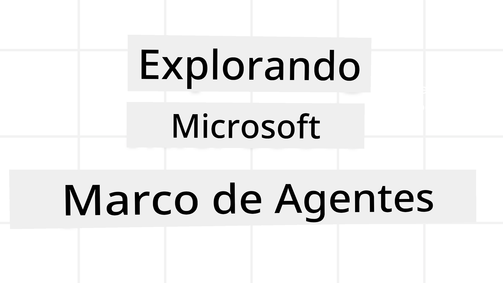
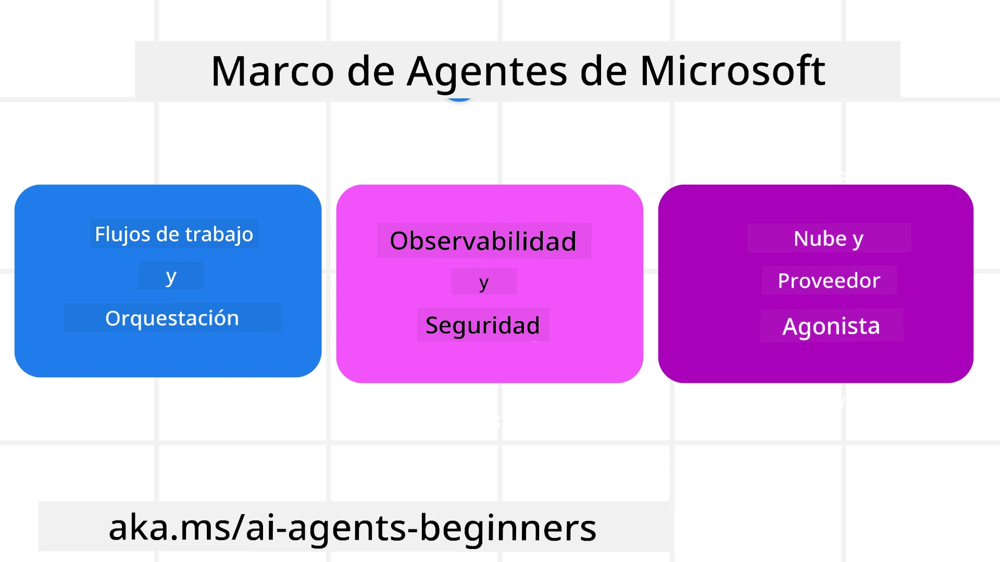
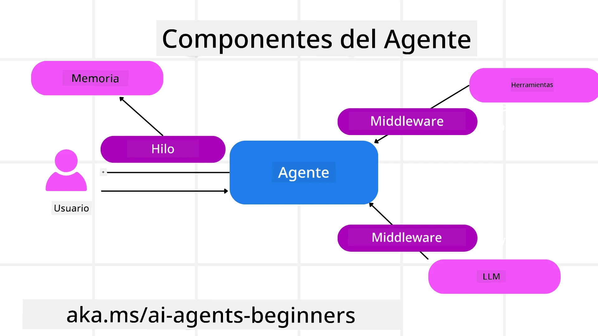

# Explorando Microsoft Agent Framework



### Introducción

Esta lección cubrirá:

- Comprender Microsoft Agent Framework: Características clave y valor  
- Explorar los conceptos clave de Microsoft Agent Framework
- Patrones avanzados de MAF: Flujos de trabajo, middleware y memoria

## Objetivos de aprendizaje

Después de completar esta lección, sabrás cómo:

- Construir agentes de IA listos para producción usando Microsoft Agent Framework
- Aplicar las características centrales de Microsoft Agent Framework a tus casos de uso agenticos
- Usar patrones avanzados incluyendo flujos de trabajo, middleware y observabilidad

## Ejemplos de código 

Los ejemplos de código para [Microsoft Agent Framework (MAF)](https://aka.ms/ai-agents-beginners/agent-framewrok) se pueden encontrar en este repositorio bajo los archivos `xx-python-agent-framework` y `xx-dotnet-agent-framework`.

## Comprendiendo Microsoft Agent Framework



[Microsoft Agent Framework (MAF)](https://aka.ms/ai-agents-beginners/agent-framewrok) es el marco unificado de Microsoft para construir agentes de IA. Ofrece la flexibilidad para abordar la gran variedad de casos de uso agenticos vistos tanto en producción como en entornos de investigación incluyendo:

- **Orquestación secuencial de agentes** en escenarios donde se necesitan flujos de trabajo paso a paso.
- **Orquestación concurrente** en escenarios donde los agentes necesitan completar tareas al mismo tiempo.
- **Orquestación de chat grupal** en escenarios donde los agentes pueden colaborar juntos en una tarea.
- **Orquestación de transferencia** en escenarios donde los agentes transfieren la tarea entre sí a medida que se completan las subtareas.
- **Orquestación magnética** en escenarios donde un agente administrador crea y modifica una lista de tareas y maneja la coordinación de subagentes para completar la tarea.

Para entregar agentes de IA en producción, MAF también incluye características para:

- **Observabilidad** mediante el uso de OpenTelemetry donde cada acción del agente de IA incluyendo invocación de herramientas, pasos de orquestación, flujos de razonamiento y monitoreo del rendimiento a través de los paneles de Microsoft Foundry.
- **Seguridad** alojando agentes de forma nativa en Microsoft Foundry, que incluye controles de seguridad como acceso basado en roles, manejo de datos privados y seguridad de contenido incorporada.
- **Durabilidad** ya que los hilos y flujos de trabajo de los agentes pueden pausar, reanudar y recuperarse de errores, lo que permite procesos de larga duración.
- **Control** ya que se soportan flujos de trabajo con intervención humana donde las tareas se marcan como requeridas para aprobación humana.

Microsoft Agent Framework también se enfoca en ser interoperable mediante:

- **Ser independiente de la nube** - Los agentes pueden ejecutarse en contenedores, en local y en múltiples nubes diferentes.
- **Ser independiente del proveedor** - Los agentes pueden crearse con tu SDK preferido incluyendo Azure OpenAI y OpenAI.
- **Integrar estándares abiertos** - Los agentes pueden utilizar protocolos como Agent-to-Agent (A2A) y Model Context Protocol (MCP) para descubrir y usar otros agentes y herramientas.
- **Plugins y conectores** - Se pueden hacer conexiones a servicios de datos y memoria tales como Microsoft Fabric, SharePoint, Pinecone y Qdrant.

Veamos cómo estas características se aplican a algunos de los conceptos clave de Microsoft Agent Framework.

## Conceptos clave de Microsoft Agent Framework

### Agentes



**Creación de agentes**

La creación de agentes se realiza definiendo el servicio de inferencia (Proveedor LLM), un conjunto de instrucciones para que el agente de IA siga y un `nombre` asignado:

```python
agent = AzureOpenAIChatClient(credential=AzureCliCredential()).create_agent( instructions="You are good at recommending trips to customers based on their preferences.", name="TripRecommender" )
```

Lo anterior usa `Azure OpenAI` pero los agentes pueden crearse usando una variedad de servicios incluyendo `Microsoft Foundry Agent Service`:

```python
AzureAIAgentClient(async_credential=credential).create_agent( name="HelperAgent", instructions="You are a helpful assistant." ) as agent
```

APIs de OpenAI `Responses`, `ChatCompletion`

```python
agent = OpenAIResponsesClient().create_agent( name="WeatherBot", instructions="You are a helpful weather assistant.", )
```

```python
agent = OpenAIChatClient().create_agent( name="HelpfulAssistant", instructions="You are a helpful assistant.", )
```

o [MiniMax](https://platform.minimaxi.com/), que provee una API compatible con OpenAI con ventanas de contexto grandes (hasta 204K tokens):

```python
agent = OpenAIChatClient(base_url="https://api.minimax.io/v1", api_key=os.environ["MINIMAX_API_KEY"], model_id="MiniMax-M2.7").create_agent( name="HelpfulAssistant", instructions="You are a helpful assistant.", )
```

o agentes remotos usando el protocolo A2A:

```python
agent = A2AAgent( name=agent_card.name, description=agent_card.description, agent_card=agent_card, url="https://your-a2a-agent-host" )
```

**Ejecución de agentes**

Los agentes se ejecutan usando los métodos `.run` o `.run_stream` para respuestas sin transmisión o con transmisión.

```python
result = await agent.run("What are good places to visit in Amsterdam?")
print(result.text)
```

```python
async for update in agent.run_stream("What are the good places to visit in Amsterdam?"):
    if update.text:
        print(update.text, end="", flush=True)

```

Cada ejecución del agente también puede tener opciones para personalizar parámetros como `max_tokens` usados por el agente, `tools` que el agente puede invocar e incluso el `model` mismo usado para el agente.

Esto es útil en casos donde se requieren modelos o herramientas específicas para completar la tarea del usuario.

**Herramientas**

Las herramientas pueden definirse tanto al definir el agente:

```python
def get_attractions( location: Annotated[str, Field(description="The location to get the top tourist attractions for")], ) -> str: """Get the top tourist attractions for a given location.""" return f"The top attractions for {location} are." 


# Al crear un ChatAgent directamente

agent = ChatAgent( chat_client=OpenAIChatClient(), instructions="You are a helpful assistant", tools=[get_attractions]

```

como también al ejecutar el agente:

```python

result1 = await agent.run( "What's the best place to visit in Seattle?", tools=[get_attractions] # Herramienta proporcionada solo para esta ejecución )
```

**Hilos de Agentes**

Los hilos de agentes se usan para manejar conversaciones de múltiples turnos. Los hilos se pueden crear ya sea:

- Usando `get_new_thread()` que permite guardar el hilo a lo largo del tiempo
- Creando un hilo automáticamente al ejecutar un agente y que el hilo solo dure durante la ejecución actual.

Para crear un hilo, el código es así:

```python
# Crear un nuevo hilo.
thread = agent.get_new_thread() # Ejecutar el agente con el hilo.
response = await agent.run("Hello, I am here to help you book travel. Where would you like to go?", thread=thread)

```

Luego puedes serializar el hilo para almacenarlo para uso posterior:

```python
# Crear un nuevo hilo.
thread = agent.get_new_thread() 

# Ejecutar el agente con el hilo.

response = await agent.run("Hello, how are you?", thread=thread) 

# Serializar el hilo para almacenamiento.

serialized_thread = await thread.serialize() 

# Deserializar el estado del hilo después de cargarlo desde el almacenamiento.

resumed_thread = await agent.deserialize_thread(serialized_thread)
```

**Middleware de Agentes**

Los agentes interactúan con herramientas y LLM para completar tareas del usuario. En ciertos escenarios queremos ejecutar o rastrear entre estas interacciones. El middleware de agentes nos permite hacer esto a través de:

*Middleware de Función*

Este middleware nos permite ejecutar una acción entre el agente y una función/herramienta que llamará. Un ejemplo de uso sería hacer registros (logging) en la llamada a la función.

En el código abajo `next` define si debe llamarse al siguiente middleware o a la función real.

```python
async def logging_function_middleware(
    context: FunctionInvocationContext,
    next: Callable[[FunctionInvocationContext], Awaitable[None]],
) -> None:
    """Function middleware that logs function execution."""
    # Pre-procesamiento: Registrar antes de la ejecución de la función
    print(f"[Function] Calling {context.function.name}")

    # Continuar al siguiente middleware o ejecución de función
    await next(context)

    # Post-procesamiento: Registrar después de la ejecución de la función
    print(f"[Function] {context.function.name} completed")
```

*Middleware de Chat*

Este middleware nos permite ejecutar o registrar una acción entre el agente y las solicitudes con el LLM.

Esto contiene información importante como los `messages` que se están enviando al servicio de IA.

```python
async def logging_chat_middleware(
    context: ChatContext,
    next: Callable[[ChatContext], Awaitable[None]],
) -> None:
    """Chat middleware that logs AI interactions."""
    # Pre-procesamiento: Registrar antes de la llamada a la IA
    print(f"[Chat] Sending {len(context.messages)} messages to AI")

    # Continuar al siguiente middleware o servicio de IA
    await next(context)

    # Post-procesamiento: Registrar después de la respuesta de la IA
    print("[Chat] AI response received")

```

**Memoria de Agente**

Como se cubrió en la lección `Agentic Memory`, la memoria es un elemento importante para permitir que el agente opere sobre diferentes contextos. MAF ofrece varios tipos diferentes de memorias:

*Almacenamiento en memoria*

Esta es la memoria almacenada en hilos durante el tiempo de ejecución de la aplicación.

```python
# Crear un nuevo hilo.
thread = agent.get_new_thread() # Ejecutar el agente con el hilo.
response = await agent.run("Hello, I am here to help you book travel. Where would you like to go?", thread=thread)
```

*Mensajes persistentes*

Esta memoria se usa para almacenar el historial de conversación a través de diferentes sesiones. Se define usando la `chat_message_store_factory`:

```python
from agent_framework import ChatMessageStore

# Crear una tienda de mensajes personalizada
def create_message_store():
    return ChatMessageStore()

agent = ChatAgent(
    chat_client=OpenAIChatClient(),
    instructions="You are a Travel assistant.",
    chat_message_store_factory=create_message_store
)

```

*Memoria dinámica*

Esta memoria se añade al contexto antes de que los agentes se ejecuten. Estas memorias pueden almacenarse en servicios externos tales como mem0:

```python
from agent_framework.mem0 import Mem0Provider

# Usando Mem0 para capacidades avanzadas de memoria
memory_provider = Mem0Provider(
    api_key="your-mem0-api-key",
    user_id="user_123",
    application_id="my_app"
)

agent = ChatAgent(
    chat_client=OpenAIChatClient(),
    instructions="You are a helpful assistant with memory.",
    context_providers=memory_provider
)

```

**Observabilidad de Agentes**

La observabilidad es importante para construir sistemas agenticos confiables y mantenibles. MAF se integra con OpenTelemetry para proveer trazas y métricas para mejor observabilidad.

```python
from agent_framework.observability import get_tracer, get_meter

tracer = get_tracer()
meter = get_meter()
with tracer.start_as_current_span("my_custom_span"):
    # hacer algo
    pass
counter = meter.create_counter("my_custom_counter")
counter.add(1, {"key": "value"})
```

### Flujos de trabajo

MAF ofrece flujos de trabajo que son pasos predefinidos para completar una tarea e incluyen agentes de IA como componentes en esos pasos.

Los flujos de trabajo están compuestos por diferentes componentes que permiten un mejor control del flujo. Los flujos también habilitan la **orquestación multiagente** y **puntos de control** para guardar estados del flujo.

Los componentes centrales de un flujo de trabajo son:

**Ejecutores**

Los ejecutores reciben mensajes de entrada, realizan sus tareas asignadas y luego producen un mensaje de salida. Esto mueve el flujo de trabajo hacia adelante para completar la tarea más grande. Los ejecutores pueden ser agentes de IA o lógica personalizada.

**Aristas**

Las aristas se usan para definir el flujo de mensajes en un flujo de trabajo. Estas pueden ser:

*Aristas directas* - Conexiones simples uno a uno entre ejecutores:

```python
from agent_framework import WorkflowBuilder

builder = WorkflowBuilder()
builder.add_edge(source_executor, target_executor)
builder.set_start_executor(source_executor)
workflow = builder.build()
```

*Aristas condicionales* - Se activan después de que se cumple cierta condición. Por ejemplo, cuando no hay habitaciones de hotel disponibles, un ejecutor puede sugerir otras opciones.

*Aristas tipo switch-case* - Envían mensajes a diferentes ejecutores basados en condiciones definidas. Por ejemplo, si un cliente de viajes tiene acceso prioritario y sus tareas serán manejadas por otro flujo de trabajo.

*Aristas de bifurcación* (fan-out) - Envía un mensaje a múltiples destinos.

*Aristas de convergencia* (fan-in) - Recoge múltiples mensajes desde diferentes ejecutores y envía a un único destino.

**Eventos**

Para proveer mejor observabilidad en los flujos de trabajo, MAF ofrece eventos incorporados para la ejecución incluyendo:

- `WorkflowStartedEvent`  - Comienzo de la ejecución del flujo de trabajo
- `WorkflowOutputEvent` - El flujo de trabajo produce un resultado
- `WorkflowErrorEvent` - El flujo de trabajo encuentra un error
- `ExecutorInvokeEvent`  - El ejecutor inicia el procesamiento
- `ExecutorCompleteEvent`  -  El ejecutor termina el procesamiento
- `RequestInfoEvent` - Se realiza una solicitud

## Patrones avanzados de MAF

Las secciones anteriores cubren los conceptos clave de Microsoft Agent Framework. A medida que construyas agentes más complejos, considera estos patrones avanzados:

- **Composición de middleware**: Encadenar múltiples manejadores de middleware (registro, autenticación, limitación de tasa) usando middleware de función y chat para controlar finamente el comportamiento del agente.
- **Puntos de control en flujos de trabajo**: Usar eventos del flujo de trabajo y serialización para guardar y reanudar procesos de agente de larga duración.
- **Selección dinámica de herramientas**: Combinar RAG sobre descripciones de herramientas con el registro de herramientas de MAF para presentar solo herramientas relevantes por consulta.
- **Transferencia multiagente**: Usar aristas del flujo y enrutamiento condicional para orquestar transferencias entre agentes especializados.

## Ejemplos de código 

Los ejemplos de código para Microsoft Agent Framework se pueden encontrar en este repositorio bajo los archivos `xx-python-agent-framework` y `xx-dotnet-agent-framework`.

## ¿Tienes más preguntas sobre Microsoft Agent Framework?

Únete al [Microsoft Foundry Discord](https://aka.ms/ai-agents/discord) para conocer a otros estudiantes, asistir a horas de oficina y obtener respuestas a tus preguntas sobre agentes de IA.

---

<!-- CO-OP TRANSLATOR DISCLAIMER START -->
**Descargo de responsabilidad**:
Este documento ha sido traducido utilizando el servicio de traducción AI [Co-op Translator](https://github.com/Azure/co-op-translator). Aunque nos esforzamos por la precisión, tenga en cuenta que las traducciones automáticas pueden contener errores o inexactitudes. El documento original en su idioma nativo debe considerarse la fuente autorizada. Para información crítica, se recomienda la traducción profesional humana. No nos hacemos responsables de malentendidos o interpretaciones erróneas que resulten del uso de esta traducción.
<!-- CO-OP TRANSLATOR DISCLAIMER END -->