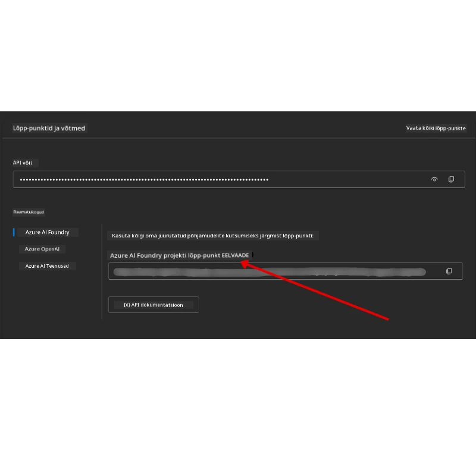

# Kursuse seadistamine

## Sissejuhatus

Selles õppetükis käsitletakse, kuidas käivitada selle kursuse koodinäiteid.

## Liitu teiste õppijatega ja saa abi

Enne oma repo kloonimist liitu [AI Agents For Beginners Discord kanali](https://aka.ms/ai-agents/discord) abil, et saada abi seadistamisel, vastuseid kursusega seotud küsimustele või ühendust teiste õppijatega.

## Klooni või tee selle repoga Fork

Selleks, et alustada, palun klooni või tee GitHubi repositooriumist fork. See loob sulle kursuse materjali oma versiooni, et saaksid koodi käivitada, testida ja kohandada!

Seda saab teha, klõpsates lingil <a href="https://github.com/microsoft/ai-agents-for-beginners/fork" target="_blank">forkida repo</a>

Sul peaks nüüd olema oma forkitud kursuse versioon selles järgnevast lingist:


### Pealiskaudne kloon (soovitatav töötubade / Codespaces jaoks)

 > Täielik repositoorium võib olla suur (~3 GB), kui sa alla laed kogu ajaloo ja kõik failid. Kui sa osaled ainult töölaual või vajad vaid mõnda õppetüki kausta, väldib pealiskaudne kloon (või harvaesinev kloon) suurema osa sellest allalaadimisest, lühendades ajalugu ja/või jättes vahele blobid.

#### Kiire pealiskaudne kloon — minimaalne ajalugu, kõik failid

Asenda alltoodud käskudes `<your-username>` oma fork URL-iga (või kui eelistad, upstream URL-iga).

Et kloonida ainult kõige uuemat commit ajalugu (väike allalaadimine):

```bash|powershell
git clone --depth 1 https://github.com/<your-username>/ai-agents-for-beginners.git
```

Et kloonida kindlat haru:

```bash|powershell
git clone --depth 1 --branch <branch-name> https://github.com/<your-username>/ai-agents-for-beginners.git
```

#### Osaline (harvaesinev) kloon — minimaalsete blobide ja valitud kaustadega

See kasutab osalist klooni ja sparse-checkouti (vajab Git 2.25+ ja soovitatav on kaasaegne Git osalise kloonimise toetusega):

```bash|powershell
git clone --depth 1 --filter=blob:none --sparse https://github.com/<your-username>/ai-agents-for-beginners.git
```

Liigu repositooriumi kausta:

```bash|powershell
cd ai-agents-for-beginners
```

Seejärel määra, milliseid kaustu soovid (alltoodud näites on kaks kausta):

```bash|powershell
git sparse-checkout set 00-course-setup 01-intro-to-ai-agents
```

Pärast kloonimist ja failide kontrollimist, kui vajad vaid faile ja soovid ruumi vabastada (ilma git ajaloo väärtuseta), palun kustuta repositooriumi metaandmed (💀 pöördumatu – kaotad kogu Git funktsionaalsuse: ei commit’e, pull’e, push’e ega ajaloo ligipääsu).

```bash
# zsh/bash
rm -rf .git
```

```powershell
# PowerShell
Remove-Item -Recurse -Force .git
```

#### GitHub Codespaces kasutamine (soovitatav suurte kohalike allalaadimiste vältimiseks)

- Loo uus Codespace selle repo jaoks [GitHub UI](https://github.com/codespaces) kaudu.  

- Uue Codespace terminalis käivita üks ülaltoodud pealiskaude/sparse klooni käskudest, et tuua vaid vajaminevad õppetüki kaustad Codespace tööruumi.
- Valikuline: pärast kloonimist Codespace sees eemalda .git, et vabastada lisaruumi (vaata kustutamiskäske ülal).
- Märkus: Kui eelistad avada repo otse Codespaces (ilma lisakloonita), pea meeles, et Codespaces ehitab devcontainer keskkonna ja võib endiselt varustada rohkem, kui sul vaja. Pealiskaudne kloonimine uues Codespace’is annab sulle rohkem kontrolli kettaruumi kasutamise üle.

#### Näpunäited

- Asenda alati kloonimise URL-i oma forkiga, kui soovid muuta/commit’ida.
- Kui hiljem vajad rohkem ajalugu või faile, saad neid tooma hakata või kohandada sparse-checkouti, et lisada täiendavaid kaustu.

## Koodi käivitamine

See kursus pakub mitmeid Jupyteri märkmikke, mida saad kasutada praktilise kogemuse saamiseks AI agentide loomisel.

Koodinäited kasutavad **Microsoft Agent Framework’i (MAF)** koos `AzureAIProjectAgentProvider`-ga, mis ühendub **Azure AI Agent Service V2** (Responses API) kaudu **Microsoft Foundry-ga**.

Kõik Python märkmikud on märgistatud kui `*-python-agent-framework.ipynb`.

## Nõuded

- Python 3.12+
  - **MÄRKUS**: Kui sul pole Python3.12 installitud, siis paigalda see kindlasti. Seejärel loo oma venv, kasutades python3.12, et tagada õigete versioonide paigaldamine requirements.txt failist.
  
    >Näide

    Loo Python venv kataloog:

    ```bash|powershell
    python -m venv venv
    ```

    Seejärel aktiveeri venv keskkond:

    ```bash
    # zsh/bash
    source venv/bin/activate
    ```
  
    ```dos
    # Command Prompt for Windows
    venv\Scripts\activate
    ```

- .NET 10+: .NET põhiste koodide jaoks veendu, et oled installinud [.NET 10 SDK](https://dotnet.microsoft.com/download/dotnet/10.0) või uuema. Kontrolli paigaldatud .NET SDK versiooni:

    ```bash|powershell
    dotnet --list-sdks
    ```

- **Azure CLI** — Nõutav autentimiseks. Paigalda [aka.ms/installazurecli](https://aka.ms/installazurecli) kaudu.
- **Azure tellimus** — Microsoft Foundry ja Azure AI Agent Service’i juurde pääsemiseks.
- **Microsoft Foundry projekt** — Projekt, millel on kasutusel mudel (nt `gpt-4o`). Vaata allpool [Samm 1](#samm-1-loo-microsoft-foundry-projekt).

Selles repositooriumi juurkataloogis on kaasas `requirements.txt` fail, mis sisaldab kõiki vajalikke Python pakette koodinäidete käivitamiseks.

Neid saab paigaldada, käivitades terminalis repositooriumi juurest järgmise käsu:

```bash|powershell
pip install -r requirements.txt
```

Soovitame luua Python virtuaalse keskkonna, et vältida konflikte ja probleeme.

## VSCode seadistamine

Veendu, et kasutad VSCode’s õiget Python versiooni.


## Microsoft Foundry ja Azure AI Agent Service seadistamine

### Samm 1: Loo Microsoft Foundry projekt

Sulle on vajalik Azure AI Foundry **hub** ja **projekt** koos kasutusele võetud mudeliga, et käivitada märkmikke.

1. Mine lehele [ai.azure.com](https://ai.azure.com) ja logi sisse oma Azure kontoga.
2. Loo **hub** (või kasuta olemasolevat). Võta kokku: [Hub resources overview](https://learn.microsoft.com/azure/ai-foundry/concepts/ai-resources).
3. Hub’i sees loo **projekt**.
4. Vii mudel kasutusele (nt `gpt-4o`) **Models + Endpoints** → **Deploy model** alt.

### Samm 2: Hangi oma projekti lõpp-punkt ja mudeli kasutuselevõtu nimi

Microsoft Foundry portaali projekti lehelt:

- **Project Endpoint** — Mine **Overview** lehele ja kopeeri lõpp-punkti URL.



- **Model Deployment Name** — Mine **Models + Endpoints** juurde, vali oma kasutusele võetud mudel ja pane tähele **Deployment name** (nt `gpt-4o`).

### Samm 3: Logi sisse Azure’i `az login` käsuga

Kõik märkmikud kasutavad autentimiseks **`AzureCliCredential`** — ei ole vaja hallata API võtmeid. Selleks pead olema sisse logitud Azure CLI kaudu.

1. **Paigalda Azure CLI**, kui pole veel olemas: [aka.ms/installazurecli](https://aka.ms/installazurecli)

2. **Logi sisse**:

    ```bash|powershell
    az login
    ```

    Või kui oled kaug- või Codespace keskkonnas ilma brauserita:

    ```bash|powershell
    az login --use-device-code
    ```

3. **Vali oma tellimus**, kui küsitakse — vali see, mis sisaldab sinu Foundry projekti.
4. **Kontrolli**, et oled sisse logitud:

    ```bash|powershell
    az account show
    ```

> **Miks `az login`?** Märkmikud autentivad `AzureCliCredential` abil paketist `azure-identity`. See tähendab, et sinu Azure CLI sessioon pakub tunnuseid — API võtmeid ega saladusi sinu `.env` failis ei ole. See on [turbemenetlus](https://learn.microsoft.com/azure/developer/ai/keyless-connections).

### Samm 4: Loo oma `.env` fail

Kopeeri näidisfail:

```bash
# zsh/bash
cp .env.example .env
```

```powershell
# PowerShell
Copy-Item .env.example .env
```

Ava `.env` ja täida need kaks väärtust:

```env
AZURE_AI_PROJECT_ENDPOINT=https://<your-project>.services.ai.azure.com/api/projects/<your-project-id>
AZURE_AI_MODEL_DEPLOYMENT_NAME=gpt-4o
```

| Muutuja | Kus seda leida |
|----------|-----------------|
| `AZURE_AI_PROJECT_ENDPOINT` | Foundry portaali → su projekt → **Overview** leht |
| `AZURE_AI_MODEL_DEPLOYMENT_NAME` | Foundry portaali → **Models + Endpoints** → su kasutusele võetud mudeli nimi |

See ongi peamine seadistus õppetükkide jaoks! Märkmikud autentivad automaatselt läbi sinu `az login` sessiooni.

### Samm 5: Paigalda Pythoni sõltuvused

```bash|powershell
pip install -r requirements.txt
```

Soovitame seda käivitada oma eelnevalt loodud virtuaalkeskkonnas.

## Täiendav seadistamine õppetüki 5 jaoks (Agentic RAG)

Õppetükk 5 kasutab **Azure AI Search** päringupõhise teksti genereerimise jaoks. Kui plaanid seda õppetükki jooksutada, lisa need muutujad oma `.env` faili:

| Muutuja | Kus seda leida |
|----------|-----------------|
| `AZURE_SEARCH_SERVICE_ENDPOINT` | Azure portaali → su **Azure AI Search** ressurss → **Overview** → URL |
| `AZURE_SEARCH_API_KEY` | Azure portaali → su **Azure AI Search** ressurss → **Settings** → **Keys** → peamine administraatori võti |

## Täiendav seadistamine õppetükkide 6 ja 8 jaoks (GitHub mudelid)

Mõned märkmikud õppetükkides 6 ja 8 kasutavad **GitHub Models**'i asemel Azure AI Foundryt. Kui plaanid neid proovida, lisa need muutujad oma `.env` faili:

| Muutuja | Kus seda leida |
|----------|-----------------|
| `GITHUB_TOKEN` | GitHub → **Settings** → **Developer settings** → **Personal access tokens** |
| `GITHUB_ENDPOINT` | Kasuta `https://models.inference.ai.azure.com` (vaikimisi väärtus) |
| `GITHUB_MODEL_ID` | Mudeli nimi, mida kasutada (nt `gpt-4o-mini`) |

## Alternatiivne pakkuja: MiniMax (OpenAI ühilduv)

[MiniMax](https://platform.minimaxi.com/) pakub suure konteksti mudeleid (kuni 204K tokenit) OpenAI-ühilduva API kaudu. Kuna Microsoft Agent Framework’i `OpenAIChatClient` töötab mis tahes OpenAI-ühilduva lõpp-punktiga, võid MiniMax’i kasutada GitHub Models või OpenAI asemel.

Lisa need muutujad oma `.env` faili:

| Muutuja | Kus seda leida |
|----------|-----------------|
| `MINIMAX_API_KEY` | [MiniMax platvorm](https://platform.minimaxi.com/) → API võtmed |
| `MINIMAX_BASE_URL` | Kasuta `https://api.minimax.io/v1` (vaikimisi väärtus) |
| `MINIMAX_MODEL_ID` | Mudeli nimi, mida kasutada (nt `MiniMax-M2.7`) |

**Saadaval mudelid**: `MiniMax-M2.7` (soovitatav), `MiniMax-M2.7-highspeed` (kiirem vastus)

Koodinäited, mis kasutavad `OpenAIChatClient` (nt õppetükk 14 hotelli broneerimise töövoog), tuvastavad automaatselt ja kasutavad sinu MiniMax seadistust, kui `MINIMAX_API_KEY` on määratud.

## Täiendav seadistamine õppetüki 8 jaoks (Bing grounding töövoog)

Õppetüki 8 tingimuslik töövoog kasutab **Bing grounding** Azure AI Foundry kaudu. Kui plaanid seda proovida, lisa see muutuja oma `.env` faili:

| Muutuja | Kus seda leida |
|----------|-----------------|
| `BING_CONNECTION_ID` | Azure AI Foundry portaal → su projekt → **Management** → **Connected resources** → sinu Bing ühendus → kopeeri ühenduse ID |

## Tõrkeotsing

### SSL sertifikaadi valideerimise vead macOS-is

Kui kasutad macOS-i ja saad veateate nagu:

```plaintext
ssl.SSLCertVerificationError: [SSL: CERTIFICATE_VERIFY_FAILED] certificate verify failed: self-signed certificate in certificate chain
```

See on tuntud probleem Pythoniga macOS-is, kus süsteemi SSL-sertifikaate ei usaldata automaatselt. Proovi järgmisi lahendusi järjekorras:

**Variant 1: Käivita Python Install Certificates skript (soovitatav)**

```bash
# Asenda 3.XX oma paigaldatud Pythoni versiooniga (nt 3.12 või 3.13):
/Applications/Python\ 3.XX/Install\ Certificates.command
```

**Variant 2: Kasuta `connection_verify=False` oma märkmikus (ainult GitHub Models näidete jaoks)**

Õppetüki 6 märkmikus (`06-building-trustworthy-agents/code_samples/06-system-message-framework.ipynb`) on juba kommentaariga lahendus olemas. Eemalda kommentaar `connection_verify=False` kasutamisel kliendi loomisel:

```python
client = ChatCompletionsClient(
    endpoint=endpoint,
    credential=AzureKeyCredential(token),
    connection_verify=False,  # Keela SSL-i kontroll, kui tekivad sertifikaadivead
)
```

> **⚠️ Märkus:** SSL valideerimise keelamine (`connection_verify=False`) vähendab turvalisust, jättes sertifikaatide valideerimise vahele. Kasuta seda ainult ajutise lahendusena arenduskeskkonnas, mitte kunagi tootmises.

**Variant 3: Paigalda ja kasuta `truststore`-i**

```bash
pip install truststore
```

Lisa seejärel see rida märkmiku või skripti algusesse enne võrgukõnesid:

```python
import truststore
truststore.inject_into_ssl()
```

## Jääd kuskile hätta?

Kui sul on mingeid probleeme seadistuse käivitamisel, liitu meiega <a href="https://discord.gg/kzRShWzttr" target="_blank">Azure AI Community Discord'is</a> või <a href="https://github.com/microsoft/ai-agents-for-beginners/issues?WT.mc_id=academic-105485-koreyst" target="_blank">loo probleemiteade</a>.

## Järgmine õppetükk

Oled nüüd valmis selle kursuse koodi käivitama. Head õppimist ja avastamist AI agentide maailmas!

[Tutvustus AI agentidele ja agentide kasutusjuhtumitele](../01-intro-to-ai-agents/README.md)

---

<!-- CO-OP TRANSLATOR DISCLAIMER START -->
**Vastutusest loobumine**:  
See dokument on tõlgitud, kasutades tehisintellekti tõlketeenust [Co-op Translator](https://github.com/Azure/co-op-translator). Kuigi püüame täpsust, olge teadlikud, et automaatsed tõlked võivad sisaldada vigu või ebatäpsusi. Originaaldokument selle emakeeles tuleks pidada autoriteetseks allikaks. Olulise info puhul soovitatakse professionaalset inimtõlget. Me ei vastuta mõistete vale tõlgendamise või valesti mõistmise eest, mis võivad sellest tõlkest tuleneda.
<!-- CO-OP TRANSLATOR DISCLAIMER END -->