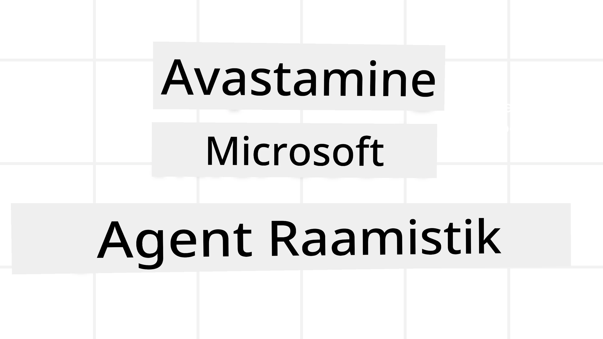
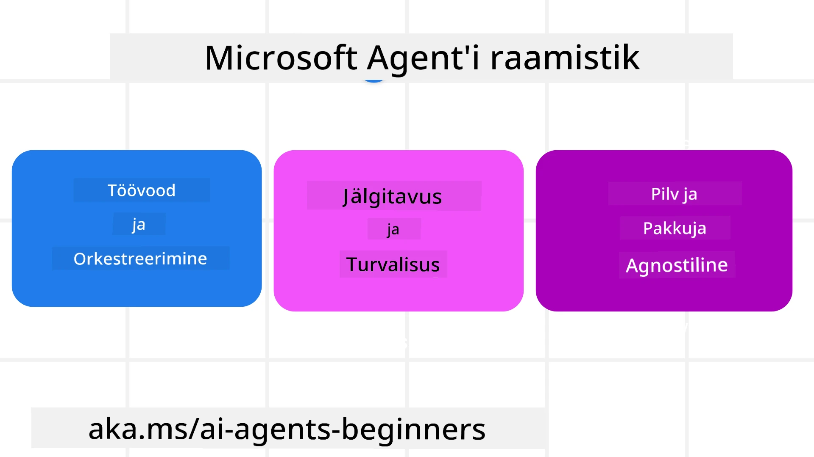
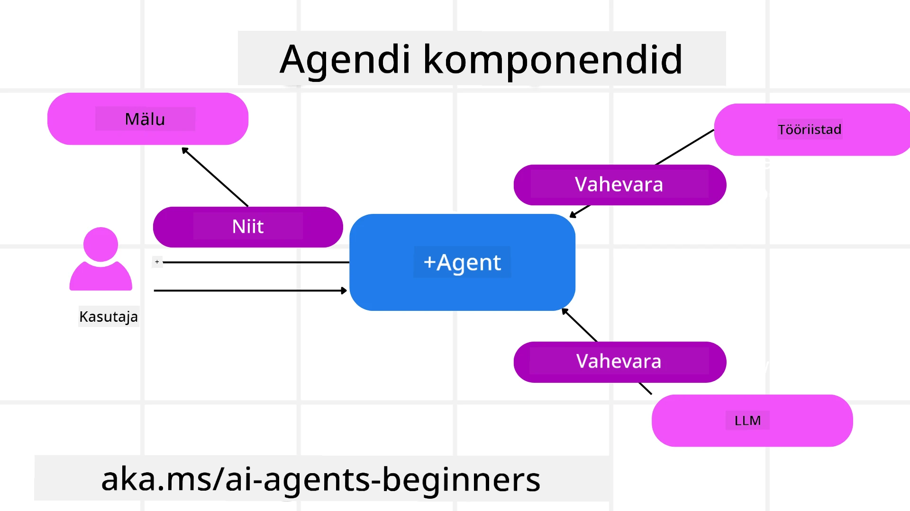

# Microsoft Agent Frameworki uurimine



### Sissejuhatus

Selles õppetükis käsitletakse:

- Microsoft Agent Frameworki mõistmine: peamised omadused ja väärtus  
- Microsoft Agent Frameworki peamiste kontseptsioonide uurimine
- Täiustatud MAF musterid: töövood, vahevara ja mälu

## Õpieesmärgid

Pärast selle õppetüki läbimist oskad:

- Luua tootmisvalmis tehisintellekti agente, kasutades Microsoft Agent Frameworki
- Rakendada Microsoft Agent Frameworki põhiomadusi oma agentuursetes kasutusjuhtudes
- Kasutada täiustatud mustreid, sealhulgas töövooge, vahevara ja jälgitavust

## Koodinäited

Microsoft Agent Frameworki (MAF) koodinäited on selle hoidla failides `xx-python-agent-framework` ja `xx-dotnet-agent-framework`.

## Microsoft Agent Frameworki mõistmine



[Microsoft Agent Framework (MAF)](https://aka.ms/ai-agents-beginners/agent-framewrok) on Microsofti ühtne raamistik tehisintellekti agentide loomiseks. See pakub paindlikkust erinevate agentuursete kasutusjuhtude lahendamiseks nii tootmiskeskkonnas kui uurimises, sealhulgas:

- **Järjestikune agente orkestreerimine** olukordades, kus on vaja samm-sammult töövoogusid.
- **Samal ajal toimuv orkestreerimine** olukordades, kus agentidel tuleb ülesandeid korraga täita.
- **Rühma vestluse orkestreerimine** olukordades, kus agentidel on võimalik ühel ülesandel koos töötada.
- **Üleandmise orkestreerimine** olukordades, kus agentide vahel antakse ülesande erinevad alamtööülesanded pärast nende lõpetamist üle.
- **Magnetiline orkestreerimine** olukordades, kus juhendav agent loob ja muudab ülesannete nimekirja ning koordineerib alamagente ülesande täitmiseks.

Tehisintellekti agentide tootmisse toomiseks on MAF sisaldanud ka funktsioone:

- **Jälgitavus** OpenTelemetry kasutamise kaudu, kus iga AI agendi tegevus, kaasa arvatud tööriistade kutsumine, orkestreerimise sammud, mõttekäigud ja jõudluse jälgimine Microsoft Foundry armatuurlaual, on jälgitav.
- **Turvalisus** natiivse Microsoft Foundrys agentide majutamise kaudu, mis sisaldab rollipõhise juurdepääsu, privaatsete andmete käsitluse ja sisukaitse sisseehitatud turvakontrolle.
- **Vastupidavus** – agentide lõimed ja töövood võivad peatuda, jätkuda ja vigadest taastuda, võimaldades pikemaajalisi protsesse.
- **Juhitavus** – inimeste kaasamise töövood on toetatud, kus ülesanded märgitakse inimese kinnitust vajavateks.

Microsoft Agent Framework keskendub ka koostalitlusvõimele, olles:

- **Pilve sõltumatu** – agente saab käivitada konteinerites, kohapeal ja mitmel pilveplatvormil.
- **Teenusepakkuja sõltumatu** – agente saab luua eelistatud SDKga, sh Azure OpenAI ja OpenAI abil.
- **Avatud standardite integreeriv** – agentidel on võimalik kasutada protokolle nagu Agent-to-Agent (A2A) ja Model Context Protocol (MCP, mudeli konteksti protokoll), et avastada ja kasutada teisi agente ja tööriistu.
- **Pluginate ja ühenduste tugi** – võimalik luua ühendusi andmete ja mäluteenustega nagu Microsoft Fabric, SharePoint, Pinecone ja Qdrant.

Vaatame, kuidas neid omadusi rakendatakse Microsoft Agent Frameworki põhikontseptsioonides.

## Microsoft Agent Frameworki põhikontseptsioonid

### Agendid



**Agentide loomine**

Agentide loomine toimub tuletamisteenuse (LLM pakkumise teenus) määratlemise, AI agendile järgimiseks mõeldud juhiste ja määratud `nime` kaudu:

```python
agent = AzureOpenAIChatClient(credential=AzureCliCredential()).create_agent( instructions="You are good at recommending trips to customers based on their preferences.", name="TripRecommender" )
```

Ülaltoodud on kasutatud `Azure OpenAI`, kuid agente saab luua ka mitme teenuse abil, sh `Microsoft Foundry Agent Service`:

```python
AzureAIAgentClient(async_credential=credential).create_agent( name="HelperAgent", instructions="You are a helpful assistant." ) as agent
```

OpenAI `Responses`, `ChatCompletion` API-d

```python
agent = OpenAIResponsesClient().create_agent( name="WeatherBot", instructions="You are a helpful weather assistant.", )
```

```python
agent = OpenAIChatClient().create_agent( name="HelpfulAssistant", instructions="You are a helpful assistant.", )
```

või [MiniMax](https://platform.minimaxi.com/), mis pakub OpenAI-ga ühilduvat API-d suurte kontekstiakendustega (kuni 204K tokenit):

```python
agent = OpenAIChatClient(base_url="https://api.minimax.io/v1", api_key=os.environ["MINIMAX_API_KEY"], model_id="MiniMax-M2.7").create_agent( name="HelpfulAssistant", instructions="You are a helpful assistant.", )
```

või kaugarentide puhul A2A protokolli abil:

```python
agent = A2AAgent( name=agent_card.name, description=agent_card.description, agent_card=agent_card, url="https://your-a2a-agent-host" )
```

**Agentide käivitamine**

Agente käivitatakse `.run` või `.run_stream` meetoditega, vastavalt voogedastuse või mitte-voogedastuse vastuste saamiseks.

```python
result = await agent.run("What are good places to visit in Amsterdam?")
print(result.text)
```

```python
async for update in agent.run_stream("What are the good places to visit in Amsterdam?"):
    if update.text:
        print(update.text, end="", flush=True)

```

Igal agendi jooksul on lisaks valikud, millega saab kohandada parameetreid nagu agendi kasutatavad `max_tokens`, tööriistad (`tools`), mida agent saab kutsuda, ja isegi agendi kasutatav `mudel`.

See on kasulik olukordades, kus konkreetseid mudeleid või tööriistu on kasutaja ülesande täitmiseks vaja.

**Tööriistad**

Tööriistad saab määratleda nii agendi loomisel:

```python
def get_attractions( location: Annotated[str, Field(description="The location to get the top tourist attractions for")], ) -> str: """Get the top tourist attractions for a given location.""" return f"The top attractions for {location} are." 


# ChatAgendi otse loomisel

agent = ChatAgent( chat_client=OpenAIChatClient(), instructions="You are a helpful assistant", tools=[get_attractions]

```

kui ka agenti käivitades:

```python

result1 = await agent.run( "What's the best place to visit in Seattle?", tools=[get_attractions] # Tööriist on mõeldud ainult selleks käivitamiseks )
```

**Agendi lõimed**

Agendi lõimesid kasutatakse mitmekäiguliste vestluste haldamiseks. Lõimesid saab luua:

- Kasutades `get_new_thread()`, mis võimaldab lõime aja jooksul salvestada
- Automaatse lõime loomine agendi käivitamisel, kus lõim kestab vaid jooksu ajal.

Lõime loomiseks näeb kood välja nii:

```python
# Loo uus lõim.
thread = agent.get_new_thread() # Käivita agent lõimiga.
response = await agent.run("Hello, I am here to help you book travel. Where would you like to go?", thread=thread)

```

Seejärel saab lõime serialiseerida hilisemaks kasutamiseks:

```python
# Loo uus lõim.
thread = agent.get_new_thread() 

# Käivita agent lõimuga.

response = await agent.run("Hello, how are you?", thread=thread) 

# Seerialiseeri lõim salvestamiseks.

serialized_thread = await thread.serialize() 

# Deserialiseeri lõime olek pärast laadimist salvestusest.

resumed_thread = await agent.deserialize_thread(serialized_thread)
```

**Agendi vahevara**

Agendid suhtlevad tööriistade ja LLMidega kasutaja ülesannete täitmiseks. Mõnel juhul soovime tegevusi või jälgimist nendevaheliste suhtluste ajal. Agentide vahevara võimaldab seda läbi:

*Funktsiooni vahevara*

See vahevara võimaldab tegevuse täitmist agendi ja funktsiooni/tööriista vahel, mida agent kutsub. Näiteks võib seda kasutada funktsioonikõnede logimiseks.

Allolevas koodis määrab `next`, kas kutsutakse järgmine vahevara või tegelik funktsioon.

```python
async def logging_function_middleware(
    context: FunctionInvocationContext,
    next: Callable[[FunctionInvocationContext], Awaitable[None]],
) -> None:
    """Function middleware that logs function execution."""
    # Eeltöötlemine: Logi enne funktsiooni täitmist
    print(f"[Function] Calling {context.function.name}")

    # Jätka järgmise vahemooduli või funktsiooni täitmisega
    await next(context)

    # Järelkäsitlus: Logi pärast funktsiooni täitmist
    print(f"[Function] {context.function.name} completed")
```

*Vestluse vahevara*

See vahevara võimaldab tegevuse täitmist või logimist agendi ja LLM vaheliste päringute vahel.

See sisaldab olulist teavet, nagu agendile saadetavad `messages`.

```python
async def logging_chat_middleware(
    context: ChatContext,
    next: Callable[[ChatContext], Awaitable[None]],
) -> None:
    """Chat middleware that logs AI interactions."""
    # Eeltöötlus: Logi enne tehisintellekti kõnet
    print(f"[Chat] Sending {len(context.messages)} messages to AI")

    # Jätka järgmise vahevara või tehisintellekti teenuse juurde
    await next(context)

    # Järelhooldus: Logi pärast tehisintellekti vastust
    print("[Chat] AI response received")

```

**Agendi mälu**

Nagu on käsitletud `Agentic Memory` õppetükis, on mälu oluline, et agent saaks toimida erinevates kontekstides. MAF pakub mitut erinevat mälu tüüpi:

*Mälus ringi salvestus*

See on mälu, mis salvestatakse lõimedes rakenduse käivitamise ajal.

```python
# Loo uus lõim.
thread = agent.get_new_thread() # Käivita agent lõimega.
response = await agent.run("Hello, I am here to help you book travel. Where would you like to go?", thread=thread)
```

*Pidevad sõnumid*

Seda mälu kasutatakse vestluste ajaloo salvestamiseks erinevate sessioonide vahel. See on määratletud kasutades `chat_message_store_factory`:

```python
from agent_framework import ChatMessageStore

# Loo kohandatud sõnumite hoidla
def create_message_store():
    return ChatMessageStore()

agent = ChatAgent(
    chat_client=OpenAIChatClient(),
    instructions="You are a Travel assistant.",
    chat_message_store_factory=create_message_store
)

```

*Dünaamiline mälu*

See mälu lisatakse konteksti enne agentide käivitamist. Seda mälu saab salvestada ka välismälu teenustesse nagu mem0:

```python
from agent_framework.mem0 import Mem0Provider

# Mem0 kasutamine täiustatud mäluvõimaluste jaoks
memory_provider = Mem0Provider(
    api_key="your-mem0-api-key",
    user_id="user_123",
    application_id="my_app"
)

agent = ChatAgent(
    chat_client=OpenAIChatClient(),
    instructions="You are a helpful assistant with memory.",
    context_providers=memory_provider
)

```

**Agendi jälgitavus**

Jälgitavus on oluline usaldusväärsete ja hooldatavate agentuuri süsteemide ülesehitamiseks. MAF integreerub OpenTelemetryga, pakkudes jälgimist ja mõõtureid parema jälgitavuse saavutamiseks.

```python
from agent_framework.observability import get_tracer, get_meter

tracer = get_tracer()
meter = get_meter()
with tracer.start_as_current_span("my_custom_span"):
    # tee midagi
    pass
counter = meter.create_counter("my_custom_counter")
counter.add(1, {"key": "value"})
```

### Töövood

MAF pakub töövooge, mis on eelmääratletud sammud ülesande täitmiseks, ja sisaldavad AI agente nendes sammudes.

Töövood koosnevad erinevatest komponentidest, mis võimaldavad paremat kontrolli. Töövood toetavad ka **mitme agendi orkestreerimist** ja **töövoo seisundite salvestamist (checkpointing)**.

Töövoo põhikomponendid on:

**Täitjad**

Täitjad saavad sisendsõnumeid, täidavad neile määratud ülesandeid ja annavad seejärel välja väljundisõnumi. See liigutab töövoogu suurema ülesande täitmise suunas. Täitjad võivad olla kas AI agent või kohandatud loogika.

**Suunad**

Suunad määratlevad töövoos sõnumite voolu. Need võivad olla:

*Otseühendused* - lihtsad ühe-ühele ühendused täitjate vahel:

```python
from agent_framework import WorkflowBuilder

builder = WorkflowBuilder()
builder.add_edge(source_executor, target_executor)
builder.set_start_executor(source_executor)
workflow = builder.build()
```

*Tingimuslikud ühendused* - aktiveeruvad teatud tingimuse täitmisel. Näiteks kui hotellitube pole saadaval, saab täitja pakkuda muid valikuid.

*Vahetus-tingimus ühendused* - suunavad sõnumeid erinevatele täitjatele vastavalt määratletud tingimustele. Näiteks kui reisikülastajal on prioriteetne ligipääs, käsitletakse tema ülesandeid läbi teise töövoo.

*Laiendusühendused* - saadavad ühe sõnumi mitmele sihtmärgile.

*Kogumisühendused* - koguvad sõnumeid eri täitjatelt ja saadavad ühe sihtmärgi poole.

**Sündmused**

Paremaks jälgitavuseks pakub MAF töövoo käitusündmusi, sealhulgas:

- `WorkflowStartedEvent` – töövoo käivitamine algab
- `WorkflowOutputEvent` – töövoog toodab väljundi
- `WorkflowErrorEvent` – töövoos esineb viga
- `ExecutorInvokeEvent` – täitja alustab töötlemist
- `ExecutorCompleteEvent` – täitja lõpetab töötlemise
- `RequestInfoEvent` – päring esitatakse

## Täiustatud MAF mustrid

Ülaltoodud jaotised käsitlesid Microsoft Agent Frameworki põhikontseptsioone. Kui ehitad keerukamaid agente, siis tasub kaaluda järgmisi täiustatud mustreid:

- **Vahevara kompositsioon**: Kettideks kombineeri mitu vahevara töötlejat (logimine, autentimine, kiirusepiirangud) funktsiooni- ja vestlusvahevara abil, et saavutada detailne kontroll agendi käitumise üle.
- **Töövoo seisundite salvestamine**: Kasuta töövoo sündmusi ja serialiseerimist pikkade agentide protsesside salvestamiseks ja jätkamiseks.
- **Dünaamiline tööriista valik**: Võta kasutusele RAG tööriistade kirjelduste peal, kombineerituna MAF tööriistade registreerimisega, et esitada päringu kohta ainult asjakohaseid tööriistu.
- **Mitme agendi üleandmine**: Kasuta töövoo ühendusi ja tingimuslikke marsruute spetsialiseerunud agentide vaheliseks ülesannete üleandmiseks.

## Koodinäited

Microsoft Agent Frameworki koodinäited on selle hoidla failides `xx-python-agent-framework` ja `xx-dotnet-agent-framework`.

## Kas sul on Microsoft Agent Frameworki kohta rohkem küsimusi?

Liitu [Microsoft Foundry Discordiga](https://aka.ms/ai-agents/discord), et kohtuda teiste õppijatega, osaleda konsultaatioaegadel ja saada vastused oma tehisintellekti agentide küsimustele.

---

<!-- CO-OP TRANSLATOR DISCLAIMER START -->
**Vastutusest vabastamine**:  
See dokument on tõlgitud kasutades tehisintellektil põhinevat tõlketeenust [Co-op Translator](https://github.com/Azure/co-op-translator). Kuigi püüame täpsust, tuleb arvestada, et automatiseeritud tõlked võivad sisaldada vigu või ebatäpsusi. Originaaldokument selle algkeeles tuleks pidada autoriteetseks allikaks. Kriitilise teabe puhul soovitatakse kasutada professionaalset inimtõlget. Me ei vastuta tõrgete ega arusaamatuste eest, mis võivad sellest tõlkest tuleneda.
<!-- CO-OP TRANSLATOR DISCLAIMER END -->