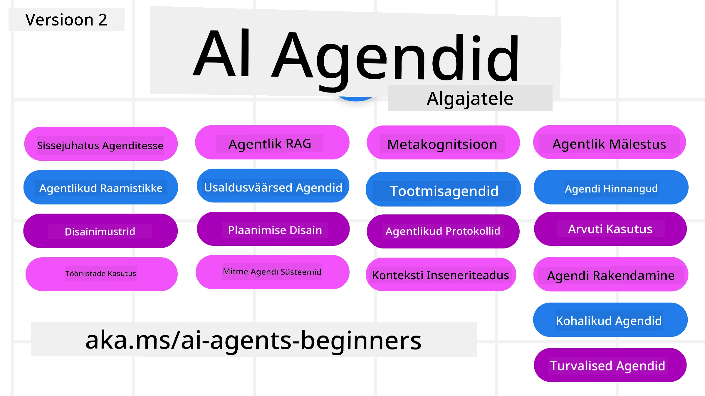

# AI agendid algajatele - Kursus



## Kursus, mis õpetab kõike, mida pead teadma, et alustada AI agentide loomist

[](https://github.com/microsoft/ai-agents-for-beginners/blob/master/LICENSE?WT.mc_id=academic-105485-koreyst)
[](https://GitHub.com/microsoft/ai-agents-for-beginners/graphs/contributors/?WT.mc_id=academic-105485-koreyst)
[](https://GitHub.com/microsoft/ai-agents-for-beginners/issues/?WT.mc_id=academic-105485-koreyst)
[](https://GitHub.com/microsoft/ai-agents-for-beginners/pulls/?WT.mc_id=academic-105485-koreyst)
[](http://makeapullrequest.com?WT.mc_id=academic-105485-koreyst)

### 🌐 Mitmekeelne tugi

#### Toetatud GitHub Actionsi kaudu (automaatne ja alati ajakohane)

<!-- CO-OP TRANSLATOR LANGUAGES TABLE START -->
[Araabia](../ar/README.md) | [Bengali](../bn/README.md) | [Bulgaaria](../bg/README.md) | [Burma (Myanmar)](../my/README.md) | [Hiina (lihtsustatud)](../zh-CN/README.md) | [Hiina (traditsiooniline, Hongkong)](../zh-HK/README.md) | [Hiina (traditsiooniline, Macau)](../zh-MO/README.md) | [Hiina (traditsiooniline, Taiwan)](../zh-TW/README.md) | [Horvaadi](../hr/README.md) | [Tšehhi](../cs/README.md) | [Taani](../da/README.md) | [Hollandi](../nl/README.md) | [Eesti](./README.md) | [Soome](../fi/README.md) | [Prantsuse](../fr/README.md) | [Saksa](../de/README.md) | [Kreeka](../el/README.md) | [Heebrea](../he/README.md) | [Hindi](../hi/README.md) | [Ungari](../hu/README.md) | [Indoneesia](../id/README.md) | [Itaalia](../it/README.md) | [Jaapani](../ja/README.md) | [Kannada](../kn/README.md) | [Khmeeri](../km/README.md) | [Korea](../ko/README.md) | [Leedu](../lt/README.md) | [Malai](../ms/README.md) | [Malajalami](../ml/README.md) | [Marathi](../mr/README.md) | [Nepali](../ne/README.md) | [Nigeeria pidžin](../pcm/README.md) | [Norra](../no/README.md) | [Pärsia (Farsi)](../fa/README.md) | [Poola](../pl/README.md) | [Portugali (Brasiilia)](../pt-BR/README.md) | [Portugali (Portugal)](../pt-PT/README.md) | [Pändžabi (Gurmukhi)](../pa/README.md) | [Rumeenia](../ro/README.md) | [Vene](../ru/README.md) | [Serbia (kirilitsa)](../sr/README.md) | [Slovaki](../sk/README.md) | [Sloveeni](../sl/README.md) | [Hispaania](../es/README.md) | [Suahiili](../sw/README.md) | [Rootsi](../sv/README.md) | [Tagalogi (Filipiinid)](../tl/README.md) | [Tamili](../ta/README.md) | [Telugu](../te/README.md) | [Tai](../th/README.md) | [Türgi](../tr/README.md) | [Ukraina](../uk/README.md) | [Urdu](../ur/README.md) | [Vietnami](../vi/README.md)

> **Eelistad kloonida lokaalselt?**
>
> See hoidla sisaldab rohkem kui 50 keele tõlget, mis suurendab oluliselt allalaadimise mahtu. Tõlgeteta kloonimiseks kasuta sparsilist laadimist:
>
> **Bash / macOS / Linux:**
> ```bash
> git clone --filter=blob:none --sparse https://github.com/microsoft/ai-agents-for-beginners.git
> cd ai-agents-for-beginners
> git sparse-checkout set --no-cone '/*' '!translations' '!translated_images'
> ```
>
> **CMD (Windows):**
> ```cmd
> git clone --filter=blob:none --sparse https://github.com/microsoft/ai-agents-for-beginners.git
> cd ai-agents-for-beginners
> git sparse-checkout set --no-cone "/*" "!translations" "!translated_images"
> ```
>
> See annab sulle kõik vajaliku kursuse läbimiseks palju kiiremalt.
<!-- CO-OP TRANSLATOR LANGUAGES TABLE END -->

**Kui soovid, et toetataks täiendavaid tõlkekeeli, on need loetletud [siin](https://github.com/Azure/co-op-translator/blob/main/getting_started/supported-languages.md)**

[](https://GitHub.com/microsoft/ai-agents-for-beginners/watchers/?WT.mc_id=academic-105485-koreyst)
[](https://GitHub.com/microsoft/ai-agents-for-beginners/network/?WT.mc_id=academic-105485-koreyst)
[](https://GitHub.com/microsoft/ai-agents-for-beginners/stargazers/?WT.mc_id=academic-105485-koreyst)

[](https://discord.gg/nTYy5BXMWG)


## 🌱 Alustamine

See kursus sisaldab tunde, mis käsitlevad AI agentide loomise põhialuseid. Iga tund keskendub oma teemale, nii et alusta sealt, kus soovid!

Sellel kursusel on mitmekeelne tugi. Vaata meie [saadaval olevaid keeli siin](#-mitmekeelne-tugi).

Kui see on sinu esimene kord generatiivsete AI mudelitega töötamisel, vaata meie [Generative AI For Beginners](https://aka.ms/genai-beginners) kursust, mis sisaldab 21 õppetundi GenAI-ga töötamise kohta.

Ära unusta [tähistada (🌟) seda repositorumit](https://docs.github.com/en/get-started/exploring-projects-on-github/saving-repositories-with-stars?WT.mc_id=academic-105485-koreyst) ja [forkida see repo](https://github.com/microsoft/ai-agents-for-beginners/fork), et käivitada koodi.

### Kohtu teiste õppijatega, saa vastused oma küsimustele

Kui jääd kinni või sul on küsimusi AI agentide loomise kohta, liitu meie pühendatud Discord kanaliga [Microsoft Foundry Discordis](https://aka.ms/ai-agents/discord).

### Mida sul on vaja 

Igas selle kursuse tunnis on koodinäited, mis asuvad kaustas code_samples. Sa võid [forkida selle repo](https://github.com/microsoft/ai-agents-for-beginners/fork), et luua oma koopia.

Nendes harjutustes olev kood kasutab Microsoft Agent Frameworki koos Azure AI Foundry Agent Service V2-ga:

- [Microsoft Foundry](https://aka.ms/ai-agents-beginners/ai-foundry) - nõuab Azure kontot

See kursus kasutab Microsofti järgmisi AI agendi raamistikke ja teenuseid:

- [Microsoft Agent Framework (MAF)](https://aka.ms/ai-agents-beginners/agent-framewrok)
- [Azure AI Foundry Agent Service V2](https://aka.ms/ai-agents-beginners/ai-agent-service)

Mõned koodinäited toetavad ka alternatiivseid OpenAI-ühilduvaid pakkujaid, nagu [MiniMax](https://platform.minimaxi.com/), mis pakub suure konteksti mudeleid (kuni 204K tokenit). Konfiguratsiooni üksikasjad on kursuse seadistuses: [Course Setup](./00-course-setup/README.md).

Koodi käivitamise kohta selle kursuse jaoks vaata [Course Setup](./00-course-setup/README.md).

## 🙏 Tahad aidata?

Kas sul on ettepanekuid või oled leidnud kirjavigu või koodivigu? [Esita probleem](https://github.com/microsoft/ai-agents-for-beginners/issues?WT.mc_id=academic-105485-koreyst) või [Loo pull request](https://github.com/microsoft/ai-agents-for-beginners/pulls?WT.mc_id=academic-105485-koreyst)


## 📂 Iga tund sisaldab

- Kirjalikku õppetundi README-s ja lühikest videot
- Python koodinäiteid, kasutades Microsoft Agent Frameworki koos Azure AI Foundryga
- Lingid lisamaterjalidele, et jätkata õppimist


## 🗃️ Tunnid

| **Tund**                                    | **Tekst ja kood**                                   | **Video**                                                 | **Lisalugemine**                                                                        |
|---------------------------------------------|----------------------------------------------------|-----------------------------------------------------------|----------------------------------------------------------------------------------------|
| Sissejuhatus AI agentidesse ja nende kasutusjuhtudesse | [Link](./01-intro-to-ai-agents/README.md)          | [Video](https://youtu.be/3zgm60bXmQk?si=z8QygFvYQv-9WtO1) | [Link](https://aka.ms/ai-agents-beginners/collection?WT.mc_id=academic-105485-koreyst) |
| AI agentide raamistikude uurimine           | [Link](./02-explore-agentic-frameworks/README.md)  | [Video](https://youtu.be/ODwF-EZo_O8?si=Vawth4hzVaHv-u0H) | [Link](https://aka.ms/ai-agents-beginners/collection?WT.mc_id=academic-105485-koreyst) |
| AI agentide disainimustrite mõistmine       | [Link](./03-agentic-design-patterns/README.md)     | [Video](https://youtu.be/m9lM8qqoOEA?si=BIzHwzstTPL8o9GF) | [Link](https://aka.ms/ai-agents-beginners/collection?WT.mc_id=academic-105485-koreyst) |
| Tööriistade kasutamise disainimuster         | [Link](./04-tool-use/README.md)                    | [Video](https://youtu.be/vieRiPRx-gI?si=2z6O2Xu2cu_Jz46N) | [Link](https://aka.ms/ai-agents-beginners/collection?WT.mc_id=academic-105485-koreyst) |
| Agentic RAG                                 | [Link](./05-agentic-rag/README.md)                 | [Video](https://youtu.be/WcjAARvdL7I?si=gKPWsQpKiIlDH9A3) | [Link](https://aka.ms/ai-agents-beginners/collection?WT.mc_id=academic-105485-koreyst) |
| Usaldusväärsete AI agentide loomine         | [Link](./06-building-trustworthy-agents/README.md) | [Video](https://youtu.be/iZKkMEGBCUQ?si=jZjpiMnGFOE9L8OK ) | [Link](https://aka.ms/ai-agents-beginners/collection?WT.mc_id=academic-105485-koreyst) |
| Planeerimise disainimuster                    | [Link](./07-planning-design/README.md)             | [Video](https://youtu.be/kPfJ2BrBCMY?si=6SC_iv_E5-mzucnC) | [Link](https://aka.ms/ai-agents-beginners/collection?WT.mc_id=academic-105485-koreyst) |
| Mitmeagendi disainimuster                    | [Link](./08-multi-agent/README.md)                 | [Video](https://youtu.be/V6HpE9hZEx0?si=rMgDhEu7wXo2uo6g) | [Link](https://aka.ms/ai-agents-beginners/collection?WT.mc_id=academic-105485-koreyst) |
| Metakognitsiooni disainimuster                 | [Link](./09-metacognition/README.md)               | [Video](https://youtu.be/His9R6gw6Ec?si=8gck6vvdSNCt6OcF)  | [Link](https://aka.ms/ai-agents-beginners/collection?WT.mc_id=academic-105485-koreyst) |
| AI-agendid tootmises                      | [Link](./10-ai-agents-production/README.md)        | [Video](https://youtu.be/l4TP6IyJxmQ?si=31dnhexRo6yLRJDl)  | [Link](https://aka.ms/ai-agents-beginners/collection?WT.mc_id=academic-105485-koreyst) |
| Agendiprotocolide kasutamine (MCP, A2A ja NLWeb) | [Link](./11-agentic-protocols/README.md)           | [Video](https://youtu.be/X-Dh9R3Opn8)                                 | [Link](https://aka.ms/ai-agents-beginners/collection?WT.mc_id=academic-105485-koreyst) |
| Konteksti inseneritöö AI agentide jaoks            | [Link](./12-context-engineering/README.md)         | [Video](https://youtu.be/F5zqRV7gEag)                                 | [Link](https://aka.ms/ai-agents-beginners/collection?WT.mc_id=academic-105485-koreyst) |
| Agentmäluga haldamine                      | [Link](./13-agent-memory/README.md)     |      [Video](https://youtu.be/QrYbHesIxpw?si=vZkVwKrQ4ieCcIPx)                                                      |                                                                                        |
| Microsoft Agent Frameworki uurimine                         | [Link](./14-microsoft-agent-framework/README.md)                            |                                                            |                                                                                        |
| Arvutikasutuse agentide loomine (CUA)           | [Link](./15-browser-use/README.md)     |                                                            | [Link](https://docs.browser-use.com/examples/templates/playwright-integration)         |
| Skaalautuvate agentide juurutamine                    | Tulekul                            |                                                            |                                                                                        |
| Kohalike AI agentide loomine                     | Tulekul                               |                                                            |                                                                                        |
| AI agentide turvamine                           | Tulekul                               |                                                            |                                                                                        |

## 🎒 Muud kursused

Meie meeskond valmistab sageli ka teisi kursuseid! Vaata:

<!-- CO-OP TRANSLATOR OTHER COURSES START -->
### LangChain
[](https://aka.ms/langchain4j-for-beginners)
[](https://aka.ms/langchainjs-for-beginners?WT.mc_id=m365-94501-dwahlin)
[](https://github.com/microsoft/langchain-for-beginners?WT.mc_id=m365-94501-dwahlin)
---

### Azure / Edge / MCP / Agendid
[](https://github.com/microsoft/AZD-for-beginners?WT.mc_id=academic-105485-koreyst)
[](https://github.com/microsoft/edgeai-for-beginners?WT.mc_id=academic-105485-koreyst)
[](https://github.com/microsoft/mcp-for-beginners?WT.mc_id=academic-105485-koreyst)
[](https://github.com/microsoft/ai-agents-for-beginners?WT.mc_id=academic-105485-koreyst)

---
 
### Generatiivne AI seeria
[](https://github.com/microsoft/generative-ai-for-beginners?WT.mc_id=academic-105485-koreyst)
[-9333EA?style=for-the-badge&labelColor=E5E7EB&color=9333EA)](https://github.com/microsoft/Generative-AI-for-beginners-dotnet?WT.mc_id=academic-105485-koreyst)
[-C084FC?style=for-the-badge&labelColor=E5E7EB&color=C084FC)](https://github.com/microsoft/generative-ai-for-beginners-java?WT.mc_id=academic-105485-koreyst)
[-E879F9?style=for-the-badge&labelColor=E5E7EB&color=E879F9)](https://github.com/microsoft/generative-ai-with-javascript?WT.mc_id=academic-105485-koreyst)

---
 
### Põhioskuste õpe
[](https://aka.ms/ml-beginners?WT.mc_id=academic-105485-koreyst)
[](https://aka.ms/datascience-beginners?WT.mc_id=academic-105485-koreyst)
[](https://aka.ms/ai-beginners?WT.mc_id=academic-105485-koreyst)
[](https://github.com/microsoft/Security-101?WT.mc_id=academic-96948-sayoung)
[](https://aka.ms/webdev-beginners?WT.mc_id=academic-105485-koreyst)
[](https://aka.ms/iot-beginners?WT.mc_id=academic-105485-koreyst)
[](https://github.com/microsoft/xr-development-for-beginners?WT.mc_id=academic-105485-koreyst)

---
 
### Copiloti seeria
[](https://aka.ms/GitHubCopilotAI?WT.mc_id=academic-105485-koreyst)
[](https://github.com/microsoft/mastering-github-copilot-for-dotnet-csharp-developers?WT.mc_id=academic-105485-koreyst)
[](https://github.com/microsoft/CopilotAdventures?WT.mc_id=academic-105485-koreyst)
<!-- CO-OP TRANSLATOR OTHER COURSES END -->

## 🌟 Kogukonna tänud

Täname [Shivam Goyal](https://www.linkedin.com/in/shivam2003/) oluliste koodinäidete panustamise eest, mis demonstreerivad agentlikku RAG-i.

## Panustamine

See projekt ootab panustajaid ja ettepanekuid. Enamik panustusi nõuab, et nõustute
panustaja litsentsilepinguga (Contributor License Agreement, CLA), milles kinnitate, et teil on õigus ja tegelikult annate meile õiguse kasutada teie panust. Lisateabe saamiseks külastage <https://cla.opensource.microsoft.com>.

Kui esitate pulli taotluse, määrab CLA robot automaatselt, kas peate esitama
CLA ja kaunistab PR-i vastavalt (nt seisukontrolli, kommentaar). Lihtsalt järgige roboti juhiseid.
Seda peate tegema vaid üks kord kõigi meie CLA-d nõudvate hoidlate korral.

See projekt on vastu võtnud [Microsofti avatud lähtekoodiga käitumiskoodeksi](https://opensource.microsoft.com/codeofconduct/).
Lisateabe saamiseks vaadake [Käitumiskoodeksi korduma kippuvad küsimused](https://opensource.microsoft.com/codeofconduct/faq/) või võtke ühendust aadressil [opencode@microsoft.com](mailto:opencode@microsoft.com) täiendavate küsimuste või kommentaaride korral.

## Kaubamärgid

See projekt võib sisaldada projektide, toodete või teenuste kaubamärke või logosid. Microsofti
kaubamärkide või logode autoriseeritud kasutamine on tingitud ja peab järgima
[Microsofti kaubamärgi- ja brändijuhiseid](https://www.microsoft.com/legal/intellectualproperty/trademarks/usage/general).
Microsofti kaubamärkide või logode kasutamine selle projekti muudetud versioonides ei tohi põhjustada segadust ega vihjata Microsofti sponsorlusele.
Kolmandate osapoolte kaubamärkide või logode kasutamine allub nende osapoolte poliitikale.

## Abi saamine

Kui takerdute või teil on küsimusi AI-rakenduste loomise kohta, liituge:

[](https://aka.ms/foundry/discord)

Kui teil on toote tagasisidet või vigu arendamise ajal, külastage:

[](https://aka.ms/foundry/forum)

---

<!-- CO-OP TRANSLATOR DISCLAIMER START -->
**Vastutusest loobumine**:  
See dokument on tõlgitud AI tõlketeenuse [Co-op Translator](https://github.com/Azure/co-op-translator) abil. Kuigi me püüdleme täpsuse poole, palun pidage meeles, et automaatsed tõlked võivad sisaldada vigu või ebatäpsusi. Originaaldokument selle algkeeles tuleks lugeda autoriteetseks allikaks. Kriitilise teabe puhul on soovitatav kasutada professionaalset inimtõlget. Me ei vastuta selle tõlke kasutamisest tekkida võivate arusaamatuste või valesti mõistmiste eest.
<!-- CO-OP TRANSLATOR DISCLAIMER END -->