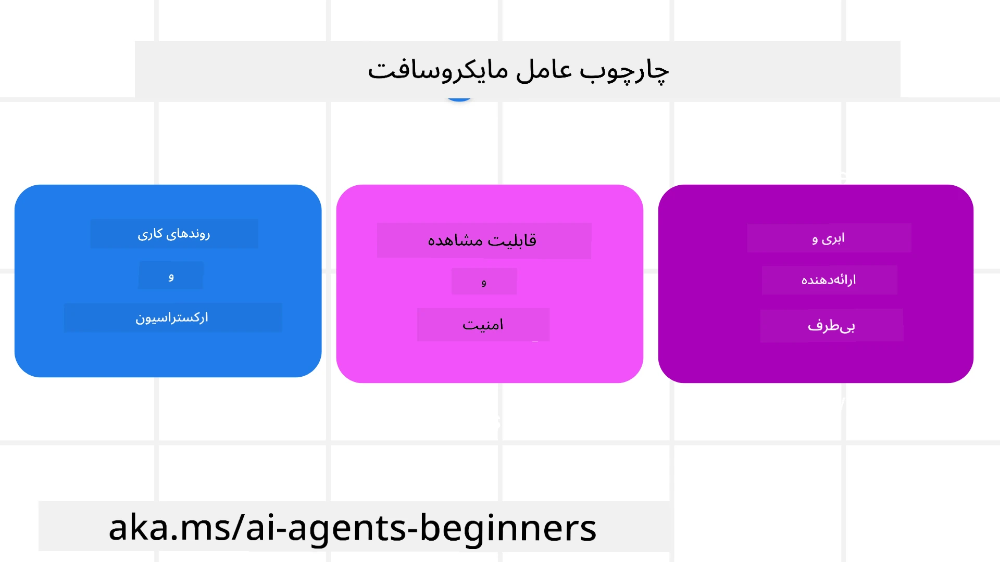

# بررسی چارچوب عامل مایکروسافت


### مقدمه

این درس شامل موارد زیر است:

- درک چارچوب عامل مایکروسافت: ویژگی‌ها و ارزش‌های کلیدی  
- کاوش مفاهیم کلیدی چارچوب عامل مایکروسافت
- الگوهای پیشرفته MAF: گردش کار، واسط‌ها و حافظه

## اهداف یادگیری

پس از اتمام این درس، خواهید دانست چگونه:

- عوامل هوش مصنوعی آماده تولید را با استفاده از چارچوب عامل مایکروسافت بسازید
- ویژگی‌های اصلی چارچوب عامل مایکروسافت را در کاربردهای عاملی خود اعمال کنید
- از الگوهای پیشرفته شامل گردش کار، واسط و قابلیت مشاهده استفاده کنید

## نمونه‌های کد

نمونه‌های کد چارچوب عامل مایکروسافت (MAF) را می‌توانید در این مخزن تحت فایل‌های `xx-python-agent-framework` و `xx-dotnet-agent-framework` بیابید.

## درک چارچوب عامل مایکروسافت



[چارچوب عامل مایکروسافت (MAF)](https://aka.ms/ai-agents-beginners/agent-framewrok) چارچوب یکپارچه مایکروسافت برای ساخت عوامل هوش مصنوعی است. این چارچوب انعطاف‌پذیری لازم برای رسیدگی به انواع مختلف کاربردهای عاملی را که در محیط‌های تولید و تحقیق دیده می‌شود، ارائه می‌دهد، از جمله:

- **هماهنگی توالی‌وار عوامل** در سناریوهایی که گردش‌کار گام به گام لازم است.
- **هماهنگی همزمان** در سناریوهایی که عوامل باید هم‌زمان وظایف را انجام دهند.
- **هماهنگی گفتگوی گروهی** در سناریوهایی که عوامل می‌توانند با هم روی یک وظیفه همکاری کنند.
- **هماهنگی انتقال مسئولیت** در سناریوهایی که عوامل وظیفه را با تکمیل زیروظایف به یکدیگر واگذار می‌کنند.
- **هماهنگی مغناطیسی** در سناریوهایی که یک عامل مدیر لیست وظایفی ایجاد و ویرایش می‌کند و هماهنگی زیراعامل‌ها را برای انجام آن وظیفه بر عهده دارد.

برای ارائه عوامل هوش مصنوعی در تولید، MAF همچنین ویژگی‌هایی برای:

- **قابلیت مشاهده** از طریق استفاده از OpenTelemetry که هر عملی از عامل هوش مصنوعی شامل فراخوانی ابزار، مراحل هماهنگی، جریان‌های استدلال و نظارت عملکرد را از طریق داشبوردهای Microsoft Foundry رهگیری می‌کند.
- **امنیت** با میزبانی بومی عوامل روی Microsoft Foundry که شامل کنترل‌های امنیتی مانند دسترسی مبتنی بر نقش، مدیریت داده‌های خصوصی و ایمنی محتوا داخلی است.
- **دوام** زیرا رشته‌ها و گردش‌های عامل می‌توانند مکث، ادامه و بازیابی از خطاها داشته باشند که امکان فرآیندهای طولانی‌تر را می‌دهد.
- **کنترل** به این صورت که گردش کارهای دارای انسان در حلقه نیز پشتیبانی می‌شوند که در آن وظایف به عنوان نیازمند تأیید انسانی علامت‌گذاری می‌شوند.

چارچوب عامل مایکروسافت همچنین بر قابلیت همکاری تأکید دارد از طریق:

- **بی‌تعلق بودن به ابر خاص** – عوامل می‌توانند در کانتینرها، محیط‌های محلی و چندین ابر مختلف اجرا شوند.
- **بی‌تعلق بودن به ارائه‌دهنده خاص** – عوامل می‌توانند از طریق SDK مورد علاقه شما ایجاد شوند از جمله Azure OpenAI و OpenAI
- **ادغام استانداردهای باز** – عوامل می‌توانند از پروتکل‌هایی مانند Agent-to-Agent (A2A) و Model Context Protocol (MCP) برای کشف و استفاده از دیگر عوامل و ابزارها بهره ببرند.
- **افزونه‌ها و اتصال‌دهنده‌ها** – ارتباطات می‌توانند به سرویس‌های داده و حافظه مانند Microsoft Fabric، SharePoint، Pinecone و Qdrant برقرار شوند.

بیایید ببینیم این ویژگی‌ها چگونه در مفاهیم اصلی چارچوب عامل مایکروسافت اعمال می‌شوند.

## مفاهیم کلیدی چارچوب عامل مایکروسافت

### عوامل


**ایجاد عوامل**

ایجاد عامل با تعریف سرویس استنتاج (ارائه‌دهنده LLM)، مجموعه‌ای از دستورالعمل‌ها برای پیروی عامل هوش مصنوعی، و یک `name` اختصاص یافته انجام می‌شود:

```python
agent = AzureOpenAIChatClient(credential=AzureCliCredential()).create_agent( instructions="You are good at recommending trips to customers based on their preferences.", name="TripRecommender" )
```

بالا از `Azure OpenAI` استفاده شده اما عوامل می‌توانند با استفاده از خدمات متنوعی از جمله `Microsoft Foundry Agent Service` ایجاد شوند:

```python
AzureAIAgentClient(async_credential=credential).create_agent( name="HelperAgent", instructions="You are a helpful assistant." ) as agent
```

OpenAI `Responses`، APIهای `ChatCompletion`

```python
agent = OpenAIResponsesClient().create_agent( name="WeatherBot", instructions="You are a helpful weather assistant.", )
```

```python
agent = OpenAIChatClient().create_agent( name="HelpfulAssistant", instructions="You are a helpful assistant.", )
```

یا [MiniMax](https://platform.minimaxi.com/) که یک API سازگار با OpenAI با پنجره‌های زمینه بزرگ (تا 204K توکن) فراهم می‌کند:

```python
agent = OpenAIChatClient(base_url="https://api.minimax.io/v1", api_key=os.environ["MINIMAX_API_KEY"], model_id="MiniMax-M2.7").create_agent( name="HelpfulAssistant", instructions="You are a helpful assistant.", )
```

یا عوامل از راه دور که از پروتکل A2A استفاده می‌کنند:

```python
agent = A2AAgent( name=agent_card.name, description=agent_card.description, agent_card=agent_card, url="https://your-a2a-agent-host" )
```

**اجرای عوامل**

عوامل با استفاده از متدهای `.run` یا `.run_stream` برای پاسخ‌های غیرجریان یا جریانی اجرا می‌شوند.

```python
result = await agent.run("What are good places to visit in Amsterdam?")
print(result.text)
```

```python
async for update in agent.run_stream("What are the good places to visit in Amsterdam?"):
    if update.text:
        print(update.text, end="", flush=True)

```

هر اجرای عامل همچنین می‌تواند گزینه‌هایی برای شخصی‌سازی پارامترهایی نظیر `max_tokens` که توسط عامل استفاده می‌شود، `tools` که عامل قادر به فراخوانی آن‌ها است، و حتی `model` مورد استفاده برای عامل داشته باشد.

این در مواقعی مفید است که مدل‌ها یا ابزارهای خاصی برای تکمیل وظیفه کاربر ضروری باشند.

**ابزارها**

ابزارها می‌توانند هم هنگام تعریف عامل:

```python
def get_attractions( location: Annotated[str, Field(description="The location to get the top tourist attractions for")], ) -> str: """Get the top tourist attractions for a given location.""" return f"The top attractions for {location} are." 


# هنگام ایجاد مستقیم یک ChatAgent

agent = ChatAgent( chat_client=OpenAIChatClient(), instructions="You are a helpful assistant", tools=[get_attractions]

```

و همچنین هنگام اجرای عامل تعریف شوند:

```python

result1 = await agent.run( "What's the best place to visit in Seattle?", tools=[get_attractions] # ابزار ارائه شده فقط برای این اجرا )
```

**رشته‌های عامل**

رشته‌های عامل برای مدیریت مکالمات چندمرحله‌ای استفاده می‌شوند. رشته‌ها می‌توانند از طریق دو روش ایجاد شوند:

- استفاده از `get_new_thread()` که امکان ذخیره رشته در طول زمان را فراهم می‌کند
- ایجاد خودکار رشته هنگام اجرای عامل که رشته فقط در طول اجرای جاری باقی می‌ماند.

کد ایجاد رشته به این صورت است:

```python
# ایجاد یک رشته جدید.
thread = agent.get_new_thread() # اجرای عامل با رشته.
response = await agent.run("Hello, I am here to help you book travel. Where would you like to go?", thread=thread)

```

سپس می‌توانید رشته را برای استفاده بعدی سریال کنید:

```python
# ایجاد یک نخ جدید.
thread = agent.get_new_thread() 

# اجرای عامل با نخ.

response = await agent.run("Hello, how are you?", thread=thread) 

# سریال‌سازی نخ برای ذخیره‌سازی.

serialized_thread = await thread.serialize() 

# بازسریال‌سازی حالت نخ پس از بارگذاری از ذخیره‌سازی.

resumed_thread = await agent.deserialize_thread(serialized_thread)
```

**واسط عامل**

عوامل برای تکمیل وظایف کاربر با ابزارها و LLMها تعامل دارند. در برخی سناریوها می‌خواهیم بین این تعاملات اجرا یا پیگیری انجام شود. واسط عامل به ما امکان انجام این کار را می‌دهد از طریق:

*واسط عملکرد*

این واسط اجازه می‌دهد عملی بین عامل و تابع/ابزاری که قرار است فراخوانی شود اجرا شود. مثالی از کاربرد این هنگام است که بخواهید لاگ‌برداری از فراخوانی تابع انجام دهید.

در کد زیر `next` تعیین می‌کند که آیا واسط بعدی یا تابع واقعی باید فراخوانی شود.

```python
async def logging_function_middleware(
    context: FunctionInvocationContext,
    next: Callable[[FunctionInvocationContext], Awaitable[None]],
) -> None:
    """Function middleware that logs function execution."""
    # پیش‌پردازش: ثبت لاگ قبل از اجرای تابع
    print(f"[Function] Calling {context.function.name}")

    # ادامه به میدل‌ویر بعدی یا اجرای تابع
    await next(context)

    # پس‌پردازش: ثبت لاگ بعد از اجرای تابع
    print(f"[Function] {context.function.name} completed")
```

*واسط گفتگو*

این واسط اجازه می‌دهد کار یا لاگ‌برداری بین عامل و درخواست‌های بین LLM انجام شود.

این شامل اطلاعات مهمی مانند `messages` است که به سرویس هوش مصنوعی ارسال می‌شوند.

```python
async def logging_chat_middleware(
    context: ChatContext,
    next: Callable[[ChatContext], Awaitable[None]],
) -> None:
    """Chat middleware that logs AI interactions."""
    # پیش‌پردازش: ثبت لاگ قبل از فراخوانی هوش مصنوعی
    print(f"[Chat] Sending {len(context.messages)} messages to AI")

    # ادامه به میان‌افزار یا سرویس هوش مصنوعی بعدی
    await next(context)

    # پس‌پردازش: ثبت لاگ پس از پاسخ هوش مصنوعی
    print("[Chat] AI response received")

```

**حافظه عامل**

همانطور که در درس `Agentic Memory` پوشش داده شد، حافظه عنصر مهمی برای توانمندسازی عامل در کار کردن در زمینه‌های مختلف است. MAF انواع مختلفی از حافظه‌ها را ارائه می‌دهد:

*حافظه درون-رشته‌ای*

این حافظه در طول زمان اجرای برنامه در رشته‌ها ذخیره می‌شود.

```python
# ایجاد یک رشته جدید.
thread = agent.get_new_thread() # اجرای عامل با رشته.
response = await agent.run("Hello, I am here to help you book travel. Where would you like to go?", thread=thread)
```

*پیام‌های پایدار*

این حافظه برای ذخیره سابقه مکالمه در جلسات مختلف استفاده می‌شود. این حافظه با استفاده از `chat_message_store_factory` تعریف می‌شود:

```python
from agent_framework import ChatMessageStore

# ایجاد یک فروشگاه پیام سفارشی
def create_message_store():
    return ChatMessageStore()

agent = ChatAgent(
    chat_client=OpenAIChatClient(),
    instructions="You are a Travel assistant.",
    chat_message_store_factory=create_message_store
)

```

*حافظه پویا*

این حافظه قبل از اجرای عوامل به زمینه اضافه می‌شود. این حافظه‌ها می‌توانند در سرویس‌های خارجی مانند mem0 ذخیره شوند:

```python
from agent_framework.mem0 import Mem0Provider

# استفاده از Mem0 برای قابلیت‌های پیشرفته حافظه
memory_provider = Mem0Provider(
    api_key="your-mem0-api-key",
    user_id="user_123",
    application_id="my_app"
)

agent = ChatAgent(
    chat_client=OpenAIChatClient(),
    instructions="You are a helpful assistant with memory.",
    context_providers=memory_provider
)

```

**قابلیت مشاهده عامل**

قابلیت مشاهده برای ساخت سیستم‌های عاملی قابل اعتماد و نگهداری‌پذیر مهم است. MAF با OpenTelemetry ادغام شده برای فراهم آوردن رهگیری و مترها جهت قابلیت مشاهده بهتر.

```python
from agent_framework.observability import get_tracer, get_meter

tracer = get_tracer()
meter = get_meter()
with tracer.start_as_current_span("my_custom_span"):
    # انجام دادن کاری
    pass
counter = meter.create_counter("my_custom_counter")
counter.add(1, {"key": "value"})
```

### گردش کار

MAF گردش کارهایی ارائه می‌دهد که مراحل از پیش تعریف شده برای تکمیل یک وظیفه هستند و عوامل هوش مصنوعی را به عنوان اجزایی در این مراحل در بر می‌گیرند.

گردش کار از اجزای مختلفی تشکیل شده‌اند که امکان کنترل جریان بهتر را می‌دهند. گردش کار همچنین امکان **هماهنگی چندعاملی** و **چک‌پوینت‌گذاری** برای ذخیره وضعیت‌های گردش کار را فراهم می‌کند.

اجزای اصلی یک گردش کار عبارتند از:

**اجراکننده‌ها**

اجراکننده‌ها پیام‌های ورودی را دریافت می‌کنند، وظایف محوله خود را انجام می‌دهند و سپس یک پیام خروجی تولید می‌کنند. این حرکت گردش کار را به سمت تکمیل وظیفه بزرگ‌تر پیش می‌برد. اجراکننده‌ها می‌توانند یا عامل هوش مصنوعی باشند یا منطق سفارشی.

**لبه‌ها**

لبه‌ها برای تعریف جریان پیام‌ها در یک گردش کار استفاده می‌شوند. اینها می‌توانند باشند:

*لبه‌های مستقیم* - اتصال ساده یک به یک بین اجراکننده‌ها:

```python
from agent_framework import WorkflowBuilder

builder = WorkflowBuilder()
builder.add_edge(source_executor, target_executor)
builder.set_start_executor(source_executor)
workflow = builder.build()
```

*لبه‌های شرطی* - پس از برآورده شدن شرطی خاص فعال می‌شوند. برای مثال، وقتی اتاق‌های هتل در دسترس نباشند، یک اجراکننده می‌تواند گزینه‌های دیگر را پیشنهاد دهد.

*لبه‌های سوئیچ-کیس* - پیام‌ها را بر اساس شرایط تعریف شده به اجراکننده‌های مختلف هدایت می‌کنند. مثلاً اگر مشتری سفر دارای دسترسی اولویت باشد، وظایفش از طریق گردش کار دیگری مدیریت می‌شوند.

*لبه‌های پخش-به-چند* - یک پیام را به چندین هدف ارسال می‌کنند.

*لبه‌های جمع‌-به-یک* - چندین پیام را از اجراکننده‌های مختلف جمع‌آوری کرده و به یک هدف ارسال می‌کنند.

**رویدادها**

برای ارائه قابلیت مشاهده بهتر در گردش کارها، MAF رویدادهای داخلی برای اجرای گردش کار ارائه می‌دهد از جمله:

- `WorkflowStartedEvent`  - اجرای گردش کار آغاز می‌شود
- `WorkflowOutputEvent` - گردش کار خروجی تولید می‌کند
- `WorkflowErrorEvent` - گردش کار با خطا مواجه می‌شود
- `ExecutorInvokeEvent`  - اجراکننده شروع به پردازش می‌کند
- `ExecutorCompleteEvent`  -  اجراکننده پردازش را به پایان می‌رساند
- `RequestInfoEvent` - یک درخواست صادر می‌شود

## الگوهای پیشرفته MAF

بخش‌های بالا مفاهیم کلیدی چارچوب عامل مایکروسافت را پوشش می‌دهند. هنگام ساخت عامل‌های پیچیده‌تر، الگوهای پیشرفته زیر را مد نظر داشته باشید:

- **ترکیب واسط‌ها**: زنجیر کردن چندین هندلر واسط (لاگ‌برداری، احراز هویت، محدودیت سرعت) با استفاده از واسط عملکرد و گفتگو برای کنترل دقیق‌تر رفتار عامل.
- **چک‌پوینت‌گذاری گردش کار**: استفاده از رویدادهای گردش کار و سریال‌سازی برای ذخیره و ادامه فرآیندهای طولانی اجرایی عامل.
- **انتخاب پویا ابزار**: ترکیب RAG روی توصیف ابزارها با ثبت ابزارهای MAF برای ارائه فقط ابزار مرتبط با هر پرس‌وجو.
- **انتقال چندعاملی**: استفاده از لبه‌های گردش کار و مسیرهای شرطی برای هماهنگی انتقال بین عوامل تخصصی.

## نمونه‌های کد

نمونه‌های کد چارچوب عامل مایکروسافت را می توانید در این مخزن در فایل های `xx-python-agent-framework` و‌ `xx-dotnet-agent-framework` بیابید.

## سوالات بیشتر درباره چارچوب عامل مایکروسافت؟

به [مایکروسافت فاندری دیسکورد](https://aka.ms/ai-agents/discord) بپیوندید تا با دیگر یادگیرندگان ملاقات کنید، در ساعات اداری حضور داشته باشید و سوالات خود درباره عوامل هوش مصنوعی را مطرح کنید.

---

<!-- CO-OP TRANSLATOR DISCLAIMER START -->
**توضیح مهم**:  
این سند با استفاده از خدمات ترجمه هوش مصنوعی [Co-op Translator](https://github.com/Azure/co-op-translator) ترجمه شده است. در حالی که ما به دقت تلاش می‌کنیم، لطفاً توجه داشته باشید که ترجمه‌های خودکار ممکن است شامل خطاها یا نادقیقی‌هایی باشند. سند اصلی به زبان بومی آن باید به عنوان منبع معتبر در نظر گرفته شود. برای اطلاعات حیاتی، ترجمه انسانی حرفه‌ای توصیه می‌شود. ما مسئول هیچ گونه سوءتفاهم یا برداشت نادرستی ناشی از استفاده از این ترجمه نیستیم.
<!-- CO-OP TRANSLATOR DISCLAIMER END -->