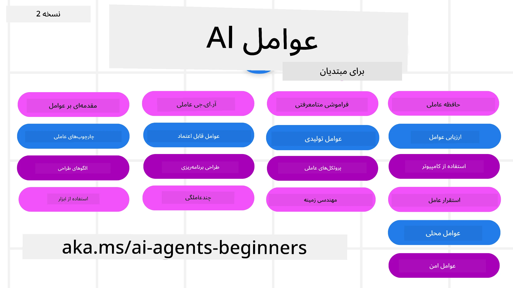

# نمایندگان هوش مصنوعی برای مبتدیان - یک دوره



## دوره‌ای که همه چیز را برای شروع ساخت نمایندگان هوش مصنوعی به شما آموزش می‌دهد

[](https://github.com/microsoft/ai-agents-for-beginners/blob/master/LICENSE?WT.mc_id=academic-105485-koreyst)
[](https://GitHub.com/microsoft/ai-agents-for-beginners/graphs/contributors/?WT.mc_id=academic-105485-koreyst)
[](https://GitHub.com/microsoft/ai-agents-for-beginners/issues/?WT.mc_id=academic-105485-koreyst)
[](https://GitHub.com/microsoft/ai-agents-for-beginners/pulls/?WT.mc_id=academic-105485-koreyst)
[](http://makeapullrequest.com?WT.mc_id=academic-105485-koreyst)

### 🌐 پشتیبانی چندزبانه

#### پشتیبانی شده از طریق GitHub Action (خودکار و همیشه به‌روز)

<!-- CO-OP TRANSLATOR LANGUAGES TABLE START -->
[عربی](../ar/README.md) | [بنگالی](../bn/README.md) | [بلغاری](../bg/README.md) | [برمه‌ای (میانمار)](../my/README.md) | [چینی (ساده‌شده)](../zh-CN/README.md) | [چینی (سنتی، هنگ کنگ)](../zh-HK/README.md) | [چینی (سنتی، ماکائو)](../zh-MO/README.md) | [چینی (سنتی، تایوان)](../zh-TW/README.md) | [کرواتی](../hr/README.md) | [چکی](../cs/README.md) | [دانمارکی](../da/README.md) | [هلندی](../nl/README.md) | [استونیایی](../et/README.md) | [فنلاندی](../fi/README.md) | [فرانسوی](../fr/README.md) | [آلمانی](../de/README.md) | [یونانی](../el/README.md) | [عبری](../he/README.md) | [هندی](../hi/README.md) | [مجارستانی](../hu/README.md) | [اندونزیایی](../id/README.md) | [ایتالیایی](../it/README.md) | [ژاپنی](../ja/README.md) | [کانادا](../kn/README.md) | [خمر](../km/README.md) | [کره‌ای](../ko/README.md) | [لیتوانیایی](../lt/README.md) | [مالایی](../ms/README.md) | [مالایالام](../ml/README.md) | [مراتی](../mr/README.md) | [نپالی](../ne/README.md) | [پیدجین نیجریه‌ای](../pcm/README.md) | [نروژی](../no/README.md) | [فارسی (Farsi)](./README.md) | [لهستانی](../pl/README.md) | [پرتغالی (برزیل)](../pt-BR/README.md) | [پرتغالی (پرتغال)](../pt-PT/README.md) | [پنجابی (Gurmukhi)](../pa/README.md) | [رومانیایی](../ro/README.md) | [روسی](../ru/README.md) | [صربی (سیریلیک)](../sr/README.md) | [اسلواکی](../sk/README.md) | [اسلوونیایی](../sl/README.md) | [اسپانیایی](../es/README.md) | [سواحلی](../sw/README.md) | [سوئدی](../sv/README.md) | [تاگالوگ (فیلیپینی)](../tl/README.md) | [تامیل](../ta/README.md) | [تلوگو](../te/README.md) | [تایلندی](../th/README.md) | [ترکی](../tr/README.md) | [اوکراینی](../uk/README.md) | [اردو](../ur/README.md) | [ویتنامی](../vi/README.md)

> **ترجیح می‌دهید به‌صورت محلی کلون کنید؟**
>
> این مخزن شامل ترجمه به بیش از ۵۰ زبان است که به‌طور قابل توجهی اندازه دانلود را افزایش می‌دهد. برای کلون کردن بدون ترجمه‌ها از sparse checkout استفاده کنید:
>
> **بش / مک‌اواس / لینوکس:**
> ```bash
> git clone --filter=blob:none --sparse https://github.com/microsoft/ai-agents-for-beginners.git
> cd ai-agents-for-beginners
> git sparse-checkout set --no-cone '/*' '!translations' '!translated_images'
> ```
>
> **CMD (ویندوز):**
> ```cmd
> git clone --filter=blob:none --sparse https://github.com/microsoft/ai-agents-for-beginners.git
> cd ai-agents-for-beginners
> git sparse-checkout set --no-cone "/*" "!translations" "!translated_images"
> ```
>
> این همه چیز را که برای تکمیل دوره نیاز دارید، با دانلود بسیار سریع‌تر در اختیارتان قرار می‌دهد.
<!-- CO-OP TRANSLATOR LANGUAGES TABLE END -->

**اگر مایل به پشتیبانی از زبان‌های ترجمه اضافی هستید، زبان‌های پشتیبانی‌شده در [اینجا](https://github.com/Azure/co-op-translator/blob/main/getting_started/supported-languages.md) لیست شده‌اند**

[](https://GitHub.com/microsoft/ai-agents-for-beginners/watchers/?WT.mc_id=academic-105485-koreyst)
[](https://GitHub.com/microsoft/ai-agents-for-beginners/network/?WT.mc_id=academic-105485-koreyst)
[](https://GitHub.com/microsoft/ai-agents-for-beginners/stargazers/?WT.mc_id=academic-105485-koreyst)

[](https://discord.gg/nTYy5BXMWG)


## 🌱 شروع به کار

این دوره درس‌هایی را پوشش می‌دهد که اصول ساخت نمایندگان هوش مصنوعی را آموزش می‌دهند. هر درس موضوع خاص خود را دارد بنابراین از هر جایی که دوست دارید شروع کنید!

برای این دوره پشتیبانی چندزبانه وجود دارد. به [زبان‌های موجود در اینجا](#-multi-language-support) مراجعه کنید.

اگر برای اولین بار با مدل‌های تولیدی هوش مصنوعی کار می‌کنید، دوره [هوش مصنوعی تولیدی برای مبتدیان](https://aka.ms/genai-beginners) ما را بررسی کنید که شامل ۲۱ درس در مورد ساخت با GenAI است.

فراموش نکنید که به [این مخزن ستاره (🌟) بدهید](https://docs.github.com/en/get-started/exploring-projects-on-github/saving-repositories-with-stars?WT.mc_id=academic-105485-koreyst) و [این مخزن را فورک کنید](https://github.com/microsoft/ai-agents-for-beginners/fork) تا کد را اجرا کنید.

### با دیگر یادگیرندگان آشنا شوید، سوالات خود را بپرسید

اگر گیر کردید یا سوالی درباره ساخت نمایندگان هوش مصنوعی دارید، به کانال دیسکورد اختصاصی ما در [دیسکورد مایکروسافت فاندری](https://aka.ms/ai-agents/discord) بپیوندید.

### چه چیزهایی نیاز دارید

هر درس در این دوره شامل نمونه کدهایی است که در پوشه code_samples قابل دسترسی است. می‌توانید این مخزن را [فورک کنید](https://github.com/microsoft/ai-agents-for-beginners/fork) تا نسخه خود را ایجاد کنید.

نمونه کدهای این تمرین‌ها از Microsoft Agent Framework به همراه Azure AI Foundry Agent Service V2 استفاده می‌کنند:

- [Microsoft Foundry](https://aka.ms/ai-agents-beginners/ai-foundry) - نیاز به حساب Azure

این دوره از فریم‌ورک‌ها و سرویس‌های نماینده هوش مصنوعی زیر از مایکروسافت استفاده می‌کند:

- [Microsoft Agent Framework (MAF)](https://aka.ms/ai-agents-beginners/agent-framewrok)
- [Azure AI Foundry Agent Service V2](https://aka.ms/ai-agents-beginners/ai-agent-service)

برخی از نمونه کدها همچنین از ارائه‌دهندگان سازگار با OpenAI جایگزین مانند [MiniMax](https://platform.minimaxi.com/) پشتیبانی می‌کنند، که مدل‌های زمینه بزرگ (تا ۲۰۴ هزار توکن) ارائه می‌دهد. برای جزئیات پیکربندی به [راه‌اندازی دوره](./00-course-setup/README.md) مراجعه کنید.

برای اطلاعات بیشتر در مورد اجرای کد این دوره به [راه‌اندازی دوره](./00-course-setup/README.md) مراجعه کنید.

## 🙏 می‌خواهید کمک کنید؟

آیا پیشنهاداتی دارید یا اشتباهات املایی یا کد پیدا کرده‌اید؟ [موضوعی ایجاد کنید](https://github.com/microsoft/ai-agents-for-beginners/issues?WT.mc_id=academic-105485-koreyst) یا [درخواست کشش ایجاد کنید](https://github.com/microsoft/ai-agents-for-beginners/pulls?WT.mc_id=academic-105485-koreyst)


## 📂 هر درس شامل

- یک درس مکتوب که در README ویدئوی کوتاه دارد
- نمونه‌های کد پایتون که از Microsoft Agent Framework با Azure AI Foundry استفاده می‌کنند
- لینک‌هایی به منابع اضافی برای ادامه یادگیری شما


## 🗃️ درس‌ها

| **درس**                                       | **متن و کد**                                        | **ویدئو**                                                  | **یادگیری بیشتر**                                                                     |
|--------------------------------------------|----------------------------------------------------|------------------------------------------------------------|----------------------------------------------------------------------------------------|
| معرفی نمایندگان هوش مصنوعی و موارد استفاده نمایندگان | [لینک](./01-intro-to-ai-agents/README.md)          | [ویدئو](https://youtu.be/3zgm60bXmQk?si=z8QygFvYQv-9WtO1)  | [لینک](https://aka.ms/ai-agents-beginners/collection?WT.mc_id=academic-105485-koreyst) |
| بررسی فریم‌ورک‌های نمایندگی هوش مصنوعی    | [لینک](./02-explore-agentic-frameworks/README.md)  | [ویدئو](https://youtu.be/ODwF-EZo_O8?si=Vawth4hzVaHv-u0H)  | [لینک](https://aka.ms/ai-agents-beginners/collection?WT.mc_id=academic-105485-koreyst) |
| درک الگوهای طراحی نمایندگی هوش مصنوعی     | [لینک](./03-agentic-design-patterns/README.md)     | [ویدئو](https://youtu.be/m9lM8qqoOEA?si=BIzHwzstTPL8o9GF)  | [لینک](https://aka.ms/ai-agents-beginners/collection?WT.mc_id=academic-105485-koreyst) |
| الگوی طراحی استفاده از ابزار                | [لینک](./04-tool-use/README.md)                    | [ویدئو](https://youtu.be/vieRiPRx-gI?si=2z6O2Xu2cu_Jz46N)  | [لینک](https://aka.ms/ai-agents-beginners/collection?WT.mc_id=academic-105485-koreyst) |
| نمایندگی RAG نماینده                        | [لینک](./05-agentic-rag/README.md)                 | [ویدئو](https://youtu.be/WcjAARvdL7I?si=gKPWsQpKiIlDH9A3)  | [لینک](https://aka.ms/ai-agents-beginners/collection?WT.mc_id=academic-105485-koreyst) |
| ساخت نمایندگان هوش مصنوعی قابل اعتماد     | [لینک](./06-building-trustworthy-agents/README.md) | [ویدئو](https://youtu.be/iZKkMEGBCUQ?si=jZjpiMnGFOE9L8OK ) | [لینک](https://aka.ms/ai-agents-beginners/collection?WT.mc_id=academic-105485-koreyst) |
| الگوی طراحی برنامه‌ریزی                      | [لینک](./07-planning-design/README.md)             | [ویدئو](https://youtu.be/kPfJ2BrBCMY?si=6SC_iv_E5-mzucnC)  | [لینک](https://aka.ms/ai-agents-beginners/collection?WT.mc_id=academic-105485-koreyst) |
| الگوی طراحی چندنماینده‌ای                    | [لینک](./08-multi-agent/README.md)                 | [ویدئو](https://youtu.be/V6HpE9hZEx0?si=rMgDhEu7wXo2uo6g)  | [لینک](https://aka.ms/ai-agents-beginners/collection?WT.mc_id=academic-105485-koreyst) |
| الگوی طراحی فراشناخت                 | [لینک](./09-metacognition/README.md)               | [ویدئو](https://youtu.be/His9R6gw6Ec?si=8gck6vvdSNCt6OcF)  | [لینک](https://aka.ms/ai-agents-beginners/collection?WT.mc_id=academic-105485-koreyst) |
| نمایندگان هوش مصنوعی در تولید                      | [لینک](./10-ai-agents-production/README.md)        | [ویدئو](https://youtu.be/l4TP6IyJxmQ?si=31dnhexRo6yLRJDl)  | [لینک](https://aka.ms/ai-agents-beginners/collection?WT.mc_id=academic-105485-koreyst) |
| استفاده از پروتکل‌های عاملی (MCP, A2A و NLWeb) | [لینک](./11-agentic-protocols/README.md)           | [ویدئو](https://youtu.be/X-Dh9R3Opn8)                                 | [لینک](https://aka.ms/ai-agents-beginners/collection?WT.mc_id=academic-105485-koreyst) |
| مهندسی زمینه برای نمایندگان هوش مصنوعی            | [لینک](./12-context-engineering/README.md)         | [ویدئو](https://youtu.be/F5zqRV7gEag)                                 | [لینک](https://aka.ms/ai-agents-beginners/collection?WT.mc_id=academic-105485-koreyst) |
| مدیریت حافظه عاملی                      | [لینک](./13-agent-memory/README.md)     |      [ویدئو](https://youtu.be/QrYbHesIxpw?si=vZkVwKrQ4ieCcIPx)                                                      |                                                                                        |
| کاوش چارچوب عامل مایکروسافت                         | [لینک](./14-microsoft-agent-framework/README.md)                            |                                                            |                                                                                        |
| ساخت نمایندگان استفاده رایانه‌ای (CUA)           | [لینک](./15-browser-use/README.md)     |                                                            | [لینک](https://docs.browser-use.com/examples/templates/playwright-integration)         |
| استقرار نمایندگان مقیاس‌پذیر                    | به زودی                               |                                                            |                                                                                        |
| ایجاد نمایندگان محلی هوش مصنوعی                     | به زودی                               |                                                            |                                                                                        |
| ایمن‌سازی نمایندگان هوش مصنوعی                           | به زودی                               |                                                            |                                                                                        |

## 🎒 دوره‌های دیگر

تیم ما دوره‌های دیگری نیز تولید می‌کند! بررسی کنید:

<!-- CO-OP TRANSLATOR OTHER COURSES START -->
### LangChain
[](https://aka.ms/langchain4j-for-beginners)
[](https://aka.ms/langchainjs-for-beginners?WT.mc_id=m365-94501-dwahlin)
[](https://github.com/microsoft/langchain-for-beginners?WT.mc_id=m365-94501-dwahlin)
---

### Azure / Edge / MCP / نمایندگان
[](https://github.com/microsoft/AZD-for-beginners?WT.mc_id=academic-105485-koreyst)
[](https://github.com/microsoft/edgeai-for-beginners?WT.mc_id=academic-105485-koreyst)
[](https://github.com/microsoft/mcp-for-beginners?WT.mc_id=academic-105485-koreyst)
[](https://github.com/microsoft/ai-agents-for-beginners?WT.mc_id=academic-105485-koreyst)

---
 
### سری آموزش هوش مصنوعی مولد
[](https://github.com/microsoft/generative-ai-for-beginners?WT.mc_id=academic-105485-koreyst)
[-9333EA?style=for-the-badge&labelColor=E5E7EB&color=9333EA)](https://github.com/microsoft/Generative-AI-for-beginners-dotnet?WT.mc_id=academic-105485-koreyst)
[-C084FC?style=for-the-badge&labelColor=E5E7EB&color=C084FC)](https://github.com/microsoft/generative-ai-for-beginners-java?WT.mc_id=academic-105485-koreyst)
[-E879F9?style=for-the-badge&labelColor=E5E7EB&color=E879F9)](https://github.com/microsoft/generative-ai-with-javascript?WT.mc_id=academic-105485-koreyst)

---
 
### آموزش‌های پایه
[](https://aka.ms/ml-beginners?WT.mc_id=academic-105485-koreyst)
[](https://aka.ms/datascience-beginners?WT.mc_id=academic-105485-koreyst)
[](https://aka.ms/ai-beginners?WT.mc_id=academic-105485-koreyst)
[](https://github.com/microsoft/Security-101?WT.mc_id=academic-96948-sayoung)
[](https://aka.ms/webdev-beginners?WT.mc_id=academic-105485-koreyst)
[](https://aka.ms/iot-beginners?WT.mc_id=academic-105485-koreyst)
[](https://github.com/microsoft/xr-development-for-beginners?WT.mc_id=academic-105485-koreyst)

---
 
### سری آموزش‌های همیار برنامه‌نویسی
[](https://aka.ms/GitHubCopilotAI?WT.mc_id=academic-105485-koreyst)
[](https://github.com/microsoft/mastering-github-copilot-for-dotnet-csharp-developers?WT.mc_id=academic-105485-koreyst)
[](https://github.com/microsoft/CopilotAdventures?WT.mc_id=academic-105485-koreyst)
<!-- CO-OP TRANSLATOR OTHER COURSES END -->

## 🌟 قدردانی از جامعه

از [Shivam Goyal](https://www.linkedin.com/in/shivam2003/) بابت ارائه نمونه‌های کد مهم که نماینده RAG عاملی را نشان می‌دهند، سپاسگزاریم.

## مشارکت

این پروژه از مشارکت‌ها و پیشنهادات استقبال می‌کند. بیشتر مشارکت‌ها نیازمند موافقت شما با توافق‌نامه مجوز همکار (CLA) هستند که اعلام می‌کند شما حق دارید و واقعاً به ما حقوق استفاده از مشارکت خود را می‌دهید. برای جزئیات به <https://cla.opensource.microsoft.com> مراجعه کنید.

وقتی درخواست کشیدن (pull request) ارسال می‌کنید، یک ربات CLA به‌طور خودکار تعیین می‌کند که آیا باید یک CLA ارائه دهید و درخواست را به‌درستی علامت‌گذاری می‌کند (مثلاً بررسی وضعیت، نظر). فقط کافی است دستورالعمل‌های ارائه‌شده توسط ربات را دنبال کنید. شما فقط یک بار در تمام مخازنی که از CLA ما استفاده می‌کنند، باید این کار را انجام دهید.

این پروژه از [کد رفتاری منبع باز مایکروسافت](https://opensource.microsoft.com/codeofconduct/) استفاده می‌کند.
برای اطلاعات بیشتر به [سؤالات متداول کد رفتار](https://opensource.microsoft.com/codeofconduct/faq/) مراجعه کنید یا با [opencode@microsoft.com](mailto:opencode@microsoft.com) برای سؤالات یا نظرات اضافی تماس بگیرید.

## علائم تجاری

این پروژه ممکن است شامل علائم تجاری یا لوگوهایی برای پروژه‌ها، محصولات یا خدمات باشد. استفاده مجاز از علائم تجاری یا لوگوهای مایکروسافت تابع و باید مطابق با
[راهنمای علائم تجاری و برند مایکروسافت](https://www.microsoft.com/legal/intellectualproperty/trademarks/usage/general) باشد.
استفاده از علائم تجاری یا لوگوهای مایکروسافت در نسخه‌های اصلاح‌شده این پروژه نباید باعث سردرگمی شود یا تأیید مایکروسافت را القا کند.
هرگونه استفاده از علائم تجاری یا لوگوهای شخص ثالث تابع سیاست‌های همان شخص ثالث است.

## دریافت کمک


اگر در ساخت برنامه‌های هوش مصنوعی گیر کرده‌اید یا سوالی دارید، بپیوندید به:

[](https://aka.ms/foundry/discord)

اگر بازخورد محصول یا خطایی در هنگام ساخت دارید، به اینجا مراجعه کنید:

[](https://aka.ms/foundry/forum)

---

<!-- CO-OP TRANSLATOR DISCLAIMER START -->
**سلب مسئولیت**:  
این سند با استفاده از سرویس ترجمه هوش مصنوعی [Co-op Translator](https://github.com/Azure/co-op-translator) ترجمه شده است. در حالی که ما در تلاش برای دقت هستیم، لطفاً توجه داشته باشید که ترجمه‌های خودکار ممکن است حاوی اشتباهات یا نادرستی‌هایی باشند. سند اصلی به زبان بومی خود باید به عنوان منبع معتبر در نظر گرفته شود. برای اطلاعات حیاتی، ترجمه حرفه‌ای انسانی توصیه می‌شود. ما مسئول هیچگونه سوءتفاهم یا تفسیر نادرستی ناشی از استفاده از این ترجمه نیستیم.
<!-- CO-OP TRANSLATOR DISCLAIMER END -->