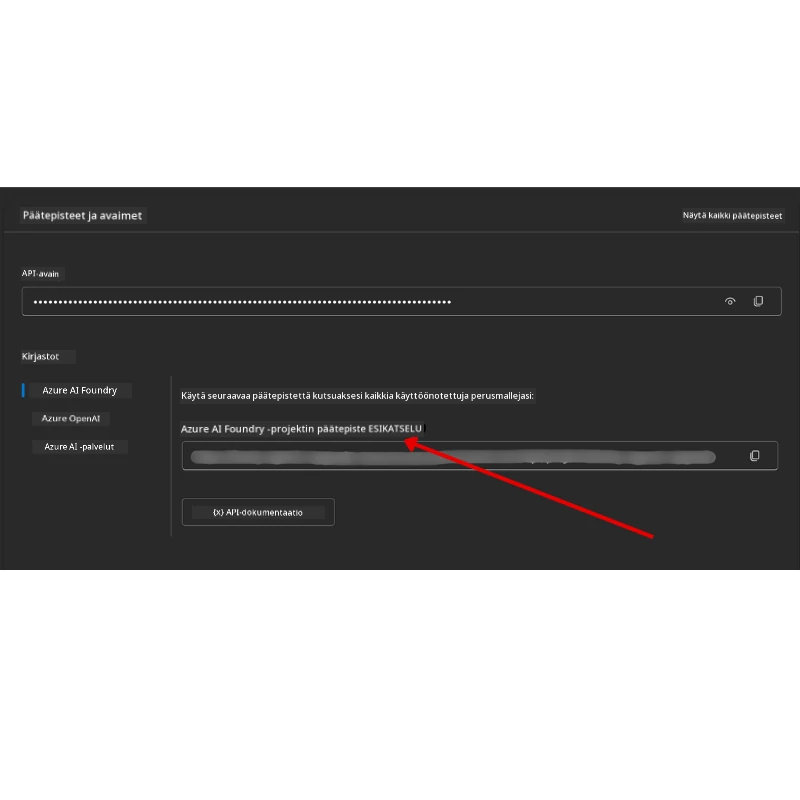

# Kurssin asennus

## Johdanto

Tässä oppitunnissa käsitellään, kuinka suorittaa tämän kurssin koodiesimerkit.

## Liity muiden oppijoiden seuraan ja saat apua

Ennen kuin alat kloonata omaa repositoriotasi, liity [AI Agents For Beginners Discord -kanavalle](https://aka.ms/ai-agents/discord) saadaksesi apua asennuksessa, kysymyksiä kurssista tai yhdistääksesi muihin oppijoihin.

## Kloonaa tai haarauta tämä repo

Aloittaaksesi, kloonaa tai haarauta GitHub-repositorio. Tämä luo sinulle oman version kurssimateriaalista, jotta voit suorittaa, testata ja muokata koodia!

Tämä onnistuu klikkaamalla linkkiä <a href="https://github.com/microsoft/ai-agents-for-beginners/fork" target="_blank">haarauta repo</a>

Sinulla pitäisi nyt olla oma haarautettu versiosi tästä kurssista seuraavasta linkistä:


### Shallow Clone (suositeltu työpajoihin / Codespaces)

  >Koko repositorio voi olla suuri (~3 GB) kun lataat koko historian ja kaikki tiedostot. Jos osallistut vain työpajaan tai tarvitset vain muutaman oppituntikansion, shallow clone (tai sparse clone) välttää suurimman osan latauksesta katkaisemalla historian ja/tai ohittamalla blobit.

#### Nopea shallow clone — minimaalinen historia, kaikki tiedostot

Korvaa `<your-username>` alla komennoissa haarautetun URL:llä (tai upstream-URL:llä jos haluat).

Kloonaa vain viimeisin commit-historia (pieni lataus):

```bash|powershell
git clone --depth 1 https://github.com/<your-username>/ai-agents-for-beginners.git
```

Kloonaa tietty haara:

```bash|powershell
git clone --depth 1 --branch <branch-name> https://github.com/<your-username>/ai-agents-for-beginners.git
```

#### Osittainen (sparse) kloonaus — minimaalinen blobit + vain valitut kansiot

Tämä käyttää osittaista kopiointia ja sparse-checkoutia (vaatii Git 2.25+ ja suositeltavaa modernia Gitiä jossa osittainen kloonaus):

```bash|powershell
git clone --depth 1 --filter=blob:none --sparse https://github.com/<your-username>/ai-agents-for-beginners.git
```

Siirry repo-kansioon:

```bash|powershell
cd ai-agents-for-beginners
```

Määritä sitten haluamasi kansiot (alla esimerkissä kaksi kansiota):

```bash|powershell
git sparse-checkout set 00-course-setup 01-intro-to-ai-agents
```

Kloonaamisen ja tiedostojen tarkistamisen jälkeen, jos tarvitset vain tiedostoja ja haluat vapauttaa tilaa (ei git historiota), poista repositorion metatiedot (💀 peruuttamaton — menetät kaiken Git-toiminnallisuuden: ei committeja, päivityksiä, työnsiä tai historiatietoja).

```bash
# zsh/bash
rm -rf .git
```

```powershell
# PowerShell
Remove-Item -Recurse -Force .git
```

#### GitHub Codespacesin käyttäminen (suositellaan suurten paikallisten latauksien välttämiseksi)

- Luo uusi Codespace tälle repositoriolle [GitHubin UI:n](https://github.com/codespaces) kautta.  

- Uuden codespacen terminaalissa suorita jokin yllä olevista shallow/sparse clone komennoista tuodaksesi vain tarvitsemasi oppituntikansiot Codespace-työtilaan.
- Valinnainen: kloonauksen jälkeen Codespacesissa poista .git vapauttaaksesi tilaa (katso poistokäskyt yllä).
- Huom: Jos haluat avata repositorion suoraan Codespacesissa (ilman lisäkloonausta), niin huomioi että Codespaces rakentaa devcontainer-ympäristön ja saattaa provisionoida enemmän kuin tarvitset. Shallow kloonaus tuoreeseen Codespaceen antaa paremman hallinnan levykäyttöön.

#### Vinkkejä

- Korvaa aina kloonaus-URL omallasi, jos haluat muokata/commitoida.
- Jos myöhemmin tarvitset lisää historiaa tai tiedostoja, voit hakea niitä tai muuttaa sparse-checkoutia lisätäksesi kansioita.

## Koodin suorittaminen

Tämä kurssi tarjoaa joukon Jupyter Notebook -tiedostoja, joita voit suorittaa saadaksesi käytännön kokemusta AI-agenttien rakentamisesta.

Koodiesimerkit käyttävät **Microsoft Agent Frameworkia (MAF)** `AzureAIProjectAgentProvider`-moduulilla, joka yhdistää **Azure AI Agent Service V2** (Responses API) kautta **Microsoft Foundryyn**.

Kaikki Python-notebookit on nimetty `*-python-agent-framework.ipynb`.

## Vaatimukset

- Python 3.12+
  - **HUOM**: Jos sinulla ei ole Python 3.12 asennettuna, varmista että asennat sen. Luo sen jälkeen venv käyttämällä python3.12 varmistaaksesi, että oikeat versiot asennetaan requirements.txt-tiedostosta.
  
    >Esimerkki

    Luo Python-venv-kansio:

    ```bash|powershell
    python -m venv venv
    ```

    Aktivoi sitten venv-ympäristö:

    ```bash
    # zsh/bash
    source venv/bin/activate
    ```
  
    ```dos
    # Command Prompt for Windows
    venv\Scripts\activate
    ```

- .NET 10+: Näytteitä varten, joissa käytetään .NET:iä, varmista että asennat [.NET 10 SDK:n](https://dotnet.microsoft.com/download/dotnet/10.0) tai uudemman. Tarkista asennettu .NET SDK versio:

    ```bash|powershell
    dotnet --list-sdks
    ```

- **Azure CLI** — vaaditaan tunnistukseen. Asenna osoitteesta [aka.ms/installazurecli](https://aka.ms/installazurecli).
- **Azure-tilaus** — käyttöoikeus Microsoft Foundryyn ja Azure AI Agent Serviceen.
- **Microsoft Foundry -projekti** — projekti, jossa on otettu käyttöön malli (esim. `gpt-4o`). Katso [Vaihe 1](#vaihe-1-luo-microsoft-foundry-projekti) alla.

Olemme lisänneet juureen `requirements.txt`-tiedoston, joka sisältää kaikki tarvittavat Python-kirjastot koodiesimerkkien suorittamiseen.

Voit asentaa ne suorittamalla seuraavan komennon terminaalissasi repositorion juuressa:

```bash|powershell
pip install -r requirements.txt
```

Suosittelemme Python-virtuaaliympäristön luomista mahdollisten konfliktien ja ongelmien välttämiseksi.

## VSCode-asetus

Varmista, että käytät oikeaa Python-versiota VSCodessa.


## Microsoft Foundryn ja Azure AI Agent Servicen asennus

### Vaihe 1: Luo Microsoft Foundry -projekti

Tarvitset Azure AI Foundryn **hubin** ja **projektin**, jossa on otettu käyttöön malli suorittaaksesi notebookeja.

1. Mene osoitteeseen [ai.azure.com](https://ai.azure.com) ja kirjaudu sisään Azure-tililläsi.
2. Luo **hub** (tai käytä olemassa olevaa). Katso: [Hubin resurssien yleiskatsaus](https://learn.microsoft.com/azure/ai-foundry/concepts/ai-resources).
3. Hubin sisällä luo **projekti**.
4. Ota malli käyttöön (esim. `gpt-4o`) kohdasta **Models + Endpoints** → **Deploy model**.

### Vaihe 2: Hae projektin endpoint ja mallin käyttöönoton nimi

Microsoft Foundryn portaalista projektistasi:

- **Projektin päätepiste** — Mene **Overview**-sivulle ja kopioi endpointin URL-osoite.



- **Mallin käyttöönoton nimi** — Mene kohtaan **Models + Endpoints**, valitse mallisi ja muistiinpanoksi **Deployment name** (esim. `gpt-4o`).

### Vaihe 3: Kirjaudu sisään Azureen komennolla `az login`

Kaikki notebookit käyttävät tunnistamiseen **`AzureCliCredential`** — ei API-avaimia hallittavaksi. Tämä vaatii kirjautumisen Azure CLI:n kautta.

1. **Asenna Azure CLI** jos se ei ole valmiiksi asennettuna: [aka.ms/installazurecli](https://aka.ms/installazurecli)

2. **Kirjaudu sisään** suorittamalla:

    ```bash|powershell
    az login
    ```

    Tai jos olet etä-/Codespace-ympäristössä ilman selainta:

    ```bash|powershell
    az login --use-device-code
    ```

3. **Valitse tilauksesi** jos sinulta pyydetään — valitse sellainen joka sisältää Foundry-projektisi.

4. **Varmista** että olet kirjautunut sisään:

    ```bash|powershell
    az account show
    ```

> **Miksi `az login`?** Notebookit hyväksyvät tunnistuksen `AzureCliCredential`-luokan kautta `azure-identity`-kirjastosta. Tämä tarkoittaa että Azure CLI -istuntosi antaa tarvittavat tunnukset — ei API-avaimia tai salaisuuksia `.env` tiedostossasi. Tämä on [turvallisuuskäytäntöjen mukainen menetelmä](https://learn.microsoft.com/azure/developer/ai/keyless-connections).

### Vaihe 4: Luo oma `.env` tiedostosi

Kopioi esimerkkitiedosto:

```bash
# zsh/bash
cp .env.example .env
```

```powershell
# PowerShell
Copy-Item .env.example .env
```

Avaa `.env` ja täytä nämä kaksi arvoa:

```env
AZURE_AI_PROJECT_ENDPOINT=https://<your-project>.services.ai.azure.com/api/projects/<your-project-id>
AZURE_AI_MODEL_DEPLOYMENT_NAME=gpt-4o
```

| Muuttuja | Missä se löytyy |
|----------|-----------------|
| `AZURE_AI_PROJECT_ENDPOINT` | Foundryn portaali → projektisi → **Overview**-sivu |
| `AZURE_AI_MODEL_DEPLOYMENT_NAME` | Foundryn portaali → **Models + Endpoints** → valitse käyttöönotettu malli |

Se on siinä useimmille oppitunneille! Notebookit autentikoituvat automaattisesti az login -istuntosi kautta.

### Vaihe 5: Asenna Python-riippuvuudet

```bash|powershell
pip install -r requirements.txt
```

Suosittelemme suorittamaan tämän aiemmin luomasi virtuaaliympäristön sisällä.

## Lisäasetukset Oppituntiin 5 (Agentic RAG)

Oppitunti 5 käyttää **Azure AI Searchia** hakuperustaisen sisällöntuoton tekemiseen. Jos aiot suorittaa tämän oppitunnin, lisää seuraavat muuttujat `.env` tiedostoosi:

| Muuttuja | Missä se löytyy |
|----------|-----------------|
| `AZURE_SEARCH_SERVICE_ENDPOINT` | Azure-portaali → Azure AI Search -resurssisi → **Overview** → URL |
| `AZURE_SEARCH_API_KEY` | Azure-portaali → Azure AI Search -resurssisi → **Settings** → **Keys** → ensisijainen ylläpitäjän avain |

## Lisäasetukset Oppituntiin 6 ja Oppituntiin 8 (GitHub-mallit)

Jotkin oppituntien 6 ja 8 notebookeista käyttävät **GitHub-malleja** Azure AI Foundryn sijaan. Jos aiot suorittaa nämä näytteet, lisää seuraavat muuttujat `.env` tiedostoosi:

| Muuttuja | Missä se löytyy |
|----------|-----------------|
| `GITHUB_TOKEN` | GitHub → **Settings** → **Developer settings** → **Personal access tokens** |
| `GITHUB_ENDPOINT` | Käytä arvoa `https://models.inference.ai.azure.com` (oletusarvo) |
| `GITHUB_MODEL_ID` | Mallin nimi käytettäväksi (esim. `gpt-4o-mini`) |

## Vaihtoehtoinen toimittaja: MiniMax (OpenAI-yhteensopiva)

[MiniMax](https://platform.minimaxi.com/) tarjoaa laajakontekstisia malleja (jopa 204K tokenia) OpenAI-yhteensopivan API:n kautta. Koska Microsoft Agent Frameworkin `OpenAIChatClient` toimii minkä tahansa OpenAI-yhteensopivan päätepisteen kanssa, voit käyttää MiniMaxia vaihtoehtona GitHub-malleille tai OpenAI:lle.

Lisää nämä muuttujat `.env` tiedostoosi:

| Muuttuja | Missä se löytyy |
|----------|-----------------|
| `MINIMAX_API_KEY` | [MiniMax Platform](https://platform.minimaxi.com/) → API Keys |
| `MINIMAX_BASE_URL` | Käytä arvoa `https://api.minimax.io/v1` (oletusarvo) |
| `MINIMAX_MODEL_ID` | Mallin nimi käytettäväksi (esim. `MiniMax-M2.7`) |

**Saatavilla olevat mallit**: `MiniMax-M2.7` (suositeltu), `MiniMax-M2.7-highspeed` (nopeammat vastaukset)

Koodiesimerkit, jotka käyttävät `OpenAIChatClient`-asiakasta (esim. Oppitunti 14 hotellivarauksen työnkulku), tunnistavat ja käyttävät automaattisesti MiniMax-konfiguraatiotasi, kun `MINIMAX_API_KEY` on asetettu.

## Lisäasetukset Oppituntiin 8 (Bing Grounding Workflow)

Oppitunnin 8 ehdollinen työnkulku käyttää **Bing groundingia** Azure AI Foundryn kautta. Jos aiot suorittaa tämän näytteen, lisää tämä muuttuja `.env` tiedostoosi:

| Muuttuja | Missä se löytyy |
|----------|-----------------|
| `BING_CONNECTION_ID` | Azure AI Foundry -portaali → projektisi → **Management** → **Connected resources** → Bing-yhteytesi → kopioi yhteyden ID |

## Vianmääritys

### SSL-sertifikaattien varmistusvirheet macOS:ssä

Jos käytät macOS:ää ja saat virheen kuten:

```plaintext
ssl.SSLCertVerificationError: [SSL: CERTIFICATE_VERIFY_FAILED] certificate verify failed: self-signed certificate in certificate chain
```

Tämä on tunnettu ongelma macOS:n Pythonissa, jossa järjestelmän SSL-sertifikaatteja ei automaattisesti luoteta. Kokeile seuraavia ratkaisuja tässä järjestyksessä:

**Vaihtoehto 1: Suorita Pythonin Install Certificates -skripti (suositeltu)**

```bash
# Korvaa 3.XX asennetulla Python-versiollasi (esim. 3.12 tai 3.13):
/Applications/Python\ 3.XX/Install\ Certificates.command
```

**Vaihtoehto 2: Käytä `connection_verify=False` notebookissasi (vain GitHub Models -notebookeille)**

Oppitunnin 6 notebookissa (`06-building-trustworthy-agents/code_samples/06-system-message-framework.ipynb`) on jo kommentoitu kiertotie mukana. Poista kommenttimerkki `connection_verify=False` käytettäessä klienttiä:

```python
client = ChatCompletionsClient(
    endpoint=endpoint,
    credential=AzureKeyCredential(token),
    connection_verify=False,  # Poista SSL-varmennuksen tarkistus käytöstä, jos kohtaat varmennevirheitä
)
```

> **⚠️ Varoitus:** SSL-tarkistuksen poiskytkeminen (`connection_verify=False`) heikentää turvallisuutta ohittamalla sertifikaattien tarkastuksen. Käytä tätä vain väliaikaisena kiertotienä kehitysympäristöissä, ei koskaan tuotannossa.

**Vaihtoehto 3: Asenna ja käytä `truststore`-kirjastoa**

```bash
pip install truststore
```

Lisää sitten seuraava rivu notebookisi tai skriptisi alkuun ennen kuin teet verkkopyyntöjä:

```python
import truststore
truststore.inject_into_ssl()
```

## Jäikö jumiin?

Jos sinulla on ongelmia tämän asennuksen kanssa, hyppää mukaan <a href="https://discord.gg/kzRShWzttr" target="_blank">Azure AI Community Discordiin</a> tai <a href="https://github.com/microsoft/ai-agents-for-beginners/issues?WT.mc_id=academic-105485-koreyst" target="_blank">luo issue</a>.

## Seuraava oppitunti

Olet nyt valmis suorittamaan tämän kurssin koodia. Onnea ja menestystä AI-agenttien maailmaan tutustumisessa!

[Johdanto AI Agentteihin ja agenttien käyttötapauksiin](../01-intro-to-ai-agents/README.md)

---

<!-- CO-OP TRANSLATOR DISCLAIMER START -->
**Vastuuvapauslauseke**:
Tämä asiakirja on käännetty käyttämällä tekoälypohjaista käännöspalvelua [Co-op Translator](https://github.com/Azure/co-op-translator). Vaikka pyrimme tarkkuuteen, otathan huomioon, että automaattisissa käännöksissä saattaa esiintyä virheitä tai epätarkkuuksia. Alkuperäinen asiakirja omalla kielellään on pidettävä auktoritatiivisena lähteenä. Tärkeissä tiedoissa suositellaan ammattimaista ihmiskäännöstä. Emme ole vastuussa tämän käännöksen käytöstä johtuvista väärinymmärryksistä tai virhetulkinnoista.
<!-- CO-OP TRANSLATOR DISCLAIMER END -->