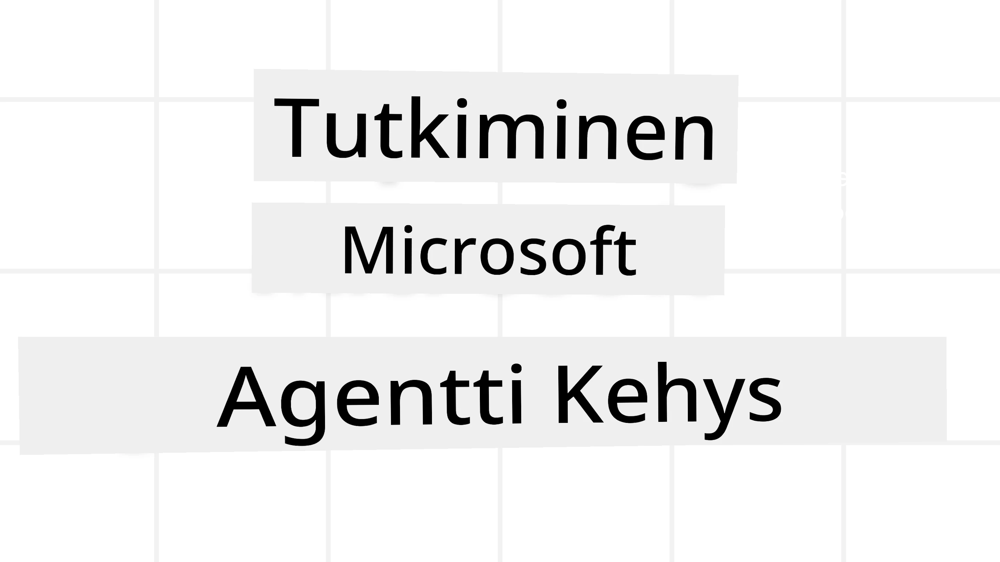
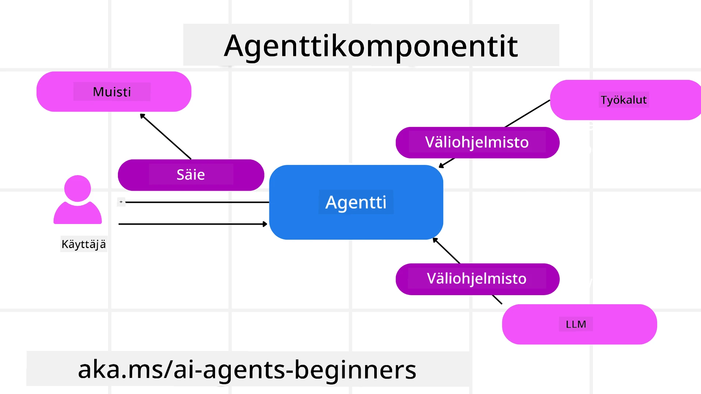

# Microsoft Agent Frameworkin tutkiminen



### Johdanto

Tämä oppitunti käsittelee:

- Microsoft Agent Frameworkin ymmärtäminen: Keskeiset ominaisuudet ja arvo  
- Microsoft Agent Frameworkin keskeisten käsitteiden tutkiminen
- Edistyneet MAF-kuviot: Työnkulut, Middleware ja Muisti

## Oppimistavoitteet

Tämän oppitunnin suorittamisen jälkeen osaat:

- Rakentaa tuotantovalmiita tekoälyagentteja Microsoft Agent Frameworkia käyttäen
- Soveltaa Microsoft Agent Frameworkin ydintoimintoja agenttikäyttötapauksiisi
- Käyttää edistyneitä kuvioita, kuten työnkulkuja, middlewarea ja havainnointia

## Koodiesimerkit

Microsoft Agent Frameworkin (MAF) koodiesimerkit löytyvät tästä repositoriosta tiedostoista `xx-python-agent-framework` ja `xx-dotnet-agent-framework`.

## Microsoft Agent Frameworkin ymmärtäminen


[Microsoft Agent Framework (MAF)](https://aka.ms/ai-agents-beginners/agent-framewrok) on Microsoftin yhtenäinen kehys tekoälyagenttien rakentamiseen. Se tarjoaa joustavuutta käsitellä vaihtelevia agenttikäyttötapauksia sekä tuotanto- että tutkimusympäristöissä, kuten:

- **Sekventiaalinen agenttien orkestrointi** tilanteissa, joissa tarvitaan vaiheittaisia työnkulkuja.
- **Samtakainen orkestrointi** tilanteissa, joissa agenttien pitää suorittaa tehtäviä samanaikaisesti.
- **Ryhmächatti-orkestrointi** tilanteissa, joissa agentit voivat tehdä yhteistyötä yhden tehtävän parissa.
- **Tehtävän siirto (Handoff) -orkestrointi** tilanteissa, joissa agentit siirtävät tehtävää toisilleen osatehtävien valmistuessa.
- **Magnetinen orkestrointi** tilanteissa, joissa manager-agentti luo ja muokkaa tehtävälistaa sekä koordinoi aliagenttien toimintaa tehtävän suorittamiseksi.

Tuotantovalmiiden tekoälyagenttien toimittamiseksi MAF sisältää myös ominaisuuksia:

- **Havainnointi** OpenTelemetryn avulla, jossa jokainen tekoälyagentin toiminto, mukaan lukien työkalukutsut, orkestrointivaiheet, päättelyvirrat ja suorituskyvyn seuranta Microsoft Foundryn kojelaudoilla, näkyvät.
- **Turvallisuus** isännöimällä agentteja natiivisti Microsoft Foundryssa, joka sisältää roolipohjaiset käyttöoikeudet, yksityisen datan käsittelyn ja sisäänrakennetun sisällön turvallisuuden.
- **Kestävyys** sillä agenttien prosessiketjut ja työnkulut voivat tauottaa, jatkaa ja toipua virheistä, mahdollistaen pidemmät suoritukset.
- **Hallinta**, joka mahdollistaa ihmisen sisällyttämisen työnkulkuihin, joissa tehtävät merkitään ihmisen hyväksyntää vaativiksi.

Microsoft Agent Framework keskittyy myös yhteensopivuuteen:

- **Pilvi-riippumattomuus** – agentit voivat toimia konteissa, paikallisesti ja useilla eri pilvialustoilla.
- **Toimittajariippumattomuus** – agentit voidaan luoda suosikkikehitysympäristöäsi käyttäen, kuten Azure OpenAI tai OpenAI.
- **Avoimien standardien integraatio** – agentit voivat hyödyntää protokollia kuten Agent-to-Agent (A2A) ja Model Context Protocol (MCP) löytääkseen ja käyttääkseen muita agentteja ja työkaluja.
- **Laajennukset ja liittimet** – yhteydet voidaan tehdä datan ja muistitallennuspalvelujen, kuten Microsoft Fabric, SharePoint, Pinecone ja Qdrant, kanssa.

Tutkitaan, miten näitä ominaisuuksia sovelletaan Microsoft Agent Frameworkin keskeisiin käsitteisiin.

## Microsoft Agent Frameworkin keskeiset käsitteet

### Agentit



**Agenttien luominen**

Agentin luominen tapahtuu määrittelemällä päättelypalvelu (LLM-palveluntarjoaja), joukko ohjeita tekoälyagentille noudatettavaksi sekä määritetty `name`:

```python
agent = AzureOpenAIChatClient(credential=AzureCliCredential()).create_agent( instructions="You are good at recommending trips to customers based on their preferences.", name="TripRecommender" )
```

Esimerkissä käytetään `Azure OpenAI`-palvelua, mutta agentteja voi luoda monilla eri palveluilla, mukaan lukien `Microsoft Foundry Agent Service`:

```python
AzureAIAgentClient(async_credential=credential).create_agent( name="HelperAgent", instructions="You are a helpful assistant." ) as agent
```

OpenAI:n `Responses`-, `ChatCompletion`-API:t

```python
agent = OpenAIResponsesClient().create_agent( name="WeatherBot", instructions="You are a helpful weather assistant.", )
```

```python
agent = OpenAIChatClient().create_agent( name="HelpfulAssistant", instructions="You are a helpful assistant.", )
```

tai [MiniMax](https://platform.minimaxi.com/), joka tarjoaa OpenAI-yhteensopivan API:n suuren kontekstikoon kanssa (jopa 204 000 tokenia):

```python
agent = OpenAIChatClient(base_url="https://api.minimax.io/v1", api_key=os.environ["MINIMAX_API_KEY"], model_id="MiniMax-M2.7").create_agent( name="HelpfulAssistant", instructions="You are a helpful assistant.", )
```

tai etäagentit A2A-protokollaa käyttäen:

```python
agent = A2AAgent( name=agent_card.name, description=agent_card.description, agent_card=agent_card, url="https://your-a2a-agent-host" )
```

**Agenttien suorittaminen**

Agentit suoritetaan `.run`- tai `.run_stream`-metodeilla, jotka mahdollistavat joko ei-virtuaalisen tai virtuaalisen vastauksen.

```python
result = await agent.run("What are good places to visit in Amsterdam?")
print(result.text)
```

```python
async for update in agent.run_stream("What are the good places to visit in Amsterdam?"):
    if update.text:
        print(update.text, end="", flush=True)

```

Jokaisella agentin suorituksella voi olla myös vaihtoehtoja parametrien mukauttamiseen, kuten agentin käyttämien `max_tokens`-asetuksen, `tools`-työkalujen, joita agentti voi kutsua, tai jopa käytettävän `model`-mallin määrittelyyn.

Tämä on hyödyllistä tilanteissa, joissa tiettyjä malleja tai työkaluja tarvitaan käyttäjän tehtävän suorittamiseen.

**Työkalut**

Työkaluja voidaan määritellä sekä agentin määrittelyn yhteydessä:

```python
def get_attractions( location: Annotated[str, Field(description="The location to get the top tourist attractions for")], ) -> str: """Get the top tourist attractions for a given location.""" return f"The top attractions for {location} are." 


# Kun luodaan ChatAgent suoraan

agent = ChatAgent( chat_client=OpenAIChatClient(), instructions="You are a helpful assistant", tools=[get_attractions]

```

että agenttia suoritettaessa:

```python

result1 = await agent.run( "What's the best place to visit in Seattle?", tools=[get_attractions] # Työkalu tarjottu vain tätä ajoa varten )
```

**Agenttien säikeet**

Agenttien säikeitä käytetään monivuorokeskustelujen hallintaan. Säikeitä voidaan luoda joko:

- Käyttämällä `get_new_thread()`, joka mahdollistaa säikeen tallentamisen ajan myötä
- Luomalla säie automaattisesti agentin suorituksen yhteydessä siten, että säie kestää vain kyseisen suorituksen ajan.

Säikeen luontikoodi näyttää tältä:

```python
# Luo uusi säie.
thread = agent.get_new_thread() # Suorita agentti säikeellä.
response = await agent.run("Hello, I am here to help you book travel. Where would you like to go?", thread=thread)

```

Voit sitten sarjoittaa säikeen tallennettavaksi myöhempää käyttöä varten:

```python
# Luo uusi säie.
thread = agent.get_new_thread() 

# Suorita agentti säikeen kanssa.

response = await agent.run("Hello, how are you?", thread=thread) 

# Serialisoi säie tallennusta varten.

serialized_thread = await thread.serialize() 

# Deserialisoi säikeen tila tallennuksen jälkeen.

resumed_thread = await agent.deserialize_thread(serialized_thread)
```

**Agentin Middleware**

Agentit ovat vuorovaikutuksessa työkalujen ja LLM:ien kanssa suorittaakseen käyttäjän tehtävät. Joissain tilanteissa haluamme suorittaa tai seurata toimintaa näiden vuorovaikutusten välissä. Agentin middleware mahdollistaa tämän seuraavasti:

*Funktio-Middleware*

Tämä middleware antaa mahdollisuuden suorittaa toiminto agentin ja kutsuttavan funktion/ työkalun välillä. Esimerkiksi tässä voisi tehdä lokituksen funktion kutsussa.

Alla olevassa koodissa `next` määrittää, suoritaanko seuraava middleware vai varsinainen funktio.

```python
async def logging_function_middleware(
    context: FunctionInvocationContext,
    next: Callable[[FunctionInvocationContext], Awaitable[None]],
) -> None:
    """Function middleware that logs function execution."""
    # Esikäsittely: Kirjaa lokiin ennen funktion suorittamista
    print(f"[Function] Calling {context.function.name}")

    # Jatka seuraavaan middlewareen tai funktion suorittamiseen
    await next(context)

    # Jälkikäsittely: Kirjaa lokiin funktion suorittamisen jälkeen
    print(f"[Function] {context.function.name} completed")
```

*Chat-Middleware*

Tämä middleware mahdollistaa toiminnon suorittamisen tai lokituksen agentin ja LLM:n välisissä pyynnöissä.

Sisältää keskeisiä tietoja, kuten AI-palveluun lähetettävät `messages`-viestit.

```python
async def logging_chat_middleware(
    context: ChatContext,
    next: Callable[[ChatContext], Awaitable[None]],
) -> None:
    """Chat middleware that logs AI interactions."""
    # Esikäsittely: Kirjaa lokiin ennen tekoälykutsua
    print(f"[Chat] Sending {len(context.messages)} messages to AI")

    # Jatka seuraavaan keskiohjelmistoon tai tekoälypalveluun
    await next(context)

    # Jälkikäsittely: Kirjaa lokiin tekoälyn vastauksen jälkeen
    print("[Chat] AI response received")

```

**Agentin Muisti**

Kuten oppitunnissa `Agentic Memory` käsiteltiin, muisti on tärkeä osa-agentin toimintaa eri konteksteissa. MAF tarjoaa useita muistityyppejä:

*Muisti sovelluksen ajon aikana*

Tämä muisti tallennetaan säikeisiin sovelluksen ajon aikana.

```python
# Luo uusi säie.
thread = agent.get_new_thread() # Suorita agentti säikeellä.
response = await agent.run("Hello, I am here to help you book travel. Where would you like to go?", thread=thread)
```

*Pysyvät viestit*

Tätä muistia käytetään keskusteluhistorian tallentamiseen eri istuntojen välillä. Se määritellään `chat_message_store_factory`:lla:

```python
from agent_framework import ChatMessageStore

# Luo mukautettu viestivarasto
def create_message_store():
    return ChatMessageStore()

agent = ChatAgent(
    chat_client=OpenAIChatClient(),
    instructions="You are a Travel assistant.",
    chat_message_store_factory=create_message_store
)

```

*Dynaaminen muisti*

Tämä muisti lisätään kontekstiin ennen agenttien suoritusta. Näitä muisteja voidaan tallentaa ulkoisiin palveluihin, kuten mem0:

```python
from agent_framework.mem0 import Mem0Provider

# Käytetään Mem0:aa edistyneisiin muistiominaisuuksiin
memory_provider = Mem0Provider(
    api_key="your-mem0-api-key",
    user_id="user_123",
    application_id="my_app"
)

agent = ChatAgent(
    chat_client=OpenAIChatClient(),
    instructions="You are a helpful assistant with memory.",
    context_providers=memory_provider
)

```

**Agentin Havainnointi**

Havainnointi on tärkeää luotettavien ja ylläpidettävien agenttijärjestelmien rakentamiseen. MAF integroituu OpenTelemetryyn tarjoten jäljityksen ja mittarit paremmaksi havainnoitavuudeksi.

```python
from agent_framework.observability import get_tracer, get_meter

tracer = get_tracer()
meter = get_meter()
with tracer.start_as_current_span("my_custom_span"):
    # tee jotain
    pass
counter = meter.create_counter("my_custom_counter")
counter.add(1, {"key": "value"})
```

### Työnkulut

MAF tarjoaa työnkulkuja, jotka ovat ennalta määriteltyjä vaiheita tehtävän suorittamiseksi ja sisältävät tekoälyagentteja komponentteinaan näissä vaiheissa.

Työnkulut koostuvat eri komponenteista, jotka mahdollistavat paremman ohjauksen. Työnkulut tukevat myös **moni-agenttiorkestrointia** ja **tarkistuspisteiden (checkpointing)** käyttöä työnkulun tilojen tallennukseen.

Työnkulun ydinkomponentit ovat:

**Suorittajat (Executors)**

Suorittajat vastaanottavat syöteviestejä, suorittavat tehtävänsä ja tuottavat lähtöviestin. Tämä siirtää työnkulkua eteenpäin kohti suuremman tehtävän valmistumista. Suorittajat voivat olla tekoälyagentteja tai omaa logiikkaa.

**Reunat (Edges)**

Reunoilla määritellään viestien kulku työnkulkussa. Näitä voivat olla:

*Suorat reunat* – Yksinkertaisia yksi-yhteen yhteyksiä suorittajien välillä:

```python
from agent_framework import WorkflowBuilder

builder = WorkflowBuilder()
builder.add_edge(source_executor, target_executor)
builder.set_start_executor(source_executor)
workflow = builder.build()
```

*Ehtoreunat* – Aktivoituvat tietyn ehdon täyttyessä. Esimerkiksi kun hotellihuoneita ei ole saatavilla, suorittaja voi ehdottaa muita vaihtoehtoja.

*Kytkin-case-reunat* – Ohjaavat viestit eri suorittajille ehtojen mukaan. Esimerkiksi matka-asiakkaalla on prioriteettikäsittely, jolloin tehtävät hoidetaan toisessa työnkulussa.

*Fan-out-reunat* – Lähettävät yhden viestin useille kohteille.

*Fan-in-reunat* – Keräävät useita viestejä eri suorittajilta ja lähettävät ne yhdelle kohteelle.

**Tapahtumat**

Parantaakseen työnkulkujen havainnoitavuutta MAF tarjoaa sisäänrakennettuja suoritustapahtumia, kuten:

- `WorkflowStartedEvent` – Työnkulun suoritus alkaa
- `WorkflowOutputEvent` – Työnkulku tuottaa tuloksen
- `WorkflowErrorEvent` – Työnkulku kohtaa virheen
- `ExecutorInvokeEvent` – Suorittaja aloittaa suorituksen
- `ExecutorCompleteEvent` – Suorittaja päättää suorituksen
- `RequestInfoEvent` – Pyyntö tehdään

## Edistyneet MAF-kuviot

Yllä olevat osiot käsittelevät Microsoft Agent Frameworkin keskeisiä käsitteitä. Kun rakennat monimutkaisempia agentteja, tässä joitakin edistyneitä kuvioita harkittavaksi:

- **Middleware-kompositio**: Ketjuta useita middleware-käsittelijöitä (lokitus, autentikointi, nopeuden rajoitus) funktio- ja chat-middlewareilla hienojakoiseen hallintaan agentin toiminnassa.
- **Työnkulun tarkistuspisteet**: Käytä työnkulun tapahtumia ja sarjallistusta tallentaaksesi ja jatkaaksesi pitkiä agenttiprosesseja.
- **Dynaaminen työkalujen valinta**: Yhdistä RAG-tekniikka työkalukuvauksista MAF:n työkalurekisteröintiin esittääksesi vain relevantteja työkaluja kyselyä kohden.
- **Moni-agenttien tehtävänvaihto (handoff)**: Käytä työnkulun reunoja ja ehtoreittejä orkestroidaksesi tehtäväsiirtoja erikoistuneiden agenttien välillä.

## Koodiesimerkit

Microsoft Agent Frameworkin koodiesimerkit löytyvät tästä repositoriosta tiedostoista `xx-python-agent-framework` ja `xx-dotnet-agent-framework`.

## Lisäkysymyksiä Microsoft Agent Frameworkista?

Liity [Microsoft Foundry Discordiin](https://aka.ms/ai-agents/discord) tapaat muita oppijoita, osallistu toimistoaikoihin ja saat vastauksia tekoälyagentteihin liittyviin kysymyksiisi.

---

<!-- CO-OP TRANSLATOR DISCLAIMER START -->
**Vastuuvapauslauseke**:  
Tämä asiakirja on käännetty käyttämällä tekoälypohjaista käännöspalvelua [Co-op Translator](https://github.com/Azure/co-op-translator). Pyrimme tarkkuuteen, mutta automaattikäännöksissä saattaa esiintyä virheitä tai epätarkkuuksia. Alkuperäinen asiakirja omalla kielellään on virallinen lähde. Tärkeissä asioissa suosittelemme ammattilaisen tekemää ihmiskäännöstä. Emme ole vastuussa mahdollisista väärinymmärryksistä tai virhetulkintojen seurauksista, jotka johtuvat tämän käännöksen käytöstä.
<!-- CO-OP TRANSLATOR DISCLAIMER END -->