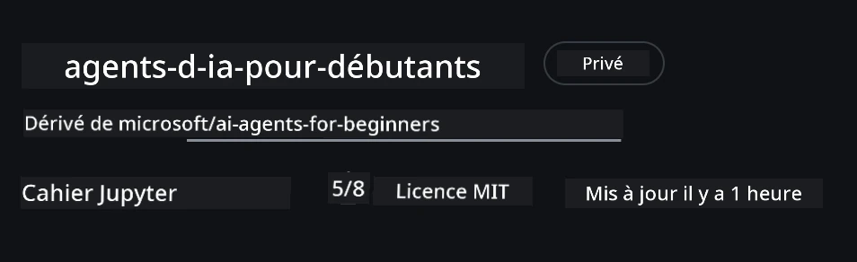

# Configuration du cours

## Introduction

Cette leçon expliquera comment exécuter les exemples de code de ce cours.

## Rejoignez d'autres apprenants et obtenez de l'aide

Avant de commencer à cloner votre dépôt, rejoignez le [canal Discord AI Agents For Beginners](https://aka.ms/ai-agents/discord) pour obtenir de l'aide avec la configuration, poser des questions sur le cours ou pour vous connecter avec d'autres apprenants.

## Cloner ou Forker ce dépôt

Pour commencer, veuillez cloner ou forker le dépôt GitHub. Cela vous permettra d'avoir votre propre version du matériel du cours afin que vous puissiez exécuter, tester et modifier le code !

Cela peut être fait en cliquant sur le lien pour <a href="https://github.com/microsoft/ai-agents-for-beginners/fork" target="_blank">forker le dépôt</a>

Vous devriez maintenant avoir votre propre version forkée de ce cours sous le lien suivant :



### Clonage superficiel (recommandé pour les ateliers / Codespaces)

  >Le dépôt complet peut être volumineux (~3 Go) lorsque vous téléchargez l'historique complet et tous les fichiers. Si vous assistez uniquement à l'atelier ou n'avez besoin que de quelques dossiers de leçon, un clonage superficiel (ou clonage partiel) évite la majeure partie de ce téléchargement en tronquant l'historique et/ou en sautant certains blobs.

#### Clonage superficiel rapide — historique minimal, tous les fichiers

Remplacez `<your-username>` dans les commandes ci-dessous par l'URL de votre fork (ou l'URL upstream si vous préférez).

Pour cloner seulement l'historique du dernier commit (téléchargement léger) :

```bash|powershell
git clone --depth 1 https://github.com/<your-username>/ai-agents-for-beginners.git
```

Pour cloner une branche spécifique :

```bash|powershell
git clone --depth 1 --branch <branch-name> https://github.com/<your-username>/ai-agents-for-beginners.git
```

#### Clonage partiel (sparse) — blobs minimaux + uniquement dossiers sélectionnés

Cela utilise le clonage partiel et le sparse-checkout (requiert Git 2.25+ et Git moderne recommandé avec support du clonage partiel) :

```bash|powershell
git clone --depth 1 --filter=blob:none --sparse https://github.com/<your-username>/ai-agents-for-beginners.git
```

Allez dans le dossier du dépôt :

```bash|powershell
cd ai-agents-for-beginners
```

Puis spécifiez les dossiers souhaités (exemple ci-dessous avec deux dossiers) :

```bash|powershell
git sparse-checkout set 00-course-setup 01-intro-to-ai-agents
```

Après le clonage et la vérification des fichiers, si vous n'avez besoin que des fichiers et souhaitez libérer de l'espace (sans historique git), veuillez supprimer les métadonnées du dépôt (💀 irréversible — vous perdrez toute fonctionnalité Git : pas de commits, pulls, pushes ou accès à l'historique).

```bash
# zsh/bash
rm -rf .git
```

```powershell
# PowerShell
Remove-Item -Recurse -Force .git
```

#### Utilisation de GitHub Codespaces (recommandée pour éviter les téléchargements volumineux locaux)

- Créez un nouveau Codespace pour ce dépôt via l'[interface GitHub](https://github.com/codespaces).  

- Dans le terminal du Codespace nouvellement créé, exécutez l'une des commandes de clonage superficiel/partiel ci-dessus pour importer uniquement les dossiers des leçons dont vous avez besoin dans l'espace de travail Codespace.
- Optionnel : après clonage dans Codespaces, supprimez .git pour récupérer de l'espace supplémentaire (voir commandes de suppression ci-dessus).
- Note : Si vous préférez ouvrir directement le dépôt dans Codespaces (sans clonage supplémentaire), sachez que Codespaces construira l'environnement devcontainer et pourra encore provisionner plus que nécessaire. Cloner une copie superficielle dans un Codespace fraîche vous permet de mieux contrôler l'utilisation disque.

#### Conseils

- Remplacez toujours l'URL de clonage par celle de votre fork si vous souhaitez éditer/committer.
- Si vous avez besoin plus tard de plus d'historique ou de fichiers, vous pouvez les récupérer ou ajuster sparse-checkout pour inclure d'autres dossiers.

## Exécution du code

Ce cours propose une série de Jupyter Notebooks que vous pouvez exécuter pour une expérience pratique sur la construction d'agents IA.

Les exemples de code utilisent **Microsoft Agent Framework (MAF)** avec le `AzureAIProjectAgentProvider`, qui se connecte au **Azure AI Agent Service V2** (l'API Responses) via **Microsoft Foundry**.

Tous les notebooks Python sont nommés `*-python-agent-framework.ipynb`.

## Prérequis

- Python 3.12+
  - **NOTE** : Si vous n'avez pas Python3.12 installé, assurez-vous de l'installer. Ensuite, créez votre venv en utilisant python3.12 pour garantir les bonnes versions des packages du fichier requirements.txt.
  
    >Exemple

    Créez un répertoire venv Python :

    ```bash|powershell
    python -m venv venv
    ```

    Puis activez l'environnement venv pour :

    ```bash
    # zsh/bash
    source venv/bin/activate
    ```
  
    ```dos
    # Command Prompt for Windows
    venv\Scripts\activate
    ```

- .NET 10+ : Pour les exemples utilisant .NET, assurez-vous d'installer le [.NET 10 SDK](https://dotnet.microsoft.com/download/dotnet/10.0) ou une version supérieure. Puis, vérifiez la version installée du SDK .NET :

    ```bash|powershell
    dotnet --list-sdks
    ```

- **Azure CLI** — Requis pour l'authentification. Installez-le depuis [aka.ms/installazurecli](https://aka.ms/installazurecli).
- **Abonnement Azure** — Pour accéder à Microsoft Foundry et Azure AI Agent Service.
- **Projet Microsoft Foundry** — Un projet avec un modèle déployé (ex. `gpt-4o`). Voir [Étape 1](#étape-1-créez-un-projet-microsoft-foundry) ci-dessous.

Nous avons inclus un fichier `requirements.txt` à la racine de ce dépôt contenant tous les packages Python requis pour exécuter les exemples.

Vous pouvez les installer en lançant la commande suivante dans un terminal à la racine du dépôt :

```bash|powershell
pip install -r requirements.txt
```

Nous recommandons de créer un environnement virtuel Python pour éviter tout conflit ou problème.

## Configuration de VSCode

Assurez-vous d'utiliser la bonne version de Python dans VSCode.


## Configuration de Microsoft Foundry et Azure AI Agent Service

### Étape 1 : Créez un projet Microsoft Foundry

Vous aurez besoin d'un **hub** Azure AI Foundry et d'un **projet** avec un modèle déployé pour utiliser les notebooks.

1. Rendez-vous sur [ai.azure.com](https://ai.azure.com) et connectez-vous avec votre compte Azure.
2. Créez un **hub** (ou utilisez-en un existant). Voir : [Vue d’ensemble des ressources du hub](https://learn.microsoft.com/azure/ai-foundry/concepts/ai-resources).
3. Dans le hub, créez un **projet**.
4. Déployez un modèle (ex. `gpt-4o`) depuis **Models + Endpoints** → **Deploy model**.

### Étape 2 : Récupérez le point de terminaison de votre projet et le nom du déploiement du modèle

Depuis votre projet dans le portail Microsoft Foundry :

- **Point de terminaison du projet** — Allez sur la page **Overview** et copiez l'URL du point de terminaison.


- **Nom du déploiement du modèle** — Allez dans **Models + Endpoints**, sélectionnez votre modèle déployé, et notez le **Deployment name** (ex. `gpt-4o`).

### Étape 3 : Connectez-vous à Azure avec `az login`

Tous les notebooks utilisent **`AzureCliCredential`** pour l'authentification — aucune clé API à gérer. Cela nécessite d'être connecté via Azure CLI.

1. **Installez l'Azure CLI** si ce n'est pas déjà fait : [aka.ms/installazurecli](https://aka.ms/installazurecli)

2. **Connectez-vous** en lançant :

    ```bash|powershell
    az login
    ```

    Ou si vous êtes dans un environnement distant/Codespace sans navigateur :

    ```bash|powershell
    az login --use-device-code
    ```

3. **Sélectionnez votre abonnement** si demandé — choisissez celui contenant votre projet Foundry.

4. **Vérifiez** que vous êtes bien connecté :

    ```bash|powershell
    az account show
    ```

> **Pourquoi `az login` ?** Les notebooks s'authentifient via `AzureCliCredential` du package `azure-identity`. Cela signifie que votre session Azure CLI fournit les identifiants — pas de clés API ou secrets dans votre fichier `.env`. C'est une [bonne pratique de sécurité](https://learn.microsoft.com/azure/developer/ai/keyless-connections).

### Étape 4 : Créez votre fichier `.env`

Copiez le fichier exemple :

```bash
# zsh/bash
cp .env.example .env
```

```powershell
# PowerShell
Copy-Item .env.example .env
```

Ouvrez `.env` et remplissez ces deux valeurs :

```env
AZURE_AI_PROJECT_ENDPOINT=https://<your-project>.services.ai.azure.com/api/projects/<your-project-id>
AZURE_AI_MODEL_DEPLOYMENT_NAME=gpt-4o
```

| Variable | Où la trouver |
|----------|-----------------|
| `AZURE_AI_PROJECT_ENDPOINT` | Portail Foundry → votre projet → page **Overview** |
| `AZURE_AI_MODEL_DEPLOYMENT_NAME` | Portail Foundry → **Models + Endpoints** → nom du modèle déployé |

C'est tout pour la plupart des leçons ! Les notebooks s'authentifieront automatiquement via votre session `az login`.

### Étape 5 : Installez les dépendances Python

```bash|powershell
pip install -r requirements.txt
```

Nous recommandons d'exécuter cela dans le virtual environnement que vous avez créé précédemment.

## Configuration supplémentaire pour la leçon 5 (Agentic RAG)

La leçon 5 utilise **Azure AI Search** pour la génération augmentée par recherche. Si vous prévoyez d'exécuter cette leçon, ajoutez ces variables à votre fichier `.env` :

| Variable | Où la trouver |
|----------|-----------------|
| `AZURE_SEARCH_SERVICE_ENDPOINT` | Portail Azure → votre ressource **Azure AI Search** → **Overview** → URL |
| `AZURE_SEARCH_API_KEY` | Portail Azure → votre ressource **Azure AI Search** → **Settings** → **Keys** → clé admin principale |

## Configuration supplémentaire pour les leçons 6 et 8 (Modèles GitHub)

Certains notebooks des leçons 6 et 8 utilisent **GitHub Models** au lieu de Azure AI Foundry. Si vous souhaitez exécuter ces exemples, ajoutez ces variables à votre fichier `.env` :

| Variable | Où la trouver |
|----------|-----------------|
| `GITHUB_TOKEN` | GitHub → **Settings** → **Developer settings** → **Personal access tokens** |
| `GITHUB_ENDPOINT` | Utilisez `https://models.inference.ai.azure.com` (valeur par défaut) |
| `GITHUB_MODEL_ID` | Nom du modèle à utiliser (ex. `gpt-4o-mini`) |

## Fournisseur alternatif : MiniMax (compatible OpenAI)

[MiniMax](https://platform.minimaxi.com/) fournit des modèles à grand contexte (jusqu'à 204K tokens) via une API compatible OpenAI. Comme le `OpenAIChatClient` du Microsoft Agent Framework fonctionne avec n'importe quel endpoint compatible OpenAI, vous pouvez utiliser MiniMax comme alternative interchangeable aux modèles GitHub ou OpenAI.

Ajoutez ces variables à votre fichier `.env` :

| Variable | Où la trouver |
|----------|-----------------|
| `MINIMAX_API_KEY` | [MiniMax Platform](https://platform.minimaxi.com/) → Clés API |
| `MINIMAX_BASE_URL` | Utilisez `https://api.minimax.io/v1` (valeur par défaut) |
| `MINIMAX_MODEL_ID` | Nom du modèle à utiliser (ex. `MiniMax-M2.7`) |

**Modèles disponibles** : `MiniMax-M2.7` (recommandé), `MiniMax-M2.7-highspeed` (réponses plus rapides)

Les exemples utilisant `OpenAIChatClient` (ex. le workflow de réservation d'hôtel de la leçon 14) détecteront automatiquement et utiliseront votre configuration MiniMax lorsque `MINIMAX_API_KEY` est définie.

## Configuration supplémentaire pour la leçon 8 (Workflow Bing Grounding)

Le notebook de workflow conditionnel de la leçon 8 utilise **Bing grounding** via Azure AI Foundry. Si vous souhaitez exécuter cet exemple, ajoutez cette variable à votre fichier `.env` :

| Variable | Où la trouver |
|----------|-----------------|
| `BING_CONNECTION_ID` | Portail Azure AI Foundry → votre projet → **Management** → **Connected resources** → votre connexion Bing → copiez l'ID de connexion |

## Dépannage

### Erreurs de vérification du certificat SSL sous macOS

Si vous êtes sur macOS et rencontrez une erreur comme celle-ci :

```plaintext
ssl.SSLCertVerificationError: [SSL: CERTIFICATE_VERIFY_FAILED] certificate verify failed: self-signed certificate in certificate chain
```

C'est un problème connu avec Python sur macOS où les certificats SSL système ne sont pas automatiquement reconnus. Essayez les solutions suivantes dans l'ordre :

**Option 1 : Exécutez le script Install Certificates de Python (recommandé)**

```bash
# Remplacez 3.XX par votre version Python installée (par exemple, 3.12 ou 3.13):
/Applications/Python\ 3.XX/Install\ Certificates.command
```

**Option 2 : Utilisez `connection_verify=False` dans votre notebook (uniquement pour les notebooks GitHub Models)**

Dans le notebook de la leçon 6 (`06-building-trustworthy-agents/code_samples/06-system-message-framework.ipynb`), une solution de contournement commentée est déjà incluse. Décommentez `connection_verify=False` lors de la création du client :

```python
client = ChatCompletionsClient(
    endpoint=endpoint,
    credential=AzureKeyCredential(token),
    connection_verify=False,  # Désactivez la vérification SSL si vous rencontrez des erreurs de certificat
)
```

> **⚠️ Attention :** Désactiver la vérification SSL (`connection_verify=False`) réduit la sécurité en ignorant la validation du certificat. Utilisez ceci uniquement comme solution temporaire en environnement de développement, jamais en production.

**Option 3 : Installez et utilisez `truststore`**

```bash
pip install truststore
```

Puis ajoutez ce qui suit en haut de votre notebook ou script avant toute requête réseau :

```python
import truststore
truststore.inject_into_ssl()
```

## Bloqué quelque part ?

Si vous rencontrez des problèmes avec cette configuration, rejoignez notre <a href="https://discord.gg/kzRShWzttr" target="_blank">Discord Communauté Azure AI</a> ou <a href="https://github.com/microsoft/ai-agents-for-beginners/issues?WT.mc_id=academic-105485-koreyst" target="_blank">créez une issue</a>.

## Leçon suivante

Vous êtes maintenant prêt à exécuter le code de ce cours. Bon apprentissage dans l’univers des agents IA ! 

[Introduction aux agents IA et cas d’usage d’agents](../01-intro-to-ai-agents/README.md)

---

<!-- CO-OP TRANSLATOR DISCLAIMER START -->
**Avertissement** :  
Ce document a été traduit à l’aide du service de traduction automatique [Co-op Translator](https://github.com/Azure/co-op-translator). Bien que nous nous efforçons d’assurer l’exactitude, veuillez noter que les traductions automatiques peuvent contenir des erreurs ou des inexactitudes. Le document original dans sa langue d’origine doit être considéré comme la source faisant foi. Pour des informations critiques, il est recommandé de recourir à une traduction professionnelle humaine. Nous ne sommes pas responsables des malentendus ou des interprétations erronées résultant de l’utilisation de cette traduction.
<!-- CO-OP TRANSLATOR DISCLAIMER END -->