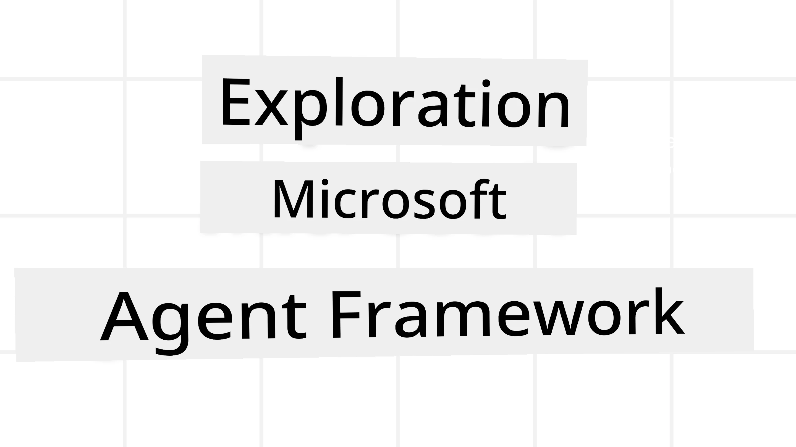
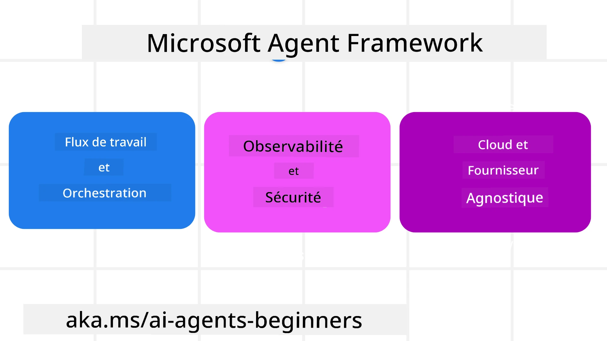
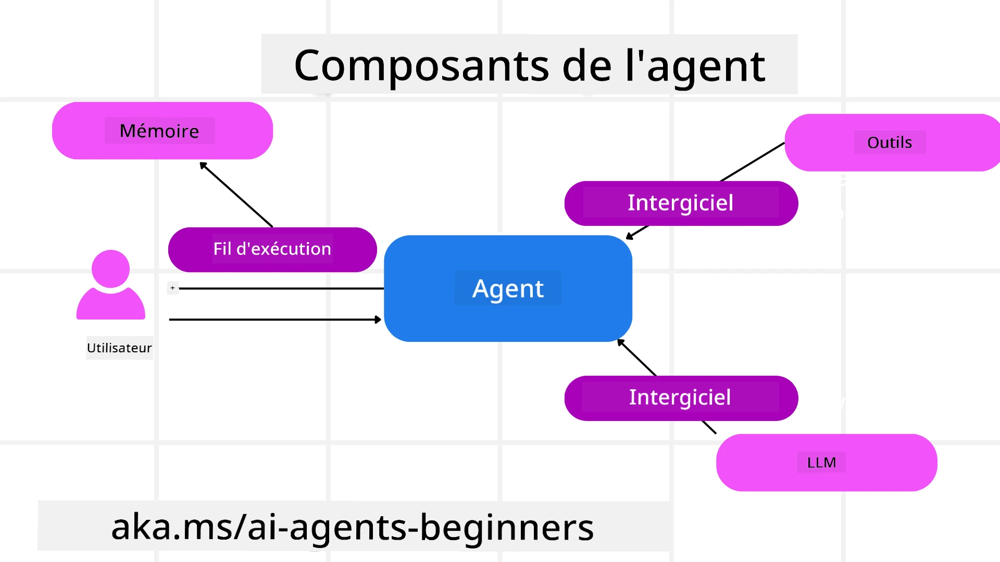

# Exploration du Microsoft Agent Framework



### Introduction

Cette leçon couvrira :

- Comprendre le Microsoft Agent Framework : fonctionnalités clés et valeur  
- Explorer les concepts clés du Microsoft Agent Framework
- Modèles avancés MAF : workflows, middleware et mémoire

## Objectifs d'apprentissage

Après avoir terminé cette leçon, vous saurez comment :

- Construire des agents d'IA prêts pour la production avec le Microsoft Agent Framework
- Appliquer les fonctionnalités principales du Microsoft Agent Framework à vos cas d'utilisation agentiques
- Utiliser des modèles avancés incluant les workflows, middleware et observabilité

## Exemples de code

Des exemples de code pour [Microsoft Agent Framework (MAF)](https://aka.ms/ai-agents-beginners/agent-framewrok) se trouvent dans ce dépôt sous les fichiers `xx-python-agent-framework` et `xx-dotnet-agent-framework`.

## Comprendre le Microsoft Agent Framework



[Microsoft Agent Framework (MAF)](https://aka.ms/ai-agents-beginners/agent-framewrok) est le cadre unifié de Microsoft pour construire des agents d’IA. Il offre la flexibilité nécessaire pour répondre à la grande variété de cas d’utilisation agentiques observés tant en production qu’en environnement de recherche, notamment :

- **Orchestration d’agents séquentiels** dans les scénarios où des workflows étape par étape sont nécessaires.
- **Orchestration concurrente** dans les scénarios où les agents doivent accomplir des tâches simultanément.
- **Orchestration en chat de groupe** dans les scénarios où les agents collaborent ensemble sur une tâche.
- **Orchestration de passage de relais** dans les scénarios où les agents se transmettent la tâche à mesure que les sous-tâches sont terminées.
- **Orchestration magnétique** dans les scénarios où un agent manager crée et modifie une liste de tâches et gère la coordination des sous-agents pour compléter la tâche.

Pour déployer des agents d’IA en production, MAF inclut également des fonctionnalités pour :

- **Observabilité** grâce à l’utilisation d’OpenTelemetry où chaque action de l’agent d’IA y compris invocation d’outils, étapes d’orchestration, flux de raisonnement et surveillance des performances via les tableaux de bord Microsoft Foundry.
- **Sécurité** en hébergeant les agents nativement sur Microsoft Foundry qui comprend des contrôles de sécurité tels que l’accès basé sur les rôles, la gestion des données privées et la sécurité intégrée du contenu.
- **Durabilité** car les threads et workflows d’agents peuvent être mis en pause, repris et récupérer des erreurs ce qui permet des processus de longue durée.
- **Contrôle** car les workflows humains dans la boucle sont supportés où des tâches sont marquées comme nécessitant une approbation humaine.

Microsoft Agent Framework vise aussi à être interopérable en :

- **Étant indépendant du cloud** - Les agents peuvent fonctionner dans des conteneurs, en local et sur différents clouds.
- **Étant indépendant du fournisseur** - Les agents peuvent être créés via le SDK préféré, incluant Azure OpenAI et OpenAI.
- **Intégrant des standards ouverts** - Les agents peuvent utiliser des protocoles tels que Agent-to-Agent (A2A) et Model Context Protocol (MCP) pour découvrir et utiliser d'autres agents et outils.
- **Plugins et connecteurs** - Des connexions peuvent être établies avec des services de données et de mémoire tels que Microsoft Fabric, SharePoint, Pinecone et Qdrant.

Voyons comment ces fonctionnalités sont appliquées à certains des concepts clés de Microsoft Agent Framework.

## Concepts clés du Microsoft Agent Framework

### Agents



**Création d’agents**

La création d’agent se fait en définissant le service d’inférence (fournisseur LLM), un ensemble d’instructions que l’agent d’IA doit suivre, et un `name` assigné :

```python
agent = AzureOpenAIChatClient(credential=AzureCliCredential()).create_agent( instructions="You are good at recommending trips to customers based on their preferences.", name="TripRecommender" )
```

Le code ci-dessus utilise `Azure OpenAI` mais les agents peuvent être créés avec divers services incluant `Microsoft Foundry Agent Service` :

```python
AzureAIAgentClient(async_credential=credential).create_agent( name="HelperAgent", instructions="You are a helpful assistant." ) as agent
```

APIs OpenAI `Responses`, `ChatCompletion`

```python
agent = OpenAIResponsesClient().create_agent( name="WeatherBot", instructions="You are a helpful weather assistant.", )
```

```python
agent = OpenAIChatClient().create_agent( name="HelpfulAssistant", instructions="You are a helpful assistant.", )
```

ou [MiniMax](https://platform.minimaxi.com/), qui fournit une API compatible OpenAI avec de grandes fenêtres de contexte (jusqu’à 204K tokens) :

```python
agent = OpenAIChatClient(base_url="https://api.minimax.io/v1", api_key=os.environ["MINIMAX_API_KEY"], model_id="MiniMax-M2.7").create_agent( name="HelpfulAssistant", instructions="You are a helpful assistant.", )
```

ou des agents distants utilisant le protocole A2A :

```python
agent = A2AAgent( name=agent_card.name, description=agent_card.description, agent_card=agent_card, url="https://your-a2a-agent-host" )
```

**Exécution des agents**

Les agents sont lancés en utilisant les méthodes `.run` ou `.run_stream` pour des réponses non-streaming ou streaming.

```python
result = await agent.run("What are good places to visit in Amsterdam?")
print(result.text)
```

```python
async for update in agent.run_stream("What are the good places to visit in Amsterdam?"):
    if update.text:
        print(update.text, end="", flush=True)

```

Chaque exécution d’agent peut aussi disposer d’options pour personnaliser des paramètres tels que `max_tokens` utilisés par l’agent, les `tools` que l’agent peut appeler, et même le `model` utilisé par l’agent.

Cela est utile dans les cas où des modèles ou outils spécifiques sont nécessaires pour accomplir la tâche d’un utilisateur.

**Outils**

Les outils peuvent être définis à la fois lors de la définition de l’agent :

```python
def get_attractions( location: Annotated[str, Field(description="The location to get the top tourist attractions for")], ) -> str: """Get the top tourist attractions for a given location.""" return f"The top attractions for {location} are." 


# Lors de la création directe d'un ChatAgent

agent = ChatAgent( chat_client=OpenAIChatClient(), instructions="You are a helpful assistant", tools=[get_attractions]

```

et également lors de l’exécution de l’agent :

```python

result1 = await agent.run( "What's the best place to visit in Seattle?", tools=[get_attractions] # Outil fourni uniquement pour cette exécution )
```

**Threads d’agents**

Les threads d’agents sont utilisés pour gérer des conversations multi-tours. Les threads peuvent être créés soit par :

- Utilisation de `get_new_thread()` qui permet de sauvegarder le thread dans le temps
- Création automatique d’un thread lors de l’exécution d’un agent, et le thread ne dure que durant la session actuelle.

Pour créer un thread, le code est le suivant :

```python
# Créez un nouveau thread.
thread = agent.get_new_thread() # Exécutez l'agent avec le thread.
response = await agent.run("Hello, I am here to help you book travel. Where would you like to go?", thread=thread)

```

Vous pouvez ensuite sérialiser le thread pour le stocker et l’utiliser ultérieurement :

```python
# Créer un nouveau fil.
thread = agent.get_new_thread() 

# Exécuter l'agent avec le fil.

response = await agent.run("Hello, how are you?", thread=thread) 

# Sérialiser le fil pour le stockage.

serialized_thread = await thread.serialize() 

# Désérialiser l'état du fil après le chargement depuis le stockage.

resumed_thread = await agent.deserialize_thread(serialized_thread)
```

**Middleware d’agent**

Les agents interagissent avec les outils et LLMs pour accomplir les tâches des utilisateurs. Dans certains scénarios, on souhaite exécuter ou suivre ce qui se passe entre ces interactions. Le middleware d’agent permet cela via :

*Middleware fonctionnel*

Ce middleware permet d’exécuter une action entre l’agent et une fonction/outil qu’il appelle. Un exemple d’utilisation est de faire des logs lors d’un appel de fonction.

Dans le code ci-dessous, `next` définit si le middleware suivant ou la fonction réelle doit être appelé.

```python
async def logging_function_middleware(
    context: FunctionInvocationContext,
    next: Callable[[FunctionInvocationContext], Awaitable[None]],
) -> None:
    """Function middleware that logs function execution."""
    # Pré-traitement : Enregistrer avant l'exécution de la fonction
    print(f"[Function] Calling {context.function.name}")

    # Continuer vers le middleware suivant ou l'exécution de la fonction
    await next(context)

    # Post-traitement : Enregistrer après l'exécution de la fonction
    print(f"[Function] {context.function.name} completed")
```

*Middleware de chat*

Ce middleware permet d’exécuter ou logger une action entre l’agent et les requêtes entre le LLM.

Celui-ci contient des informations importantes telles que les `messages` envoyés au service d’IA.

```python
async def logging_chat_middleware(
    context: ChatContext,
    next: Callable[[ChatContext], Awaitable[None]],
) -> None:
    """Chat middleware that logs AI interactions."""
    # Pré-traitement : Journaliser avant l'appel à l'IA
    print(f"[Chat] Sending {len(context.messages)} messages to AI")

    # Continuer vers le middleware ou le service IA suivant
    await next(context)

    # Post-traitement : Journaliser après la réponse de l'IA
    print("[Chat] AI response received")

```

**Mémoire d’agent**

Comme vu dans la leçon `Agentic Memory`, la mémoire est un élément important pour permettre à l’agent d’opérer sur différents contextes. MAF propose plusieurs types de mémoires :

*Stockage en mémoire vive*

C’est la mémoire stockée dans les threads durant l’exécution de l’application.

```python
# Créez un nouveau thread.
thread = agent.get_new_thread() # Exécutez l'agent avec le thread.
response = await agent.run("Hello, I am here to help you book travel. Where would you like to go?", thread=thread)
```

*Messages persistants*

Cette mémoire est utilisée pour conserver l’historique de conversation à travers différentes sessions. Elle est définie via le `chat_message_store_factory` :

```python
from agent_framework import ChatMessageStore

# Créer un magasin de messages personnalisé
def create_message_store():
    return ChatMessageStore()

agent = ChatAgent(
    chat_client=OpenAIChatClient(),
    instructions="You are a Travel assistant.",
    chat_message_store_factory=create_message_store
)

```

*Mémoire dynamique*

Cette mémoire est ajoutée au contexte avant que les agents ne soient lancés. Ces mémoires peuvent être stockées dans des services externes tels que mem0 :

```python
from agent_framework.mem0 import Mem0Provider

# Utilisation de Mem0 pour des capacités mémoire avancées
memory_provider = Mem0Provider(
    api_key="your-mem0-api-key",
    user_id="user_123",
    application_id="my_app"
)

agent = ChatAgent(
    chat_client=OpenAIChatClient(),
    instructions="You are a helpful assistant with memory.",
    context_providers=memory_provider
)

```

**Observabilité d’agent**

L’observabilité est importante pour construire des systèmes agentiques fiables et maintenables. MAF s’intègre à OpenTelemetry pour fournir traçage et mesures pour une meilleure observabilité.

```python
from agent_framework.observability import get_tracer, get_meter

tracer = get_tracer()
meter = get_meter()
with tracer.start_as_current_span("my_custom_span"):
    # faire quelque chose
    pass
counter = meter.create_counter("my_custom_counter")
counter.add(1, {"key": "value"})
```

### Workflows

MAF propose des workflows qui sont des étapes prédéfinies pour compléter une tâche et incluent des agents d’IA comme composants dans ces étapes.

Les workflows sont composés de différents éléments permettant un meilleur contrôle du flux. Les workflows permettent également l’**orchestration multi-agent** et le **checkpointing** pour sauvegarder l’état des workflows.

Les composants principaux d’un workflow sont :

**Exécuteurs**

Les exécuteurs reçoivent des messages d’entrée, exécutent leurs tâches assignées, puis produisent un message de sortie. Cela fait avancer le workflow vers l’achèvement de la tâche globale. Les exécuteurs peuvent être soit des agents IA soit de la logique personnalisée.

**Arêtes**

Les arêtes servent à définir le flux des messages dans un workflow. Elles peuvent être :

*Arêtes directes* - Connexions simples un-à-un entre exécuteurs :

```python
from agent_framework import WorkflowBuilder

builder = WorkflowBuilder()
builder.add_edge(source_executor, target_executor)
builder.set_start_executor(source_executor)
workflow = builder.build()
```

*Arêtes conditionnelles* - Activées après qu’une condition soit remplie. Par exemple, quand des chambres d’hôtel ne sont pas disponibles, un exécuteur peut suggérer d’autres options.

*Arêtes switch-case* - Acheminent les messages vers différents exécuteurs selon des conditions définies. Par exemple, si un client voyageur a un accès prioritaire, ses tâches seront traitées via un autre workflow.

*Arêtes fan-out* - Envoient un message à plusieurs cibles.

*Arêtes fan-in* - Collectent plusieurs messages de différents exécuteurs et les envoient à une unique cible.

**Événements**

Pour offrir une meilleure observabilité des workflows, MAF propose des événements intégrés pour l’exécution incluant :

- `WorkflowStartedEvent`  - Début d’exécution du workflow
- `WorkflowOutputEvent` - Le workflow produit une sortie
- `WorkflowErrorEvent` - Le workflow rencontre une erreur
- `ExecutorInvokeEvent`  - L’exécuteur commence son traitement
- `ExecutorCompleteEvent`  -  L’exécuteur termine son traitement
- `RequestInfoEvent` - Une requête est émise

## Modèles avancés MAF

Les sections ci-dessus couvrent les concepts clés du Microsoft Agent Framework. À mesure que vous construisez des agents plus complexes, voici quelques modèles avancés à considérer :

- **Composition de middleware** : Enchaînez plusieurs gestionnaires de middleware (logs, authentification, limitation de débit) en utilisant le middleware fonction et chat pour un contrôle fin du comportement des agents.
- **Checkpointing de workflow** : Utilisez les événements de workflow et la sérialisation pour sauvegarder et reprendre des processus d’agents longs.
- **Sélection dynamique d’outils** : Combinez RAG sur les descriptions d’outils avec l’enregistrement des outils MAF pour présenter uniquement les outils pertinents par requête.
- **Passage de relais multi-agent** : Utilisez les arêtes de workflow et le routage conditionnel pour orchestrer les passations entre agents spécialisés.

## Exemples de code

Des exemples de code pour Microsoft Agent Framework se trouvent dans ce dépôt sous les fichiers `xx-python-agent-framework` et `xx-dotnet-agent-framework`.

## Vous avez plus de questions sur Microsoft Agent Framework ?

Rejoignez le [Microsoft Foundry Discord](https://aka.ms/ai-agents/discord) pour rencontrer d’autres apprenants, participer à des heures de bureau et obtenir des réponses à vos questions sur les agents d’IA.

---

<!-- CO-OP TRANSLATOR DISCLAIMER START -->
**Avertissement** :  
Ce document a été traduit à l'aide du service de traduction par IA [Co-op Translator](https://github.com/Azure/co-op-translator). Bien que nous nous efforcions d'assurer l'exactitude, veuillez noter que les traductions automatisées peuvent contenir des erreurs ou des inexactitudes. Le document original dans sa langue d'origine doit être considéré comme la source faisant autorité. Pour les informations critiques, une traduction professionnelle humaine est recommandée. Nous ne sommes pas responsables des malentendus ou des mauvaises interprétations résultant de l'utilisation de cette traduction.
<!-- CO-OP TRANSLATOR DISCLAIMER END -->