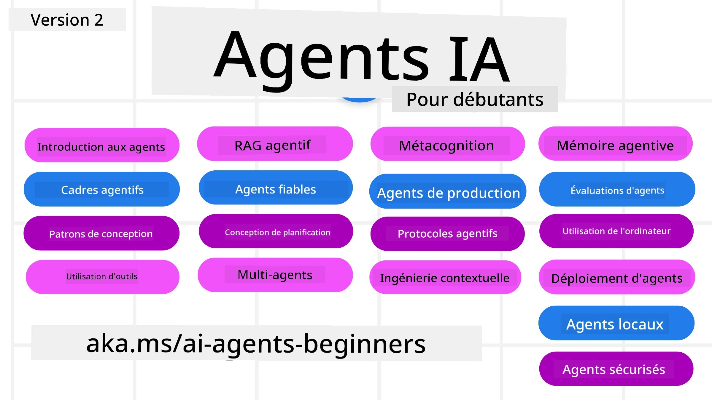

# Agents IA pour débutants - Un cours



## Un cours enseignant tout ce que vous devez savoir pour commencer à créer des agents IA

[](https://github.com/microsoft/ai-agents-for-beginners/blob/master/LICENSE?WT.mc_id=academic-105485-koreyst)
[](https://GitHub.com/microsoft/ai-agents-for-beginners/graphs/contributors/?WT.mc_id=academic-105485-koreyst)
[](https://GitHub.com/microsoft/ai-agents-for-beginners/issues/?WT.mc_id=academic-105485-koreyst)
[](https://GitHub.com/microsoft/ai-agents-for-beginners/pulls/?WT.mc_id=academic-105485-koreyst)
[](http://makeapullrequest.com?WT.mc_id=academic-105485-koreyst)

### 🌐 Support multilingue

#### Pris en charge via GitHub Action (Automatisé & Toujours à jour)

<!-- CO-OP TRANSLATOR LANGUAGES TABLE START -->
[Arabe](../ar/README.md) | [Bengali](../bn/README.md) | [Bulgare](../bg/README.md) | [Birman (Myanmar)](../my/README.md) | [Chinois (Simplifié)](../zh-CN/README.md) | [Chinois (Traditionnel, Hong Kong)](../zh-HK/README.md) | [Chinois (Traditionnel, Macau)](../zh-MO/README.md) | [Chinois (Traditionnel, Taïwan)](../zh-TW/README.md) | [Croate](../hr/README.md) | [Tchèque](../cs/README.md) | [Danois](../da/README.md) | [Néerlandais](../nl/README.md) | [Estonien](../et/README.md) | [Finnois](../fi/README.md) | [Français](./README.md) | [Allemand](../de/README.md) | [Grec](../el/README.md) | [Hébreu](../he/README.md) | [Hindi](../hi/README.md) | [Hongrois](../hu/README.md) | [Indonésien](../id/README.md) | [Italien](../it/README.md) | [Japonais](../ja/README.md) | [Kannada](../kn/README.md) | [Khmer](../km/README.md) | [Coréen](../ko/README.md) | [Lituanien](../lt/README.md) | [Malais](../ms/README.md) | [Malayalam](../ml/README.md) | [Marathi](../mr/README.md) | [Népalais](../ne/README.md) | [Pidgin nigérian](../pcm/README.md) | [Norvégien](../no/README.md) | [Persan (Farsi)](../fa/README.md) | [Polonais](../pl/README.md) | [Portugais (Brésil)](../pt-BR/README.md) | [Portugais (Portugal)](../pt-PT/README.md) | [Punjabi (Gurmukhi)](../pa/README.md) | [Roumain](../ro/README.md) | [Russe](../ru/README.md) | [Serbe (Cyrillique)](../sr/README.md) | [Slovaque](../sk/README.md) | [Slovène](../sl/README.md) | [Espagnol](../es/README.md) | [Swahili](../sw/README.md) | [Suédois](../sv/README.md) | [Tagalog (Philippin)](../tl/README.md) | [Tamoul](../ta/README.md) | [Telugu](../te/README.md) | [Thaï](../th/README.md) | [Turc](../tr/README.md) | [Ukrainien](../uk/README.md) | [Ourdou](../ur/README.md) | [Vietnamien](../vi/README.md)

> **Préférez cloner localement ?**
>
> Ce dépôt inclut plus de 50 traductions de langues qui augmentent significativement la taille de téléchargement. Pour cloner sans les traductions, utilisez le sparse checkout :
>
> **Bash / macOS / Linux :**
> ```bash
> git clone --filter=blob:none --sparse https://github.com/microsoft/ai-agents-for-beginners.git
> cd ai-agents-for-beginners
> git sparse-checkout set --no-cone '/*' '!translations' '!translated_images'
> ```
>
> **CMD (Windows) :**
> ```cmd
> git clone --filter=blob:none --sparse https://github.com/microsoft/ai-agents-for-beginners.git
> cd ai-agents-for-beginners
> git sparse-checkout set --no-cone "/*" "!translations" "!translated_images"
> ```
>
> Cela vous donne tout ce dont vous avez besoin pour suivre le cours avec un téléchargement bien plus rapide.
<!-- CO-OP TRANSLATOR LANGUAGES TABLE END -->

**Si vous souhaitez que des langues supplémentaires soient prises en charge, elles sont listées [ici](https://github.com/Azure/co-op-translator/blob/main/getting_started/supported-languages.md)**

[](https://GitHub.com/microsoft/ai-agents-for-beginners/watchers/?WT.mc_id=academic-105485-koreyst)
[](https://GitHub.com/microsoft/ai-agents-for-beginners/network/?WT.mc_id=academic-105485-koreyst)
[](https://GitHub.com/microsoft/ai-agents-for-beginners/stargazers/?WT.mc_id=academic-105485-koreyst)

[](https://discord.gg/nTYy5BXMWG)


## 🌱 Pour commencer

Ce cours comprend des leçons couvrant les fondamentaux de la création d’agents IA. Chaque leçon traite de son propre sujet, commencez donc où vous voulez !

Ce cours est disponible en plusieurs langues. Rendez-vous sur notre [page des langues disponibles ici](#-support-multilingue).

Si c’est votre première fois à créer avec des modèles IA génératifs, consultez notre cours [IA générative pour débutants](https://aka.ms/genai-beginners), qui comprend 21 leçons sur la création avec GenAI.

N’oubliez pas de [mettre une étoile (🌟) sur ce dépôt](https://docs.github.com/en/get-started/exploring-projects-on-github/saving-repositories-with-stars?WT.mc_id=academic-105485-koreyst) et de [forker ce dépôt](https://github.com/microsoft/ai-agents-for-beginners/fork) pour exécuter le code.

### Rencontrez d’autres apprenants, obtenez des réponses à vos questions

Si vous êtes bloqué ou avez des questions sur la création d’agents IA, rejoignez notre canal Discord dédié dans le [Microsoft Foundry Discord](https://aka.ms/ai-agents/discord).

### Ce dont vous avez besoin

Chaque leçon de ce cours comprend des exemples de code, disponibles dans le dossier code_samples. Vous pouvez [forker ce dépôt](https://github.com/microsoft/ai-agents-for-beginners/fork) pour créer votre propre copie.

Les exemples de code dans ces exercices utilisent Microsoft Agent Framework avec Azure AI Foundry Agent Service V2 :

- [Microsoft Foundry](https://aka.ms/ai-agents-beginners/ai-foundry) - Compte Azure requis

Ce cours utilise les frameworks et services d’agents IA suivants de Microsoft :

- [Microsoft Agent Framework (MAF)](https://aka.ms/ai-agents-beginners/agent-framewrok)
- [Azure AI Foundry Agent Service V2](https://aka.ms/ai-agents-beginners/ai-agent-service)

Certains exemples de code supportent aussi des fournisseurs alternatifs compatibles OpenAI comme [MiniMax](https://platform.minimaxi.com/), qui propose des modèles à grande capacité contextuelle (jusqu’à 204K tokens). Voir le [paramétrage du cours](./00-course-setup/README.md) pour les détails de configuration.

Pour plus d’informations sur l’exécution du code pour ce cours, rendez-vous au [paramétrage du cours](./00-course-setup/README.md).

## 🙏 Vous souhaitez aider ?

Vous avez des suggestions ou avez trouvé des fautes d’orthographe ou d’erreurs de code ? [Ouvrez un problème](https://github.com/microsoft/ai-agents-for-beginners/issues?WT.mc_id=academic-105485-koreyst) ou [créez une pull request](https://github.com/microsoft/ai-agents-for-beginners/pulls?WT.mc_id=academic-105485-koreyst)


## 📂 Chaque leçon comprend

- Une leçon écrite située dans le README et une courte vidéo
- Des exemples de code Python utilisant Microsoft Agent Framework avec Azure AI Foundry
- Des liens vers des ressources supplémentaires pour continuer votre apprentissage


## 🗃️ Leçons

| **Leçon**                                   | **Texte & Code**                                    | **Vidéo**                                                  | **Apprentissage complémentaire**                                                      |
|----------------------------------------------|----------------------------------------------------|------------------------------------------------------------|----------------------------------------------------------------------------------------|
| Introduction aux agents IA et cas d’utilisation | [Lien](./01-intro-to-ai-agents/README.md)          | [Vidéo](https://youtu.be/3zgm60bXmQk?si=z8QygFvYQv-9WtO1)  | [Lien](https://aka.ms/ai-agents-beginners/collection?WT.mc_id=academic-105485-koreyst) |
| Explorer les frameworks agents IA             | [Lien](./02-explore-agentic-frameworks/README.md)  | [Vidéo](https://youtu.be/ODwF-EZo_O8?si=Vawth4hzVaHv-u0H)  | [Lien](https://aka.ms/ai-agents-beginners/collection?WT.mc_id=academic-105485-koreyst) |
| Comprendre les modèles de conception agents IA | [Lien](./03-agentic-design-patterns/README.md)     | [Vidéo](https://youtu.be/m9lM8qqoOEA?si=BIzHwzstTPL8o9GF)  | [Lien](https://aka.ms/ai-agents-beginners/collection?WT.mc_id=academic-105485-koreyst) |
| Modèle de conception pour l’utilisation d’outils | [Lien](./04-tool-use/README.md)                    | [Vidéo](https://youtu.be/vieRiPRx-gI?si=2z6O2Xu2cu_Jz46N)  | [Lien](https://aka.ms/ai-agents-beginners/collection?WT.mc_id=academic-105485-koreyst) |
| RAG agentique                                 | [Lien](./05-agentic-rag/README.md)                 | [Vidéo](https://youtu.be/WcjAARvdL7I?si=gKPWsQpKiIlDH9A3)  | [Lien](https://aka.ms/ai-agents-beginners/collection?WT.mc_id=academic-105485-koreyst) |
| Construire des agents IA fiables               | [Lien](./06-building-trustworthy-agents/README.md) | [Vidéo](https://youtu.be/iZKkMEGBCUQ?si=jZjpiMnGFOE9L8OK ) | [Lien](https://aka.ms/ai-agents-beginners/collection?WT.mc_id=academic-105485-koreyst) |
| Modèle de conception de planification          | [Lien](./07-planning-design/README.md)             | [Vidéo](https://youtu.be/kPfJ2BrBCMY?si=6SC_iv_E5-mzucnC)  | [Lien](https://aka.ms/ai-agents-beginners/collection?WT.mc_id=academic-105485-koreyst) |
| Modèle de conception multi-agent                | [Lien](./08-multi-agent/README.md)                 | [Vidéo](https://youtu.be/V6HpE9hZEx0?si=rMgDhEu7wXo2uo6g)  | [Lien](https://aka.ms/ai-agents-beginners/collection?WT.mc_id=academic-105485-koreyst) |
| Modèle de conception méta-cognition          | [Lien](./09-metacognition/README.md)               | [Vidéo](https://youtu.be/His9R6gw6Ec?si=8gck6vvdSNCt6OcF)  | [Lien](https://aka.ms/ai-agents-beginners/collection?WT.mc_id=academic-105485-koreyst) |
| Agents IA en production                       | [Lien](./10-ai-agents-production/README.md)        | [Vidéo](https://youtu.be/l4TP6IyJxmQ?si=31dnhexRo6yLRJDl)  | [Lien](https://aka.ms/ai-agents-beginners/collection?WT.mc_id=academic-105485-koreyst) |
| Utilisation des protocoles agentiques (MCP, A2A et NLWeb) | [Lien](./11-agentic-protocols/README.md)           | [Vidéo](https://youtu.be/X-Dh9R3Opn8)                                 | [Lien](https://aka.ms/ai-agents-beginners/collection?WT.mc_id=academic-105485-koreyst) |
| Ingénierie du contexte pour agents IA        | [Lien](./12-context-engineering/README.md)         | [Vidéo](https://youtu.be/F5zqRV7gEag)                                 | [Lien](https://aka.ms/ai-agents-beginners/collection?WT.mc_id=academic-105485-koreyst) |
| Gestion de la mémoire agentique               | [Lien](./13-agent-memory/README.md)     |      [Vidéo](https://youtu.be/QrYbHesIxpw?si=vZkVwKrQ4ieCcIPx)                                                      |                                                                                        |
| Exploration du Microsoft Agent Framework      | [Lien](./14-microsoft-agent-framework/README.md)                            |                                                            |                                                                                        |
| Création d’Agents d’Utilisation Informatique (CUA) | [Lien](./15-browser-use/README.md)     |                                                            | [Lien](https://docs.browser-use.com/examples/templates/playwright-integration)         |
| Déploiement d’agents évolutifs                | Bientôt disponible                            |                                                            |                                                                                        |
| Création d’agents IA locaux                    | Bientôt disponible                               |                                                            |                                                                                        |
| Sécurisation des agents IA                     | Bientôt disponible                               |                                                            |                                                                                        |

## 🎒 Autres cours

Notre équipe produit d’autres cours ! Découvrez :

<!-- CO-OP TRANSLATOR OTHER COURSES START -->
### LangChain
[](https://aka.ms/langchain4j-for-beginners)
[](https://aka.ms/langchainjs-for-beginners?WT.mc_id=m365-94501-dwahlin)
[](https://github.com/microsoft/langchain-for-beginners?WT.mc_id=m365-94501-dwahlin)
---

### Azure / Edge / MCP / Agents
[](https://github.com/microsoft/AZD-for-beginners?WT.mc_id=academic-105485-koreyst)
[](https://github.com/microsoft/edgeai-for-beginners?WT.mc_id=academic-105485-koreyst)
[](https://github.com/microsoft/mcp-for-beginners?WT.mc_id=academic-105485-koreyst)
[](https://github.com/microsoft/ai-agents-for-beginners?WT.mc_id=academic-105485-koreyst)

---
 
### Série IA générative
[](https://github.com/microsoft/generative-ai-for-beginners?WT.mc_id=academic-105485-koreyst)
[-9333EA?style=for-the-badge&labelColor=E5E7EB&color=9333EA)](https://github.com/microsoft/Generative-AI-for-beginners-dotnet?WT.mc_id=academic-105485-koreyst)
[-C084FC?style=for-the-badge&labelColor=E5E7EB&color=C084FC)](https://github.com/microsoft/generative-ai-for-beginners-java?WT.mc_id=academic-105485-koreyst)
[-E879F9?style=for-the-badge&labelColor=E5E7EB&color=E879F9)](https://github.com/microsoft/generative-ai-with-javascript?WT.mc_id=academic-105485-koreyst)

---
 
### Apprentissage fondamental
[](https://aka.ms/ml-beginners?WT.mc_id=academic-105485-koreyst)
[](https://aka.ms/datascience-beginners?WT.mc_id=academic-105485-koreyst)
[](https://aka.ms/ai-beginners?WT.mc_id=academic-105485-koreyst)
[](https://github.com/microsoft/Security-101?WT.mc_id=academic-96948-sayoung)
[](https://aka.ms/webdev-beginners?WT.mc_id=academic-105485-koreyst)
[](https://aka.ms/iot-beginners?WT.mc_id=academic-105485-koreyst)
[](https://github.com/microsoft/xr-development-for-beginners?WT.mc_id=academic-105485-koreyst)

---
 
### Série Copilot
[](https://aka.ms/GitHubCopilotAI?WT.mc_id=academic-105485-koreyst)
[](https://github.com/microsoft/mastering-github-copilot-for-dotnet-csharp-developers?WT.mc_id=academic-105485-koreyst)
[](https://github.com/microsoft/CopilotAdventures?WT.mc_id=academic-105485-koreyst)
<!-- CO-OP TRANSLATOR OTHER COURSES END -->

## 🌟 Remerciements à la communauté

Merci à [Shivam Goyal](https://www.linkedin.com/in/shivam2003/) pour avoir contribué d’importants exemples de code démontrant Agentic RAG.

## Contribution

Ce projet accueille contributions et suggestions. La plupart des contributions exigent que vous acceptiez un
Accord de Licence de Contributeur (CLA) déclarant que vous avez le droit, et que vous accordez effectivement,
les droits d’utiliser votre contribution. Pour plus de détails, visitez <https://cla.opensource.microsoft.com>.

Lorsque vous soumettez une pull request, un bot CLA détermine automatiquement si vous devez fournir
un CLA et décore la PR en conséquence (ex. : contrôle d’état, commentaire). Suivez simplement les instructions
fournies par le bot. Vous ne devrez le faire qu’une seule fois pour tous les repos utilisant notre CLA.

Ce projet a adopté le [Code de conduite open source de Microsoft](https://opensource.microsoft.com/codeofconduct/).
Pour plus d’informations, consultez la [FAQ du Code de conduite](https://opensource.microsoft.com/codeofconduct/faq/) ou
contactez [opencode@microsoft.com](mailto:opencode@microsoft.com) pour toute question ou commentaire supplémentaire.

## Marques déposées

Ce projet peut contenir des marques déposées ou logos de projets, produits ou services. L’utilisation autorisée des marques ou logos Microsoft
est soumise et doit respecter les
[Directives sur les marques et la marque commerciale de Microsoft](https://www.microsoft.com/legal/intellectualproperty/trademarks/usage/general).
L’utilisation des marques ou logos Microsoft dans des versions modifiées de ce projet ne doit pas créer de confusion ni laisser entendre un parrainage Microsoft.
Toute utilisation de marques ou logos tiers est soumise aux politiques de ces tiers.

## Obtenir de l’aide


Si vous êtes bloqué ou avez des questions sur la création d’applications IA, rejoignez :

[](https://aka.ms/foundry/discord)

Si vous avez des retours sur le produit ou des erreurs lors de la création, visitez :

[](https://aka.ms/foundry/forum)

---

<!-- CO-OP TRANSLATOR DISCLAIMER START -->
**Avertissement** :  
Ce document a été traduit à l'aide du service de traduction automatique [Co-op Translator](https://github.com/Azure/co-op-translator). Bien que nous nous efforçons d'assurer l'exactitude, veuillez noter que les traductions automatiques peuvent contenir des erreurs ou des inexactitudes. Le document original dans sa langue native doit être considéré comme la source faisant autorité. Pour les informations critiques, il est recommandé de recourir à une traduction humaine professionnelle. Nous ne sommes pas responsables des malentendus ou des erreurs d'interprétation résultant de l'utilisation de cette traduction.
<!-- CO-OP TRANSLATOR DISCLAIMER END -->