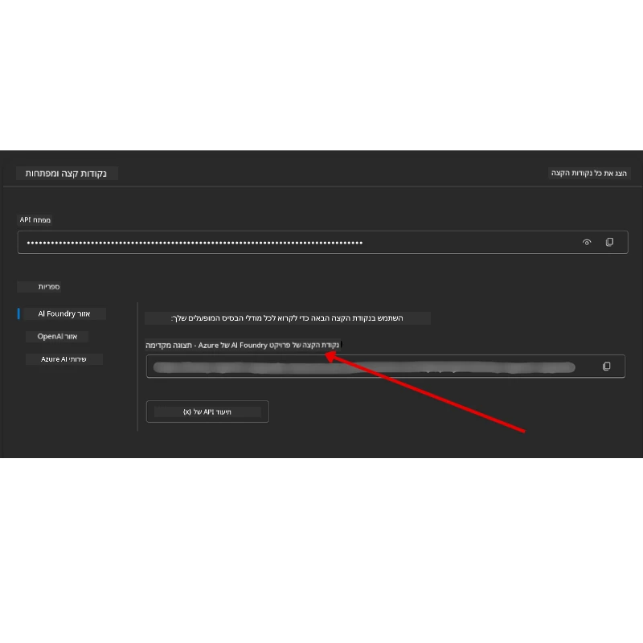

# הגדרת הקורס

## מבוא

שיעור זה יעסוק כיצד להריץ את דוגמאות הקוד של הקורס הזה.

## הצטרף ללומדים אחרים וקבל עזרה

לפני שתתחיל לשכפל את המאגר שלך, הצטרף ל-[ערוץ Discord של AI Agents למתחילים](https://aka.ms/ai-agents/discord) כדי לקבל עזרה בהגדרות, לשאול שאלות על הקורס, או להתחבר ללומדים אחרים.

## שכפל או הפעל Fork למאגר הזה

כדי להתחיל, אנא שכפל או הפעל Fork למאגר GitHub. זה ייצור גרסה משלך של חומרי הקורס כך שתוכל להריץ, לבדוק, ולשנות את הקוד!

ניתן לעשות זאת על ידי לחיצה על הקישור ל- <a href="https://github.com/microsoft/ai-agents-for-beginners/fork" target="_blank">להפעיל Fork למאגר</a>

כעת אמורה להיות לך גרסה משוכפלת שלך של הקורס בקישור הבא:


### שכפול שטחי (מומלץ לסדנאות / Codespaces)

  >מאגר מלא יכול להיות גדול (~3GB) כשאתה מוריד את ההיסטוריה המלאה ואת כל הקבצים. אם אתה משתתף רק בסדנה או צריך רק תיקיות של מספר שיעורים, שכפול שטחי (או שכפול סלקטיבי) מונע את רוב ההורדה הזו על ידי קיצור ההיסטוריה ו/או דילוג על בלובים.

#### שכפול שטחי מהיר — היסטוריה מינימלית, כל הקבצים

החלף את `<your-username>` בפקודות למטה עם כתובת ה-Fork שלך (או את כתובת המקור אם אתה מעדיף).

כדי לשכפל רק את ההיסטוריה של הקומיט האחרון (הורדה קטנה):

```bash|powershell
git clone --depth 1 https://github.com/<your-username>/ai-agents-for-beginners.git
```

כדי לשכפל סניף מסוים:

```bash|powershell
git clone --depth 1 --branch <branch-name> https://github.com/<your-username>/ai-agents-for-beginners.git
```

#### שכפול חלקי (חסכוני) — בלובים מינימליים + רק תיקיות נבחרות

זה משתמש בשכפול חלקי וב-sparse-checkout (דורש Git 2.25+ ומומלץ להשתמש ב-Git מודרני עם תמיכה בשכפול חלקי):

```bash|powershell
git clone --depth 1 --filter=blob:none --sparse https://github.com/<your-username>/ai-agents-for-beginners.git
```

עבור לתיקיית המאגר:

```bash|powershell
cd ai-agents-for-beginners
```

אחר כך ציין אילו תיקיות אתה רוצה (הדוגמה מטה מציגה שתי תיקיות):

```bash|powershell
git sparse-checkout set 00-course-setup 01-intro-to-ai-agents
```

אחרי השכפול ואימות הקבצים, אם אתה צריך רק את הקבצים ורוצה לשחרר מרחב אחסון (בלי היסטוריית גיט), מחק את מטא-דאטת המאגר (💀 בלתי הפיך — תאבד את כל פונקציות Git: לא יהיו קומיטים, משיכות, דחיפות או גישה להיסטוריה).

```bash
# זש/באש
rm -rf .git
```

```powershell
# פאוורשל
Remove-Item -Recurse -Force .git
```

#### שימוש ב-GitHub Codespaces (מומלץ להימנע מהורדות גדולות מקומיות)

- צור Codespace חדש עבור המאגר דרך [ממשק GitHub](https://github.com/codespaces).

- במסוף של ה-Codespace שיצרת הרץ אחת מהפקודות לשכפול שטחי/חסכוני למעלה כדי להביא רק את תיקיות השיעור שאתה צריך לסביבת העבודה של Codespace.
- אופציונלי: לאחר השכפול ב-Codespace, הסר את .git כדי לשחרר מקום נוסף (ראה פקודות ההסרה למעלה).
- הערה: אם אתה מעדיף לפתוח את המאגר ישירות ב-Codespaces (בלי שכפול נוסף), היה מודע ש-Codespaces יבנה את סביבת ה-devcontainer ועדיין יתכן שיספק יותר ממה שאתה צריך. שכפול שטחי בתוך Codespace חדש נותן לך יותר שליטה על השימוש בדיסק.

#### טיפים

- תמיד החלף את כתובת השכפול בכתובת ה-Fork שלך אם אתה רוצה לערוך/לבצע קומיטים.
- אם מאוחר יותר תצטרך יותר היסטוריה או קבצים, תוכל להביא אותם או להתאים את ה-sparse-checkout לכלול תיקיות נוספות.

## הרצת הקוד

קורס זה מציע סדרת Jupyter Notebooks שתוכל להריץ כדי לקבל ניסיון מעשי בבניית סוכני AI.

דוגמאות הקוד משתמשות ב-**Microsoft Agent Framework (MAF)** עם `AzureAIProjectAgentProvider`, שמתחבר ל-**Azure AI Agent Service V2** (ממשק ה-Responses API) דרך **Microsoft Foundry**.

כל מחברות הפייתון מתויגות כ-`*-python-agent-framework.ipynb`.

## דרישות

- Python 3.12+
  - **הערה**: אם אין לך את Python3.12 מותקן, ודא להתקינו. לאחר מכן צור את הסביבה הווירטואלית שלך באמצעות python3.12 כדי להבטיח שהגרסאות הנכונות מותקנות מתוך קובץ requirements.txt.
  
    >דוגמה

    צור תיקיית סביבה וירטואלית לפייתון:

    ```bash|powershell
    python -m venv venv
    ```

    לאחר מכן הפעל את סביבת ה-venv עבור:

    ```bash
    # זש/באש
    source venv/bin/activate
    ```
  
    ```dos
    # Command Prompt for Windows
    venv\Scripts\activate
    ```

- .NET 10+: עבור הקודים לדוגמה שמשתמשים ב-.NET, ודא שהתקנת את [.NET 10 SDK](https://dotnet.microsoft.com/download/dotnet/10.0) או יותר מאוחר. לאחר מכן בדוק את גרסת ה-.NET SDK שהתקנת:

    ```bash|powershell
    dotnet --list-sdks
    ```

- **Azure CLI** — נדרש לאימות. התקן מ-[aka.ms/installazurecli](https://aka.ms/installazurecli).
- **מנוי Azure** — לגישה ל-Microsoft Foundry ול-Azure AI Agent Service.
- **פרויקט Microsoft Foundry** — פרויקט עם מודל מוצב (לדוגמה, `gpt-4o`). ראה [שלב 1](#שלב-1-צור-פרויקט-microsoft-foundry) למטה.

כלולנו קובץ `requirements.txt` בשורש המאגר הזה שמכיל את כל חבילות הפייתון הנדרשות להרצת דוגמאות הקוד.

אתה יכול להתקין אותן על ידי הרצת הפקודה הבאה במסוף שלך בשורש המאגר:

```bash|powershell
pip install -r requirements.txt
```

מומלץ ליצור סביבה וירטואלית לפייתון כדי להימנע מקונפליקטים ובעיות.

## הגדרת VSCode

ודא שאתה משתמש בגרסה הנכונה של Python ב-VSCode.


## הגדרת Microsoft Foundry ו-Azure AI Agent Service

### שלב 1: צור פרויקט Microsoft Foundry

אתה צריך “hub” ו”פרויקט” ב-Azure AI Foundry עם מודל מוצב כדי להריץ את המחברות.

1. עבור אל [ai.azure.com](https://ai.azure.com) והתחבר עם חשבון Azure שלך.
2. צור **hub** (או השתמש באחד קיים). ראו: [סקירת משאבי Hub](https://learn.microsoft.com/azure/ai-foundry/concepts/ai-resources).
3. בתוך ה-hub צור **פרויקט**.
4. פרוס מודל (למשל, `gpt-4o`) מתוך **Models + Endpoints** → **Deploy model**.

### שלב 2: קבל את נקודת הקצה של הפרויקט ושם פריסת המודל

מהפרויקט שלך בפורטל Microsoft Foundry:

- **נקודת קצה של הפרויקט** — עבור לעמוד **Overview** והעתק את כתובת ה-URL של נקודת הקצה.



- **שם פריסת מודל** — עבור אל **Models + Endpoints**, בחר את המודל שהוצב וציין את **שם הפריסה** (לדוגמה, `gpt-4o`).

### שלב 3: התחבר ל-Azure עם `az login`

כל המחברות משתמשות ב-**`AzureCliCredential`** לאימות — אין צורך לנהל מפתחות API. זה דורש שאתה מחובר דרך Azure CLI.

1. **התקן את Azure CLI** אם עדיין לא עשית זאת: [aka.ms/installazurecli](https://aka.ms/installazurecli)

2. **התחבר** על ידי הרצת הפקודה:

    ```bash|powershell
    az login
    ```

    או אם אתה בסביבת remote/Codespace ללא דפדפן:

    ```bash|powershell
    az login --use-device-code
    ```

3. **בחר את המנוי שלך** אם מתקבלת בקשה — בחר את זה שמכיל את פרויקט Foundry שלך.

4. **אמת** שאתה מחובר:

    ```bash|powershell
    az account show
    ```

> **למה `az login`?** המחברות מאמתות באמצעות `AzureCliCredential` מהחבילה `azure-identity`. משמעות הדבר היא ש-session של Azure CLI שלך מספק את אישורי הגישה — לא דרושים מפתחות API או סודות בקובץ `.env` שלך. זו היא [שיטת עבודה מומלצת לאבטחה](https://learn.microsoft.com/azure/developer/ai/keyless-connections).

### שלב 4: צור את קובץ `.env` שלך

העתק את קובץ הדוגמה:

```bash
# זש/בש
cp .env.example .env
```

```powershell
# פאוורשל
Copy-Item .env.example .env
```

פתח את `.env` ומלא את שני הערכים האלה:

```env
AZURE_AI_PROJECT_ENDPOINT=https://<your-project>.services.ai.azure.com/api/projects/<your-project-id>
AZURE_AI_MODEL_DEPLOYMENT_NAME=gpt-4o
```

| משתנה | היכן למצוא |
|--------|------------|
| `AZURE_AI_PROJECT_ENDPOINT` | פורטל Foundry → הפרויקט שלך → עמוד **Overview** |
| `AZURE_AI_MODEL_DEPLOYMENT_NAME` | פורטל Foundry → **Models + Endpoints** → שם המודל שהוצב |

זהו זה עבור רוב השיעורים! המחברות יאמתו אוטומטית דרך ה-session של `az login` שלך.

### שלב 5: התקן את התלויות של פייתון

```bash|powershell
pip install -r requirements.txt
```

מומלץ להפעיל זאת בתוך סביבה וירטואלית שיצרת קודם.

## הגדרות נוספות לשיעור 5 (Agentic RAG)

שיעור 5 משתמש ב-**Azure AI Search** ליצירת תוכן משופר בשליפת מידע (retrieval-augmented generation). אם אתה מתכנן להריץ שיעור זה, הוסף את המשתנים הבאים לקובץ `.env` שלך:

| משתנה | היכן למצוא |
|--------|------------|
| `AZURE_SEARCH_SERVICE_ENDPOINT` | פורטל Azure → משאב **Azure AI Search** שלך → **Overview** → כתובת URL |
| `AZURE_SEARCH_API_KEY` | פורטל Azure → משאב **Azure AI Search** שלך → **Settings** → **Keys** → מפתח מנהל ראשי |

## הגדרות נוספות לשיעורים 6 ו-8 (GitHub Models)

כמה מחברות בשיעורים 6 ו-8 משתמשות ב-**GitHub Models** במקום Azure AI Foundry. אם אתה מתכנן להריץ את הדוגמאות האלו, הוסף את המשתנים הבאים לקובץ `.env` שלך:

| משתנה | היכן למצוא |
|--------|------------|
| `GITHUB_TOKEN` | GitHub → **Settings** → **Developer settings** → **Personal access tokens** |
| `GITHUB_ENDPOINT` | השתמש ב- `https://models.inference.ai.azure.com` (ברירת מחדל) |
| `GITHUB_MODEL_ID` | שם המודל לשימוש (למשל `gpt-4o-mini`) |

## ספק חלופי: MiniMax (תואם OpenAI)

[MiniMax](https://platform.minimaxi.com/) מספקת מודלים עם הקשר גדול (עד 204K tokens) דרך API תואם OpenAI. מכיוון ש-Microsoft Agent Framework עם `OpenAIChatClient` אפשר לעבוד עם כל נקודת קצה תואמת OpenAI, ניתן להשתמש ב-MiniMax כקליפקה חלופית ל-GitHub Models או OpenAI.

הוסף את המשתנים הבאים לקובץ `.env` שלך:

| משתנה | היכן למצוא |
|--------|------------|
| `MINIMAX_API_KEY` | [פלטפורמת MiniMax](https://platform.minimaxi.com/) → מפתחות API |
| `MINIMAX_BASE_URL` | השתמש ב- `https://api.minimax.io/v1` (ברירת מחדל) |
| `MINIMAX_MODEL_ID` | שם מודל לשימוש (למשל `MiniMax-M2.7`) |

**מודלים זמינים**: `MiniMax-M2.7` (מומלץ), `MiniMax-M2.7-highspeed` (תגובות מהירות יותר)

דוגמאות הקוד שמשתמשות ב-`OpenAIChatClient` (למשל זרימת עבודה של הזמנת מלון בשיעור 14) יזהו אוטומטית ויישמו את הקונפיגורציה שלך ל-MiniMax כש-`MINIMAX_API_KEY` מוגדר.

## הגדרות נוספות לשיעור 8 (זרימת עבודה של Bing Grounding)

מחברת הזרימה המותנית בשיעור 8 משתמשת ב-**Bing grounding** דרך Azure AI Foundry. אם תכננת להריץ דוגמה זו, הוסף את המשתנה הבא לקובץ `.env` שלך:

| משתנה | היכן למצוא |
|--------|------------|
| `BING_CONNECTION_ID` | פורטל Azure AI Foundry → הפרויקט שלך → **Management** → **Connected resources** → חיבור Bing שלך → העתק את מזהה החיבור |

## פתרון בעיות

### שגיאות אימות תעודת SSL ב-macOS

אם אתה משתמש ב-macOS ומקבל שגיאה דומה ל:

```plaintext
ssl.SSLCertVerificationError: [SSL: CERTIFICATE_VERIFY_FAILED] certificate verify failed: self-signed certificate in certificate chain
```

זו בעיה ידועה ב-Python ב-macOS שבה תעודות SSL של המערכת לא מהימנות אוטומטית. נסה את הפתרונות הבאים לפי הסדר:

**אפשרות 1: הרץ את סקריפט התקנת התעודות של Python (מומלץ)**

```bash
# החלף 3.XX בגרסת הפייתון המותקנת שלך (למשל, 3.12 או 3.13):
/Applications/Python\ 3.XX/Install\ Certificates.command
```

**אפשרות 2: השתמש ב- `connection_verify=False` במחברת שלך (רק למחברות GitHub Models)**

במחברת השיעור 6 (`06-building-trustworthy-agents/code_samples/06-system-message-framework.ipynb`), כבר יש פתרון מוסבר בקוד מקורה. אנקה את ההערה ב-`connection_verify=False` בעת יצירת הלקוח:

```python
client = ChatCompletionsClient(
    endpoint=endpoint,
    credential=AzureKeyCredential(token),
    connection_verify=False,  # השבת אימות SSL אם אתה נתקל בשגיאות בתעודה
)
```

> **⚠️ אזהרה:** השבתת אימות SSL (`connection_verify=False`) מפחיתה את האבטחה בכך שהיא מדלגת על אימות התעודה. השתמש בזה רק כפתרון זמני בסביבת פיתוח, לעולם לא בפרודקשן.

**אפשרות 3: התקן והשתמש ב-`truststore`**

```bash
pip install truststore
```

ואז הוסף את הקוד הבא על תחילת המחברת או הסקריפט לפני ביצוע כל קריאות רשת:

```python
import truststore
truststore.inject_into_ssl()
```

## תקוע איפשהו?

אם יש לך בעיות בהרצת ההגדרות האלה, הצטרף ל-<a href="https://discord.gg/kzRShWzttr" target="_blank">קבוצת Azure AI בקהילת Discord</a> או <a href="https://github.com/microsoft/ai-agents-for-beginners/issues?WT.mc_id=academic-105485-koreyst" target="_blank">פתח נושא</a>.

## השיעור הבא

עכשיו אתה מוכן להריץ את הקוד של הקורס. לימודים נעימים בעולם סוכני ה-AI!

[מבוא לסוכני AI ומקרי שימוש](../01-intro-to-ai-agents/README.md)

---

<!-- CO-OP TRANSLATOR DISCLAIMER START -->
**כתב ויתור**:  
מסמך זה תורגם באמצעות שירות תרגום מבוסס בינה מלאכותית [Co-op Translator](https://github.com/Azure/co-op-translator). למרות שאנו שואפים לדיוק, יש לקחת בחשבון שתירגומים אוטומטיים עשויים להכיל שגיאות או אי-דיוקים. המסמך המקורי בשפה המקורית שלו יש להיחשב למקור המוסמך. למידע קריטי, מומלץ שימוש בשירותי תרגום מקצועיים של אדם. אנו לא אחראים לכל אי-הבנות או פרשנויות שגויות הנובעות משימוש בתרגום זה.
<!-- CO-OP TRANSLATOR DISCLAIMER END -->