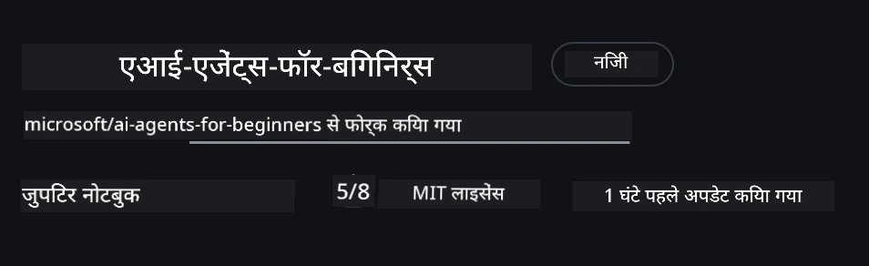

# कोर्स सेटअप

## परिचय

यह पाठ इस कोर्स के कोड नमूनों को कैसे चलाना है, इसे कवर करेगा।

## अन्य शिक्षार्थियों से जुड़ें और मदद प्राप्त करें

अपना रिपोज़िटरी क्लोन करने से पहले, सेटअप में किसी भी मदद के लिए, कोर्स के बारे में किसी भी प्रश्न के लिए, या अन्य शिक्षार्थियों से जुड़ने के लिए [AI Agents For Beginners Discord चैनल](https://aka.ms/ai-agents/discord) में शामिल हों।

## इस रिपॉ में क्लोन या फोर्क करें

शुरू करने के लिए, कृपया GitHub रिपॉजिटरी को क्लोन या फोर्क करें। यह पाठ्यक्रम सामग्री का अपना संस्करण बनाएगा ताकि आप कोड चला सकें, परीक्षण कर सकें और उसमें बदलाव कर सकें!

यह <a href="https://github.com/microsoft/ai-agents-for-beginners/fork" target="_blank">रिपॉ को फोर्क करने</a> के लिंक पर क्लिक करके किया जा सकता है।

अब आपके पास इस कोर्स का अपना फोर्क्ड संस्करण निम्न लिंक में होना चाहिए:



### शैलो क्लोन (कार्यशाला / Codespaces के लिए अनुशंसित)

>पूर्ण रिपॉजिटरी डाउनलोड करते समय पूरा इतिहास और सभी फाइलें काफी बड़ी हो सकती हैं (~3 GB)। यदि आप केवल कार्यशाला में भाग ले रहे हैं या सिर्फ कुछ पाठ फ़ोल्डर चाहिए, तो शैलो क्लोन (या sparse क्लोन) इतिहास को छोटा कर या blobs को स्किप करके अधिकांश डाउनलोड से बचा सकता है।

#### त्वरित शैलो क्लोन — न्यूनतम इतिहास, सभी फाइलें

नीचे दिए गए कमांड में `<your-username>` को अपने फोर्क URL (या अपस्ट्रीम URL यदि आप चाहें) से बदलें।

केवल लेटेस्ट कमिट इतिहास को क्लोन करने के लिए (छोटा डाउनलोड):

```bash|powershell
git clone --depth 1 https://github.com/<your-username>/ai-agents-for-beginners.git
```

किसी विशेष ब्रांच को क्लोन करने के लिए:

```bash|powershell
git clone --depth 1 --branch <branch-name> https://github.com/<your-username>/ai-agents-for-beginners.git
```


#### आंशिक (स्पार्स) क्लोन — न्यूनतम blobs + केवल चयनित फ़ोल्डर

यह पार्टियल क्लोन और sparse-checkout का उपयोग करता है (Git 2.25+ की आवश्यकता और पार्टियल क्लोन सपोर्ट वाला आधुनिक Git अनुशंसित है):

```bash|powershell
git clone --depth 1 --filter=blob:none --sparse https://github.com/<your-username>/ai-agents-for-beginners.git
```

रिपॉ फोल्डर में जाएं:

```bash|powershell
cd ai-agents-for-beginners
```

फिर यह निर्दिष्ट करें कि आप कौन से फ़ोल्डर चाहते हैं (नीचे उदाहरण में दो फ़ोल्डर दिखाए गए हैं):

```bash|powershell
git sparse-checkout set 00-course-setup 01-intro-to-ai-agents
```

क्लोन करने और फ़ाइलों की जांच करने के बाद, यदि आपको केवल फ़ाइलें चाहिए और आप जगह खाली करना चाहते हैं (कोई git इतिहास नहीं), तो कृपया रिपॉजिटरी मेटाडेटा हटा दें (💀अपरिवर्तनीय — आप सभी Git कार्यक्षमता खो देंगे: कोई कमिट, पुल, पुश या इतिहास एक्सेस नहीं)।

```bash
# zsh/bash
rm -rf .git
```

```powershell
# पावरशेल
Remove-Item -Recurse -Force .git
```


#### GitHub Codespaces का उपयोग करना (स्थानीय बड़े डाउनलोड से बचने के लिए अनुशंसित)

- इस रिपॉ के लिए नया Codespace [GitHub UI](https://github.com/codespaces) के माध्यम से बनाएँ।

- नए बनाए गए Codespace के टर्मिनल में ऊपर दिए गए शैलो/स्पार्स क्लोन कमांड में से एक चलाएं ताकि केवल आवश्यक पाठ फ़ोल्डर Codespace वर्कस्पेस में लाएं।
- विकल्प: Codespaces के अंदर क्लोन करने के बाद, अतिरिक्त जगह वापस पाने के लिए .git हटाएं (ऊपर हटाने के कमांड देखें)।
- नोट: यदि आप रिपॉ को सीधे Codespaces में खोलना पसंद करते हैं (अतिरिक्त क्लोन के बिना), तो ध्यान दें कि Codespaces devcontainer वातावरण बनाएगा और आपको ज्यादा संसाधन प्रोविजन कर सकता है। एक नए Codespace के अंदर शैलो क्लोन करने से डिस्क उपयोग पर अधिक नियंत्रण मिलता है।

#### सुझाव

- अगर आप संपादित/कमिट करना चाहते हैं, तो हमेशा क्लोन URL को अपने फोर्क से बदलें।
- बाद में यदि आपको अधिक इतिहास या फाइलें चाहिए, तो आप उन्हें फेच कर सकते हैं या sparse-checkout समायोजित कर सकते हैं।

## कोड चलाना

यह कोर्स Jupyter नोटबुक्स की एक श्रृंखला प्रदान करता है जिन्हें आप AI एजेंट बनाने का व्यावहारिक अनुभव पाने के लिए चला सकते हैं।

कोड नमूने **Microsoft Agent Framework (MAF)** का उपयोग करते हैं `AzureAIProjectAgentProvider` के साथ, जो **Microsoft Foundry** के माध्यम से **Azure AI Agent Service V2** (Responses API) से जुड़ता है।

सभी Python नोटबुक्स का नाम `*-python-agent-framework.ipynb` से समाप्त होता है।

## आवश्यकताएँ

- Python 3.12+
  - **NOTE**: यदि आपके पास Python3.12 इंस्टॉल नहीं है, तो सुनिश्चित करें कि आप इसे इंस्टॉल करें। फिर python3.12 का उपयोग करके अपना venv बनाएं ताकि requirements.txt फ़ाइल से सही संस्करण इंस्टॉल हो सकें।
  
    >उदाहरण

    Python venv डायरेक्टरी बनाएं:

    ```bash|powershell
    python -m venv venv
    ```

    फिर venv एनवायरनमेंट सक्रिय करें:

    ```bash
    # ज़श/बाश
    source venv/bin/activate
    ```
  
    ```dos
    # Command Prompt for Windows
    venv\Scripts\activate
    ```

- .NET 10+: .NET का उपयोग करने वाले सैंपल कोड के लिए, सुनिश्चित करें कि आपने [.NET 10 SDK](https://dotnet.microsoft.com/download/dotnet/10.0) या बाद का संस्करण इंस्टॉल किया है। फिर, इंस्टॉल किए गए .NET SDK संस्करण को जांचें:

    ```bash|powershell
    dotnet --list-sdks
    ```

- **Azure CLI** — प्रामाणिकरण के लिए आवश्यक। [aka.ms/installazurecli](https://aka.ms/installazurecli) से इंस्टॉल करें।
- **Azure Subscription** — Microsoft Foundry और Azure AI Agent Service तक पहुंच के लिए।
- **Microsoft Foundry Project** — एक ऐसा प्रोजेक्ट जिसमें एक तैनात मॉडल (जैसे, `gpt-4o`) हो। नीचे [स्टेप 1](#चरण-1-एक-microsoft-foundry-प्रोजेक्ट-बनाएं) देखें।

इस रिपॉज़िटरी की रूट में `requirements.txt` फ़ाइल शामिल है जिसमें कोड नमूनों को चलाने के लिए सभी आवश्यक Python पैकेज हैं।

आप इसे रिपॉ की रूट में अपने टर्मिनल पर निम्नलिखित कमांड चलाकर इंस्टॉल कर सकते हैं:

```bash|powershell
pip install -r requirements.txt
```

हम अनुशंसा करते हैं कि आप कोई प्रमुख संघर्ष और समस्याओं से बचने के लिए Python वर्चुअल एनवायरनमेंट बनाएं।

## VSCode सेटअप करें

सुनिश्चित करें कि आप VSCode में सही Python संस्करण का उपयोग कर रहे हैं।


## Microsoft Foundry और Azure AI Agent Service सेटअप करें

### चरण 1: एक Microsoft Foundry प्रोजेक्ट बनाएं

नोटबुक्स चलाने के लिए आपको Azure AI Foundry का **hub** और **project** चाहिए जिसमें तैनात मॉडल हो।

1. [ai.azure.com](https://ai.azure.com) पर जाएं और अपने Azure खाते से साइन इन करें।
2. एक **hub** बनाएं (या मौजूदा एक इस्तेमाल करें)। देखें: [Hub resources overview](https://learn.microsoft.com/azure/ai-foundry/concepts/ai-resources)।
3. हब के अंदर, एक **project** बनाएं।
4. **Models + Endpoints** → **Deploy model** से एक मॉडल (जैसे, `gpt-4o`) तैनात करें।

### चरण 2: अपना प्रोजेक्ट एंडपॉइंट और मॉडल डिप्लॉयमेंट नाम प्राप्त करें

Microsoft Foundry पोर्टल में अपने प्रोजेक्ट से:

- **प्रोजेक्ट एंडपॉइंट** — **Overview** पेज पर जाएं और एंडपॉइंट URL कॉपी करें।


- **मॉडल डिप्लॉयमेंट नाम** — **Models + Endpoints** पर जाएं, अपने तैनात मॉडल का चयन करें, और **Deployment name** नोट करें (जैसे, `gpt-4o`)।

### चरण 3: `az login` के साथ Azure में साइन इन करें

सभी नोटबुक्स प्रामाणिकरण के लिए **`AzureCliCredential`** का उपयोग करते हैं — प्रबंधित API कीज़ की कोई आवश्यकता नहीं। इसके लिए Azure CLI के माध्यम से साइन इन होना आवश्यक है।

1. यदि आपने पहले Azure CLI इंस्टॉल नहीं किया है तो इसे इंस्टॉल करें: [aka.ms/installazurecli](https://aka.ms/installazurecli)

2. इसके बाद साइन इन करें:

    ```bash|powershell
    az login
    ```

    यदि आप रिमोट/Codespace वातावरण में हैं और ब्राउज़र उपलब्ध नहीं है तो:

    ```bash|powershell
    az login --use-device-code
    ```

3. यदि पूछा जाए, तो अपनी सब्सक्रिप्शन चुनें — वह जिसमें आपका Foundry प्रोजेक्ट है।

4. सुनिश्चित करें कि आप साइन इन हैं:

    ```bash|powershell
    az account show
    ```

> **क्यों `az login`?** नोटबुक्स `azure-identity` पैकेज से `AzureCliCredential` का उपयोग करके प्रामाणिकरण करते हैं। इसका मतलब है कि आपका Azure CLI सेशन मान्य प्रमाणपत्र प्रदान करता है — आपको अपनी `.env` फ़ाइल में API की या सीक्रेट्स रखने की जरूरत नहीं है। यह एक [सुरक्षा सर्वोत्तम अभ्यास है](https://learn.microsoft.com/azure/developer/ai/keyless-connections)।

### चरण 4: अपनी `.env` फ़ाइल बनाएं

उदाहरण फ़ाइल कॉपी करें:

```bash
# जेडश/बैश
cp .env.example .env
```

```powershell
# पावरशेल
Copy-Item .env.example .env
```

`.env` खोलें और ये दो मान भरें:

```env
AZURE_AI_PROJECT_ENDPOINT=https://<your-project>.services.ai.azure.com/api/projects/<your-project-id>
AZURE_AI_MODEL_DEPLOYMENT_NAME=gpt-4o
```

| वैरिएबल | इसे कहां पाएं |
|----------|--------------|
| `AZURE_AI_PROJECT_ENDPOINT` | Foundry पोर्टल → आपका प्रोजेक्ट → **Overview** पेज |
| `AZURE_AI_MODEL_DEPLOYMENT_NAME` | Foundry पोर्टल → **Models + Endpoints** → आपका तैनात मॉडल का नाम |

अधिकांश पाठ्यक्रमों के लिए बस इतना ही! नोटबुक्स स्वचालित रूप से आपके `az login` सेशन के माध्यम से प्रमाणीकरण करेंगे।

### चरण 5: Python निर्भरता स्थापित करें

```bash|powershell
pip install -r requirements.txt
```

हम अनुशंसा करते हैं कि इसे पहले बनाए गए वर्चुअल एनवायरनमेंट के अंदर चलाएं।

## पाठ 5 (Agentic RAG) के लिए अतिरिक्त सेटअप

पाठ 5 पुनः प्राप्ति-संवर्धित पीढ़ी (retrieval-augmented generation) के लिए **Azure AI Search** का उपयोग करता है। यदि आप उस पाठ को चलाने की योजना बना रहे हैं, तो अपनी `.env` फ़ाइल में ये वैरिएबल जोड़ें:

| वैरिएबल | इसे कहां पाएं |
|----------|--------------|
| `AZURE_SEARCH_SERVICE_ENDPOINT` | Azure पोर्टल → आपका **Azure AI Search** संसाधन → **Overview** → URL |
| `AZURE_SEARCH_API_KEY` | Azure पोर्टल → आपका **Azure AI Search** संसाधन → **Settings** → **Keys** → प्राथमिक एडमिन कुंजी |

## पाठ 6 और पाठ 8 (GitHub Models) के लिए अतिरिक्त सेटअप

पाठ 6 और 8 की कुछ नोटबुक्स **GitHub Models** का उपयोग करती हैं Azure AI Foundry के बजाय। यदि आप उन सैंपल्स को चलाने की योजना बना रहे हैं, तो अपनी `.env` फाइल में ये वैरिएबल जोड़ें:

| वैरिएबल | इसे कहां पाएं |
|----------|--------------|
| `GITHUB_TOKEN` | GitHub → **Settings** → **Developer settings** → **Personal access tokens** |
| `GITHUB_ENDPOINT` | उपयोग करें `https://models.inference.ai.azure.com` (डिफ़ॉल्ट मान) |
| `GITHUB_MODEL_ID` | उपयोग करने के लिए मॉडल का नाम (जैसे `gpt-4o-mini`) |

## वैकल्पिक प्रदाता: MiniMax (OpenAI-कंपैटिबल)

[MiniMax](https://platform.minimaxi.com/) OpenAI-नुकूल API के माध्यम से बड़े संदर्भ मॉडल (204K टोकन्स तक) प्रदान करता है। Microsoft Agent Framework का `OpenAIChatClient` किसी भी OpenAI-नुकूल एंडपॉइंट के साथ काम करता है, इसलिए आप MiniMax को GitHub Models या OpenAI के विकल्प के रूप में उपयोग कर सकते हैं।

अपनी `.env` फाइल में ये वैरिएबल जोड़ें:

| वैरिएबल | इसे कहां पाएं |
|----------|--------------|
| `MINIMAX_API_KEY` | [MiniMax Platform](https://platform.minimaxi.com/) → API Keys |
| `MINIMAX_BASE_URL` | उपयोग करें `https://api.minimax.io/v1` (डिफ़ॉल्ट मान) |
| `MINIMAX_MODEL_ID` | उपयोग करने के लिए मॉडल का नाम (जैसे, `MiniMax-M2.7`) |

**उपलब्ध मॉडल**: `MiniMax-M2.7` (अनुशंसित), `MiniMax-M2.7-highspeed` (तेज़ प्रतिक्रिया)

जो कोड नमूने `OpenAIChatClient` का उपयोग करते हैं (जैसे, पाठ 14 होटल बुकिंग वर्कफ़्लो), वे स्वचालित रूप से आपकी MiniMax कॉन्फ़िगरेशन का पता लगाकर उपयोग करेंगे जब `MINIMAX_API_KEY` सेट होगा।

## पाठ 8 (Bing Grounding Workflow) के लिए अतिरिक्त सेटअप

पाठ 8 में कंडीशनल वर्कफ़्लो नोटबुक Azure AI Foundry के माध्यम से **Bing grounding** का उपयोग करता है। यदि आप वह नमूना चलाना चाहते हैं, तो अपनी `.env` फाइल में यह वैरिएबल जोड़ें:

| वैरिएबल | इसे कहां पाएं |
|----------|--------------|
| `BING_CONNECTION_ID` | Azure AI Foundry पोर्टल → आपका प्रोजेक्ट → **Management** → **Connected resources** → आपका Bing कनेक्शन → कनेक्शन ID कॉपी करें |

## समस्या निवारण

### macOS पर SSL प्रमाणपत्र सत्यापन त्रुटियाँ

यदि आप macOS पर हैं और इस प्रकार की त्रुटि आती है:

```plaintext
ssl.SSLCertVerificationError: [SSL: CERTIFICATE_VERIFY_FAILED] certificate verify failed: self-signed certificate in certificate chain
```

यह Python पर macOS की एक ज्ञात समस्या है जहाँ सिस्टम SSL प्रमाणपत्र अपने आप भरोसेमंद नहीं होते। निम्न समाधानों को क्रम में आजमाएं:

**विकल्प 1: Python का Install Certificates स्क्रिप्ट चलाएं (अनुशंसित)**

```bash
# 3.XX को अपने स्थापित Python संस्करण (जैसे, 3.12 या 3.13) से बदलें:
/Applications/Python\ 3.XX/Install\ Certificates.command
```

**विकल्प 2: अपने नोटबुक में `connection_verify=False` का उपयोग करें (केवल GitHub Models नोटबुक के लिए)**

पाठ 6 की नोटबुक (`06-building-trustworthy-agents/code_samples/06-system-message-framework.ipynb`) में पहले से ही एक कमेंट किया हुआ वर्कअराउंड शामिल है। क्लाइंट बनाते समय `connection_verify=False` अनकॉमेंट करें:

```python
client = ChatCompletionsClient(
    endpoint=endpoint,
    credential=AzureKeyCredential(token),
    connection_verify=False,  # यदि आपको प्रमाणपत्र त्रुटियाँ मिलती हैं तो एसएसएल सत्यापन अक्षम करें
)
```

> **⚠️ चेतावनी:** SSL सत्यापन को अक्षम करना (`connection_verify=False`) सुरक्षा कम कर देता है क्योंकि प्रमाणपत्र सत्यापन को छोड़ देता है। इसे केवल विकास वातावरण में अस्थायी समाधान के रूप में उपयोग करें, उत्पादन में कभी नहीं।

**विकल्प 3: `truststore` इंस्टॉल और उपयोग करें**

```bash
pip install truststore
```

फिर अपने नोटबुक या स्क्रिप्ट की शुरुआत में, कोई भी नेटवर्क कॉल करने से पहले निम्न जोड़ें:

```python
import truststore
truststore.inject_into_ssl()
```

## कहीं फंसे हुए हैं?

यदि आप इस सेटअप को चलाने में किसी प्रकार की समस्या का सामना कर रहे हैं, तो हमारे <a href="https://discord.gg/kzRShWzttr" target="_blank">Azure AI Community Discord</a> में शामिल हों या <a href="https://github.com/microsoft/ai-agents-for-beginners/issues?WT.mc_id=academic-105485-koreyst" target="_blank">यहां एक इश्यू बनाएं</a>।

## अगला पाठ

अब आप इस कोर्स के लिए कोड चलाने के लिए तैयार हैं। AI एजेंट्स की दुनिया के बारे में अधिक जानने के लिए शुभकामनाएँ!

[AI एजेंट्स और एजेंट उपयोग केस का परिचय](../01-intro-to-ai-agents/README.md)

---

<!-- CO-OP TRANSLATOR DISCLAIMER START -->
**अस्वीकरण**:
यह दस्तावेज़ AI अनुवाद सेवा [Co-op Translator](https://github.com/Azure/co-op-translator) का उपयोग करके अनुवादित किया गया है। जबकि हम सटीकता के लिए प्रयासरत हैं, कृपया ध्यान दें कि स्वचालित अनुवादों में त्रुटियाँ या असंगतियाँ हो सकती हैं। मूल भाषा में दस्तावेज़ को आधिकारिक स्रोत माना जाना चाहिए। महत्वपूर्ण जानकारी के लिए, पेशेवर मानव अनुवाद की सलाह दी जाती है। इस अनुवाद के उपयोग से उत्पन्न किसी भी गलतफ़हमी या गलत व्याख्या के लिए हम उत्तरदायी नहीं हैं।
<!-- CO-OP TRANSLATOR DISCLAIMER END -->