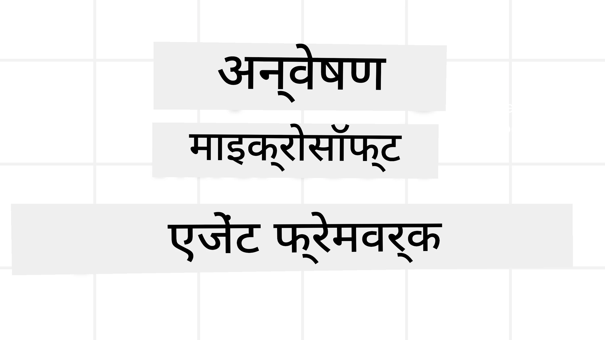

# Microsoft Agent Framework का अन्वेषण



### परिचय

यह पाठ निम्नलिखित को कवर करेगा:

- Microsoft Agent Framework को समझना: मुख्य विशेषताएं और मूल्य  
- Microsoft Agent Framework की प्रमुख अवधारणाओं का अन्वेषण
- उन्नत MAF पैटर्न: कार्यप्रवाह, मिडलवेयर, और मेमोरी

## सीखने के लक्ष्य

इस पाठ को पूरा करने के बाद, आप जानेंगे कि कैसे:

- Microsoft Agent Framework का उपयोग करके उत्पादन स्तर के AI एजेंट बनाएँ
- अपने एजेंटिक उपयोग मामलों के लिए Microsoft Agent Framework की मूल विशेषताओं को लागू करें
- कार्यप्रवाह, मिडलवेयर, और ऑब्ज़र्वेबिलिटी सहित उन्नत पैटर्न का उपयोग करें

## कोड उदाहरण

[Microsoft Agent Framework (MAF)](https://aka.ms/ai-agents-beginners/agent-framewrok) के लिए कोड उदाहरण इस रिपॉजिटरी में `xx-python-agent-framework` और `xx-dotnet-agent-framework` फाइलों के तहत पाए जा सकते हैं।

## Microsoft Agent Framework को समझना


[Microsoft Agent Framework (MAF)](https://aka.ms/ai-agents-beginners/agent-framewrok) Microsoft का एक एकीकृत फ्रेमवर्क है जो AI एजेंट बनाने के लिए है। यह उत्पादन और शोध वातावरण दोनों में देखी जाने वाली एजेंटिक उपयोग केसों की विस्तृत विविधता को संबोधित करने के लिए लचीलापन प्रदान करता है, जिनमें शामिल हैं:

- **क्रमिक एजेंट ऑर्केस्ट्रेशन** जिसमें चरण-दर-चरण कार्यप्रवाह आवश्यक होते हैं।
- **समानांतर ऑर्केस्ट्रेशन** जिसमें एजेंटों को एक साथ कार्य पूरे करने होते हैं।
- **समूह चैट ऑर्केस्ट्रेशन** जिसमें एजेंट एक ही कार्य पर मिलकर काम कर सकते हैं।
- **हैंडऑफ ऑर्केस्ट्रेशन** जिसमें एजेंट एक-दूसरे को subtasks पूरे होने पर कार्य सौंपते हैं।
- **मैग्नेटिक ऑर्केस्ट्रेशन** जिसमें एक प्रबंधक एजेंट कार्य सूची बनाता और संशोधित करता है तथा उप-एजेंटों का समन्वय करता है।

AI एजेंट को उत्पादन में प्रदान करने के लिए, MAF में निम्नलिखित सुविधाएँ भी शामिल हैं:

- **ऑब्जर्वेबिलिटी** OpenTelemetry के उपयोग के माध्यम से, जहां AI एजेंट की हर क्रिया शामिल है जैसे कि टूल कॉल, ऑर्केस्ट्रेशन चरण, तर्क प्रवाह, और Microsoft Foundry डैशबोर्ड द्वारा प्रदर्शन निगरानी।
- **सुरक्षा** एजेंटों को नेटिव तौर पर Microsoft Foundry पर होस्ट कर सुरक्षा नियंत्रण जैसे कि भूमिका-आधारित पहुँच, निजी डेटा हैंडलिंग, और इन-बिल्ट कंटेंट सुरक्षा प्रदान करता है।
- **टिकाऊपन** क्योंकि एजेंट थ्रेड और कार्यप्रवाह को पॉज़, पुनः शुरू, और त्रुटि से पुनर्प्राप्ति की अनुमति देता है, जिससे लंबी अवधि के प्रक्रियाएँ सक्षम होती हैं।
- **नियंत्रण** जहां मानव-इन-द-लूप कार्यप्रवाह समर्थित होते हैं, जिनमें कार्यों को मानव अनुमोदन की आवश्यकता के रूप में चिह्नित किया जा सकता है।

Microsoft Agent Framework का फोकस सहयोगशीलता पर भी है:

- **क्लाउड-निरपेक्ष** - एजेंट कंटेनरों, ऑन-प्रिमाइसेज, और विभिन्न क्लाउड्स पर चल सकते हैं।
- **प्रदाता-निरपेक्ष** - एजेंट आपकी पसंद के SDK के माध्यम से बनाए जा सकते हैं, जिसमें Azure OpenAI और OpenAI शामिल हैं
- **ओपन स्टैंडर्ड्स का एकीकरण** - एजेंट Agent-to-Agent(A2A) और Model Context Protocol (MCP) जैसे प्रोटोकॉल का उपयोग कर अन्य एजेंट और उपकरण खोज सकते हैं और उनका उपयोग कर सकते हैं।
- **प्लगइन्स और कनेक्टर्स** - Microsoft Fabric, SharePoint, Pinecone और Qdrant जैसी डेटा और मेमोरी सेवाओं से कनेक्शन बनाना।

आइए देखें कि Microsoft Agent Framework की कुछ मूल अवधारणाओं पर ये विशेषताएं कैसे लागू की जाती हैं।

## Microsoft Agent Framework की प्रमुख अवधारणाएँ

### एजेंट्स


**एजेंट बनाना**

एजेंट का निर्माण इनफेरेंस सेवा (LLM प्रदाता) को परिभाषित करके, AI एजेंट के लिए निर्देशों का सेट और एक आवंटित `name` के द्वारा किया जाता है:

```python
agent = AzureOpenAIChatClient(credential=AzureCliCredential()).create_agent( instructions="You are good at recommending trips to customers based on their preferences.", name="TripRecommender" )
```

ऊपर `Azure OpenAI` का उपयोग किया गया है लेकिन एजेंट विभिन्न सेवाओं का उपयोग करके बनाए जा सकते हैं, जिनमें `Microsoft Foundry Agent Service` शामिल है:

```python
AzureAIAgentClient(async_credential=credential).create_agent( name="HelperAgent", instructions="You are a helpful assistant." ) as agent
```

OpenAI `Responses`, `ChatCompletion` APIs

```python
agent = OpenAIResponsesClient().create_agent( name="WeatherBot", instructions="You are a helpful weather assistant.", )
```

```python
agent = OpenAIChatClient().create_agent( name="HelpfulAssistant", instructions="You are a helpful assistant.", )
```

या [MiniMax](https://platform.minimaxi.com/), जो बड़े संदर्भ विंडो (204K टोकन तक) के साथ OpenAI-संगत API प्रदान करता है:

```python
agent = OpenAIChatClient(base_url="https://api.minimax.io/v1", api_key=os.environ["MINIMAX_API_KEY"], model_id="MiniMax-M2.7").create_agent( name="HelpfulAssistant", instructions="You are a helpful assistant.", )
```

या A2A प्रोटोकॉल का उपयोग कर रिमोट एजेंट:

```python
agent = A2AAgent( name=agent_card.name, description=agent_card.description, agent_card=agent_card, url="https://your-a2a-agent-host" )
```

**एजेंट चलाना**

एजेंट को `.run` या `.run_stream` विधियों का उपयोग करते हुए चलाया जाता है, नॉन-स्ट्रीमिंग या स्ट्रीमिंग प्रतिक्रियाओं के लिए।

```python
result = await agent.run("What are good places to visit in Amsterdam?")
print(result.text)
```

```python
async for update in agent.run_stream("What are the good places to visit in Amsterdam?"):
    if update.text:
        print(update.text, end="", flush=True)

```

हर एजेंट रन में विकल्प हो सकते हैं जिनसे एजेंट के लिए `max_tokens` जैसे पैरामीटर, एजेंट द्वारा कॉल किए जाने वाले `tools`, और यहां तक कि एजेंट के लिए उपयोग किए गए `model` को अनुकूलित किया जा सकता है।

यह उन मामलों में उपयोगी होता है जहाँ उपयोगकर्ता के कार्य को पूरा करने के लिए विशिष्ट मॉडल या टूल्स की आवश्यकता होती है।

**टूल्स**

टूल्स को एजेंट को परिभाषित करते समय भी निर्दिष्ट किया जा सकता है:

```python
def get_attractions( location: Annotated[str, Field(description="The location to get the top tourist attractions for")], ) -> str: """Get the top tourist attractions for a given location.""" return f"The top attractions for {location} are." 


# जब सीधे एक ChatAgent बनाया जा रहा हो

agent = ChatAgent( chat_client=OpenAIChatClient(), instructions="You are a helpful assistant", tools=[get_attractions]

```

और एजेंट को चलाते समय भी:

```python

result1 = await agent.run( "What's the best place to visit in Seattle?", tools=[get_attractions] # इस रन के लिए केवल टूल प्रदान किया गया है )
```

**एजेंट थ्रेड्स**

एजेंट थ्रेड्स का उपयोग मल्टी-टर्न वार्तालापों को संभालने के लिए किया जाता है। थ्रेड्स को या तो निम्नलिखित से बनाया जा सकता है:

- `get_new_thread()` का उपयोग करके जो थ्रेड को समय के साथ संजोने की अनुमति देता है
- एजेंट को रन करते समय स्वचालित रूप से एक थ्रेड बनाना जो केवल वर्तमान रन के दौरान रहता है।

थ्रेड बनाने के लिए कोड इस तरह दिखता है:

```python
# एक नया थ्रेड बनाएं।
thread = agent.get_new_thread() # थ्रेड के साथ एजेंट चलाएं।
response = await agent.run("Hello, I am here to help you book travel. Where would you like to go?", thread=thread)

```

आप बाद में उपयोग के लिए थ्रेड को सीरियलाइज़ भी कर सकते हैं:

```python
# एक नया थ्रेड बनाएं।
thread = agent.get_new_thread() 

# थ्रेड के साथ एजेंट चलाएं।

response = await agent.run("Hello, how are you?", thread=thread) 

# संग्रह के लिए थ्रेड को सीरियलाइज़ करें।

serialized_thread = await thread.serialize() 

# संग्रह से लोड करने के बाद थ्रेड स्थिति को डीसीरियलाइज़ करें।

resumed_thread = await agent.deserialize_thread(serialized_thread)
```

**एजेंट मिडलवेयर**

एजेंट उपयोगकर्ता के कार्य पूरे करने के लिए टूल्स और LLMs के साथ इंटरैक्ट करते हैं। कुछ परिदृश्यों में, हम इन इंटरैक्शनों के बीच निष्पादन या ट्रैक करना चाहते हैं। एजेंट मिडलवेयर हमें ऐसा करने की अनुमति देता है:

*फ़ंक्शन मिडलवेयर*

यह मिडलवेयर एजेंट और उस फंक्शन/टूल के बीच एक क्रिया निष्पादित करने देता है जिसे एजेंट कॉल करेगा। इसका एक उदाहरण तब हो सकता है जब आप फंक्शन कॉल पर लॉगिंग करना चाहते हैं।

नीचे के कोड में `next` निर्धारित करता है कि अगला मिडलवेयर या वास्तविक फंक्शन कॉल होना चाहिए।

```python
async def logging_function_middleware(
    context: FunctionInvocationContext,
    next: Callable[[FunctionInvocationContext], Awaitable[None]],
) -> None:
    """Function middleware that logs function execution."""
    # पूर्व-प्रसंस्करण: फ़ंक्शन निष्पादन से पहले लॉग करें
    print(f"[Function] Calling {context.function.name}")

    # अगले मिडलवेयर या फ़ंक्शन निष्पादन पर जारी रखें
    await next(context)

    # पश्च-प्रसंस्करण: फ़ंक्शन निष्पादन के बाद लॉग करें
    print(f"[Function] {context.function.name} completed")
```

*चैट मिडलवेयर*

यह मिडलवेयर एजेंट और LLM के बीच अनुरोधों के बीच कार्रवाई या लॉगिंग करने की अनुमति देता है।

इसमें महत्वपूर्ण जानकारी शामिल है जैसे कि AI सेवा को भेजे जा रहे `messages`।

```python
async def logging_chat_middleware(
    context: ChatContext,
    next: Callable[[ChatContext], Awaitable[None]],
) -> None:
    """Chat middleware that logs AI interactions."""
    # पूर्व-संसाधन: एआई कॉल से पहले लॉग
    print(f"[Chat] Sending {len(context.messages)} messages to AI")

    # अगले मिडलवेयर या एआई सेवा तक जारी रखें
    await next(context)

    # पश्च-प्रसंस्करण: एआई प्रतिक्रिया के बाद लॉग
    print("[Chat] AI response received")

```

**एजेंट मेमोरी**

जैसा कि `Agentic Memory` पाठ में कवर किया गया है, मेमोरी एजेंट को विभिन्न संदर्भों में कार्य करने में सक्षम करने के लिए एक महत्वपूर्ण तत्व है। MAF कई प्रकार की मेमोरी प्रदान करता है:

*इन-मेमोरी स्टोरेज*

यह मेमोरी एप्लिकेशन रनटाइम के दौरान थ्रेड्स में संग्रहीत होती है।

```python
# एक नया थ्रेड बनाएं।
thread = agent.get_new_thread() # थ्रेड के साथ एजेंट को चलाएं।
response = await agent.run("Hello, I am here to help you book travel. Where would you like to go?", thread=thread)
```

*स्थायी संदेश*

यह मेमोरी विभिन्न सत्रों में बातचीत का इतिहास संग्रहीत करने के लिए उपयोग की जाती है। इसे `chat_message_store_factory` के माध्यम से परिभाषित किया जाता है:

```python
from agent_framework import ChatMessageStore

# एक कस्टम संदेश स्टोर बनाएं
def create_message_store():
    return ChatMessageStore()

agent = ChatAgent(
    chat_client=OpenAIChatClient(),
    instructions="You are a Travel assistant.",
    chat_message_store_factory=create_message_store
)

```

*डायनामिक मेमोरी*

यह मेमोरी एजेंटों को चलाने से पहले संदर्भ में जोड़ी जाती है। ये मेमोरी बाहरी सेवाओं जैसे mem0 में संग्रहीत की जा सकती हैं:

```python
from agent_framework.mem0 import Mem0Provider

# उन्नत मेमोरी क्षमताओं के लिए Mem0 का उपयोग करना
memory_provider = Mem0Provider(
    api_key="your-mem0-api-key",
    user_id="user_123",
    application_id="my_app"
)

agent = ChatAgent(
    chat_client=OpenAIChatClient(),
    instructions="You are a helpful assistant with memory.",
    context_providers=memory_provider
)

```

**एजेंट ऑब्जर्वेबिलिटी**

ऑब्जर्वेबिलिटी विश्वसनीय और रखरखाव योग्य एजेंटिक सिस्टम बनाने के लिए महत्वपूर्ण है। MAF OpenTelemetry के साथ एकीकरण करता है ताकि बेहतर ऑब्जर्वेबिलिटी के लिए ट्रेसिंग और मीटर प्रदान किया जा सके।

```python
from agent_framework.observability import get_tracer, get_meter

tracer = get_tracer()
meter = get_meter()
with tracer.start_as_current_span("my_custom_span"):
    # कुछ करें
    pass
counter = meter.create_counter("my_custom_counter")
counter.add(1, {"key": "value"})
```

### कार्यप्रवाह (Workflows)

MAF कार्यप्रवाह प्रदान करता है, जो किसी कार्य को पूरा करने के लिए पूर्व-परिभाषित चरण होते हैं और उन चरणों में AI एजेंट शामिल होते हैं।

कार्यप्रवाह विभिन्न घटकों से बने होते हैं जो बेहतर नियंत्रण प्रवाह की अनुमति देते हैं। कार्यप्रवाह **मल्टी-एजेंट ऑर्केस्ट्रेशन** और **चेकपॉइंटिंग** को सक्षम करते हैं ताकि कार्यप्रवाह की स्थिति सहेजी जा सके।

कार्यप्रवाह के मुख्य घटक हैं:

**एक्जीक्यूटर्स**

एक्जीक्यूटर्स इनपुट संदेश प्राप्त करते हैं, अपने सौंपे गए कार्य करते हैं, और फिर आउटपुट संदेश उत्पन्न करते हैं। इससे कार्यप्रवाह बड़े कार्य को पूरा करने की दिशा में आगे बढ़ता है। एक्जीक्यूटर्स AI एजेंट या कस्टम लॉजिक हो सकते हैं।

**एजेस**

एजेस कार्यप्रवाह में संदेशों के प्रवाह को परिभाषित करने के लिए उपयोग किए जाते हैं। ये हो सकते हैं:

*डायरेक्ट एजेस* - एक्जीक्यूटर्स के बीच सरल एक-से-एक कनेक्शन:

```python
from agent_framework import WorkflowBuilder

builder = WorkflowBuilder()
builder.add_edge(source_executor, target_executor)
builder.set_start_executor(source_executor)
workflow = builder.build()
```

*शर्तीय एजेस* - जब कोई शर्त पूरी होती है तो सक्रिय होती हैं। उदाहरण के लिए, जब होटल के कमरे उपलब्ध नहीं होते, एक्जीक्यूटर अन्य विकल्प सुझा सकता है।

*स्विच-केस एजेस* - परिभाषित शर्तों के आधार पर संदेशों को विभिन्न एक्जीक्यूटर्स को मार्गित करती हैं। उदाहरणतः यदि यात्रा ग्राहक के पास प्राथमिकता पहुँच है, तो उनके कार्य अन्य कार्यप्रवाह के माध्यम से संभाले जाएंगे।

*फैन-आउट एजेस* - एक संदेश को कई लक्ष्यों को भेजना।

*फैन-इन एजेस* - विभिन्न एक्जीक्यूटर्स से कई संदेश इकट्ठा करके एक लक्ष्य को भेजना।

**इवेंट्स**

कार्यप्रवाह में बेहतर ऑब्जर्वेबिलिटी प्रदान करने के लिए, MAF में निष्पादन के लिए इनबिल्ट इवेंट्स होते हैं, जिनमें शामिल हैं:

- `WorkflowStartedEvent`  - कार्यप्रवाह निष्पादन शुरू होता है
- `WorkflowOutputEvent` - कार्यप्रवाह आउटपुट उत्पन्न करता है
- `WorkflowErrorEvent` - कार्यप्रवाह त्रुटि का सामना करता है
- `ExecutorInvokeEvent`  - एक्जीक्यूटर प्रसंस्करण शुरू करता है
- `ExecutorCompleteEvent`  -  एक्जीक्यूटर प्रसंस्करण पूरा करता है
- `RequestInfoEvent` - एक अनुरोध जारी किया गया है

## उन्नत MAF पैटर्न

ऊपर के खंड Microsoft Agent Framework की मुख्य अवधारणाओं को कवर करते हैं। जैसे-जैसे आप अधिक जटिल एजेंट बनाते हैं, यहाँ कुछ उन्नत पैटर्न हैं जिन्हें ध्यान में रखें:

- **मिडलवेयर संयोजन**: एजेंट व्यवहार पर सूक्ष्म नियंत्रण के लिए फ़ंक्शन और चैट मिडलवेयर का उपयोग करके कई मिडलवेयर हैंडलर्स (लॉगिंग, प्रामाणिकता, रेट-लिमिटिंग) को श्रृंखला में जोड़ना।
- **कार्यप्रवाह चेकपॉइंटिंग**: लंबे चलने वाले एजेंट प्रक्रियाओं को सहेजने और पुनः शुरू करने के लिए कार्यप्रवाह इवेंट्स और सीरियलाइजेशन का उपयोग करना।
- **डायनामिक टूल चयन**: MAF के टूल पंजीकरण के साथ टूल विवरणों पर RAG संयोजन कर केवल संबंधित टूल्स प्रति क्वेरी प्रस्तुत करना।
- **मल्टी-एजेंट हैंडऑफ**: विशेषज्ञ एजेंटों के बीच हैंडऑफ को ऑर्केस्ट्रेट करने के लिए कार्यप्रवाह एजेस और शर्तीय रूटिंग का उपयोग।

## कोड उदाहरण

Microsoft Agent Framework के लिए कोड उदाहरण इस रिपॉजिटरी में `xx-python-agent-framework` और `xx-dotnet-agent-framework` फाइलों के तहत पाए जा सकते हैं।

## Microsoft Agent Framework के बारे में और सवाल हैं?

अन्य शिक्षार्थियों से मिलने, ऑफिस आवर्स में भाग लेने और अपने AI एजेंट प्रश्नों का उत्तर पाने के लिए [Microsoft Foundry Discord](https://aka.ms/ai-agents/discord) में शामिल हों।

---

<!-- CO-OP TRANSLATOR DISCLAIMER START -->
**अस्वीकरण**:  
इस दस्तावेज़ का अनुवाद AI अनुवाद सेवा [Co-op Translator](https://github.com/Azure/co-op-translator) का उपयोग करके किया गया है। जबकि हम सटीकता के लिए प्रयास करते हैं, कृपया ध्यान दें कि स्वचालित अनुवाद में त्रुटियाँ या अशुद्धियाँ हो सकती हैं। मूल दस्तावेज़ जो अपनी मातृभाषा में है, उसे आधिकारिक स्रोत माना जाना चाहिए। महत्वपूर्ण जानकारी के लिए, पेशेवर मानव अनुवाद की सिफारिश की जाती है। इस अनुवाद के उपयोग से उत्पन्न किसी भी गलतफहमी या गलत व्याख्या के लिए हम जिम्मेदार नहीं हैं।
<!-- CO-OP TRANSLATOR DISCLAIMER END -->