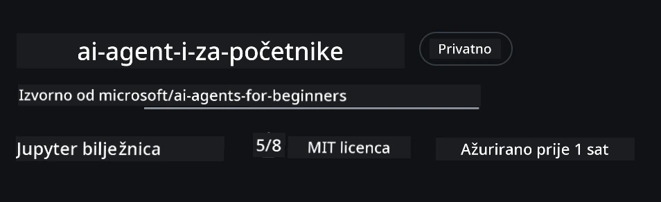
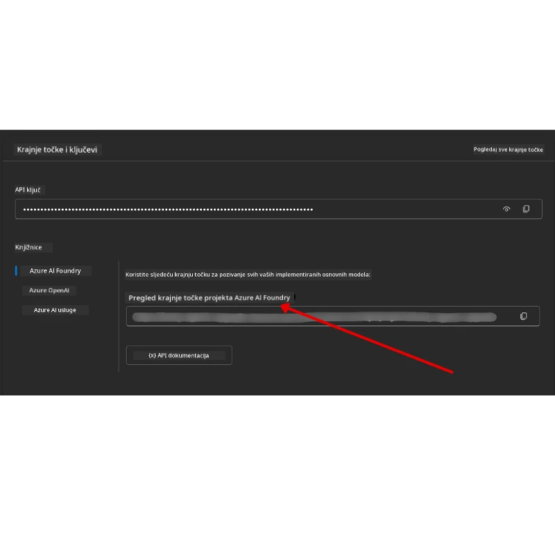

# Postavljanje tečaja

## Uvod

Ova lekcija objašnjava kako pokrenuti primjere koda iz ovog tečaja.

## Pridružite se drugim učenicima i zatražite pomoć

Prije nego što počnete klonirati svoj repozitorij, pridružite se [AI Agents For Beginners Discord kanalu](https://aka.ms/ai-agents/discord) kako biste dobili pomoć oko postavljanja, postavili pitanja vezana uz tečaj ili se povezali s drugim učenicima.

## Klonirajte ili forkajte ovaj repozitorij

Za početak, molimo vas da klonirate ili forkate GitHub repozitorij. Time dobivate vlastitu verziju materijala tečaja koju možete pokretati, testirati i podešavati!

To možete učiniti klikom na poveznicu <a href="https://github.com/microsoft/ai-agents-for-beginners/fork" target="_blank">fork this repo</a>

Sada biste trebali imati svoju vlastitu forkanu verziju ovog tečaja na sljedećoj poveznici:



### Shallow Clone (preporučeno za radionice / Codespaces)

  > Cijeli repozitorij može biti velik (~3 GB) ako preuzimate kompletnu povijest i sve datoteke. Ako sudjelujete samo u radionici ili trebate samo nekoliko mapa s lekcijama, shallow clone (ili sparse clone) izbjegava većinu tog preuzimanja tako da skraćuje povijest i/ili preskače podatke.

#### Brzi shallow clone — minimalna povijest, sve datoteke

Zamijenite `<your-username>` u naredbama dolje s URL-om vaše forknute verzije (ili upstream URL-om ako želite).

Za kloniranje samo najnovije povijesti commitova (malo preuzimanje):

```bash|powershell
git clone --depth 1 https://github.com/<your-username>/ai-agents-for-beginners.git
```

Za kloniranje određene grane:

```bash|powershell
git clone --depth 1 --branch <branch-name> https://github.com/<your-username>/ai-agents-for-beginners.git
```

#### Djelomični (sparse) clone — minimalni podaci + samo odabrane mape

Ovo koristi partial clone i sparse-checkout (zahtijeva Git 2.25+ i preporuča se moderni Git s podrškom za partial clone):

```bash|powershell
git clone --depth 1 --filter=blob:none --sparse https://github.com/<your-username>/ai-agents-for-beginners.git
```

Uđite u mapu repozitorija:

```bash|powershell
cd ai-agents-for-beginners
```

Zatim navedite koje mape želite (primjer prikazuje dvije mape):

```bash|powershell
git sparse-checkout set 00-course-setup 01-intro-to-ai-agents
```

Nakon što klonirate i potvrdite datoteke, ako vam trebaju samo datoteke i želite osloboditi prostor (bez git povijesti), izbrišite podatke o repozitoriju (💀nepovratno — izgubiti ćete sve Git funkcionalnosti: nema commitova, pullova, pushova ni pristupa povijesti).

```bash
# zsh/bash
rm -rf .git
```

```powershell
# PowerShell
Remove-Item -Recurse -Force .git
```

#### Korištenje GitHub Codespaces (preporučeno za izbjegavanje lokalnih velikih preuzimanja)

- Kreirajte novi Codespace za ovaj repozitorij putem [GitHub sučelja](https://github.com/codespaces).  

- U terminalu novog codespace-a pokrenite jednu od naredbi za shallow/sparse clone iznad kako biste unijeli samo mape lekcija koje trebate u Codespace radni prostor.
- Opcionalno: nakon kloniranja u Codespaces, uklonite .git mapu kako biste oslobodili dodatni prostor (vidi naredbe za uklanjanje iznad).
- Napomena: Ako želite otvoriti repozitorij izravno u Codespaces (bez dodatnog kloniranja), imajte na umu da Codespaces konstruira razvojno okruženje (devcontainer) i može i dalje distribuirati više nego što trebate. Kloniranje plitke kopije unutar novog Codespace-a daje vam veću kontrolu nad korištenjem diska.

#### Savjeti

- Uvijek zamijenite URL za kloniranje s URL-om vaše forkane verzije ako želite mijenjati ili commitati.
- Ako vam kasnije treba više povijesti ili datoteka, možete ih dohvatiti ili prilagoditi sparse-checkout da uključite dodatne mape.

## Pokretanje koda

Ovaj tečaj nudi niz Jupyter bilježnica koje možete pokretati kako biste stekli praktično iskustvo u izgradnji AI agenata.

Primjeri koda koriste **Microsoft Agent Framework (MAF)** s `AzureAIProjectAgentProvider`, koji se povezuje s **Azure AI Agent Service V2** (Responses API) putem **Microsoft Foundry**.

Sve Python bilježnice imaju oznaku `*-python-agent-framework.ipynb`.

## Zahtjevi

- Python 3.12+
  - **NAPOMENA**: Ako nemate instaliran Python3.12, pobrinite se da ga instalirate. Zatim kreirajte virtualno okruženje koristeći python3.12 kako biste osigurali ispravne verzije paketa definirane u requirements.txt datoteci.
  
    >Primjer

    Kreirajte Python venv direktorij:

    ```bash|powershell
    python -m venv venv
    ```

    Zatim aktivirajte venv okruženje za:

    ```bash
    # zsh/bash
    source venv/bin/activate
    ```
  
    ```dos
    # Command Prompt for Windows
    venv\Scripts\activate
    ```

- .NET 10+: Za primjere koda u .NET-u, instalirajte [.NET 10 SDK](https://dotnet.microsoft.com/download/dotnet/10.0) ili noviji. Zatim provjerite verziju instaliranog .NET SDK-a:

    ```bash|powershell
    dotnet --list-sdks
    ```

- **Azure CLI** — Potrebno za autentikaciju. Instalirajte s [aka.ms/installazurecli](https://aka.ms/installazurecli).
- **Azure pretplata** — Za pristup Microsoft Foundry i Azure AI Agent Service.
- **Microsoft Foundry projekt** — Projekt s postavljenim modelom (npr. `gpt-4o`). Pogledajte [Korak 1](#korak-1-kreirajte-microsoft-foundry-projekt) dolje.

U korijenu ovog repozitorija nalazi se datoteka `requirements.txt` koja sadrži sve potrebne Python pakete za pokretanje primjera koda.

Možete ih instalirati pokretanjem sljedeće naredbe u terminalu u korijenu repozitorija:

```bash|powershell
pip install -r requirements.txt
```

Preporučujemo stvaranje Python virtualnog okruženja kako biste izbjegli konflikte i probleme.

## Postavljanje VSCode

Provjerite koristite li ispravnu verziju Pythona u VSCode-u.


## Postavljanje Microsoft Foundry i Azure AI Agent Service

### Korak 1: Kreirajte Microsoft Foundry projekt

Za pokretanje bilježnica trebate Azure AI Foundry **hub** i **projekt** s postavljenim modelom.

1. Idite na [ai.azure.com](https://ai.azure.com) i prijavite se sa svojim Azure računom.
2. Kreirajte **hub** (ili koristite postojeći). Pogledajte: [Pregled resursa hub-a](https://learn.microsoft.com/azure/ai-foundry/concepts/ai-resources).
3. U hubu kreirajte **projekt**.
4. Postavite model (npr. `gpt-4o`) iz **Models + Endpoints** → **Deploy model**.

### Korak 2: Dohvatite URL krajnje točke projekta i naziv postavljanja modela

U svom projektu na Microsoft Foundry portalu:

- **Project Endpoint** — Idite na stranicu **Overview** i kopirajte URL krajnje točke.



- **Model Deployment Name** — Idite na **Models + Endpoints**, odaberite svoj postavljeni model i zabilježite **Deployment name** (npr. `gpt-4o`).

### Korak 3: Prijavite se u Azure s `az login`

Sve bilježnice koriste **`AzureCliCredential`** za autentikaciju — nema potrebe za upravljanjem API ključevima. Za to je potrebno da budete prijavljeni putem Azure CLI.

1. **Instalirajte Azure CLI** ako već niste: [aka.ms/installazurecli](https://aka.ms/installazurecli)

2. **Prijavite se** pokretanjem:

    ```bash|powershell
    az login
    ```

    Ili ako ste u udaljenom/Codespace okruženju bez preglednika:

    ```bash|powershell
    az login --use-device-code
    ```

3. **Odaberite svoju pretplatu** ako je potrebno — odaberite onu koja sadrži vaš Foundry projekt.

4. **Provjerite** jeste li prijavljeni:

    ```bash|powershell
    az account show
    ```

> **Zašto `az login`?** Bilježnice se autentificiraju koristeći `AzureCliCredential` iz `azure-identity` paketa. To znači da vaša Azure CLI sesija osigurava vjerodajnice — nema API ključeva ili tajni u vašoj `.env` datoteci. Ovo je [najbolja sigurnosna praksa](https://learn.microsoft.com/azure/developer/ai/keyless-connections).

### Korak 4: Kreirajte svoju `.env` datoteku

Kopirajte primjer datoteke:

```bash
# zsh/bash
cp .env.example .env
```

```powershell
# PowerShell
Copy-Item .env.example .env
```

Otvorite `.env` i unesite ove dvije vrijednosti:

```env
AZURE_AI_PROJECT_ENDPOINT=https://<your-project>.services.ai.azure.com/api/projects/<your-project-id>
AZURE_AI_MODEL_DEPLOYMENT_NAME=gpt-4o
```

| Varijabla | Gdje je pronaći |
|----------|-----------------|
| `AZURE_AI_PROJECT_ENDPOINT` | Foundry portal → vaš projekt → stranica **Overview** |
| `AZURE_AI_MODEL_DEPLOYMENT_NAME` | Foundry portal → **Models + Endpoints** → naziv vašeg postavljenog modela |

To je sve za većinu lekcija! Bilježnice će se automatski autentificirati putem vaše `az login` sesije.

### Korak 5: Instalirajte Python ovisnosti

```bash|powershell
pip install -r requirements.txt
```

Preporučujemo da ovo pokrenete unutar virtualnog okruženja koje ste prethodno kreirali.

## Dodatno postavljanje za Lekciju 5 (Agentic RAG)

Lekcija 5 koristi **Azure AI Search** za retrieval-augmented generation. Ako planirate pokretati tu lekciju, dodajte ove varijable u vašu `.env` datoteku:

| Varijabla | Gdje je pronaći |
|----------|-----------------|
| `AZURE_SEARCH_SERVICE_ENDPOINT` | Azure portal → vaš **Azure AI Search** resurs → **Overview** → URL |
| `AZURE_SEARCH_API_KEY` | Azure portal → vaš **Azure AI Search** resurs → **Settings** → **Keys** → primarni administratorski ključ |

## Dodatno postavljanje za Lekciju 6 i Lekciju 8 (GitHub modeli)

Neke bilježnice u lekcijama 6 i 8 koriste **GitHub modele** umjesto Azure AI Foundry. Ako planirate pokretati te primjere, dodajte ove varijable u vašu `.env` datoteku:

| Varijabla | Gdje je pronaći |
|----------|-----------------|
| `GITHUB_TOKEN` | GitHub → **Settings** → **Developer settings** → **Personal access tokens** |
| `GITHUB_ENDPOINT` | Koristite `https://models.inference.ai.azure.com` (zadana vrijednost) |
| `GITHUB_MODEL_ID` | Naziv modela za korištenje (npr. `gpt-4o-mini`) |

## Alternativni pružatelj: MiniMax (kompatibilan s OpenAI)

[MiniMax](https://platform.minimaxi.com/) pruža modele s velikim kontekstom (do 204K tokena) putem API-ja kompatibilnog s OpenAI. Budući da Microsoft Agent Framework-ov `OpenAIChatClient` radi s bilo kojim OpenAI-kompatibilnim endpointom, možete koristiti MiniMax kao zamjenu za GitHub modele ili OpenAI.

Dodajte ove varijable u svoju `.env` datoteku:

| Varijabla | Gdje je pronaći |
|----------|-----------------|
| `MINIMAX_API_KEY` | [MiniMax platforma](https://platform.minimaxi.com/) → API ključevi |
| `MINIMAX_BASE_URL` | Koristite `https://api.minimax.io/v1` (zadana vrijednost) |
| `MINIMAX_MODEL_ID` | Naziv modela za korištenje (npr. `MiniMax-M2.7`) |

**Dostupni modeli**: `MiniMax-M2.7` (preporučeno), `MiniMax-M2.7-highspeed` (brži odgovori)

Primjeri koda koji koriste `OpenAIChatClient` (npr. radni tijek rezervacije hotela u Lekciji 14) automatski će otkriti i koristiti vašu MiniMax konfiguraciju kad je `MINIMAX_API_KEY` postavljen.

## Dodatno postavljanje za Lekciju 8 (Bing osnovni radni tijek)

Uvjetna bilježnica u lekciji 8 koristi **Bing osnovu** putem Azure AI Foundry. Ako planirate pokretati taj primjer, dodajte ovu varijablu u .env datoteku:

| Varijabla | Gdje je pronaći |
|----------|-----------------|
| `BING_CONNECTION_ID` | Azure AI Foundry portal → vaš projekt → **Management** → **Connected resources** → vaša Bing veza → kopirajte ID veze |

## Rješavanje problema

### Pogreške provjere SSL certifikata na macOS-u

Ako ste na macOS-u i dobijete grešku poput:

```plaintext
ssl.SSLCertVerificationError: [SSL: CERTIFICATE_VERIFY_FAILED] certificate verify failed: self-signed certificate in certificate chain
```

To je poznati problem s Pythonom na macOS-u gdje sustavski SSL certifikati nisu automatski povjereni. Isprobajte sljedeća rješenja redom:

**Opcija 1: Pokrenite Pythonov Install Certificates skript (preporučeno)**

```bash
# Zamijenite 3.XX sa svojom instaliranom verzijom Pythona (npr., 3.12 ili 3.13):
/Applications/Python\ 3.XX/Install\ Certificates.command
```

**Opcija 2: Koristite `connection_verify=False` u svojoj bilježnici (samo za GitHub Models bilježnice)**

U bilježnici Lekcije 6 (`06-building-trustworthy-agents/code_samples/06-system-message-framework.ipynb`) već je uključen komentirani zaobilazni način. Odkomentirajte `connection_verify=False` prilikom kreiranja klijenta:

```python
client = ChatCompletionsClient(
    endpoint=endpoint,
    credential=AzureKeyCredential(token),
    connection_verify=False,  # Onemogući provjeru SSL-a ako naiđeš na pogreške certifikata
)
```

> **⚠️ Upozorenje:** Onemogućavanje SSL provjere (`connection_verify=False`) smanjuje sigurnost jer preskače validaciju certifikata. Koristite ovo samo kao privremeno rješenje u razvojnim okruženjima, nikad u produkciji.

**Opcija 3: Instalirajte i koristite `truststore`**

```bash
pip install truststore
```

Zatim dodajte sljedeće na vrh bilježnice ili skripte prije bilo kakvih mrežnih poziva:

```python
import truststore
truststore.inject_into_ssl()
```

## Zapeli ste negdje?

Ako imate problema s pokretanjem ovog postavljanja, pridružite se našem <a href="https://discord.gg/kzRShWzttr" target="_blank">Azure AI Community Discordu</a> ili <a href="https://github.com/microsoft/ai-agents-for-beginners/issues?WT.mc_id=academic-105485-koreyst" target="_blank">kreirajte issue</a>.

## Sljedeća lekcija

Sada ste spremni pokrenuti kod za ovaj tečaj. Sretno s učenjem više o svijetu AI agenata!

[Uvod u AI agente i primjene agenata](../01-intro-to-ai-agents/README.md)

---

<!-- CO-OP TRANSLATOR DISCLAIMER START -->
**Odricanje**:
Ovaj je dokument preveden pomoću AI prevoditeljskog servisa [Co-op Translator](https://github.com/Azure/co-op-translator). Iako nastojimo postići točnost, molimo imajte na umu da automatski prijevodi mogu sadržavati pogreške ili netočnosti. Izvorni dokument na izvornom jeziku treba se smatrati autoritativnim izvorom. Za kritične informacije preporučuje se profesionalni ljudski prijevod. Ne snosimo odgovornost za bilo kakva nesporazuma ili kriva tumačenja koja proizlaze iz korištenja ovog prijevoda.
<!-- CO-OP TRANSLATOR DISCLAIMER END -->