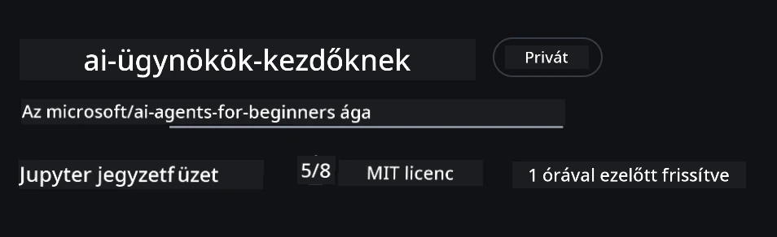
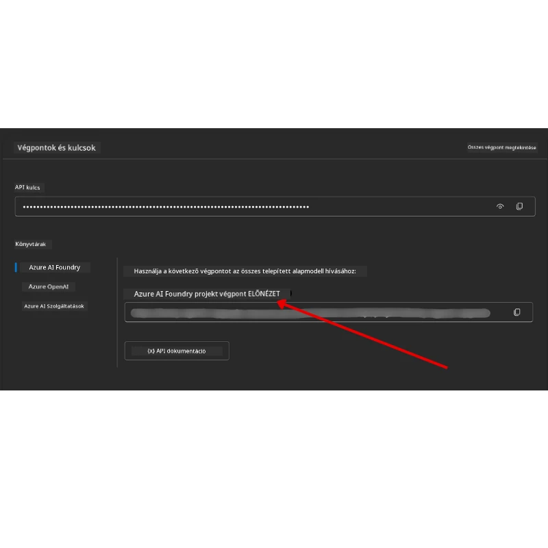

# Tanfolyam beállítása

## Bevezetés

Ebben az órában megmutatjuk, hogyan futtathatók a tanfolyam kódmintái.

## Csatlakozz más tanulókhoz és kérj segítséget

Mielőtt klónoznád a tárhelyedet, csatlakozz az [AI Agents For Beginners Discord csatornához](https://aka.ms/ai-agents/discord), hogy segítséget kapj a beállításhoz, kérdéseket tehess fel a tanfolyammal kapcsolatban, vagy kapcsolatba léphess más tanulókkal.

## Klónozd vagy forkoljad ezt a tárhelyet

Kezdéshez kérjük, klónozd vagy forkoljad a GitHub tárhelyet. Ez létrehozza a saját verziódat a tananyagból, így futtathatod, tesztelheted és módosíthatod a kódot!

Ezt az alábbi linkre kattintva teheted meg: <a href="https://github.com/microsoft/ai-agents-for-beginners/fork" target="_blank">forkold a tárhelyet</a>

Most már meg kell legyen a saját forkolt verziód erről a tanfolyamról az alábbi linken:



### Felületes klón (ajánlott workshop/Codespaces esetén)

  >A teljes tárhely nagy lehet (~3 GB), ha az összes előzményt és fájlt letöltöd. Ha csak a workshopon veszel részt, vagy csak néhány leckemappára van szükséged, akkor a felületes klón (vagy ritkított klónozás) elkerüli a legtöbb letöltést azáltal, hogy az előzményeket lecsökkenti vagy fájlokat kihagy.

#### Gyors felületes klón — minimális előzmények, minden fájl

Az alábbi parancsokban cseréld le a `<your-username>` részt a saját forkod URL-jére (vagy az upstream URL-re, ha azt preferálod).

Csak a legutóbbi commit előzményének klónozásához (kicsi letöltés):

```bash|powershell
git clone --depth 1 https://github.com/<your-username>/ai-agents-for-beginners.git
```

Egy adott ág klónozásához:

```bash|powershell
git clone --depth 1 --branch <branch-name> https://github.com/<your-username>/ai-agents-for-beginners.git
```

#### Részleges (ritkított) klón — minimális blob + csak kiválasztott mappák

Ez részleges klónozást és sparse-checkout-ot használ (Git 2.25+ szükséges, ajánlott modern Git részleges klónozáshoz):

```bash|powershell
git clone --depth 1 --filter=blob:none --sparse https://github.com/<your-username>/ai-agents-for-beginners.git
```

Lépj be a tárhely mappájába:

```bash|powershell
cd ai-agents-for-beginners
```

Majd add meg, mely mappákat szeretnéd (az alábbi példa két mappát mutat):

```bash|powershell
git sparse-checkout set 00-course-setup 01-intro-to-ai-agents
```

A klónozás és a fájlok ellenőrzése után, ha csak fájlokra van szükséged és helyet akarsz felszabadítani (nem kell git előzmény), töröld a tárhely metaadatait (💀visszafordíthatatlan — elvesznek a Git funkciók: nincs commit, pull, push, vagy előzmény elérés).

```bash
# zsh/bash
rm -rf .git
```

```powershell
# PowerShell
Remove-Item -Recurse -Force .git
```

#### GitHub Codespaces használata (ajánlott a nagy helyi letöltések elkerüléséhez)

- Hozz létre egy új Codespace-et ehhez a tárhelyhez a [GitHub UI](https://github.com/codespaces) felületén.
- Az új Codespace termináljában futtasd a fenti felületes/ritkított klónozó parancsok egyikét, hogy csak a szükséges leckemappákat hozd be a Codespace munkaterületre.
- Opcionális: a klónozás után a Codespace-ben töröld a .git mappát a további hely felszabadításához (lásd a fenti törlési parancsokat).
- Megjegyzés: ha közvetlenül Codespace-ben nyitod meg a tárhelyet (klónozás nélkül), vedd figyelembe, hogy a Codespace kialakítja a devcontainer környezetet, és több dolgot telepíthet, mint amire szükséged van. Egy friss Codespace-ben a felületes klónozás jobb kontrollt ad a lemezhasználat felett.

#### Tippek

- Mindig cseréld le a klón URL-jét a saját forkodra, ha szerkeszteni vagy commitolni szeretnél.
- Ha később több előzményre vagy fájlra van szükséged, letöltheted őket, vagy módosíthatod a sparse-checkout beállításait további mappák bevonására.

## A kód futtatása

Ez a tanfolyam egy sor Jupyter Notebookot kínál, amelyek segítségével gyakorlati tapasztalatot szerezhetsz AI ügynökök építésében.

A kódminták a **Microsoft Agent Framework (MAF)** használatával készültek az `AzureAIProjectAgentProvider`-rel, amely kapcsolódik az **Azure AI Agent Service V2**-höz (a Response API) a **Microsoft Foundry**-n keresztül.

Minden Python notebook neve a `*-python-agent-framework.ipynb` végződésű.

## Követelmények

- Python 3.12+
  - **MEGJEGYZÉS**: Ha nincs telepítve Python3.12, telepítsd azt, majd hozd létre a venv környezetet python3.12-vel, hogy a requirements.txt-ben megadott verziók kerüljenek telepítésre.
  
    >Példa

    Python venv könyvtár létrehozása:

    ```bash|powershell
    python -m venv venv
    ```

    Majd aktiváld a venv környezetet a következőkhöz:

    ```bash
    # zsh/bash
    source venv/bin/activate
    ```
  
    ```dos
    # Command Prompt for Windows
    venv\Scripts\activate
    ```

- .NET 10+: A .NET-et használó mintakódokhoz telepítsd a [.NET 10 SDK-t](https://dotnet.microsoft.com/download/dotnet/10.0) vagy újabbat. Ezután ellenőrizd a telepített .NET SDK verziót:

    ```bash|powershell
    dotnet --list-sdks
    ```

- **Azure CLI** — Hitelesítéshez szükséges. Telepítsd innen: [aka.ms/installazurecli](https://aka.ms/installazurecli).
- **Azure-előfizetés** — A Microsoft Foundry és Azure AI Agent Service eléréséhez.
- **Microsoft Foundry projekt** — Egy modelllel telepített projekt (pl. `gpt-4o`). Lásd [1. lépés](#1-lépés-microsoft-foundry-projekt-létrehozása) alább.

A repository gyökérkönyvtárában megtalálod a `requirements.txt` fájlt, amely tartalmazza a kódminták futtatásához szükséges összes Python csomagot.

Telepítésükhöz futtasd a következő parancsot a terminálban a repository gyökérkönyvtárában:

```bash|powershell
pip install -r requirements.txt
```

Ajánlott egy Python virtuális környezet létrehozása az esetleges ütközések és problémák elkerülésére.

## VSCode beállítása

Győződj meg róla, hogy a VSCode-ban a megfelelő Python verzió van kiválasztva.


## Microsoft Foundry és Azure AI Agent Service beállítása

### 1. lépés: Microsoft Foundry projekt létrehozása

Ahhoz, hogy futtasd a notebookokat, szükséged van egy Azure AI Foundry **hubra** és **projektre**, amelyen telepítve van egy modell.

1. Látogass el a [ai.azure.com](https://ai.azure.com) oldalra, és jelentkezz be Azure fiókoddal.
2. Hozz létre egy **hubb**ot (vagy használj meglévőt). Lásd: [Hub erőforrások áttekintése](https://learn.microsoft.com/azure/ai-foundry/concepts/ai-resources).
3. A hubon belül hozz létre egy **projektet**.
4. Telepíts egy modellt (pl. `gpt-4o`) a **Models + Endpoints** → **Deploy model** menüpont alatt.

### 2. lépés: Szerezd meg a projekted végpontját és a modell telepítési nevét

A Microsoft Foundry portálon, a projektedben:

- **Projekt végpont** — Nyisd meg az **Áttekintés** oldalt és másold ki a végpont URL-jét.



- **Modell telepítési neve** — Menj a **Models + Endpoints** részhez, válaszd ki a telepített modelled, és jegyezd meg a **Deployment name**-t (pl. `gpt-4o`).

### 3. lépés: Jelentkezz be az Azure-ba az `az login` segítségével

Minden notebook a **`AzureCliCredential`**-et használja hitelesítéshez — nincs szükség API kulcsokra. Ehhez be kell jelentkezni az Azure CLI-n keresztül.

1. **Telepítsd az Azure CLI-t**, ha még nincs meg: [aka.ms/installazurecli](https://aka.ms/installazurecli)

2. **Jelentkezz be** az alábbi paranccsal:

    ```bash|powershell
    az login
    ```

    Vagy ha távoli/Codespace környezetben vagy, ahol nincs böngésző:

    ```bash|powershell
    az login --use-device-code
    ```

3. **Válaszd ki az előfizetésed**, ha kéri — azt, amely tartalmazza a Foundry projektet.

4. **Ellenőrizd**, hogy be vagy jelentkezve:

    ```bash|powershell
    az account show
    ```

> **Miért az `az login`?** A notebookok az `azure-identity` csomagból az `AzureCliCredential`-t használják hitelesítéshez. Ez azt jelenti, hogy az Azure CLI sessioned szolgáltatja a hitelesítő adatokat — nincs szükség API kulcsokra vagy titkokra a `.env` fájlban. Ez egy [biztonsági bevált gyakorlat](https://learn.microsoft.com/azure/developer/ai/keyless-connections).

### 4. lépés: Hozd létre a `.env` fájlodat

Másold le a minta fájlt:

```bash
# zsh/bash
cp .env.example .env
```

```powershell
# PowerShell
Copy-Item .env.example .env
```

Nyisd meg a `.env` fájlt, és töltsd ki a következő értékeket:

```env
AZURE_AI_PROJECT_ENDPOINT=https://<your-project>.services.ai.azure.com/api/projects/<your-project-id>
AZURE_AI_MODEL_DEPLOYMENT_NAME=gpt-4o
```

| Változó | Hol találod meg |
|----------|-----------------|
| `AZURE_AI_PROJECT_ENDPOINT` | Foundry portál → projekted → **Áttekintés** oldal |
| `AZURE_AI_MODEL_DEPLOYMENT_NAME` | Foundry portál → **Models + Endpoints** → telepített modell neve |

Ennyi az esetek többségében! A notebookok automatikusan hitelesítenek az `az login` session keresztül.

### 5. lépés: Telepítsd a Python függőségeket

```bash|powershell
pip install -r requirements.txt
```

Javasoljuk, hogy ezt a korábban létrehozott virtuális környezetben futtasd.

## További beállítás az 5. leckéhez (Agentic RAG)

Az 5. lecke az **Azure AI Search**-t használja lekérdezéssel bővített generáláshoz. Ha ezt a leckét futtatod, add hozzá ezeket a változókat a `.env` fájlodhoz:

| Változó | Hol találod meg |
|----------|-----------------|
| `AZURE_SEARCH_SERVICE_ENDPOINT` | Azure portál → **Azure AI Search** erőforrásod → **Áttekintés** → URL |
| `AZURE_SEARCH_API_KEY` | Azure portál → **Azure AI Search** erőforrásod → **Beállítások** → **Kulcsok** → elsődleges admin kulcs |

## További beállítás a 6. és 8. leckéhez (GitHub modellek)

A 6. és 8. leckében néhány notebook a **GitHub Modelleket** használja az Azure AI Foundry helyett. Ha ezeket a példákat akarod futtatni, add hozzá ezeket a változókat a `.env` fájlhoz:

| Változó | Hol találod meg |
|----------|-----------------|
| `GITHUB_TOKEN` | GitHub → **Beállítások** → **Fejlesztői beállítások** → **Személyes hozzáférési tokenek** |
| `GITHUB_ENDPOINT` | Használd a `https://models.inference.ai.azure.com` (alapértelmezett érték) |
| `GITHUB_MODEL_ID` | Használni kívánt modell neve (pl. `gpt-4o-mini`) |

## Alternatív szolgáltató: MiniMax (OpenAI-kompatibilis)

A [MiniMax](https://platform.minimaxi.com/) nagy kontextusú modelleket (akár 204K tokenig) kínál egy OpenAI-kompatibilis API-n keresztül. Mivel a Microsoft Agent Framework `OpenAIChatClient` bármely OpenAI-kompatibilis végponttal működik, a MiniMax használható alternatívaként a GitHub Modellek vagy az OpenAI helyett.

Add hozzá ezt a változókat a `.env` fájlodhoz:

| Változó | Hol találod meg |
|----------|-----------------|
| `MINIMAX_API_KEY` | [MiniMax Platform](https://platform.minimaxi.com/) → API kulcsok |
| `MINIMAX_BASE_URL` | Használd a `https://api.minimax.io/v1` (alapértelmezett érték) |
| `MINIMAX_MODEL_ID` | Használni kívánt modell neve (pl. `MiniMax-M2.7`) |

**Elérhető modellek**: `MiniMax-M2.7` (ajánlott), `MiniMax-M2.7-highspeed` (gyorsabb válaszok)

Az `OpenAIChatClient`-et használó kódminták (pl. 14. lecke szállásfoglalási munkafolyamat) automatikusan észlelik és használják a MiniMax konfigurációt, ha be van állítva a `MINIMAX_API_KEY`.

## További beállítás a 8. leckéhez (Bing Grounding munkafolyamat)

A 8. leckében az opcionális munkafolyamat kötetlenül használja a **Bing groundinget** az Azure AI Foundry-n keresztül. Ha ezt a példát futtatod, add hozzá ezt a változót a `.env` fájlhoz:

| Változó | Hol találod meg |
|----------|-----------------|
| `BING_CONNECTION_ID` | Azure AI Foundry portál → projekted → **Management** → **Connected resources** → Bing kapcsolatod → másold ki a kapcsolat ID-t |

## Hibakeresés

### SSL tanúsítvány ellenőrzési hibák macOS-en

Ha macOS-en az alábbihoz hasonló hibaüzenetet kapsz:

```plaintext
ssl.SSLCertVerificationError: [SSL: CERTIFICATE_VERIFY_FAILED] certificate verify failed: self-signed certificate in certificate chain
```

Ez egy ismert probléma Python alatt macOS-en, ahol a rendszer SSL tanúsítványai nem kerülnek automatikusan elfogadásra. Próbáld ki a következő megoldásokat sorrendben:

**1. opció: Futtasd a Python telepítési tanúsítvány szkriptjét (ajánlott)**

```bash
# Cseréld le a 3.XX-et a telepített Python verziódra (pl. 3.12 vagy 3.13):
/Applications/Python\ 3.XX/Install\ Certificates.command
```

**2. opció: Használd a `connection_verify=False` beállítást a notebookodban (csak GitHub Modellek notebookokhoz)**

A 6. leckében lévő notebookban (`06-building-trustworthy-agents/code_samples/06-system-message-framework.ipynb`) egy megjegyzett megoldás már benne van. Feloldhatod a kommentet a `connection_verify=False`-on a kliens létrehozásánál:

```python
client = ChatCompletionsClient(
    endpoint=endpoint,
    credential=AzureKeyCredential(token),
    connection_verify=False,  # Tiltsa le az SSL ellenőrzést, ha tanúsítványhibákkal találkozik
)
```

> **⚠️ Figyelem:** Az SSL ellenőrzés kikapcsolása (`connection_verify=False`) csökkenti a biztonságot azáltal, hogy kihagyja a tanúsítványok érvényesítését. Ezt csak fejlesztési környezetekben, ideiglenes megoldásként használd, soha ne éles rendszerben.

**3. opció: Telepítsd és használd a `truststore`-t**

```bash
pip install truststore
```

Ezután add hozzá a következőt a notebook vagy szkript tetejére, mielőtt hálózati hívásokat végeznél:

```python
import truststore
truststore.inject_into_ssl()
```

## Elakadtál valahol?

Ha bármilyen problémád van a beállítással, gyere be a <a href="https://discord.gg/kzRShWzttr" target="_blank">Azure AI Community Discord</a> csatornába vagy <a href="https://github.com/microsoft/ai-agents-for-beginners/issues?WT.mc_id=academic-105485-koreyst" target="_blank">nyiss egy hibajegyet</a>.

## Következő lecke

Most már készen állsz a tanfolyam kódjának futtatására. Sok sikert az AI ügynökök világának felfedezéséhez!

[Bevezetés az AI ügynökök és ügynök alkalmazások témakörébe](../01-intro-to-ai-agents/README.md)

---

<!-- CO-OP TRANSLATOR DISCLAIMER START -->
**Felelősségkizárás**:  
Ezt a dokumentumot az AI fordító szolgáltatás [Co-op Translator](https://github.com/Azure/co-op-translator) segítségével fordítottuk. Bár a pontosságra törekszünk, kérjük, vegye figyelembe, hogy az automatikus fordítások hibákat vagy pontatlanságokat tartalmazhatnak. Az eredeti dokumentum az anyanyelvén tekintendő hiteles forrásnak. Fontos információk esetén javasolt professzionális, emberi fordítást igénybe venni. Nem vállalunk felelősséget az ezen fordítás használatából eredő félreértésekért vagy téves értelmezésekért.
<!-- CO-OP TRANSLATOR DISCLAIMER END -->