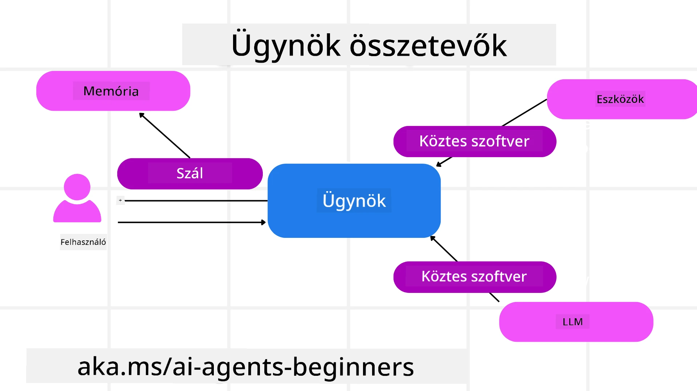

# A Microsoft Agent Framework felfedezése


### Bevezetés

Ez a lecke a következőket fogja lefedni:

- A Microsoft Agent Framework megértése: Főbb jellemzők és érték  
- A Microsoft Agent Framework kulcsfogalmainak feltérképezése
- Fejlett MAF minták: Munkafolyamatok, köztes réteg és memória

## Tanulási célok

A lecke elvégzése után tudni fogod, hogyan:

- Éles környezetbe alkalmas AI-ügynököket építs a Microsoft Agent Framework segítségével
- Alkalmazd a Microsoft Agent Framework alapvető funkcióit az ügynökös felhasználási eseteidhez
- Használj fejlett mintákat, beleértve a munkafolyamatokat, köztes réteget és megfigyelhetőséget

## Kódminták

A [Microsoft Agent Framework (MAF)](https://aka.ms/ai-agents-beginners/agent-framewrok) kódmintái megtalálhatók ebben a tárolóban az `xx-python-agent-framework` és `xx-dotnet-agent-framework` fájlok alatt.

## A Microsoft Agent Framework megértése


A [Microsoft Agent Framework (MAF)](https://aka.ms/ai-agents-beginners/agent-framewrok) a Microsoft egységes keretrendszere AI-ügynökök építéséhez. Rugalmasságot kínál az ügynökös felhasználási esetek széles skálájának kezelésére, amelyek mind az éles, mind a kutatási környezetekben előfordulnak, többek között:

- **Szekvenciális ügynök-orkesztráció** olyan forgatókönyvekben, ahol lépésről lépésre haladó munkafolyamatokra van szükség.
- **Párhuzamos orkesztráció** olyan helyzetekben, ahol az ügynököknek egyszerre kell elvégezniük feladatokat.
- **Csoportos csevegés orkesztrációja** olyan helyzetekben, ahol az ügynökök egy feladaton együttműködnek.
- **Feladat átadás orkesztrációja** olyan helyzetekben, ahol az ügynökök egymásnak adják át a feladatot, ahogy az alfeladatok elkészülnek.
- **Mágneses orkesztráció** olyan helyzetekben, ahol egy menedzserügynök létrehoz és módosít egy feladatlistát, és koordinálja az alügynököket a feladat végrehajtásához.

Az AI-ügynökök éles környezetbe szállításához a MAF az alábbi funkciókat is tartalmazza:

- **Megfigyelhetőség** OpenTelemetry használatával, amely minden AI-ügynök műveletet nyomon követ, beleértve az eszközhívásokat, orkesztrációs lépéseket, gondolkodási folyamatokat és teljesítménymonitorozást a Microsoft Foundry műszerfalán.
- **Biztonság** az ügynökök natív fogadásával a Microsoft Foundry-n, amely biztonsági vezérlőket tartalmaz, mint például szerepalapú hozzáférés, privát adatkezelés és beépített tartalombiztonság.
- **Tartósság** az ügynök szálak és munkafolyamatok szüneteltethetők, folytathatók és hibákból helyreállíthatók, ami hosszabb idejű folyamatokat tesz lehetővé.
- **Irányítás** a "human in the loop" munkafolyamatok támogatásával, ahol a feladatokat emberi jóváhagyáshoz jelölik.

A Microsoft Agent Framework az interoperabilitásra is fókuszál az alábbi módokon:

- **Felhasználófüggetlen felhőhasználat** - Az ügynökök futhatnak konténerekben, helyszínen és különböző felhőszolgáltatások között.
- **Szolgáltatófüggetlenség** - Az ügynökök létrehozhatók a preferált SDK-n keresztül, beleértve az Azure OpenAI és OpenAI rendszereket.
- **Nyílt szabványok integrációja** - Az ügynökök használhatják az Agent-to-Agent(A2A) és Model Context Protocol (MCP) protokollokat, hogy felfedezzék és használják más ügynököket és eszközöket.
- **Bővítmények és csatlakozók** - Kapcsolatok létesíthetők adat- és memória szolgáltatásokhoz, mint például Microsoft Fabric, SharePoint, Pinecone és Qdrant.

Nézzük meg, hogyan alkalmazzák ezeket a funkciókat a Microsoft Agent Framework néhány kulcsfogalmánál.

## A Microsoft Agent Framework kulcsfogalmai

### Ügynökök



**Ügynökök létrehozása**

Ügynök létrehozása az inferencia szolgáltatás (LLM szolgáltató), az AI-ügynök követendő utasításainak és egy hozzárendelt `name` megadásával történik:

```python
agent = AzureOpenAIChatClient(credential=AzureCliCredential()).create_agent( instructions="You are good at recommending trips to customers based on their preferences.", name="TripRecommender" )
```
  
A fentiek az `Azure OpenAI` használatával készülnek, de ügynökök létrehozhatók különféle szolgáltatásokkal, beleértve a `Microsoft Foundry Agent Service`-t:

```python
AzureAIAgentClient(async_credential=credential).create_agent( name="HelperAgent", instructions="You are a helpful assistant." ) as agent
```
  
OpenAI `Responses`, `ChatCompletion` API-k

```python
agent = OpenAIResponsesClient().create_agent( name="WeatherBot", instructions="You are a helpful weather assistant.", )
```
  
```python
agent = OpenAIChatClient().create_agent( name="HelpfulAssistant", instructions="You are a helpful assistant.", )
```
  
vagy a [MiniMax](https://platform.minimaxi.com/), amely OpenAI-kompatibilis API-t kínál nagyméretű kontextusablakokkal (akár 204K tokenig):

```python
agent = OpenAIChatClient(base_url="https://api.minimax.io/v1", api_key=os.environ["MINIMAX_API_KEY"], model_id="MiniMax-M2.7").create_agent( name="HelpfulAssistant", instructions="You are a helpful assistant.", )
```
  
vagy távoli ügynökökkel az A2A protokollon keresztül:

```python
agent = A2AAgent( name=agent_card.name, description=agent_card.description, agent_card=agent_card, url="https://your-a2a-agent-host" )
```
  
**Ügynökök futtatása**

Az ügynökök futtatása a `.run` vagy `.run_stream` metódusokkal történik, nem-streaming vagy streaming válaszokhoz.

```python
result = await agent.run("What are good places to visit in Amsterdam?")
print(result.text)
```
  
```python
async for update in agent.run_stream("What are the good places to visit in Amsterdam?"):
    if update.text:
        print(update.text, end="", flush=True)

```
  
Minden ügynökfutásnál megadhatók opciók, melyekkel testreszabhatók olyan paraméterek, mint az ügynök által használt `max_tokens`, az ügynök által hívható `tools` és akár maga az `model` is.

Ez hasznos olyan esetekben, ahol konkrét modellek vagy eszközök szükségesek a felhasználói feladat elvégzéséhez.

**Eszközök**

Eszközök definiálhatók mind az ügynök definiálásakor:

```python
def get_attractions( location: Annotated[str, Field(description="The location to get the top tourist attractions for")], ) -> str: """Get the top tourist attractions for a given location.""" return f"The top attractions for {location} are." 


# Amikor közvetlenül ChatAgent-et hozunk létre

agent = ChatAgent( chat_client=OpenAIChatClient(), instructions="You are a helpful assistant", tools=[get_attractions]

```
  
mind a futtatáskor:

```python

result1 = await agent.run( "What's the best place to visit in Seattle?", tools=[get_attractions] # Csak erre a futtatásra biztosított eszköz )
```
  
**Agent szálak**

Az ügynök szálak többfordulós beszélgetések kezelésére szolgálnak. A szálak létrehozhatók:

- A `get_new_thread()` használatával, amely lehetővé teszi a szál későbbi mentését
- Automatikus szál létrehozásával az ügynök futtatásakor, amely csak az aktuális futás idejére él.

Szál létrehozására az alábbi kódpélda szolgál:

```python
# Hozzon létre egy új szálat.
thread = agent.get_new_thread() # Futtassa az ügynököt a szállal.
response = await agent.run("Hello, I am here to help you book travel. Where would you like to go?", thread=thread)

```
  
A szálat később sorosíthatod és elmentheted tárolásra:

```python
# Hozzon létre egy új szálat.
thread = agent.get_new_thread() 

# Futtassa az ügynököt a szállal.

response = await agent.run("Hello, how are you?", thread=thread) 

# Sorosítsa a szálat tárolás céljából.

serialized_thread = await thread.serialize() 

# Szerezze vissza a szál állapotát tárolásból történő betöltés után.

resumed_thread = await agent.deserialize_thread(serialized_thread)
```
  
**Agent köztes réteg**

Az ügynökök eszközökkel és LLM-ekkel működnek együtt a felhasználói feladatok elvégzéséhez. Bizonyos esetekben a köztük zajló interakciók közti végrehajtásra vagy nyomon követésre van szükség. Az agent middleware lehetővé teszi ezt az alábbi módokon:

*Funkció middleware*

Ez a köztes réteg lehetővé teszi, hogy az ügynök és a hívott funkció/eszköz között végrehajtsunk egy műveletet. Például használható a funkcióhívások naplózására.

A következő kódban a `next` határozza meg, hogy a következő middleware vagy a tényleges funkció hívódjon meg.

```python
async def logging_function_middleware(
    context: FunctionInvocationContext,
    next: Callable[[FunctionInvocationContext], Awaitable[None]],
) -> None:
    """Function middleware that logs function execution."""
    # Előfeldolgozás: Naplózás a függvény végrehajtása előtt
    print(f"[Function] Calling {context.function.name}")

    # Folytatás a következő köztes réteggel vagy a függvény végrehajtásával
    await next(context)

    # Utófeldolgozás: Naplózás a függvény végrehajtása után
    print(f"[Function] {context.function.name} completed")
```
  
*Chat middleware*

Ez a köztes réteg lehetővé teszi, hogy az ügynök és az LLM közötti kérések között hajtsunk végre vagy naplózzunk műveletet.

Ez tartalmaz fontos információkat, mint például a mesterséges intelligencia szolgáltatásnak küldött `messages`.

```python
async def logging_chat_middleware(
    context: ChatContext,
    next: Callable[[ChatContext], Awaitable[None]],
) -> None:
    """Chat middleware that logs AI interactions."""
    # Előfeldolgozás: Naplózás az MI hívás előtt
    print(f"[Chat] Sending {len(context.messages)} messages to AI")

    # Folytatás a következő middleware vagy MI szolgáltatás felé
    await next(context)

    # Utófeldolgozás: Naplózás az MI válasz után
    print("[Chat] AI response received")

```
  
**Agent memória**

Az `Agentic Memory` leckében tárgyalt módon a memória fontos eleme annak, hogy az ügynök különböző kontextusok között működhessen. A MAF többféle memóriatípust kínál:

*Memória tárolása a memóriában*

Ez az a memória, amely a szálakban tárolódik az alkalmazás futása közben.

```python
# Hozzon létre egy új szálat.
thread = agent.get_new_thread() # Futtassa az ügynököt a szállal.
response = await agent.run("Hello, I am here to help you book travel. Where would you like to go?", thread=thread)
```
  
*Állandó üzenetek*

Ez a memória a beszélgetés előzményeinek tárolására szolgál különböző munkamenetek között. A `chat_message_store_factory` használatával definiálható:

```python
from agent_framework import ChatMessageStore

# Egyéni üzenettár létrehozása
def create_message_store():
    return ChatMessageStore()

agent = ChatAgent(
    chat_client=OpenAIChatClient(),
    instructions="You are a Travel assistant.",
    chat_message_store_factory=create_message_store
)

```
  
*Dinamikus memória*

Ezt a memóriát hozzáadják a kontextushoz az ügynökök futtatása előtt. Ezek a memóriák külső szolgáltatásokban tárolhatók, például mem0-ban:

```python
from agent_framework.mem0 import Mem0Provider

# Mem0 használata fejlett memóriaképességekhez
memory_provider = Mem0Provider(
    api_key="your-mem0-api-key",
    user_id="user_123",
    application_id="my_app"
)

agent = ChatAgent(
    chat_client=OpenAIChatClient(),
    instructions="You are a helpful assistant with memory.",
    context_providers=memory_provider
)

```
  
**Agent megfigyelhetőség**

A megfigyelhetőség fontos a megbízható és karbantartható ügynök rendszerek építéséhez. A MAF integrálva van az OpenTelemetry-vel, hogy jobb követést és mérőszámokat biztosítson.

```python
from agent_framework.observability import get_tracer, get_meter

tracer = get_tracer()
meter = get_meter()
with tracer.start_as_current_span("my_custom_span"):
    # csinálj valamit
    pass
counter = meter.create_counter("my_custom_counter")
counter.add(1, {"key": "value"})
```
  
### Munkafolyamatok

A MAF munkafolyamatokat kínál, amelyek előre definiált lépések egy feladat elvégzéséhez, amelyekben AI-ügynökök is szerepelnek komponensként.

A munkafolyamatok különböző komponensekből állnak, amelyek jobb vezérlést tesznek lehetővé. A munkafolyamatok támogatják a **több ügynökös orkesztrációt** és a **biztonsági mentést**, hogy a munkafolyamat állapotokat el lehessen menteni.

Egy munkafolyamat alapvető komponensei:

**Végrehajtók**

A végrehajtók bemeneti üzeneteket fogadnak, elvégzik a rájuk bízott feladatokat, majd kimeneti üzenetet állítanak elő. Ez előrébb viszi a munkafolyamatot a nagyobb feladat megoldása felé. A végrehajtók lehetnek AI-ügynökök vagy egyedi logikai elemek.

**Élek**

Az élek a munkafolyamatban meghatározzák az üzenetek áramlását. Ezek lehetnek:

*Közvetlen élek* - Egyszerű egy-egy kapcsolat a végrehajtók között:

```python
from agent_framework import WorkflowBuilder

builder = WorkflowBuilder()
builder.add_edge(source_executor, target_executor)
builder.set_start_executor(source_executor)
workflow = builder.build()
```
  
*Feltételes élek* - Egy adott feltétel teljesülése után aktiválódnak. Például, amikor a szállodai szobák nem elérhetők, a végrehajtó más lehetőségeket javasolhat.

*Kapcsoló-ág élek* - Üzenetek irányítása különböző végrehajtókhoz meghatározott feltételek alapján. Például, ha az utazó ügyfél prioritási hozzáféréssel rendelkezik, a feladatai egy másik munkafolyamaton keresztül lesznek kezelve.

*Szóró élek* - Egy üzenetet több célpontra küldenek.

*Gyűjtő élek* - Több üzenetet gyűjtenek különböző végrehajtóktól, és azokat egy célpontra küldik.

**Események**

A jobb megfigyelhetőség érdekében a MAF beépített eseményeket kínál a végrehajtáshoz, többek között:

- `WorkflowStartedEvent`  - A munkafolyamat végrehajtása elindul
- `WorkflowOutputEvent` - A munkafolyamat kimenetet állít elő
- `WorkflowErrorEvent` - A munkafolyamat hibába ütközik
- `ExecutorInvokeEvent`  - A végrehajtó elkezdi a feldolgozást
- `ExecutorCompleteEvent`  -  A végrehajtó befejezi a feldolgozást
- `RequestInfoEvent` - Kérés lett indítva

## Fejlett MAF minták

A fenti szakaszok lefedik a Microsoft Agent Framework kulcsfogalmait. Ahogy egyre összetettebb ügynököket építesz, íme néhány fejlett minta, amit érdemes megfontolni:

- **Köztes rétegek összefűzése**: Több köztes réteg kezelő (naplózás, hitelesítés, sebességkorlátozás) láncolása funkció- és chat-middleware segítségével az ügynök viselkedésének finomhangolásához.
- **Munkafolyamat biztonsági mentése**: A munkafolyamat-események és a sorosítás használata az ügynök hosszú futású folyamatainek mentéséhez és folytatásához.
- **Dinamikus eszközválasztás**: RAG használata az eszközleírások felett együtt a MAF eszközregisztrációjával, hogy csak a releváns eszközöket mutassa meg lekérdezésenként.
- **Több ügynök közti átadás**: Munkafolyamat élek és feltételes útválasztás használata a specializált ügynökök közötti átadások orkesztrációjához.

## Kódminták

A Microsoft Agent Framework kódmintái megtalálhatók ebben a tárolóban az `xx-python-agent-framework` és `xx-dotnet-agent-framework` fájlok alatt.

## Van még kérdésed a Microsoft Agent Frameworkről?

Csatlakozz a [Microsoft Foundry Discord](https://aka.ms/ai-agents/discord) közösséghez, hogy találkozz más tanulókkal, részt vegyél konzultációkon és választ kapj AI-ügynökökkel kapcsolatos kérdéseidre.

---

<!-- CO-OP TRANSLATOR DISCLAIMER START -->
**Felelősség kizárása**:  
Ez a dokumentum az AI fordító szolgáltatás, a [Co-op Translator](https://github.com/Azure/co-op-translator) segítségével készült. Bár a pontosságra törekszünk, kérjük, vegye figyelembe, hogy az automatikus fordítások hibákat vagy pontatlanságokat tartalmazhatnak. Az eredeti, anyanyelvén írt dokumentumot kell tekinteni a hiteles forrásnak. Kritikus információk esetén professzionális emberi fordítást javaslunk. Nem vállalunk felelősséget az ebből a fordításból eredő félreértésekért vagy félreértelmezésekért.
<!-- CO-OP TRANSLATOR DISCLAIMER END -->