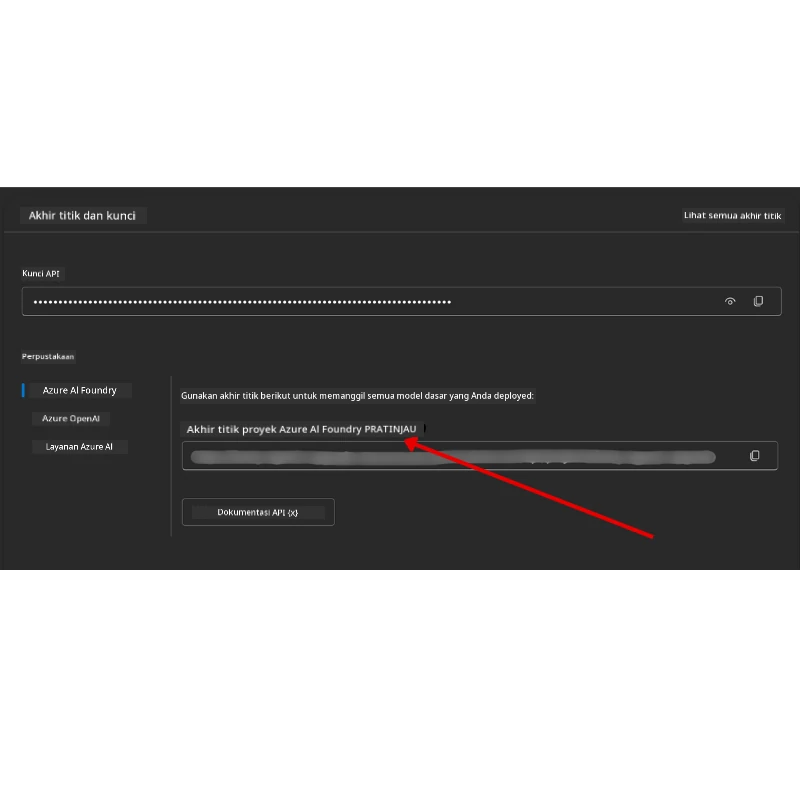

# Penyiapan Kursus

## Pendahuluan

Pelajaran ini akan membahas cara menjalankan contoh kode dari kursus ini.

## Bergabung dengan Pembelajar Lain dan Dapatkan Bantuan

Sebelum Anda mulai mengkloning repo Anda, bergabunglah dengan [saluran Discord AI Agents For Beginners](https://aka.ms/ai-agents/discord) untuk mendapatkan bantuan terkait penyiapan, pertanyaan tentang kursus, atau untuk terhubung dengan pembelajar lain.

## Kloning atau Fork Repo ini

Untuk memulai, silakan kloning atau fork Repository GitHub. Ini akan membuat versi Anda sendiri dari materi kursus sehingga Anda dapat menjalankan, menguji, dan memodifikasi kodenya!

Ini dapat dilakukan dengan mengklik tautan untuk <a href="https://github.com/microsoft/ai-agents-for-beginners/fork" target="_blank">fork repo</a>

Sekarang Anda harus memiliki versi fork Anda sendiri dari kursus ini pada tautan berikut:


### Shallow Clone (direkomendasikan untuk workshop / Codespaces)

  >Repository penuh bisa sangat besar (~3 GB) saat Anda mengunduh sejarah penuh dan semua file. Jika Anda hanya mengikuti workshop atau hanya membutuhkan beberapa folder pelajaran, shallow clone (atau sparse clone) menghindari sebagian besar unduhan tersebut dengan memotong sejarah dan/atau melewati blob.

#### Shallow clone cepat — sejarah minimal, semua file

Ganti `<your-username>` pada perintah di bawah dengan URL fork Anda (atau URL upstream jika Anda lebih suka).

Untuk mengkloning hanya sejarah commit terbaru (unduhan kecil):

```bash|powershell
git clone --depth 1 https://github.com/<your-username>/ai-agents-for-beginners.git
```

Untuk mengkloning cabang tertentu:

```bash|powershell
git clone --depth 1 --branch <branch-name> https://github.com/<your-username>/ai-agents-for-beginners.git
```

#### Kloning parsial (sparse) — blob minimal + hanya folder yang dipilih

Ini menggunakan partial clone dan sparse-checkout (membutuhkan Git 2.25+ dan Git modern yang disarankan dengan dukungan partial clone):

```bash|powershell
git clone --depth 1 --filter=blob:none --sparse https://github.com/<your-username>/ai-agents-for-beginners.git
```

Masuk ke folder repo:

```bash|powershell
cd ai-agents-for-beginners
```

Kemudian tentukan folder mana yang Anda inginkan (contoh di bawah menunjukkan dua folder):

```bash|powershell
git sparse-checkout set 00-course-setup 01-intro-to-ai-agents
```

Setelah mengkloning dan memverifikasi file, jika Anda hanya membutuhkan file dan ingin menghemat ruang (tanpa sejarah git), harap hapus metadata repository (💀tidak bisa dibalik — Anda akan kehilangan semua fungsi Git: tanpa commit, pull, push, atau akses sejarah).

```bash
# zsh/bash
rm -rf .git
```

```powershell
# PowerShell
Remove-Item -Recurse -Force .git
```

#### Menggunakan GitHub Codespaces (direkomendasikan untuk menghindari unduhan besar lokal)

- Buat Codespace baru untuk repo ini melalui [GitHub UI](https://github.com/codespaces).  

- Di terminal codespace yang baru dibuat, jalankan salah satu perintah shallow/sparse clone di atas untuk membawa hanya folder pelajaran yang Anda butuhkan ke dalam workspace Codespace.
- Opsional: setelah mengkloning di dalam Codespaces, hapus .git untuk mendapatkan kembali ruang tambahan (lihat perintah penghapusan di atas).
- Catatan: Jika Anda lebih suka membuka repo langsung di Codespaces (tanpa kloning tambahan), perlu diketahui Codespaces akan membangun lingkungan devcontainer dan mungkin masih menyediakan lebih banyak dari yang Anda butuhkan. Mengkloning salinan shallow di dalam Codespace baru memberikan Anda kontrol lebih atas penggunaan disk.

#### Tips

- Selalu ganti URL kloning dengan fork Anda jika Anda ingin mengedit/commit.
- Jika nanti Anda membutuhkan lebih banyak sejarah atau file, Anda dapat mengambilnya atau menyesuaikan sparse-checkout untuk menyertakan folder tambahan.

## Menjalankan Kode

Kursus ini menawarkan serangkaian Jupyter Notebooks yang dapat Anda jalankan untuk mendapatkan pengalaman langsung membangun AI Agents.

Contoh kode menggunakan **Microsoft Agent Framework (MAF)** dengan `AzureAIProjectAgentProvider`, yang terhubung ke **Azure AI Agent Service V2** (Responses API) melalui **Microsoft Foundry**.

Semua notebook Python diberi label `*-python-agent-framework.ipynb`.

## Persyaratan

- Python 3.12+
  - **CATATAN**: Jika Anda belum menginstal Python3.12, pastikan Anda menginstalnya. Kemudian buat venv Anda menggunakan python3.12 untuk memastikan versi yang benar diinstal dari file requirements.txt.
  
    >Contoh

    Buat direktori Python venv:

    ```bash|powershell
    python -m venv venv
    ```

    Kemudian aktifkan lingkungan venv untuk:

    ```bash
    # zsh/bash
    source venv/bin/activate
    ```
  
    ```dos
    # Command Prompt for Windows
    venv\Scripts\activate
    ```

- .NET 10+: Untuk contoh kode yang menggunakan .NET, pastikan Anda menginstal [.NET 10 SDK](https://dotnet.microsoft.com/download/dotnet/10.0) atau versi yang lebih baru. Kemudian, periksa versi .NET SDK yang terinstal:

    ```bash|powershell
    dotnet --list-sdks
    ```

- **Azure CLI** — Diperlukan untuk otentikasi. Instal dari [aka.ms/installazurecli](https://aka.ms/installazurecli).
- **Langganan Azure** — Untuk akses ke Microsoft Foundry dan Azure AI Agent Service.
- **Proyek Microsoft Foundry** — Proyek dengan model yang sudah diterapkan (misalnya, `gpt-4o`). Lihat [Langkah 1](#langkah-1-buat-proyek-microsoft-foundry) di bawah.

Kami telah menyertakan file `requirements.txt` di root repository ini yang memuat semua paket Python yang dibutuhkan untuk menjalankan contoh kode.

Anda dapat menginstalnya dengan menjalankan perintah berikut di terminal pada direktori root repository:

```bash|powershell
pip install -r requirements.txt
```

Kami menyarankan membuat lingkungan virtual Python untuk menghindari konflik dan masalah.

## Penyiapan VSCode

Pastikan Anda menggunakan versi Python yang tepat di VSCode.


## Penyiapan Microsoft Foundry dan Azure AI Agent Service

### Langkah 1: Buat Proyek Microsoft Foundry

Anda membutuhkan **hub** dan **proyek** Azure AI Foundry dengan model yang sudah diterapkan untuk menjalankan notebook.

1. Buka [ai.azure.com](https://ai.azure.com) dan masuk dengan akun Azure Anda.
2. Buat **hub** (atau gunakan yang sudah ada). Lihat: [Ringkasan sumber daya hub](https://learn.microsoft.com/azure/ai-foundry/concepts/ai-resources).
3. Di dalam hub, buat sebuah **proyek**.
4. Terapkan model (misalnya, `gpt-4o`) dari **Models + Endpoints** → **Deploy model**.

### Langkah 2: Ambil Endpoint Proyek dan Nama Deployment Model Anda

Dari proyek Anda di portal Microsoft Foundry:

- **Project Endpoint** — Buka halaman **Overview** dan salin URL endpoint.



- **Model Deployment Name** — Buka **Models + Endpoints**, pilih model yang sudah diterapkan, dan catat **Deployment name** (misalnya, `gpt-4o`).

### Langkah 3: Masuk ke Azure dengan `az login`

Semua notebook menggunakan **`AzureCliCredential`** untuk otentikasi — tidak ada kunci API yang perlu dikelola. Ini mengharuskan Anda masuk melalui Azure CLI.

1. **Instal Azure CLI** jika Anda belum menginstal: [aka.ms/installazurecli](https://aka.ms/installazurecli)

2. **Masuk** dengan menjalankan:

    ```bash|powershell
    az login
    ```

    Atau jika Anda berada di lingkungan remote/Codespace tanpa browser:

    ```bash|powershell
    az login --use-device-code
    ```

3. **Pilih langganan Anda** jika diminta — pilih yang berisi proyek Foundry Anda.

4. **Verifikasi** Anda sudah masuk:

    ```bash|powershell
    az account show
    ```

> **Mengapa `az login`?** Notebook melakukan otentikasi menggunakan `AzureCliCredential` dari paket `azure-identity`. Ini berarti sesi Azure CLI Anda memberikan kredensial — tidak ada kunci API atau rahasia di file `.env` Anda. Ini adalah [praktik keamanan terbaik](https://learn.microsoft.com/azure/developer/ai/keyless-connections).

### Langkah 4: Buat File `.env` Anda

Salin file contoh:

```bash
# zsh/bash
cp .env.example .env
```

```powershell
# PowerShell
Copy-Item .env.example .env
```

Buka `.env` dan isi dua nilai ini:

```env
AZURE_AI_PROJECT_ENDPOINT=https://<your-project>.services.ai.azure.com/api/projects/<your-project-id>
AZURE_AI_MODEL_DEPLOYMENT_NAME=gpt-4o
```

| Variabel | Tempat menemukannya |
|----------|--------------------|
| `AZURE_AI_PROJECT_ENDPOINT` | Portal Foundry → proyek Anda → halaman **Overview** |
| `AZURE_AI_MODEL_DEPLOYMENT_NAME` | Portal Foundry → **Models + Endpoints** → nama model yang diterapkan |

Itu saja untuk sebagian besar pelajaran! Notebook akan melakukan otentikasi otomatis melalui sesi `az login` Anda.

### Langkah 5: Instalasi Dependensi Python

```bash|powershell
pip install -r requirements.txt
```

Kami menyarankan menjalankan ini di dalam lingkungan virtual yang Anda buat sebelumnya.

## Penyiapan Tambahan untuk Pelajaran 5 (Agentic RAG)

Pelajaran 5 menggunakan **Azure AI Search** untuk retrieval-augmented generation. Jika Anda berencana menjalankan pelajaran itu, tambahkan variabel berikut ke file `.env` Anda:

| Variabel | Tempat menemukannya |
|----------|--------------------|
| `AZURE_SEARCH_SERVICE_ENDPOINT` | Portal Azure → sumber daya **Azure AI Search** Anda → **Overview** → URL |
| `AZURE_SEARCH_API_KEY` | Portal Azure → sumber daya **Azure AI Search** Anda → **Settings** → **Keys** → kunci admin utama |

## Penyiapan Tambahan untuk Pelajaran 6 dan Pelajaran 8 (GitHub Models)

Beberapa notebook di pelajaran 6 dan 8 menggunakan **GitHub Models** sebagai pengganti Azure AI Foundry. Jika Anda berencana menjalankan contoh tersebut, tambahkan variabel ini ke file `.env` Anda:

| Variabel | Tempat menemukannya |
|----------|--------------------|
| `GITHUB_TOKEN` | GitHub → **Settings** → **Developer settings** → **Personal access tokens** |
| `GITHUB_ENDPOINT` | Gunakan `https://models.inference.ai.azure.com` (nilai default) |
| `GITHUB_MODEL_ID` | Nama model yang digunakan (misal `gpt-4o-mini`) |

## Provider Alternatif: MiniMax (Kompatibel OpenAI)

[MiniMax](https://platform.minimaxi.com/) menyediakan model konteks besar (hingga 204K token) melalui API yang kompatibel dengan OpenAI. Karena `OpenAIChatClient` pada Microsoft Agent Framework bekerja dengan endpoint yang kompatibel dengan OpenAI mana pun, Anda dapat menggunakan MiniMax sebagai alternatif pengganti untuk GitHub Models atau OpenAI.

Tambahkan variabel ini ke file `.env` Anda:

| Variabel | Tempat menemukannya |
|----------|--------------------|
| `MINIMAX_API_KEY` | [MiniMax Platform](https://platform.minimaxi.com/) → API Keys |
| `MINIMAX_BASE_URL` | Gunakan `https://api.minimax.io/v1` (nilai default) |
| `MINIMAX_MODEL_ID` | Nama model yang digunakan (misal, `MiniMax-M2.7`) |

**Model yang tersedia**: `MiniMax-M2.7` (direkomendasikan), `MiniMax-M2.7-highspeed` (respon lebih cepat)

Contoh kode yang menggunakan `OpenAIChatClient` (misalnya workflow pemesanan hotel Pelajaran 14) akan secara otomatis mengenali dan menggunakan konfigurasi MiniMax Anda ketika `MINIMAX_API_KEY` diatur.

## Penyiapan Tambahan untuk Pelajaran 8 (Bing Grounding Workflow)

Notebook workflow kondisional di pelajaran 8 menggunakan **Bing grounding** melalui Azure AI Foundry. Jika Anda berencana menjalankan contoh ini, tambahkan variabel ini ke file `.env` Anda:

| Variabel | Tempat menemukannya |
|----------|--------------------|
| `BING_CONNECTION_ID` | Portal Azure AI Foundry → proyek Anda → **Management** → **Connected resources** → koneksi Bing Anda → salin ID koneksi |

## Pemecahan Masalah

### Kesalahan Verifikasi Sertifikat SSL di macOS

Jika Anda menggunakan macOS dan mengalami error seperti:

```plaintext
ssl.SSLCertVerificationError: [SSL: CERTIFICATE_VERIFY_FAILED] certificate verify failed: self-signed certificate in certificate chain
```

Ini adalah masalah yang diketahui dengan Python di macOS di mana sertifikat SSL sistem tidak secara otomatis dipercaya. Coba solusi berikut secara berurutan:

**Opsi 1: Jalankan skrip Install Certificates Python (direkomendasikan)**

```bash
# Ganti 3.XX dengan versi Python yang Anda pasang (misalnya, 3.12 atau 3.13):
/Applications/Python\ 3.XX/Install\ Certificates.command
```

**Opsi 2: Gunakan `connection_verify=False` di notebook Anda (hanya untuk notebook GitHub Models)**

Di notebook Pelajaran 6 (`06-building-trustworthy-agents/code_samples/06-system-message-framework.ipynb`), ada solusi yang dikomentari sudah termasuk. Buka komentar pada `connection_verify=False` saat membuat klien:

```python
client = ChatCompletionsClient(
    endpoint=endpoint,
    credential=AzureKeyCredential(token),
    connection_verify=False,  # Nonaktifkan verifikasi SSL jika Anda mengalami kesalahan sertifikat
)
```

> **⚠️ Peringatan:** Menonaktifkan verifikasi SSL (`connection_verify=False`) mengurangi keamanan dengan melewati validasi sertifikat. Gunakan ini hanya sebagai solusi sementara di lingkungan pengembangan, jangan gunakan di produksi.

**Opsi 3: Instal dan gunakan `truststore`**

```bash
pip install truststore
```

Kemudian tambahkan ini di bagian atas notebook atau skrip sebelum melakukan panggilan jaringan apapun:

```python
import truststore
truststore.inject_into_ssl()
```

## Terjebak di Mana?

Jika Anda mengalami masalah menjalankan penyiapan ini, silakan bergabung ke <a href="https://discord.gg/kzRShWzttr" target="_blank">Azure AI Community Discord</a> atau <a href="https://github.com/microsoft/ai-agents-for-beginners/issues?WT.mc_id=academic-105485-koreyst" target="_blank">buat sebuah issue</a>.

## Pelajaran Selanjutnya

Anda sekarang siap untuk menjalankan kode dari kursus ini. Selamat belajar lebih dalam tentang dunia AI Agents! 

[Pengantar AI Agents dan Kasus Penggunaan Agen](../01-intro-to-ai-agents/README.md)

---

<!-- CO-OP TRANSLATOR DISCLAIMER START -->
**Disclaimer**:  
Dokumen ini telah diterjemahkan menggunakan layanan terjemahan AI [Co-op Translator](https://github.com/Azure/co-op-translator). Meskipun kami berusaha untuk akurasi, harap diingat bahwa terjemahan otomatis mungkin mengandung kesalahan atau ketidakakuratan. Dokumen asli dalam bahasa aslinya harus dianggap sebagai sumber yang sahih. Untuk informasi penting, disarankan menggunakan terjemahan manusia profesional. Kami tidak bertanggung jawab atas kesalahpahaman atau penafsiran yang salah yang timbul dari penggunaan terjemahan ini.
<!-- CO-OP TRANSLATOR DISCLAIMER END -->