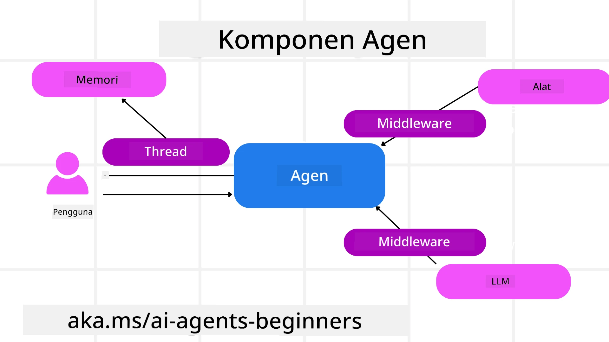

# Menjelajahi Microsoft Agent Framework


### Pengantar

Pelajaran ini akan membahas:

- Memahami Microsoft Agent Framework: Fitur Utama dan Nilainya  
- Menjelajahi Konsep Kunci Microsoft Agent Framework
- Pola MAF Lanjutan: Alur Kerja, Middleware, dan Memori

## Tujuan Pembelajaran

Setelah menyelesaikan pelajaran ini, Anda akan mengetahui cara untuk:

- Membangun Agen AI Siap Produksi menggunakan Microsoft Agent Framework
- Menerapkan fitur inti Microsoft Agent Framework ke Use Case Agentik Anda
- Menggunakan pola lanjutan termasuk alur kerja, middleware, dan observabilitas

## Contoh Kode 

Contoh kode untuk [Microsoft Agent Framework (MAF)](https://aka.ms/ai-agents-beginners/agent-framewrok) dapat ditemukan di repositori ini di bawah file `xx-python-agent-framework` dan `xx-dotnet-agent-framework`.

## Memahami Microsoft Agent Framework


[Microsoft Agent Framework (MAF)](https://aka.ms/ai-agents-beginners/agent-framewrok) adalah framework terpadu Microsoft untuk membangun agen AI. Ini menawarkan fleksibilitas untuk mengatasi berbagai use case agentik yang terlihat baik dalam lingkungan produksi maupun riset termasuk:

- **Orkestrasi Agen Secara Berurutan** dalam skenario di mana diperlukan alur kerja langkah demi langkah.
- **Orkestrasi Bersamaan** dalam skenario di mana agen perlu menyelesaikan tugas secara bersamaan.
- **Orkestrasi Grup Chat** dalam skenario di mana agen dapat berkolaborasi bersama untuk satu tugas.
- **Orkestrasi Penyerahan Tugas** dalam skenario di mana agen menyerahkan tugas satu sama lain ketika subtugas selesai.
- **Orkestrasi Magnetik** dalam skenario di mana agen pengelola membuat dan memodifikasi daftar tugas dan mengatur koordinasi sub-agen untuk menyelesaikan tugas.

Untuk menghadirkan Agen AI dalam Produksi, MAF juga menyertakan fitur untuk:

- **Observabilitas** melalui penggunaan OpenTelemetry dimana setiap aksi dari Agen AI termasuk pemanggilan alat, langkah orkestrasi, aliran penalaran dan pemantauan kinerja melalui dashboard Microsoft Foundry.
- **Keamanan** dengan hosting agen secara native di Microsoft Foundry yang mencakup kontrol keamanan seperti akses berbasis peran, penanganan data pribadi, dan keamanan konten bawaan.
- **Daya Tahan** karena utas dan alur kerja agen dapat dijeda, dilanjutkan, dan pulih dari kesalahan yang memungkinkan proses berjalan lebih lama.
- **Kontrol** karena alur kerja manusia dalam loop didukung di mana tugas ditandai memerlukan persetujuan manusia.

Microsoft Agent Framework juga berfokus agar interoperabel dengan:

- **Bersifat Cloud-agnostic** - Agen dapat berjalan di kontainer, on-prem, dan di berbagai cloud yang berbeda.
- **Bersifat Provider-agnostic** - Agen dapat dibuat melalui SDK pilihan Anda termasuk Azure OpenAI dan OpenAI.
- **Mengintegrasikan Standar Terbuka** - Agen dapat memanfaatkan protokol seperti Agent-to-Agent(A2A) dan Model Context Protocol (MCP) untuk menemukan dan menggunakan agen serta alat lainnya.
- **Plugin dan Konektor** - Koneksi dapat dibuat ke layanan data dan memori seperti Microsoft Fabric, SharePoint, Pinecone, dan Qdrant.

Mari kita lihat bagaimana fitur-fitur ini diterapkan pada beberapa konsep inti Microsoft Agent Framework.

## Konsep Kunci Microsoft Agent Framework

### Agen



**Membuat Agen**

Pembuatan agen dilakukan dengan mendefinisikan layanan inferensi (Penyedia LLM),  
sekumpulan instruksi untuk Agen AI ikuti, dan `name` yang diberikan:

```python
agent = AzureOpenAIChatClient(credential=AzureCliCredential()).create_agent( instructions="You are good at recommending trips to customers based on their preferences.", name="TripRecommender" )
```

Kode di atas menggunakan `Azure OpenAI` tetapi agen dapat dibuat menggunakan berbagai layanan termasuk `Microsoft Foundry Agent Service`:

```python
AzureAIAgentClient(async_credential=credential).create_agent( name="HelperAgent", instructions="You are a helpful assistant." ) as agent
```

API OpenAI `Responses`, `ChatCompletion`

```python
agent = OpenAIResponsesClient().create_agent( name="WeatherBot", instructions="You are a helpful weather assistant.", )
```

```python
agent = OpenAIChatClient().create_agent( name="HelpfulAssistant", instructions="You are a helpful assistant.", )
```

atau [MiniMax](https://platform.minimaxi.com/), yang menyediakan API kompatibel OpenAI dengan jendela konteks besar (hingga 204K token):

```python
agent = OpenAIChatClient(base_url="https://api.minimax.io/v1", api_key=os.environ["MINIMAX_API_KEY"], model_id="MiniMax-M2.7").create_agent( name="HelpfulAssistant", instructions="You are a helpful assistant.", )
```

atau agen jarak jauh menggunakan protokol A2A:

```python
agent = A2AAgent( name=agent_card.name, description=agent_card.description, agent_card=agent_card, url="https://your-a2a-agent-host" )
```

**Menjalankan Agen**

Agen dijalankan menggunakan metode `.run` atau `.run_stream` untuk respon non-streaming atau streaming.

```python
result = await agent.run("What are good places to visit in Amsterdam?")
print(result.text)
```

```python
async for update in agent.run_stream("What are the good places to visit in Amsterdam?"):
    if update.text:
        print(update.text, end="", flush=True)

```

Setiap kali menjalankan agen juga dapat memiliki opsi untuk menyesuaikan parameter seperti `max_tokens` yang digunakan agen, `tools` yang dapat dipanggil oleh agen, dan bahkan `model` itu sendiri yang digunakan untuk agen.

Ini berguna dalam kasus di mana model atau alat tertentu diperlukan untuk menyelesaikan tugas pengguna.

**Alat**

Alat dapat didefinisikan saat mendefinisikan agen:

```python
def get_attractions( location: Annotated[str, Field(description="The location to get the top tourist attractions for")], ) -> str: """Get the top tourist attractions for a given location.""" return f"The top attractions for {location} are." 


# Saat membuat ChatAgent secara langsung

agent = ChatAgent( chat_client=OpenAIChatClient(), instructions="You are a helpful assistant", tools=[get_attractions]

```

dan juga saat menjalankan agen:

```python

result1 = await agent.run( "What's the best place to visit in Seattle?", tools=[get_attractions] # Alat yang disediakan hanya untuk penggunaan kali ini )
```

**Utas Agen**

Utas Agen digunakan untuk menangani percakapan multi-tur. Utas dapat dibuat dengan:

- Menggunakan `get_new_thread()` yang memungkinkan utas disimpan dari waktu ke waktu
- Membuat utas secara otomatis saat menjalankan agen dan hanya bertahan selama sesi berjalan saat ini.

Untuk membuat utas, kodenya seperti ini:

```python
# Buat sebuah thread baru.
thread = agent.get_new_thread() # Jalankan agen dengan thread tersebut.
response = await agent.run("Hello, I am here to help you book travel. Where would you like to go?", thread=thread)

```

Kemudian Anda dapat menyerialisasikan utas untuk disimpan guna digunakan kembali nanti:

```python
# Buat sebuah thread baru.
thread = agent.get_new_thread() 

# Jalankan agen dengan thread tersebut.

response = await agent.run("Hello, how are you?", thread=thread) 

# Serialisasi thread untuk penyimpanan.

serialized_thread = await thread.serialize() 

# Deserialize status thread setelah dimuat dari penyimpanan.

resumed_thread = await agent.deserialize_thread(serialized_thread)
```

**Middleware Agen**

Agen berinteraksi dengan alat dan LLM untuk menyelesaikan tugas pengguna. Dalam beberapa skenario, kita ingin mengeksekusi atau melacak di antara interaksi tersebut. Middleware agen memungkinkan kita melakukan ini melalui:

*Middleware Fungsi*

Middleware ini memungkinkan kami mengeksekusi aksi di antara agen dan fungsi/alat yang akan dipanggil. Contoh penggunaannya adalah ketika Anda ingin melakukan pencatatan pada pemanggilan fungsi.

Dalam kode di bawah `next` mendefinisikan apakah middleware berikutnya atau fungsi sebenarnya yang harus dipanggil.

```python
async def logging_function_middleware(
    context: FunctionInvocationContext,
    next: Callable[[FunctionInvocationContext], Awaitable[None]],
) -> None:
    """Function middleware that logs function execution."""
    # Prapemrosesan: Catat sebelum eksekusi fungsi
    print(f"[Function] Calling {context.function.name}")

    # Lanjut ke middleware atau eksekusi fungsi berikutnya
    await next(context)

    # Pasca-pemrosesan: Catat setelah eksekusi fungsi
    print(f"[Function] {context.function.name} completed")
```

*Middleware Chat*

Middleware ini memungkinkan kita mengeksekusi atau mencatat aksi di antara agen dan permintaan di antara LLM.

Ini berisi informasi penting seperti `messages` yang dikirim ke layanan AI.

```python
async def logging_chat_middleware(
    context: ChatContext,
    next: Callable[[ChatContext], Awaitable[None]],
) -> None:
    """Chat middleware that logs AI interactions."""
    # Pra-pemrosesan: Catat sebelum panggilan AI
    print(f"[Chat] Sending {len(context.messages)} messages to AI")

    # Lanjut ke middleware berikutnya atau layanan AI
    await next(context)

    # Pasca-pemrosesan: Catat setelah respons AI
    print("[Chat] AI response received")

```

**Memori Agen**

Seperti yang dibahas dalam pelajaran `Agentic Memory`, memori merupakan elemen penting untuk memungkinkan agen beroperasi dalam konteks berbeda. MAF menawarkan beberapa tipe memori:

*Penyimpanan Dalam Memori*

Ini adalah memori yang disimpan dalam utas selama waktu berjalan aplikasi.

```python
# Buat sebuah thread baru.
thread = agent.get_new_thread() # Jalankan agen dengan thread tersebut.
response = await agent.run("Hello, I am here to help you book travel. Where would you like to go?", thread=thread)
```

*Pesan Persisten*

Memori ini digunakan untuk menyimpan riwayat percakapan antar sesi. Didefinisikan menggunakan `chat_message_store_factory` :

```python
from agent_framework import ChatMessageStore

# Buat penyimpanan pesan khusus
def create_message_store():
    return ChatMessageStore()

agent = ChatAgent(
    chat_client=OpenAIChatClient(),
    instructions="You are a Travel assistant.",
    chat_message_store_factory=create_message_store
)

```

*Memori Dinamis*

Memori ini ditambahkan ke konteks sebelum agen dijalankan. Memori ini dapat disimpan dalam layanan eksternal seperti mem0:

```python
from agent_framework.mem0 import Mem0Provider

# Menggunakan Mem0 untuk kemampuan memori lanjutan
memory_provider = Mem0Provider(
    api_key="your-mem0-api-key",
    user_id="user_123",
    application_id="my_app"
)

agent = ChatAgent(
    chat_client=OpenAIChatClient(),
    instructions="You are a helpful assistant with memory.",
    context_providers=memory_provider
)

```

**Observabilitas Agen**

Observabilitas penting untuk membangun sistem agentik yang andal dan mudah dipelihara. MAF terintegrasi dengan OpenTelemetry untuk menyediakan pelacakan dan meteran untuk observabilitas yang lebih baik.

```python
from agent_framework.observability import get_tracer, get_meter

tracer = get_tracer()
meter = get_meter()
with tracer.start_as_current_span("my_custom_span"):
    # lakukan sesuatu
    pass
counter = meter.create_counter("my_custom_counter")
counter.add(1, {"key": "value"})
```

### Alur Kerja

MAF menawarkan alur kerja yang merupakan langkah-langkah yang telah ditentukan untuk menyelesaikan tugas dan memasukkan agen AI sebagai komponen dalam langkah-langkah tersebut.

Alur kerja terdiri dari berbagai komponen yang memungkinkan aliran kontrol yang lebih baik. Alur kerja juga memungkinkan **orkestrasi multi-agen** dan **checkpointing** untuk menyimpan status alur kerja.

Komponen inti alur kerja adalah:

**Eksekutor**

Eksekutor menerima pesan input, melakukan tugas yang ditugaskan, kemudian menghasilkan pesan keluaran. Ini menggerakkan alur kerja ke arah penyelesaian tugas yang lebih besar. Eksekutor bisa berupa agen AI atau logika khusus.

**Edges**

Edges digunakan untuk mendefinisikan aliran pesan dalam alur kerja. Ini bisa berupa:

*Edges Langsung* - Koneksi satu-ke-satu sederhana antar eksekutor:

```python
from agent_framework import WorkflowBuilder

builder = WorkflowBuilder()
builder.add_edge(source_executor, target_executor)
builder.set_start_executor(source_executor)
workflow = builder.build()
```

*Edges Bersyarat* - Diaktifkan setelah kondisi tertentu terpenuhi. Misalnya, saat kamar hotel tidak tersedia, eksekutor dapat menyarankan opsi lain.

*Edges Switch-case* - Mengarahkan pesan ke eksekutor berbeda berdasarkan kondisi yang ditentukan. Misalnya, jika pelanggan travel memiliki akses prioritas dan tugas mereka akan diurus melalui alur kerja lain.

*Edges Fan-out* - Mengirim satu pesan ke beberapa target.

*Edges Fan-in* - Mengumpulkan beberapa pesan dari berbagai eksekutor dan mengirim ke satu target.

**Peristiwa**

Untuk memberikan observabilitas yang lebih baik ke dalam alur kerja, MAF menawarkan peristiwa bawaan untuk eksekusi termasuk:

- `WorkflowStartedEvent`  - Eksekusi alur kerja dimulai
- `WorkflowOutputEvent` - Alur kerja menghasilkan keluaran
- `WorkflowErrorEvent` - Alur kerja menemui kesalahan
- `ExecutorInvokeEvent`  - Eksekutor mulai memproses
- `ExecutorCompleteEvent`  - Eksekutor selesai memproses
- `RequestInfoEvent` - Sebuah permintaan dikeluarkan

## Pola MAF Lanjutan

Bagian di atas membahas konsep kunci Microsoft Agent Framework. Saat Anda membangun agen yang lebih kompleks, berikut beberapa pola lanjutan yang perlu dipertimbangkan:

- **Komposisi Middleware**: Rangkai beberapa handler middleware (logging, auth, pembatasan laju) menggunakan middleware fungsi dan chat untuk kontrol perilaku agen yang lebih terperinci.
- **Checkpointing Alur Kerja**: Gunakan peristiwa alur kerja dan serialisasi untuk menyimpan dan melanjutkan proses agen yang berjalan lama.
- **Seleksi Alat Dinamis**: Gabungkan RAG atas deskripsi alat dengan pendaftaran alat MAF untuk hanya menampilkan alat relevan per kueri.
- **Penyerahan Multi-Agen**: Gunakan edges alur kerja dan routing bersyarat untuk mengorkestrasi penyerahan tugas antar agen spesialis.

## Contoh Kode 

Contoh kode Microsoft Agent Framework dapat ditemukan di repositori ini di bawah file `xx-python-agent-framework` dan `xx-dotnet-agent-framework`.

## Ada Pertanyaan Lebih Lanjut Tentang Microsoft Agent Framework?

Bergabunglah dengan [Microsoft Foundry Discord](https://aka.ms/ai-agents/discord) untuk bertemu dengan pelajar lain, menghadiri jam kantor dan mendapatkan jawaban untuk pertanyaan AI Agents Anda.

---

<!-- CO-OP TRANSLATOR DISCLAIMER START -->
**Disclaimer**:  
Dokumen ini telah diterjemahkan menggunakan layanan terjemahan AI [Co-op Translator](https://github.com/Azure/co-op-translator). Meskipun kami berupaya untuk akurasi, harap diingat bahwa terjemahan otomatis dapat mengandung kesalahan atau ketidakakuratan. Dokumen asli dalam bahasa aslinya harus dianggap sebagai sumber yang otoritatif. Untuk informasi yang penting, disarankan menggunakan terjemahan profesional oleh manusia. Kami tidak bertanggung jawab atas kesalahpahaman atau salah tafsir yang timbul dari penggunaan terjemahan ini.
<!-- CO-OP TRANSLATOR DISCLAIMER END -->