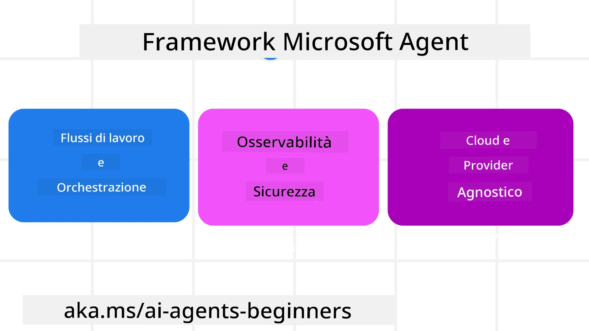

# Esplorando Microsoft Agent Framework


### Introduzione

Questa lezione coprirà:

- Comprendere Microsoft Agent Framework: Caratteristiche chiave e valore  
- Esplorare i concetti chiave di Microsoft Agent Framework
- Pattern avanzati MAF: Flussi di lavoro, middleware e memoria

## Obiettivi di Apprendimento

Dopo aver completato questa lezione, saprai come:

- Costruire agenti AI pronti per la produzione utilizzando Microsoft Agent Framework
- Applicare le funzionalità principali di Microsoft Agent Framework ai tuoi casi d'uso agentici
- Usare pattern avanzati inclusi flussi di lavoro, middleware e osservabilità

## Esempi di Codice 

Gli esempi di codice per [Microsoft Agent Framework (MAF)](https://aka.ms/ai-agents-beginners/agent-framewrok) possono essere trovati in questo repository sotto i file `xx-python-agent-framework` e `xx-dotnet-agent-framework`.

## Comprendere Microsoft Agent Framework



[Microsoft Agent Framework (MAF)](https://aka.ms/ai-agents-beginners/agent-framewrok) è il framework unificato di Microsoft per costruire agenti AI. Offre la flessibilità per affrontare la vasta gamma di casi d'uso agentici visti sia in ambienti di produzione che di ricerca, inclusi:

- **Orchestrazione sequenziale dell'agente** in scenari in cui sono necessari flussi di lavoro step-by-step.
- **Orchestrazione concorrente** in scenari in cui gli agenti devono completare i compiti contemporaneamente.
- **Orchestrazione in chat di gruppo** in scenari in cui gli agenti possono collaborare insieme su un compito.
- **Orchestrazione di passaggio** in scenari in cui gli agenti si passano il compito man mano che i sotto-compiti sono completati.
- **Orchestrazione magnetica** in scenari in cui un agente manager crea e modifica una lista di compiti e gestisce il coordinamento dei sotto-agenti per completarli.

Per fornire agenti AI in produzione, MAF ha anche incluso funzionalità per:

- **Osservabilità** tramite l'uso di OpenTelemetry dove ogni azione dell'agente AI, inclusa l'invocazione degli strumenti, i passaggi di orchestrazione, i flussi di ragionamento e il monitoraggio delle prestazioni tramite dashboard Microsoft Foundry.
- **Sicurezza** ospitando gli agenti nativamente su Microsoft Foundry, che include controlli di sicurezza come accesso basato su ruoli, gestione dei dati privati e sicurezza dei contenuti incorporata.
- **Durabilità** poiché i thread e i flussi di lavoro degli agenti possono mettere in pausa, riprendere e recuperare da errori, abilitando processi di lunga durata.
- **Controllo** poiché i flussi di lavoro con intervento umano sono supportati, dove i compiti sono segnati come richiesti di approvazione da parte di un umano.

Microsoft Agent Framework si focalizza anche sull'interoperabilità tramite:

- **Essere cloud-agnostico** - Gli agenti possono girare in container, on-premises e su molteplici cloud differenti.
- **Essere provider-agnostico** - Gli agenti possono essere creati attraverso il tuo SDK preferito incluso Azure OpenAI e OpenAI
- **Integrazione di standard aperti** - Gli agenti possono utilizzare protocolli come Agent-to-Agent (A2A) e Model Context Protocol (MCP) per scoprire e usare altri agenti e strumenti.
- **Plugin e connettori** - Le connessioni possono essere fatte a servizi di dati e memoria come Microsoft Fabric, SharePoint, Pinecone e Qdrant.

Vediamo come queste funzionalità vengono applicate ad alcuni dei concetti chiave di Microsoft Agent Framework.

## Concetti Chiave di Microsoft Agent Framework

### Agenti


**Creazione Agenti**

La creazione dell'agente si fa definendo il servizio di inferenza (provider LLM), un set di istruzioni che l'agente AI deve seguire, e un `nome` assegnato:

```python
agent = AzureOpenAIChatClient(credential=AzureCliCredential()).create_agent( instructions="You are good at recommending trips to customers based on their preferences.", name="TripRecommender" )
```

Quanto sopra usa `Azure OpenAI` ma gli agenti possono essere creati usando una varietà di servizi inclusi `Microsoft Foundry Agent Service`:

```python
AzureAIAgentClient(async_credential=credential).create_agent( name="HelperAgent", instructions="You are a helpful assistant." ) as agent
```

API OpenAI `Responses`, `ChatCompletion`

```python
agent = OpenAIResponsesClient().create_agent( name="WeatherBot", instructions="You are a helpful weather assistant.", )
```

```python
agent = OpenAIChatClient().create_agent( name="HelpfulAssistant", instructions="You are a helpful assistant.", )
```

o [MiniMax](https://platform.minimaxi.com/), che offre un'API compatibile OpenAI con finestre di contesto grandi (fino a 204K token):

```python
agent = OpenAIChatClient(base_url="https://api.minimax.io/v1", api_key=os.environ["MINIMAX_API_KEY"], model_id="MiniMax-M2.7").create_agent( name="HelpfulAssistant", instructions="You are a helpful assistant.", )
```

o agenti remoti usando il protocollo A2A:

```python
agent = A2AAgent( name=agent_card.name, description=agent_card.description, agent_card=agent_card, url="https://your-a2a-agent-host" )
```

**Esecuzione Agenti**

Gli agenti vengono eseguiti usando i metodi `.run` o `.run_stream` per risposte non streaming o in streaming.

```python
result = await agent.run("What are good places to visit in Amsterdam?")
print(result.text)
```

```python
async for update in agent.run_stream("What are the good places to visit in Amsterdam?"):
    if update.text:
        print(update.text, end="", flush=True)

```

Ogni esecuzione dell'agente può anche avere opzioni per personalizzare parametri come `max_tokens` usati dall'agente, `tools` che l'agente può chiamare, e perfino il `model` stesso usato per l'agente.

Questo è utile nei casi in cui sono richiesti modelli o strumenti specifici per completare il compito dell'utente.

**Strumenti**

Gli strumenti possono essere definiti sia durante la definizione dell'agente:

```python
def get_attractions( location: Annotated[str, Field(description="The location to get the top tourist attractions for")], ) -> str: """Get the top tourist attractions for a given location.""" return f"The top attractions for {location} are." 


# Quando si crea direttamente un ChatAgent

agent = ChatAgent( chat_client=OpenAIChatClient(), instructions="You are a helpful assistant", tools=[get_attractions]

```

sia durante l'esecuzione dell'agente:

```python

result1 = await agent.run( "What's the best place to visit in Seattle?", tools=[get_attractions] # Strumento fornito solo per questa esecuzione )
```

**Thread dell'Agente**

I thread dell'agente sono usati per gestire conversazioni multi-turno. I thread possono essere creati attraverso:

- Uso di `get_new_thread()` che permette di salvare il thread nel tempo
- Creando un thread automaticamente all'esecuzione di un agente, e il thread dura solo durante l'esecuzione corrente.

Per creare un thread, il codice è questo:

```python
# Crea un nuovo thread.
thread = agent.get_new_thread() # Esegui l'agente con il thread.
response = await agent.run("Hello, I am here to help you book travel. Where would you like to go?", thread=thread)

```

Puoi quindi serializzare il thread per conservarlo per usi futuri:

```python
# Crea un nuovo thread.
thread = agent.get_new_thread() 

# Esegui l'agente con il thread.

response = await agent.run("Hello, how are you?", thread=thread) 

# Serializza il thread per la memorizzazione.

serialized_thread = await thread.serialize() 

# Deserializza lo stato del thread dopo il caricamento dalla memorizzazione.

resumed_thread = await agent.deserialize_thread(serialized_thread)
```

**Middleware dell'Agente**

Gli agenti interagiscono con strumenti e LLM per completare i compiti degli utenti. In certi scenari, vogliamo eseguire o tracciare operazioni tra queste interazioni. Il middleware degli agenti ci permette di farlo tramite:

*Middleware di Funzione*

Questo middleware ci permette di eseguire un'azione tra l'agente e una funzione/strumento che esso chiamerà. Un esempio di uso è quando si vuole fare un logging della chiamata alla funzione.

Nel codice qui sotto `next` definisce se deve essere chiamato il middleware successivo o la funzione effettiva.

```python
async def logging_function_middleware(
    context: FunctionInvocationContext,
    next: Callable[[FunctionInvocationContext], Awaitable[None]],
) -> None:
    """Function middleware that logs function execution."""
    # Pre-elaborazione: Registra prima dell'esecuzione della funzione
    print(f"[Function] Calling {context.function.name}")

    # Continua al middleware successivo o all'esecuzione della funzione
    await next(context)

    # Post-elaborazione: Registra dopo l'esecuzione della funzione
    print(f"[Function] {context.function.name} completed")
```

*Middleware Chat*

Questo middleware ci permette di eseguire o loggare un'azione tra l'agente e le richieste tra l'LLM.

Questo contiene informazioni importanti come i `messaggi` che vengono inviati al servizio AI.

```python
async def logging_chat_middleware(
    context: ChatContext,
    next: Callable[[ChatContext], Awaitable[None]],
) -> None:
    """Chat middleware that logs AI interactions."""
    # Pre-elaborazione: Registra prima della chiamata all'IA
    print(f"[Chat] Sending {len(context.messages)} messages to AI")

    # Continua al middleware o servizio IA successivo
    await next(context)

    # Post-elaborazione: Registra dopo la risposta dell'IA
    print("[Chat] AI response received")

```

**Memoria dell'Agente**

Come trattato nella lezione `Agentic Memory`, la memoria è un elemento importante per permettere all'agente di operare su diversi contesti. MAF offre diversi tipi di memorie:

*Memoria In-Memory*

Questa è la memoria memorizzata nei thread durante il runtime dell'applicazione.

```python
# Crea un nuovo thread.
thread = agent.get_new_thread() # Esegui l'agente con il thread.
response = await agent.run("Hello, I am here to help you book travel. Where would you like to go?", thread=thread)
```

*Messaggi Persistenti*

Questa memoria è usata per conservare la cronologia delle conversazioni tra sessioni differenti. È definita usando la `chat_message_store_factory`:

```python
from agent_framework import ChatMessageStore

# Crea un archivio messaggi personalizzato
def create_message_store():
    return ChatMessageStore()

agent = ChatAgent(
    chat_client=OpenAIChatClient(),
    instructions="You are a Travel assistant.",
    chat_message_store_factory=create_message_store
)

```

*Memoria Dinamica*

Questa memoria viene aggiunta al contesto prima che gli agenti vengano eseguiti. Queste memorie possono essere conservate in servizi esterni come mem0:

```python
from agent_framework.mem0 import Mem0Provider

# Utilizzo di Mem0 per capacità di memoria avanzate
memory_provider = Mem0Provider(
    api_key="your-mem0-api-key",
    user_id="user_123",
    application_id="my_app"
)

agent = ChatAgent(
    chat_client=OpenAIChatClient(),
    instructions="You are a helpful assistant with memory.",
    context_providers=memory_provider
)

```

**Osservabilità dell'Agente**

L'osservabilità è importante per costruire sistemi agentici affidabili e mantenibili. MAF si integra con OpenTelemetry per fornire tracing e metriche per una migliore osservabilità.

```python
from agent_framework.observability import get_tracer, get_meter

tracer = get_tracer()
meter = get_meter()
with tracer.start_as_current_span("my_custom_span"):
    # fare qualcosa
    pass
counter = meter.create_counter("my_custom_counter")
counter.add(1, {"key": "value"})
```

### Flussi di Lavoro

MAF offre flussi di lavoro che sono passaggi predefiniti per completare un compito e includono agenti AI come componenti in tali passaggi.

I flussi di lavoro sono composti da diversi componenti che permettono un migliore controllo del flusso. I flussi di lavoro permettono anche **orchestrazione multi-agente** e **checkpointing** per salvare gli stati del flusso di lavoro.

I componenti core di un flusso di lavoro sono:

**Esecutori**

Gli esecutori ricevono messaggi in input, eseguono i compiti assegnati, e producono un messaggio in output. Questo muove il flusso di lavoro verso il completamento del compito più grande. Gli esecutori possono essere un agente AI o logica personalizzata.

**Archi**

Gli archi sono usati per definire il flusso dei messaggi in un flusso di lavoro. Questi possono essere:

*Archi Diretti* - Connessioni semplici one-to-one tra esecutori:

```python
from agent_framework import WorkflowBuilder

builder = WorkflowBuilder()
builder.add_edge(source_executor, target_executor)
builder.set_start_executor(source_executor)
workflow = builder.build()
```

*Archi Condizionali* - Attivati dopo che certe condizioni sono soddisfatte. Per esempio, quando le camere d'albergo non sono disponibili, un esecutore può suggerire altre opzioni.

*Archi Switch-case* - Instradano messaggi a diversi esecutori basati su condizioni definite. Per esempio, se il cliente viaggiatore ha accesso prioritario e i suoi compiti saranno gestiti attraverso un altro flusso di lavoro.

*Archi Fan-out* - Invia un messaggio a molteplici destinazioni.

*Archi Fan-in* - Raccoglie molteplici messaggi da diversi esecutori e invia a una destinazione sola.

**Eventi**

Per fornire una migliore osservabilità nei flussi di lavoro, MAF offre eventi integrati per l'esecuzione inclusi:

- `WorkflowStartedEvent`  - L'esecuzione del flusso di lavoro inizia
- `WorkflowOutputEvent` - Il flusso di lavoro produce un output
- `WorkflowErrorEvent` - Il flusso di lavoro incontra un errore
- `ExecutorInvokeEvent`  - L'esecutore inizia l'elaborazione
- `ExecutorCompleteEvent`  -  L'esecutore finisce l'elaborazione
- `RequestInfoEvent` - Viene effettuata una richiesta

## Pattern MAF Avanzati

Le sezioni sopra coprono i concetti chiave di Microsoft Agent Framework. Mentre costruisci agenti più complessi, ecco alcuni pattern avanzati da considerare:

- **Composizione Middleware**: Catena di più gestori middleware (logging, autenticazione, rate-limiting) usando middleware di funzione e chat per un controllo dettagliato sul comportamento dell'agente.
- **Checkpointing dei Flussi di Lavoro**: Usa eventi del flusso di lavoro e serializzazione per salvare e riprendere processi agenti di lunga durata.
- **Selezione Dinamica degli Strumenti**: Combina RAG su descrizioni degli strumenti con la registrazione degli strumenti di MAF per presentare solo gli strumenti rilevanti per ogni query.
- **Passaggio Multi-Agente**: Usa archi di flusso di lavoro e instradamento condizionale per orchestrare passaggi tra agenti specializzati.

## Esempi di Codice 

Gli esempi di codice per Microsoft Agent Framework possono essere trovati in questo repository sotto i file `xx-python-agent-framework` e `xx-dotnet-agent-framework`.

## Hai altre domande su Microsoft Agent Framework?

Unisciti al [Microsoft Foundry Discord](https://aka.ms/ai-agents/discord) per incontrare altri studenti, partecipare a sessioni di supporto e ottenere risposte alle tue domande sugli agenti AI.

---

<!-- CO-OP TRANSLATOR DISCLAIMER START -->
**Disclaimer**:  
Questo documento è stato tradotto utilizzando il servizio di traduzione automatica [Co-op Translator](https://github.com/Azure/co-op-translator). Sebbene ci impegniamo per l'accuratezza, si prega di considerare che le traduzioni automatiche possono contenere errori o inesattezze. Il documento originale nella sua lingua nativa deve essere considerato la fonte autorevole. Per informazioni critiche, si raccomanda una traduzione professionale umana. Non siamo responsabili per eventuali incomprensioni o interpretazioni errate derivanti dall'uso di questa traduzione.
<!-- CO-OP TRANSLATOR DISCLAIMER END -->