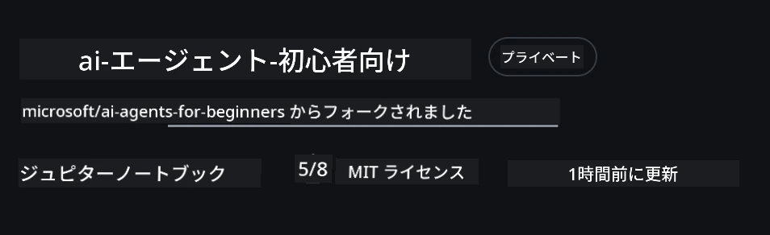
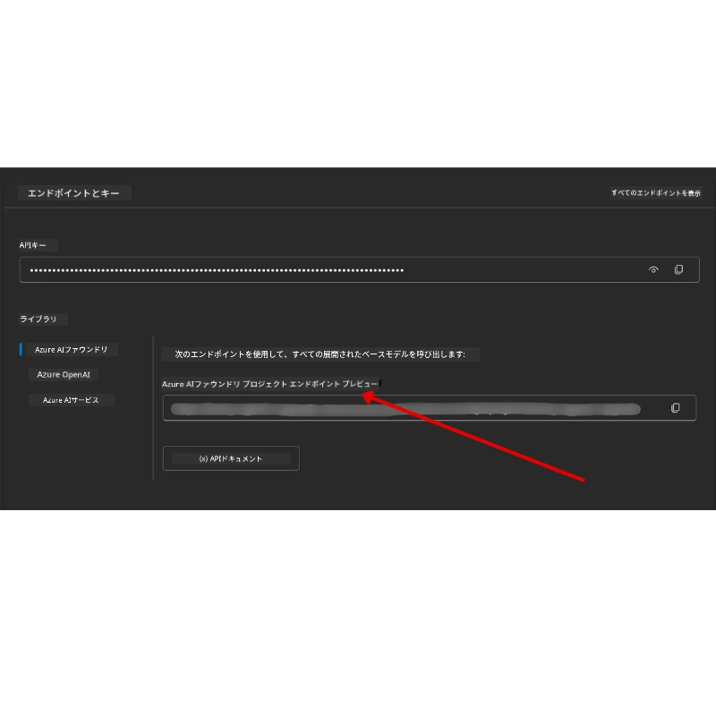

# コースのセットアップ

## はじめに

このレッスンでは、このコースのコードサンプルを実行する方法を説明します。

## 他の学習者に参加してサポートを受ける

リポジトリをクローンする前に、セットアップのヘルプやコースに関する質問、他の学習者とのつながりのために、[AI Agents For Beginners Discord チャンネル](https://aka.ms/ai-agents/discord)に参加してください。

## このリポジトリをクローンまたはフォークする

始めるには、このGitHubリポジトリをクローンまたはフォークしてください。これにより、自分専用のコース教材のバージョンが作成され、コードの実行、テスト、調整が可能になります！

<a href="https://github.com/microsoft/ai-agents-for-beginners/fork" target="_blank">フォークするリンク</a>をクリックして実行できます。

以下のリンクにあなたのフォークしたコースのバージョンが表示されるはずです：



### シャロークローン（ワークショップ/Codespacesに推奨）

  >フルリポジトリは履歴やすべてのファイルをダウンロードすると大きく（約3GB）なることがあります。ワークショップに参加するだけ、または一部のレッスンフォルダだけ必要な場合は、シャロークローン（またはスパースクローン）で履歴を切り詰めるかスキップし、ダウンロード量を減らせます。

#### クイックシャロークローン — 最小限の履歴、全ファイル

以下のコマンドの`<your-username>`部分をあなたのフォークURL（もしくはアップストリームURL）に置き換えてください。

最新のコミット履歴のみをクローンする（ダウンロード量を抑える）：

```bash|powershell
git clone --depth 1 https://github.com/<your-username>/ai-agents-for-beginners.git
```

特定のブランチをクローンする場合：

```bash|powershell
git clone --depth 1 --branch <branch-name> https://github.com/<your-username>/ai-agents-for-beginners.git
```

#### 部分的（スパース）クローン — 最小限のblob + 選択フォルダのみ

これは部分クローンとスパースチェックアウトを使います（Git 2.25以上と部分クローン対応の最新Git推奨）：

```bash|powershell
git clone --depth 1 --filter=blob:none --sparse https://github.com/<your-username>/ai-agents-for-beginners.git
```

リポジトリフォルダに移動：

```bash|powershell
cd ai-agents-for-beginners
```

次に必要なフォルダを指定します（例は二つのフォルダ）：

```bash|powershell
git sparse-checkout set 00-course-setup 01-intro-to-ai-agents
```

ファイルをクローンして確認後、ファイルだけが必要で容量を確保したい場合はリポジトリメタデータを削除してください（💀不可逆 — Gitのすべての機能、コミットやプル、プッシュ、履歴アクセスを失います）。

```bash
# zsh/bash
rm -rf .git
```

```powershell
# PowerShell
Remove-Item -Recurse -Force .git
```

#### GitHub Codespaces を使う（ローカルの大容量ダウンロードを避けるのに推奨）

- [GitHub UI](https://github.com/codespaces)からこのリポジトリの新しいCodespaceを作成します。

- 作成したCodespaceのターミナルで、上記のシャロー/スパースクローンのいずれかを実行して、必要なレッスンフォルダのみをCodespaceの作業フォルダに取り込みます。
- 任意：Codespaces内でクローンした後、不要な容量確保のために.gitを削除してください（上記の削除コマンド参照）。
- 補足：Codespaceで直接リポジトリを開く場合（追加クローンなし）、Codespacesはdevcontainer環境を構築し、必要以上のプロビジョニングが行われることがあります。新鮮なCodespace内でシャローコピーをクローンすると、ディスク使用量をより細かく管理できます。

#### ヒント

- 編集やコミットする場合は、必ずクローンURLを自分のフォークURLに置き換えてください。
- 後でより多くの履歴やファイルが必要になったら、取得したりスパースチェックアウトでさらにフォルダを含めるよう調整可能です。

## コードの実行

このコースでは、AIエージェント構築の実践体験ができる一連の Jupyter Notebook を提供しています。

サンプルコードは<strong>Microsoft Agent Framework (MAF)</strong>を `AzureAIProjectAgentProvider` と共に使用し、**Azure AI Agent Service V2**（Responses API）に **Microsoft Foundry** 経由で接続します。

すべてのPythonノートブックは `*-python-agent-framework.ipynb` とラベル付けされています。

## 必要条件

- Python 3.12+
  - <strong>注</strong>: Python3.12がインストールされていない場合は必ずインストールしてください。その後、requirements.txt の正しいバージョンをインストールできるように python3.12 で仮想環境を作成してください。
  
    >例

    Python仮想環境ディレクトリを作成：

    ```bash|powershell
    python -m venv venv
    ```

    続いて仮想環境を有効化：

    ```bash
    # zsh/bash
    source venv/bin/activate
    ```
  
    ```dos
    # Command Prompt for Windows
    venv\Scripts\activate
    ```

- .NET 10+：.NETを使ったサンプルコード用に、[.NET 10 SDK](https://dotnet.microsoft.com/download/dotnet/10.0)以降をインストールし、バージョンを確認してください。

    ```bash|powershell
    dotnet --list-sdks
    ```

- **Azure CLI** — 認証に必須。[aka.ms/installazurecli](https://aka.ms/installazurecli)からインストールしてください。
- **Azure サブスクリプション** — Microsoft Foundry と Azure AI Agent Service へのアクセス用。
- **Microsoft Foundry プロジェクト** — デプロイ済みモデル（例：`gpt-4o`）のあるプロジェクトを作成します。詳細は以下の[ステップ1](#ステップ1-microsoft-foundryプロジェクトを作成)を参照。

このリポジトリのルートには、コード実行に必要なPythonパッケージをすべて記載した `requirements.txt` ファイルを含めています。

リポジトリルートのターミナルで以下のコマンドを実行してインストールできます：

```bash|powershell
pip install -r requirements.txt
```

パッケージの競合や問題を避けるため、Pythonの仮想環境作成を推奨します。

## VSCodeのセットアップ

VSCodeで正しいPythonバージョンを使用していることを確認してください。


## Microsoft Foundry と Azure AI Agent Service のセットアップ

### ステップ1: Microsoft Foundryプロジェクトを作成

ノートブックを実行するには、モデルがデプロイされたAzure AI Foundryの<strong>ハブ</strong>と<strong>プロジェクト</strong>が必要です。

1. [ai.azure.com](https://ai.azure.com) にアクセスし、Azureアカウントでサインインします。
2. <strong>ハブ</strong>を作成（または既存のものを使う）。詳細：https://learn.microsoft.com/azure/ai-foundry/concepts/ai-resources
3. ハブ内で<strong>プロジェクト</strong>を作成します。
4. **モデル + エンドポイント** → <strong>モデルのデプロイ</strong>からモデル（例：`gpt-4o`）をデプロイします。

### ステップ2: プロジェクトのエンドポイントとモデルデプロイ名を取得

Microsoft Foundryポータルのプロジェクトから：

- <strong>プロジェクトエンドポイント</strong> — <strong>概要</strong>ページにアクセスし、エンドポイントURLをコピーします。



- <strong>モデルデプロイ名</strong> — <strong>モデル + エンドポイント</strong>に移動し、デプロイ済みモデルを選択、<strong>デプロイ名</strong>を確認します（例：`gpt-4o`）。

### ステップ3: `az login` でAzureにサインイン

すべてのノートブックは認証に **`AzureCliCredential`** を使用します。APIキー不要でAzure CLI経由でサインインが必要です。

1. まだの場合、Azure CLIをインストールしてください：[aka.ms/installazurecli](https://aka.ms/installazurecli)

2. 次のコマンドでサインイン：

    ```bash|powershell
    az login
    ```

    または、ブラウザを使えないリモート/Codespace環境ではこちら：

    ```bash|powershell
    az login --use-device-code
    ```

3. Foundryプロジェクトが含まれるサブスクリプションを選択するよう促された場合は選択します。

4. サインインの確認：

    ```bash|powershell
    az account show
    ```

> **なぜ `az login`？** ノートブックは `azure-identity` パッケージの `AzureCliCredential` で認証します。これはAzure CLIのセッションが認証情報を提供するため、`.env`にAPIキーやシークレットを保存しません。[セキュリティのベストプラクティス](https://learn.microsoft.com/azure/developer/ai/keyless-connections)です。

### ステップ4: `.env` ファイルを作成

サンプルファイルをコピー：

```bash
# zsh/bash
cp .env.example .env
```

```powershell
# PowerShell
Copy-Item .env.example .env
```

`.env` を開いて以下2つの値を入力します：

```env
AZURE_AI_PROJECT_ENDPOINT=https://<your-project>.services.ai.azure.com/api/projects/<your-project-id>
AZURE_AI_MODEL_DEPLOYMENT_NAME=gpt-4o
```

| 変数 | 探し場所 |
|------|----------|
| `AZURE_AI_PROJECT_ENDPOINT` | Foundryポータル → プロジェクト → <strong>概要</strong>ページ |
| `AZURE_AI_MODEL_DEPLOYMENT_NAME` | Foundryポータル → **モデル + エンドポイント** → デプロイ済みモデルの名前 |

ここまででほとんどのレッスンで完了です！ノートブックは `az login` セッションを通じて自動認証されます。

### ステップ5: Python依存パッケージをインストール

```bash|powershell
pip install -r requirements.txt
```

仮想環境を有効にしてから実行するのを推奨します。

## レッスン5（Agentic RAG）用の追加セットアップ

レッスン5は検索補強生成のため<strong>Azure AI Search</strong>を使用します。実行する場合は、以下の変数を `.env` に追記してください：

| 変数 | 探し場所 |
|------|----------|
| `AZURE_SEARCH_SERVICE_ENDPOINT` | Azureポータル → <strong>Azure AI Search</strong>リソース → <strong>概要</strong> → URL |
| `AZURE_SEARCH_API_KEY` | Azureポータル → <strong>Azure AI Search</strong>リソース → <strong>設定</strong> → <strong>キー</strong> → 主管理キー |

## レッスン6とレッスン8（GitHub Models）用の追加セットアップ

一部ノートブックはAzure AI Foundryではなく<strong>GitHub Models</strong>を使います。実行予定の場合は `.env` に以下を追加してください：

| 変数 | 探し場所 |
|------|----------|
| `GITHUB_TOKEN` | GitHub → <strong>設定</strong> → <strong>開発者向け設定</strong> → <strong>個人アクセストークン</strong> |
| `GITHUB_ENDPOINT` | `https://models.inference.ai.azure.com` （デフォルト値） |
| `GITHUB_MODEL_ID` | 使用するモデル名（例：`gpt-4o-mini`） |

## 代替プロバイダー：MiniMax（OpenAI互換）

[MiniMax](https://platform.minimaxi.com/)は最大20万4千トークンの大規模コンテキストモデルを、OpenAI互換APIで提供します。Microsoft Agent Frameworkの `OpenAIChatClient` は任意のOpenAI互換エンドポイントに対応するため、MiniMaxをGitHub ModelsやOpenAIの代替として利用可能です。

以下の変数を `.env` に追加してください：

| 変数 | 探し場所 |
|------|----------|
| `MINIMAX_API_KEY` | [MiniMaxプラットフォーム](https://platform.minimaxi.com/) → APIキー |
| `MINIMAX_BASE_URL` | `https://api.minimax.io/v1` （デフォルト値） |
| `MINIMAX_MODEL_ID` | 使用モデル名（例：`MiniMax-M2.7`） |

<strong>利用可能モデル</strong>：`MiniMax-M2.7`（推奨）、`MiniMax-M2.7-highspeed`（高速応答）

`OpenAIChatClient` を使うコードサンプル（例：レッスン14のホテル予約ワークフロー）は、`MINIMAX_API_KEY` 設定時に自動的にMiniMax設定を検出して使用します。

## レッスン8（Bing Grounding Workflow）用の追加セットアップ

レッスン8の条件付きワークフローノートブックは、Azure AI Foundry経由の<strong>Bing grounding</strong>を使います。該当サンプルを実行する場合は `.env` に以下を追加してください：

| 変数 | 探し場所 |
|------|----------|
| `BING_CONNECTION_ID` | Azure AI Foundryポータル → プロジェクト → <strong>管理</strong> → <strong>接続済みリソース</strong> → Bing接続 → 接続IDをコピー |

## トラブルシューティング

### macOSでのSSL証明書検証エラー

macOSで次のようなエラーが出る場合：

```plaintext
ssl.SSLCertVerificationError: [SSL: CERTIFICATE_VERIFY_FAILED] certificate verify failed: self-signed certificate in certificate chain
```

これはmacOSのPythonでシステムSSL証明書が自動的に信頼されない既知問題です。以下の順に対処法を試してください：

**方法1: PythonのInstall Certificatesスクリプトを実行（推奨）**

```bash
# インストールしたPythonのバージョン（例: 3.12または3.13）で3.XXを置き換えてください。
/Applications/Python\ 3.XX/Install\ Certificates.command
```

**方法2: ノートブックで `connection_verify=False` を使う（GitHub Modelsノートブックのみ）**

レッスン6のノートブック `06-building-trustworthy-agents/code_samples/06-system-message-framework.ipynb` では既にコメントアウトされた回避策が含まれています。クライアント作成時に `connection_verify=False` のコメントを外してください：

```python
client = ChatCompletionsClient(
    endpoint=endpoint,
    credential=AzureKeyCredential(token),
    connection_verify=False,  # 証明書エラーが発生した場合はSSL検証を無効にしてください
)
```

> **⚠️ 警告:** SSL検証を無効化すると証明書検証がスキップされ、安全性が低下します。開発環境での一時的回避策としてのみ使い、本番環境では絶対に使わないでください。

**方法3: `truststore` をインストールして使用**

```bash
pip install truststore
```

その後、ノートブックやスクリプトの冒頭に以下を追加してください：

```python
import truststore
truststore.inject_into_ssl()
```

## 困ったときは？

セットアップで問題があれば<a href="https://discord.gg/kzRShWzttr" target="_blank">Azure AI Community Discord</a>に参加、または<a href="https://github.com/microsoft/ai-agents-for-beginners/issues?WT.mc_id=academic-105485-koreyst" target="_blank">issueを作成</a>してください。

## 次のレッスン

これでコースのコードを実行する準備が整いました。AIエージェントの世界をさらに学ぶことを楽しんでください！

[AIエージェントの紹介とユースケース](../01-intro-to-ai-agents/README.md)

---

<!-- CO-OP TRANSLATOR DISCLAIMER START -->
**免責事項**:  
本書類は AI 翻訳サービス [Co-op Translator](https://github.com/Azure/co-op-translator) を使用して翻訳されています。正確性には努めていますが、自動翻訳には誤りや不正確な箇所が含まれる可能性があることをご了承ください。原文の母国語版が正式な情報源とみなされるべきです。重要な情報については、専門の人間による翻訳を推奨します。本翻訳の利用により生じた誤解や誤訳について、当方は一切責任を負いません。
<!-- CO-OP TRANSLATOR DISCLAIMER END -->