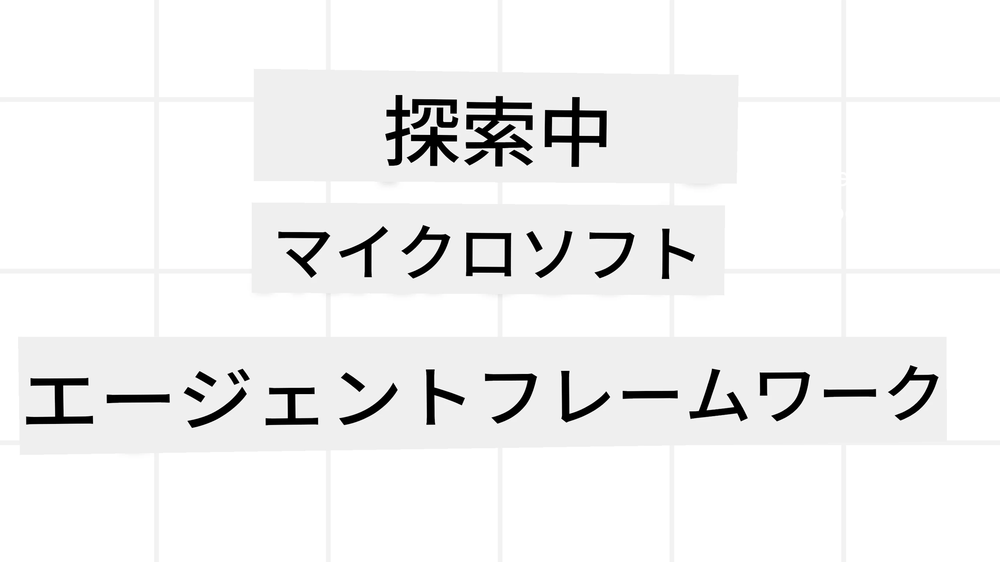
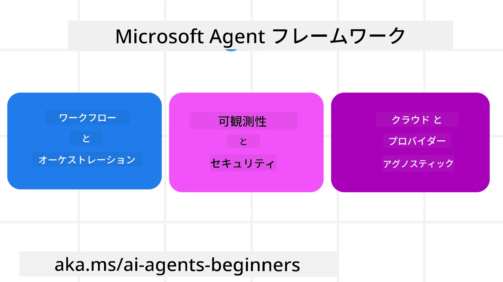

# Microsoft Agent Frameworkの探究



### はじめに

このレッスンでは以下を扱います：

- Microsoft Agent Frameworkの理解：主な特徴と価値  
- Microsoft Agent Frameworkの主要概念の探求
- 高度なMAFパターン：ワークフロー、ミドルウェア、メモリ

## 学習目標

このレッスンを終えた後、以下を理解していることが期待されます：

- Microsoft Agent Frameworkを使用して本番運用可能なAIエージェントを構築する方法
- Microsoft Agent Frameworkのコア機能をエージェンシックなユースケースに適用する方法
- ワークフロー、ミドルウェア、可観測性を含む高度なパターンの使用方法

## コードサンプル

[Microsoft Agent Framework (MAF)](https://aka.ms/ai-agents-beginners/agent-framewrok) のコードサンプルは、このリポジトリの `xx-python-agent-framework` と `xx-dotnet-agent-framework` ファイルにあります。

## Microsoft Agent Frameworkの理解



[Microsoft Agent Framework (MAF)](https://aka.ms/ai-agents-beginners/agent-framewrok) は、MicrosoftのAIエージェント構築のための統一フレームワークです。これにより、生産環境や研究環境で見られる多様なエージェンシックなユースケースに対応可能です：

- ステップバイステップのワークフローが必要なシナリオでの<strong>逐次エージェントオーケストレーション</strong>
- 複数のエージェントが同時にタスクを完了する必要があるシナリオでの<strong>並行オーケストレーション</strong>
- エージェントが1つのタスクを共同で処理するシナリオでの<strong>グループチャットオーケストレーション</strong>
- サブタスクが完了するにつれてエージェント間でタスクを引き継ぐシナリオでの<strong>ハンドオフオーケストレーション</strong>
- マネージャーエージェントがタスクリストを作成・変更し、サブエージェントの調整を管理するシナリオでの<strong>マグネティックオーケストレーション</strong>

本番運用でAIエージェントを提供するために、MAFは以下の機能も備えています：

- OpenTelemetryを利用した<strong>可観測性</strong>：AIエージェントのツール呼び出し、オーケストレーションステップ、推論フロー、Microsoft Foundryのダッシュボードでのパフォーマンス監視
- <strong>セキュリティ</strong>：Microsoft Foundryでエージェントをネイティブホスティングし、ロールベースアクセス制御、プライベートデータ処理、組込みのコンテンツ安全性を包括
- <strong>耐久性</strong>：エージェントのスレッドやワークフローは一時停止・再開・エラー回復が可能で、長期実行プロセスを実現
- <strong>制御性</strong>：タスクに人間の承認が必要であるとマークできるヒューマンインザループのワークフローをサポート

Microsoft Agent Frameworkは相互運用性にも重点を置いています：

- <strong>クラウド非依存</strong> - エージェントはコンテナ、オンプレミス、複数クラウド上で実行可能
- <strong>プロバイダー非依存</strong> - Azure OpenAIやOpenAIなどお好みのSDKからエージェントを作成可能
- <strong>オープン標準の統合</strong> - Agent-to-Agent（A2A）やModel Context Protocol（MCP）などのプロトコルを利用して他のエージェントやツールを発見・活用可能
- <strong>プラグインとコネクター</strong> - Microsoft Fabric、SharePoint、Pinecone、Qdrantなどのデータ・メモリサービスに接続可能

これらの機能がMicrosoft Agent Frameworkの主要概念にどのように応用されているか見てみましょう。

## Microsoft Agent Frameworkの主要概念

### エージェント


<strong>エージェントの作成</strong>

エージェントは推論サービス（LLMプロバイダー）、AIエージェントが従う指示のセット、割り当てられた `name` を定義して作成します：

```python
agent = AzureOpenAIChatClient(credential=AzureCliCredential()).create_agent( instructions="You are good at recommending trips to customers based on their preferences.", name="TripRecommender" )
```

上記は `Azure OpenAI` を使用していますが、エージェントは `Microsoft Foundry Agent Service` を含むさまざまなサービスを利用して作成可能です：

```python
AzureAIAgentClient(async_credential=credential).create_agent( name="HelperAgent", instructions="You are a helpful assistant." ) as agent
```

OpenAI の `Responses`、`ChatCompletion` API

```python
agent = OpenAIResponsesClient().create_agent( name="WeatherBot", instructions="You are a helpful weather assistant.", )
```

```python
agent = OpenAIChatClient().create_agent( name="HelpfulAssistant", instructions="You are a helpful assistant.", )
```

または、OpenAI互換APIを提供し、最大204Kトークンの大きなコンテキストウィンドウを持つ [MiniMax](https://platform.minimaxi.com/)：

```python
agent = OpenAIChatClient(base_url="https://api.minimax.io/v1", api_key=os.environ["MINIMAX_API_KEY"], model_id="MiniMax-M2.7").create_agent( name="HelpfulAssistant", instructions="You are a helpful assistant.", )
```

さらにA2Aプロトコルを使ったリモートエージェント：

```python
agent = A2AAgent( name=agent_card.name, description=agent_card.description, agent_card=agent_card, url="https://your-a2a-agent-host" )
```

<strong>エージェントの実行</strong>

エージェントは非ストリーミング応答に `.run`、ストリーミング応答に `.run_stream` メソッドを使って実行します。

```python
result = await agent.run("What are good places to visit in Amsterdam?")
print(result.text)
```

```python
async for update in agent.run_stream("What are the good places to visit in Amsterdam?"):
    if update.text:
        print(update.text, end="", flush=True)

```

各エージェント実行では、`max_tokens`、エージェントが呼び出せる `tools`、さらにはエージェントで使用される `model` などパラメーターをカスタマイズ可能です。

これは特定のモデルやツールがユーザーのタスク完了に必要な場合に有用です。

<strong>ツール</strong>

ツールはエージェント定義時：

```python
def get_attractions( location: Annotated[str, Field(description="The location to get the top tourist attractions for")], ) -> str: """Get the top tourist attractions for a given location.""" return f"The top attractions for {location} are." 


# ChatAgent を直接作成する場合

agent = ChatAgent( chat_client=OpenAIChatClient(), instructions="You are a helpful assistant", tools=[get_attractions]

```

およびエージェント実行時にも定義可能です：

```python

result1 = await agent.run( "What's the best place to visit in Seattle?", tools=[get_attractions] # この実行専用のツールです )
```

<strong>エージェントスレッド</strong>

エージェントスレッドはマルチターン会話を処理するのに使われます。スレッドは以下のいずれかで作成可能です：

- `get_new_thread()`を使ってスレッドを時間をまたいで保存可能にする
- エージェント実行時に自動でスレッドを生成し、その実行中のみスレッドを保持する

スレッド作成のコードは次のとおりです：

```python
# 新しいスレッドを作成します。
thread = agent.get_new_thread() # スレッドでエージェントを実行します。
response = await agent.run("Hello, I am here to help you book travel. Where would you like to go?", thread=thread)

```

その後スレッドを直列化して保存できます：

```python
# 新しいスレッドを作成します。
thread = agent.get_new_thread() 

# スレッドでエージェントを実行します。

response = await agent.run("Hello, how are you?", thread=thread) 

# 保管用にスレッドをシリアライズします。

serialized_thread = await thread.serialize() 

# ストレージから読み込んだ後にスレッドの状態をデシリアライズします。

resumed_thread = await agent.deserialize_thread(serialized_thread)
```

<strong>エージェントミドルウェア</strong>

エージェントはユーザータスクを完遂するためにツールやLLMと連携します。特定のシナリオでは、この間に処理や追跡を実行したい場合があります。エージェントミドルウェアは以下の機能を提供します：

<em>関数ミドルウェア</em>

このミドルウェアはエージェントと呼び出す関数/ツール間でのアクション実行を可能にします。たとえば関数呼び出しのログを記録する際に使われます。

以下のコードで `next` は次のミドルウェアまたは実際の関数を呼び出すかどうかを定義しています。

```python
async def logging_function_middleware(
    context: FunctionInvocationContext,
    next: Callable[[FunctionInvocationContext], Awaitable[None]],
) -> None:
    """Function middleware that logs function execution."""
    # 前処理: 関数実行前にログを記録する
    print(f"[Function] Calling {context.function.name}")

    # 次のミドルウェアまたは関数実行へ進む
    await next(context)

    # 後処理: 関数実行後にログを記録する
    print(f"[Function] {context.function.name} completed")
```

<em>チャットミドルウェア</em>

このミドルウェアはエージェントとLLM間のリクエスト間でのアクション実行やログ記録を可能にします。

送信される `messages` など重要な情報を含みます。

```python
async def logging_chat_middleware(
    context: ChatContext,
    next: Callable[[ChatContext], Awaitable[None]],
) -> None:
    """Chat middleware that logs AI interactions."""
    # 前処理: AI呼び出し前のログ
    print(f"[Chat] Sending {len(context.messages)} messages to AI")

    # 次のミドルウェアまたはAIサービスへ続行
    await next(context)

    # 後処理: AI応答後のログ
    print("[Chat] AI response received")

```

<strong>エージェントメモリ</strong>

`Agentic Memory` レッスンで説明したように、メモリはエージェントが異なるコンテキストで動作するのに重要な要素です。MAFは複数のタイプのメモリを提供しています：

<em>インメモリストレージ</em>

これはアプリケーションの実行中にスレッド内で保持されるメモリです。

```python
# 新しいスレッドを作成します。
thread = agent.get_new_thread() # スレッドでエージェントを実行します。
response = await agent.run("Hello, I am here to help you book travel. Where would you like to go?", thread=thread)
```

<em>永続的メッセージ</em>

これは異なるセッション間での会話履歴を保存するためのメモリです。`chat_message_store_factory` で定義します：

```python
from agent_framework import ChatMessageStore

# カスタムメッセージストアを作成する
def create_message_store():
    return ChatMessageStore()

agent = ChatAgent(
    chat_client=OpenAIChatClient(),
    instructions="You are a Travel assistant.",
    chat_message_store_factory=create_message_store
)

```

<em>動的メモリ</em>

これはエージェント実行前にコンテキストに追加されるメモリです。これらはmem0のような外部サービスに保存できます：

```python
from agent_framework.mem0 import Mem0Provider

# Mem0を使用して高度なメモリ機能を実現する
memory_provider = Mem0Provider(
    api_key="your-mem0-api-key",
    user_id="user_123",
    application_id="my_app"
)

agent = ChatAgent(
    chat_client=OpenAIChatClient(),
    instructions="You are a helpful assistant with memory.",
    context_providers=memory_provider
)

```

<strong>エージェントの可観測性</strong>

可観測性は信頼性の高い保守可能なエージェンシックシステムを構築するうえで重要です。MAFはOpenTelemetryと統合し、トレーシングやメーターを提供します。

```python
from agent_framework.observability import get_tracer, get_meter

tracer = get_tracer()
meter = get_meter()
with tracer.start_as_current_span("my_custom_span"):
    # 何かを行う
    pass
counter = meter.create_counter("my_custom_counter")
counter.add(1, {"key": "value"})
```

### ワークフロー

MAFはタスク完了のための事前定義されたステップとしてワークフローを提供し、AIエージェントをそれらのステップのコンポーネントとして含みます。

ワークフローは制御フローを向上させるための異なるコンポーネントで構成されています。さらにワークフローは<strong>マルチエージェントオーケストレーション</strong> と <strong>チェックポイント</strong> による状態保存を可能にします。

ワークフローのコアコンポーネントは：

**実行者（Executors）**

実行者は入力メッセージを受取り、割り当てられたタスクを実行し、出力メッセージを生成します。これによりワークフローが進行し、より大きなタスクの完了に向かいます。実行者はAIエージェントまたはカスタムロジックのいずれかです。

**エッジ（Edges）**

エッジはワークフロー内のメッセージの流れを定義するのに使われます。以下があります：

<em>直接エッジ</em> - 実行者間の単純な一対一接続：

```python
from agent_framework import WorkflowBuilder

builder = WorkflowBuilder()
builder.add_edge(source_executor, target_executor)
builder.set_start_executor(source_executor)
workflow = builder.build()
```

<em>条件付きエッジ</em> - ある条件が満たされた後でアクティブに。例：ホテルの部屋が無い場合に他の選択肢を提案する。

<em>スイッチケースエッジ</em> - 定義された条件に基づいて異なる実行者にメッセージを送る。例：旅行者に優先アクセスがあり異なるワークフローで処理される場合。

<em>ファンアウトエッジ</em> - 1つのメッセージを複数のターゲットに送信。

<em>ファンインエッジ</em> - 複数の実行者からのメッセージを収集し1つのターゲットに送信。

<strong>イベント</strong>

ワークフローの可観測性を高めるために、MAFは以下の実行イベントを提供しています：

- `WorkflowStartedEvent`  - ワークフローの実行開始
- `WorkflowOutputEvent` - ワークフローの出力生成
- `WorkflowErrorEvent` - ワークフローでエラー発生
- `ExecutorInvokeEvent`  - 実行者の処理開始
- `ExecutorCompleteEvent`  - 実行者の処理完了
- `RequestInfoEvent` - リクエストが発行された

## 高度なMAFパターン

上記はMicrosoft Agent Frameworkの主要概念をカバーしました。より複雑なエージェントを構築する際に考慮すべき高度なパターンは以下です：

- <strong>ミドルウェアの構成</strong>：関数ミドルウェアとチャットミドルウェアを使い、複数のミドルウェアハンドラー（ログ記録、認証、レート制限）を連結し、エージェントの動作を細かく制御
- <strong>ワークフローチェックポイント</strong>：ワークフローイベントと直列化を用いて長期間動作するエージェントプロセスの保存と再開を実現
- <strong>動的ツール選択</strong>：ツール記述に基づくRAG検索とMAFのツール登録を組み合わせ、クエリごとに関連ツールだけを提示
- <strong>マルチエージェントハンドオフ</strong>：ワークフローエッジと条件付きルーティングを使い、専門特化したエージェント間のタスク引継ぎをオーケストレーション

## コードサンプル

Microsoft Agent Frameworkのコードサンプルは、このリポジトリの `xx-python-agent-framework` と `xx-dotnet-agent-framework` ファイルにあります。

## Microsoft Agent Frameworkに関して質問がありますか？

[Microsoft Foundry Discord](https://aka.ms/ai-agents/discord) に参加して他の学習者と交流し、オフィスアワーに参加し、AIエージェントに関する質問を解決しましょう。

---

<!-- CO-OP TRANSLATOR DISCLAIMER START -->
**免責事項**：  
本書類は AI 翻訳サービス [Co-op Translator](https://github.com/Azure/co-op-translator) を使用して翻訳されました。正確性を期していますが、自動翻訳には誤りや不正確な箇所が含まれる可能性があります。原文のネイティブ言語による文書が権威ある情報源とみなされるべきです。重要な情報については、専門の人間による翻訳を推奨します。本翻訳の利用により生じる誤解や解釈違いについて、当方は一切の責任を負いかねます。
<!-- CO-OP TRANSLATOR DISCLAIMER END -->