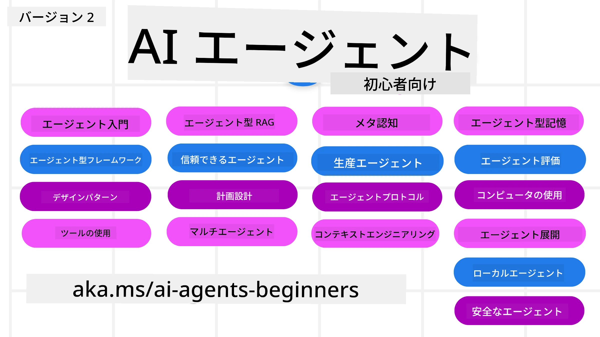

# AIエージェント入門 - コース



## AIエージェント構築を始めるために知っておくべきすべてを教えるコース

[](https://github.com/microsoft/ai-agents-for-beginners/blob/master/LICENSE?WT.mc_id=academic-105485-koreyst)
[](https://GitHub.com/microsoft/ai-agents-for-beginners/graphs/contributors/?WT.mc_id=academic-105485-koreyst)
[](https://GitHub.com/microsoft/ai-agents-for-beginners/issues/?WT.mc_id=academic-105485-koreyst)
[](https://GitHub.com/microsoft/ai-agents-for-beginners/pulls/?WT.mc_id=academic-105485-koreyst)
[](http://makeapullrequest.com?WT.mc_id=academic-105485-koreyst)

### 🌐 多言語対応

#### GitHub Actionsによりサポート（自動＆常に最新）

<!-- CO-OP TRANSLATOR LANGUAGES TABLE START -->
[Arabic](../ar/README.md) | [Bengali](../bn/README.md) | [Bulgarian](../bg/README.md) | [Burmese (Myanmar)](../my/README.md) | [Chinese (Simplified)](../zh-CN/README.md) | [Chinese (Traditional, Hong Kong)](../zh-HK/README.md) | [Chinese (Traditional, Macau)](../zh-MO/README.md) | [Chinese (Traditional, Taiwan)](../zh-TW/README.md) | [Croatian](../hr/README.md) | [Czech](../cs/README.md) | [Danish](../da/README.md) | [Dutch](../nl/README.md) | [Estonian](../et/README.md) | [Finnish](../fi/README.md) | [French](../fr/README.md) | [German](../de/README.md) | [Greek](../el/README.md) | [Hebrew](../he/README.md) | [Hindi](../hi/README.md) | [Hungarian](../hu/README.md) | [Indonesian](../id/README.md) | [Italian](../it/README.md) | [Japanese](./README.md) | [Kannada](../kn/README.md) | [Khmer](../km/README.md) | [Korean](../ko/README.md) | [Lithuanian](../lt/README.md) | [Malay](../ms/README.md) | [Malayalam](../ml/README.md) | [Marathi](../mr/README.md) | [Nepali](../ne/README.md) | [Nigerian Pidgin](../pcm/README.md) | [Norwegian](../no/README.md) | [Persian (Farsi)](../fa/README.md) | [Polish](../pl/README.md) | [Portuguese (Brazil)](../pt-BR/README.md) | [Portuguese (Portugal)](../pt-PT/README.md) | [Punjabi (Gurmukhi)](../pa/README.md) | [Romanian](../ro/README.md) | [Russian](../ru/README.md) | [Serbian (Cyrillic)](../sr/README.md) | [Slovak](../sk/README.md) | [Slovenian](../sl/README.md) | [Spanish](../es/README.md) | [Swahili](../sw/README.md) | [Swedish](../sv/README.md) | [Tagalog (Filipino)](../tl/README.md) | [Tamil](../ta/README.md) | [Telugu](../te/README.md) | [Thai](../th/README.md) | [Turkish](../tr/README.md) | [Ukrainian](../uk/README.md) | [Urdu](../ur/README.md) | [Vietnamese](../vi/README.md)

> **ローカルクローンの方がいいですか？**
>
> このリポジトリは50以上の言語翻訳を含み、ダウンロードサイズが大幅に増加します。翻訳なしでクローンしたい場合は、スパースチェックアウトを使用してください：
>
> **Bash / macOS / Linux:**
> ```bash
> git clone --filter=blob:none --sparse https://github.com/microsoft/ai-agents-for-beginners.git
> cd ai-agents-for-beginners
> git sparse-checkout set --no-cone '/*' '!translations' '!translated_images'
> ```
>
> **CMD (Windows):**
> ```cmd
> git clone --filter=blob:none --sparse https://github.com/microsoft/ai-agents-for-beginners.git
> cd ai-agents-for-beginners
> git sparse-checkout set --no-cone "/*" "!translations" "!translated_images"
> ```
>
> コース修了に必要なものをより高速にダウンロードできます。
<!-- CO-OP TRANSLATOR LANGUAGES TABLE END -->

**追加の翻訳言語を希望される場合は [こちら](https://github.com/Azure/co-op-translator/blob/main/getting_started/supported-languages.md) をご覧ください**

[](https://GitHub.com/microsoft/ai-agents-for-beginners/watchers/?WT.mc_id=academic-105485-koreyst)
[](https://GitHub.com/microsoft/ai-agents-for-beginners/network/?WT.mc_id=academic-105485-koreyst)
[](https://GitHub.com/microsoft/ai-agents-for-beginners/stargazers/?WT.mc_id=academic-105485-koreyst)

[](https://discord.gg/nTYy5BXMWG)


## 🌱 はじめに

このコースにはAIエージェント構築の基礎をカバーするレッスンが含まれています。各レッスンはそれぞれのトピックを扱っているので、好きなところから始めてください！

このコースは多言語対応です。[こちらの利用可能言語一覧](#-multi-language-support)をご覧ください。

ジェネレーティブAIモデルを使った開発が初めての方は、21のレッスンでGenAIの構築を学べる [Generative AI For Beginners](https://aka.ms/genai-beginners) コースもチェックしてください。

このリポジトリに [スター(🌟)を付ける](https://docs.github.com/en/get-started/exploring-projects-on-github/saving-repositories-with-stars?WT.mc_id=academic-105485-koreyst) のを忘れずに、コードを動かすために [フォークしてください](https://github.com/microsoft/ai-agents-for-beginners/fork)。

### ほかの学習者と交流し質問に答えてもらおう

AIエージェント構築で行き詰まったり質問がある場合は、[Microsoft Foundry Discord](https://aka.ms/ai-agents/discord) の専用Discordチャンネルに参加してください。

### 必要なもの

このコースの各レッスンにはコード例が含まれており、code_samplesフォルダーにあります。自分用に [このリポジトリをフォーク](https://github.com/microsoft/ai-agents-for-beginners/fork)して使うことができます。

これらの演習のコード例はMicrosoft Agent FrameworkとAzure AI Foundry Agent Service V2を利用しています：

- [Microsoft Foundry](https://aka.ms/ai-agents-beginners/ai-foundry) - Azureアカウントが必要です

このコースで使用しているMicrosoftのAIエージェントフレームワークとサービス：

- [Microsoft Agent Framework (MAF)](https://aka.ms/ai-agents-beginners/agent-framewrok)
- [Azure AI Foundry Agent Service V2](https://aka.ms/ai-agents-beginners/ai-agent-service)

一部のコードサンプルは、大規模コンテキストモデル（最大204Kトークン）を提供する [MiniMax](https://platform.minimaxi.com/) などのOpenAI互換プロバイダーもサポートしています。設定の詳細は [Course Setup](./00-course-setup/README.md) を参照してください。

コードの実行に関する詳細は [Course Setup](./00-course-setup/README.md) を参照してください。

## 🙏 ご協力のお願い

ご提案やスペルミス、コードの誤りを見つけましたか？[Issueを投稿](https://github.com/microsoft/ai-agents-for-beginners/issues?WT.mc_id=academic-105485-koreyst) するか、[プルリクエストを作成](https://github.com/microsoft/ai-agents-for-beginners/pulls?WT.mc_id=academic-105485-koreyst)してください。


## 📂 各レッスンに含まれるもの

- READMEに記載されたレッスン本文と短いビデオ
- Microsoft Agent FrameworkとAzure AI Foundryを使ったPythonコードサンプル
- 学習を継続するための追加リソースへのリンク


## 🗃️ レッスン一覧

| <strong>レッスン</strong>                                 | **テキスト & コード**                              | <strong>ビデオ</strong>                                                 | <strong>追加学習</strong>                                                                          |
|--------------------------------------------|---------------------------------------------------|------------------------------------------------------------|---------------------------------------------------------------------------------------|
| AIエージェントとエージェントユースケース入門 | [Link](./01-intro-to-ai-agents/README.md)          | [Video](https://youtu.be/3zgm60bXmQk?si=z8QygFvYQv-9WtO1)  | [Link](https://aka.ms/ai-agents-beginners/collection?WT.mc_id=academic-105485-koreyst) |
| AIエージェントフレームワークの探検            | [Link](./02-explore-agentic-frameworks/README.md)  | [Video](https://youtu.be/ODwF-EZo_O8?si=Vawth4hzVaHv-u0H)  | [Link](https://aka.ms/ai-agents-beginners/collection?WT.mc_id=academic-105485-koreyst) |
| AIエージェント設計パターンの理解              | [Link](./03-agentic-design-patterns/README.md)     | [Video](https://youtu.be/m9lM8qqoOEA?si=BIzHwzstTPL8o9GF)  | [Link](https://aka.ms/ai-agents-beginners/collection?WT.mc_id=academic-105485-koreyst) |
| ツール使用設計パターン                        | [Link](./04-tool-use/README.md)                    | [Video](https://youtu.be/vieRiPRx-gI?si=2z6O2Xu2cu_Jz46N)  | [Link](https://aka.ms/ai-agents-beginners/collection?WT.mc_id=academic-105485-koreyst) |
| エージェントRAG                             | [Link](./05-agentic-rag/README.md)                 | [Video](https://youtu.be/WcjAARvdL7I?si=gKPWsQpKiIlDH9A3)  | [Link](https://aka.ms/ai-agents-beginners/collection?WT.mc_id=academic-105485-koreyst) |
| 信頼できるAIエージェントの構築                 | [Link](./06-building-trustworthy-agents/README.md) | [Video](https://youtu.be/iZKkMEGBCUQ?si=jZjpiMnGFOE9L8OK ) | [Link](https://aka.ms/ai-agents-beginners/collection?WT.mc_id=academic-105485-koreyst) |
| 計画設計パターン                             | [Link](./07-planning-design/README.md)             | [Video](https://youtu.be/kPfJ2BrBCMY?si=6SC_iv_E5-mzucnC)  | [Link](https://aka.ms/ai-agents-beginners/collection?WT.mc_id=academic-105485-koreyst) |
| マルチエージェント設計パターン                  | [Link](./08-multi-agent/README.md)                 | [Video](https://youtu.be/V6HpE9hZEx0?si=rMgDhEu7wXo2uo6g)  | [Link](https://aka.ms/ai-agents-beginners/collection?WT.mc_id=academic-105485-koreyst) |
| メタ認知デザインパターン                     | [リンク](./09-metacognition/README.md)               | [ビデオ](https://youtu.be/His9R6gw6Ec?si=8gck6vvdSNCt6OcF)  | [リンク](https://aka.ms/ai-agents-beginners/collection?WT.mc_id=academic-105485-koreyst) |
| 本番環境におけるAIエージェント               | [リンク](./10-ai-agents-production/README.md)        | [ビデオ](https://youtu.be/l4TP6IyJxmQ?si=31dnhexRo6yLRJDl)  | [リンク](https://aka.ms/ai-agents-beginners/collection?WT.mc_id=academic-105485-koreyst) |
| エージェンティックプロトコルの利用（MCP、A2A、NLWeb） | [リンク](./11-agentic-protocols/README.md)           | [ビデオ](https://youtu.be/X-Dh9R3Opn8)                                 | [リンク](https://aka.ms/ai-agents-beginners/collection?WT.mc_id=academic-105485-koreyst) |
| AIエージェントのためのコンテキストエンジニアリング | [リンク](./12-context-engineering/README.md)         | [ビデオ](https://youtu.be/F5zqRV7gEag)                                 | [リンク](https://aka.ms/ai-agents-beginners/collection?WT.mc_id=academic-105485-koreyst) |
| エージェンティックメモリの管理                 | [リンク](./13-agent-memory/README.md)     |      [ビデオ](https://youtu.be/QrYbHesIxpw?si=vZkVwKrQ4ieCcIPx)                                                      |                                                                                        |
| Microsoft Agent Frameworkの探求                  | [リンク](./14-microsoft-agent-framework/README.md)                            |                                                            |                                                                                        |
| コンピュータ使用エージェント (CUA) の構築        | [リンク](./15-browser-use/README.md)     |                                                            | [リンク](https://docs.browser-use.com/examples/templates/playwright-integration)         |
| スケーラブルエージェントの展開                  | 近日公開予定                           |                                                            |                                                                                        |
| ローカルAIエージェントの作成                   | 近日公開予定                               |                                                            |                                                                                        |
| AIエージェントのセキュリティ確保               | 近日公開予定                               |                                                            |                                                                                        |

## 🎒 その他のコース

当チームは他のコースも制作しています！ぜひご覧ください：

<!-- CO-OP TRANSLATOR OTHER COURSES START -->
### LangChain
[](https://aka.ms/langchain4j-for-beginners)
[](https://aka.ms/langchainjs-for-beginners?WT.mc_id=m365-94501-dwahlin)
[](https://github.com/microsoft/langchain-for-beginners?WT.mc_id=m365-94501-dwahlin)
---

### Azure / Edge / MCP / エージェント
[](https://github.com/microsoft/AZD-for-beginners?WT.mc_id=academic-105485-koreyst)
[](https://github.com/microsoft/edgeai-for-beginners?WT.mc_id=academic-105485-koreyst)
[](https://github.com/microsoft/mcp-for-beginners?WT.mc_id=academic-105485-koreyst)
[](https://github.com/microsoft/ai-agents-for-beginners?WT.mc_id=academic-105485-koreyst)

---
 
### 生成AIシリーズ
[](https://github.com/microsoft/generative-ai-for-beginners?WT.mc_id=academic-105485-koreyst)
[-9333EA?style=for-the-badge&labelColor=E5E7EB&color=9333EA)](https://github.com/microsoft/Generative-AI-for-beginners-dotnet?WT.mc_id=academic-105485-koreyst)
[-C084FC?style=for-the-badge&labelColor=E5E7EB&color=C084FC)](https://github.com/microsoft/generative-ai-for-beginners-java?WT.mc_id=academic-105485-koreyst)
[-E879F9?style=for-the-badge&labelColor=E5E7EB&color=E879F9)](https://github.com/microsoft/generative-ai-with-javascript?WT.mc_id=academic-105485-koreyst)

---
 
### コアラーニング
[](https://aka.ms/ml-beginners?WT.mc_id=academic-105485-koreyst)
[](https://aka.ms/datascience-beginners?WT.mc_id=academic-105485-koreyst)
[](https://aka.ms/ai-beginners?WT.mc_id=academic-105485-koreyst)
[](https://github.com/microsoft/Security-101?WT.mc_id=academic-96948-sayoung)
[](https://aka.ms/webdev-beginners?WT.mc_id=academic-105485-koreyst)
[](https://aka.ms/iot-beginners?WT.mc_id=academic-105485-koreyst)
[](https://github.com/microsoft/xr-development-for-beginners?WT.mc_id=academic-105485-koreyst)

---
 
### Copilotシリーズ
[](https://aka.ms/GitHubCopilotAI?WT.mc_id=academic-105485-koreyst)
[](https://github.com/microsoft/mastering-github-copilot-for-dotnet-csharp-developers?WT.mc_id=academic-105485-koreyst)
[](https://github.com/microsoft/CopilotAdventures?WT.mc_id=academic-105485-koreyst)
<!-- CO-OP TRANSLATOR OTHER COURSES END -->

## 🌟 コミュニティへの感謝

Agentic RAGを示す重要なコードサンプルを提供してくれた[Shivam Goyal](https://www.linkedin.com/in/shivam2003/)に感謝します。

## 貢献について

本プロジェクトでは貢献および提案を歓迎しています。ほとんどの貢献は、貢献物の権利を有し実際に弊社にその使用権を許諾することを宣言する
Contributor License Agreement (CLA) に同意する必要があります。詳細は <https://cla.opensource.microsoft.com> をご覧ください。

プルリクエストを送信すると、CLA ボットが自動的に CLA の提出が必要かどうかを判定し、
適切な装飾（ステータスチェックやコメントなど）を行います。ボットの指示に従ってください。
CLA は弊社のすべてのリポジトリで一度だけ行えば結構です。

本プロジェクトは[Microsoft Open Source Code of Conduct](https://opensource.microsoft.com/codeofconduct/)を採用しています。
詳細は[Code of Conduct FAQ](https://opensource.microsoft.com/codeofconduct/faq/)をご覧いただくか、
追加の質問やコメントは [opencode@microsoft.com](mailto:opencode@microsoft.com) までご連絡ください。

## 商標について

本プロジェクトにはプロジェクト、製品、サービスの商標やロゴが含まれている場合があります。Microsoftの商標やロゴの
正当な使用は [Microsoftの商標・ブランドガイドライン](https://www.microsoft.com/legal/intellectualproperty/trademarks/usage/general) に準拠する必要があります。
本プロジェクトの修正バージョンでの Microsoft の商標やロゴの使用は混乱を招いたり、
Microsoftの支援を意味するものではないようにしなければなりません。
第三者の商標やロゴの使用は、それら第三者の方針に従う必要があります。

## サポートを受けるには

AIアプリの構築で困ったり質問があれば、以下に参加してください：

[](https://aka.ms/foundry/discord)

製品のフィードバックや構築時のエラーについては、こちらをご利用ください：

[](https://aka.ms/foundry/forum)

---

<!-- CO-OP TRANSLATOR DISCLAIMER START -->
**免責事項**:  
本書類は AI 翻訳サービス [Co-op Translator](https://github.com/Azure/co-op-translator) を使用して翻訳されています。正確性を期していますが、自動翻訳には誤りや不正確な部分が含まれる可能性があることをご承知おきください。原文の言語で記載された文書が正式な情報源とみなされます。重要な情報については、専門の人間翻訳を推奨します。本翻訳の使用によって生じたいかなる誤解や誤訳についても、当方は責任を負いません。
<!-- CO-OP TRANSLATOR DISCLAIMER END -->