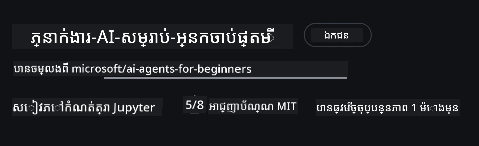
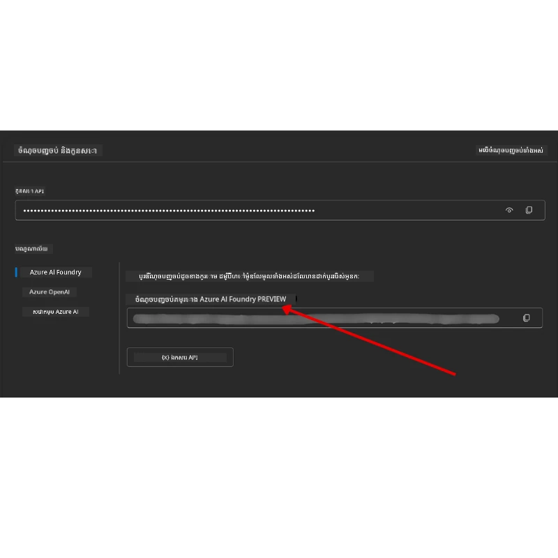

# ការតំឡើងមុខវិជ្ជា

## ការណែនាំ

មេរៀននេះនឹងបង្ហាញពីរបៀបបើកដំណើរកូដខ្លះៗនៃមុខវិជ្ជាដែលមាន។

## ចូលរួមជាមួយអ្នករៀនផ្សេងទៀត និងទទួលបានជំនួយ

មុននឹងចាប់ផ្តើមកូពី repo របស់អ្នក សូមចូលរួមនៅក្នុង [ប៉ុស្តិ៍ Discord របស់ AI Agents សម្រាប់អ្នកចំបាប់](https://aka.ms/ai-agents/discord) ដើម្បីទទួលបានជំនួយណាមួយចំពោះការតំឡើង គោលបំណងកូដរបស់មុខវិជ្ជា ឬសម្រាប់ភ្ជាប់ជាមួយអ្នករៀនផ្សេងទៀត។

## Clone ឬ Fork repo នេះ

ដើម្បីចាប់ផ្តើម សូម clone ឬ fork GitHub Repository។ នេះនឹងបង្កើតមុខវិជ្ជាដែលជារបស់អ្នកផ្ទាល់ ដែលអ្នកអាចបើកដំណើរការ សាកល្បង និងកែប្រែកូដបាន។

អ្នកអាចធ្វើបានដោយចុចតំណ <a href="https://github.com/microsoft/ai-agents-for-beginners/fork" target="_blank">fork the repo</a>

ឥឡូវនេះអ្នកគួរតែមានកម្រង fork របស់ខ្លួនផ្ទាល់សម្រាប់មុខវិជ្ជានេះនៅតាមតំណខាងក្រោម៖



### Shallow Clone (ផ្តល់អនុសាសន៍សម្រាប់សិក្ខាសាលា / Codespaces)

  > Repository ពេញលេញអាចធំនៅប្រហែល (~3 GB) ពេលអ្នកទាញយកប្រវត្តិពេញ និងឯកសារទាំងអស់។ ប្រសិនបើអ្នកគ្រាន់តែចូលរួមសិក្ខាសាលាឬត្រូវការតែថតមេរៀនមួយចំនួនទេ shallow clone (ឬ sparse clone) នឹងជៀសវាងការទាញយកច្រើនដោយកាត់បន្ថយប្រវត្តិឬរំលងកំណត់ត្រាឯកសារ។

#### Clone ជារហ័ស - ប្រវត្តិចម្ងាយតិច, ឯកសារទាំងអស់

សូមប្ដូរ `<your-username>` នៅក្នុងពាក្យបញ្ជាខាងក្រោមជាមួយ URL fork របស់អ្នក (ឬ URL upstream ប្រសិនបើចូលចិត្ត)។

ដើម្បី clone តែប្រវត្តិ commit ថ្មីបំផុត (ទាញយកតិច)៖

```bash|powershell
git clone --depth 1 https://github.com/<your-username>/ai-agents-for-beginners.git
```

ដើម្បី clone ប្រាក់សាខាមួយជាក់លាក់៖

```bash|powershell
git clone --depth 1 --branch <branch-name> https://github.com/<your-username>/ai-agents-for-beginners.git
```

#### Clone ផ្នែកខ្លះ (sparse clone) — ប្លុកតិច + ថតផ្ទុកដែលបានជ្រើសរើសតែប៉ុណ្ណោះ

នេះប្រើ clone ផ្នែកខ្លះ និង sparse-checkout (ទាមទារជាមួយ Git 2.25+ និងផ្តល់អនុសាសន៍ដោយប្រើ Git សម័យទំនើបដែលគាំទ្រ partial clone):

```bash|powershell
git clone --depth 1 --filter=blob:none --sparse https://github.com/<your-username>/ai-agents-for-beginners.git
```

ចូលទៅកាន់ថត repo៖

```bash|powershell
cd ai-agents-for-beginners
```

បន្ទាប់មកបញ្ជាក់ថតដែលអ្នកចង់បាន (ឧទាហរណ៍ខាងក្រោមបង្ហាញពីថតពីរកន្លែង)៖

```bash|powershell
git sparse-checkout set 00-course-setup 01-intro-to-ai-agents
```

បន្ទាប់ពីclone និងផ្ទៀងផ្ទាត់ឯកសារ ប្រសិនបើអ្នកត្រូវការតែឯកសារនិងចង់លុបតំបន់ទុកបន្ថយ (គ្មានប្រវត្តិ git) សូមលុប metadata នៃ repository (💀 មិនអាចត្រឡប់ក្រោយបាន — អ្នកនឹងបាត់បង់មុខងារ git ទាំងអស់៖ គ្មាន commit, pull, push ឬការចូលប្រវត្តិ)។

```bash
# zsh/bash
rm -rf .git
```

```powershell
# PowerShell
Remove-Item -Recurse -Force .git
```

#### ប្រើ GitHub Codespaces (ផ្តល់អនុសាសន៍ដើម្បីជៀសវាងការទាញយកក្រៅឧបករណ៍ធំនេះ)

- បង្កើត Codespace ថ្មីសម្រាប់ repo នេះតាមរយៈ [GitHub UI](https://github.com/codespaces)។  

- នៅក្នុង terminal របស់ codespace ដែលបានបង្កើតថ្មី ប្រតិបត្តិការណ៍នូវពាក្យបញ្ជា clone ឬ sparse clone ខាងលើ ដើម្បីទាញយកថតមេរៀនដែលអ្នកត្រូវការចូល Codespace workspace ។
- ជម្រើស៖ បន្ទាប់ពីកូពីក្នុង Codespaces, លុប .git ដើម្បីសង្រួលទំហំ (មើលការលុបកូដខាងលើ)។
- ចំណាំ៖ ប្រសិនបើអ្នកចង់បើក repo ដោយផ្ទាល់ក្នុង Codespaces (គ្មានការលើកូពីបន្ថែម) សូមយល់ថា Codespaces នឹងបង្កើតបរិយាកាស devcontainer ហើយប្រហែលជានឹងផ្គត់ផ្គង់ច្រើនជាងតម្រូវការ។ Clone កូពីលឿននៅ Codespace ថ្មីនឹងផ្តល់ការគ្រប់គ្រងលើការប្រើប្រាស់ឌីសក្ត្រ។

#### ជំនួយ

- ធម្មតាប្ដូរ URL clone ជាមួយ fork របស់អ្នក ប្រសិនបើចង់កែ/commit។
- ប្រសិនបើពេលក្រោយអ្នកត្រូវការប្រវត្តិឬឯកសារច្រើន អ្នកអាច fetch ឬកែ sparse-checkout ដើម្បីរួមបញ្ចូលថតបន្ថែមបាន។

## របៀបបើកដំណើរកូដ

មុខវិជ្ជានេះផ្តល់នូវជួរមេរៀន Jupyter Notebooks ដែលអ្នកអាចបើកដំណើរការដើម្បីទទួលបានបទពិសោធន៍ដៃគូទន់ក្នុងការសាងសង់ភ្នាក់ងារជំនួយ AI។

គំរូកូដប្រើប្រាស់ **Microsoft Agent Framework (MAF)** ជាមួយ `AzureAIProjectAgentProvider` ដែលភ្ជាប់ទៅ **Azure AI Agent Service V2** (Responses API) តាមរយៈ **Microsoft Foundry**។

Notebooks Python ទាំងអស់ត្រូវបានសម្គាល់ដោយ `*-python-agent-framework.ipynb`។

## តម្រូវការ

- Python 3.12+
  - **កំណត់សម្គាល់**: ប្រសិនបើអ្នកមិនមាន Python3.12 តំឡើង សូមធានាថាអ្នកតំឡើងវា។ បន្ទាប់មកបង្កើត venv របស់អ្នកដោយប្រើ python3.12 ដើម្បីធានាថា វើស្យុងត្រូវបានដំឡើងតាមពី requirements.txt ។
  
    >ឧទាហរណ៍

    បង្កើតថត Python venv៖

    ```bash|powershell
    python -m venv venv
    ```

    បន្ទាប់មកដំណើរការ venv environment សម្រាប់៖

    ```bash
    # zsh/bash
    source venv/bin/activate
    ```
  
    ```dos
    # Command Prompt for Windows
    venv\Scripts\activate
    ```

- .NET 10+: សម្រាប់គំរូកូដដែលប្រើ .NET សូមធានាថាអ្នកបានតំឡើង [.NET 10 SDK](https://dotnet.microsoft.com/download/dotnet/10.0) ឬថ្មីជាង។ បន្ទាប់មកពិនិត្យមើលវើស្យុង .NET SDK ដែលបានដំឡើង៖

    ```bash|powershell
    dotnet --list-sdks
    ```

- **Azure CLI** — តម្រូវសម្រាប់ការផ្ទៀងផ្ទាត់។ តំឡើងពី [aka.ms/installazurecli](https://aka.ms/installazurecli)។
- **Azure Subscription** — សម្រាប់ចូលប្រើ Microsoft Foundry និង Azure AI Agent Service។
- **Microsoft Foundry Project** — គម្រោងមួយដែលបានដាក់បង្ហាញម៉ូដែល (ឧ. `gpt-4o`)។ មើល [ជំហ៊ាន 1](#ជំហ៊ាន-1-បង្កើតគម្រោង-microsoft-foundry) ខាងក្រោម។

យើងបានបញ្ចូលឯកសារ `requirements.txt` នៅក្នុងរ៉ូនរបស់ repository នេះ ដែលមានកញ្ចប់ Python ទាំងអស់ដែលត្រូវការដើម្បីបើកដំណើរកូដ។

អ្នកអាចតំឡើងវា ដោយដំណើរការបញ្ជាខាងក្រោមនៅ terminal របស់អ្នក នៅក្នុង root folder របស់ repository៖

```bash|powershell
pip install -r requirements.txt
```

យើងផ្តល់អនុសាសន៍បង្កើត virtual environment របស់ Python ដើម្បីជៀសវាងបញ្ហា និងជម្លោះណាមួយ។

## តំឡើង VSCode

សូមធានាថាអ្នកកំពុងប្រើវើស្យុង Python ត្រឹមត្រូវនៅក្នុង VSCode។


## តំឡើង Microsoft Foundry និង Azure AI Agent Service

### ជំហ៊ាន 1: បង្កើតគម្រោង Microsoft Foundry

អ្នកត្រូវការហាប់ Azure AI Foundry និងគម្រោងមួយដែលមានម៉ូដែលបានដាក់បង្ហាញដើម្បីបើកដំណើរការណូតប៊ុកនេះ។

1. ចូលទៅកាន់ [ai.azure.com](https://ai.azure.com) ហើយចុះឈ្មោះចូលជាមួយគណនី Azure របស់អ្នក។
2. បង្កើត **hub** មួយ (ឬប្រើដែលមានរួច)។ មើល៖ [Hub resources overview](https://learn.microsoft.com/azure/ai-foundry/concepts/ai-resources)។
3. នៅក្នុង hub សូមបង្កើត **project** មួយ។
4. ដាក់បង្ហាញម៉ូដែល (ឧ. `gpt-4o`) ពី **Models + Endpoints** → **Deploy model**។

### ជំហ៊ាន 2: ទាញយក Endpoint គម្រោង និងឈ្មោះការដាក់បង្ហាញម៉ូដែលរបស់អ្នក

ពីគម្រោងរបស់អ្នកនៅ Microsoft Foundry portal:

- **Project Endpoint** — ចូលទៅទំព័រ **Overview** ហើយចម្លង URL endpoint ។



- **Model Deployment Name** — ចូលទៅ **Models + Endpoints**, ជ្រើសម៉ូដែលដែលអ្នកបានដាក់បង្ហាញ ហើយចំណាំឈ្មោះ **Deployment name** (ឧ. `gpt-4o`)។

### ជំហ៊ាន 3: ចុះឈ្មោះចូល Azure ជាមួយ `az login`

 Notebooks ទាំងអស់ប្រើ **`AzureCliCredential`** សម្រាប់ការផ្ទៀងផ្ទាត់ — គ្មាន API keys ត្រូវគ្រប់គ្រង។ វាត្រូវការឲ្យអ្នកចុះឈ្មោះចូលតាមរយៈ Azure CLI។

1. **តំឡើង Azure CLI** ប្រសិនបើអ្នកមិនទាន់បាន [aka.ms/installazurecli](https://aka.ms/installazurecli)

2. **ចុះឈ្មោះចូល** ដោយដំណើរការ:

    ```bash|powershell
    az login
    ```

    ឬប្រសិនបើអ្នកនៅក្នុងបរិយាកាសចម្ងាយ/Codespace គ្មានកម្មវិធីរៀបចំ browser:

    ```bash|powershell
    az login --use-device-code
    ```

3. **ជ្រើសរើស subscription** ប្រសិនបើមានការសុំ — ជ្រើសនូវ subscription ដែលមានគម្រោង Foundry របស់អ្នក។

4. **ផ្ទៀងផ្ទាត់** ថាបានចុះឈ្មោះចូល៖

    ```bash|powershell
    az account show
    ```

> **ហេតុអ្វី `az login`?** នូវ notebooks ផ្ទៀងផ្ទាត់ដោយប្រើ `AzureCliCredential` ពីកញ្ចប់ `azure-identity`។ នេះមានន័យថាសម័យ Azure CLI របស់អ្នកផ្តល់សិទ្ធិសិទ្ធិ — គ្មាន API keys ឬសម្ងាត់នៅក្នុងឯកសារ `.env` របស់អ្នក។ នេះគឺជា [ការអនុវត្តសុវត្ថិភាពល្អ](https://learn.microsoft.com/azure/developer/ai/keyless-connections)។

### ជំហ៊ាន 4: បង្កើតឯកសារ `.env` របស់អ្នក

ចម្លងឯកសារឧទាហរណ៍៖

```bash
# zsh/bash
cp .env.example .env
```

```powershell
# PowerShell
Copy-Item .env.example .env
```

បើក `.env` ហើយបញ្ចូលតម្លៃទាំងពីរនេះ៖

```env
AZURE_AI_PROJECT_ENDPOINT=https://<your-project>.services.ai.azure.com/api/projects/<your-project-id>
AZURE_AI_MODEL_DEPLOYMENT_NAME=gpt-4o
```

| ប៉ារ៉ាម៉ែត្រ | រកឃើញនៅណា |
|----------|-----------------|
| `AZURE_AI_PROJECT_ENDPOINT` | បង្ហាញបាននៅportal Foundry → គម្រោងរបស់អ្នក → ទំព័រ **Overview** |
| `AZURE_AI_MODEL_DEPLOYMENT_NAME` | portal Foundry → **Models + Endpoints** → ឈ្មោះម៉ូដែលដែលបានដាក់បង្ហាញ |

នេះគឺជាចំណុចបញ្ចប់សម្រាប់មេរៀនភាគច្រើន! Notebooks នឹងអនុវត្តការផ្ទៀងផ្ទាត់ដោយស្វ័យប្រវត្តិតាមរយៈសម័យ `az login` របស់អ្នក។

### ជំហ៊ាន 5: តំឡើងការពឹងផ្អែក Python

```bash|powershell
pip install -r requirements.txt
```

យើងផ្តល់អនុសាសន៍ឱ្យដំណើរការនេះនៅក្នុងបរិយាកាស virtual environment ដែលអ្នកបានបង្កើតមុននេះ។

## តំឡើងបន្ថែមសម្រាប់មេរៀនទី 5 (Agentic RAG)

មេរៀនទី 5 ប្រើប្រាស់ **Azure AI Search** សម្រាប់ការចងក្រងដោយការយកវិញ-បន្ថែមប្រភេទការផលិត។ ប្រសិនបើអ្នកមានគម្រោងបើកមេរៀននោះ សូមបន្ថែមប៉ារ៉ាម៉ែត្រ​នេះទៅក្នុងឯកសារ `.env` របស់អ្នក៖

| ប៉ារ៉ាម៉ែត្រ | រកឃើញនៅណា |
|----------|-----------------|
| `AZURE_SEARCH_SERVICE_ENDPOINT` | Azure portal → អធ្យាស្រ័យ **Azure AI Search** របស់អ្នក → **Overview** → URL |
| `AZURE_SEARCH_API_KEY` | Azure portal → អធ្យាស្រ័យ **Azure AI Search** របស់អ្នក → **Settings** → **Keys** → key អ្នកគ្រប់គ្រងសំខាន់ |

## តំឡើងបន្ថែមសម្រាប់មេរៀនទី 6 និង 8 (GitHub Models)

ខ្លះនូវ notebooks ក្នុងមេរៀន 6 និង 8 ប្រើ **GitHub Models** ជំនួស Azure AI Foundry។ ប្រសិនបើអ្នកចង់បើកគំរូនោះ សូមបន្ថែមប៉ារ៉ាម៉ែត្រ​ទាំងនេះទៅក្នុង `.env` របស់អ្នក៖

| ប៉ារ៉ាម៉ែត្រ | រកឃើញនៅណា |
|----------|-----------------|
| `GITHUB_TOKEN` | GitHub → **Settings** → **Developer settings** → **Personal access tokens** |
| `GITHUB_ENDPOINT` | ប្រើ `https://models.inference.ai.azure.com` (តម្លៃលំនាំដើម) |
| `GITHUB_MODEL_ID` | ឈ្មោះម៉ូដែលដែលប្រើ (ឧ. `gpt-4o-mini`) |

## ផ្គត់ផ្គង់ជំនួយជំនួស: MiniMax (សមត្ថភាព OpenAI-Compatible)

[MiniMax](https://platform.minimaxi.com/) ផ្ដល់ម៉ូដែល context ដែលធំ (រហូតដល់ 204K tokens) តាមរយៈ API OpenAI-Compatible។ ពីព្រោះ Microsoft Agent Framework `OpenAIChatClient` ត្រូវជាមួយ endpoint សមត្ថភាព OpenAIណាមួយ អ្នកអាចប្រើ MiniMax ជាជំនួសទៅ GitHub Models ឬ OpenAI ។

បន្ថែមប៉ារ៉ាម៉ែត្រទាំងនេះទៅ `.env` របស់អ្នក៖

| ប៉ារ៉ាម៉ែត្រ | រកឃើញនៅណា |
|----------|-----------------|
| `MINIMAX_API_KEY` | [MiniMax Platform](https://platform.minimaxi.com/) → API Keys |
| `MINIMAX_BASE_URL` | ប្រើ `https://api.minimax.io/v1` (តម្លៃលំនាំដើម) |
| `MINIMAX_MODEL_ID` | ឈ្មោះម៉ូដែលដែលប្រើ (ឧ. `MiniMax-M2.7`) |

**ម៉ូដែលដែលមាន**: `MiniMax-M2.7` (ផ្ដល់អនុសាសន៍), `MiniMax-M2.7-highspeed` (ឆាប់ប្រតិចប្រតិចជាង)

គំរូកូដដែលប្រើ `OpenAIChatClient` (ឧ. មេរៀនទី 14 ការកក់សណ្ឋាគារ) នឹងផ្ទាញមើល និងប្រើកំណត់ការរបស់ MiniMax ដោយស្វ័យប្រវត្តិ ពេលដែល `MINIMAX_API_KEY` ត្រូវបានកំណត់។

## តំឡើងបន្ថែមសម្រាប់មេរៀនទី 8 (Bing Grounding Workflow)

នូវ notebook ការងារពិគ្រោះនៃមេរៀន 8 ប្រើ **Bing grounding** តាម Azure AI Foundry។ ប្រសិនបើអ្នកមានគម្រោងបើកគំរូនេះ សូមបន្ថែមប៉ារ៉ាម៉ែត្រនេះទៅក្នុង `.env` របស់អ្នក៖

| ប៉ារ៉ាម៉ែត្រ | រកឃើញនៅណា |
|----------|-----------------|
| `BING_CONNECTION_ID` | portal Azure AI Foundry → គម្រោងរបស់អ្នក → **Management** → **Connected resources** → ការតភ្ជាប់ Bing របស់អ្នក → ចម្លង connection ID |

## ការដោះស្រាយបញ្ហា

### កំហុសការផ្ទៀងផ្ទាត់ SSL លើ macOS

ប្រសិនបើអ្នកប្រើ macOS ហើយប្រឈមមុខកំហុសដូចជា៖

```plaintext
ssl.SSLCertVerificationError: [SSL: CERTIFICATE_VERIFY_FAILED] certificate verify failed: self-signed certificate in certificate chain
```

នេះគឺជាបញ្ហាដែលបានគេទទួលស្គាល់ជាមួយ Python លើ macOS ដោយសារតែវិញ្ញាបនប័ត្រ SSL របស់ប្រព័ន្ធមិនត្រូវបានទទួលស្គាល់ដោយស្វ័យប្រវត្តិ។ សូមព្យាយាមដោះស្រាយដូចខាងក្រោម៖

**ជម្រើសទី 1៖ ប្រតិបត្តិវាយកូដ install Certificates របស់ Python (ផ្ដល់អនុសាសន៍)**

```bash
# ជំនួស 3.XX ជាមួយកំណែ Python ដែលបានដំឡើងរបស់អ្នក (ឧទាហរណ៍ 3.12 ឬ 3.13):
/Applications/Python\ 3.XX/Install\ Certificates.command
```

**ជម្រើសទី 2៖ ប្រើ `connection_verify=False` នៅក្នុង notebook របស់អ្នក (សម្រាប់ notebooks GitHub Models មួយចំនួនតែប៉ុណ្ណោះ)**

ក្នុង notebook មេរៀនទី 6 (`06-building-trustworthy-agents/code_samples/06-system-message-framework.ipynb`), ការដោះស្រាយដែលបានcomment រួចហើយមានរួចរាល់។ សូមដោះ comment `connection_verify=False` ពេលបង្កើត client៖

```python
client = ChatCompletionsClient(
    endpoint=endpoint,
    credential=AzureKeyCredential(token),
    connection_verify=False,  # បិទការត្រួតពិនិត្យ SSL ប្រសិនបើអ្នកជួបបញ្ហាអ័ព្ទសញ្ញាបត្រ
)
```

> **⚠️ ជាកំហឹតភ្លាមៗ៖** ការបិទ SSL verification (`connection_verify=False`) បន្ថយសុវត្ថិភាពដោយរំលងការផ្ទៀងផ្ទាត់វិញវិញវិញ។ ប្រើវា​មួយតែជាការដោះស្រាយបណ្ដោះអាសន្នក្នុងបរិយាកាសអភិវឌ្ឍន៍ ប៉ុន្មានទេលើការប្រើប្រាស់ផលិតផលមិនត្រូវបានអនុញ្ញាត។

**ជម្រើសទី 3៖ តំឡើងនិងប្រើប្រាស់ `truststore`**

```bash
pip install truststore
```

បន្ទាប់បន្ថែមសេចក្តីខាងក្រោមនៅចំពោះមុខ notebook ឬ script របស់អ្នក មុនពេលធ្វើការហៅបណ្តាញណាមួយ៖

```python
import truststore
truststore.inject_into_ssl()
```

## ត្រូវឈប់នៅកន្លែងណាមួយ?

ប្រសិនបើអ្នកប្រឈមមុខបញ្ហាណាមួយក្នុងការបើកដំណើរការតំឡើងនេះ សូមចូលរួមនៅ <a href="https://discord.gg/kzRShWzttr" target="_blank">សហគមន៍ Discord របស់ Azure AI</a> ឬ <a href="https://github.com/microsoft/ai-agents-for-beginners/issues?WT.mc_id=academic-105485-koreyst" target="_blank">បង្កើតបញ្ហា</a>។

## មេរៀនបន្ទាប់

ឥឡូវអ្នករួចរាល់ក្នុងការបើកដំណើរកូដសម្រាប់មុខវិជ្ជានេះ។ សូមសំណាងល្អក្នុងការរៀនបន្ថែមអំពីពិភព AI Agents!

[ការណែនាំអំពី AI Agents និងករណីប្រើប្រាស់ Agent](../01-intro-to-ai-agents/README.md)

---

<!-- CO-OP TRANSLATOR DISCLAIMER START -->
**ការបដិសេធ**៖  
ឯកសារនេះត្រូវបានបកប្រែដោយប្រើសេវាកម្មបកប្រែ AI [Co-op Translator](https://github.com/Azure/co-op-translator)។ ក្នុងពេលដែលយើងខំប្រឹងប្រែងឲ្យបានច្បាស់លាស់ សូមចំណាំថា ការបកប្រែដោយរបៀបស្វ័យប្រវត្តិអាចមានកំហុស ឬមិនត្រឹមត្រូវ។ ឯកសារដើមក្នុងភាសាគ្រិះរបស់វាគួរត្រូវបានពិចារណាជា ប្រភពដែលមានអំណាច។ សម្រាប់ព័ត៌មានសំខាន់ៗ ការបកប្រែដោយអ្នកជំនាញមនុស្សគឺត្រូវបានណែនាំ។ យើងមិនទទួលខុសត្រូវចំពោះការយល់ច្រឡំ ឬការបកប្រែខុសពីការប្រើប្រាស់ការបកប្រែមួយនេះឡើយ។
<!-- CO-OP TRANSLATOR DISCLAIMER END -->