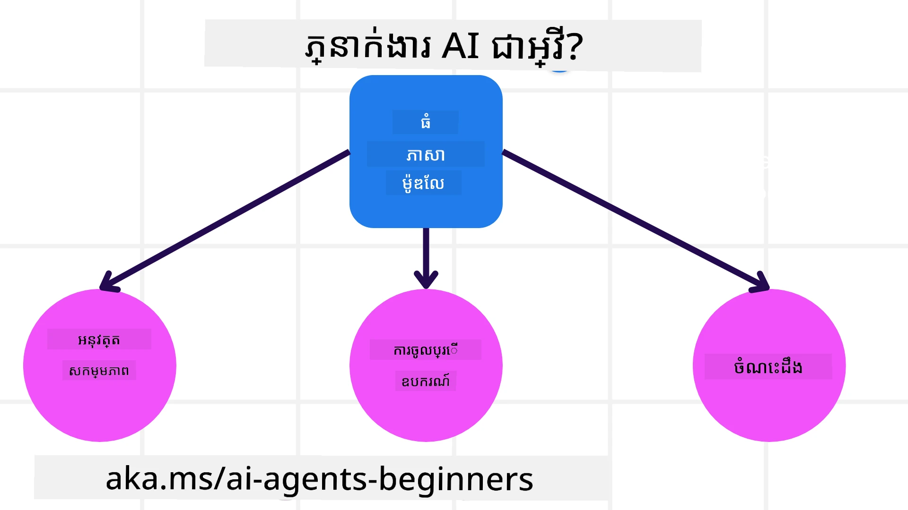
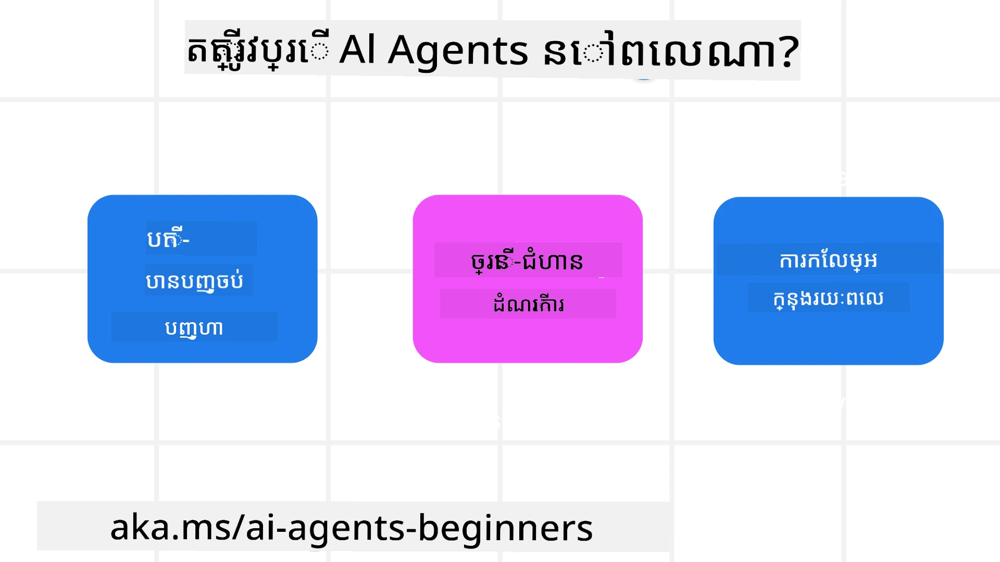

> _(ចុចរូបភាពខាងលើដើម្បីមើលវីដេអូមេរៀននេះ)_

# ការណែនាំអំពីភ្នាក់ងារ AI និងករណីការប្រើប្រាស់ភ្នាក់ងារ

សូមស្វាគមន៍ទៅកាន់មេរៀន "AI Agents for Beginners"! មេរៀននេះផ្តល់ចំណេះដឹងមូលដ្ឋាន និងឧទាហរណ៍ប្រើប្រាស់សម្រាប់សាងសង់ភ្នាក់ងារ AI។

ចូលរួម <a href="https://discord.gg/kzRShWzttr" target="_blank">សហគមន៍ Azure AI Discord</a> ដើម្បីជួបអ្នករៀនផ្សេងទៀត និងអ្នកបង្កើតភ្នាក់ងារ AI ហើយសួរព័ត៌មានណាមួយដែលអ្នកមានស្ដីពីមេរៀននេះ។

ដើម្បីចាប់ផ្តើមមេរៀននេះ យើងនឹងចាប់ផ្តើមដោយយល់ដឹងល្អជាងមុនអំពីអ្វីទៅជាភ្នាក់ងារ AI និងរបៀបដែលយើងអាចប្រើវានៅក្នុងកម្មវិធី និងលំហូរការងារដែលយើងសាងសង់។

## Introduction

មេរៀននេះគ្របដណ្តប់៖

- ភ្នាក់ងារ AI ជាអ្វី និងប្រភេទនៃភ្នាក់ងារផ្សេងៗមានអ្វីខ្លះ?
- ករណីការប្រើប្រាស់ណាដែលសាកសមសម្រាប់ភ្នាក់ងារ AI និងវាជួយយើងយ៉ាងដូចម្តេច?
- មានប្លុកស្ថាបនាមូលដ្ឋានអ្វីខ្លះនៅពេលរចនាដំណោះស្រាយផ្លូវភ្នាក់ងារ?

## Learning Goals
បន្ទាប់ពីបញ្ចប់មេរៀននេះ អ្នកគួរតែអាច៖

- យល់ពីយល់គំនិតអំពីភ្នាក់ងារ AI និងរបៀបដែលវាផ្សេងពីដំណោះស្រាយ AI ផ្សេងៗ។
- អនុវត្តភ្នាក់ងារ AI ឲ្យមានប្រសិទ្ធភាពខ្ពស់។
- រចនាដំណោះស្រាយផ្លូវភ្នាក់ងារ ដោយមានផលិតភាពសម្រាប់អ្នកប្រើ និងអតិថិជន។

## Defining AI Agents and Types of AI Agents

### What are AI Agents?

ភ្នាក់ងារ AI គឺជា **ប្រព័ន្ធ** ដែលអនុញ្ញាតឲ្យ **Large Language Models(LLMs)** អាច **អនុវត្តសកម្មភាព** ដោយពង្រីកសមត្ថភាពរបស់ពួកវាតាមរយៈការផ្តល់ឱ្យ LLMs **ការចូលប្រើឧបករណ៍** និង **ចំណេះដឹង**។

យើងនឹងបំបែកនិពន្ធន័យនេះទៅជា​ផ្នែកតូចៗ៖

- **ប្រព័ន្ធ** - វាសំខាន់ក្នុងការគិតអំពីភ្នាក់ងារមិនមែនត្រឹមតែជាផ្នែកតែមួយទេ តែក៏ជាប្រព័ន្ធដែលមានផ្នែកជាច្រើន។ នៅកម្រិតមូលដ្ឋាន ផ្នែកនៃភ្នាក់ងារ AI គឺ៖
  - **បរិយាកាស** - តំបន់ដែលបានកំណត់ដែលភ្នាក់ងារ AI កំពុងដំណើរការ។ ឧទាហរណ៍ ប្រសិនបើយើងមានភ្នាក់ងារកក់ដំណើរ បរិយាកាសអាចជា ប្រព័ន្ធកក់ដំណើរដែលភ្នាក់ងារប្រើដើម្បីបញ្ចប់កិច្ចការណ៍។
  - **ឧបករណ៍សញ្ញារៀង (Sensors)** - បរិយាកាសមានព័ត៌មាន និងផ្តល់មតិចម្លើយ។ ភ្នាក់ងារអ្នកប្រើឧបករណ៍សញ្ញារៀងដើម្បីប្រមូល និងបកស្រាយព័ត៌មាននេះអំពីស្ថានភាពបច្ចុប្បន្ននៃបរិយាកាស។ នៅក្នុងឧទាហរណ៍ភ្នាក់ងារកក់ដំណើរ ប្រព័ន្ធកក់ដំណើរអាចផ្ដល់ព័ត៌មានដូចជា​ភាពមាននៅសណ្ឋាគារ ឬ តម្លៃសំបុត្រ។
  - **ឧបករណ៍បើកចលនា (Actuators)** - ពេលដែលភ្នាក់ងារទទួលបានស្ថានភាពបច្ចុប្បន្ននៃបរិយាកាស សម្រាប់កិច្ចការបច្ចុប្បន្ន ភ្នាក់ងារគណនា​ការសកម្មភាពដែលត្រូវអនុវត្តដើម្បីប្ដូរបរិយាកាស។ សម្រាប់ភ្នាក់ងារកក់ដំណើរ វាអាចជាការកក់បន្ទប់ដែលមានលក្ខណៈទុកសម្រាប់អ្នកប្រើ។

**ម៉ូដែលភាសាធំ (Large Language Models)** - គំនិតនៃភ្នាក់ងារមានមុនពេលមាន LLMs។ អត្ថប្រយោជន៍នៃការសាងសង់ភ្នាក់ងារជាមួយ LLMs គឺសមត្ថភាពក្នុងការបកស្រាយភាសាមនុស្ស និងទិន្នន័យ។ សមត្ថភាពនេះអនុញ្ញាតឲ្យ LLMs បកស្រាយព័ត៌មានបរិយាកាស និងកំណត់ផែនការ ដើម្បីប្ដូរបរិយាកាស។

**អនុវត្តសកម្មភាព** - ខាងក្រៅប្រព័ន្ធភ្នាក់ងារ AI, LLMs មានកំណត់ត្រឹមតែស្ថានភាពដែលសកម្មភាពជាការបង្កើតមាតិកា ឬព័ត៌មានយោងលើប៉ោងនៃអ្នកប្រើ។ ខាងក្នុងប្រព័ន្ធភ្នាក់ងារ AI, LLMs អាចបំពេញកិច្ចការ​ដោយបកស្រាយសំណើអ្នកប្រើ និងប្រើឧបករណ៍ដែលមានក្នុងបរិយាកាសរបស់ពួកវា។

**ការចូលប្រើឧបករណ៍** - ឧបករណ៍ដែល LLM ចូលប្រើត្រូវបានកំណត់ដោយ 1) បរិយាកាសដែលវាកំពុងដំណើរការ និង 2) អ្នកអភិវឌ្ឍន៍នៃភ្នាក់ងារ។ សម្រាប់ឧទាហរណ៍ភ្នាក់ងារកក់ដំណើរ ឧបករណ៍របស់ភ្នាក់ងារត្រូវបានកំណត់ដោយប្រតិបត្តិការដែលមាននៅក្នុងប្រព័ន្ធកក់ និង/ឬ អ្នកអភិវឌ្ឍន៍អាចដាក់ទណ្ឌកម្មនៃការចូលប្រើឧបករណ៍របស់ភ្នាក់ងារទៅតាមសេវាកម្មជាក់លាក់ដូចជា ជើងហោះហើរ។

**ចងចាំ+ចំណេះដឹង** - ចងចាំអាចជាចងចាំខ្លីនៅក្នុងបរិបទការសន្ទនារវាងអ្នកប្រើ និងភ្នាក់ងារ។ ចងចាំរយៈវែង ខាងក្រៅព័ត៌មានដែលផ្ដល់ដោយបរិយាកាស ភ្នាក់ងារ AI ក៏អាចទាញយកចំណេះដឹងពីប្រព័ន្ធផ្សេងៗ សេវាកម្ម ឧបករណ៍ និងទូទៅពីភ្នាក់ងារផ្សេងទៀត។ នៅក្នុងឧទាហរណ៍ភ្នាក់ងារកក់ដំណើរ ចំណេះដឹងនេះអាចជាព័ត៌មានអំពីចូលចិត្តការធ្វើដំណើររបស់អ្នកប្រើដែលទុកនៅក្នុងមូលដ្ឋានទិន្នន័យអតិថិជន។

### The different types of agents

ឥឡូវនេះដែលយើងមាននិទាឃរណ៍ទូទៅអំពីភ្នាក់ងារ AI យើងามកមើលប្រភេទភ្នាក់ងារផ្សេងៗ និងរបៀបដែលពួកវានឹងត្រូវអនុវត្តក្នុងឧទាហរណ៍ភ្នាក់ងារកក់ដំណើរ។

| **ប្រភេទភ្នាក់ងារ**                | **ការពិពណ៌នា**                                                                                                                       | **ឧទាហរណ៍**                                                                                                                                                                                                                   |
| ----------------------------- | ------------------------------------------------------------------------------------------------------------------------------------- | ----------------------------------------------------------------------------------------------------------------------------------------------------------------------------------------------------------------------------- |
| **ភ្នាក់ងារតបឆ្លើយ​ងាយៗ**      | អនុវត្តសកម្មភាពភ្លាមៗអាស្រ័យលើច្បាប់ដែលបានកំណត់ជាមុន។                                                                                  | ភ្នាក់ងារកក់ដំណើរបកស្រាយបរិបទអ៊ីមែល ហើយបញ្ជូនការត្អូញត្អែរ​អំពីការធ្វើដំណើរទៅផ្នែកសេវាកម្មអតិថិជន។                                                                                                                          |
| **ភ្នាក់ងារតបឆ្លើយដោយផ្អែកលើម៉ូដែល** | អនុវត្តសកម្មភាពដោយផ្អែកលើម៉ូដែលនៃពិភព និងការផ្លាស់ប្តូរទៅលើម៉ូដែលនោះ។                                                              | ភ្នាក់ងារកក់ដំណើរផ្តល់អាទិភាពលើខ្សែដំណើរដែលមានការប្រែប្រួលតម្លៃយ៉ាងច្រើន ដោយផ្អែកលើភាពអាចចូលប្រើទិន្នន័យតម្លៃប្រវត្តិសាស្ត្រ។                                                                                                             |
| **ភ្នាក់ងារដែលផ្អែកលើគោលបំណង**         | បង្កើតផែនការ​ដើម្បីសម្រេចគោលបំណងជាក់លាក់ដោយបកស្រាយគោលបំណង និងកំណត់សកម្មភាពដើម្បីទៅដល់វា។                                  | ភ្នាក់ងារកក់ដំណើរធ្វើការកំណត់បំណិពណ៌រៀបចំដំណើរ​ដែលចាំបាច់ (ឡាន សាធារណៈ អាកាសចរណ៍) ពីទីតាំងបច្ចុប្បន្នទៅគោលដៅ។                                                                               |
| **ភ្នាក់ងារផ្អែកលើអត្ថប្រយោជន៍**      | គិតពីចំណូលចិត្ត និងវាស់តុល្យភាពជាលេខ ដើម្បីកំណត់របៀបសម្រេចគោលបំណង។                                               | ភ្នាក់ងារកក់ដំណើរប្រើវិធីវាស់អត្ថប្រយោជន៍ ដោយប្រៀបធៀបភាពងាយស្រួល និងថ្លៃដើម្បីពង្រឹងការជ្រើសរើសពេលកក់ដំណើរ។                                                                                                                                          |
| **ភ្នាក់ងាររៀន**           | បង្កើនភាពប្រសើរជាលក្ខណៈពេលវេលា ដោយឆ្លើយតបនឹងមតិយោបល់ និងកែប្រែសកម្មភាពឲ្យសមរម្យ។                                                        | ភ្នាក់ងារកក់ដំណើរកែលម្អដោយប្រើមតិយោបល់អតិថិជនពីសំនួរស្ទាប់ក្រោយដំណើរការ ដើម្បីធ្វើការកែប្រែពេលកក់ដំណើរនាពេលក្រោយ។                                                                                                               |
| **ភ្នាក់ងារដោយមានថ្នាក់ច្រើន**       | មានភ្នាក់ងារច្រើនក្នុងប្រព័ន្ធជាថ្នាក់ៗ ដែលភ្នាក់ងារកម្រិតខ្ពស់បែកកិច្ចការធំទៅជាកិច្ចការរងសម្រាប់ភ្នាក់ងារកម្រិតទាបបញ្ចប់។ | ភ្នាក់ងារកក់ដំណើរលុបដំណើរមួយដោយបែងចែកកិច្ចការទៅជាកិច្ចការរង (ឧ. លុបការកក់ជាក់លាក់) ហើយឲ្យភ្នាក់ងារកម្រិតទាបបញ្ចប់ ហើយរាយការណ៍ត្រឡប់ទៅភ្នាក់ងារកម្រិតខ្ពស់។                                     |
| **ប្រព័ន្ធភ្នាក់ងារច្រើន (MAS)** | ភ្នាក់ងារបញ្ចប់កិច្ចការឯករាជ្យ ឬអាចរួមសហការឬប្រកួតប្រជែង។                                                           | រួមសហការ: ភ្នាក់ងារច្រើនធ្វើការកក់សេវាកម្មដំណើរផ្សេងៗដូចជា សណ្ឋាគារ សំបុត្រហោះហើរ និងការកម្សាន្ត។ ប្រកួតប្រជែង: ភ្នាក់ងារច្រើនគ្រប់គ្រង និងប្រកួតប្រជែងលើប្រតិទិនកក់សណ្ឋាគារចែករំលែក ដើម្បីកក់អតិថិជនចូលសណ្ឋាគារ។ |

## When to Use AI Agents

នៅផ្នែកខាងលើ យើងបានប្រើឧទាហរណ៍ភ្នាក់ងារកក់ដំណើរដើម្បីពន្យល់ពីរបៀបដែលប្រភេទភ្នាក់ងារផ្សេងៗអាចត្រូវប្រើក្នុងសន្ទស្សន៍ខុសៗគ្នានៃការកក់ដំណើរ។ យើងនឹងបន្តប្រើកម្មវិធីនេះដោយឧទាហរណ៍ក្នុងមេរៀនទាំងមូល។

មកមើលប្រភេទករណីប្រើប្រាស់ដែលភ្នាក់ងារ AI សាកសមបំផុតសម្រាប់៖

- **បញ្ហាដែលបើកចំហ** - អនុញ្ញាតឲ្យ LLM កំណត់ជំហ៊ានដែលចាំបាច់ដើម្បីបញ្ចប់កិច្ចការ ព្រោះវាមិនអាចត្រូវបានកូដរឹងក្នុងលំហូរការងារ​រាល់លក្ខខណ្ឌទាំងអស់បាន។
- **ដំណើរការជាច្រើនជំហ៊ាន** - កិច្ចការដែលទាមទារថ្នាក់ភាពស្មុគស្មាញ ដែលភ្នាក់ងារ AI ត្រូវប្រើឧបករណ៍ ឬព័ត៌មានជាច្រើនជំហ៊ាន ជំនួសការទាញយកមួយលើកតែប៉ុណ្ណោះ។  
- **ការកែលម្អលើពេលវេលា** - កិច្ចការដែលភ្នាក់ងារអាចកែលម្អជាថ្ងៃទៅថ្ងៃ ដោយទទួលមតិយោបល់ពីបរិយាកាសឬអ្នកប្រើ ដើម្បីផ្តល់អត្ថប្រយោជន៍កាន់តែប្រសើរ។

យើងពិភាក្សាពីការពិចារណាបន្ថែមទាក់ទងការប្រើភ្នាក់ងារ AI នៅមេរៀន Building Trustworthy AI Agents។

## Basics of Agentic Solutions

### Agent Development

ជំហានដំបូងក្នុងការរចនាប្រព័ន្ធភ្នាក់ងារ AI គឺកំណត់ឧបករណ៍ សកម្មភាព និងឥរិយាបថ។ ក្នុងមេរៀននេះ យើងផ្ដោតលើការប្រើ **Azure AI Agent Service** ដើម្បីកំណត់ភ្នាក់ងាររបស់យើង។ វាផ្តល់លក្ខណៈពិសេសដូចជា៖

- ការ​ចំរិតម៉ូឌែលបើកដូចជា OpenAI, Mistral និង Llama
- ការប្រើទិន្នន័យដែលមានអាជ្ញាប័ណ្ណតាមរយៈអ្នកផ្គត់ផ្គង់ដូចជា Tripadvisor
- ការប្រែប្រួលឧបករណ៍រចនាសម្ព័ន្ធ OpenAPI 3.0

### Agentic Patterns

ការប្រាស្រ័យទាក់ទងជាមួយ LLM ត្រូវធ្វើតាមការបញ្ចូលសំណើ (prompts)។ ដោយសារតែភាសាផ្លូវភ្នាក់ងារមានលក្ខណៈឯករាជ្យផ្នែកមួយ វាមិនពេញលេញ ឬមិនត្រូវការ​ឲ្យមានការបញ្ចូលសំណើដោយដៃនៅពេលមានការផ្លាស់ប្ដូរនៅក្នុងបរិយាកាស។ យើងប្រើ **លំនាំផ្លូវភ្នាក់ងារ (Agentic Patterns)** ដែលអនុញ្ញាតឲ្យយើងបញ្ចូលសំណើទៅកាន់ LLM ជាច្រើនជំហ៊ានក្នុងវិធីដែលអាចប្រើបានយ៉ាងទូលំទូលាយ។

មេរៀននេះ ត្រូវបានបំបែកទៅជា​លំនាំផ្លូវភ្នាក់ងារដែលកំពុងពេញនិយមនៅបច្ចុប្បន្ន។

### ស៊ុយក្រមផ្លូវភ្នាក់ងារ

ស៊ុយក្រមផ្លូវភ្នាក់ងារ​អនុញ្ញាតឲ្យអ្នកអភិវឌ្ឍន៍អាច​អនុវត្តលំនាំភ្នាក់ងារដោយកូដ។ ស៊ុយក្រមទាំងនេះផ្តល់ទំព័រគំរូ ផ្លugins និងឧបករណ៍សម្រាប់ការសហការភ្នាក់ងារ AI ដែលល្អប្រសើរ។ អត្ថប្រយោជន៍ទាំងនេះផ្តល់សមត្ថភាពសម្រាប់ការមើលឃើញ និងដោះស្រាយបញ្ហាបានល្អប្រសើរ​នៃប្រព័ន្ធភ្នាក់ងារ AI។

ក្នុងមេរៀននេះ យើងនឹងស្វែងយល់អំពី Microsoft Agent Framework (MAF) សម្រាប់សាងសង់ភ្នាក់ងារដែលអាចប្រើក្នុងផលិតកម្មបាន។

## Sample Codes

- Python: [ស៊ុយក្រមភ្នាក់ងារ](./code_samples/01-python-agent-framework.ipynb)
- .NET: [ស៊ុយក្រមភ្នាក់ងារ](./code_samples/01-dotnet-agent-framework.md)

## Got More Questions about AI Agents?

ចូលរួម [សហគមន៍ Discord Microsoft Foundry](https://aka.ms/ai-agents/discord) ដើម្បីជួបជាមួយអ្នករៀនផ្សេងទៀត ចូលរួមម៉ោងការិយាល័យ និងទទួលបានចម្លើយសម្រាប់សំណួរទាក់ទងភ្នាក់ងារ AI របស់អ្នក។

## Previous Lesson

[ការកំណត់វគ្គ](../00-course-setup/README.md)

## Next Lesson

[ការស្រាវជ្រាវស្តីពីស៊ុយក្រមផ្លូវភ្នាក់ងារ](../02-explore-agentic-frameworks/README.md)

---

<!-- CO-OP TRANSLATOR DISCLAIMER START -->
**ការមិនទទួលខុសត្រូវ**:
ឯកសារនេះបានបកប្រែដោយប្រើសេវាកម្មបកប្រែ AI [Co-op Translator](https://github.com/Azure/co-op-translator). ក្នុងខណៈពេលយើងខំប្រឹងសម្រាប់ភាពត្រឹមត្រូវ សូមយល់ឲ្យបានថា ការបកប្រែដោយស្វ័យប្រវត្តិអាចមានកំហុស ឬភាពមិនត្រឹមត្រូវ។ ឯកសារដើមក្នុងភាសាដើមគួរត្រូវបានចាត់ទុកជាផ្លូវការនិងជាប្រភពដ៏ទូលំទូលាយ។ សម្រាប់ព័ត៌មានសំខាន់ៗ ការបកប្រែដោយអ្នកជំនាញមនុស្សត្រូវបានផ្តល់អនុសាសន៍។ យើងមិនទទួលខុសត្រូវចំពោះការយល់ច្រឡំ ឬការបកពិពណ៌នាផ្សេងៗដែលកើតឡើងពីការប្រើប្រាស់ការបកប្រែនេះឡើយ។
<!-- CO-OP TRANSLATOR DISCLAIMER END -->