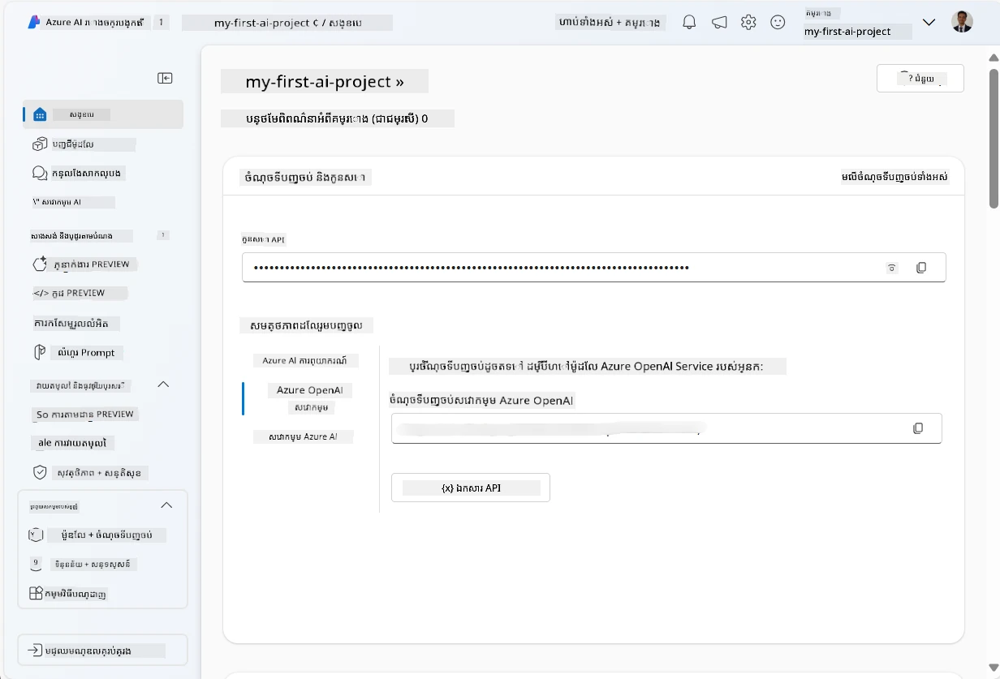
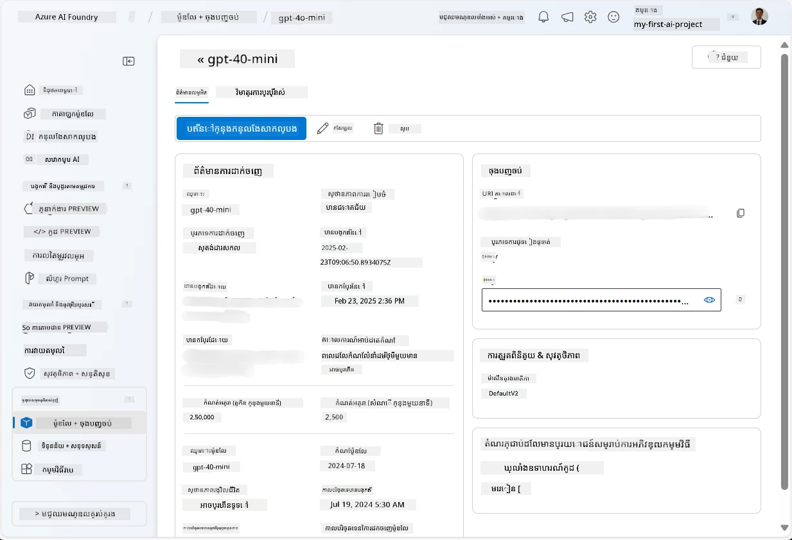
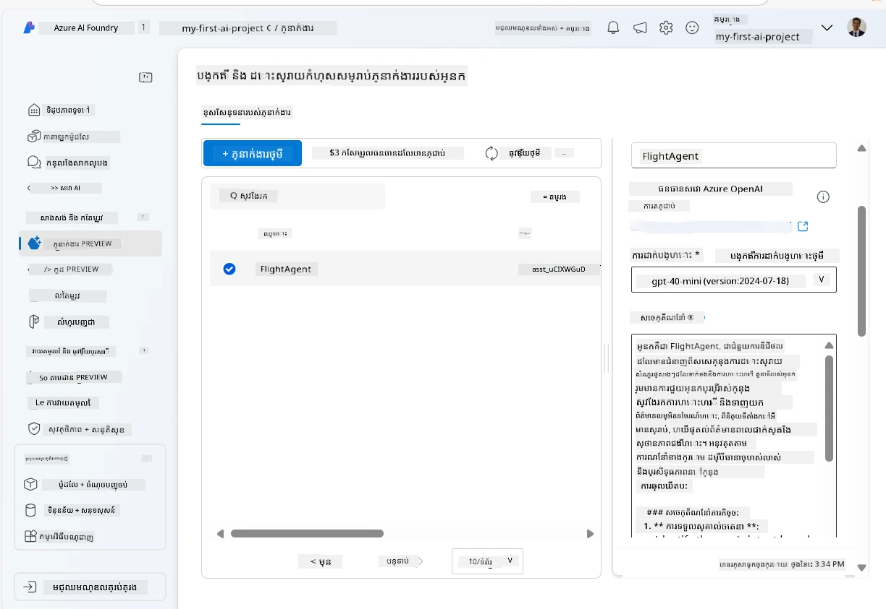
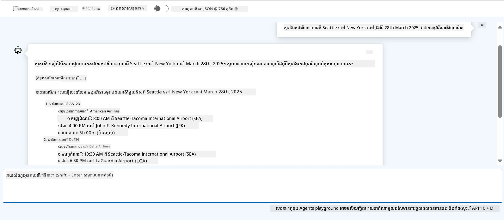

# ការអភិវឌ្ឍសេវាកម្មភ្នាក់ងារបញ្ញាសិប្បនិម្មិត Azure

នៅក្នុងលំហាត់នេះ អ្នកប្រើឧបករណ៍សេវាកម្មភ្នាក់ងារបញ្ញាសិប្បនិម្មិត Azure ក្នុង [Microsoft Foundry portal](https://ai.azure.com/?WT.mc_id=academic-105485-koreyst) ដើម្បីបង្កើតភ្នាក់ងារសម្រាប់កក់សំបុត្រយន្តហោះ។ ភ្នាក់ងារនេះនឹងអាចផ្ទាល់ពិនិត្យលើអ្នកប្រើ ហើយផ្ដល់ព័ត៌មានអំពីការហោះហើរ។

## លក្ខខណ្ឌមុនកិច្ចការ

ដើម្បីបញ្ចប់លំហាត់នេះ អ្នកត្រូវការអ្វីខ្លះដូចខាងក្រោម៖  
1. គណនី Azure មួយដែលមានការជាវសកម្ម។ [បង្កើតគណនីដោយឥតគិតថ្លៃ](https://azure.microsoft.com/free/?WT.mc_id=academic-105485-koreyst)។  
2. អ្នកត្រូវការអាជ្ញាបណ្ណសម្រាប់បង្កើតមជ្ឈមណ្ឌល Microsoft Foundry ឬមានមជ្ឈមណ្ឌលមួយសម្រាប់អ្នក។  
    - ប្រសិនបើតួនាទីរបស់អ្នកគឺជា Contributor ឬ Owner អ្នកអាចអនុវត្តតាមជំហានក្នុងមេរៀននេះ។

## បង្កើតមជ្ឈមណ្ឌល Microsoft Foundry

> **ចំណាំ:** Microsoft Foundry ត្រូវបានគេហៅមុននេះថា Azure AI Studio ។

1. អនុវត្តតាមលក្ខណៈណែនាំពី [Microsoft Foundry](https://learn.microsoft.com/en-us/azure/ai-studio/?WT.mc_id=academic-105485-koreyst) សម្រាប់បង្កើតមជ្ឈមណ្ឌល Microsoft Foundry។  
2. ពេលគម្រោងរបស់អ្នកបានបង្កើត សូមបិទភាគទានណែនាំណាមួយដែលបង្ហាញហើយពិនិត្យមើលទំព័រកម្មវិធីក្នុង Microsoft Foundry portal ដែលគួរតែផ្តល់រូបភាពដូចខាងក្រោម៖

    

## តម្លើងគំរូ

1. នៅផ្នែកខាងឆ្វេងសម្រាប់គម្រោងរបស់អ្នក ក្នុងផ្នែក **My assets** ជ្រើសទំព័រ **Models + endpoints**។  
2. នៅក្នុងទំព័រ **Models + endpoints** នៅផ្ទាំង **Model deployments** នៅក្នុងម៉ឺនុយ **+ Deploy model** ជ្រើស **Deploy base model**។  
3. ស្វែងរកគំរូ `gpt-4o-mini` ក្នុងបញ្ជី ហើយជ្រើសរើសនិងបញ្ជាក់វា។

    > **ចំណាំ**៖ ការកាត់បន្ថយ TPM ជួយបញ្ជាក់ថាអ្នកមិនប្រើប្រាស់កម្រិតច្រើនពេកនៃគណនីដែលអ្នកកំពុងប្រើ។

    

## បង្កើតភ្នាក់ងារ

ឥឡូវនេះអ្នកបានតម្លើងគំរូស្រេច អ្នកអាចបង្កើតភ្នាក់ងារបាន។ ភ្នាក់ងារជាគំរូ AI សន្ទនា ដែលអាចប្រើសម្រាប់ផ្ទាល់ពិនិត្យជាមួយអ្នកប្រើបាន។

1. នៅផ្នែកខាងឆ្វេងសម្រាប់គម្រោងរបស់អ្នក ក្នុងផ្នែក **Build & Customize** ជ្រើសទំព័រ **Agents**។  
2. ចុច **+ Create agent** ដើម្បីបង្កើតភ្នាក់ងារថ្មីមួយ។ នៅក្នុងប្រអប់ជំរើស **Agent Setup**៖  
    - បញ្ចូលឈ្មោះសម្រាប់ភ្នាក់ងារ ដូចជា `FlightAgent`។  
    - បញ្ចាក់ថាការតម្លើងគំរូ `gpt-4o-mini` ដែលអ្នកបានបង្កើតមុននេះត្រូវបានជ្រើសរើស។  
    - កំណត់ **Instructions** តាមបច្ចេកទេសដែលអ្នកចង់ឱ្យភ្នាក់ងារត្រូវអនុវត្ត។ វាគឺជាឧទាហរណ៍៖  
    ```
    You are FlightAgent, a virtual assistant specialized in handling flight-related queries. Your role includes assisting users with searching for flights, retrieving flight details, checking seat availability, and providing real-time flight status. Follow the instructions below to ensure clarity and effectiveness in your responses:

    ### Task Instructions:
    1. **Recognizing Intent**:
       - Identify the user's intent based on their request, focusing on one of the following categories:
         - Searching for flights
         - Retrieving flight details using a flight ID
         - Checking seat availability for a specified flight
         - Providing real-time flight status using a flight number
       - If the intent is unclear, politely ask users to clarify or provide more details.
        
    2. **Processing Requests**:
        - Depending on the identified intent, perform the required task:
        - For flight searches: Request details such as origin, destination, departure date, and optionally return date.
        - For flight details: Request a valid flight ID.
        - For seat availability: Request the flight ID and date and validate inputs.
        - For flight status: Request a valid flight number.
        - Perform validations on provided data (e.g., formats of dates, flight numbers, or IDs). If the information is incomplete or invalid, return a friendly request for clarification.

    3. **Generating Responses**:
    - Use a tone that is friendly, concise, and supportive.
    - Provide clear and actionable suggestions based on the output of each task.
    - If no data is found or an error occurs, explain it to the user gently and offer alternative actions (e.g., refine search, try another query).
    
    ```
> [!NOTE]  
> សម្រាប់ការបញ្ជារពិស្តារ អ្នកអាចពិនិត្យ [ឃ្លាំងនេះ](https://github.com/ShivamGoyal03/RoamMind) សម្រាប់ព័ត៌មានបន្ថែម។  
>  
> លើសពីនេះ អ្នកអាចបន្ថែម **Knowledge Base** និង **Actions** ដើម្បីបង្កើនសមត្ថភាពភ្នាក់ងារ ក្នុងការផ្ដល់ព័ត៌មាននិងអនុវត្តភារកិច្ចដោយស្វ័យប្រវត្តិទាក់ទងនឹងការស្នើសុំរបស់អ្នកប្រើ។ សម្រាប់លំហាត់នេះ អ្នកអាចរំលងជំហានទាំងនេះបាន។  



3. ដើម្បីបង្កើតភ្នាក់ងារថ្មីមួយជាមួយ AI ច្រើន សូមចុច **New Agent** តែម្តង។ ភ្នាក់ងារថ្មីនឹងត្រូវបង្ហាញនៅលើទំព័រ Agents ។

## សាកល្បងភ្នាក់ងារ

បន្ទាប់ពីបង្កើតភ្នាក់ងារ អ្នកអាចសាកល្បងវា ដើម្បីមើលពីរបៀបដែលវានឹងឆ្លើយតបចំពោះសំណួរបស់អ្នកប្រើនៅក្នុងម៉ៃក្រូសូហ្វថ្នាក់ទី Microsoft Foundry portal playground។

1. នៅខាងលើផ្នែក **Setup** សម្រាប់ភ្នាក់ងាររបស់អ្នក ជ្រើស **Try in playground**។  
2. នៅផ្នែក **Playground** អ្នកអាចផ្ទាល់ពិនិត្យជាមួយភ្នាក់ងារ ដោយវាយសំណួរចូលក្នុងប្រាសាទសន្ទនា។ ឧទាហរណ៍ អ្នកអាចសួរភ្នាក់ងារដើម្បីស្វែងរកការហោះហើរពី Seattle ទៅ New York នៅថ្ងៃទី 28។

    > **ចំណាំ**៖ ភ្នាក់ងារអាចមិនផ្ដល់ចម្លើយត្រឹមត្រូវ សម្រាប់លំហាត់នេះគ្មានទិន្នន័យពេលវេលាពិតប្រាកដបានប្រើ។ គោលបំណងគឺក្នុងការសាកល្បងសមត្ថភាពភ្នាក់ងារក្នុងការយល់ដឹង និងឆ្លើយតបតាមសំណួររបស់អ្នកប្រើដោយផ្អែកលើការណែនាំដែលបានផ្ដល់។  

    

3. បន្ទាប់ពីសាកល្បងភ្នាក់ងារ អ្នកអាចបន្ថែមការប្ដូរតបន្ថែម ដូចជាការបន្ថែមគោលបំណង, ទិន្នន័យហាត់បង្រៀន និងសកម្មភាព ដើម្បីបង្កើនសមត្ថភាពរបស់វា។

## លុបបំបែកធនធាន

នៅពេលដែលអ្នកបានសាកល្បងភ្នាក់ងារ រួច អ្នកអាចលុបវាឲ្យដាច់ ដើម្បីជៀសវាងការចំណាយបន្ថែម។  
1. បើក [Azure portal](https://portal.azure.com) ហើយមើលមាតិកាក្រុមធនធាន ដែលអ្នកបានបញ្ជូនធនធានមជ្ឈមណ្ឌលក្នុងលំហាត់នេះ។  
2. នៅលើប៊ូតុងប្រើក្រុម យកចុច **Delete resource group**។  
3. បញ្ចូលឈ្មោះក្រុមធនធាន ហើយបញ្ជាក់ថាអ្នកចង់លុបវា។

## ធនធាន

- [ឯកសាររបស់ Microsoft Foundry](https://learn.microsoft.com/en-us/azure/ai-studio/?WT.mc_id=academic-105485-koreyst)  
- [ទីផ្សាររបស់ Microsoft Foundry](https://ai.azure.com/?WT.mc_id=academic-105485-koreyst)  
- [ការចាប់ផ្តើមជាមួយ Azure AI Studio](https://techcommunity.microsoft.com/blog/educatordeveloperblog/getting-started-with-azure-ai-studio/4095602?WT.mc_id=academic-105485-koreyst)  
- [មូលដ្ឋាននៃភ្នាក់ងារបញ្ញាសិប្បនិម្មិតនៅលើ Azure](https://learn.microsoft.com/en-us/training/modules/ai-agent-fundamentals/?WT.mc_id=academic-105485-koreyst)  
- [Discord Azure AI](https://aka.ms/AzureAI/Discord)

---

<!-- CO-OP TRANSLATOR DISCLAIMER START -->
**ការបដិសេធ**៖  
ឯកសារនេះត្រូវបានបកប្រែដោយប្រើសេវាបកប្រែ AI [Co-op Translator](https://github.com/Azure/co-op-translator)។ ក្នុងពេលដែលយើងខិតខំក្នុងការធ្វើឲ្យត្រឹមត្រូវ សូមចំណាំថាការបកប្រែដោយស្វ័យប្រវត្តិក្នុងខ្លះអាចមានកំហុសឬការខុសឆ្គងមួយចំនួន។ ឯកសារដើមនៅក្នុងភាសាដើមគួរត្រូវបានគិតជាមូលដ្ឋានផ្លូវការនៃព័ត៌មាន។ សម្រាប់ព័ត៌មានដែលសំខាន់ខ្ពស់ ការបកប្រែមនុស្សវិជ្ជាជីវៈត្រូវបានណែនាំ។ យើងមិនទទួលខុសត្រូវចំពោះការយល់ច្រឡំ ឬការបកស្រាយខុសៗណាមួយដែលកើតឡើងពីការប្រើប្រាស់ការបកប្រែនេះឡើយ។
<!-- CO-OP TRANSLATOR DISCLAIMER END -->