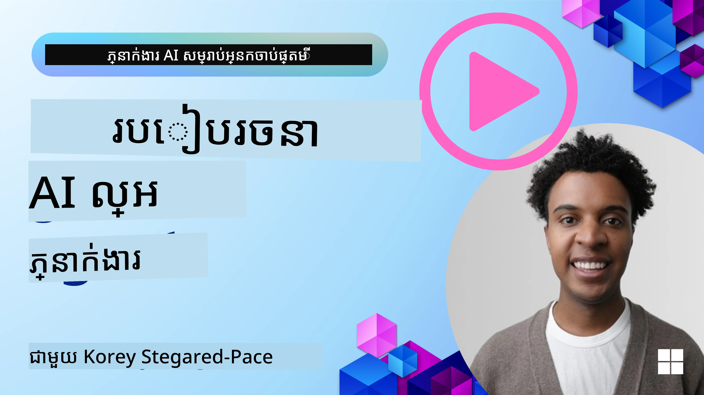
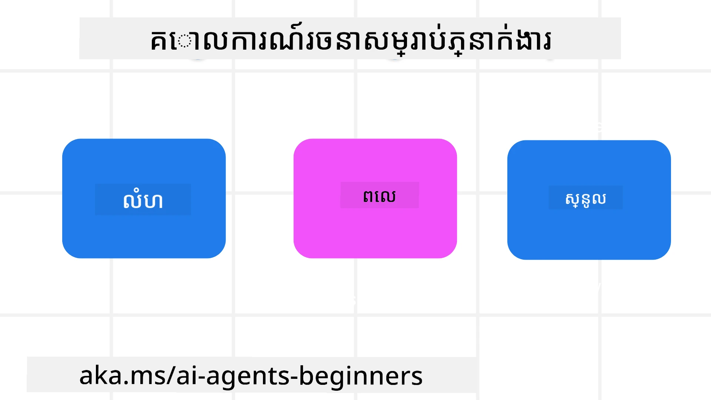

> _(ចុចរូបភាពខាងលើដើម្បីមើលវីដេអូរបស់មេរៀននេះ)_
# គោលការណ៏រចនាភ្នាក់ងារយោង (AI Agentic Design Principles)

## មេរៀនមូលដ្ឋាន

មានវិធីជាច្រើនក្នុងការគិតអំពីការបង្កើតប្រព័ន្ធភ្នាក់ងារ AI។ ដោយសារតែភាពមិនច្បាស់គឺជាមុខងារមួយ មិនមែនចុះបញ្ចូលកំហុសក្នុងការរចនាអ្នកបង្កើតទិន្នន័យបង្កើតទេ ក៏ដោយ វាក៏ធ្វើឱ្យវិស្វករមួយចំនួនមានការលំបាកក្នុងការដឹងថាត្រូវចាប់ផ្តើមពីណា។ យើងបានបង្កើតក្រុមនៃគោលការណ៏ UX ដែលផ្ដោតលើមនុស្ស ដើម្បីអនុញ្ញាតឱ្យអ្នកអភិវឌ្ឍ អាចបង្កើតប្រព័ន្ធភ្នាក់ងារដែលផ្ដោតលើអតិថិជន ដើម្បីដោះស្រាយតម្រូវការអាជីវកម្មរបស់ពួកគេ។ គោលការណ៏រចនាខាងនេះមិនមែនជាសំណង់ទម្រង់ដែលត្រូវអនុវត្តយ៉ាងម៉ាកណាមួយទេ ប៉ុន្តែជាចំណុចចាប់ផ្តើមសម្រាប់ក្រុមដែលកំពុងកំណត់ និងបង្កើតបទពិសោធន៍ភ្នាក់ងារ។

ដោយទូទៅ ភ្នាក់ងារ គួរតែ:

- ពង្រីកនិងបង្កើនសមត្ថភាពមនុស្ស (គំនិតប្រកបដោយការយល់ចំពោះ, ដោះស្រាយបញ្ហា, អូតូម៉ាស្យុង ឬផ្សេងៗ)
- បំពេញចន្លោះចំណេះដឹង (ធ្វើឲ្យខ្ញុំទាន់ចំណេះដឹងអំពីដែនចំណេះដឹង ការបកប្រែ ដូចជា)
- ជួយសម្រួល និងគាំទ្រការសហការប្រកបដោយរបៀបដែលយើងជាផ្ទាល់និយមក្នុងការធ្វើការជាមួយអ្នកដទៃ
- ធ្វើឲ្យយើងប្រសើរឡើងជាកំណែខ្លួនឯង (ឧ. គ្រូជីវិត/គ្រប់គ្រងភារៈការ, ជួយយើងរៀនជំនាញគ្រប់គ្រងអារម្មណ៍ និងការយកចិត្តទុកដាក់, បង្កើតភាពរឹងមាំ ហើយផ្សេងៗ)

## មេរៀននេះនឹងគ្របដណ្តប់

- តើគោលការណ៏រចនាភ្នាក់ងារយោងគឺអ្វីខ្លះ
- តើមានមាគ៌ាណាខ្លះដែលត្រូវអនុវត្តខណៈពេលអនុវត្តគោលការណ៏រចនាខាងនេះ
- តើមានឧទាហរណ៍ណាខ្លះនៃការប្រើគោលការណ៏រចនាខាងនេះ

## គោលដៅការរៀន

បន្ទាប់ពីបញ្ចប់មេរៀននេះ អ្នកនឹងអាច:

1. ពន្យល់ថាគោលការណ៏រចនាភ្នាក់ងារយោងមានអ្វីខ្លះ
2. ពន្យល់ពីមាគ៌ាសម្រាប់ការប្រើគោលការណ៏រចនាភ្នាក់ងារ
3. យល់ដឹងពីរបៀបបង្កើតភ្នាក់ងារដោយប្រើគោលការណ៏រចនាភ្នាក់ងារ

## គោលការណ៏រចនាភ្នាក់ងារយោង

### ភ្នាក់ងារ (បរិយាកាស)

នេះគឺជាបរិយាកាសដែលភ្នាក់ងារប្រតិបត្ដិ។ គោលការណ៏ទាំងនេះផ្តល់ទិសដៅចំពោះរបៀបដែលយើងរចនាភ្នាក់ងារដើម្បីមានការចូលរួមក្នុងពិភពផ្ទាល់ខ្លួន និងឌីជីថល։

- **ការតភ្ជាប់ មិនមែនបង្កបែកទេ** – ជួយតភ្ជាប់មនុស្សទៅកាន់មនុស្សផ្សេងទៀត ព្រឹត្តិការណ៍ និងចំណេះដឹងដែលអាចអនុវត្តបាន ដើម្បីអនុញ្ញាតការសហការនិងការតភ្ជាប់។
- ភ្នាក់ងារជួយតភ្ជាប់ព្រឹត្តិការណ៍ ចំណេះដឹង និងមនុស្ស។
- ភ្នាក់ងារបញ្ចេញមនុស្សឱកាសនៅជិតគ្នាយូរមិនមែនរចនាឡើយដើម្បីជំនួសឬបង្ខូចថาคนផ្សេងទេ។
- **ងាយស្រួលចូលដំណើរការ ប៉ុន្តែក៍អាចលាងឃើញបានជាពេលខ្លះ** – ភ្នាក់ងារធ្វើដំណើរការជាចម្បងនៅផ្នែកខាងក្រោយ ហើយជាការពេលត្រូវបានទន្សាយតិចតួចពេលដែលវាសំខាន់ និងសមរម្យ។
  - ភ្នាក់ងារកាន់តែងាយស្រួលរកឃើញ និងចូលដំណើរការសម្រាប់អ្នកប្រើដែលមានសិទ្ធិលើឧបករណ៍ ឬវេទិកាណាៗក៏បាន។
  - ភ្នាក់ងារគាំទ្របញ្ចូល និងបញ្ចេញទិន្នន័យច្រើនរបៀប (សម្លេង, ការនិយាយ, អត្ថបទ, ល។)
  - ភ្នាក់ងារអាចផ្ទេរយ៉ាងរហ័សរវាងផ្នែកមុខ និងផ្នែកខាងក្រោយ; រវាងការទប់តាមមុន និងការឆ្លើយតប, ទាមទារតាមការយល់ដឹងពីតម្រូវការអ្នកប្រើ។
  - ភ្នាក់ងារអាចដំណើរការយ៉ាងមិនច្បាស់បែបណាមួយ ប៉ុន្តែដំណើរការផ្នែកខាងក្រោយ និងការសហការជាមួយភ្នាក់ងារផ្សេងទៀត មានភាពត្រឹមត្រូវ និងអាចត្រួតពិនិត្យដោយអ្នកប្រើ។

### ភ្នាក់ងារ (ពេលវេលា)

នេះគឺជារបៀបដែលភ្នាក់ងារបំពេញការងារលើពេលវេលា។ គោលការណ៏ទាំងនេះផ្តល់ទិសដៅចំពោះរបៀបដែលយើងរចនាភ្នាក់ងារដែលមានការទំនាក់ទំនងជាម្ដងបុរាណ បច្ចុប្បន្ន និងអនាគត។

- **អតីតកាល**៖ ការពិចារណាពីប្រវត្តិនិងបរិបទដែលរួមបញ្ចូលស្ថានភាពផងដែរ។
  - ភ្នាក់ងារផ្តល់លទ្ធផលដែលមានសារៈសំខាន់ច្រើនជាងពីមុន ដោយផ្អែកលើវិភាគទិន្នន័យប្រវត្តិសម្បទាដែលមានច្រើនជាងព្រឹត្តិការណ៍ មនុស្ស ឬស្ថានភាពតែប៉ុណ្ណោះ។
  - ភ្នាក់ងារបង្កើតការតភ្ជាប់ពីព្រឹត្តិការណ៍កន្លងមក ហើយទទួលស្គាល់អនុស្សាវរីយ៍ដើម្បីចូលរួមជាមួយស្ថានភាពបច្ចុប្បន្ន។
- **បច្ចុប្បន្ន**៖ ការបង្វិលជាច្រើនជាងការជូនដំណឹង។
  - ភ្នាក់ងារមានវិធីសាស្រ្តទូលំទូលាយក្នុងការជាសកម្មភាពជាមួយមនុស្ស។ ពេលមានព្រឹត្តិការណ៍, ភ្នាក់ងារមិនត្រឹមតែផ្តល់ការជូនដំណឹងស្ថិតស្ថេរ ឬទម្រង់ផ្លូវការផ្សេងទៀតទេ។ ភ្នាក់ងារអាចសម្រួលដំណើរការ ឬបង្កើតសញ្ញាផ្ទុកចលនាដើម្បីទាក់ទាញចំណាប់អារម្មណ៍អ្នកប្រើនៅពេលដែលសមរម្យ។
  - ភ្នាក់ងារបញ្ជូនព័ត៌មានដោយផ្អែកលើបរិយាកាសបរិទិសន៍ ភាពផ្លាស់ប្តូរតាមសង្គម និងវប្បធម៌ និងប្តូរតាមចេតនារបស់អ្នកប្រើ។
  - ការទំនាក់ទំនងរវាងភ្នាក់ងារអាចធ្វើជា​ដំណើរបន្តៗ ធ្វើឲ្យកើនភាពស្មុគស្មាញយឺតយ៉ាវ ដើម្បីផ្ដល់អំណាចដល់អ្នកប្រើក្នុងរយៈពេលវែង។
- **អនាគត**៖ ការផ្លាស់ប្តូរ និងការអភិវឌ្ឍ។
  - ភ្នាក់ងារផ្លាស់ប្តូរតាមឧបករណ៍ វេទិកា និងទម្រង់ផ្សេងៗ។
  - ភ្នាក់ងារផ្លាស់ប្តូរតាមអាកប្បកិរិយាអ្នកប្រើ គង់ភាពចូលដំណើរការ និងអាចកែបានដោយសេរី។
  - ភ្នាក់ងារត្រូវបានទំរង់ និងអភិវឌ្ឍតាមរយៈការទំនាក់ទំនងជាបន្តបន្ទាប់ជាមួយអ្នកប្រើ។

### ភ្នាក់ងារ (មូលដ្ឋាន)

នេះគឺជាធាតុសំខាន់នៅក្នុងមូលដ្ឋាននៃការរចនាភ្នាក់ងារ។

- **ទទួលស្គាល់ភាពមិនច្បាស់ប៉ុន្តែកស្ថាបនាឱ្យមានទំនុកចិត្ត**។
  - កម្រិតមួយនៃភាពមិនច្បាស់ក្នុងភ្នាក់ងារ គឺអាចទំនោរទទួលបាន។ ភាពមិនច្បាស់ជាធាតុសំខាន់នៃការរចនាភ្នាក់ងារ។
  - ទំនុកចិត្ត និងភាពត្រឹមត្រូវជាជាន់ស្នូលនៃការរចនាភ្នាក់ងារ។
  - មនុស្សគឺនៅក្នុងការគ្រប់គ្រងថាតើភ្នាក់ងារបើក/បិទ និងស្ថានភាពភ្នាក់ងារត្រូវបង្ហាញយ៉ាងច្បាស់នៅគ្រប់ពេល។

## មាគ៌ាសម្រាប់អនុវត្តគោលការណ៏ទាំងនេះ

ពេលដែលអ្នកកំពុងប្រើគោលការណ៏រចនាកន្លងមក អនុវត្តមាគ៌ាខាងក្រោម៖

1. **ភាពបើភ្លឺ**៖ ជូនដំណឹងដល់អ្នកប្រើថា AI បានពាក់ព័ន្ធ របៀបវាធ្វើការ (រួមទាំងសកម្មភាពកន្លងមក) ហើយរបៀបផ្តល់មតិយោបល់ និងកែប្រែប្រព័ន្ធ។
2. **ការគ្រប់គ្រង**៖ អនុញ្ញាតឱ្យអ្នកប្រើកែខ្លួន តែងតាមចំណង់ចំណូលចិត្ត និងផ្ទាល់ខ្លួន ហើយមានការគ្រប់គ្រងលើប្រព័ន្ធ និងលក្ខណៈរបស់វា (រួមទាំងសមត្ថភាពក្នុងការលប់បាត់)។
3. **ភាពស្របគ្នា**៖ មានគោលបំណងបង្កើតបទពិសោធន៍ដែលស្របគ្នា និងពហុទម្រង់នៅលើឧបករណ៍ និងចំណុចប្រទាក់នានា។ ប្រើធាតុ UI/UX ដែលស្គាល់គ្នា នៅពេលដែលអាចធ្វើទៅបាន (ឧ. រូបសញ្ញាគ្រាប់សម្លេងសម្រាប់ការទំនាក់ទំនងដោយសម្លេង) ហើយកាត់បន្ថយភារៈចិត្តរបស់អតិថិជនឲ្យបានច្រើនបំផុត (ឧ. មានគោលបំណងសម្រាប់ចម្លើយខ្លីៗ មានជំនួយវីស្វល និងមាតិការ "រៀនបន្ថែម")។

## របៀបរចនាភ្នាក់ងារធ្វើដំណើរប្រើគោលការណ៏ និងមាគ៌ាខាងនេះ

ស្រមៃថាអ្នកកំពុងរចនាភ្នាក់ងារធ្វើដំណើរ (Travel Agent), នេះគឺជាវិធីដែលអ្នកអាចគិតអំពីការប្រើគោលការណ៏និងមាគ៌ា៖

1. **ភាពបើភ្លឺ** – អោយអ្នកប្រើដឹងថា Travel Agent គឺជាភ្នាក់ងារ​ដែលមាន AI ជួយ។ ផ្តល់ការណែនាំមូលដ្ឋានពីរបៀបចាប់ផ្តើម (ឧ. សារ "សួស្តី", ឧទាហរណ៍ប្រមាណឬការស្នើសុំ)។ សរសេរ​អត្ថបទនេះឲ្យច្បាស់លើទំព័រផលិតផល។ បង្ហាញបញ្ជីនៃសំណើដែលអ្នកប្រើបានស្នើសុំក្នុងអតីតកាល។ បង្ហាញយ៉ាងច្បាស់របៀបផ្តល់មតិយោបល់ (ចុចអង្រុតឡើង និងចុចអង្រុតចុះ, ប៊ូតុង Send Feedback, ល។) បញ្ជាក់យ៉ាងច្បាស់ប្រសិនបើភ្នាក់ងារមានកំណត់ការប្រើប្រាស់ឬប្រធានបទណាដែលមានការដាក់កំណត់។
2. **ការគ្រប់គ្រង** – ត្រូវធ្វើឲ្យច្បាស់ថាអ្នកប្រើអាចកែប្រែភ្នាក់ងារបន្ទាប់ពីបានបង្កើត ដោយប្រើរឿងៗដូចជា System Prompt។ អនុញ្ញាតឱ្យអ្នកប្រើជ្រើសរើសថាភ្នាក់ងារនិយាយច្រើនប៉ុណ្ណា មានរចនាបទសរសេរយ៉ាងដូចម្តេច និងមានការព្រមានអ្វីខ្លះដែលភ្នាក់ងារមិនគួរនិយាយអំពី។ អនុញ្ញាតឱ្យអ្នកប្រើមើល និងលុបឯកសារ ឬទិន្នន័យដែលពាក់ព័ន្ធ កំណត់សំណើ និងការសន្ទនាកន្លងមក។
3. **ភាពស្របគ្នា** – ត្រូវធ្វើឲ្យแนរូបភាពសញ្ញាក្នុងចែករំលែកសំណើ (Share Prompt), បន្ថែមឯកសារឬរូបថត និងតាក់ស្លាកនរណាម្នាក់ ឬអ្វីមួយ មានស្តង់ដា និងអាចស្គាល់បាន។ ប្រើរូបសញ្ញាក្រវាត់ក្រដាស (paperclip) ដើម្បីបង្ហាញការច.upload/ចែករំលែកឯកសារជាមួយភ្នាក់ងារ និងរូបសញ្ញារូបភាពសម្រាប់បង្ហាញការអាប់ឡូតក្រាហ្វិក។

## កូដគំរូ

- Python: [ស៊ុមរចនាភ្នាក់ងារ](./code_samples/03-python-agent-framework.ipynb)
- .NET: [ស៊ុមរចនាភ្នាក់ងារ](./code_samples/03-dotnet-agent-framework.md)

## មានសំណួរបន្ថែមអំពីគមនាគមន៍រចនាភ្នាក់ងារ AIទេ?

ចូលរួមនៅ [Microsoft Foundry Discord](https://aka.ms/ai-agents/discord) ដើម្បីជួបជាមួយអ្នករៀនម្នាក់ៗផ្សេងទៀត ចូលរួមម៉ោងការិយាល័យ និងទទួលបានចម្លើយពីសំណួរអំពី AI Agents របស់អ្នក។

## ធនធានបន្ថែម

- <a href="https://openai.com" target="_blank">អនុវត្តិការសម្រាប់ការគ្រប់គ្រងប្រព័ន្ធ Agentic AI | OpenAI</a>
- <a href="https://microsoft.com" target="_blank">โครงการ HAX Toolkit - Microsoft Research</a>
- <a href="https://responsibleaitoolbox.ai" target="_blank">ប្រអប់ឧបករណ៍ AI មានបន្ទុកខ្ពស់ (Responsible AI Toolbox)</a>

## មេរៀនមុន

[Exploring Agentic Frameworks](../02-explore-agentic-frameworks/README.md)

## មេរៀនបន្ទាប់

[Tool Use Design Pattern](../04-tool-use/README.md)

---

<!-- CO-OP TRANSLATOR DISCLAIMER START -->
**Disclaimer**:
ឯកសារនេះត្រូវបានបកប្រែដោយប្រើសេវាបកប្រែ AI [Co-op Translator](https://github.com/Azure/co-op-translator)។ ក្នុងខណៈដែលយើងខិតខំរកភាពត្រឹមត្រូវ សូមចាំបាច់ដឹងថាការបកប្រែដោយស្វ័យប្រវត្តិអាចមានកំហុស ឬព័ត៌មានមិនដូចត្រឹមត្រូវ។ ឯកសារដើមក្នុងភាសាកំណើតគួរត្រូវបានចាត់ទុកជាប្រភពផ្ដាច់មុខ។ សម្រាប់ព័ត៌មានសំខាន់ យើងសូមណែនាំឱ្យរកសេវាបកប្រែដោយអ្នកបកប្រែវិជ្ជាជីវៈ។ យើងមិនទទួលខុសត្រូវចំពោះការយល់ច្រឡំ ឬការបកប្រាយខុសណាមួយដែលកើតឡើងពីការប្រើប្រាស់ការបកប្រែនេះទេ។
<!-- CO-OP TRANSLATOR DISCLAIMER END -->