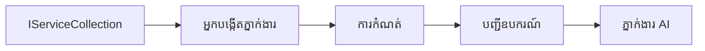

# 🎨 លំនាំរចនា Agentic ជាមួយ GitHub Models (.NET)

## 📋 គោលបំណងសិក្សា

ឧទាហរណ៍នេះបង្ហាញពីលំនាំរចនាតាមស្តង់ដារសម្រាប់សហគ្រាស (enterprise-grade) ដើម្បីសង់អេហ្សិនឆ្លាតដោយប្រើ Microsoft Agent Framework នៅក្នុង .NET ជាមួយការរួមបញ្ចូល GitHub Models។ អ្នកនឹងរៀនលំនាំវិជ្ជាជីវៈ និងវិធីសាស្រ្តស្ថាបត្យកម្មដែលធ្វើឱ្យអេហ្សិនមានស្រាប់សម្រាប់ផលិតកម្ម, ងាយសំរាប់ថែទាំ និងអាចពង្រីកបាន។

### លំនាំរចនាកម្រិតសហគ្រាស

- 🏭 **Factory Pattern**: ការបង្កើតអេហ្សិនដែលបានស្តង់ដារជាមួយការបញ្ចូលអាស្រ័យភាព
- 🔧 **Builder Pattern**: ការកំណត់ និងរៀបចំអេហ្សិនដោយរលូន
- 🧵 **Thread-Safe Patterns**: ការគ្រប់គ្រងការសន្ទនាដែលអាចធ្វើជាមួយច្រើនច្រកយ៉ាងសុវត្ថិភាព
- 📋 **Repository Pattern**: ការរៀបចំឧបករណ៍ និងសមត្ថភាពអោយមានរបៀប

## 🎯 អត្ថប្រយោជន៍ស្ថាបត្យកម្មពិសេសសម្រាប់ .NET

### លក្ខណៈសម្រាប់សហគ្រាស

- **Strong Typing**: ការផ្ទៀងផ្ទាត់ពេលក compiling និងគាំទ្រ IntelliSense
- **Dependency Injection**: ការរួមបញ្ចូលជាមួយធុង DI ដែលមានស្រាប់
- **Configuration Management**: ការគ្រប់គ្រងការ​កំណត់ដោយប្រើ IConfiguration និង Options patterns
- **Async/Await**: ការគាំទ្រកម្មវិធីអស៊ីនខាងមុខ

### លំនាំដែលរួចរាល់សម្រាប់ដាក់ប្រើប្រាស់

- **Logging Integration**: ការរួមបញ្ចូល ILogger និងការចុចប្លុកកំណត់ហេតុទ្រង់ទ្រាយ
- **Health Checks**: ការត្រួតពិនិត្យសុខភាព និងឧបករណ៍វាយតម្លៃដែលមានស្រាប់
- **Configuration Validation**: ការត្រួតពិនិត្យការកំណត់ជាការកំណត់ប្រភេទខ្លាំង និងនិយមន័យទិន្នន័យ
- **Error Handling**: ការគ្រប់គ្រងករណីកម្រិតកំហុសជាស្ថាបត្យកម្ម

## 🔧 ស្ថាបត្យកម្មបច្ចេកទេស

### ធាតុស្នូល .NET

- **Microsoft.Extensions.AI**: ការព្រមានសេវាកម្ម AI ជាផ្នែកមួយ
- **Microsoft.Agents.AI**: ស៊ុមអាជីពសម្រាប់ចាត់ចែងអេហ្សិនក្នុងសហគ្រាស
- **GitHub Models Integration**: លំនាំអតិភាពក្រោមការប្រើប្រាស់ API client ដែលមានប្រសិទ្ធភាពខ្ពស់
- **Configuration System**: appsettings.json and environment integration

### ការអនុវត្តលំនាំរចនា


## 🏗️ លំនាំរចនាដែលបង្ហាញ

### 1. **Creational Patterns**

- **Agent Factory**: ការបង្កើតអេហ្សិនកណ្តាលដែលមានការកំណត់ឯកភាព
- **Builder Pattern**: API រាងរលូនសម្រាប់កំណត់ការរៀបចំអេហ្សិនស្មុគស្មាញ
- **Singleton Pattern**: ការចែករំលែកធនធាន និងការគ្រប់គ្រងការកំណត់
- **Dependency Injection**: ការតភ្ជាប់ទាប និងងាយសម្រាប់ធ្វើតេស្ត

### 2. **Behavioral Patterns**

- **Strategy Pattern**: ការប្រតិបត្តិឧបករណ៍ដែលអាចចែកប្ដូរបាន
- **Command Pattern**: អនុបដិចប្រតិបត្តិការអេហ្សិនដែលបណ្តូលទាំង undo/redo
- **Observer Pattern**: ការគ្រប់គ្រងលីហ្វស្តាយដែលបើកដោយព្រឹត្តិការណ៍
- **Template Method**: វីធីសាស្រ្តការត្រួតបញ្ជារអនុវត្តភាពអេហ្សិនដែលបានស្តង់ដារ

### 3. **Structural Patterns**

- **Adapter Pattern**: ស្រទាប់រួមបញ្ចូល API GitHub Models
- **Decorator Pattern**: ការកែលម្អសមត្ថភាពអេហ្សិន
- **Facade Pattern**: មុខងារទំនាក់ទំនងសាមញ្ញសម្រាប់អេហ្សិន
- **Proxy Pattern**: ការលោតចូលយឺត និង caching សម្រាប់ប្រសិទ្ធភាព

## 📚 គោលការណ៍រចនារបស់ .NET

### គោលការណ៍ SOLID

- **Single Responsibility**: គ្រប់គ្រឿងបន្លាស់មានបេសកកម្មមួយច្បាស់លាស់
- **Open/Closed**: អាចពង្រីកបានដោយមិនបាច់កែប្រែ
- **Liskov Substitution**: ការអនុវត្តឧបករណ៍ដោយផ្អែកលើអ៊ីផេស
- **Interface Segregation**: អ៊ីផេសផ្តោតខ្លឹមសារ និងសម្ងាត់
- **Dependency Inversion**: អាស្រ័យលើអាណាចក្រ មិនមែនលើរបស់ពិត

### ស្ថាបត្យកម្មស្អាត

- **Domain Layer**: ស្នូលអេហ្សិន និងការអភិវឌ្ឍឧបករណ៍
- **Application Layer**: ការត្រួតចាត់អេហ្សិន និង workflow
- **Infrastructure Layer**: ការរួមបញ្ចូល GitHub Models និងសេវាកម្មខាងក្រៅ
- **Presentation Layer**: ការទំនាក់ទំនងអ្នកប្រើ និងទ្រង់ទ្រាយចម្លើយ

## 🔒 ការពិចារណាសម្រាប់សហគ្រាស

### សុវត្ថិភាព

- **Credential Management**: ការគ្រប់គ្រងកូនសោ API ដោយសុវត្ថិភាពជាមួយ IConfiguration
- **Input Validation**: ការត្រួតពិនិត្យទិន្នន័យបញ្ចូលដោយប្រភេទខ្លាំង និង annotation
- **Output Sanitization**: ការកំណត់សុវត្ថិភាពក្នុងដំណើរការចម្លើយ និងចម្រាញ់
- **Audit Logging**: ការតាមដានប្រតិបត្តិការ​យ៉ាងទូលំទូលាយ

### ប្រសិទ្ធភាព

- **Async Patterns**: ប្រតិបត្តិការ I/O មិនបញ្ឈប់
- **Connection Pooling**: ការគ្រប់គ្រង HTTP client យ៉ាងមានប្រសិទ្ធភាព
- **Caching**: ការខេកចម្លើយសម្រាប់បង្កើនប្រសិទ្ធភាព
- **Resource Management**: ការដោះស្រាយ និងសម្អាតធនធានបានត្រឹមត្រូវ

### សមត្ថភាពពង្រីក

- **Thread Safety**: ការគាំទ្រការប្រតិបត្តិអេហ្សិនជាមួយច្រើនធ្នាក់
- **Resource Pooling**: ការប្រើប្រាស់ធនធានយ៉ាងមានប្រសិទ្ធភាព
- **Load Management**: ការគ្រប់គ្រងអត្រា និងការទប់ស្កាត់ទម្ងន់ក្រោយ
- **Monitoring**: វិមាត្រ ប្រសិទ្ធភាព និងការត្រួតពិនិត្យសុខភាព

## 🚀 ការដាក់ចេញសម្រាប់ផលិតកម្ម

- **Configuration Management**: ការកំណត់តាមបរិយាកាសជាក់លាក់
- **Logging Strategy**: ការចុះកំណត់ហេតុទ្រង់ទ្រាយជាមួយ correlation IDs
- **Error Handling**: ការគ្រប់គ្រងករណីកំហុសជាសកលដោយមានដំណោះស្រាយត្រឹមត្រូវ
- **Monitoring**: Application insights និង counters ប្រសិទ្ធភាព
- **Testing**: ការធ្វើ unit tests, integration tests, និងលំនាំ load testing

តើមានការរៀបចំដើម្បីសាងសង់អេហ្សិនឆ្លាតដែលមានគុណភាពសម្រាប់សហគ្រាសជាមួយ .NET ដែរឬទេ? មករចនា​អ្វីដែលរឹងមាំ​មួយ​មុន! 🏢✨

## 🚀 ចាប់ផ្តើម

### លក្ខខណ្ឌដែលត្រូវមាន

- [.NET 10 SDK](https://dotnet.microsoft.com/download/dotnet/10.0) ឬខ្ពស់ជាងនេះ
- [GitHub Models API access token](https://docs.github.com/github-models/github-models-at-scale/using-your-own-api-keys-in-github-models)

### អថេរបរិស្ថានដែលត្រូវការ

```bash
# zsh/bash
export GH_TOKEN=<your_github_token>
export GH_ENDPOINT=https://models.github.ai/inference
export GH_MODEL_ID=openai/gpt-5-mini
```

```powershell
# PowerShell
$env:GH_TOKEN = "<your_github_token>"
$env:GH_ENDPOINT = "https://models.github.ai/inference"
$env:GH_MODEL_ID = "openai/gpt-5-mini"
```

### កូដឧទាហរណ៍

ដើម្បីរត់ឧទាហរណ៍កូដ,

```bash
# zsh/bash
chmod +x ./03-dotnet-agent-framework.cs
./03-dotnet-agent-framework.cs
```

ឬប្រើ dotnet CLI:

```bash
dotnet run ./03-dotnet-agent-framework.cs
```

មើល [`03-dotnet-agent-framework.cs`](../../../../03-agentic-design-patterns/code_samples/03-dotnet-agent-framework.cs) សម្រាប់កូដពេញលេញ។

```csharp
#!/usr/bin/dotnet run

#:package Microsoft.Extensions.AI@10.*
#:package Microsoft.Agents.AI.OpenAI@1.*-*

using System.ClientModel;
using System.ComponentModel;

using Microsoft.Agents.AI;
using Microsoft.Extensions.AI;

using OpenAI;

// Tool Function: Random Destination Generator
// This static method will be available to the agent as a callable tool
// The [Description] attribute helps the AI understand when to use this function
// This demonstrates how to create custom tools for AI agents
[Description("Provides a random vacation destination.")]
static string GetRandomDestination()
{
    // List of popular vacation destinations around the world
    // The agent will randomly select from these options
    var destinations = new List<string>
    {
        "Paris, France",
        "Tokyo, Japan",
        "New York City, USA",
        "Sydney, Australia",
        "Rome, Italy",
        "Barcelona, Spain",
        "Cape Town, South Africa",
        "Rio de Janeiro, Brazil",
        "Bangkok, Thailand",
        "Vancouver, Canada"
    };

    // Generate random index and return selected destination
    // Uses System.Random for simple random selection
    var random = new Random();
    int index = random.Next(destinations.Count);
    return destinations[index];
}

// Extract configuration from environment variables
// Retrieve the GitHub Models API endpoint, defaults to https://models.github.ai/inference if not specified
// Retrieve the model ID, defaults to openai/gpt-5-mini if not specified
// Retrieve the GitHub token for authentication, throws exception if not specified
var github_endpoint = Environment.GetEnvironmentVariable("GH_ENDPOINT") ?? "https://models.github.ai/inference";
var github_model_id = Environment.GetEnvironmentVariable("GH_MODEL_ID") ?? "openai/gpt-5-mini";
var github_token = Environment.GetEnvironmentVariable("GH_TOKEN") ?? throw new InvalidOperationException("GH_TOKEN is not set.");

// Configure OpenAI Client Options
// Create configuration options to point to GitHub Models endpoint
// This redirects OpenAI client calls to GitHub's model inference service
var openAIOptions = new OpenAIClientOptions()
{
    Endpoint = new Uri(github_endpoint)
};

// Initialize OpenAI Client with GitHub Models Configuration
// Create OpenAI client using GitHub token for authentication
// Configure it to use GitHub Models endpoint instead of OpenAI directly
var openAIClient = new OpenAIClient(new ApiKeyCredential(github_token), openAIOptions);

// Define Agent Identity and Comprehensive Instructions
// Agent name for identification and logging purposes
var AGENT_NAME = "TravelAgent";

// Detailed instructions that define the agent's personality, capabilities, and behavior
// This system prompt shapes how the agent responds and interacts with users
var AGENT_INSTRUCTIONS = """
You are a helpful AI Agent that can help plan vacations for customers.

Important: When users specify a destination, always plan for that location. Only suggest random destinations when the user hasn't specified a preference.

When the conversation begins, introduce yourself with this message:
"Hello! I'm your TravelAgent assistant. I can help plan vacations and suggest interesting destinations for you. Here are some things you can ask me:
1. Plan a day trip to a specific location
2. Suggest a random vacation destination
3. Find destinations with specific features (beaches, mountains, historical sites, etc.)
4. Plan an alternative trip if you don't like my first suggestion

What kind of trip would you like me to help you plan today?"

Always prioritize user preferences. If they mention a specific destination like "Bali" or "Paris," focus your planning on that location rather than suggesting alternatives.
""";

// Create AI Agent with Advanced Travel Planning Capabilities
// Initialize complete agent pipeline: OpenAI client → Chat client → AI agent
// Configure agent with name, detailed instructions, and available tools
// This demonstrates the .NET agent creation pattern with full configuration
AIAgent agent = openAIClient
    .GetChatClient(github_model_id)
    .CreateAIAgent(
        name: AGENT_NAME,
        instructions: AGENT_INSTRUCTIONS,
        tools: [AIFunctionFactory.Create(GetRandomDestination)]
    );

// Create New Conversation Thread for Context Management
// Initialize a new conversation thread to maintain context across multiple interactions
// Threads enable the agent to remember previous exchanges and maintain conversational state
// This is essential for multi-turn conversations and contextual understanding
AgentThread thread = agent.GetNewThread();

// Execute Agent: First Travel Planning Request
// Run the agent with an initial request that will likely trigger the random destination tool
// The agent will analyze the request, use the GetRandomDestination tool, and create an itinerary
// Using the thread parameter maintains conversation context for subsequent interactions
await foreach (var update in agent.RunStreamingAsync("Plan me a day trip", thread))
{
    await Task.Delay(10);
    Console.Write(update);
}

Console.WriteLine();

// Execute Agent: Follow-up Request with Context Awareness
// Demonstrate contextual conversation by referencing the previous response
// The agent remembers the previous destination suggestion and will provide an alternative
// This showcases the power of conversation threads and contextual understanding in .NET agents
await foreach (var update in agent.RunStreamingAsync("I don't like that destination. Plan me another vacation.", thread))
{
    await Task.Delay(10);
    Console.Write(update);
}
```

---

<!-- CO-OP TRANSLATOR DISCLAIMER START -->
**Disclaimer**:
ឯកសារនេះត្រូវបានបកប្រែដោយប្រើសេវាកម្មបកប្រែ AI [Co-op Translator](https://github.com/Azure/co-op-translator). ខណៈពេលដែលយើងខិតខំឲ្យមានភាពត្រឹមត្រូវ សូមជ្រាបថាការបកប្រែដោយស្វ័យប្រវត្តិអាចមានកំហុស ឬភាពមិនត្រឹមត្រូវ។ ឯកសារដើមដែលសរសេរជាភាសាមូលដ្ឋាន​គួរត្រូវបានគេចាត់ទុកថាជាប្រភពផ្លូវការដើម។ សម្រាប់ព័ត៌មានសំខាន់ៗ យើងណែនាំឱ្យប្រើការបកប្រែដោយអ្នកប្រែមនុស្សដែលមានវិជ្ជាជីវៈ។ យើងមិនទទួលខុសត្រូវចំពោះការយល់ច្រឡំ ឬការបកស្រាយខុសណាមួយ ដែលកើតឡើងពីការប្រើប្រាស់ការបកប្រែនេះទេ។
<!-- CO-OP TRANSLATOR DISCLAIMER END -->