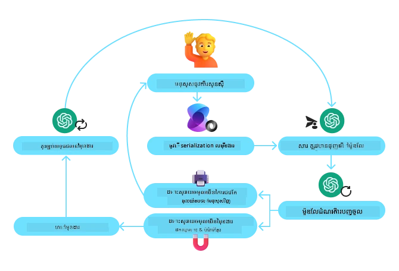
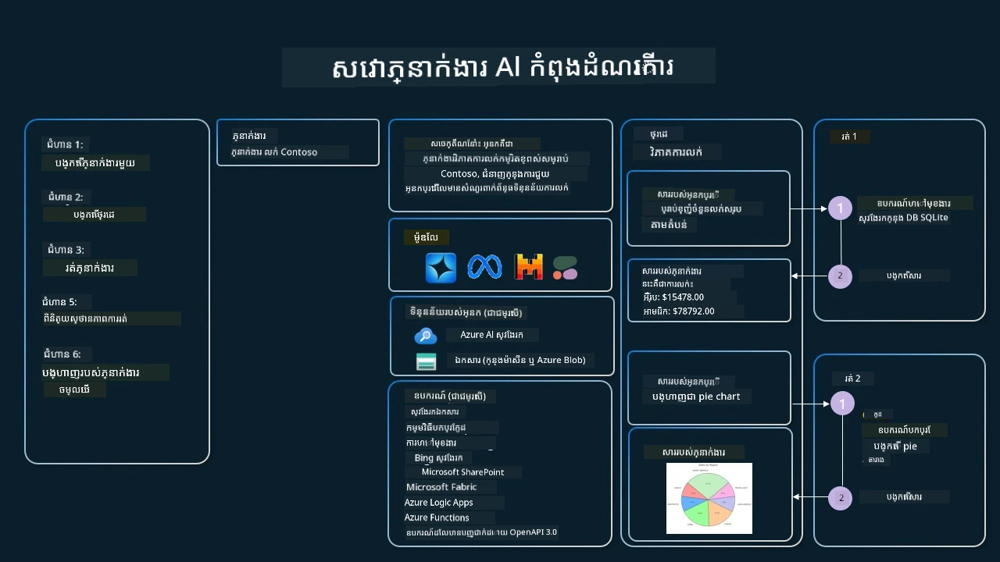

[](https://youtu.be/vieRiPRx-gI?si=cEZ8ApnT6Sus9rhn)

> _(ចុចលើរូបភាពខាងលើដើម្បីមើលវីដេអូសម័យនេះ)_

# លំនាំរចនាសម្រាប់ការប្រើឧបករណ៍

ឧបករណ៍គឺគួរឲ្យចាប់អារម្មណ៍ព្រោះវាអនុញ្ញាតឲ្យអ្នកតំណាង AI មានសមត្ថភាពធំទូលាយជាងមុន។ ផ្ទុយពីនរណាម្នាក់មានសកម្មភាពកំណត់ដែលអាចអនុវត្តបាន ពីការបញ្ចូលឧបករណ៍មួយ អ្នកតំណាងអាចអនុវត្តសកម្មភាពជាច្រើនបន្ថែមទៀត។ ក្នុងជំពូកនេះ ខ្ញុំនឹងពិភាក្សាពី លំនាំរចនាសម្រាប់ការប្រើឧបករណ៍ ដែលពណ៌នាថាអ្នកតំណាង AI អាចប្រើឧបករណ៍ជាក់លាក់ដើម្បីសម្រេចគោលបំណងរបស់ពួកគេយ៉ាងដូចម្តេច។

## ការណែនាំ

ក្នុងមេរៀននេះ យើងកំពុងស្វែងរកចម្លើយចំពោះសំណួរដូចខាងក្រោម៖

- លំនាំរចនាសម្រាប់ការប្រើឧបករណ៍គឺជាអ្វី?
- តើវាអាចប្រើទៅលើករណីអ្វីខ្លះ?
- តើធាតុ/ប្លុកសាងសង់អ្វីខ្លះដែលត្រូវការ ដើម្បីអនុវត្តលំនាំរចនានេះ?
- តើត្រូវបញ្ចាក់អ្វីខ្លះ ដើម្បីធានាអ្នកតំណាង AI មានភាពជឿជាក់ ពេលប្រើលំនាំរចនាសម្រាប់ការប្រើឧបករណ៍នេះ?

## គោលបំណងសិក្សា

បន្ទាប់ពីបញ្ចប់មេរៀននេះ អ្នកនឹងអាច៖

- កំណត់ន័យលំនាំរចនាសម្រាប់ការប្រើឧបករណ៍ និងគោលបំណងរបស់វា។
- សម្គាល់ករណីប្រើ ដែលលំនាំរចនានេះអាចអនុវត្តបាន។
- យល់ដឹងអំពីធាតុសំខាន់ៗដែលត្រូវការអនុវត្តលំនាំរចនា។
- រាប់កត់ចំណាំមុខងារសម្រាប់ធានា ភាពជឿជាក់ក្នុងអ្នកតំណាង AI ដែលប្រើលំនាំរចនានេះ។

## លំនាំរចនាសម្រាប់ការប្រើឧបករណ៍គឺជាអ្វី?

**លំនាំរចនាសម្រាប់ការប្រើឧបករណ៍** ផ្តោតលើការផ្ដល់សមត្ថភាពដល់ LLMs ត្រូវអនុវត្តន៍ជាមួយឧបករណ៍ខាងក្រៅ ដើម្បីសម្រេចគោលបំណងជាក់លាក់។ ឧបករណ៍គឺជាកូដដែលអាចអនុវត្តដោយអ្នកតំណាង ដើម្បីអនុវត្តសកម្មភាពមួយ។ ឧបករណ៍អាចជាអនុគមន៍សាមញ្ញ ដូចជាគណនាការណ៍ មួយឬក៏ជាការហៅ API ទៅកាន់សេវាកម្មភាគីទីបី ដូចជាការស្វែងរកតម្លៃហ៊ុន ឬការព្យាករណ៍អាកាសធាតុ។ ក្នុងបរិបទអ្នកតំណាង AI ឧបករណ៍ត្រូវបានរចនាឡើង ដើម្បីអនុវត្តដោយអ្នកតំណាង ជាចម្លើយតាមការហៅអនុគមន៍ដែលបង្កើតដោយម៉ូដែល។

## តើវាអាចប្រើទៅលើករណីអ្វីខ្លះ?

អ្នកតំណាង AI អាចប្រើឧបករណ៍ ដើម្បីបញ្ចប់ភារកិច្ចស្មុគស្មាញ យកព័ត៌មាន ឬសម្រេចចិត្ត។ លំនាំរចនាសម្រាប់ការប្រើឧបករណ៍ តែងតែប្រើនៅក្នុងស្ថានភាពដែលត្រូវការជជែកប្រតិកម្មមានលក្ខណៈឌីណាមិចជាមួយប្រព័ន្ធខាងក្រៅ ដូចជាឃ្លាំងទិន្នន័យ សេវាកម្មវេប ឬសំឡេងកូដ។ សមត្ថភាពនេះមានប្រយោជន៍សម្រាប់ករណីជាច្រើន រួមមាន៖

- **ការយកព័ត៌មានឌីណាមិច៖** អ្នកតំណាងអាចសួរព័ត៌មានពី API ឬគ្រប់គ្រងទិន្នន័យខាងក្រៅ ដើម្បីទទួលបានទិន្នន័យថ្មីៗ (ឧ. សួរថតទិន្នន័យ SQLite សម្រាប់ការវិភាគ ទទួលតម្លៃហ៊ុន ឬព័ត៌មានអាកាសធាតុ)។
- **ការរត់កូដ និងការបកស្រាយ៖** អ្នកតំណាងអាចរត់កូដ ឬស្គ្រីបដើម្បីដោះស្រាយបញ្ហាគណិតវិទ្យា បង្កើតរបាយការណ៍ ឬធ្វើលំហូរប៉ារ៉ាម៉ែត្រ។
- **អូតូម៉ាស្យុងដំណើរការងារ៖** អូតូម៉ាស្យុងកិច្ចការកើតឡើងជាប់ៗ មួយចំនួន ឬមានជំហានច្រើន ដោយភ្ជាប់ឧបករណ៍ដូចជា កម្មវិធីកំណត់ពេលវេលា សេវាអ៊ីមែល ឬបណ្ដាញដំណើរការទិន្នន័យ។
- **គាំទ្រអតិថិជន៖** អ្នកតំណាងអាចប្រតិកម្មជាមួយប្រព័ន្ធ CRM យោងកាតិការ ឬមូលដ្ឋានចំណេះដឹង ដើម្បីដោះស្រាយសំណួររបស់អ្នកប្រើ។
- **ការបង្កើតខ្លឹមសារ និងកែសម្រួល៖** អ្នកតំណាងអាចប្រើឧបករណ៍ដូចជា ពិនិត្យវេយ្យាករណ៍ សង្ខេបអត្ថបទ ឬវាយតម្លៃសុវត្ថិភាពខ្លឹមសារ ដើម្បីជួយក្នុងភារកិច្ចបង្កើតខ្លឹមសារ។

## តើធាតុ/ប្លុកសាងសង់អ្វីខ្លះដែលត្រូវការ ដើម្បីអនុវត្តលំនាំរចនាសម្រាប់ការប្រើឧបករណ៍?

ប្លុកសាងសង់ទាំងនេះអនុញ្ញាតឲ្យអ្នកតំណាង AI អនុវត្តភារកិច្ចជាច្រើន។ សូមមើលធាតុសំខាន់ៗដែលត្រូវការក្នុងការអនុវត្តលំនាំរចនាសម្រាប់ការប្រើឧបករណ៍៖

- **រាងរូបមន្ត/ទ្រង់ទ្រាយឧបករណ៍**: ការបកស្រាយលម្អិតអំពីឧបករណ៍ដែលមាន សុទ្ធតែក្នុងឈ្មោះអនុគមន៍ គោលបំណង ប៉ារ៉ា​ម៉ែ​ត្រដែលចាំបាច់ និងលទ្ធផលដែលរំពឹងទុក។ រាងនេះអនុញ្ញាតឲ្យ LLM យល់ថាឧបករណ៍អ្វីមាន និងរបៀបស្នើរសុំបានត្រឹមត្រូវ។

- **លógicasអនុវត្តលើអនុគមន៍**: គ្រប់គ្រងរបៀបហៅឧបករណ៍នៅពេលណា តាមចេតនារបស់អ្នកប្រើ និងបរិបទការសន្ទនា។ វាអាចរួមមានម៉ូឌុលផែនការ មុខងារបញ្ជូន ឬលំហូរជាមួយលក្ខខណ្ឌ ដើម្បីកំណត់ការប្រើឧបករណ៍ជាឌីណាមិច។

- **ប្រព័ន្ធគ្រប់គ្រងសារ**: សមាសភាគដែលគ្រប់គ្រងលំហូរសន្ទនា រវាងការបញ្ចូលពីអ្នកប្រើ ប្រត្តិកម្ម LLM ការហៅឧបករណ៍ និងលទ្ធផលឧបករណ៍។

- **ស៊ុមរចនាសម្ព័ន្ធភ្ជាប់ឧបករណ៍**: ផ្ដល់ការតភ្ជាប់អ្នកតំណាងទៅឧបករណ៍ផ្សេងៗ មិនថាតែជាអនុគមន៍សាមញ្ញ ឬសេវាកម្មខាងក្រៅស្មុគស្មាញ។

- **ការដោះស្រាយកម្ហូបកំហុស និងការផ្ទៀងផ្ទាត់**: មេកានិចក្នុងការដោះស្រាយកំហុសពេលអនុវត្តឧបករណ៍ ពិនិត្យប៉ារ៉ាម៉ែត្រ និងគ្រប់គ្រងចម្លើយមិនរំពឹងទុក។

- **ការគ្រប់គ្រងស្ថានភាព**: តាមដានបរិបទសន្ទនា បទពិសោធន៍ហៅឧបករណ៍រួចមក និងទិន្នន័យបន្តិចបន្តួច ដើម្បីធានាការសម្របសម្រួលក្នុងការប្រាស្រ័យជាមួយអ្នកតំណាងច្រើនជំហាន។

បន្ទាប់មក យើងនឹងមើលលំអិតពីការហៅអនុគមន៍/ឧបករណ៍។

### ការហៅអនុគមន៍/ឧបករណ៍

ការហៅអនុគមន៍គឺជាវិធីសំខាន់សម្រាប់អនុញ្ញាតម៉ូដែលភាសាធំ (LLMs) ធ្វើប្រតិកម្មជាមួយឧបករណ៍។ អ្នកនឹងឃើញពាក្យ 'អនុគមន៍' និង 'ឧបករណ៍' ត្រូវបានប្រើដើម្បីសម្រួលគ្នា ព្រោះ 'អនុគមន៍' (ប្លុកកូដដែលអាចប្រើឡើងវិញបាន) គឺជា 'ឧបករណ៍' ដែលអ្នកតំណាងប្រើដើម្បីអនុវត្តភារកិច្ច។ ដើម្បីអនុវត្តកូដអនុគមន៍ ម៉ូដែលត្រូវតែប្រៀបធៀបសំណើររបស់អ្នកប្រើជាមួយការពិពណ៌នាអនុគមន៍។ ដើម្បីធ្វើនេះ អ្នកផ្ដល់рរាងម្លេងមួយដែលមានការបរិយាយអនុគមន៍ទាំងអស់ទៅកាន់ LLM។ LLM នឹងជ្រើសរើសអនុគមន៍ដែលសមរម្យបំផុតសម្រាប់ភារកិច្ច ហើយត្រឡប់ឈ្មោះនិងប៉ារ៉ាម៉ែត្ររបស់វា។ អនុគមន៍ដែលបានជ្រើសរើសនឹងត្រូវហៅ ដោយផ្ញើចម្លើយទៅ LLM ដែលប្រើព័ត៌មាននោះ សម្រាប់ឆ្លើយតបទៅសំណើរអ្នកប្រើ។

សម្រាប់អ្នកអភិវឌ្ឍន៍ ដើម្បីអនុវត្តការហៅអនុគមន៍សម្រាប់អ្នកតំណាង អ្នកត្រូវការម៉ូឌែល LLM ដែលគាំទ្រការហៅអនុគមន៍ ស៊ុមរចនាសម្ព័ន្ធដែលមានការពិពណ៌នាអនុគមន៍ និងកូដសម្រាប់អនុគមន៍នីមួយៗ។

យើងនឹងប្រើឧទាហរណ៍នៅចំណុចយកម៉ោងបច្ចុប្បន្ននៅទីក្រុងមួយ ដើម្បីបង្ហាញ៖

1. **បង្កើតម៉ូឌែល LLM ដែលគាំទ្រការហៅអនុគមន៍៖**

    ម៉ូដែលទាំងអស់មិនគាំទ្រការហៅអនុគមន៍ទេ ដូច្នេះការត្រួតពិនិត្យយ៉ាងម៉ត់ចត់ថា LLM ដែលអ្នកប្រើ គាំទ្រឬអត់គឺសំខាន់។ <a href="https://learn.microsoft.com/azure/ai-services/openai/how-to/function-calling" target="_blank">Azure OpenAI</a> គាំទ្រការហៅអនុគមន៍។ យើងអាចចាប់ផ្តើមដោយបង្កើតអតិថិជន Azure OpenAI។

    ```python
    # ចាប់ផ្តើមម៉ាស៊ីនភ្ញៀវ Azure OpenAI
    client = AzureOpenAI(
        azure_endpoint = os.getenv("AZURE_AI_PROJECT_ENDPOINT"), 
        api_key=os.getenv("AZURE_OPENAI_API_KEY"),  
        api_version="2024-05-01-preview"
    )
    ```

1. **បង្កើតស៊ុមរចនាសម្ព័ន្ធអនុគមន៍៖**

    បន្ទាប់ យើងនឹងកំណត់ស៊ុម JSON ដែលមានឈ្មោះអនុគមន៍ ការពិពណ៌នាអំពីអ្វីដែលអនុគមន៍ធ្វើ និងឈ្មោះនិងការពិពណ៌នាអំពីប៉ារ៉ាម៉ែត្រ។
    បន្ទាប់មកយើងនឹងផ្ញើស៊ុមនេះទៅអតិថិជនដែលបានបង្កើត ហើយភ្ជាប់ជាមួយសំណើរអ្នកប្រើ ដើម្បីរកម៉ោងនៅសាន់ហ្វ្រានស៊ីស្គូ។ អ្វីដែលត្រូវចំណាំគឺ **ការហៅឧបករណ៍** គឺជាអ្វីដែលត្រូវបានត្រឡប់មកវា មិនមែនចម្លើយចុងក្រោយដូចសំណួរនោះទេ។ ជារឿយៗ LLM ត្រឡប់ឈ្មោះអនុគមន៍ដែលរៀបចំសម្រាប់ភារកិច្ច និងប៉ារ៉ាម៉ែត្រ​ដែលនឹងផ្ញើទៅវា។

    ```python
    # ការពិពណ៌នាអំពីមុខងារសម្រាប់គំរូក្នុងការអាន
    tools = [
        {
            "type": "function",
            "function": {
                "name": "get_current_time",
                "description": "Get the current time in a given location",
                "parameters": {
                    "type": "object",
                    "properties": {
                        "location": {
                            "type": "string",
                            "description": "The city name, e.g. San Francisco",
                        },
                    },
                    "required": ["location"],
                },
            }
        }
    ]
    ```
   
    ```python
  
    # ពីរសារដំបូងរបស់អ្នកប្រើ
    messages = [{"role": "user", "content": "What's the current time in San Francisco"}] 
  
    # ការហៅ API ដំបូង: សុំឲ្យម៉ូដែលប្រើមុខងារ
      response = client.chat.completions.create(
          model=deployment_name,
          messages=messages,
          tools=tools,
          tool_choice="auto",
      )
  
      # ដំណើរការឆ្លើយតបរបស់ម៉ូដែល
      response_message = response.choices[0].message
      messages.append(response_message)
  
      print("Model's response:")  

      print(response_message)
  
    ```

    ```bash
    Model's response:
    ChatCompletionMessage(content=None, role='assistant', function_call=None, tool_calls=[ChatCompletionMessageToolCall(id='call_pOsKdUlqvdyttYB67MOj434b', function=Function(arguments='{"location":"San Francisco"}', name='get_current_time'), type='function')])
    ```
  
1. **កូដអនុគមន៍ដែលចាំបាច់សម្រាប់អនុវត្តភារកិច្ច៖**

    ឥឡូវនេះដែល LLM បានជ្រើសរើសអនុគមន៍ ត្រូវអនុវត្ត និងរត់កូដនោះ។
    យើងអាចអនុវត្តកូដដើម្បីយកម៉ោងបច្ចុប្បន្នក្នុង Python។ យើងមិនភ្លេចសរសេរកូដដើម្បីដកឈ្មោះ និងប៉ារ៉ាម៉ែត្រពី response_message ដើម្បីទទួលបានលទ្ធផលចុងក្រោយ។

    ```python
      def get_current_time(location):
        """Get the current time for a given location"""
        print(f"get_current_time called with location: {location}")  
        location_lower = location.lower()
        
        for key, timezone in TIMEZONE_DATA.items():
            if key in location_lower:
                print(f"Timezone found for {key}")  
                current_time = datetime.now(ZoneInfo(timezone)).strftime("%I:%M %p")
                return json.dumps({
                    "location": location,
                    "current_time": current_time
                })
      
        print(f"No timezone data found for {location_lower}")  
        return json.dumps({"location": location, "current_time": "unknown"})
    ```

     ```python
     # ដោះស្រាយការហៅមុខងារ
      if response_message.tool_calls:
          for tool_call in response_message.tool_calls:
              if tool_call.function.name == "get_current_time":
     
                  function_args = json.loads(tool_call.function.arguments)
     
                  time_response = get_current_time(
                      location=function_args.get("location")
                  )
     
                  messages.append({
                      "tool_call_id": tool_call.id,
                      "role": "tool",
                      "name": "get_current_time",
                      "content": time_response,
                  })
      else:
          print("No tool calls were made by the model.")  
  
      # ការហៅ API ទីពីរ៖ ទទួលបានចម្លើយចុងក្រោយពីម៉ូឌែល
      final_response = client.chat.completions.create(
          model=deployment_name,
          messages=messages,
      )
  
      return final_response.choices[0].message.content
     ```

     ```bash
      get_current_time called with location: San Francisco
      Timezone found for san francisco
      The current time in San Francisco is 09:24 AM.
     ```

ការហៅអនុគមន៍គឺជាមូលដ្ឋានសំខាន់នៃលំនាំរចនាសម្រាប់ការប្រើឧបករណ៍ ហើយការអនុវត្តជាចាប់ផ្តើមពីសូន្យអាចមានភាពពិបាកខ្លះ។
ដូចដែលយើងបានរៀននៅក្នុង [មេរៀនទី 2](../../../02-explore-agentic-frameworks) ស៊ុមរចនាអ្នកតំណាងត្រូវបានផ្ដល់ដោយភាគរយភាគល្អ សម្រាប់អនុវត្តការប្រើឧបករណ៍។

## ឧទាហរណ៍ការប្រើឧបករណ៍ជាមួយស៊ុមរចនាអ្នកតំណាង

នេះជាឧទាហរណ៍នៃវិធីដែលអ្នកអាចអនុវត្តលំនាំរចនាសម្រាប់ការប្រើឧបករណ៍ ប្រើស៊ុមរចនាអ្នកតំណាងខុសៗគ្នា៖

### ស៊ុមរចនាអ្នកតំណាង Microsoft

<a href="https://learn.microsoft.com/azure/ai-services/agents/overview" target="_blank">ស៊ុមរចនាអ្នកតំណាង Microsoft</a> គឺជាស៊ុម AI មួយដែលចេញផ្សាយជាឯកសារមួយសម្រាប់បង្កើតអ្នកតំណាង AI។ វាធ្វើឲ្យការប្រើការហៅអនុគមន៍កាន់តែងាយស្រួល ដោយអនុញ្ញាតឲ្យអ្នកកំណត់ឧបករណ៍ជាអនុគមន៍ Python ដែលមាន `@tool` decorator។ ស៊ុមនេះគ្រប់គ្រងការទំនាក់ទំនងមកវិញទៅមក រវាងម៉ូដែល និងកូដរបស់អ្នក។ វាក៏ផ្ដល់ការចូលដំណើរការទៅឧបករណ៍ត្រៀមរួចដូចជា ការស្វែងរកឯកសារ និង Code Interpreter តាមរយៈ `AzureAIProjectAgentProvider`។

រូបភាពខាងក្រោមបង្ហាញដំណើរការការហៅអនុគមន៍ជាមួយ ស៊ុមរចនាអ្នកតំណាង Microsoft៖



នៅក្នុង ស៊ុមរចនាអ្នកតំណាង Microsoft ឧបករណ៍ត្រូវបានកំណត់ជាអនុគមន៍ដែលត្រូវរ៉ូបោយ។ យើងអាចបម្លែងអនុគមន៍ `get_current_time` ដែលយើងបានឃើញកាលពីមុន ទៅជាឧបករណ៍មួយ ដោយប្រើ `@tool` decorator។ ស៊ុមនេះនឹងធ្វើយុទ្ធនាការការបញ្ចូលអនុគមន៍ និងប៉ារ៉ាម៉ែត្ររបស់វា សំរាប់បង្កើតស៊ុមបញ្ជូនទៅ LLM។

```python
from agent_framework import tool
from agent_framework.azure import AzureAIProjectAgentProvider
from azure.identity import AzureCliCredential

@tool
def get_current_time(location: str) -> str:
    """Get the current time for a given location"""
    ...

# បង្កើតអតិថិជន
provider = AzureAIProjectAgentProvider(credential=AzureCliCredential())

# បង្កើតភ្នាក់ងារ ហើយដំណើរការជាមួយ​ឧបករណ៍​
agent = await provider.create_agent(name="TimeAgent", instructions="Use available tools to answer questions.", tools=get_current_time)
response = await agent.run("What time is it?")
```
  
### សេវាអ្នកតំណាង AI Azure

<a href="https://learn.microsoft.com/azure/ai-services/agents/overview" target="_blank">សេវាអ្នកតំណាង AI Azure</a> គឺជាស៊ុមអ្នកតំណាងថ្មី ដែលរចនាឡើងសម្រាប់អភិវឌ្ឍន៍ អនុវត្ត និងពង្រីកអ្នកតំណាង AI ដែលសុវត្ថិភាពខ្ពស់ និងមានសមត្ថភាពពេញមួយ ប្រើប្រាស់ដោយមិនចាំបាច់គ្រប់គ្រងគណនេយ្យ និងធនធានផ្ទុកទិន្នន័យ។ វាមានប្រយោជន៍យ៉ាងខ្លាំងសម្រាប់កម្មវិធីអង្គភាពធំ ដោយសារជាសេវាដែលគ្រប់គ្រងសុវត្ថិភាពកម្រិតសហគ្រាស។

បើប្រៀបធៀបការអភិវឌ្ឍដោយប្រើ LLM API ត្រឹមត្រូវៗ សេវាអ្នកតំណាង AI Azure ផ្ដល់អត្ថប្រយោជន៍ខ្លះៗ រួមមាន៖

- ការហៅឧបករណ៍ស្វ័យប្រវត្តិ – មិនចាំបាច់បកស្រាយការហៅ ឧបករណ៍ ទម្លាក់ទៅហៅឧបករណ៍ និងគ្រប់គ្រងចម្លើយទេ ព្រមទាំងធ្វើនៅផ្នែកម៉ាស៊ីនបម្រើ។
- ទិន្នន័យគ្រប់គ្រងសុវត្ថិភាព – មិនចាំបាច់គ្រប់គ្រងស្ថានភាពសន្ទនា ដោយអាចពឹងផ្អែកលើ threads សម្រាប់ផ្ទុកព័ត៌មានទាំងអស់។
- ឧបករណ៍មានរួច – ឧបករណ៍ដែល អ្នកអាចប្រើ ដើម្បីធ្វើប្រតិកម្មជាមួយប្រភពទិន្នន័យ រួមមាន Bing, Azure AI Search, និង Azure Functions។

ឧបករណ៍ដែលមាននៅក្នុងសេវាអ្នកតំណាង AI Azure អាចចែកចូលជា២ប្រភេទ៖

1. ឧបករណ៍ចំណេះដឹង៖
    - <a href="https://learn.microsoft.com/azure/ai-services/agents/how-to/tools/bing-grounding?tabs=python&pivots=overview" target="_blank">ការតម្រឹមជាមួយ Bing Search</a>
    - <a href="https://learn.microsoft.com/azure/ai-services/agents/how-to/tools/file-search?tabs=python&pivots=overview" target="_blank">ការស្វែងរកឯកសារ</a>
    - <a href="https://learn.microsoft.com/azure/ai-services/agents/how-to/tools/azure-ai-search?tabs=azurecli%2Cpython&pivots=overview-azure-ai-search" target="_blank">Azure AI Search</a>

2. ឧបករណ៍សកម្មភាព៖
    - <a href="https://learn.microsoft.com/azure/ai-services/agents/how-to/tools/function-calling?tabs=python&pivots=overview" target="_blank">ការហៅអនុគមន៍</a>
    - <a href="https://learn.microsoft.com/azure/ai-services/agents/how-to/tools/code-interpreter?tabs=python&pivots=overview" target="_blank">Code Interpreter</a>
    - <a href="https://learn.microsoft.com/azure/ai-services/agents/how-to/tools/openapi-spec?tabs=python&pivots=overview" target="_blank">ឧបករណ៍កំណត់តាម OpenAPI</a>
    - <a href="https://learn.microsoft.com/azure/ai-services/agents/how-to/tools/azure-functions?pivots=overview" target="_blank">Azure Functions</a>

សេវាអ្នកតំណាងនេះអនុញ្ញាតឲ្យយើងប្រើឧបករណ៍ទាំងនេះជាសំណុំឧបករណ៍មួយ (`toolset`)។ វានឹងប្រើ `threads` ដែលតាមដានប្រវត្តិសារ ចាប់ពីការសន្ទនាផ្សេងៗ។

សូមស្រមៃថាអ្នកជាអ្នកតំណាងលក់នៅក្រុមហ៊ុន Contoso។ អ្នកចង់បង្កើតអ្នកតំណាងសន្ទនាដែលអាចឆ្លើយសំណួរអំពីទិន្នន័យលក់របស់អ្នក។

រូបភាពខាងក្រោមបង្ហាញពីរបៀបដែលអ្នកអាចប្រើសេវាអ្នកតំណាង AI Azure ដើម្បីវិភាគទិន្នន័យលក់របស់អ្នក៖



ដើម្បីប្រើឧបករណ៍ណាមួយជាមួយសេវា យើងអាចបង្កើតអតិថិជន ហើយកំណត់ឧបករណ៍ឬសំណុំឧបករណ៍។ ដើម្បីអនុវត្តន៍យ៉ាងជាក់លាក់ អ្នកអាចប្រើកូដ Python ខាងក្រោម។ LLM អាចមើលទៅសំណុំឧបករណ៍ ហើយសម្រេចចិត្តប្រើអនុគមន៍ដែលអ្នកប្រើបង្កើត `fetch_sales_data_using_sqlite_query` ឬ Code Interpreter ដែលត្រៀមរួច ភាគខ្លះអាស្រ័យលើសំណើអ្នកប្រើ។

```python 
import os
from azure.ai.projects import AIProjectClient
from azure.identity import DefaultAzureCredential
from fetch_sales_data_functions import fetch_sales_data_using_sqlite_query # អនុគមន៍ fetch_sales_data_using_sqlite_query ដែលអាចរកបាននៅក្នុងឯកសារ fetch_sales_data_functions.py។
from azure.ai.projects.models import ToolSet, FunctionTool, CodeInterpreterTool

project_client = AIProjectClient.from_connection_string(
    credential=DefaultAzureCredential(),
    conn_str=os.environ["PROJECT_CONNECTION_STRING"],
)

# ចាប់ផ្តើមកំណត់ឧបករណ៍
toolset = ToolSet()

# ចាប់ផ្តើមតំណាងហៅអនុគមន៍ជាមួយអនុគមន៍ fetch_sales_data_using_sqlite_query និងបញ្ចូលវាទៅឧបករណ៍
fetch_data_function = FunctionTool(fetch_sales_data_using_sqlite_query)
toolset.add(fetch_data_function)

# ចាប់ផ្តើមឧបករណ៍ Interpreter កូដ និងបញ្ចូលវាទៅឧបករណ៍។
code_interpreter = code_interpreter = CodeInterpreterTool()
toolset.add(code_interpreter)

agent = project_client.agents.create_agent(
    model="gpt-4o-mini", name="my-agent", instructions="You are helpful agent", 
    toolset=toolset
)
```

## តើត្រូវចំណាំអ្វីខ្លះ ពេលប្រើលំនាំរចនាសម្រាប់ការប្រើឧបករណ៍ ដើម្បីបង្កើតអ្នកតំណាង AI មានភាពទុកចិត្ត?

បញ្ហាទូទៅសម្រាប់ SQL ដែលបង្កើតឡើងឌីណាមិចដោយ LLM គឺសុវត្ថិភាព ជាពិសេសការប្រែប្រួលស៊ីធីម SQL ឬសកម្មភាពអាក្រក់ ដូចជាចាក់បង្ហាញ ឬចំពោះបរិបទបញ្ជីកំណត់។ បើទោះបីបញ្ហាទាំងនេះមានភាពចង់បាន ក៏គេអាចដោះស្រាយបានល្អតាមរយៈការកំណត់សិទ្ធិចូលប្រើឃ្លាំងទិន្នន័យយ៉ាងត្រឹមត្រូវ។ សម្រាប់ឃ្លាំងទិន្នន័យភាគច្រើន នេះប្រែប្រួលទៅការកំណត់ឃ្លាំងជា read-only។ សម្រាប់សេវា ឃ្លាំងទិន្នន័យ ដូចជា PostgreSQL ឬ Azure SQL អ្នកប្រើត្រូវបានផ្ដល់តួនាទី read-only (SELECT)។

ការចាប់ផ្តើមប្រតិបត្តិកម្មក្នុងបរិស្ថានសុវត្ថិ៍កាន់តែបង្កើនការការពារ។ ក្នុងចំណុចសហគ្រាស ទិន្នន័យភាគច្រើនត្រូវបានដកចេញ និងបំលែងពីប្រព័ន្ធប្រតិបត្តិការ ទៅឃ្លាំងទិន្នន័យ read-only ឬ data warehouse ដែលមានរាងកាយអាចប្រើបានយ៉ាងងាយស្រួល។ វានៅសុវត្ថិភាព កែលម្អលើសមត្ថភាព និងសម្រួលចូលប្រើ ហើយកម្មវិធីទទួលបានសិទ្ធិមើលតែប៉ុណ្ណោះ។

## កូដគំរូ

- Python: [Agent Framework](./code_samples/04-python-agent-framework.ipynb)
- .NET: [Agent Framework](./code_samples/04-dotnet-agent-framework.md)

## ចង់សួរពីលំនាំរចនាសម្រាប់ការប្រើឧបករណ៍បន្ថែមទេ?

ចូលរួមជាមួយ [Microsoft Foundry Discord](https://aka.ms/ai-agents/discord) ដើម្បីជួបអ្នករៀនផ្សេងទៀត ចូលរួមពិភាក្សាការិយាល័យ និងទទួលបានចម្លើយសម្រាប់សំណួរអំពីអ្នកតំណាង AI របស់អ្នក។

## ឯកសារបន្ថែម

- <a href="https://microsoft.github.io/build-your-first-agent-with-azure-ai-agent-service-workshop/" target="_blank">សិក្ខាសាលាសេវាអ្នកតំណាង AI Azure</a>
- <a href="https://github.com/Azure-Samples/contoso-creative-writer/tree/main/docs/workshop" target="_blank">សិក្ខាសាលាអ្នកនិពន្ធប្លែក Contoso Creative Writer Multi-Agent Workshop</a>
- <a href="https://learn.microsoft.com/azure/ai-services/agents/overview" target="_blank">ទិដ្ឋភាពទូទៅស្តីពីស៊ុមរចនាអ្នកតំណាង Microsoft</a>

## មេរៀនមុន

[យល់ដឹងអំពីលំនាំរចនាអ្នកតំណាង](../03-agentic-design-patterns/README.md)

## មេរៀនបន្ទាប់
[Agentic RAG](../05-agentic-rag/README.md)

---

<!-- CO-OP TRANSLATOR DISCLAIMER START -->
**ការបដិសេធ**៖  
ឯកសារនេះត្រូវបានបកប្រែដោយប្រើសេវាបកប្រែ AI [Co-op Translator](https://github.com/Azure/co-op-translator)។ ខណៈពេលដែលយើងខិតខំរកភាពត្រឹមត្រូវ សូមជម្រាបផងថា ការបកប្រែដោយស្វ័យប្រវត្តិអាចមានកំហុស ឬភាពមិនត្រឹមត្រូវ។ ឯកសារដើមនៅក្នុងភាសារបស់ខ្លួនគួរត្រូវបានគិតថាជាផ្លូវការរបស់ព័ត៌មាន។ សម្រាប់ព័ត៌មានសំខាន់ សូមណែនាំឲ្យប្រើការបកប្រែដោយមនុស្សវិជ្ជាជីវៈ។ យើងមិនទទួលខុសត្រូវចំពោះការយល់ច្រឡំ ឬការបកប្រែខុសពីការប្រើប្រាស់បកប្រែនេះឡើយ។
<!-- CO-OP TRANSLATOR DISCLAIMER END -->