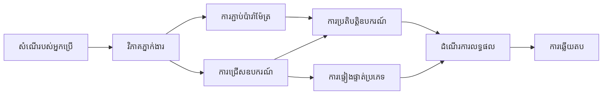

# 🛠️ ការប្រើឧបករណ៍កម្រិតខ្ពស់ជាមួយម៉ូឌុល GitHub (.NET)

## 📋 គោលបំណងការរៀន

កំណត់ត្រានេះបង្ហាញលំនាំការរួមបញ្ចូលឧបករណ៍សម្រាប់សហគ្រាសដោយប្រើ Microsoft Agent Framework ក្នុង .NET ជាមួយ GitHub Models។ អ្នកនឹងរៀនបង្កើតភ្នាក់ងារស្មុគស្មាញជាមួយឧបករណ៍ជាច្រើនដែលមានឯកទេស โดยអាស្រ័យលើ typing រឹងរូសរបស់ C# និងលក្ខណៈពិសេសសម្រាប់សហគ្រាសរបស់ .NET។

### មុខងារឧបករណ៍កម្រិតខ្ពស់ដែលអ្នកនឹងចេះ

- 🔧 **ស្ថាបត្យកម្មឧបករណ៍ច្រើន**: បង្កើតភ្នាក់ងារជាមួយសមត្ថភាពជាច្រើនដែលមានឯកទេស
- 🎯 **ការប្រតិបត្តិឧបករណ៍មានសុវត្ថិភាពប្រភេទ**: អាស្រ័យលើការផ្ទៀងផ្ទាត់នៅពេលបង្កើតកូដរបស់ C#
- 📊 **លំនាំឧបករណ៍សម្រាប់សហគ្រាស**: ការរចនាដើម្បីផលិតកម្ម និងការដោះស្រាយកំហុស
- 🔗 **ការរួមបញ្ចូលឧបករណ៍**: បណ្ដាលឧបករណ៍សម្រាប់លំហប្រតិបត្តិការអាជីវកម្មស្មុគស្មាញ

## 🎯 អត្ថប្រយោជន៍រចនាសម្ព័ន្ធឧបករណ៍ .NET

### លក្ខណៈឧបករណ៍សម្រាប់សហគ្រាស

- **ការផ្ទៀងផ្ទាត់នៅពេលកំពុងបង្កើតកូដ**: ការប្រើ typing រឹងរូសធានាថាព៉ារ៉ាម៉ែត្រឧបករណ៍ត្រឹមត្រូវ
- **ការបញ្ចូលអាស្រ័យភាព (Dependency Injection)**: ការបញ្ចូលជាមួយខ្យល់ IoC សម្រាប់ការគ្រប់គ្រងឧបករណ៍
- **លំនាំ Async/Await**: ការប្រតិបត្តិឧបករណ៍មិនរាំងបញ្ចប់ជាមួយការគ្រប់គ្រងធនធានសមរម្យ
- **ការចុះផ្សាយក្រឹត្យរចនា (Structured Logging)**: ការរួមបញ្ចូលការចុះផ្សាយសម្រាប់តាមដានការប្រតិបត្តិឧបករណ៍

### លំនាំរួចសម្រាប់ផលិតកម្ម

- **ការដោះស្រាយករណីច្រឡំ (Exception Handling)**: ការគ្រប់គ្រងកំហុសយ៉ាងទូលំទូលាយជាមួយករណីបញ្ហាតាមប្រភេទ
- **ការគ្រប់គ្រងធនធាន**: លំនាំចាកចេញបានត្រឹមត្រូវ និងការគ្រប់គ្រងមេម៉ូរី
- **ការតាមដានប្រសិទ្ធភាព**: រង្វិលម៉ែត្រីក និងកុងទ័រប្រសិទ្ធភាពដែលរួមបញ្ចូល
- **ការគ្រប់គ្រងការកំណត់ការ (Configuration Management)**: ការកំណត់ប្រភេទសុវត្ថិភាពជាមួយការផ្ទៀងផ្ទាត់

## 🔧 ស្ថាបត្យកម្មបច្ចេកទេស

### ឧបករណ៍ក្នុងស្នូល .NET

- **Microsoft.Extensions.AI**
- **Microsoft.Agents.AI**
- **GitHub Models Integration**: កុងម៉ែ្រត៍ API មានប្រសិទ្ធិភាពខ្ពស់ជាមួយការបង្ហាញកាបូលកំនត់ភ្ជាប់

### បំពង់ប្រតិបត្តិការឧបករណ៍


## 🛠️ ក្រុមឧបករណ៍ និងលំនាំ

### 1. **ឧបករណ៍ដំណើរការ​ទិន្នន័យ**

- **ការផ្ទៀងផ្ទាត់ការបញ្ចូល**: ការប្រើ typing រឹងរូសជាមួយស្លាកតំណាងព័ត៌មាន
- **ប្រតិបត្តិការផ្លាស់ប្ដូរ**: ការបម្លែងទិន្នន័យ និងទ្រង់ទ្រាយដោយមានសុពលភាពប្រភេទ
- **ទ្រឹស្តីអាជីព**: ឧបករណ៍គណនានិងវិភាគពាក់ព័ន្ធដែន
- **ទ្រង់ទ្រាយលទ្ធផល**: ការបង្កើតចម្លើយមានរចនាសម្ព័ន្ធ

### 2. **ឧបករណ៍រួមបញ្ចូល**

- **ផ្នែកភ្ជាប់ API**: ការរួមបញ្ចូលសេវា RESTful ជាមួយ HttpClient
- **ឧបករណ៍មូលដ្ឋានទិន្នន័យ**: ការរួមបញ្ចូល Entity Framework សម្រាប់ចូលដំណើរការទិន្នន័យ
- **ប្រតិបត្តិការឯកសារ**: ប្រតិបត្តិការប្រព័ន្ធឯកសារដោយមានសុវត្ថិភាព និងការផ្ទៀងផ្ទាត់
- **សេវាកម្មខាងក្រៅ**: លំនាំការរួមបញ្ចូលសេវាកម្មភាគីទីបី

### 3. **ឧបករណ៍ជំនួយ**

- **ដំណើរការអក្សរ**: ឧបករណ៍ចាប់អក្សរ និងទ្រង់ទ្រាយខ្សែអក្សរ
- **ប្រតិបត្តិការ​ថ្ងៃខែ/ម៉ោង**: ការគណនាថ្ងៃខែ/ម៉ោងដែលគិតតាមវប្បធម៌
- **ឧបករណ៍គណិតវិទ្យា**: គណនា​ពិស្តാരി​និង​ប្រតិបត្តិការ​ស្ថិតិ
- **ឧបករណ៍ផ្ទៀងផ្ទាត់**: ការផ្ទៀងផ្ទាត់ច្បាប់អាជីវកម្ម និងការត្រួតពិនិត្យទិន្នន័យ

តើត្រៀមខ្លួនឲ្យបង្កើតភ្នាក់ងារសម្រាប់សហគ្រាសដែលមានសមត្ថភាពខ្លាំង និងប្រភេទសុវត្ថិភាពក្នុង .NET រួចហើយឬនៅ? មករៀបចំដំណោះស្រាយប្រកបដោយវិជ្ជាជីវៈ! 🏢⚡

## 🚀 ការចាប់ផ្ដើម

### ដំបូងត្រូវមាន

- [.NET 10 SDK](https://dotnet.microsoft.com/download/dotnet/10.0) ឬកម្រិតខ្ពស់ជាងនេះ
- [កូនសោចូលប្រើ API របស់ GitHub Models](https://docs.github.com/github-models/github-models-at-scale/using-your-own-api-keys-in-github-models)

### អថេរស្ថានបរិដ្ឋានដែលត្រូវការ

```bash
# zsh/bash
export GH_TOKEN=<your_github_token>
export GH_ENDPOINT=https://models.github.ai/inference
export GH_MODEL_ID=openai/gpt-5-mini
```

```powershell
# PowerShell
$env:GH_TOKEN = "<your_github_token>"
$env:GH_ENDPOINT = "https://models.github.ai/inference"
$env:GH_MODEL_ID = "openai/gpt-5-mini"
```

### កូដឧទាហរណ៍

ដើម្បីរត់ឧទាហរណ៍កូដនេះ,

```bash
# zsh/bash
chmod +x ./04-dotnet-agent-framework.cs
./04-dotnet-agent-framework.cs
```

ឬប្រើ dotnet CLI:

```bash
dotnet run ./04-dotnet-agent-framework.cs
```

មើល [`04-dotnet-agent-framework.cs`](../../../../04-tool-use/code_samples/04-dotnet-agent-framework.cs) សម្រាប់កូដពេញលេញ។

```csharp
#!/usr/bin/dotnet run

#:package Microsoft.Extensions.AI@10.*
#:package Microsoft.Agents.AI.OpenAI@1.*-*

using System.ClientModel;
using System.ComponentModel;

using Microsoft.Agents.AI;
using Microsoft.Extensions.AI;

using OpenAI;

// Tool Function: Random Destination Generator
// This static method will be available to the agent as a callable tool
// The [Description] attribute helps the AI understand when to use this function
// This demonstrates how to create custom tools for AI agents
[Description("Provides a random vacation destination.")]
static string GetRandomDestination()
{
    // List of popular vacation destinations around the world
    // The agent will randomly select from these options
    var destinations = new List<string>
    {
        "Paris, France",
        "Tokyo, Japan",
        "New York City, USA",
        "Sydney, Australia",
        "Rome, Italy",
        "Barcelona, Spain",
        "Cape Town, South Africa",
        "Rio de Janeiro, Brazil",
        "Bangkok, Thailand",
        "Vancouver, Canada"
    };

    // Generate random index and return selected destination
    // Uses System.Random for simple random selection
    var random = new Random();
    int index = random.Next(destinations.Count);
    return destinations[index];
}

// Extract configuration from environment variables
// Retrieve the GitHub Models API endpoint, defaults to https://models.github.ai/inference if not specified
// Retrieve the model ID, defaults to openai/gpt-5-mini if not specified
// Retrieve the GitHub token for authentication, throws exception if not specified
var github_endpoint = Environment.GetEnvironmentVariable("GH_ENDPOINT") ?? "https://models.github.ai/inference";
var github_model_id = Environment.GetEnvironmentVariable("GH_MODEL_ID") ?? "openai/gpt-5-mini";
var github_token = Environment.GetEnvironmentVariable("GH_TOKEN") ?? throw new InvalidOperationException("GH_TOKEN is not set.");

// Configure OpenAI Client Options
// Create configuration options to point to GitHub Models endpoint
// This redirects OpenAI client calls to GitHub's model inference service
var openAIOptions = new OpenAIClientOptions()
{
    Endpoint = new Uri(github_endpoint)
};

// Initialize OpenAI Client with GitHub Models Configuration
// Create OpenAI client using GitHub token for authentication
// Configure it to use GitHub Models endpoint instead of OpenAI directly
var openAIClient = new OpenAIClient(new ApiKeyCredential(github_token), openAIOptions);

// Define Agent Identity and Comprehensive Instructions
// Agent name for identification and logging purposes
var AGENT_NAME = "TravelAgent";

// Detailed instructions that define the agent's personality, capabilities, and behavior
// This system prompt shapes how the agent responds and interacts with users
var AGENT_INSTRUCTIONS = """
You are a helpful AI Agent that can help plan vacations for customers.

Important: When users specify a destination, always plan for that location. Only suggest random destinations when the user hasn't specified a preference.

When the conversation begins, introduce yourself with this message:
"Hello! I'm your TravelAgent assistant. I can help plan vacations and suggest interesting destinations for you. Here are some things you can ask me:
1. Plan a day trip to a specific location
2. Suggest a random vacation destination
3. Find destinations with specific features (beaches, mountains, historical sites, etc.)
4. Plan an alternative trip if you don't like my first suggestion

What kind of trip would you like me to help you plan today?"

Always prioritize user preferences. If they mention a specific destination like "Bali" or "Paris," focus your planning on that location rather than suggesting alternatives.
""";

// Create AI Agent with Advanced Travel Planning Capabilities
// Initialize complete agent pipeline: OpenAI client → Chat client → AI agent
// Configure agent with name, detailed instructions, and available tools
// This demonstrates the .NET agent creation pattern with full configuration
AIAgent agent = openAIClient
    .GetChatClient(github_model_id)
    .CreateAIAgent(
        name: AGENT_NAME,
        instructions: AGENT_INSTRUCTIONS,
        tools: [AIFunctionFactory.Create(GetRandomDestination)]
    );

// Create New Conversation Thread for Context Management
// Initialize a new conversation thread to maintain context across multiple interactions
// Threads enable the agent to remember previous exchanges and maintain conversational state
// This is essential for multi-turn conversations and contextual understanding
AgentThread thread = agent.GetNewThread();

// Execute Agent: First Travel Planning Request
// Run the agent with an initial request that will likely trigger the random destination tool
// The agent will analyze the request, use the GetRandomDestination tool, and create an itinerary
// Using the thread parameter maintains conversation context for subsequent interactions
await foreach (var update in agent.RunStreamingAsync("Plan me a day trip", thread))
{
    await Task.Delay(10);
    Console.Write(update);
}

Console.WriteLine();

// Execute Agent: Follow-up Request with Context Awareness
// Demonstrate contextual conversation by referencing the previous response
// The agent remembers the previous destination suggestion and will provide an alternative
// This showcases the power of conversation threads and contextual understanding in .NET agents
await foreach (var update in agent.RunStreamingAsync("I don't like that destination. Plan me another vacation.", thread))
{
    await Task.Delay(10);
    Console.Write(update);
}
```

---

<!-- CO-OP TRANSLATOR DISCLAIMER START -->
**Disclaimer**:
ឯកសារនេះត្រូវបានបកប្រែដោយប្រើសេវាបកប្រែ AI [Co-op Translator](https://github.com/Azure/co-op-translator). ទោះយើងខិតខំក្នុងការរកភាពត្រឹមត្រូវ ក៏ដោយ សូមចំណាំថា ការបកប្រែដោយប្រព័ន្ធស្វ័យប្រវត្តិនោះអាចមានកំហុស ឬមិនត្រឹមត្រូវ។ ឯកសារដើមនៅក្នុងភាសាមាតុភូមិគួរត្រូវបានចាត់ទុកថាជាប្រភពដែលគួរឱ្យទុកចិត្ត។ សម្រាប់ព័ត៌មានសំខាន់ៗ យើងសូមផ្ដល់អនុសាសន៍ឲ្យប្រើការបកប្រែដោយអ្នកវិជ្ជាជីវៈមនុស្ស។ យើងមិនទទួលខុសត្រូវចំពោះការយល់ច្រឡំ ឬការបកអត្ថន័យខុសណាមួយដែលកើតឡើងពីការប្រើប្រាស់ការបកប្រែនេះ។
<!-- CO-OP TRANSLATOR DISCLAIMER END -->