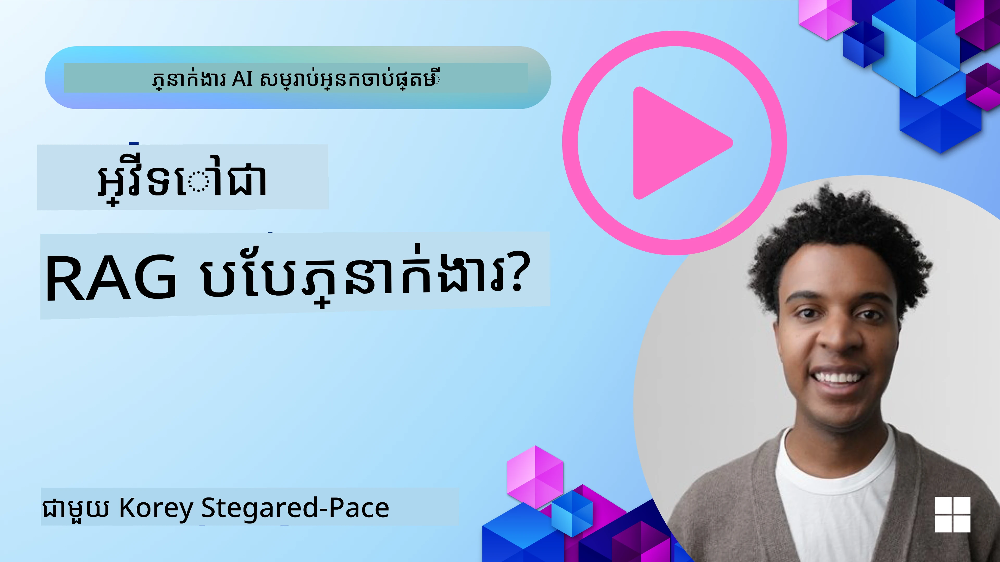
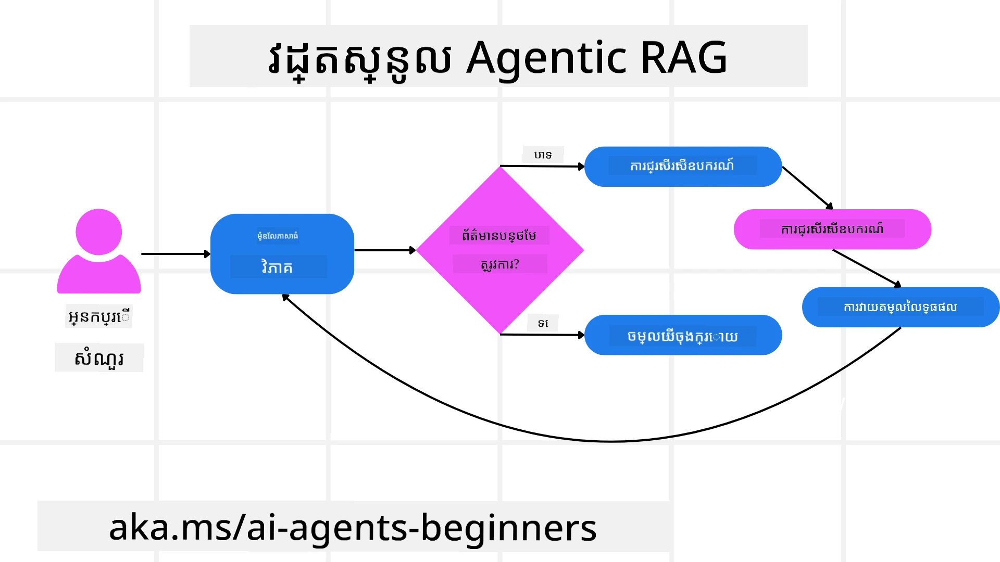
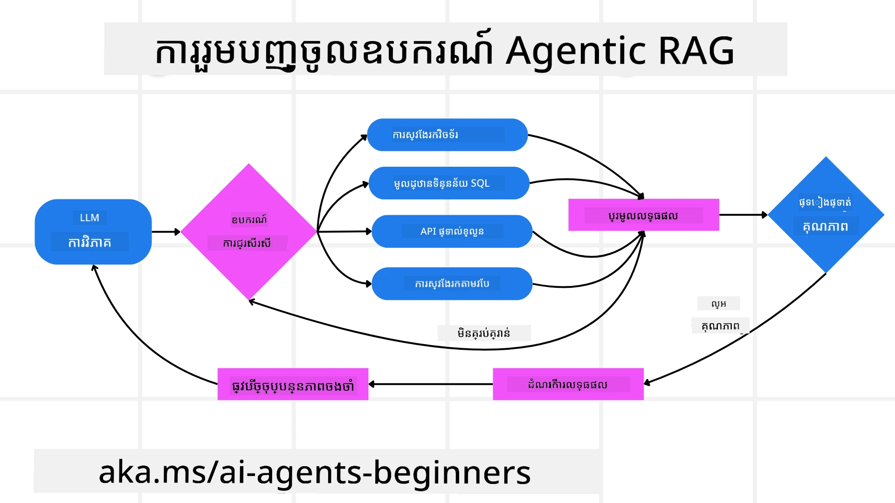
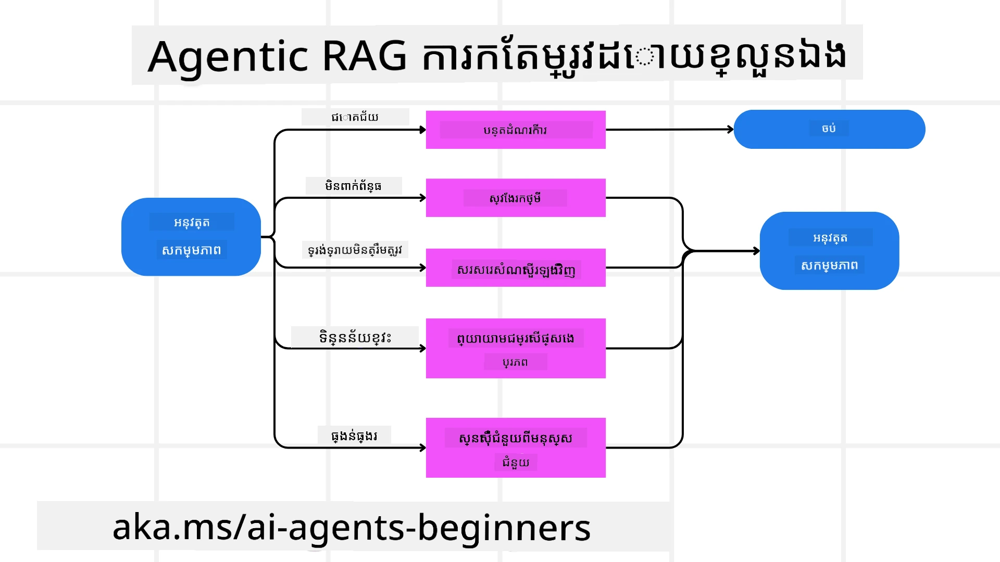
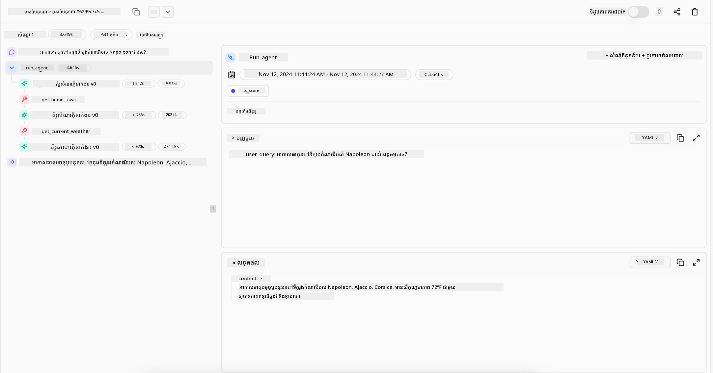

> _(ចុចរូបភាពខាងលើដើម្បីមើលវីដេអូមេរៀននេះ)_

# Agentic RAG

មេរៀននេះផ្តល់ជូនការពិពណ៌នាផ្ដល់ទិដ្ឋភាពទូលំទូលាយអំពី Agentic Retrieval-Augmented Generation (Agentic RAG) ដែលជាវិធីសាស្ត្រថ្មីមួយក្នុង AI ដែលម៉ូដែលភាសាធំៗ (LLMs) អាចរៀបចំផែនការការបន្តរបស់ខ្លួនដោយស្វ័យប្រវត្តិ ខណៈពេលយកព័ត៌មានពីប្រភពក្រៅ។ មិនដូចនឹងនីតិវិធីរកយកនិងអានដែលមានស្ថិរភាពទេ Agentic RAG មានការហៅទៅ LLM ជាដំណោលថតជាបន្តបន្ទាប់ ហើយត្រូវបានបញ្ចោញជាមួយការហៅឧបករណ៍ ឬមុខងារនិងលទ្ធផលដែលមានរចនាសម្ព័ន្ធ។ ប្រព័ន្ធវាយតម្លៃលទ្ធផល កែលម្អការស៊ើបអង្កេត ហៅឧបករណ៍បន្ថែម ប្រសិនបើចាំបាច់ ហើយបន្តដំណើរការនេះរហូតដល់ទទួលបានដំណោះស្រាយដែលពេញចិត្ត។

## ណែនាំ

មេរៀននេះនឹងរៀបរាប់ពី

- **យល់ពី Agentic RAG:** ស្វែងយល់អំពីរបៀបថ្មីមួយនៅក្នុង AI ដែលម៉ូដែលភាសាធំៗ (LLMs) អាចរៀបចំផែនការបន្ទាប់របស់ខ្លួនដោយស្វ័យប្រវត្តិក្នុងការទាញយកព័ត៌មានពីប្រភពទិន្នន័យក្រៅ។
- **យល់អំពីរបៀប Iterative Maker-Checker:** យល់ដឹងពីដំណើរការហៅ LLM ជាបន្តបន្ទាប់ ដែលត្រូវបានចាក់បញ្ចូលជាមួយការហៅឧបករណ៍ ឬមុខងារ និងលទ្ធផលមានរចនាសម្ព័ន្ធ ដើម្បីកែលម្អភាពត្រឹមត្រូវ និងដោះស្រាយសំណួរមិនល្អ។
- **ស្វែងយល់ពីការអនុវត្តជាក់ស្តែង:** រកឃើញស្ថានការណ៍ដែល Agentic RAG មានប្រសិទ្ធភាពដូចជា បរិយាកាសដែលផ្តោតលើភាពត្រឹមត្រូវ ជំនួបទិន្នន័យស្មុគស្មាញ និងដំណើរការងារវែង។

## គោលដៅការសិក្សា

បន្ទាប់ពីបញ្ចប់មេរៀននេះ អ្នកនឹងដឹងធ្វើ/យល់ដឹងពី៖

- **យល់ការណ៍អំពី Agentic RAG:** រៀនអំពីរបៀបថ្មីក្នុង AI ដែលម៉ូដែលភាសាធំៗ (LLMs) រៀបចំផែនការបន្ទាប់ដោយស្វ័យប្រវត្តិក្នុងការយកព័ត៌មានពីប្រភពក្រៅ។
- **របៀប Iterative Maker-Checker:** យល់ដឹងពីគំនិតនៃដំណើរការហៅម្តងៗទៅ LLM លាយតាមនឹងការហៅឧបករណ៍ ឬមុខងារ និងលទ្ធផលមានរចនាសម្ព័ន្ធ ដែលបង្កើតឡើងដើម្បីកែលម្អភាពត្រឹមត្រូវ និងដោះស្រាយសំណួរពុំសូវត្រឹមត្រូវ។
- **ជំនាញក្នុងដំណើរការត្រៀមផលប្រយោជន៍:** យល់ដឹងពីសមត្ថភាពប្រព័ន្ធក្នុងការគ្រប់គ្រងការត្រួតពិនិត្យ ការសម្រេចចិត្តលើរបៀបដោះស្រាយបញ្ហា ដោយមិនពឹងផ្អែកលើផ្លូវដែលបានកំណត់ជាមុន។
- **ដំណើរការងារ:** យល់ដឹងថាម៉ូដែល agentic អាចសម្រេចចិត្តដោយឯងក្នុងការទាញយករបាយការណ៍ចរន្តទីផ្សារ សម្គាល់ទិន្នន័យប្រកួតប្រជែង ប្រមូលមាត្រដ្ឋានការលក់ខាងក្នុង បញ្ចូលទិន្នន័យ និងវាយតម្លៃយុទ្ធសាស្ត្រ។
- **រង្វិល Iterative, ការរួមបញ្ចូលឧបករណ៍ និងអនុស្សារណៈ:** ស្វែងយល់ថាប្រព័ន្ធពឹងផ្អែកលើរង្វិលប្រតិបត្តិការដែលរក្សាអនុស្សារណៈ និងសភាពនៅលើជំហានដើម្បីជៀសវាងរង្វិលមិនចាំបាច់ និងធ្វើសេចក្តីសម្រេចដែលមានព័ត៌មានគ្រប់គ្រាន់។
- **ដោះស្រាយករណីបរាជ័យ និងកែលម្អខ្លួនឯង:** ស្វែងយល់ពីមេកានីសម៍កែលម្អខ្លួនឯងដ៏រឹងមាំ រួមមានការរង្វិលធ្វើឡើងវិញ ការប្រើឧបករណ៍ពិនិត្យ និងការស្នើសុំមនុស្សបន្តត្រួតពិនិត្យ។
- **ដែនកំណត់នៃអាជ្ញាធរ:** យល់ដឹងពីកំណត់របស់ Agentic RAG ដែលផ្តោតលើអាជ្ញាធរប្រភេទតំបន់ពិសេស ពឹងផ្អែកលើហេដ្ឋារចនាសម្ព័ន្ធ និងការគោរពច្បាប់នានា។
- **ករណីប្រើប្រាស់ជាក់ស្តែង និងតម្លៃ:** រកឃើញករណីដែល Agentic RAG មានប្រសិទ្ធភាព ដូចជា បរិយាកាសផ្តោតលើភាពត្រឹមត្រូវ បំពេញទិន្នន័យស្មុគស្មាញ និងដំណើរការងារវែង។
- **ការគ្រប់គ្រង ភាពត្រឹមត្រូវ និងការជឿទុកចិត្ត:** ស្វែងយល់ពីសារៈសំខាន់នៃការគ្រប់គ្រង និងភាពត្រឹមត្រូវ រួមមានការពន្យល់ត្រឹមត្រូវ ការគ្រប់គ្រងបង្រួម និងការត្រួតពិនិត្យដោយមនុស្ស។

## Agentic RAG គឺជាអ្វី?

Agentic Retrieval-Augmented Generation (Agentic RAG) គឺជាវិធីសាស្ត្រថ្មីមួយក្នុង AI ដែលម៉ូដែលភាសាធំៗ (LLMs) អាចរៀបចំផែនការបន្ទាប់របស់ខ្លួនដោយស្វ័យប្រវត្តិនៅពេលយកព័ត៌មានពីប្រភពក្រៅ។ មិនដូចនឹងនីតិវិធី static retrieval-then-read ទេ, Agentic RAG មានការហៅ LLM ជាបន្តបន្ទាប់ ដែលត្រូវបានចាក់បញ្ចូលជាមួយការហៅឧបករណ៍ ឬមុខងារ និងលទ្ធផលមានរចនាសម្ព័ន្ធ។ ប្រព័ន្ធវាយតម្លៃលទ្ធផល កែលម្អការស៊ើបអង្កេត ហៅឧបករណ៍បន្ថែម ប្រសិនបើចាំបាច់ ហើយបន្តដំណើរការនេះរហូតដល់ទទួលបានដំណោះស្រាយដែលពេញចិត្ត។ របៀប “maker-checker” វិញដដែលនេះកែលម្អភាពត្រឹមត្រូវ ដោះស្រាយសំណួរមិនត្រឹមត្រូវ និងធានាលទ្ធផលមានគុណភាពខ្ពស់។

ប្រព័ន្ធមានសមត្ថភាពគ្រប់គ្រងដំណើរការត្រៀមផលប្រយោជន៍ឯង ដោយសរសេរឡើងវិញសំណួរដែលបរាជ័យ ជ្រើសរើសវិធីសាស្ត្រទាញយកផ្សេងៗ និងរួមបញ្ចូលឧបករណ៍ច្រើនដូចជា ស្វែងរកវ៉ិចទ័រ​ក្នុង Azure AI Search, ទិន្នន័យ SQL ឬ API ផ្ទាល់ខ្លួន មុនពេលបញ្ចប់ចម្លើយ។ លក្ខណៈពិសេសនៃប្រព័ន្ធ agentic គឺសមត្ថភាពក្នុងការកាន់កាប់ដំណើរការត្រៀមផលប្រយោជន៍ខ្លួនឯង។ ការអនុវត្ត RAG ប្រពៃណីពឹងផ្អែកលើផ្លូវដែលបានកំណត់ជាមុន ប៉ុន្តែប្រព័ន្ធ agentic នេះកំណត់លំដាប់ជំហានដោយស្វ័យប្រវត្តិតាមគុណភាពព័ត៌មានដែលបានរកបាន។

## ការសម្គាល់ Agentic Retrieval-Augmented Generation (Agentic RAG)

Agentic Retrieval-Augmented Generation (Agentic RAG) គឺជាវិធីសាស្ត្រថ្មីមួយក្នុងការអភិវឌ្ឍ AI ដែល LLM មិនត្រឹមតែទាញយកព័ត៌មានពីប្រភពទិន្នន័យក្រៅ ប៉ុន្តែចុះខ្សែផែនការបន្ទាប់ដោយស្វ័យប្រវត្តិ។ មិនដូចការទាញយកហើយអាន static ឬលំដាប់បញ្ជាបង្កើតរួចជាស្រេចទេ Agentic RAG មានដំណើរការហៅ LLM ជារៀងរហូត ដែលចាក់បញ្ចូលជាមួយការហៅឧបករណ៍ ឬមុខងារ និងលទ្ធផលមានរចនាសម្ព័ន្ធ។ នៅគ្រប់ជំហាន ប្រព័ន្ធវាយតម្លៃលទ្ធផល ទឹកចិត្តថាតើត្រូវកែលម្អសំណួររបស់ខ្លួន ហៅឧបករណ៍បន្ថែមប្រសិនបើចាំបាច់ ហើយបន្តដំណើរការហៅនេះរហូតដល់ទទួលបានដំណោះស្រាយដែលពេញចិត្ត។

របៀប “maker-checker” ដែលមានរង្វិលនេះមានគោលបំណងកែលម្អភាពត្រឹមត្រូវ ដោះស្រាយសំណួរមិនត្រឹមត្រូវទៅកាន់ទិន្នន័យដែលមានរចនាសម្ព័ន្ធ (ឧ. NL2SQL) និងធានាលទ្ធផលត្រឹមត្រូវ។ មុនពេលពឹងផ្អែកលើខ្សែបញ្ជារត្រូវបានបង្កើតយ៉ាងម៉ត់ចត់ ប្រព័ន្ធ agentic រក្សាសិទ្ធិនៃការគ្រប់គ្រងចំណុចគិតខ្លួនឯង៖ វាអាចសរសេរឡើងវិញសំណួរដែលបរាជ័យ ជ្រើសរើសវិធីសាស្ត្រទាញយកផ្សេងៗ និងរួមបញ្ចូលឧបករណ៍ច្រើនដូចជា ស្វែងរកវ៉ិចទ័រនៅក្នុង Azure AI Search, ទិន្នន័យ SQL ឬ API ផ្ទាល់ខ្លួន មុនពេលបញ្ចប់ចម្លើយ។ វានេះបំបាត់ការមិនចាំបាច់នៃផ្នែកធ្វើអូខ័រុស្រាស្យុងដែលស្មុគស្មាញ។ ផ្ទុយទៅវិញ រង្វិលស្រួលចន្លោះ “ហៅ LLM → ប្រើឧបករណ៍ → ហៅ LLM → …” អាចបង្កើតលទ្ធផលស្មុគស្មាញ និងមានមូលដ្ឋានល្អ។

## ការគ្រប់គ្រងដំណើរការត្រៀមផលប្រយោជន៍

លក្ខណៈពិសេសដែលធ្វើឲ្យប្រព័ន្ធ “agentic” គឺសមត្ថភាពក្នុងការកាន់កាប់ដំណើរការត្រៀមផលប្រយោជន៍ខ្លួនឯង។ ការអនុវត្ត RAG ប្រពៃណីភាគច្រើនពឹងផ្អែកលើមនុស្សកំណត់ផ្លូវសម្រាប់ម៉ូដែល៖ ខ្សែគំនិតសម្រាប់រៀបចំអ្វីដែលត្រូវទាញយក និងពេលវេលា។
ប៉ុន្តែនៅពេលប្រព័ន្ធជា agentic មួយ វាសម្រេចចិត្តផ្ទៃក្នុងថាតើត្រូវជជែកផ្តើមបញ្ហានេះយ៉ាងដូចម្តេច។ វាមិនគ្រាន់តែបំពេញស្គ្រីបមួយទេ; វាសម្រេចលំដាប់ជំហានដោយស្វ័យប្រវត្តិតាមគុណភាពនៃព័ត៌មានដែលវា​ស្វែងបាន។
ឧទាហរណ៍ ប្រសិនបើវាត្រូវបានស្នើឱ្យបង្កើតយុទ្ធសាស្ត្រដាក់លក់ផលិតផល វាមិនពឹងផ្អែកលើស្គ្រីបដែលបញ្ជាក់ដំណើរការស្រាវជ្រាវ និងសម្រេចចិត្តទាំងមូលទេ។ ផ្ទុយទៅវិញ វាធ្វើការសម្រេចចិត្តដោយឯករាជ្យដូចជា៖

1. ទាញយករបាយការណ៍ចរន្តទីផ្សារបច្ចុប្បន្នដោយប្រើ Bing Web Grounding  
2. សម្គាល់ទិន្នន័យប្រកួតប្រជែងដែលពាក់ព័ន្ធដោយប្រើ Azure AI Search  
3. តភ្ជាប់មាត្រដ្ឋានលក់នៃអតីតកាលនៅក្នុងបានអោយ Azure SQL Database  
4. សម្របសម្រួលលទ្ធផលជាយុទ្ធសាស្ត្រដែលមានសមាសភាព ត្រូវបានដឹកនាំតាមរយៈ Azure OpenAI Service  
5. វាយតម្លៃយុទ្ធសាស្ត្រសម្រាប់ចន្លោះ ឬកំហុស និងរុញឲ្យធ្វើការទាញយកបន្ថែម ប្រសិនបើចាំបាច់

ជំហានទាំងនេះទាំងអស់ — កែលម្អសំណួរ ជ្រើសរើសប្រភព រង្វិលរហូត “ជាប់ចិត្ត” ជាមួយចម្លើយ — ត្រូវបានម៉ូដែលសម្រេចចិត្ត មិនមែនជាស្គ្រីបដែលមនុស្សនិយាយជាមុនទេ។

## រង្វិល Iterative ការរួមបញ្ចូលឧបករណ៍ និងអនុស្សារណៈ

ប្រព័ន្ធ agentic ពឹងផ្អែកលើលំនាំអន្តរការរង្វិលមួយ៖

- **ការហៅដំបូង៖** គោលដៅរបស់អ្នកប្រើ (ឬជាសំណើររបស់អ្នកប្រើ) ត្រូវបានផ្តល់ទៅ LLM  
- **ការហៅឧបករណ៍៖** ប្រសិនបើម៉ូដែលរកឃើញព័ត៌មានខាតឬការណែនាំមិនច្បាស់ វាជ្រើសរើសឧបករណ៍ឬវិធីសាស្ត្រទាញយក — ដូចជាសំណួរទិន្នន័យវ៉ិចទ័រ (ឧ. ស្វែងរក Azure AI Search Hybrid តាមទិន្នន័យឯកជន) ឬសំណួរ SQL មានរចនាសម្ព័ន្ធ ដើម្បីប្រមូលបរិបទបន្ថែម  
- **ការវាយតម្លៃ និងកែលម្អ៖** បន្ទាប់ពីពិនិត្យព័ត៌មានដែលបានបង្វិលត្រឡប់មកម៉ូដែល សម្រេចថាតើព័ត៌មានគ្រប់គ្រាន់ភ្លឺហើយឬមិនគ្រប់គ្រាន់។ ប្រសិនបើមិនគ្រប់គ្រាន់ វាគ្រាន់តែកែលម្អសំណួរ ព្យាយាមឧបករណ៍ផ្សេង ឬកែប្រែវិធីសាស្ត្រ  
- **ធ្វើឡើងវិញរហូតដល់ពេញចិត្ត៖** រង្វិលនេះបន្តជារៀងរាល់ពេលម៉ូដែលរំលេចថាវាមានភាពច្បាស់លាស់ និងភស្តុតាងគ្រប់គ្រាន់ដើម្បីផ្តល់ចម្លើយចុងក្រោយ ដែលមានហេតុផលល្អ  
- **អនុស្សារណៈ និងសភាព៖** ពីព្រោះប្រព័ន្ធរក្សាសភាព និងអនុស្សារណៈឆ្លងកាត់ជំហានៗ វាអាចចងចាំការព្យាយាមមុនៗនិងលទ្ធផល ដើម្បីជៀសវាងរង្វិលមិនចាំបាច់ និងធ្វើសេចក្តីសម្រេចដែលមានព័ត៌មានគ្រប់គ្រាន់ខណៈធ្វើដំណើរ

ផុតពេល វាបង្កើតអារម្មណ៍នៃការយល់ដឹងរីកចម្រើន អនុញ្ញាតឲ្យម៉ូដែលដំណើរការបញ្ហាស្មុគស្មាញលំដាប់ច្រើនដោយមិនចាំបាច់មានមនុស្សចូលបញ្ចូល ឬកែប្រែស្នើរក្នុងដំណើរការនោះ។

## ដោះស្រាយករណីបរាជ័យ និងកែលម្អខ្លួនឯង

អាជ្ញាធរ Agentic RAG ក៏មានមេកានីសម៍កែលម្អខ្លួនឯងយ៉ាងរឹងមាំដែរ។ នៅពេលប្រព័ន្ធឈប់ដំណើរការ ដូចជាទាញយកឯកសារមិនពាក់ព័ន្ធ ឬជួបសំណួរមិនល្អ វាអាចធ្វើដូចខាងក្រោម៖

- **ធ្វើឡើងវិញ និងសំណួរឡើងវិញ:** មិនត្រឡប់ចម្លើយតម្លៃទាបទេ ម៉ូដែលនឹងព្យាយាមយុទ្ធសាស្ត្រស្វែងរកថ្មីៗ សរសេរឡើងវិញសំណួរទីផ្សារ ឬមើលឯកសារផ្សេងទៀត  
- **ប្រើឧបករណ៍វិនិយោគថ្នាក់ចំណុច:** ប្រព័ន្ធអាចហៅមុខងារបន្ថែមដែលគ្រោងជួយវិនិយោគចំណុចគិតរបស់ខ្លួន ឬបញ្ជាក់ភាពត្រឹមត្រូវនៃទិន្នន័យដែលបានទាញយក។ ឧបករណ៍ដូចជា Azure AI Tracing នឹងមានសារៈសំខាន់សម្រាប់ធានាៈភាពមើលឃើញរឹងមាំ និងការត្រួតពិនិត្យ  
- **ត្រូវបញ្ចូលមនុស្សត្រួតពិនិត្យវិញ៖** សម្រាប់ករណីមានហានិភ័យខ្ពស់ ឬកើតបរាជ័យជាបន្តបន្ទាប់ ម៉ូដែលអាចធ្វើសញ្ញាអះអាងមិនច្បាស់ថាត្រូវការដឹកនាំពីមនុស្ស។ នៅពេលមនុស្សផ្តល់មតិយោបល់កែលម្អ ត្រឡប់មកហ្នឹងម៉ូដែលអាចបញ្ចូលមេរៀននោះសម្រាប់ថ្ងៃអនាគត

របៀបដំណើរការវិញនេះអនុញ្ញាតឲ្យម៉ូដែលមានកំណត់កែប្រែបន្តបន្ទាប់ ដើម្បីធានាថាវាមិនមែនប្រព័ន្ធដំណើរការ​មួយលុតម្ដងទេ ប៉ុន្តែជាម៉ូដែលរៀនពីកំហុសក្នុងអំឡុងពេលសម័យមួយ។

## ដែនកំណត់នៃអាជ្ញាធរ

ទោះបីមានអាជ្ញាធរប្រើប្រាស់ឯងក្នុងកិច្ចការពាក់ព័ន្ធ Agentic RAG មិនមែនជាប្រាក់ចំណេញទូទៅនៃ Artificial General Intelligence ទេ។ សមត្ថភាព “agentic” របស់វាត្រូវបានកំណត់ទៅតែឧបករណ៍ ប្រភពទិន្នន័យ និងគោលការណ៍ដែលអ្នកអភិវឌ្ឍផ្តល់។ វាមិនអាចដើរបានលើឧបករណ៍ឯងឬគេចខ្លួនចេញពីដែនកំណត់តំបន់ដែលបានកំណត់ឡើយ។ ជំនួសវារីករាលដាលសមត្ថភាពរបស់វាទៅកាន់ការរៀបចំបរិមាណឯកសារដែលមាន។

ការប្រៀបធៀបសំខាន់ៗពី AI កម្រិតខ្ពស់រួមមាន៖

1. **អាជ្ញាធរតំបន់ពិសេស៖** ប្រព័ន្ធ Agentic RAG ផ្តោតសំខាន់ទៅលើការសម្រេចគោលដៅរបស់អ្នកប្រើនៅក្នុងដែនតំបន់ដែលស្គាល់ ហើយប្រើយុទ្ធសាស្ត្រដូចជាការសរសេរឡើងវិញសំណួរ ឬជ្រើសរើសឧបករណ៍ដើម្បីកែលម្អលទ្ធផល  
2. **ពឹងផ្អែកលើហេដ្ឋារចនាសម្ព័ន្ធ៖** សមត្ថភាពរបស់ប្រព័ន្ធពឹងផ្អែកលើឧបករណ៍ និងទិន្នន័យដែលអ្នកអភិវឌ្ឍបានបញ្ចូល។ វាមិនអាចឆ្លងកាត់ដែនកំណត់នេះដោយមិនមានការជួរដៃពីមនុស្សបានទេ  
3. **គោរពច្បាប់ និងការគ្រប់គ្រង៖** គោលការណ៍សីលធម៍ ច្បាប់ គោលការណ៍អាជីវកម្ម ត្រូវបានគោរពយ៉ាងខ្លាំង។ សេរីភាពរបស់ភ្នាក់ងារត្រូវបានកំណត់ដោយវិធានសុវត្ថិភាព និងប្រព័ន្ធត្រួតពិនិត្យ (សង្ឃឹមថា?)

## ករណីប្រើប្រាស់ជាក់ស្តែង និងតម្លៃ

Agentic RAG មានភាពស្វាគមន៍នៅករណីដែលតម្រូវអោយកែលម្អជាបន្តបន្ទាប់ និងភាពត្រឹមត្រូវច្បាស់លាស់៖

1. **បរិយាកាសផ្តោតលើភាពត្រឹមត្រូវជាមុន៖** នៅក្នុងត្រួតពិនិត្យគោលការណ៍ ការវិភាគច្បាប់ ឬស្រាវជ្រាវច្បាប់ ម៉ូដែល agentic អាចធ្វើការត្រួតពិនិត្យព័ត៌មានជាច្រើនដង ពិនិត្យប្រភពជាច្រើន និងសរសេរឡើងវិញសំណួរហើយទទួលបានចម្លើយដែលបានពិនិត្យយ៉ាងម៉ត់ចត់  
2. **ប្រតិបត្តិការលំបាកទៅលើទិន្នន័យទំព័រទួលទៅមុខ៖** នៅពេលច្នៃប្រឌិតទិន្នន័យដែលមានរចនាសម្ព័ន្ធ ដែលខ្លះសំណួរអាចបរាជ័យ ឬត្រូវកែប្រែ ប្រព័ន្ធអាចកែលម្អសំណួររបស់ខ្លួនដោយប្រើ Azure SQL ឬ Microsoft Fabric OneLake ដើម្បីធ្វើឲ្យការទាញយកចុងក្រោយសមរម្យទៅតាមបំណងអ្នកប្រើ  
3. **ដំណើរការងារវែងជាប់៖** សម័យវែងអាចរីកចម្រើនជាមួយព័ត៌មានថ្មី។ Agentic RAG អាចបញ្ចូលនូវទិន្នន័យថ្មីៗជាបន្តបន្ទាប់ បំលាស់យុទ្ធសាស្ត្រដែលមានពេលវេលាក៏ដូចជា រៀនពីបរិយាកាសបញ្ហា

## ការគ្រប់គ្រង ភាពត្រឹមត្រូវ និងការជឿទុកចិត្ត

ពេលប្រព័ន្ធទទួលសិទ្ធិជាច្រើនក្នុងដំណើរការត្រៀមផលប្រយោជន៍ ការគ្រប់គ្រង និងភាពត្រឹមត្រូវចែងរស់ជារឿងសំខាន់៖

- **ការប្រាប់នូវដំណើរការត្រឹមត្រូវ:** ម៉ូដែលអាចផ្តល់សំលេងដែលតាមដានបាននៃសំណួរដែលវាបានធ្វើ ប្រភពដែលវាបានពិនិត្យ និងជំហានត្រៀមផលប្រយោជន៍ដែលវាបានអនុវត្តដើម្បីឈានដល់សេចក្តីសន្និដ្ឋាន។ ឧបករណ៍ដូចជា Azure AI Content Safety និង Azure AI Tracing / GenAIOps អាចជួយរក្សាភាពត្រឹមត្រូវ និងកាត់បន្ថយហានិភ័យ  
- **ការត្រួតពិនិត្យការបង្រួមតែមួយ និងប្រកាន់ខ្ជាប់ការទាញយកឯកសារដោយមានតុល្យភាព:** អ្នកអភិវឌ្ឍអាចកំណត់យុទ្ធសាស្ត្រទាញយកឯកសារដើម្បីធានាប្រភពទិន្នន័យមានតុល្យភាព និងត្រួតពិនិត្យលទ្ធផលជាប្រចាំដើម្បីស្គែលក្ខណៈគ្រោះថ្នាក់ឬប៉ាតធ័រតម្រៀប បើកម៉ូដែលបុគ្គលិកលំនាំសម្រាប់ជំនាញវិទ្យាសាស្ត្រទិន្នន័យលំដាប់ខ្ពស់ដែលប្រើ Azure Machine Learning  
- **ការត្រួតពិនិត្យដោយមនុស្ស និងគោរពច្បាប់:** សម្រាប់បច្ចេកទេសស្មុគស្មាញ ការត្រួតពិនិត្យដោយមនុស្សនៅតែមានសារៈសំខាន់។ Agentic RAG មិនដូរមតិមនុស្សក្នុងសេចក្តីសម្រេចចិត្តដែលមានហានិភ័យខ្ពស់ទេ—វាចូលរួមជាមួយដោយផ្តល់ជម្រើសដែលបានពិនិត្យយ៉ាងម៉ត់ចត់។

មានឧបករណ៍ដែលផ្តល់កំណត់ត្រាដោយច្បាស់នៃសកម្មភាពមានសារៈសំខាន់។ បើគ្មានវា វាមិនងាយស្រួលក្នុងការរើសចោលកំហុសលំដាប់ច្រើន។ មើលឧទាហរណ៍ខាងក្រោមពី Literal AI (ក្រុមហ៊ុននៅក្រោយ Chainlit) សម្រាប់ការបង្ហាញមុខAgent run៖

## សេចក្ដីសន្និដ្ឋាន

Agentic RAG តំណាងឲ្យការវិវឌ្ឍធម្មជាតិនៃរបៀបប្រព័ន្ធ AI ដោះស្រាយបញ្ហាស្មុគស្មាញ ដ៏ពេញលេញដោយការជ្រើសរើសឧបករណ៍ដោយស្វ័យប្រវត្តិ កែលម្អសំណួរហើយបានលទ្ធផលមានគុណភាពខ្ពស់ ប្រព័ន្ធនេះហួសពីការតាមដានតែបច្ចេកទេសច្បាស់ពីស្នើរ ដើម្បីជាម៉ូដែលសម្រេចចិត្តដែលមានជំនាញកាន់តែមានឥទ្ធិពល និងដឹងបរិបទល្អ។ ទោះបីជាកំណត់ដោយហេដ្ឋារចនាសម្ព័ន្ធដែលបានកំណត់ដោយមនុស្ស និងច្បាប់សីលធម៍ តែសមត្ថភាព agentic បញ្ចូលភាពសំបូរបែប និងរីកចម្រើន ដ៏មានប្រយោជន៍សម្រាប់សហគ្រាស និងអ្នកប្រើប្រាស់ចុងក្រោយ។

### មានសំណួរច្រើនទៀតអំពី Agentic RAG?

ចូលរួម [Microsoft Foundry Discord](https://aka.ms/ai-agents/discord) ដើម្បីជួបជាមួយអ្នករៀនផ្សេងទៀត ចូលរួមម៉ោងការិយាល័យ និងទទួលសំណួរអំពី AI Agents របស់អ្នក។

## ធនធានបន្ថែម
- <a href="https://learn.microsoft.com/training/modules/use-own-data-azure-openai" target="_blank">អនុវត្តការបង្កើតបន្ថែម​តាម​ការ​ស្វែងរក (RAG) ជាមួយ​សេវាកម្ម Azure OpenAI ៖ កំណត់អោយបានពីរបៀបប្រើទិន្នន័យរបស់អ្នកជាមួយសេវាកម្ម Azure OpenAI។ មូឌុល Microsoft Learn នេះផ្តល់ជារបៀបដឹកនាំលំអិតអំពីការអនុវត្ត RAG</a>
- <a href="https://learn.microsoft.com/azure/ai-studio/concepts/evaluation-approach-gen-ai" target="_blank">ការវាយតម្លៃកម្មវិធី AI បង្កើតដោយ Microsoft Foundry ៖ អត្ថបទនេះគ្របដណ្តប់ពីការវាយតម្លៃ និងការប្រៀបធៀបគំរូលើសំណុំទិន្នន័យសាធារណៈ ដែលរួមមានកម្មវិធី Agentic AI និងអាគុយរ៉ិច RAG</a>
- <a href="https://weaviate.io/blog/what-is-agentic-rag" target="_blank">Agentic RAG ជាអ្វី | Weaviate</a>
- <a href="https://ragaboutit.com/agentic-rag-a-complete-guide-to-agent-based-retrieval-augmented-generation/" target="_blank">Agentic RAG ៖ មគ្គុទេសក៍ពេញលេញស្ដីពីការបង្កើតបន្ថែមការស្វែងរកដោយផ្អែកលើភ្នាក់ងារ - ព័ត៌មានថ្មីពីការបង្កើត RAG</a>
- <a href="https://huggingface.co/learn/cookbook/agent_rag" target="_blank">Agentic RAG ៖ លុបផ្លូវរំនងការស្វែងរករបស់អ្នកជាមួយការផ្លាស់ប្តូរពាក្យសំណួរនិងស្វែងរកដោយខ្លួនឯង! Hugging Face សៀវភៅបន្លំ AI ប្រភពបើក</a>
- <a href="https://youtu.be/aQ4yQXeB1Ss?si=2HUqBzHoeB5tR04U" target="_blank">បន្ថែមស្រទាប់ Agentic ទៅលើ RAG</a>
- <a href="https://www.youtube.com/watch?v=zeAyuLc_f3Q&t=244s" target="_blank">អនាគតនៃមន្រ្តីជំនួយចំណេះដឹង: Jerry Liu</a>
- <a href="https://www.youtube.com/watch?v=AOSjiXP1jmQ" target="_blank">របៀបសាងសង់ប្រព័ន្ធ Agentic RAG</a>
- <a href="https://ignite.microsoft.com/sessions/BRK102?source=sessions" target="_blank">ប្រើសេវាកម្ម Microsoft Foundry Agent ដើម្បីពង្រីកភ្នាក់ងារ AI របស់អ្នក</a>

### អត្ថបទវិទ្យាសាស្ត្រ

- <a href="https://arxiv.org/abs/2303.17651" target="_blank">2303.17651 Self-Refine៖ ការកែលម្អអន្ទត់ដោយខ្លួនឯងជាថ្ងៃៗ</a>
- <a href="https://arxiv.org/abs/2303.11366" target="_blank">2303.11366 Reflexion៖ ភ្នាក់ងារភាសាមួយជាមួយការសិក្សារតបស្នងដោយមាត់</a>
- <a href="https://arxiv.org/abs/2305.11738" target="_blank">2305.11738 CRITIC៖ គំរូភាសាធំៗអាចកែតម្រូវខ្លួនឯងជាមួយការវាយតម្រូវជាមួយឧបករណ៍</a>
- <a href="https://arxiv.org/abs/2501.09136" target="_blank">2501.09136 Agentic Retrieval-Augmented Generation៖ ស្ទង់មតិលើ Agentic RAG</a>

## មេរៀនមុន

[គំរូរចនាប្រើប្រាស់ឧបករណ៍](../04-tool-use/README.md)

## មេរៀនបន្ទាប់

[ការសាងសង់ភ្នាក់ងារ AI ដែលគួរឱ្យទុកចិត្ត](../06-building-trustworthy-agents/README.md)

---

<!-- CO-OP TRANSLATOR DISCLAIMER START -->
**ការបដិសេធ**៖  
ឯកសារនេះត្រូវបានបកប្រែដោយប្រើសេវាកម្មបកប្រែAI [Co-op Translator](https://github.com/Azure/co-op-translator)។ ខណៈពេលដែលយើងខិតខំសម្រាប់ភាពត្រឹមត្រូវ សូមយកចិត្តទុកដាក់ថាការបកប្រែដោយស្វ័យប្រវត្តិអាចមានកំហុស ឬភាពមិនត្រឹមត្រូវ។ ឯកសារដើមក្នុងភាសាដើមគួរត្រូវបានពិចារណាថា ជាធនធានដែលមានសិទ្ធិពេញលេញ។ សម្រាប់ព័ត៌មានដ៏សំខាន់ សូមផ្តល់អាទិភាពការបកប្រែដោយមនុស្សជំនាញវិជ្ជាជីវៈ។ យើងមិនទទួលខុសត្រូវចំពោះការយល់ឃើញខុសឬការបកប្រែខុសពីការប្រើប្រាស់ការបកប្រែនេះឡើយ។
<!-- CO-OP TRANSLATOR DISCLAIMER END -->