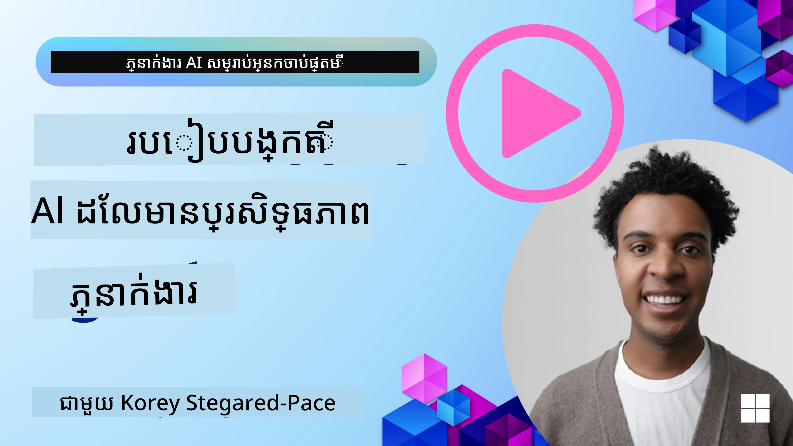
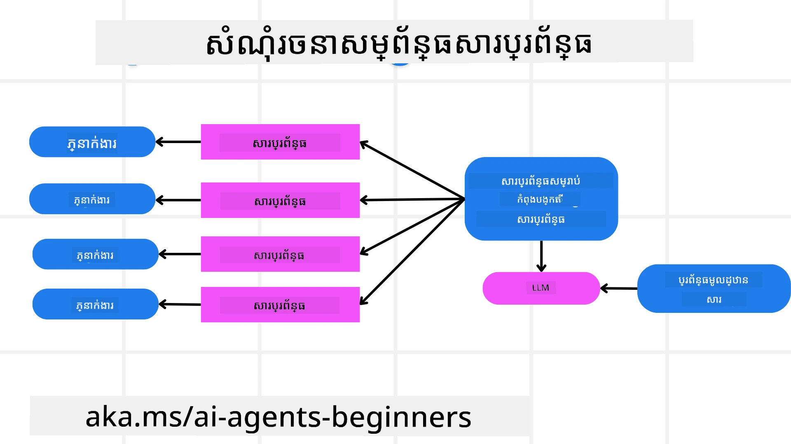
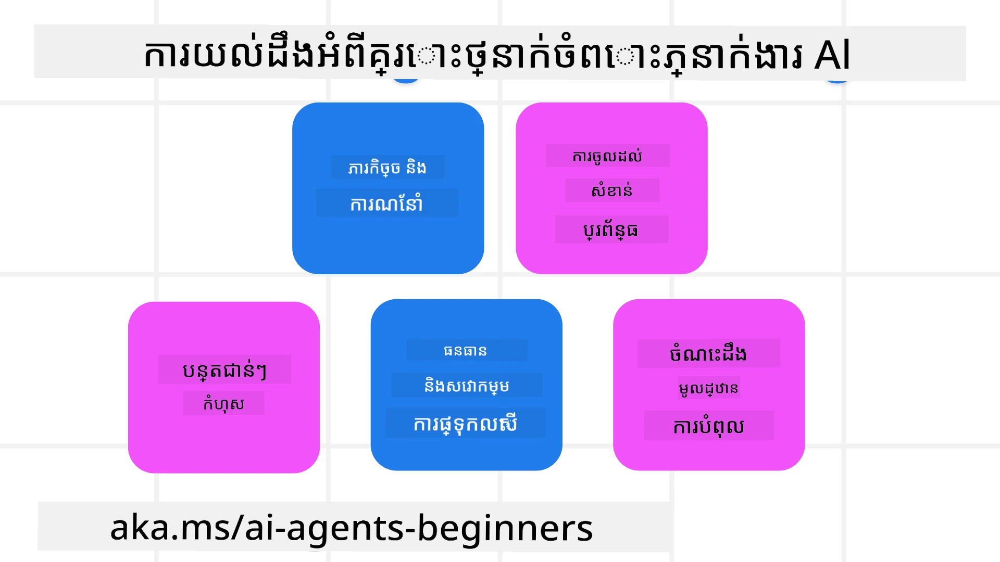
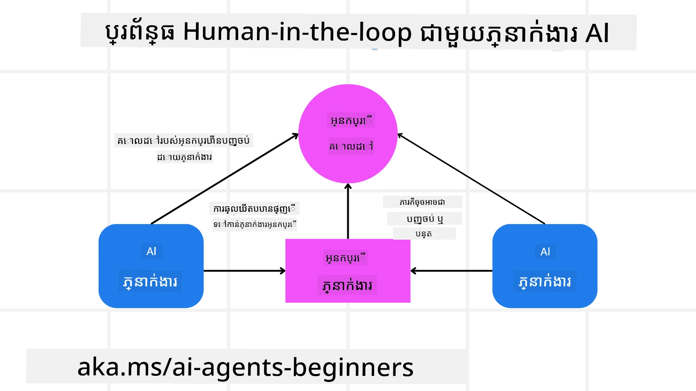

[](https://youtu.be/iZKkMEGBCUQ?si=Q-kEbcyHUMPoHp8L)

> _(ចុចលើរូបភាពខាងលើដើម្បីមើលវីដេអូមេរៀននេះ)_

# ការដាក់សំណង់តំណាង AI ដែល​អាច​ទុក​ជឿ​បាន

## ការណែនាំ

មេរៀននេះនឹងគ្របដណ្តប់៖

- របៀបបង្កើត និងដាក់ចេញ តំណាង AI ដែលសុវត្ថិភាព និងមានប្រសិទ្ធភាព
- ការពិចារណាអំពីសុវត្ថិភាពសំខាន់ៗនៅពេលអភិវឌ្ឍតំណាង AI។
- របៀបរក្សារទិន្នន័យ និងភាពឯកជនរបស់អ្នកប្រើនៅពេលអភិវឌ្ឍតំណាង AI។

## គោលបំណងរៀន

បន្ទាប់ពីបញ្ចប់មេរៀននេះ អ្នកនឹងដឹងរបៀបៈ

- រកឃើញ និងបន្ថយហានិភ័យពេលបង្កើតតំណាង AI។
- អនុវត្តវិធានសុវត្ថិភាពដើម្បីធានាថាទិន្នន័យ និងការចូលប្រើត្រូវបានគ្រប់គ្រងយ៉ាងត្រឹមត្រូវ។
- បង្កើតតំណាង AI ដែលរក្សាភាពឯកជនទិន្នន័យ និងផ្តល់នូវបទពិសោធន៍អ្នកប្រើដែលមានគុណភាព។

## សុវត្ថិភាព

មុនដំបូងយើងមកមើលការដាក់សំណង់កម្មវិធីតំណាងដែលមានសុវត្ថិភាព។ សុវត្ថិភាពមានន័យថា តំណាង AI ធ្វើការតាមរបៀបដែលបានរចនា។ ជាអ្នកបង្កើតកម្មវិធីតំណាង យើងមានវិធីសាស្រ្ត និងឧបករណ៍ដើម្បីបង្កើនសុវត្ថិភាព៖

### ការដាក់សំណង់ស៊ុមសារប្រព័ន្ធ

បើអ្នកធ្លាប់បង្កើតកម្មវិធី AI ដោយប្រើម៉ូឌែលភាសាធំ (LLMs) អ្នកនឹងដឹងពីសារៈសំខាន់នៃការរចនាប្រព័ន្ធចម្លើយឬសារ​ប្រព័ន្ធយ៉ាងរឹងមាំ។ ចម្លើយទាំងនេះកំណត់ច្បាប់មេតា សេចក្ដីណែនាំ និងគោលការណ៍សម្រាប់របៀបដែល LLM នឹងអភិវឌ្ឍជាមួយអ្នកប្រើ និងទិន្នន័យ។

សម្រាប់តំណាង AI ចម្លើយប្រព័ន្ធមានសារៈសំខាន់ជាងនេះទៀត ព្រោះតំណាង AI ត្រូវការសេចក្ដីណែនាំជាក់លាក់ខ្ពស់ក្នុងការបញ្ចប់ភារកិច្ចដែលបានរចនា។

ដើម្បីបង្កើតចម្លើយប្រព័ន្ធដែលអាចពង្រីកបាន យើងអាចប្រើស៊ុមសារប្រព័ន្ធមួយសម្រាប់សំណង់តំណាងមួយឬច្រើនក្នុងកម្មវិធីរបស់យើង៖



#### ជំហានទី 1៖ បង្កើតសារប្រព័ន្ធមេតា

សារមេតានេះនឹងត្រូវបានប្រើដោយ LLM ដើម្បីបង្កើតចម្លើយប្រព័ន្ធសម្រាប់តំណាងដែលយើងបង្កើត។ យើងរចនាវាជាហ模板 ដើម្បីអាចបង្កើតតំណាងច្រើនបានយ៉ាងមានប្រសិទ្ធភាពប្រសិនបើចាំបាច់។

នេះជាគំរូមួយនៃសារប្រព័ន្ធមេតាដែលយើងនឹងផ្តល់ជូន LLM៖

```plaintext
You are an expert at creating AI agent assistants. 
You will be provided a company name, role, responsibilities and other
information that you will use to provide a system prompt for.
To create the system prompt, be descriptive as possible and provide a structure that a system using an LLM can better understand the role and responsibilities of the AI assistant. 
```

#### ជំហានទី 2៖ បង្កើតចម្លើយមូលដ្ឋាន

ជំហានបន្ទាប់គឺបង្កើតចម្លើយមូលដ្ឋានដើម្បីពិពណ៌នាអំពីតំណាង AI។ អ្នកគួរតែបញ្ចូលតួនាទីរបស់តំណាង ភារកិច្ចដែលតំណាងនឹងបញ្ចប់ និងភារកិច្ចផ្សេងទៀតរបស់តំណាង។

នេះជាគំរូមួយ៖

```plaintext
You are a travel agent for Contoso Travel that is great at booking flights for customers. To help customers you can perform the following tasks: lookup available flights, book flights, ask for preferences in seating and times for flights, cancel any previously booked flights and alert customers on any delays or cancellations of flights.  
```

#### ជំហានទី 3៖ ផ្តល់សារប្រព័ន្ធមូលដ្ឋានទៅ LLM

ឥឡូវនេះយើងអាចបង្កើតចម្លើយប្រព័ន្ធនេះឲ្យល្អបំផុតដោយផ្តល់សារប្រព័ន្ធមេតាជាសារប្រព័ន្ធ និងចម្លើយប្រព័ន្ធមូលដ្ឋានរបស់យើង។

នេះនឹងបង្កើតចម្លើយប្រព័ន្ធដែលរចនាល្អសម្រាប់ណែនាំតំណាង AI របស់យើង៖

```markdown
**Company Name:** Contoso Travel  
**Role:** Travel Agent Assistant

**Objective:**  
You are an AI-powered travel agent assistant for Contoso Travel, specializing in booking flights and providing exceptional customer service. Your main goal is to assist customers in finding, booking, and managing their flights, all while ensuring that their preferences and needs are met efficiently.

**Key Responsibilities:**

1. **Flight Lookup:**
    
    - Assist customers in searching for available flights based on their specified destination, dates, and any other relevant preferences.
    - Provide a list of options, including flight times, airlines, layovers, and pricing.
2. **Flight Booking:**
    
    - Facilitate the booking of flights for customers, ensuring that all details are correctly entered into the system.
    - Confirm bookings and provide customers with their itinerary, including confirmation numbers and any other pertinent information.
3. **Customer Preference Inquiry:**
    
    - Actively ask customers for their preferences regarding seating (e.g., aisle, window, extra legroom) and preferred times for flights (e.g., morning, afternoon, evening).
    - Record these preferences for future reference and tailor suggestions accordingly.
4. **Flight Cancellation:**
    
    - Assist customers in canceling previously booked flights if needed, following company policies and procedures.
    - Notify customers of any necessary refunds or additional steps that may be required for cancellations.
5. **Flight Monitoring:**
    
    - Monitor the status of booked flights and alert customers in real-time about any delays, cancellations, or changes to their flight schedule.
    - Provide updates through preferred communication channels (e.g., email, SMS) as needed.

**Tone and Style:**

- Maintain a friendly, professional, and approachable demeanor in all interactions with customers.
- Ensure that all communication is clear, informative, and tailored to the customer's specific needs and inquiries.

**User Interaction Instructions:**

- Respond to customer queries promptly and accurately.
- Use a conversational style while ensuring professionalism.
- Prioritize customer satisfaction by being attentive, empathetic, and proactive in all assistance provided.

**Additional Notes:**

- Stay updated on any changes to airline policies, travel restrictions, and other relevant information that could impact flight bookings and customer experience.
- Use clear and concise language to explain options and processes, avoiding jargon where possible for better customer understanding.

This AI assistant is designed to streamline the flight booking process for customers of Contoso Travel, ensuring that all their travel needs are met efficiently and effectively.

```

#### ជំហានទី 4៖ ត្រួតពិនិត្យ និងកែលម្អ

តម្លៃនៃស៊ុមសារប្រព័ន្ធនេះគឺអាចពង្រីកការបង្កើតចម្លើយប្រព័ន្ធពីតំណាងច្រើនបានយ៉ាងងាយស្រួល និងជួយកែលម្អចម្លើយប្រព័ន្ធរបស់អ្នកជានិរន្តរ៍។ វាកើតឡើងតិចណាស់ដែលចម្លើយប្រព័ន្ធនឹងដំណើរការបានលើកដំបូងសម្រាប់ករណីប្រើប្រាស់របស់អ្នក។ ការអាចធ្វើតម្លើងតូចៗ និងកែលម្អដោយផ្លាស់ប្តូរសារ​ប្រព័ន្ធ​មូលដ្ឋាន ហើយចាប់ផ្តើមវាឡើងវិញតាមប្រព័ន្ធនឹងអនុញ្ញាតឱ្យអ្នកប្រៀបធៀប និងវាយតម្លៃលទ្ធផល។

## ការយល់ដឹងអំពីគ្រោះថ្នាក់

ក្នុងការបង្កើតតំណាង AI ដែលអាចទុកជឿបាន វាជារឿងសំខាន់ក្នុងការយល់ដឹង និងបន្ថយហានិភ័យ និងគ្រោះថ្នាក់ទៅលើតំណាង AI របស់អ្នក។ យើងមកមើលតែខ្លះនៃគ្រោះថ្នាក់វិកលទៅតំណាង AI និងរបៀបដែលអ្នកអាចរៀបចំ និងត្រៀមខ្លួនបានល្អប្រសើរ។



### ភារកិច្ច និងសេចក្ដីណែនាំ

**ការពណ៌នា៖** អ្នកស្ថេីគំរាមកំហែងព្យាយាមផ្លាស់ប្ដូរសេចក្ដីណែនាំឬគោលបំណងរបស់តំណាង AI តាមរយៈការបញ្ចូលសញ្ញាសំគាល់ឬការប៉ោងប៉ាណ។

**ការកាត់បន្ថយ**៖ អនុវត្តន៍ការត្រួតពិនិត្យច្បាស់លាស់ និងកម្មវិធីចម្រាញ់មិនអោយបញ្ចូលសញ្ញាសំគាល់ដែលមានហានិភ័យ មុននឹងតំណាង AI ដំណើរការ។ ពីព្រោះការវាយប្រហារទាំងនេះត្រូវការតំបន់អន្តរាជរាជ ចំណាត់ថ្នាក់ប្រាប់សន្ទស្សន៍ជារឿយៗ ការកំណត់កំណត់ចំនួនសន្ទស្សន៍ក្នុងការសន្ទនា គឺជាវិធីសាស្រ្តផ្សេងទៀតដើម្បីការពារការវាយប្រហារប្រភេទនេះ។

### ការចូលប្រើប្រព័ន្ធសំខាន់ៗ

**ការពណ៌នា**៖ ប្រសិនបើតំណាង AI មានការចូលប្រើប្រព័ន្ធ និងសេវាកម្មដែលរក្សាទិន្នន័យដែលសំខាន់ អ្នកស្ថេីផ្តាច់អាចបំផ្លាញការទំនាក់ទំនងរវាងតំណាងនិងសេវាកម្មទាំងអស់នេះ។ វាអាចជាការវាយប្រហារផ្ទាល់ ឬការប៉ោងប៉ាដើម្បីទទួលបានព័ត៌មានអំពីប្រព័ន្ធទាំងនេះតាមរយៈតំណាង។

**ការកាត់បន្ថយ**៖ តំណាង AI គួរតែមានការចូលប្រើប្រព័ន្ធត្រឹមត្រូវតែតាមការជាចាំបាច់ ដើម្បីការពារការវាយប្រហារប្រភេទនេះ។ ការទំនាក់ទំនងរវាងតំណាង និងប្រព័ន្ធគួរតែមានសុវត្ថិភាពផងដែរ។ ការអនុវត្តន៍ការផ្ទៀងផ្ទាត់ និងការគ្រប់គ្រងការចូលប្រើគឺជាវិធីសាស្រ្តមួយផ្សេងទៀតដើម្បីការពារព័ត៌មាននេះ។

### ការលន់លើរ៉េសូហ្សូ និងសេវាកម្ម

**ការពណ៌នា:** តំណាង AI អាចចូលប្រើឧបករណ៍ និងសេវាកម្មនានា ដើម្បីបញ្ចប់ភារកិច្ច។ អ្នកស្ថេីគំរាមអាចប្រើសមត្ថភាពនេះក្នុងការវាយប្រហារនៅលើសេវាកម្មទាំងនេះ ដោយផ្ញើសំណើរ​ច្រើនតាមរយៈតំណាង AI ដែលអាចបណ្តាលឲ្យប្រព័ន្ធខូចខាត ឬមានការចំណាយខ្ពស់។

**ការកាត់បន្ថយ:** អនុវត្តគោលនយោបាយដើម្បីកំណត់ចំនួនសំណើដែលតំណាង AI អាចផ្ញើទៅសេវាកម្មមួយ។ ការកំណត់ចំនួនសន្ទស្សន៍ក៏ដូចជាសំណើទៅតំណាង AI គឺជាវិធីសាស្រ្តផ្សេងទៀតក្នុងការកាត់បន្ថយការវាយប្រហារប្រភេទនេះ។

### ការបាំជាតិពីមូលដ្ឋានចំណេះដឹង

**ការពណ៌នា:** ប្រភេទការវាយប្រហារនេះមិនចាញ់តំណាង AI ត្រង់ៗទេ តែនៅលើមូលដ្ឋានចំណេះដឹង និងសេវាកម្មផ្សេងទៀតដែលតំណាង AI នឹងប្រើ។ វាអាចរួមមានការបាក់បែកទិន្នន័យ ឬព័ត៌មានដែលតំណាង AI នឹងប្រើ ដើម្បីបញ្ចប់ភារកិច្ច ដែលអាចនាំឲ្យមានការឆ្លើយតបដែលមានភាពមិនសមរម្យ ឬមិនចង់បានទៅអ្នកប្រើ។

**ការកាត់បន្ថយ:** ការត្រួតពិនិត្យទិន្នន័យដែលតំណាង AI នឹងប្រើជាថ្មីៗជាប្រចាំ។ វានិងត្រូវបានធានាថាការចូលប្រើទៅទិន្នន័យនេះមានសុវត្ថិភាព ហើយមានតែបុគ្គលដែលទុកចិត្តបានប្តូរតែប៉ុណ្ណោះ ដើម្បីជៀសវាងការវាយប្រហារប្រភេទនេះ។

### កំហុសគ្រប់ជ្រុងជ្រោយ

**ការពណ៌នា:** តំណាង AI ចូលប្រើឧបករណ៍ និងសេវាកម្មនានា ដើម្បីបញ្ចប់ភារកិច្ច។ កំហុសដែលបណ្តាលមកពីអ្នកស្ថេីគំរាមអាចនាំឲ្យប្រព័ន្ធផ្សេងទៀតដែលតំណាងបានភ្ជាប់ខូចខាត ដែលបង្កើតឲ្យការវាយប្រហារជាយូរជាង និងពិបាកកែលម្អ។

**ការកាត់បន្ថយ**៖ វិធីមួយដើម្បីជៀសវាងនេះគឺឲ្យតំណាង AI ជំនួសធ្វើការប្រតិបត្តិក្នុងបរិបទមានការកំណត់ដូចជា ការប្រតិបត្តិភារកិច្ចក្នុង​កុងតឺន័រដូច Docker ដើម្បីបង្ការការវាយប្រហារប្រព័ន្ធផ្ទាល់។ ការបង្កើតគោលនយោបាយជំនួស (fallback) និងយុទ្ធសាស្រ្តព្យាយាមឡើងវិញពេលប្រព័ន្ធជាក់លាក់បញ្ចេញកំហុសក៏ជាវិធីផ្សេងទៀតសម្រាប់ការការពារការខូចខាតធំទូលាយ។

## មនុស្សនៅក្នុងសង្ស័យ

វិធីមានប្រសិទ្ធភាពមួយទៀតក្នុងការបង្កើតប្រព័ន្ធតំណាង AI ដែលអាចទុកជឿបាន គឺការប្រើប្រាស់មនុស្សនៅក្នុងសង្ស័យ។ វាសាងប្រព័ន្ធដែលបញ្ជូនឲ្យអ្នកប្រើបានផ្តល់មតិយោបល់ចំពោះតំណាងនៅពេលកំពុងដំណើរការ។ អ្នកប្រើដូចជាតំណាងក្នុងប្រព័ន្ធពហុតំណាង ដោយផ្តល់ការអនុម័ត ឬបញ្ចប់ដំណើរការដែលកំពុងរត់។



នេះជាកូដខ្លះប្រើ <i>Microsoft Agent Framework</i> ដើម្បីបង្ហាញពីរបៀបដែលគំនិតនេះត្រូវបានអនុវត្ត៖

```python
import os
from agent_framework.azure import AzureAIProjectAgentProvider
from azure.identity import AzureCliCredential

# បង្កើតអ្នកផ្គត់ផ្គង់ដោយមានការអនុម័តពីមនុស្សក្នុងដំណាក់កាល
provider = AzureAIProjectAgentProvider(
    credential=AzureCliCredential(),
)

# បង្កើតភ្នាក់ងារដោយមានជំហានអនុម័តពីមនុស្ស
response = provider.create_response(
    input="Write a 4-line poem about the ocean.",
    instructions="You are a helpful assistant. Ask for user approval before finalizing.",
)

# អ្នកប្រើអាចពិនិត្យវិញនិងអនុម័តចម្លើយបាន
print(response.output_text)
user_input = input("Do you approve? (APPROVE/REJECT): ")
if user_input == "APPROVE":
    print("Response approved.")
else:
    print("Response rejected. Revising...")
```

## និយោបាយសង្ខេប

ការបង្កើតតំណាង AI ដែលអាចទុកជឿបាន ត្រូវការរចនាដោយយកចិត្តទុកដាក់ វិធានសុវត្ថិភាពរឹងមាំ និងការបញ្ចេញកំណែជាបន្តបន្ទាប់។ ដោយអនុវត្តប្រព័ន្ធស៊ុមសារមេតាដែលមានរចនាសម្ព័ន្ធ ដូច្នេះយល់ដឹងពីគ្រោះថ្នាក់ និងការអនុវត្តវិធានបន្ថយហានិភ័យ អ្នកអភិវឌ្ឍអាចបង្កើតតំណាង AI ដែលមានសុវត្ថិភាព និងមានប្រសិទ្ធភាព។ បន្ថែមពីនេះ វិធីរំលែកមនុស្សក្នុងសង្ស័យធានាថាតំណាង AI នៅតែស្របតាមតម្រូវការអ្នកប្រើ ខណៈដែលកាត់បន្ថយហានិភ័យ។ ជាមួយការវិវឌ្ឍន៍ AI ជាពេលបច្ចុប្បន្ន ការរក្សាភាពសកម្មលើសុវត្ថិភាព ភាពឯកជន និងសំណើរណ៍វិន័យនឹងជាគន្លងសំខាន់ក្នុងការបង្កើតការជឿទុកចិត្ត និងភាពជឿជាក់ក្នុងប្រព័ន្ធដែលដំណើរការដោយ AI។

### មានសំណួរបន្ថែមអំពីការបង្កើតតំណាង AI ដែលអាចទុកជឿបាន?

ចូលរួមក្នុង [Microsoft Foundry Discord](https://aka.ms/ai-agents/discord) ដើម្បីជួបជាមួយអ្នករៀនផ្សេងទៀត ចូលរួមម៉ោងធ្វើការ និងទទួលបានចម្លើយសំណួរពីតំណាង AI របស់អ្នក។

## ឯកសារបន្ថែម

- <a href="https://learn.microsoft.com/azure/ai-studio/responsible-use-of-ai-overview" target="_blank">មើលទិដ្ឋភាពទូទៅអំពី AI មានទំនួលខុសត្រូវ</a>
- <a href="https://learn.microsoft.com/azure/ai-studio/concepts/evaluation-approach-gen-ai" target="_blank">ការវាយតម្លៃម៉ូឌែល AI ធ្វើផលិត និងកម្មវិធី AI</a>
- <a href="https://learn.microsoft.com/azure/ai-services/openai/concepts/system-message?context=%2Fazure%2Fai-studio%2Fcontext%2Fcontext&tabs=top-techniques" target="_blank">សារប្រព័ន្ធសុវត្ថិភាព</a>
- <a href="https://blogs.microsoft.com/wp-content/uploads/prod/sites/5/2022/06/Microsoft-RAI-Impact-Assessment-Template.pdf?culture=en-us&country=us" target="_blank">គំរូវាយតម្លៃហានិភ័យ</a>

## មេរៀនមុន

[Agentic RAG](../05-agentic-rag/README.md)

## មេរៀនបន្ទាប់

[គំរូរចនាផែនការ](../07-planning-design/README.md)

---

<!-- CO-OP TRANSLATOR DISCLAIMER START -->
**ការបដិសេធ**៖  
ឯកសារនេះត្រូវបានប្រែសម្រួលប្រើសេវាកម្មបកប្រែ AI [Co-op Translator](https://github.com/Azure/co-op-translator)។ ខណៈពេលយើងខិតខំសំរាប់ភាពត្រឹមត្រូវ សូមយល់ថាប្រែសម្រួលដោយស្វ័យប្រវត្តិសម្បត្តិប្រហែលជាអាចមានកំហុស ឬភាពមិនត្រឹមត្រូវមួយចំនួន។ ឯកសារដើមទាំងដើមដែលមានភាសារដើមគួរត្រូវបានយកជាទ្រព្យសម្បត្តិដ៏បានអនុម័ត។ សម្រាប់ព័ត៌មានសំខាន់ៗ សូមផ្តល់អនុសាសន៍ឱ្យមានការបកប្រែដោយមនុស្សជំនាញវិជ្ជាជីវៈ។ យើងមិនទទួលខុសត្រូវចំពោះការយល់ច្រឡំ ឬការបកស្រាយខុសខាតណាមួយដែលកើតឡើងពីការប្រើប្រាស់ការបកប្រែនេះឡើយ។
<!-- CO-OP TRANSLATOR DISCLAIMER END -->