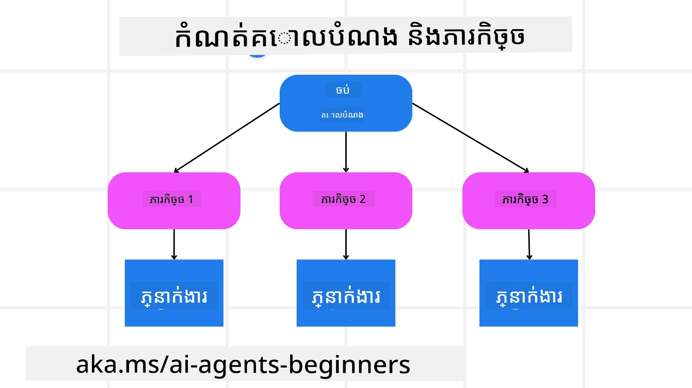

[](https://youtu.be/kPfJ2BrBCMY?si=9pYpPXp0sSbK91Dr)

> _(ចុចលើរូបភាពខាងលើដើម្បីមើលវីដេអូមេរៀននេះ)_

# រចនាតម្រៀបផែនការ

## ការណែនាំ

មេរៀននេះនឹងគ្របដណ្តប់

* ការបញ្ជាក់គោលដៅទាំងមូលដែលច្បាស់លាស់ និងបំបែកភារកិច្ចស្មុគស្មាញទៅជាភារកិច្ចដែលគ្រប់គ្រងបាន។
* ប្រើប្រាស់លទ្ធផលដែលមានរចនាសម្ព័ន្ធសម្រាប់ការឆ្លើយតបដែលជឿជាក់បានច្រើន និងអាចអានដោយម៉ាស៊ីន។
* អនុវត្តវិធីសាស្រ្តដែលបើកសកម្មភាពដោយព្រឹត្តិការណ៍ដើម្បីដោះស្រាយភារកិច្ចឌីណាមិចនិងការបញ្ចូលព័ត៌មានដែលមិនរំពឹងទុក។

## គោលបំណងការសិក្សា

បន្ទាប់ពីបញ្ចប់មេរៀននេះ អ្នកនឹងមានការ​យល់ដឹងអំពី៖

* រកឃើញ និងកំណត់គោលដៅទាំងមូលសម្រាប់តំណាង AI ដើម្បីធានាថាវាទទួលបានច្បាស់ថាត្រូវធ្វើអ្វី។
* បំបែកភារកិច្ចស្មុគស្មាញទៅជាភារកិច្ចរងដែលគ្រប់គ្រងបានហើយរៀបចំពួកវាទៅក្នុងលំដាប់ត្រឹមត្រូវ។
* រៀបចំ​តំណាងជាមួយឧបករណ៍ត្រឹមត្រូវ (ឧ. ឧបករណ៍ស្វែងរក ឬឧបករណ៍វិភាគទិន្នន័យ) ពីចំពោះពេលវេលានិងវិធីសាស្រ្តដែលពួកវាត្រូវបានប្រើ ហើយដោះស្រាយស្ថានភាពដែលមិនរំពឹងទុក។
* វាយតម្លៃលទ្ធផលរងៗ វាស់បរិមាណការសម្របសម្រួល និងធ្វើមន្ត្រីលើសកម្មភាពដើម្បីធ្វើឲ្យលទ្ធផលចុងក្រោយប្រសើរឡើង។

## ការកំណត់គោលដៅទាំងមូល និងការបំបែកភារកិច្ច



ភារកិច្ចភាគច្រើនក្នុងលោកពិតជាស្មុគស្មាញពេកមិនអាចដោះស្រាយក្នុងជំហានតែមួយបាន។ ហើយភាសាសម្រាប់តំណាង AI ត្រូវការគោលបំណងដ៏ខ្លីសម្រាប់ណែនាំផែនការ និងសកម្មភាពរបស់វា។ ឧទាហរណ៍, សូមពិចារណាគោលដៅ៖

    "បង្កើតផែនការធ្វើដំណើរពីរបីថ្ងៃ។"

បើទោះបីជាវាងាយស្រួលក្នុងការបញ្ជាក់ អាចនឹកស្រមៃថាវាត្រូវបានបន្ថែមការបញ្ជាក់បន្ថែម។ គោលដៅច្បាស់លាស់ប្រសើរជាងនេះ តំណាង (និងអ្នករៀបចំបុគ្គលណាមួយ) អាចផ្តោតលើការសម្រេចបានលទ្ធផលត្រឹមត្រូវ ដូចជាការបង្កើតផែនការធ្វើដំណើរសព្វថ្ងៃដែលមានជម្រើសអាកាសចរណ៍ ព្រមទាំងអាហារដ្ឋាន សណ្ឋាគារ និងសកម្មភាពផ្ដល់អនុសាសន៍។

### ការបំបែកភារកិច្ច

ភារកិច្ចធំឬស្មុគស្មាញត្រូវបានគ្រប់គ្រងបានកាន់តែធំឡើងនៅពេលបំបែកជាភារកិច្ចរងដែលមានគោលបំណងច្បាស់លាស់។
សម្រាប់ឧទាហរណ៍ផែនការធ្វើដំណើរនេះ អ្នកអាចបំបែកគោលដៅទៅជា៖

* ការកក់សំបុត្រហោះហើរ
* ការកក់សណ្ឋាគារ
* ចាប់ជួលរថយន្ត
* ការប្តូរផ្ទាល់ខ្លួន

ភារកិច្ចរងនីមួយៗអាចត្រូវបានដោះស្រាយដោយតំណាងឬដំណើរការដាច់ពីរមុខ។ តំណាងម្នាក់អាចផ្តោតលើការស្វែងរកការដំណើរការហោះហើរល្អបំផុត ម្នាក់ផ្សេងទៀតផ្តោតលើការកក់សណ្ឋាគារ។ តំណាងប្រតិបត្តិការឬ "តំណាងក្រោមហត្ថ" អាចប្រមូលបញ្ជូលលទ្ធផលទាំងនេះជាផែនការមួយសព្វវចនៈសម្រាប់អ្នកប្រើចុងក្រោយ។

វិធីសាស្រ្តមូឌ្យុលនេះក៏អនុញ្ញាតឲ្យមានការកែលម្អជាដំណាក់កាលផងដែរ។ ឧទាហរណ៍ អ្នកអាចបន្ថែមតំណាងឯកទេសសម្រាប់អនុសាសន៍អាហារឬសកម្មភាពក្នុងតំបន់ ហើយកែលម្អផែនការតាមរយៈពេលវេលា។

### លទ្ធផលមានរចនាសម្ព័ន្ធ

ម៉ូដែលភាសាធំ (LLMs) អាចបង្កើតលទ្ធផលដែលមានរចនាសម្ព័ន្ធ (ឧ. JSON) ដែលងាយស្រួលសម្រាប់តំណាងក្រោមហត្ថឬម៉ាស៊ីនស៊ីវីសដើម្បីបំលែង និងដំណើរការ។ វាមានប្រយោជន៍យ៉ាងខ្លាំងនៅក្នុងបរិបទម៉ុលទីហ្សេនដែលយើងអាចអនុវត្តភារកិច្ចទាំងនេះបន្ទាប់ពីទទួលបានលទ្ធផលផែនការ។

ស្លីប Python ខាងក្រោមបង្ហាញពីតំណាងផែនការសាមញ្ញដែលបំបែកគោលដៅជាភារកិច្ចរង និងបង្កើតផែនការដែលមានរចនាសម្ព័ន្ធ៖

```python
from pydantic import BaseModel
from enum import Enum
from typing import List, Optional, Union
import json
import os
from typing import Optional
from pprint import pprint
from agent_framework.azure import AzureAIProjectAgentProvider
from azure.identity import AzureCliCredential

class AgentEnum(str, Enum):
    FlightBooking = "flight_booking"
    HotelBooking = "hotel_booking"
    CarRental = "car_rental"
    ActivitiesBooking = "activities_booking"
    DestinationInfo = "destination_info"
    DefaultAgent = "default_agent"
    GroupChatManager = "group_chat_manager"

# ម៉ូដែលដំណើរការសកម្មភាពធ្វើដំណើរ
class TravelSubTask(BaseModel):
    task_details: str
    assigned_agent: AgentEnum  # យើងចង់ផ្ដល់ការងារនេះទៅឱ្យភ្នាក់ងារ

class TravelPlan(BaseModel):
    main_task: str
    subtasks: List[TravelSubTask]
    is_greeting: bool

provider = AzureAIProjectAgentProvider(credential=AzureCliCredential())

# កំណត់សាររបស់អ្នកប្រើប្រាស់
system_prompt = """You are a planner agent.
    Your job is to decide which agents to run based on the user's request.
    Provide your response in JSON format with the following structure:
{'main_task': 'Plan a family trip from Singapore to Melbourne.',
 'subtasks': [{'assigned_agent': 'flight_booking',
               'task_details': 'Book round-trip flights from Singapore to '
                               'Melbourne.'}
    Below are the available agents specialised in different tasks:
    - FlightBooking: For booking flights and providing flight information
    - HotelBooking: For booking hotels and providing hotel information
    - CarRental: For booking cars and providing car rental information
    - ActivitiesBooking: For booking activities and providing activity information
    - DestinationInfo: For providing information about destinations
    - DefaultAgent: For handling general requests"""

user_message = "Create a travel plan for a family of 2 kids from Singapore to Melbourne"

response = client.create_response(input=user_message, instructions=system_prompt)

response_content = response.output_text
pprint(json.loads(response_content))
```

### តំណាងផែនការជាមួយការរៀបចំច្រើនតំណាង

ក្នុងឧទាហរណ៍នេះ តំណាងប្រព័ន្ធរោទិ៍សេម៉ង់ទិកទទួលសំណើរពីអ្នកប្រើ (ឧ. "ខ្ញុំត្រូវការផែនការសណ្ឋាគារសម្រាប់ដំណើររបស់ខ្ញុំ។")។

អ្នករៀបចំផែនការនៅបន្ទាប់៖

* ទទួលផែនការសណ្ឋាគារ៖ អ្នករៀបចំផែនការទទួលបានសាររបស់អ្នកប្រើហើយ បើស្ដីពីពាក្យបញ្ជាស៊ីស្ទឹម (រួមបញ្ចូលព័ត៌មានពីតំណាងដែលមាន) បង្កើតផែនការធ្វើដំណើរដែលមានរចនាសម្ព័ន្ធ។
* បញ្ជីតំណាង និងឧបករណ៍របស់ពួកគេ៖ ការចុះឈ្មោះតំណាងកាន់បញ្ជីតំណាង (ឧ. សម្រាប់ហោះហើរ សណ្ឋាគារ ជួលរថយន្ត និងសកម្មភាព) រួមជាមួយមុខងារ ឬឧបករណ៍ដែលពួកគេចោទ។
* ផ្ញើផែនការទៅតំណាងដែលសមស្រប៖ អាស្រ័យលើចំនួនភារកិច្ចរង អ្នករៀបចំផែនការ អាចផ្ញើសារទៅតំណាងជាក់លាក់ (សម្រាប់សេណារីយឯកSpamីតិក) ឬសម្របសម្រួលតាមអ្នកគ្រប់គ្រងជជែកក្រុមសម្រាប់ការសហការជាមួយម៉ុលទីតំណាង។
* សង្ខេបលទ្ធផល៖ ចុងក្រោយ អ្នករៀបចំផែនការសង្ខេបផែនការបង្កើតឡើងអោយច្បាស់លាស់។
ឧទាហរណ៍កូដ Python ខាងក្រោមបង្ហាញជំហានទាំងនេះ៖

```python

from pydantic import BaseModel

from enum import Enum
from typing import List, Optional, Union

class AgentEnum(str, Enum):
    FlightBooking = "flight_booking"
    HotelBooking = "hotel_booking"
    CarRental = "car_rental"
    ActivitiesBooking = "activities_booking"
    DestinationInfo = "destination_info"
    DefaultAgent = "default_agent"
    GroupChatManager = "group_chat_manager"

# ម៉ូដែលក្រោមភារកិច្ចធ្វើដំណើរ

class TravelSubTask(BaseModel):
    task_details: str
    assigned_agent: AgentEnum # យើងចង់ផ្ដល់ភារកិច្ចនោះទៅអ្នកតំណាង

class TravelPlan(BaseModel):
    main_task: str
    subtasks: List[TravelSubTask]
    is_greeting: bool
import json
import os
from typing import Optional

from agent_framework.azure import AzureAIProjectAgentProvider
from azure.identity import AzureCliCredential

# បង្កើត​អតិថិជន

provider = AzureAIProjectAgentProvider(credential=AzureCliCredential())

from pprint import pprint

# កំណត់សារអ្នកប្រើ

system_prompt = """You are a planner agent.
    Your job is to decide which agents to run based on the user's request.
    Below are the available agents specialized in different tasks:
    - FlightBooking: For booking flights and providing flight information
    - HotelBooking: For booking hotels and providing hotel information
    - CarRental: For booking cars and providing car rental information
    - ActivitiesBooking: For booking activities and providing activity information
    - DestinationInfo: For providing information about destinations
    - DefaultAgent: For handling general requests"""

user_message = "Create a travel plan for a family of 2 kids from Singapore to Melbourne"

response = client.create_response(input=user_message, instructions=system_prompt)

response_content = response.output_text

# ព្រីនមាតិកាតបស្ទង់បន្ទាប់ពីផ្ទុកវាជា JSON

pprint(json.loads(response_content))
```

អ្វីដែលបន្ទាប់គឺលទ្ធផលពីកូដមុន ហើយអ្នកអាចប្រើលទ្ធផលដែលមានរចនាសម្ព័ន្ធនេះដើម្បីផ្ញើទៅ `assigned_agent` និងសង្ខេបផែនការធ្វើដំណើរដល់អ្នកប្រើចុងក្រោយ។

```json
{
    "is_greeting": "False",
    "main_task": "Plan a family trip from Singapore to Melbourne.",
    "subtasks": [
        {
            "assigned_agent": "flight_booking",
            "task_details": "Book round-trip flights from Singapore to Melbourne."
        },
        {
            "assigned_agent": "hotel_booking",
            "task_details": "Find family-friendly hotels in Melbourne."
        },
        {
            "assigned_agent": "car_rental",
            "task_details": "Arrange a car rental suitable for a family of four in Melbourne."
        },
        {
            "assigned_agent": "activities_booking",
            "task_details": "List family-friendly activities in Melbourne."
        },
        {
            "assigned_agent": "destination_info",
            "task_details": "Provide information about Melbourne as a travel destination."
        }
    ]
}
```

កំណត់ត្រាមួយដែលមានឧទាហរណ៍កូដខាងលើអាចរកបាន [នៅទីនេះ](07-python-agent-framework.ipynb)។

### ការរៀបចំបន្តបន្ទាប់

ភារកិច្ចខ្លះត្រូវការការប្រែក្រាស់វិញ ឬការរៀបចំផែនការ​ឡើងវិញ ដែលលទ្ធផលនៃភារកិច្ចរងមួយមានឥទ្ធិពលលើមួយនៅបន្ទាប់។ ឧទាហរណ៍ ប្រសិនបើតំណាងរកឃើញទំរង់ទិន្នន័យមិនរំពឹងទុកនៅពេលកក់សំបុត្រហោះហើរ វាអាចត្រូវបង្កើតយុទ្ធសាស្រ្តថ្មីមុនចាប់ផ្តើមការកក់សណ្ឋាគារតទៅ។

លើសពីនេះ មតិយោបល់អ្នកប្រើ (ឧ. មនុស្សសម្រេចថាពួកគេចង់ហោះហើរពេលមុន) អាចបង្កើតការរៀបចំផែនការហាក់បីដូចជាផ្នែកខ្លះឡើងវិញ។ វិធីសាស្រ្តឌីណាមិច និងមានការប្រែក្រាស់បន្តផងនេះធានាថាដំណោះស្រាយចុងក្រោយត្រូវបានសម្របសម្រួលជាមួយលក្ខខណ្ឌពិតប្រាកដ និងចំណង់ចំណូលចិត្តអ្នកប្រើដែលកំពុងផ្លាស់ប្តូរ។

ឧ. កូដគំរូ

```python
from agent_framework.azure import AzureAIProjectAgentProvider
from azure.identity import AzureCliCredential
#.. ដូចជា​កូដ​មុន និង​ផ្ទេរ​ប្រវត្តិ​អ្នកប្រើប្រាស់ ផែនការបច្ចុប្បន្ន

system_prompt = """You are a planner agent to optimize the
    Your job is to decide which agents to run based on the user's request.
    Below are the available agents specialized in different tasks:
    - FlightBooking: For booking flights and providing flight information
    - HotelBooking: For booking hotels and providing hotel information
    - CarRental: For booking cars and providing car rental information
    - ActivitiesBooking: For booking activities and providing activity information
    - DestinationInfo: For providing information about destinations
    - DefaultAgent: For handling general requests"""

user_message = "Create a travel plan for a family of 2 kids from Singapore to Melbourne"

response = client.create_response(
    input=user_message,
    instructions=system_prompt,
    context=f"Previous travel plan - {TravelPlan}",
)
# .. ធ្វើផែនការ​ម្ដងទៀត និង​ផ្ញើ​តួនាទី​ទៅ​ឲ្យភ្នាក់ងារពាក់ព័ន្ធ
```

សម្រាប់ការរៀបចំផែនការទូលំទូលាយ សូមចូលមើល Magnetic One <a href="https://www.microsoft.com/research/articles/magentic-one-a-generalist-multi-agent-system-for-solving-complex-tasks" target="_blank">Blogpost</a> សម្រាប់ដោះស្រាយភារកិច្ចស្មុគស្មាញ។

## សង្ខេប

នៅក្នុងអត្ថបទនេះ យើងបានមើលឧទាហរណ៍ពីរបៀបដែលយើងអាចបង្កើតអ្នករៀបចំផែនការដែលអាចជ្រើសរើសតំណាងដែលមានស្រាប់ដែលបានកំណត់។ លទ្ធផលអ្នករៀបចំផែនការពីរបែងចែកភារកិច្ចហើយប្រគល់ភារកិច្ចទៅតំណាង ដូច្នេះវាអាចអនុវត្តបាន។ ប៉ុន្តែត្រូវសន្មតថាតំណាងទាំងនោះមានការ доступа ទៅមុខងារ/ឧបករណ៍ដែលគួរត្រូវបានប្រើសម្រាប់ការងារ។ បន្ថែមពីលើតំណាង អ្នកអាចបញ្ចូលរោមទាំងផ្សេងទៀតដូចជា ការត្រួតពិនិត្យ, សង្ខេប និងការជជែកក្នុងរង្វង់ ផងដែរ ដើម្បីផ្លាស់ប្តូរតែមួយរបស់អ្នក។

## ឯកសារបន្ថែម

Magentic One - ប្រព័ន្ធតំណាងច្រើនជាលក្ខណៈទូទៅសម្រាប់ដោះស្រាយភារកិច្ចស្មុគស្មាញ ដែលបានទទួលលទ្ធផលអស្ចារ្យលើបេនចមាគ្រាស់តំណាងជាច្រើន។ ឯកសារយោង: <a href="https://www.microsoft.com/research/articles/magentic-one-a-generalist-multi-agent-system-for-solving-complex-tasks" target="_blank">Magentic One</a>. ក្នុងការអនុវត្តនេះ អ្នករៀបចំផែនការបង្កើតផែនការពិសេសសម្រាប់ភារកិច្ចនីមួយៗ ហើយប្រគល់ភារកិច្ចទាំងនេះទៅដល់តំណាងដែលមានស្រាប់។ ជាបន្ថែមពីការរៀបចំផែនការ អ្នករៀបចំផែនការនេះក៏ប្រើយន្ដការតាមដានដើម្បីត្រួតពិនិត្យការរីកចម្រើននៃភារកិច្ច និងរៀបចំផែនការឡើងវិញទៅតាមការតម្រូវ។

### មានសំណួរជាច្រើនទៀតអំពីរចនាទម្រង់ផែនការទេ?

ចូលរួមនៅ [Microsoft Foundry Discord](https://aka.ms/ai-agents/discord) ដើម្បីជួបជាមួយអ្នករៀនផ្សេងទៀត ចូលរួមក្នុងម៉ោងការិយាល័យ និងទទួលបានចម្លើយសំណួរអំពី AI Agents របស់អ្នក។

## មេរៀនមុន

[សង់អាជីព AI Agents ដែលគួរឱ្យទុកចិត្ត](../06-building-trustworthy-agents/README.md)

## មេរៀនបន្ទាប់

[រចនាទម្រង់ម៉ុលទីតំណាង](../08-multi-agent/README.md)

---

<!-- CO-OP TRANSLATOR DISCLAIMER START -->
**ការប្រកាសលែងទទួលខុសត្រូវ**៖  
ឯកសារនេះត្រូវបានបកប្រែដោយប្រើសេវាកម្មបកប្រែ AI [Co-op Translator](https://github.com/Azure/co-op-translator)។ ខណៈពេលយើងខិតខំប្រឹងប្រែងសម្រាប់ភាពត្រឹមត្រូវ សូមប្រយ័ត្នថាការបកប្រែដោយស្វ័យប្រវត្តិអាចមានករណីកំហុសឬការមិនត្រឹមត្រូវ។ ឯកសារដើមនៅក្នុងភាសា​ដើមគួរត្រូវបានចាត់ទុកជាជំរើសហត្ថលេខាផ្លូវការ។ សម្រាប់ព័ត៌មានដែលមានសារៈសំខាន់ គួរតែប្រើការបកប្រែដោយអ្នកជំនាញមនុស្ស។ យើងមិនទទួលខុសត្រូវចំពោះការយល់ច្រឡំ ឬការបកប្រែខុសផ្សេងៗដែលកើតចេញពីការប្រើប្រាស់ការបកប្រែនេះឡើយ។
<!-- CO-OP TRANSLATOR DISCLAIMER END -->