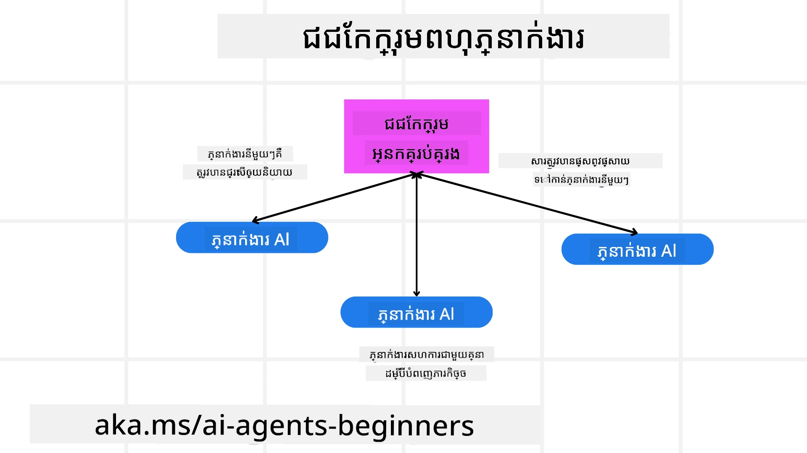
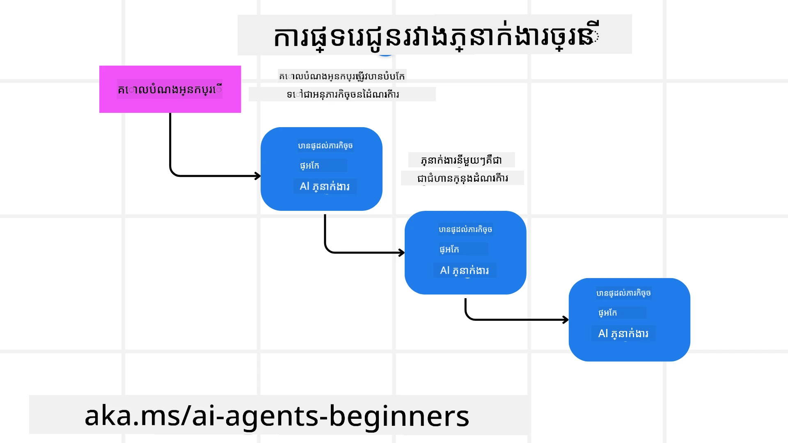
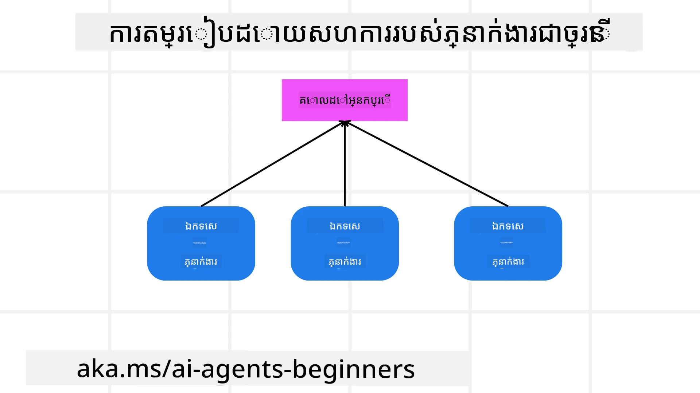

> _(ចុចលើរូបភាពខាងលើដើម្បីមើលវីដេអូចំណងជើងនេះ)_

# លំនាំរចនាសម្ព័ន្ធភ្នាក់ងារច្រើន

ពេលដែលអ្នកចាប់ផ្តើមធ្វើការលើគម្រោងដែលពាក់ព័ន្ធនឹងភ្នាក់ងារច្រើន អ្នកត្រូវតែពិចារណាលំនាំរចនាសម្ព័ន្ធភ្នាក់ងារច្រើន។ ទោះយ៉ាងណា វាអាចមិនច្បាស់ភ្លាមៗថា ពេលណាគួរតែប្ដូរទៅប្រើភ្នាក់ងារច្រើន និងអត្ថប្រយោជន៍របស់វាជាអ្វី។

## ណែនាំ

ក្នុងមេរៀននេះ យើងកំពុងស្វែងរកចម្លើយសម្រាប់សំណួរទាំងនេះ៖

- តើមានស្ថានភាពណាខ្លះដែលអាចប្រើប្រាស់ភ្នាក់ងារច្រើនបាន?
- តើអត្ថប្រយោជន៍របស់ការប្រើប្រាស់ភ្នាក់ងារច្រើនមានអ្វីខ្លះ បើប្រៀបធៀបទៅនឹងភ្នាក់ងារតែមួយធ្វើភារកិច្ចច្រើន?
- តើមានក្រុមប្លុកសំណង់អ្វីខ្លះសម្រាប់អនុវត្តលំនាំរចនាសម្ព័ន្ធភ្នាក់ងារច្រើន?
- តើយើងមានវិសាលភាពយ៉ាងដូចម្តេចចំពោះរបៀបដែលភ្នាក់ងារច្រើនគ្នាប្រតិបត្តិការជាមួយគ្នា?

## គោលបំណងសិក្សា

បន្ទាប់ពីមេរៀននេះ អ្នកគួរតែអាច៖

- សម្គាល់ស្ថានភាពដែលអាចប្រើប្រាស់ភ្នាក់ងារច្រើនបាន
- ត្រួតពិនិត្យអត្ថប្រយោជន៍នៃការប្រើប្រាស់ភ្នាក់ងារច្រើន បើប្រៀបធៀបជាមួយភ្នាក់ងារតែមួយ
- យល់ដឹងអំពីក្រុមប្លុកសំណង់សម្រាប់អនុវត្តលំនាំរចនាសម្ព័ន្ធភ្នាក់ងារច្រើន

រូបភាពធំនៃបញ្ហាជាគន្លងណា?

*ភ្នាក់ងារច្រើនគឺជាលំនាំរចនាសម្ព័ន្ធដែលអនុញ្ញាតឲ្យភ្នាក់ងារច្រើនធ្វើការជាមួយគ្នាដើម្បីសម្រេចគោលដៅរួមមួយ*។

លំនាំនេះត្រូវបានប្រើយ៉ាងទូលំទូលាយនៅក្នុងមុខវិជ្ជាតំបន់នានា រួមទាំងរ៉ូបូតិច ប្រព័ន្ធរុំរើសដោយដោយស្វ័យប្រវត្តិ និងកុំព្យូទ័រចែកចាយ។

## ស្ថានភាពដែលអាចប្រើប្រាស់ភ្នាក់ងារច្រើនបាន

តើស្ថានភាពណាខ្លះដែលជាករណីប្រើប្រាស់ល្អសម្រាប់ការប្រើប្រាស់ភ្នាក់ងារច្រើន? ចម្លើយគឺមានស្ថានភាពជាច្រើនដែលការប្រើប្រាស់ភ្នាក់ងារច្រើនមានប្រយោជន៍ ជាពិសេសនៅករណីដូចខាងក្រោម៖

- **ភារកិច្ចធំនានា**៖ ភារកិច្ចធំអាចបំបែកជាផ្នែកតូចៗ ហើយមានការចាត់តាំងទៅឲ្យភ្នាក់ងារផ្សេងៗ តម្លើងការប្រតិបត្តិការរំដោះសមីកកម្ម និងបញ្ចប់បានលឿន។ ឧទាហរណ៍នៃរឿងនេះគឺករណីនៃការប្រតិបត្តិការដំណើរការទិន្នន័យធំ។
- **ភារកិច្ចស្មុគស្មាញ**៖ ភារកិច្ចស្មុគស្មាញ ដូចជា ភារកិច្ចធំអាចបំបែកជាផ្នែកតូចៗ ហើយចាត់តាំងទៅឲ្យភ្នាក់ងារផ្សេងៗ ដែលមានជំនាញពិសេសក្នុងផ្នែកណាមួយ។ ឧទាហរណ៍ល្អគឺករណីរថយន្តអាតូម៉ាទិក ដែលភ្នាក់ងារផ្សេងៗគ្រប់គ្រងការរុករក ការរកឃើញឧបសគ្គ និងការប្រាស្រ័យទាក់ទងជាមួយរថយន្តផ្សេងទៀត។
- **ជំនាញចម្រុះ**៖ ភ្នាក់ងារផ្សេងៗអាចមានជំនាញចម្រុះ អនុញ្ញាតឲ្យពួកគេដោះស្រាយផ្នែកនានារបស់ភារកិច្ចបានមានប្រសិទ្ធភាពជាងភ្នាក់ងារតែមួយ។ នេះគឺឧទាហរណ៍ល្អនៅវិស័យសុខាភិបាល ដែលភ្នាក់ងារអាចគ្រប់គ្រងការធ្វើវេជ្ជសាស្ត្រ ផែនការព្យាបាល និងការត្រួតពិនិត្យអ្នកជំងឺ។

## អត្ថប្រយោជន៍នៃការប្រើប្រាស់ភ្នាក់ងារច្រើនជាមួយភ្នាក់ងារតែមួយ

ប្រព័ន្ធភ្នាក់ងារតែមួយអាចដំណើរការល្អសម្រាប់ភារកិច្ចសាមញ្ញ ប៉ុន្តាសម្រាប់ភារកិច្ចស្មុគស្មាញ ការប្រើប្រាស់ភ្នាក់ងារច្រើនអាចផ្តល់អត្ថប្រយោជន៍ជាច្រើន៖

- **ជំនាញពិសេស**៖ ភ្នាក់ងារនីមួយៗអាចមានជំនាញពិសេសសម្រាប់ភារកិច្ចជាក់លាក់។ វាបង្ហាញថា ភ្នាក់ងារតែមួយដែលមិនមានជំនាញពិសេស អាចត្រូវប៉ះទង្គិចនៅពេលដែលត្រូវដោះស្រាយភារកិច្ចស្មុគស្មាញ។ វាអាចបង្អាក់សកម្មភាពដោយធ្វើរឿងដែលខុសពីជំនាញរបស់វា។
- **ការពង្រីកបានងាយ**៖ វាងាយស្រួលក្នុងការពង្រីកប្រព័ន្ធដោយបន្ថែមភ្នាក់ងារជាច្រើន ជាជាងដាក់ទម្រង់ធ្ងន់លើភ្នាក់ងារតែមួយ។
- **ការអតិផរណាទ្រព្យធន់នឹងកំហុស**៖ ប្រសិនបើភ្នាក់ងារតែមួយបរាជ័យ ភ្នាក់ងារផ្សេងទៀតអាចបន្តដំណើរការ រក្សាការរំពឹងទុកប្រព័ន្ធឲ្យមានភាពរាក់ទាក់។

យើងចូរយកឧទាហរណ៍មួយ គឺ ការកក់ដំណើរទៅកាន់អ្នកប្រើ។ ប្រព័ន្ធភ្នាក់ងារតែមួយត្រូវតែដោះស្រាយគ្រប់ផ្នែកនៃដំណើរការកក់ដំណើរ ចាប់ពីស្វែងរកសំបុត្រហើរ កក់សណ្ឋាគារ និងជួលរថយន្ត។ ដើម្បីសម្រេចបាននេះដោយភ្នាក់ងារតែមួយ ភ្នាក់ងារនោះគួរតែមានឧបករណ៍សម្រាប់ដោះស្រាយភារកិច្ចទាំងអស់។ របៀបនេះអាចនាំឲ្យប្រព័ន្ធស្មុគស្មាញនិងដ៏ឯកត្តា ដែលពិបាកថែទាំនិងពង្រីក។ នៃប្រព័ន្ធភ្នាក់ងារច្រើន វាអាចមានភ្នាក់ងារផ្សេងៗដែលមានជំនាញក្នុងការស្វែងរកសំបុត្រហើរ កក់សណ្ឋាគារ និងជួលរថយន្ត។ វានឹងធ្វើឲ្យប្រព័ន្ធមានរចនាសម្ព័ន្ធប្លុក មានភាពងាយស្រួលក្នុងការថែទាំ និងពង្រីក។

ប្រៀបធៀបទៅនឹងការិយាល័យទេសចរណ៍ជាក្រុមហ៊ុនតូចៗមួយ បើប្រៀបធៀបជាមួយក្រុមហ៊ុនធ្វើដំណើរលេចធ្លោជាច្រើន។ ក្រុមហ៊ុនតូចៗនោះនឹងមានភ្នាក់ងារតែមួយដោះស្រាយគ្រប់ផ្នែកនៃដំណើរការកក់ ដូច្នេះ ក្រុមហ៊ុនលេចធ្លោក្នុងចំណោមនឹងមានភ្នាក់ងារផ្សេងៗគ្រប់គ្រងផ្នែកនានា។

## ក្រុមប្លុកសំណង់សម្រាប់អនុវត្តលំនាំរចនាសម្ព័ន្ធភ្នាក់ងារច្រើន

មុនពេលអ្នកអាចអនុវត្តលំនាំរចនាសម្ព័ន្ធភ្នាក់ងារច្រើន អ្នកត្រូវយល់ពីក្រុមប្លុកសំណង់ដែលបង្កើតឡើងជាលំនាំនេះ។

យើងចូរធ្វើឧទាហរណ៍ជាក់លាក់ម្ដងទៀត ដោយមើលការកក់ដំណើរដោយអ្នកប្រើ។ ក្នុងករណីនេះ ក្រុមប្លុកសំណង់រួមមាន៖

- **ការប្រាស្រ័យទាក់ទងរបស់ភ្នាក់ងារ**៖ ភ្នាក់ងារស្វែងរកសំបុត្រហើរ កក់សណ្ឋាគារ និងជួលរថយន្ត ត្រូវតែប្រាស្រ័យទាក់ទងនិងចែករំលែកព័ត៌មានអំពីចំណូលចិត្ត និងសេចក្តីកំណត់របស់អ្នកប្រើ។ អ្នកត្រូវតែសម្រេចលើពិធីការនិងវិធីសាស្រ្តសម្រាប់ការប្រាស្រ័យទាក់ទងនេះ។ វាមានន័យថា ភ្នាក់ងារស្វែងរកសំបុត្រហើរត្រូវតែប្រាស្រ័យទាក់ទងជាមួយភ្នាក់ងារកក់សណ្ឋាគារដើម្បីធានាថាសណ្ឋាគារត្រូវបានកក់សំរាប់កាលបរិច្ឆេទដូចគ្នានឹងសំបុត្រហើរ។ នេះមានន័យថា ភ្នាក់ងារត្រូវចែករំលែកពត៌មានអំពីកាលបរិច្ឆេទធ្វើដំណើរបស់អ្នកប្រើ ដូច្នេះ អ្នកត្រូវសម្រេច *ថាតើភ្នាក់ងារណាដែលចែករំលែកព័ត៌មាន និងរបៀបដែលពួកគេចែករំលែក*។
- **គ្រប់គ្រងតម្រូវការសហប្រតិបត្តិការ**៖ ភ្នាក់ងារត្រូវតែលៃតម្រូវសកម្មភាពរបស់ពួកគេដើម្បីធានាថាចំណូលចិត្ត និងកំណត់របស់អ្នកប្រើត្រូវបានគោរព។ ចំណូលចិត្តរបស់អ្នកប្រើអាចជាការត្រូវការសណ្ឋាគារមួយនៅក្បែរអាកាសយានដ្ឋាន ខណៈដែលកំណត់ខ្លះអាចជាការជួលរថយន្តមានឡានតែមួយនៅអាកាសយានដ្ឋាន។ នេះមានន័យថា ភ្នាក់ងារកក់សណ្ឋាគារត្រូវតែសហការជាមួយភ្នាក់ងារជួលរថយន្តដើម្បីធានាថាចំណូលចិត្ត និងកំណត់របស់អ្នកប្រើត្រូវបានគោរព។ អ្នកត្រូវសម្រេច *របៀបដែលភ្នាក់ងារប្រតិបត្តិការសហប្រតិបត្តិការ*។
- **ស្ថាបត្យកម្មរបស់ភ្នាក់ងារ**៖ ភ្នាក់ងារត្រូវមានរចនាសម្ព័ន្ធខាងក្នុងសម្រាប់ធ្វើសេចក្តីសម្រេច និងរៀនពីប្រតិបត្តិការជាមួយអ្នកប្រើ។ នេះមានន័យថា ភ្នាក់ងារស្វែងរកសំបុត្រហើរត្រូវមានរចនាសម្ព័ន្ធខាងក្នុងសម្រាប់ធ្វើសេចក្តីសម្រេចអំពីសំបុត្រណាដែលត្រូវផ្តល់អនុសាសន៍ដល់អ្នកប្រើ។ អ្នកត្រូវសម្រេច *របៀបដែលភ្នាក់ងារធ្វើសេចក្តីសម្រេច និងរៀនពីប្រតិបត្តិការជាមួយអ្នកប្រើ*។ ឧទាហរណ៍នៃរបៀបរៀន និងការកែលម្អរបស់ភ្នាក់ងារគឺ អ្នកអាចប្រើម៉ូដែលម៉ាស៊ីនរៀនសម្រាប់ផ្តល់អនុសាសន៍មួយចំនួនទៅអ្នកប្រើដោយផ្អែកលើចំណូលចិត្តមុន។
- **វិសាលភាពក្នុងការប្រតិបត្តិការភ្នាក់ងារច្រើន**៖ អ្នកត្រូវបានមានទិដ្ឋភាពល្អចំពោះរបៀបដែលភ្នាក់ងារច្រើនប្រតិបត្តិការជាមួយគ្នា។ វាមានន័យថាអ្នកត្រូវមានឧបករណ៍នានា និងវិធីសាស្រ្តសម្រាប់តាមដានសកម្មភាព និងប្រតិបត្តិការរបស់ភ្នាក់ងារ។ វាអាចជា តារាងកំណត់ត្រា និងឧបករណ៍ត្រួតពិនិត្យ អ៊ឺហ្ស៊ីនមើល និងមេត្រិកសមត្ថភាព។
- **លំនាំរចនាសម្ព័ន្ធភ្នាក់ងារច្រើន**៖ មានលំនាំនានាសម្រាប់អនុវត្តប្រព័ន្ធភ្នាក់ងារច្រើន ដូចជា ស្ថាបត្យកម្មមួយកណ្តាល បែកចេញ និងសម្ព័ន្ធសន្ធឹកសន្ធាប់។ អ្នកត្រូវសម្រេចលំនាំដែលសមស្របជាងគេសម្រាប់ករណីប្រើប្រាស់របស់អ្នក។
- **មនុស្សនៅក្នុងលំនឹង**៖ នៅភាគច្រើនករណី អ្នកនឹងមានមនុស្សនៅក្នុងលំនឹង ហើយអ្នកត្រូវបញ្ជាក់ឲ្យភ្នាក់ងារមានការស្នើសុំចូលរួមពីមនុស្សនៅពេលដែលត្រូវការ។ វាអាចជារូបមន្តនៃការស្នើសុំរបស់អ្នកប្រើចំពោះសណ្ឋាគារតែមួយ ឬសំបុត្រហើរដែលភ្នាក់ងារមិនបានផ្តល់អនុសាសន៍ ឬស្នើសុំការបញ្ជាក់មុនការកក់សំបុត្រហើរ ឬសណ្ឋាគារ។

## វិសាលភាពក្នុងការប្រតិបត្តិការភ្នាក់ងារច្រើន

វាសំខាន់ណាស់ដែលអ្នកមានវិសាលភាពគ្រប់គ្រាន់ចំពោះរបៀបដែលភ្នាក់ងារច្រើនប្រតិបត្តិការជាមួយគ្នា។ វិសាលភាពនេះមានសារៈសំខាន់សម្រាប់ការស្ទង់ត្រួតពិនិត្យ ការបង្កើនប្រសិទ្ធភាព និងការធានាថាប្រព័ន្ធទាំងមូលមានប្រសិទ្ធភាព។ ដើម្បីធ្វើឲ្យបាននេះ អ្នកត្រូវមានឧបករណ៍នានា និងវិធីសាស្រ្តសម្រាប់តាមដានសកម្មភាព និងប្រតិបត្តិការរបស់ភ្នាក់ងារ។ វាអាចជា តារាងកំណត់ត្រា និងឧបករណ៍ត្រួតពិនិត្យ អ៊ឺហ្ស៊ីនមើល និងមេត្រិកសមត្ថភាព។

ឧទាហរណ៍ ក្នុងករណីនៃការកក់ដំណើរមួយសម្រាប់អ្នកប្រើ អ្នកអាចមានផ្ទាំងបង្ហាញ (dashboard) ដែលបង្ហាញស្ថានភាពនៃភ្នាក់ងារនីមួយៗ ចំណូលចិត្ត និងកំណត់របស់អ្នកប្រើ និងប្រតិបត្តិការដែលកើតឡើងរវាងភ្នាក់ងារ។ ផ្ទាំងនេះអាចបង្ហាញកាលបរិច្ឆេទធ្វើដំណើរនៃអ្នកប្រើ សំបុត្រហើរក្នុងការផ្តល់អនុសាសន៍ដោយភ្នាក់ងារសំបុត្រហើរ សណ្ឋាគារដែលភ្នាក់ងារសណ្ឋាគារផ្តល់អនុសាសន៍ និងរថយន្តជួលដែលភ្នាក់ងារជួលរថយន្តផ្តល់អនុសាសន៍។ វានឹងផ្តល់វិសាលភាពច្បាស់លាស់ពីរបៀបដែលភ្នាក់ងារប្រតិបត្តិការជាមួយគ្នា និងថាតើចំណូលចិត្ត និងកំណត់របស់អ្នកប្រើត្រូវបានគោរពឬយ៉ាងណា។

យើងមើលទៅលម្អិតនៅមួយៗនៃបទបញ្ជានេះ៖

- **ឧបករណ៍កំណត់ត្រា និងត្រួតពិនិត្យ**៖ អ្នកចង់ឲ្យមានកំណត់ត្រាសម្រាប់សកម្មភាពនីមួយៗដែលភ្នាក់ងារធ្វើ។ កំណត់ត្រាមួយគឺអាចរក្សាព័ត៌មានអំពីភ្នាក់ងារដែលបានធ្វើសកម្មភាព សកម្មភាពដែលបានធ្វើ ម៉ោងពេលវេលាដែលបានធ្វើ និងលទ្ធផលនៃសកម្មភាព។ ព័ត៌មាននេះអាចប្រើសម្រាប់ការស្ទង់ត្រួតពិនិត្យ ការបង្កើនប្រសិទ្ធភាព និងរឿងផ្សេងទៀត។
- **ឧបករណ៍គំនូរសម្រង់**៖ ឧបករណ៍គំនូរសម្រង់អាចជួយអ្នកឲ្យមើលឃើញប្រតិបត្តិការរវាងភ្នាក់ងារយ៉ាងច្បាស់។ ឧទាហរណ៍ អ្នកអាចមានក្រាបមួយដែលបង្ហាញការបង្វិលសញ្ញារវាងភ្នាក់ងារ។ វាអាចជួយអ្នកស្វែងរកបញ្ហាកំណត់ចំណុច ឬភាពមិនមានប្រសិទ្ធភាព និងបញ្ហាផ្សេងទៀតក្នុងប្រព័ន្ធ។
- **មេត្រិកសមត្ថភាព**៖ មេត្រិកសមត្ថភាពអាចជួយអ្នកតាមដានប្រសិទ្ធភាពនៃប្រព័ន្ធភ្នាក់ងារច្រើន។ ឧទាហរណ៍ អ្នកអាចតាមដានកំលាំងពេលវេលាសម្រេចភារកិច្ចចប់ ចំនួនភារកិច្ចដែលបានចប់ក្នុងអំឡុងពេលមួយ និងភាពត្រឹមត្រូវនៃអនុសាសន៍ដែលភ្នាក់ងារ​ផ្តល់។ ព័ត៌មាននេះអាចជួយអ្នកស្វែងរកកន្លែងដែលត្រូវកែលម្អ និងបង្កើនប្រសិទ្ធភាពប្រព័ន្ធ។

## លំនាំរចនាសម្ព័ន្ធភ្នាក់ងារច្រើន

យើងចូលរួមមកទស្សនាលំនាំជាក់លាក់មួយចំនួនដែលអាចប្រើបានសម្រាប់បង្កើតកម្មវិធីដែលមានភ្នាក់ងារច្រើន។ ខាងក្រោមជាលំនាំដែលគួរឱ្យចាប់អារម្មណ៍៖

### ក្រុមជជែក

លំនាំនេះមានប្រយោជន៍នៅពេលដែលអ្នកចង់បង្កើតកម្មវិធីជជែកក្រុម ដែលភ្នាក់ងារច្រើនអាចប្រាស្រ័យទាក់ទងគ្នាបាន។ ករណីប្រើធម្មតាសម្រាប់លំនាំនេះរួមមាន ការសហការពាក្យ, គាំទ្រអតិថិជន និងបណ្តាញសង្គម។

ក្នុងលំនាំនេះ ភ្នាក់ងារនីមួយៗតំណាងឲ្យអ្នកប្រើនៅក្នុងក្រុមជជែក ហើយសារត្រូវបញ្ជូនជាមួយនឹងអ្នកផ្សេងតាមពិធីការប្រាស្រ័យទាក់ទង។ ភ្នាក់ងារអាចផ្ញើសារទៅក្រុមជជែក ទទួលសារពីក្រុមជជែក និងឆ្លើយតបសារពីភ្នាក់ងារផ្សេងៗ។

លំនាំនេះអាចអនុវត្តដោយស្ថាបត្យកម្មមួយកណ្តាល ដែលសារទាំងអស់ត្រូវផ្ញើតាមម៉ាស៊ីនមេមួយចំនួន ឬស្ថាបត្យកម្មបែកចេញ ដែលសារត្រូវផ្ទេរតាមផ្ទាល់។

### ផ្ទេរយក

លំនាំនេះមានប្រយោជន៍នៅពេលអ្នកចង់បង្កើតកម្មវិធីដែលភ្នាក់ងារច្រើនអាចផ្ទេរវិធីសាស្រ្តការងារទៅគ្នាបាន។

ករណីប្រើធម្មតាសម្រាប់លំនាំនេះរួមមាន គាំទ្រអតិថិជន ការគ្រប់គ្រងភារកិច្ច និងស្វ័យប្រវត្តិកម្មនៃដំណើរការ។

ក្នុងលំនាំនេះ ភ្នាក់ងារនីមួយៗតំណាងឲ្យភារកិច្ច ឬជំហានមួយក្នុងដំណើរការ ហើយភ្នាក់ងារអាចផ្ទេរភារកិច្ចទៅភ្នាក់ងារផ្សេងៗ ដោយផ្អែកលើច្បាប់កំណត់ជាមុន។

### ការជ្រើសតម្រៀបរួមគ្នា

លំនាំនេះមានប្រយោជន៍នៅពេលអ្នកចង់បង្កើតកម្មវិធីដែលភ្នាក់ងារច្រើនអាចសហការគ្នាដើម្បីផ្តល់អនុសាសន៍ទៅអ្នកប្រើ។

ហេតុអ្វីបានជា អ្នកចង់ឲ្យភ្នាក់ងារច្រើនសហការម្តងគឺ ដោយសារភ្នាក់ងារនីមួយៗអាចមានជំនាញខុសគ្នា ហើយអាចចូលរួមក្នុងដំណាក់កាលផ្តល់អនុសាសន៍ក្នុងរបៀបខុសៗគ្នា។

យើងយកឧទាហរណ៍មួយ ដែលអ្នកប្រើប្រាស់ចង់បានអនុសាសន៍អំពីភាគហ៊ុនល្អបំផុតដែលគួរតែទិញនៅតាមទីផ្សារ។

- **អ្នកជំនាញឧស្សាហកម្ម**៖ ភ្នាក់ងារតែមួយអាចជាអ្នកជំនាញក្នុងឧស្សាហកម្មជាក់លាក់មួយ។
- **វិភាគបច្ចេកទេស**៖ ភ្នាក់ងារផ្សេងទៀតអាចជាអ្នកជំនាញផ្នែកវិភាគបច្ចេកទេស។
- **វិភាគមូលដ្ឋាន**៖ ភ្នាក់ងារផ្សេងទៀតទៀតអាចជាអ្នកជំនាញផ្នែកវិភាគមូលដ្ឋាន។ តាមរបៀបសហការ ភ្នាក់ងារទាំងនេះអាចផ្តល់អនុសាសន៍ទូលំទូលាយទៅអ្នកប្រើ។

## ស្ថានភាព៖ ដំណើរការត្រឡប់ប្រាក់

សូមគិតពីស្ថានភាពដែលអតិថិជនកំពុងព្យាយាមទទួលប្រាក់ត្រឡប់សម្រាប់ផលិតផលមួយ។ អាចមានភ្នាក់ងារច្រើនពាក់ព័ន្ធក្នុងដំណើរការនេះ ប៉ុន្តាយើងចែកវាចេញជា ភ្នាក់ងារពិសេសសម្រាប់ដំណើរការត្រឡប់ប្រាក់ និងភ្នាក់ងារទូទៅដែលអាចប្រើនៅក្នុងដំណើរការផ្សេងទៀត។

**ភ្នាក់ងារពិសេសសម្រាប់ដំណើរការត្រឡប់ប្រាក់**៖

ភ្នាក់ងារដែលអាចពាក់ព័ន្ធក្នុងដំណើរការត្រឡប់ប្រាក់រួមមាន៖

- **ភ្នាក់ងារអតិថិជន**៖ ភ្នាក់ងារនេះតំណាងឲ្យអតិថិជន និងទទួលខុសត្រូវចាប់ផ្តើមដំណើរការត្រឡប់ប្រាក់។
- **ភ្នាក់ងារលក់**៖ ភ្នាក់ងារនេះតំណាងឲ្យអ្នកលក់ និងទទួលខុសត្រូវក្នុងការដំណើរការត្រឡប់ប្រាក់។
- **ភ្នាក់ងារបង់ប្រាក់**៖ ភ្នាក់ងារនេះតំណាងឲ្យដំណើរការបង់ប្រាក់ និងទទួលខុសត្រូវក្នុងការត្រឡប់ប្រាក់ទៅអតិថិជន។
- **ភ្នាក់ងារដោះស្រាយបញ្ហា**៖ ភ្នាក់ងារនេះតំណាងឲ្យដំណើរការដោះស្រាយបញ្ហា និងទទួលខុសត្រូវដោះស្រាយបញ្ហាណាដែលកើតឡើងក្នុងដំណើរការត្រឡប់ប្រាក់។
- **ភ្នាក់ងារត្រួតពិនិត្យការអនុម័ត**៖ ភ្នាក់ងារនេះតំណាងឲ្យដំណើរការត្រួតពិនិត្យការអនុម័ត និងទទួលខុសត្រូវធានាថាដំណើរការត្រឡប់ប្រាក់គោរពតាមច្បាប់និងគោលការណ៍។

**ភ្នាក់ងារទូទៅ**៖

ភ្នាក់ងារខាងក្រោមអាចប្រើបានដោយផ្នែកផ្សេងៗក្នុងអាជីវកម្មរបស់អ្នក។

- **ភ្នាក់ងារដឹកជញ្ជូន**៖ ភ្នាក់ងារនេះតំណាងឲ្យដំណើរការដឹកជញ្ជូន និងទទួលខុសត្រូវដឹកផលិតផលត្រឡប់ទៅអ្នកលក់។ ភ្នាក់ងារនេះអាចប្រើសម្រាប់ដំណើរការត្រឡប់ប្រាក់ និងដឹកជញ្ជូនទូទៅ។
- **ភ្នាក់ងារផ្តល់មតិយោបល់**៖ ភ្នាក់ងារនេះតំណាងឲ្យដំណើរការទូទាត់មតិយោបល់ និងទទួលខុសត្រូវប្រមូលមតិយោបល់ពីអតិថិជន។ មតិយោបល់អាចមាននៅពេលណាបាន មិនគ្រាន់តែអំឡុងពេលដំណើរការត្រឡប់ប្រាក់ទេ។
- **ភ្នាក់ងារការលើកតម្កើង**៖ ភ្នាក់ងារនេះតំណាងឲ្យដំណើរការការលើកតម្កើង និងទទួលខុសត្រូវលើកតម្កើងបញ្ហាទៅកម្រិតគាំទ្រខ្ពស់ឡើង។ អ្នកអាចប្រើភ្នាក់ងារនេះសម្រាប់ដំណើរការណាដែលត្រូវមានការលើកតម្កើងបញ្ហា។
- **ភ្នាក់ងារជូនដំណឹង**៖ ភ្នាក់ងារនេះតំណាងឲ្យដំណើរការជូនដំណឹង និងទទួលខុសត្រូវផ្ញើជូនដំណឹងទៅអតិថិជននៅជំហានផ្សេងៗនៃដំណើរការត្រឡប់ប្រាក់។
- **ភ្នាក់ងារវិភាគ**៖ ភ្នាក់ងារនេះតំណាងឲ្យដំណើរការវិភាគ និងទទួលខុសត្រូវវិភាគទិន្នន័យដែលពាក់ព័ន្ធនឹងដំណើរការត្រឡប់ប្រាក់។
- **ភ្នាក់ងារត្រួតពិនិត្យ**៖ ភ្នាក់ងារនេះតំណាងឲ្យដំណើរការត្រួតពិនិត្យ និងទទួលខុសត្រូវត្រួតពិនិត្យដំណើរការត្រឡប់ប្រាក់ ដើម្បីធានាថាវាត្រូវបានអនុវត្តបានត្រឹមត្រូវ។
- **ភ្នាក់ងាររាយការណ៍**៖ ភ្នាក់ងារនេះតំណាងឲ្យដំណើរការរាយការណ៍ និងទទួលខុសត្រូវបង្កើតរបាយការណ៍អំពីដំណើរការត្រឡប់ប្រាក់។
- **ភ្នាក់ងារចំណេះដឹង**៖ ភ្នាក់ងារនេះតំណាងឲ្យដំណើរការចំណេះដឹង ហើយទទួលខុសត្រូវរក្សាប័ណ្ណចំណេះដឹងដែលពាក់ព័ន្ធនឹងដំណើរការត្រឡប់ប្រាក់។ ភ្នាក់ងារនេះអាចមានចំណេះដឹងទាំងលើការត្រឡប់ប្រាក់ និងផ្នែកផ្សេងៗនៃអាជីវកម្មរបស់អ្នក។
- **ភ្នាក់ងារសុវត្ថិភាព**៖ ភ្នាក់ងារនេះតំណាងឲ្យដំណើរការសុវត្ថិភាព ហើយទទួលខុសត្រូវរក្សាសុវត្ថិភាពក្នុងដំណើរការត្រឡប់ប្រាក់។
- **ភ្នាក់ងារគុណភាព**៖ ភ្នាក់ងារនេះតំណាងឲ្យដំណើរការគុណភាព ហើយទទួលខុសត្រូវធានាគុណភាពនៃដំណើរការត្រឡប់ប្រាក់។

មានភ្នាក់ងារជាច្រើនបានរាយនាមមកខាងលើ ទាំងសម្រាប់ដំណើរការត្រឡប់ប្រាក់ពិសេស និងសម្រាប់ភ្នាក់ងារទូទៅដែលអាចប្រើនៅផ្នែកផ្សេងៗនៃអាជីវកម្មរបស់អ្នក។ ការពន្យល់នេះសង្ឃឹមថាអ្នកបានយល់ពីរបៀបដែលអ្នកអាចសម្រេចចិត្តអំពីភ្នាក់ងារណាដែលអាចប្រើក្នុងប្រព័ន្ធភ្នាក់ងារច្រើនរបស់អ្នក។

## ការប្រឡង

រចនាប្រព័ន្ធភ្នាក់ងារច្រើនសម្រាប់ដំណើរការគាំទ្រអតិថិជន។ សម្គាល់ភ្នាក់ងារដែលពាក់ព័ន្ធក្នុងដំណើរការ ភារកិច្ច និងការទទួលខុសត្រូវរបស់ពួកគេ ហើយរបៀបដែលពួកគេចូលរួមគ្នា។ សូមពិចារណាពីភ្នាក់ងារដែលមានលក្ខណៈពិសេសសម្រាប់ដំណើរការគាំទ្រអតិថិជន និងភ្នាក់ងារទូទៅដែលអាចប្រើបាននៅផ្នែកផ្សេងៗនៃអាជីវកម្មរបស់អ្នក។
> សូមគិតមុនពេលអ្នកអានដំណោះស្រាយខាងក្រោម អ្នកអាចត្រូវការបេីកតំណាងច្រើនជាងដែលអ្នកគិត។

> TIP: គិតពីដំណាក់កាលជាច្រើននៃដំណើរការគាំទ្រអតិថិជន និងក៏រួមបញ្ចូលទាំងតំណាងណាដែលត្រូវការសម្រាប់ប្រព័ន្ធណាមួយ។

## ដំណោះស្រាយ

[Solution](./solution/solution.md)

## ការត្រួតពិនិត្យចំណេះដឹង

សំណួរ: ពេលណាដែលអ្នកគួរត្រូវគិតប្រើប្រាស់តំណាងច្រើន?

- [ ] A1: ក្រោយពេលអ្នកមានបំពេញការងារតិច និងភារកិច្ចសាមញ្ញមួយ។
- [ ] A2: ក្រោយពេលអ្នកមានបំពេញការងារជាច្រើន
- [ ] A3: ក្រោយពេលអ្នកមានភារកិច្ចសាមញ្ញ។

[Solution quiz](./solution/solution-quiz.md)

## សង្ខេប

នៅក្នុងមេរៀននេះ យើងបានមើលលទ្ធនៃការរចនាតំណាងច្រើន ក៏ដូចជាស្ថានការណ៍ដែលតំណាងច្រើនមានប្រសិទ្ធភាព ការល្អប្រសើរនៃការប្រើប្រាស់តំណាងច្រើនជាងតំណាងតែម្នាក់ ក្រុមហ៊ុនដែលបានប្រើប្រាស់ដើម្បីអនុវត្តលទ្ធនៃការរចនាតំណាងច្រើន និងរបៀបដែលអាចឲ្យមានមើលឃើញថាតំណាងជាច្រើនគ្នានឹងអន្តរសកម្មគ្នាទៅវិញទៅមក។

### មានសំណួរបន្ថែមអំពីលទ្ធនៃការរចនាតំណាងច្រើន?

ចូលរួមនៅ [Microsoft Foundry Discord](https://aka.ms/ai-agents/discord) ដើម្បីជួបជាមួយអ្នករៀនផ្សេងទៀត ចូលរួមសាលាការិយាល័យ និងទទួលបានចម្លើយសំណួរអំពី AI Agents របស់អ្នក។

## ឯកសារបន្ថែម

- <a href="https://learn.microsoft.com/azure/ai-services/agents/overview" target="_blank">ឯកសារលទ្ធិ Microsoft Agent Framework</a>
- <a href="https://www.analyticsvidhya.com/blog/2024/10/agentic-design-patterns/" target="_blank">លទ្ធិការរចនាតំណាង</a>

## មេរៀនមុន

[Planning Design](../07-planning-design/README.md)

## មេរៀនបន្ទាប់

[Metacognition in AI Agents](../09-metacognition/README.md)

---

<!-- CO-OP TRANSLATOR DISCLAIMER START -->
**ការបដិសេធ**៖  
ឯកសារនេះត្រូវបានបកប្រែដោយប្រើសេវាបកប្រែ AI [Co-op Translator](https://github.com/Azure/co-op-translator)។ ខណៈដែលយើងខិតខំក្នុងការផ្តល់ភាពត្រឹមត្រូវ សូមយល់ដឹងថាការបកប្រែដោយស្វ័យប្រវត្តិនាឡិកាអាចមានកំហុសឬការមិនត្រឹមត្រូវខ្លះ។ ឯកសារដើមក្នុងភាសាបុរាណគួរត្រូវបានគេពិចារណា ជាផ្នែកដែលមានសមត្ថភាពខ្ពស់បំផុត។ សម្រាប់ព័ត៌មានសំខាន់ៗ សមាជិកជំនាញបកប្រែដែលមានជំនាញគឺជាការផ្តល់អនុសាសន៍។ យើងមិនទទួលខុសត្រូវចំពោះការយល់ច្រឡំ ឬការបម្លែងអត្ថន័យណាមួយ ដែលកើតឡើងពីការប្រើប្រាស់ការបកប្រែនេះឡើយ។
<!-- CO-OP TRANSLATOR DISCLAIMER END -->