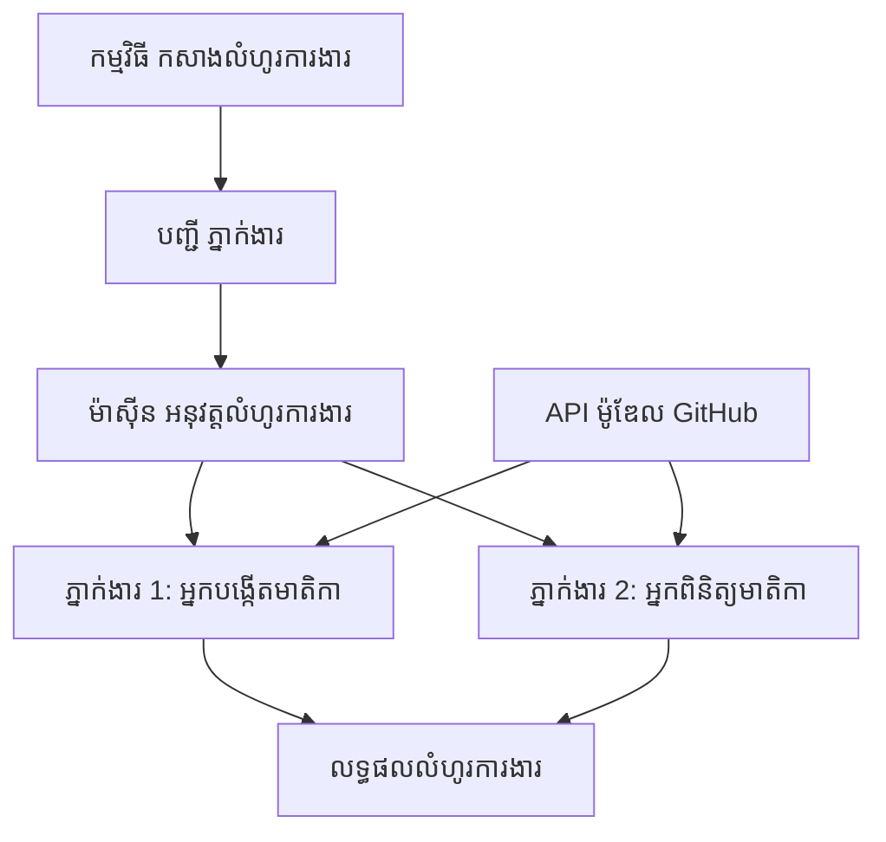

# 🔄 លំហូរការងារ​កម្រិត​មូលដ្ឋាន​សម្រាប់ភ្នាក់ងារ ជាមួយ GitHub Models (.NET)

## 📋 មេរៀន​អំពី​ការ​សម្របសម្រួល​លំហូរការងារ

កំណត់ចំណាំនេះបង្ហាញពីរបៀបសាងសង់លំហូរការងារ **ភ្នាក់ងារ** ដែលស្មុគស្មាញ ដោយប្រើ Microsoft Agent Framework សម្រាប់ .NET និង GitHub Models។ អ្នកនឹងរៀនបង្កើតដំណើរការអាជីវកម្មច្រើនជំហាន ដែលភ្នាក់ងារ AI ព្រមទាំងធ្វើការសហការដើម្បីបំពេញភារកិច្ចស្មុគស្មាមានតាមលំនាំសម្របសម្រួលដែលមានរចនាសម្ព័ន្ធ។

## 🎯 គោលដៅការរៀន

### 🏗️ **មូលដ្ឋាន​ស្ថាបត្យកម្ម​លំហូរការងារ**
- **Workflow Builder**: រចនា និងសម្របសម្រួលដំណើរការ AI ស្មុគស្មាញដែលមានជំហានច្រើន
- **Agent Coordination**: សម្របសម្រួលភ្នាក់ងារជាច្រើនដែលមានជំនាញពិសេសនៅក្នុងលំហូរការងារ
- **GitHub Models Integration**: ប្រើប្រាស់សេវាកម្មនៃការបញ្ចេញលទ្ធផលម៉ូឌែល AI របស់ GitHub ក្នុងលំហូរការងារ
- **Visual Workflow Design**: បង្កើត និងបង្ហាញរចនាសម្ព័ន្ធលំហូរការងារ ដើម្បីពន្យល់បានច្បាស់ขึ้น

### 🔄 **លំនាំសម្របសម្រួលដំណើរការ**
- **Sequential Processing**: ស្សងខ្សែភារកិច្ចភ្នាក់ងារច្រើនទៅតាមលំដាប់ត្រឹមត្រូវ
- **State Management**: ការរក្សាសារស្ថានភាព និងលំហូរទិន្នន័យទូទាំងដំណាក់កាលនៃលំហូរការងារ
- **Error Handling**: អនុវត្តន៍វិធីសាស្ត្រការស្ដារឡើងវិញពេលកើតកំហុស និងបង្កើនភាពធន់ទ្រាំរបស់លំហូរ
- **Performance Optimization**: រចនាលំហូរការងារដែលមានប្រសិទ្ធភាពសម្រាប់ប្រតិបត្តិការទំហំធំទូលាយ

### 🏢 **កម្មវិធីលំហូរការងារអង្គការ**
- **Business Process Automation**: ស្វ័យប្រវត្តិកម្មដំណើរការស្មុគស្មារីនៅក្នុងអង្គការ
- **Content Production Pipeline**: លំហូរការងារ​ការផលិត​មាតិកាដែលមានដំណាក់កាលពិនិត្យ និងអនុម័ត
- **Customer Service Automation**: ដោះស្រាយសំណួរអតិថិជនជាច្រើនជំហាន
- **Data Processing Workflows**: លំហូរការងារ ETL ដែលមានការបម្លែងដោយ AI

## ⚙️ លក្ខខណ្ឌ និង​ការ​រៀបចំ

### 📦 **កញ្ចប់ NuGet ត្រូវការ**

ការបង្ហាញលំហូរការងារនេះប្រើកញ្ចប់ .NET សំខាន់ៗជាច្រើន៖

```xml
<!-- Core AI Framework -->
<PackageReference Include="Microsoft.Extensions.AI" Version="9.9.0" />

<!-- Agent Framework (Local Development) -->
<!-- Microsoft.Agents.AI.dll - Core agent abstractions -->
<!-- Microsoft.Agents.AI.OpenAI.dll - OpenAI/GitHub Models integration -->

<!-- Configuration and Environment -->
<PackageReference Include="DotNetEnv" Version="3.1.1" />
```

### 🔑 **GitHub Models Configuration**

**ការ​កំណត់បរិយាកាស (.env file):**
```env
GITHUB_TOKEN=your_github_personal_access_token
GITHUB_ENDPOINT=https://models.inference.ai.azure.com
GITHUB_MODEL_ID=gpt-4o-mini
```

**GitHub Models Access:**
1. Sign up for GitHub Models (បច្ចុប្បន្ននៅក្នុងការ​ពិនិត្យមើល​មុន)
2. Generate a personal access token with model access permissions
3. Configure environment variables as shown above

### 🏗️ **Workflow Architecture Overview**


**ធាតុ​សំខាន់ៗ:**
- **WorkflowBuilder**: ម៉ាស៊ីនសម្របសម្រួលសំខាន់សម្រាប់រចនាលំហូរការងារ
- **AIAgent**: ភ្នាក់ងារផ្ទាល់ដែលមានជំនាញពិសេស
- **GitHub Models Client**: ការរួមបញ្ចូលសេវាកម្មចេញលទ្ធផលពីម៉ូឌែល AI
- **Execution Context**: គ្រប់គ្រងស្ថានភាព និងលំហូរទិន្នន័យរវាងដំណាក់កាលនានារបស់លំហូរការងារ

## 🎨 **លំនាំរចនាលំហូរការងារអង្គការ**

### 📝 **លំហូរការងារផលិតមាតិកា**
```
User Request → Content Generation → Quality Review → Final Output
```

### 🔍 **ដំណើរការបំលែងឯកសារ**
```
Document Input → Analysis → Extraction → Validation → Structured Output
```

### 💼 **លំហូរការងារព័ត៌មានអាជីវកម្ម**
```
Data Collection → Processing → Analysis → Report Generation → Distribution
```

### 🤝 **ស្វ័យប្រវត្តិសេវាកម្មអតិថិជន**
```
Customer Inquiry → Classification → Processing → Response Generation → Follow-up
```

## 🏢 **អត្ថប្រយោជន៍សម្រាប់អង្គការ**

### 🎯 **ភាពទៀងទាត់ និងការពង្រីក**
- **Deterministic Execution**: លទ្ធផលលំហូរការងារមានភាពស្រដៀង និងអាចធ្វើម្ដងម្កាលបានជាបន្ត
- **Error Recovery**: ដោះស្រាយកំហុសយ៉ាងចាត់ទុក និងស្ដារឡើងវិញដោយរលូននៅពេលគ្រោះថ្នាក់កើតឡើងនៅគ្រប់ដំណាក់កាល
- **Performance Monitoring**: តាមដានវិមាត្រការប្រតិបត្តិ និងឱកាសកែលម្អ
- **Resource Management**: ចែកចាយ និងប្រើប្រាស់ធនធានម៉ូឌែល AI ដោយមានប្រសិទ្ធភាព

### 🔒 **សុវត្ថិភាព និងការអនុវត្តតាម**
- **Secure Authentication**: ការផ្ទៀងផ្ទាត់សុវត្ថិភាពដោយ token របស់ GitHub សម្រាប់ចូលដល់ API
- **Audit Trails**: កំណត់ហេតុឡុកពេញលេញនៃការប្រតិបត្តិលំហូរការងារ និងចំណុចសម្រេចចិត្ត
- **Access Control**: សិទ្ធិកំណត់យ៉ាងលំអិតសម្រាប់ការប្រតិបត្តិ និងការតាមដានលំហូរការងារ
- **Data Privacy**: ការដោះស្រាយយ៉ាងសុវត្ថិភាពចំពោះព័ត៌មានយ៉ាងទន់ភ្លន់លើទាំងលំហូរការងារ

### 📊 **ការអាចមើលឃើញ និងការគ្រប់គ្រង**
- **Visual Workflow Design**: ការរចនាលំហូរការងារដែលបង្ហាញចរន្តដំណើរការ និងភាពពាក់ព័ន្ធយ៉ាងច្បាស់
- **Execution Monitoring**: តាមដានជាពេលពិតនៃដំណើរការ និងប្រសិទ្ធភាព
- **Error Reporting**: វិភាគកំហុសលម្អិត និងសមត្ថភាពដោះស្រាយបញ្ហា
- **Performance Analytics**: វិមាត្រសម្រាប់កែលម្អ និងគ្រប់គ្រងសមត្ថភាព

មកចាប់ផ្ដើមសាងសង់លំហូរការងារ AI ដែលសាកសមសម្រាប់អង្គការរបស់អ្នកដំបូងគេ! 🚀

## 💻 Running the Code

ការអនុវត្តពេញលេញមាននៅក្នុង `01.dotnet-agent-framework-workflow-ghmodel-basic.cs`។ ឯកសារនេះបង្ហាញ៖

1. **Environment Configuration** - Loading GitHub Models credentials from `.env` file
2. **OpenAI Client Setup** - Configuring the client to use GitHub Models endpoint
3. **Agent Creation** - Defining specialized agents (Front Desk and Concierge)
4. **Workflow Builder** - Creating a multi-agent workflow with sequential processing
5. **Workflow Execution** - Running the workflow with streaming results

### 🚀 ការរត់ឧទាហរណ៍

```bash
# ធ្វើឲ្យស្គ្រីបអាចអនុវត្តបាន (Unix/Linux/macOS)
chmod +x 01.dotnet-agent-framework-workflow-ghmodel-basic.cs

# រត់ដំណើរការ workflow
./01.dotnet-agent-framework-workflow-ghmodel-basic.cs
```

Or on Windows:
```powershell
dotnet run 01.dotnet-agent-framework-workflow-ghmodel-basic.cs
```

### 📝 លទ្ធផលដែលរំពឹង

លំហូរការងារនឹង:
1. ទទួលស្នើរសុំទិសដៅធ្វើដំណើររបស់អ្នក ("I would like to go to Paris")
2. ភ្នាក់ងារ Front Desk ផ្តល់អនុសាសន៍ដំបូង
3. ភ្នាក់ងារ Concierge ពិនិត្យ និងកែប្រែអនុសាសន៍
4. លទ្ធផលចុងក្រោយបង្ហាញស្ទ្រីមនៃការពិភាក្សា​ពេញលេញ

### 🔧 ការប្តូរតាមតម្រូវការ

អ្នកអាចប្តូរលំហូរការងារ ដោយ៖
- កែប្រែសេចក្តីណែនាំរបស់ភ្នាក់ងារ ដើម្បីផ្លាស់ប្ដូរប្រព្រឹត្តិ
- បន្ថែមភ្នាក់ងារបន្ថែម ដើម្បីបង្កើតលំហូរការងារ​ស្មុគស្មាញ​ច្រើនជំហាន
- ផ្លាស់ប្ដូរសារ​អ្នកប្រើ ដើម្បីសាកល្បងសេណារីយ៉ូផ្សេងៗ
- កែតម្រូវចំណុចភ្ជាប់រវាងជំហាននៃលំហូរការងារ ដើម្បីបង្កើតលំនាំប្រតិបត្តិផ្សេងៗ

---

<!-- CO-OP TRANSLATOR DISCLAIMER START -->
**ការមិនទទួលខុសត្រូវ**:
ឯកសារនេះត្រូវបានបកប្រែដោយប្រើសេវាកម្មបកប្រែ AI [Co-op Translator](https://github.com/Azure/co-op-translator). ក្នុងខណៈដែលយើងខិតខំធ្វើឲ្យត្រឹមត្រូវ សូមយកចិត្តទុកដាក់ថា ការបកប្រែដោយប្រព័ន្ធស្វ័យប្រវត្តិអាចមានកំហុស ឬភាពមិនត្រឹមត្រូវ។ ឯកសារដើមក្នុងភាសាដើមគួរត្រូវបានគេចាត់ទុកថាជាប្រភពដែលមានសុពលភាព។ សម្រាប់ព័ត៌មានសំខាន់ៗ គេសូមអនុវត្តការបកប្រែដោយអ្នកបកប្រែមនុស្សដែលមានវិជ្ជាជីវៈ។ យើងមិនទទួលខុសត្រូវចំពោះការយល់ច្រឡំ ឬការបកអត្ថន័យខុសដែលកើតឡើងពីការប្រើប្រាស់ការបកប្រែនេះទេ។
<!-- CO-OP TRANSLATOR DISCLAIMER END -->