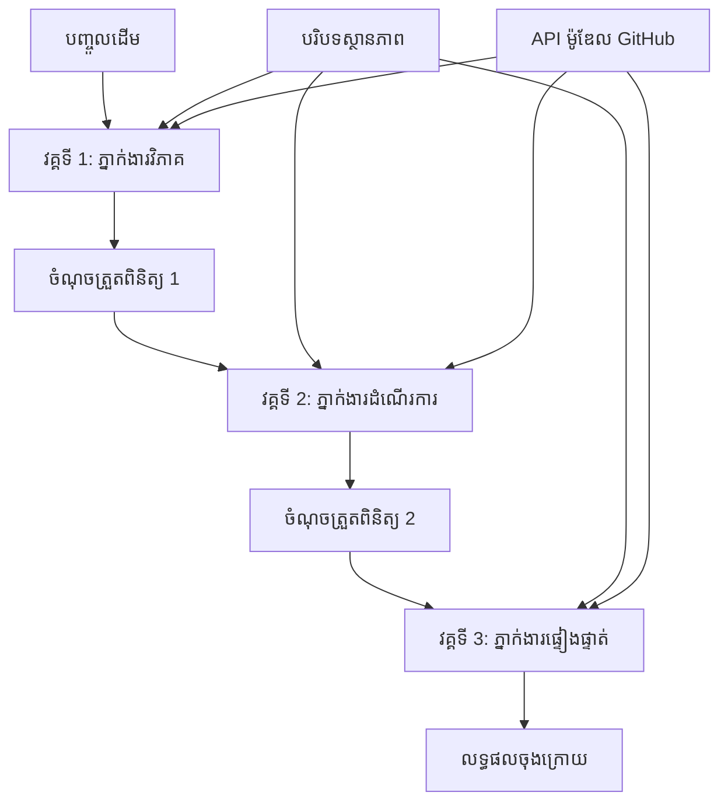

# ⏩ ដំណើរការ​ភ្នាក់ងារតាមលំដាប់ជាមួយ GitHub Models (.NET)

## 📋 មេរៀន​ពិសេស​អំពី​ការប_processedតាមលំដាប់

កំណត់ត្រានេះបង្ហាញពី **គំរូដំណើរការតាមលំដាប់** យោងទៅលើ Microsoft Agent Framework សម្រាប់ .NET និង GitHub Models។ អ្នកនឹងរៀនវិធីសាងសង់បណ្តាសមាសធាតុដំណើរការ​ដែលមានជំហានមួយៗ ដោយភ្នាក់ងារ​អនុវត្តតាមលំដាប់កំណត់ ហើយគ្រប់ជំហានក៏បានសង់ឡើងលើលទ្ធផលពីជំហានមុន។

## 🎯 គោលបំណង​សិក្សា

### 🔄 **ស្ថាបត្យកម្ម​ការប_processed​តាម​លំដាប់**
- **ការរចនាដំណើរការជារាបរ**: បង្កើតបណ្តាសមាសធាតុកាលបញ្ចប់ជា​ជំហានៗ ដែលមានការរំពឹងទុកច្បាស់លាស់
- **ការគ្រប់គ្រងស្ថានភាព**: រក្សាបរិបទ និងចរន្តទិន្នន័យរវាងជំហាននៃដំណើរការ
- **ការចូលបញ្ចូល GitHub Models**: ប្រើម៉ូដែល AI របស់ GitHub ក្នុងដំណើរការជាច្រើនជំហានក្នុង .NET
- **គំរូសង្គ្រោះសម្រាប់ស្ថាប័ន**: សង់ប្រព័ន្ធប្រតិបត្តិការ​តាមលំដាប់ដែលអាចដំណើរការនៅផលិតកម្ម

### 🏗️ **គំរូ​តាមលំដាប់​កម្រិតជាច្រើន**
- **ការដំណើរការ Stage-Gate**: អនុវត្តចំណុចផ្ទៀងផ្ទាត់នៅរវាងជំហាននីមួយៗ
- **ការរក្សាបរិបទ**: រក្សាស្ថានភាព និងចំណេះដឹងដែលបានប្រមូលសរុបឲ្យនៅទូទាំងជំហានទាំងអស់
- **ការផ្ទេរបញ្ហា (Error Propagation)**: ដោះស្រាយករណីបរាជ័យយ៉ាងហ្មត់ចត់ក្នុងខ្សែដំណើរការតាមលំដាប់
- **អុបទីម៉ីសេសន៍ប្រសិទ្ធភាព**: អនុវត្តការការបញ្ចូលតាមលំដាប់យ៉ាងមានប្រសិទ្ធភាពជាមួយចំណាយទាបបំផុត

### 🏢 **កម្មវិធីសម្រាប់ស្ថាប័នតាមលំដាប់**
- **បណ្តាសមាសឯកសារប_processed**: វិភាគឯកសារជាច្រើនជំហាន ការបម្លែង និងការផ្ទៀងផ្ទាត់
- **ដំណើរការត្រួតពិនិត្យគុណភាព**: ពិនិត្យទាយ ត្រួតពិនិត្យ និងដាក់បញ្ចាក់
- **បណ្តាសមាសផលិតខ្លឹមសារ**: ស្រាវជ្រាវ → សរសេរ → កែសម្រួល → សម្ភាស → ពិពណ៌នាផ្សព្វផ្សាយ
- **អូទូមេនកម្មវិធីអាជីវកម្ម**: ដំណើរការអាជីវកម្មជាច្រើនជំហានដែលមានការគូសគន្លងជាច្បាស់

## ⚙️ ការទាមទារ និង ការតំឡើង

### 📦 **កញ្ចប់ NuGet ត្រូវការ**

កញ្ចប់សំខាន់សម្រាប់ដំណើរការតាមលំដាប់ក្នុង .NET:

```xml
<!-- Core AI Framework -->
<PackageReference Include="Microsoft.Extensions.AI" Version="9.9.0" />

<!-- Client Model Abstractions -->
<PackageReference Include="System.ClientModel" Version="1.6.1.0" />

<!-- Azure Identity and Async LINQ Support -->
<PackageReference Include="Azure.Identity" Version="1.15.0" />
<PackageReference Include="System.Linq.Async" Version="6.0.3" />

<!-- Local Agent Framework References -->
<!-- Microsoft.Agents.AI.dll - Core agent abstractions -->
<!-- Microsoft.Agents.AI.OpenAI.dll - GitHub Models integration -->
```

### 🔑 **ការកំណត់រចនាសម្ព័ន្ធ GitHub Models**

**ការតំឡើងបរិយាកាស (.env file):**
```env
GITHUB_TOKEN=your_github_personal_access_token
GITHUB_ENDPOINT=https://models.inference.ai.azure.com
GITHUB_MODEL_ID=gpt-4o-mini
```

**ការគ្រប់គ្រងការកំណត់រចនាសម្ព័ន្ធ:**
```csharp
// Load environment variables securely
Env.Load("../../../.env");
var githubToken = Environment.GetEnvironmentVariable("GITHUB_TOKEN");
var githubEndpoint = Environment.GetEnvironmentVariable("GITHUB_ENDPOINT");
var modelId = Environment.GetEnvironmentVariable("GITHUB_MODEL_ID");
```

### 🏗️ **ស្ថាបត្យកម្ម​ដំណើរការតាមលំដាប់**


**ធាតុសំខាន់ៗ:**
- **ភ្នាក់ងារតាមលំដាប់**: ភ្នាក់ងារឯកទេសសម្រាប់ជំហាននីមួយៗនៃការប_processed
- **បរិបទស្ថានភាព**: រក្សាទិន្នន័យនិងការសម្រេចចិត្តដែលបានប្រមូលសរុបនៅទូទាំងជំហាន
- **ចំណុចផ្ទៀងផ្ទាត់**: ចំណុចផ្ទៀងផ្ទាត់រវាងជំហានដើម្បីធានាគុណភាព និងភាពស្របតាមគ្នា
- **GitHub Models Client**: ការចូលដំណើរការ​ម៉ូដែល AI បានស្របគ្នាក្នុងគ្រប់ជំហាននៃដំណើរការ

## 🎨 **គំរូរចនាដំណើរការតាមលំដាប់**

### 📝 **បណ្តាសមាសដំណើរការការប_processedឯកសារ**
```
Raw Document → Content Extraction → Analysis → Validation → Structured Output
```

### 🎯 **ដំណើរការបង្កើតខ្លឹមសារ**
```
Brief/Requirements → Research → Content Creation → Review → Final Polish
```

### 🔍 **បណ្តាសមាសត្រួតពិនិត្យគុណភាព**
```
Initial Review → Technical Validation → Compliance Check → Final Approval
```

### 💼 **ដំណើរការបញ្ញាអាជីវកម្ម (Business Intelligence)**
```
Data Collection → Processing → Analysis → Report Generation → Distribution
```

## 🏢 **អត្ថប្រយោជន៍សម្រាប់ស្ថាប័ននៃដំណើរការតាមលំដាប់**

### 🎯 **ភាពទុកចិត្ត & គុណភាព**
- **ការប_processed ដោយកំណត់អត្តសញ្ញាណ**: លទ្ធផលដែលមានភាពសរសេរ និងអាចធ្វើឡើងម្តងទៀតតាមរយៈជំហាន​ដែលរចនាឡើង
- **ទ្វារគុណភាព**: ចំណុចផ្ទៀងផ្ទាត់ធានាគុណភាពនៅរៀងរាល់ជំហាន
- **ការចែកដាច់កំហុស**: បញ្ហានៅក្នុងជំហានមួយមិនលាតត្រវូតទៅជំហានបន្ទាប់
- **តាមដានការអនុវត្ត**: ការចងក្រងព្រឹត្តិការណ៍នៃការសម្រេចចិត្ត និងការបម្លែង​នៅរៀងរាល់ជំហាន

### 📈 **ការមានសមត្ថភាពត្រូវបានតម្លាភាព & ប្រសិទ្ធភាព**
- **រចនាបែបម៉ូឌុល**: រាល់ជំហានអាចត្រូវបានបង្កើនប្រសិទ្ធភាពដោយឡែក
- **ការគ្រប់គ្រងធនធាន**: ការធ្វើចំណាត់ថ្នាក់ប្រើប្រាស់ធនធានម៉ូដែល AI ជាយូរអង្វែងក្នុងជំហាននានា
- **អុបទីម៉ីសេសិនស្ថានភាព**: ការបញ្ជូនស្ថានភាពតិចបំផុតរវាងជំហានសម្រាប់ប្រសិទ្ធភាពខ្ពស់
- **ក្រុមជំហានប៉ារ៉ាឡែល**: បណ្តាដំណើរការតាមលំដាប់ជាច្រើនអាចដំណើរការយល់ទៅព្រមជាមួយគ្នាបាន

### 🔒 **សុវត្ថិភាព & ការពេញស្របច្បាប់**
- **សុវត្ថិភាពថ្នាក់ជំហាន**: គោលនយោបាយសុវត្ថិភាពខុសគ្នាសម្រាប់ជំហានប_processing 다양한
- **ការផ្ទៀងផ្ទាត់ទិន្នន័យ**: ធានាថាភាពសេរីនៃទិន្នន័យ និងការអនុវត្តតាមខ្ទង់ច្បាប់នៅរៀងរាល់ចំណុចផ្ទៀងផ្ទាត់
- **ការត្រួតពិនិត្យការចូលដំណើរការ**: សិទ្ធិលំដាប់លម្អិតសម្រាប់ជំហាននីមួយៗនៃដំណើរការ
- **ការទៅជាមួយបទបញ្ជា**: ត្រូវគោរពតាមលក្ខខណ្ឌនានារបស់អាជ្ញាធរ​តាមរយៈដំណើរការ​ដែលរចនាឡើង

### 📊 **ការត្រួតពិនិត្យ & វិភាគ**
- **មាត្រដ្ឋានថ្នាក់ជំហាន**: ត្រួតពិនិត្យប្រសិទ្ធភាពសម្រាប់រាល់ជំហាន
- **រកឃើញចំណុចចង្កោម**: កំណត់ និងអុបទីម៉ៃសកម្មភាពជំហានដែលយឺត
- **មាត្រដ្ឋានគុណភាព**: តាមដានគុណភាព និងអត្រាការជោគជ័យនៅរៀងរាល់ជំហាន
- **បង្កើនដំណើរការ**: សមិទ្ធផលបន្តបន្ទាប់ដោយផ្អែកលើវិភាគថ្នាក់ជំហាន

សូមចាប់ផ្តើមសាងសង់បណ្តាសមាសដំណើរការ AI តាមលំដាប់ដែលមានថែទាំល្អ! 🚀

## 💻 ការប្រតិបត្តិកម្មកូដ

ការអនុវត្តពេញលេញមាននៅក្នុង `02.dotnet-agent-framework-workflow-ghmodel-sequential.cs`។ ឯកសារនេះបង្ហាញពី **ដំណើរការ​វិភាគឧបករណ៍គ្រឿងសង្ហារិម៣ជំហាន**:

1. **ជំហានទី ១ - ភ្នាក់ងារ​ Sales**: វិភាគរូបភាពគ្រឿងសង្ហារិម និងផ្តល់យោបល់ទិញ
2. **ជំហានទី ២ - ភ្នាក់ងារ Price**: ផ្តល់ការបំបែកតម្លៃលម្អិត និងជម្រើស​តាមថវិកា
3. **ជំហានទី ៣ - ភ្នាក់ងារ Quote**: បង្កើតឯកសារ​សម្រង់តម្លៃបែបអាជីពក្នុងទ្រង់ទ្រាយ Markdown

### 🏗️ **ស្ថាបត្យកម្មដំណើរការ**

```
Image Input → Sales Analysis → Price Estimation → Quote Generation → Final Output
```

រាល់ភ្នាក់ងារ:
- ទទួលលទ្ធផលពីជំហានមុនជា​បរិបទ
- សង់លើវិភាគមុនជាមួយជំនាញពិសេស
- រក្សាតំណរភាពរបស់ដំណើរការតាមរយៈការគ្រប់គ្រងស្ថានភាព

### 🚀 រត់ឧទាហរណ៍

**តម្រូវការមុនពេលដំណើរការ:**
- ដាក់រូបភាពគ្រឿងសង្ហារិមនៅ `../imgs/home.png` (ឬផ្លាស់ប្ដូរតម្លៃអថេរ `imgPath`)
- កំណត់រចនាសម្ព័ន្ធឯកសារ `.env` របស់អ្នកជាមួយលេខសម្គាល់ GitHub Models

```bash
# ធ្វើឲ្យស្គ្រីបអាចអនុវត្តបាន (Unix/Linux/macOS)
chmod +x 02.dotnet-agent-framework-workflow-ghmodel-sequential.cs

# រត់ដំណើរការតាមលំដាប់
./02.dotnet-agent-framework-workflow-ghmodel-sequential.cs
```

ឬនៅលើ Windows:
```powershell
dotnet run 02.dotnet-agent-framework-workflow-ghmodel-sequential.cs
```

### 📝 លទ្ធផលដែលគេរំពឹងទុក

ដំណើរការនឹង:
1. **ភ្នាក់ងារ Sales**: កំណត់ប្រភេទគ្រឿងសង្ហារពីរូបភាព និងផ្តល់អនុសាសន៍
2. **ភ្នាក់ងារ Price**: បន្ថែមវិភាគតម្លៃលម្អិតជាមួយកម្រិតថវិកា និងអនុសាសន៍អំពីកន្លែងទិញ
3. **ភ្នាក់ងារ Quote**: បង្កើតឯកសារសម្រង់តម្លៃដែលមានទ្រង់ទ្រាយល្អ និងសម្រួលព័ត៌មានទាំងអស់

លទ្ធផលចុងក្រោយនឹងជាเอกសារសម្រង់តម្លៃគ្រឿងសង្ហារិមដែលមានលក្ខណៈវិជ្ជាជីវៈ និងមូលដ្ឋានលើការវិភាគរូបភាព។

### 🔧 ជម្រើសកែច្នៃ

**ប្ដូរខាងដំណើរការភ្នាក់ងារ:**
```csharp
// Adjust agent instructions to change their focus
const string SalesAgentInstructions = "Your custom instructions...";
```

**ផ្លាស់ប្ដូររៀបចំផ្លូវលំដាប់:**
```csharp
// Add or reorder workflow stages
var workflow = new WorkflowBuilder(salesagent)
    .AddEdge(salesagent, priceagent)
    .AddEdge(priceagent, quoteagent)
    .AddEdge(quoteagent, newAgent)  // Add another stage
    .Build();
```

**ប្រើបញ្ចូលខុសពីនេះ:**
```csharp
// Process text instead of images
ChatMessage userMessage = new ChatMessage(ChatRole.User, [
    new TextContent("Analyze pricing for a modern living room set")
]);
```

### 🎯 ករណីប្រើប្រាស់ពិតប្រាកដ

គំរូតាមលំដាប់នេះសាកសមសម្រាប់:
- **អេឡិចត្រូនិកពាណិជ្ជកម្ម**: វិភាគផលិតផល → ការកំណត់តម្លៃ → ការបង្កើតសម្រង់តម្លៃ
- **អចលនទ្រព្យ**: វិភាគអចលនទ្រព្យ → ការកំណត់តម្លៃ → ការបង្កើតបញ្ជីលក់
- **ធានារ៉ាប់រង**: វិភាក្សាអំពីការទាមទារ → ការវាយតម្លៃ → ការបង្កើតសម្រង់តម្លៃ
- **ការបង្កើតខ្លឹមសារ**: ស្រាវជ្រាវ → សរសេរ → កែសម្រួល → បោះពុម្ភផ្សព្វផ្សាយ

### 🔍 យល់ដឹងអំពីចរន្តស្ថានភាព

រាល់ភ្នាក់ងារ​នៅក្នុងខ្សែអនុវត្តន៍ទទួល:
- **បញ្ចូលដើម**: សារ​ចាប់ផ្ដើម​របស់អ្នកប្រើ (រូបភាព + អត្ថបទ)
- **លទ្ធផលពីភ្នាក់ងារមុន**: តម្លៃតបពីភ្នាក់ងារមុនទាំងអស់ក្នុងប្រវត្តិការសន្ទនា
- **បរិបទដែលបានប្រមូលសរុប**: ស្ថានភាពពេញលេញដែលបានរក្សាទុករួមទាំងដំណើរការទាំងមូល

នេះធ្វើឲ្យអាចមានដំណើរការជាច្រើនជំហាន​យ៉ាងស្មុគស្មាញ ដែលរាល់ភ្នាក់ងាររៀបចំឡើងលើបរិបទពេញលេញពីរាល់ជំហានមុនៗ។

---

<!-- CO-OP TRANSLATOR DISCLAIMER START -->
**ការមិនទទួលខុសត្រូវ**:
ឯកសារនេះត្រូវបានបកប្រែក្នុងការប្រើសេវាបកប្រែ AI [Co-op Translator](https://github.com/Azure/co-op-translator)។ ខណៈពេលដែលយើងខិតខំប្រឹងរកភាពត្រឹមត្រូវ សូមចំណាំថាការបកប្រែដោយស្វ័យប្រវត្តិក្នុងឯកសារនេះអាចមានកំហុស ឬមិនត្រឹមត្រូវ។ ឯកសារដើមនៅក្នុងភាសាដើមគួរត្រូវបានចាត់ទុកថាជាប្រភពដែលមានសុពលភាព។ សម្រាប់ព័ត៌មានសំខាន់ៗ យើងសូមណែនាំឲ្យបកប្រែដោយអ្នកបកប្រែដែលមានជំនាញមនុស្ស។ យើងមិនទទួលខុសត្រូវចំពោះការយល់ច្រឡំ ឬការបកប្រែខុសត្រូវណាមួយ ដែលកើតមានដោយសារការប្រើប្រាស់ការបកប្រែនេះទេ។
<!-- CO-OP TRANSLATOR DISCLAIMER END -->