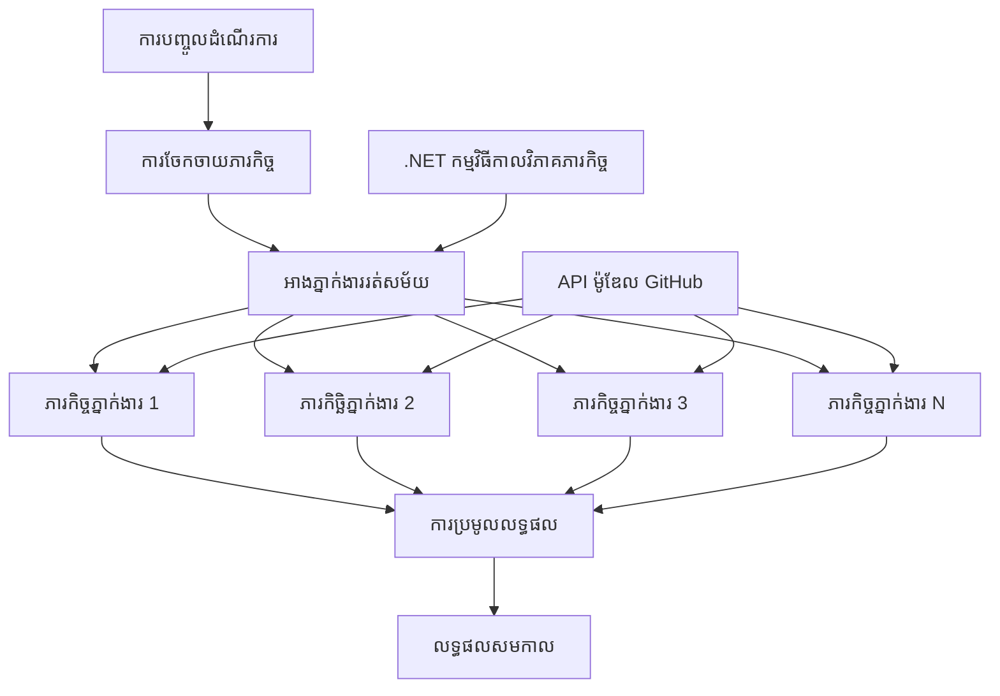

# ⚡ លំហាត់ការងារ Agent ដំណើរការជាសម័យដោយប្រើ GitHub Models (.NET)

## 📋 មេរៀនចង្អុលអំពីការពហុសម័យដែលមានប្រសិទ្ធភាពខ្ពស់

សៀវភៅកំណត់នេះបង្ហាញពី **លំនាំលំហាត់ដែលដំណើរការជាសម័យគ្នា** ដោយប្រើ Microsoft Agent Framework សម្រាប់ .NET និង GitHub Models។ អ្នកនឹងរៀនវិធីសាស្ត្រក្នុងការបង្កើតលំហាត់ដំណើរការពហុសម័យដែលមានប្រសិទ្ធភាពខ្ពស់ ដើម្បីបង្កើនផលចេញដោយរត់ភ្នាក់ងារយ៉ាងច្រើននៅពេលតែមួយ ហើយនៅព្រមទាំងរក្សាការសម្របសម្រួល និងតម្លភាពទិន្នន័យ។

## 🎯 វត្ថុបំណងរៀន

### 🚀 **មូលដ្ឋាននៃការប្រតិបត្តិការជាសម័យ**
- **Parallel Agent Execution**: រត់ភ្នាក់ងារ AI មួយចំនួននៅពេលតែមួយសម្រាប់ប្រសិទ្ធភាពអតិបរមា
- **Async/Await Patterns**: ប្រើគំរូកម្មវិធី async របស់ .NET សម្រាប់ការប្រតិបត្តិការជាសម័យដែលមានប្រសិទ្ធភាព
- **GitHub Models Integration**: សម្របសម្រួលការហៅម៉ូឌែល AI របស់ GitHub ជាច្រើនក្នុងពេលតែមួយ
- **Resource Management**: គ្រប់គ្រងធនធានម៉ូឌែល AI យ៉ាងមានប្រសិទ្ធភាពក្នុងលំហាត់ប្រតិបត្តិការជាសម័យ

### 🏗️ **ស្ថាបត្យកម្មភាពប្រតិបត្តិការជាសម័យកម្រិតខ្ពស់**
- **Task-Based Parallelism**: ប្រើ .NET Task Parallel Library សម្រាប់ការប្រតិបត្តិការជាសម័យដែលអoptីម៉ាល់
- **Synchronization Patterns**: សម្របសម្រួលភ្នាក់ងារជាសម័យខណៈដែលជៀសវាងលក្ខខណ្ឌប្រណឹងទល់
- **Load Balancing**: ចែកចាយការងារយ៉ាងមានប្រសិទ្ធភាពជំនួញសមត្ថភាពការកែវ
- **Fault Tolerance**: គ្រប់គ្រងភាពខូចខាតនៅលើភ្នាក់ងារតែមួយដោយមិនបង្ខំឱ្យលំហាត់សរុបឈប់

### 🏢 **កម្មវិធីអេនធើប្រ៉ាយ즈ប្រតិបត្តិការជាសម័យ**
- **High-Volume Document Processing**: ដំណើរការឯកសារជាច្រើននៅពេលតែមួយ
- **Real-Time Content Analysis**: វិភាគមាតិកាដែលចូលមកក្នុងពេលពិតជាសម័យ
- **Batch Processing Optimization**: បង្កើនផលចេញសម្រាប់ប្រតិបត្តិការទិន្នន័យទំហំធំ
- **Multi-Modal Analysis**: ដំណើរការប្រភេទមាតិកាផ្សេងៗជាប្រភេទសម័យពីរឬច្រើន

## ⚙️ លក្ខខណ្ឌមុន និង ការតំឡើង

### 📦 **កញ្ចប់ NuGet ត្រូវការ**

កញ្ចប់គតិយុត្តសម្រាប់លំហាត់ប្រតិបត្តិការជាសម័យដែលមានប្រសិទ្ធភាពខ្ពស់:

```xml
<!-- Core AI Framework with Async Support -->
<PackageReference Include="Microsoft.Extensions.AI" Version="9.9.0" />

<!-- Client Model Abstractions for API Communication -->
<PackageReference Include="System.ClientModel" Version="1.6.1.0" />

<!-- Azure Identity and Async LINQ for Advanced Operations -->
<PackageReference Include="Azure.Identity" Version="1.15.0" />
<PackageReference Include="System.Linq.Async" Version="6.0.3" />

<!-- Local Agent Framework References -->
<!-- Microsoft.Agents.AI.dll - Core agent abstractions with async support -->
<!-- Microsoft.Agents.AI.OpenAI.dll - GitHub Models integration with concurrency -->
```

### 🔑 **ការកំណត់ GitHub Models**

**Environment Setup (.env file):**
```env
GITHUB_TOKEN=your_github_personal_access_token
GITHUB_ENDPOINT=https://models.inference.ai.azure.com
GITHUB_MODEL_ID=gpt-4o-mini
```

**ការពិចារណាក្នុងការប្រតិបត្តិការជាសម័យ:**
```csharp
// Configure for concurrent operations
var clientOptions = new OpenAIClientOptions()
{
    Endpoint = new Uri(githubEndpoint),
    // Configure connection pooling for concurrent requests
    NetworkTimeout = TimeSpan.FromMinutes(5)
};
```

### 🏗️ **ស្ថាបត្យកម្មលំហាត់ប្រតិបត្តិការជាសម័យ**



**ធាតុសំខាន់ៗ:**
- **Task Parallel Library**: គាំទ្រដែលមាននៅក្នុង .NET សម្រាប់ប្រតិបត្តិការជាសម័យ
- **Agent Pool**: អ្នកភ្នាក់ងារច្រើនសម្រាប់ដំណើរការជាសម័យ
- **Result Aggregation**: ការសម្របសម្រួល និងការរួមបញ្ចូលលទ្ធផលពីភ្នាក់ងារជាសម័យ
- **Synchronization Points**: ប្រាកដភាពនៃតម្លភាពទិន្នន័យក្នុងលំហាត់ប្រតិបត្តិការជាសម័យ

## 🎨 **លំនាំការរចនាលំហាត់ប្រតិបត្តិការជាសម័យ**

### 🔍 **ការស្រាវជ្រាវ និងវិភាគដំណើរការពហុសម័យ**
```
Research Topic → Concurrent Research Agents → Result Synthesis → Final Report
```

### 📊 **ការដំណើរការទិន្នន័យពីប្រភពច្រើន**
```
Data Sources → Parallel Processing Agents → Data Integration → Unified Output
```

### 🎭 **បណ្ដាញផលិតមាតិកា**
```
Content Requirements → Concurrent Content Generators → Quality Review → Final Content
```

### 🔄 **Fan-Out/Fan-In Processing**
```
Single Input → Multiple Concurrent Processors → Result Aggregation → Single Output
```

## 🏢 **អត្ថប្រយោជន៍សមត្ថភាពសម្រាប់អេនធើប្រ៉ាយ즈**

### ⚡ **Throughput & Scalability**
- **Linear Performance Scaling**: បន្ថែមភ្នាក់ងារជាសម័យបន្ថែមដើម្បីបង្កើនផលចេញ
- **Resource Utilization**: ប្រើប្រាស់សមត្ថភាពម៉ូឌែល AI បានយ៉ាងមានប្រសិទ្ធភាព
- **Reduced Processing Time**: កាត់បន្ថយពេលកំណត់ដោយរក្សាភាពបន្តតាមការប្រតិបត្តិការពហុសម័យ
- **Elastic Scaling**: ដាក់បរិមាណភ្នាក់ងារជាសម័យយ៉ាងអាចបត់បែនដោយផ្អែកលើបន្ទុកការ

### 🛡️ **Reliability & Resilience**
- **Fault Isolation**: ការខូចខាតនៅលើភ្នាក់ងារតែមួយមិនប៉ះពាល់ដល់ប្រតិបត្តិការផ្សេងទៀត
- **Graceful Degradation**: ប្រព័ន្ធនៅបន្តដំណើរការដោយកម្រិតភ្នាក់ងារតិចជាងមុន
- **Error Recovery**: ម៉េកានិស៊ីម Retry ស្វ័យប្រវត្តិសម្រាប់ប្រតិបត្តិការជាសម័យដែលបរាជ័យ
- **Load Distribution**: ចែកចាយការងារយ៉ាងស្មើស្មាតនៅលើភ្នាក់ងារដែលមាន

### 📊 **ការត្រួតពិនិត្យសមត្ថភាព**
- **Concurrent Execution Metrics**: តាមដានសមត្ថភាពនៃប្រតិបត្តិការពហុសម័យទាំងអស់
- **Resource Usage Analytics**: តាមដានការប្រើប្រាស់ CPU, ម៉េមូរី និងបណ្តាញ
- **Throughput Analysis**: វាស់កម្រាស់ការកើនឡើងនៃប្រសិទ្ធភាពពីការប្រតិបត្តិការជាសម័យ
- **Bottleneck Detection**: កំណត់ និងដោះស្រាយកំណត់ខ្សោយប្រសិទ្ធភាព

### 🔧 **ការអភិវឌ្ឍន៍ និងប្រតិបត្តិការ**
- **Async Programming Model**: ប្រើគំរូ async/await ដែលមានល្បីនៅ .NET
- **Task Coordination**: សមត្ថភាពគ្រប់គ្រង និងសម្របសម្រួលកិច្ចការ
- **Exception Handling**: ការគ្រប់គ្រងកំហុសដ៏ទូលំទូលាយសម្រាប់ប្រតិបត្តិការជាសម័យ
- **Debugging Support**: ឧបករណ៍ Debugging របស់ Visual Studio សម្រាប់លំហាត់ប្រតិបត្តិការជាសម័យ

ចាប់ផ្តើមបង្កើតលំហាត់ AI ជាសម័យដែលមានប្រសិទ្ធភាពខ្ពស់ជាមួយ .NET! 🚀

## 💻 ការរត់កូដ

ការអនុវត្តពេញលេញមានក្នុង `03.dotnet-agent-framework-workflow-ghmodel-concurrent.cs`។ ឯកសារនេះបង្ហាញពី **Fan-Out/Fan-In concurrent workflow** សម្រាប់ការធ្វើផែនការជំនួញដំណើរ:

### 🏗️ **ស្ថាបត្យកម្មលំហាត់**

```
User Request → ConcurrentStartExecutor → [Researcher Agent || Planner Agent] → ConcurrentAggregationExecutor → Final Output
```

**ធាតុសំខាន់ៗ:**

1. **ConcurrentStartExecutor**: ផ្សព្វផ្សាយសំណើរពីអ្នកប្រើទៅភ្នាក់ងារទាំងអស់នៅពេលតែមួយ
2. **Researcher Agent**: វិភាគគោលដៅ និងទឹចលំអិតនៅក្នុងលំហាត់ជាសម័យ
3. **Planner Agent**: បង្កើតផែនការធ្វើដំណើរដោយមានព័ត៌មានលម្អិតនៅក្នុងលំហាត់ជាសម័យ
4. **ConcurrentAggregationExecutor**: ប្រមូល និងច្របាច់លទ្ធផលពីភ្នាក់ងារទាំងពីរ

### 🎯 **លំនាំ Fan-Out/Fan-In**

លំហាត់នេះបង្ហាញលំនាំបែបបុរាណ **Fan-Out/Fan-In**:
- **Fan-Out**: សារ εισ្រួចមួយត្រូវបានផ្សព្វផ្សាយទៅភ្នាក់ងារច្រើននៅពេលតែមួយ
- **Concurrent Processing**: ភ្នាក់ងារជាច្រើនប្រតិបត្តិការជាសម័យលើកិច្ចការเดียว
- **Fan-In**: លទ្ធផលពីភ្នាក់ងារទាំងអស់ត្រូវបានប្រមូល និងរួមចំណូលទៅជាកម្មវិធីចេញតែមួយ

### 🚀 រត់ឧទាហរណ៍នេះ

```bash
# ធ្វើឱ្យស្គ្រីបអាចអនុវត្តបាន (Unix/Linux/macOS)
chmod +x 03.dotnet-agent-framework-workflow-ghmodel-concurrent.cs

# រត់លំហូរដំណើរការងារដែលប្រតិបត្តនៅពេលតែមួយ
./03.dotnet-agent-framework-workflow-ghmodel-concurrent.cs
```

Or on Windows:
```powershell
dotnet run 03.dotnet-agent-framework-workflow-ghmodel-concurrent.cs
```

### 📝 លទ្ធផលរំពឹងទុក

លំហាត់នឹង:
1. **Broadcast Request**: ផ្ញើ "Plan a trip to Seattle in December" ទៅភ្នាក់ងារទាំងពីរ
2. **Concurrent Processing**: ភ្នាក់ងារទាំងពីរធ្វើការជាសម័យ:
   - Researcher ស្វែងរកទីកន្លែងទាក់ទាញ និងព័ត៌មានលម្អិត
   - Planner បង្កើត Itinerary និងលក្ខខណ្ឌដឹកជញ្ជូន
3. **Aggregation**: រួមបញ្ចូលចម្លើយទាំងពីរទៅជាលទ្ធផលសរុប
4. **Display Results**: បង្ហាញផែនការធ្វើដំណើរដែលបានច្របាច់ជាមួយព័ត៌មានទាំងអស់

### 🔧 ជម្រើសផ្ទាល់ខ្លួន

**Add More Concurrent Agents:**
```csharp
// Create additional specialized agents
AIAgent budgetAgent = openAIClient.GetChatClient(github_model_id).CreateAIAgent(
    name: "Budget-Agent", instructions: "Calculate travel costs...");

// Add to fan-out
var workflow = new WorkflowBuilder(startExecutor)
    .AddFanOutEdge(startExecutor, targets: [researcherAgent, plannerAgent, budgetAgent])
    .AddFanInEdge(aggregationExecutor, sources: [researcherAgent, plannerAgent, budgetAgent])
    .WithOutputFrom(aggregationExecutor)
    .Build();

// Update aggregation count
if (this._messages.Count == 3) { ... }
```

**Modify Agent Instructions:**
```csharp
const string ResearcherAgentInstructions = "Your custom instructions for research...";
const string PlanAgentInstructions = "Your custom instructions for planning...";
```

**Change the Task:**
```csharp
StreamingRun run = await InProcessExecution.StreamAsync(
    workflow, 
    "Plan a European vacation for 2 weeks in summer"
);
```

### 🎯 ករណីប្រើប្រាស់ពិតប្រាកដ

លំនាំប្រតិបត្តិការជាសម័យនេះសមស្របសម្រាប់:
- **Content Creation**: អ្នកនិពន្ធជាច្រើនបង្កើតផ្នែកផ្សេងៗនៅពេលតែមួយ
- **Code Review**: អ្នកពិនិត្យច្រើនវិភាគកូដពីទិដ្ឋភាពផ្សេងៗ
- **Market Research**: វិភាគផ្សារជាបន្តបន្ទាប់ពីផ្នែកផ្សេងៗ
- **Document Processing**: ដកយក, វិភាគ និងផ្ទៀងផ្ទាត់ដោយរួមគ្នាជាសម័យ
- **Multi-Perspective Analysis**: ទទួលបានទស្សនវិស័យច្រើនលើទិន្នន័យដូចគ្នា

### 🔍 យល់ដឹងអំពី Executors ផ្ទាល់ខ្លួន

**ConcurrentStartExecutor:**
- Implements `IMessageHandler<string>` ដើម្បីទទួលអញ្ញាណបញ្ចូលជាសារខ្សែអក្សរ
- ផ្សព្វផ្សាយសារ​ទៅភ្នាក់ងារ​ដែលភ្ជាប់ទាំងអស់
- ផ្ញើ `TurnToken` ដើម្បីបង្កើតការដំណើរការជាសម័យ

**ConcurrentAggregationExecutor:**
- Implements `IMessageHandler<ChatMessage>` ដើម្បីទទួលចម្លើយពីភ្នាក់ងារ
- ប្រមូលសារជាមួយវិធីសាស្ត្រដែលមានសុវត្ថិភាពច្រកចរ
- រួមបញ្ចូលពេលដែលចម្លើយទាំងអស់ដែលបានរំពឹងមកដល់
- បង្ហាញលទ្ធផលចុងក្រោយដោយប្រើ `context.YieldOutputAsync()`

### ⚡ អត្ថប្រយោជន៍សមត្ថភាព

**Concurrent vs Sequential:**
- Sequential: Agent1 (30s) → Agent2 (30s) = **សរុប 60 វិនាទី**
- Concurrent: Agent1 (30s) || Agent2 (30s) = **សរុប 30 វិនាទី**

**Throughput improvement**: លឿនដល់ N× សម្រាប់ភ្នាក់ងារជា N (អាស្រ័យលើបន្ទុកការ និងធនធាន)

### 🛡️ ការគ្រប់គ្រងកំហុស

លំហាត់នេះដោះស្រាយករណីភ្នាក់ងារមួយបរាជ័យដោយយ៉ាងទន់ភ្លន់:
- ប្រសិនបើភ្នាក់ងារមួយបរាជ័យ ភ្នាក់ងារផ្សេងទៀតនៅតែបន្តដំណើរការ
- Aggregator អាចអនុវត្តយុទ្ធសាស្ត្រពេលកំណត់ (timeout)
- អាចត្រឡប់លទ្ធផលខ្លះៗបានប្រសិនបើចាំបាច់

### 📊 លក្ខណៈពិសេសកម្រិតខ្ពស់

**Dynamic Agent Count:**
Modify the aggregation logic to support variable agent counts:

```csharp
private int _expectedAgentCount;
private readonly List<ChatMessage> _messages = [];

public async ValueTask HandleAsync(ChatMessage message, IWorkflowContext context)
{
    this._messages.Add(message);
    if (this._messages.Count == _expectedAgentCount)
    {
        // Process aggregation
    }
}
```

លំនាំលំហាត់ប្រតិបត្តិការជាសម័យនេះគឺសំខាន់សម្រាប់ការបង្កើតប្រព័ន្ធភ្នាក់ងារ AI ដែលមានប្រសិទ្ធភាព និងអាចពង្រីកបាន!

---

<!-- CO-OP TRANSLATOR DISCLAIMER START -->
**Disclaimer**:
ឯកសារនេះត្រូវបានបកប្រែដោយប្រើសេវាបកប្រែដោយបច្ចេកវិទ្យា AI [Co-op Translator](https://github.com/Azure/co-op-translator). ទោះយើងខំប្រឹងដើម្បីភាពត្រឹមត្រូវ សូមយកចិត្តទុកដាក់ថាការបកប្រែដោយស្វ័យប្រវត្តិអាចមានកំហុស ឬភាពមិនត្រឹមត្រូវ។ ឯកសារដើមក្នុងភាសាដើមគួរត្រូវបានទទួលស្គាល់ថាជាប្រភពផ្លូវការ។ សម្រាប់ព័ត៌មានសំខាន់ៗ យើងណែនាំឱ្យប្រើការបកប្រែដោយមនុស្សជាជំនាញ។ យើងមិនទទួលខុសត្រូវចំពោះការយល់ច្រឡំ ឬការបកប្រែខុសណាមួយដែលកើតមានពីការប្រើប្រាស់ការបកប្រែនេះ។
<!-- CO-OP TRANSLATOR DISCLAIMER END -->